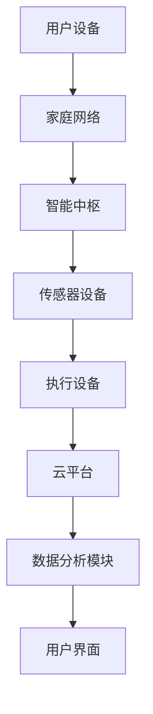

                 

关键词：智能家居、注意力经济、人机交互、用户体验、数据分析、算法优化

> 摘要：本文深入探讨了智能家居与注意力经济的融合，通过分析智能家居的背景和发展趋势，结合注意力经济原理，探讨了二者结合的可能性和优势。文章提出了智能家居与注意力经济融合的框架，介绍了核心算法原理和数学模型，并提供了实际应用场景和未来展望。

## 1. 背景介绍

### 1.1 智能家居的兴起

智能家居（Smart Home）是指利用先进的计算机技术、网络通信技术和传感器技术，将家中的各种设备互联互通，实现智能化管理和控制。近年来，随着物联网（IoT）技术的快速发展，智能家居行业迎来了爆发式增长。从智能灯泡、智能插座，到智能空调、智能门锁，各类智能家居产品不断涌现，为人们的生活带来了极大的便利。

### 1.2 注意力经济的重要性

注意力经济（Attention Economy）是指在信息过载的时代，用户的注意力成为了一种稀缺资源，获取用户的注意力成为企业竞争的关键。随着移动互联网的普及，用户的时间碎片化、信息爆炸化，使得注意力经济愈发重要。企业通过精准投放内容、优化用户体验，吸引和留住用户，实现商业价值的最大化。

## 2. 核心概念与联系

### 2.1 智能家居系统架构图

为了更好地理解智能家居与注意力经济的融合，我们先来介绍智能家居系统的架构。以下是一个简化的智能家居系统架构图：



### 2.2 注意力经济在智能家居中的应用

注意力经济在智能家居中的应用主要体现在以下几个方面：

- **内容推荐**：通过分析用户的日常生活习惯和行为模式，智能中枢可以推荐最适合用户的内容和服务，提高用户粘性。
- **个性化服务**：根据用户的需求和偏好，智能家居系统可以提供个性化的服务，满足用户的个性化需求。
- **互动体验**：智能家居设备可以通过语音、图像等多种方式与用户互动，提高用户的参与度和满意度。

## 3. 核心算法原理 & 具体操作步骤

### 3.1 算法原理概述

智能家居与注意力经济的融合主要依赖于以下几个核心算法：

- **行为分析算法**：通过分析用户的行为数据，识别用户的偏好和需求。
- **推荐算法**：基于用户的行为数据，推荐最适合用户的内容和服务。
- **人机交互算法**：优化智能家居设备与用户的互动体验。

### 3.2 算法步骤详解

#### 3.2.1 行为分析算法

1. 收集用户数据：包括用户的生活习惯、行为模式、偏好等。
2. 数据预处理：对收集到的数据进行清洗、归一化等处理。
3. 特征提取：从预处理后的数据中提取关键特征。
4. 模型训练：使用机器学习算法训练行为分析模型。
5. 模型评估与优化：评估模型性能，并进行优化。

#### 3.2.2 推荐算法

1. 数据库构建：收集和整理与智能家居相关的数据。
2. 特征工程：从数据库中提取关键特征。
3. 模型训练：使用机器学习算法训练推荐模型。
4. 推荐系统部署：将训练好的模型部署到智能中枢，实时推荐内容和服务。
5. 推荐效果评估：评估推荐系统的效果，并进行优化。

#### 3.2.3 人机交互算法

1. 声音识别：通过语音识别技术，将用户的语音指令转化为文本。
2. 自然语言处理：对语音指令进行理解，提取关键信息。
3. 语音合成：将处理后的指令转化为语音，反馈给用户。
4. 情感识别：通过语音、文字等渠道，识别用户情感，提供针对性的服务。
5. 交互效果评估：评估人机交互的效果，并进行优化。

### 3.3 算法优缺点

#### 3.3.1 行为分析算法

优点：

- 能够精准地了解用户需求，提供个性化服务。
- 有助于优化智能家居系统的功能设计。

缺点：

- 需要大量的用户数据支持。
- 数据隐私问题需要得到妥善解决。

#### 3.3.2 推荐算法

优点：

- 能够提高用户粘性，增加用户参与度。
- 有助于发现潜在用户需求，提升智能家居的竞争力。

缺点：

- 推荐效果依赖于数据质量和算法模型。
- 可能导致用户信息过载。

#### 3.3.3 人机交互算法

优点：

- 提高用户满意度，增加用户使用频率。
- 方便操作，降低用户学习成本。

缺点：

- 技术实现难度较高，成本较高。
- 对语音识别和自然语言处理技术有较高要求。

### 3.4 算法应用领域

智能家居与注意力经济的融合在以下几个领域有广泛的应用：

- 家庭安防：通过智能监控设备，实时监测家庭安全状况，及时预警。
- 家居环境控制：根据用户习惯，自动调节室内温度、湿度等环境参数。
- 家庭娱乐：提供个性化的娱乐内容推荐，提升用户娱乐体验。
- 家庭健康管理：通过智能设备监测用户健康数据，提供个性化健康建议。

## 4. 数学模型和公式 & 详细讲解 & 举例说明

### 4.1 数学模型构建

#### 4.1.1 行为分析模型

行为分析模型主要基于用户行为数据，通过机器学习算法构建。以下是一个简化的行为分析模型：

$$
P(\text{行为}_i | \text{特征}_j) = \frac{e^{\theta_j \cdot \text{特征}_j}}{\sum_{k=1}^{n} e^{\theta_k \cdot \text{特征}_k}}
$$

其中，$P(\text{行为}_i | \text{特征}_j)$ 表示在给定特征 $\text{特征}_j$ 的情况下，用户发生行为 $i$ 的概率，$\theta_j$ 表示特征 $j$ 的权重。

#### 4.1.2 推荐模型

推荐模型主要基于用户行为数据，通过协同过滤算法构建。以下是一个简化的协同过滤模型：

$$
r_{ui} = \mu + b_u + b_i + \langle q_u, p_i \rangle
$$

其中，$r_{ui}$ 表示用户 $u$ 对物品 $i$ 的评分，$\mu$ 表示全局平均评分，$b_u$ 和 $b_i$ 分别表示用户 $u$ 和物品 $i$ 的偏差，$\langle q_u, p_i \rangle$ 表示用户 $u$ 和物品 $i$ 的相似度。

#### 4.1.3 人机交互模型

人机交互模型主要基于语音识别和自然语言处理技术构建。以下是一个简化的人机交互模型：

$$
\text{意图识别} = \text{语音识别} \circ \text{自然语言理解}
$$

其中，$\text{语音识别}$ 表示将语音信号转换为文本，$\text{自然语言理解}$ 表示理解文本的含义，$\circ$ 表示模型组合。

### 4.2 公式推导过程

#### 4.2.1 行为分析模型推导

假设用户行为 $i$ 是由多个特征 $j$ 决定的，每个特征 $j$ 对行为 $i$ 的贡献可以用权重 $\theta_j$ 表示。根据贝叶斯定理，有：

$$
P(\text{行为}_i | \text{特征}_j) = \frac{P(\text{特征}_j | \text{行为}_i)P(\text{行为}_i)}{P(\text{特征}_j)}
$$

由于特征 $j$ 是独立同分布的，因此：

$$
P(\text{特征}_j | \text{行为}_i) = P(\text{特征}_j)
$$

代入贝叶斯定理，得到：

$$
P(\text{行为}_i | \text{特征}_j) = \frac{P(\text{行为}_i)}{P(\text{特征}_j)}
$$

为了便于计算，我们可以对概率进行指数化，得到：

$$
P(\text{行为}_i | \text{特征}_j) = \frac{e^{\theta_j \cdot \text{特征}_j}}{\sum_{k=1}^{n} e^{\theta_k \cdot \text{特征}_k}}
$$

#### 4.2.2 推荐模型推导

假设用户 $u$ 对物品 $i$ 的评分是由全局平均评分 $\mu$、用户 $u$ 的偏差 $b_u$、物品 $i$ 的偏差 $b_i$ 以及用户 $u$ 和物品 $i$ 的相似度 $\langle q_u, p_i \rangle$ 决定的。根据线性回归模型，有：

$$
r_{ui} = \mu + b_u + b_i + \langle q_u, p_i \rangle
$$

其中，$\mu$ 是所有用户对物品 $i$ 的平均评分，$b_u$ 和 $b_i$ 分别是用户 $u$ 和物品 $i$ 的偏差，$\langle q_u, p_i \rangle$ 是用户 $u$ 和物品 $i$ 的相似度。

#### 4.2.3 人机交互模型推导

假设语音识别和自然语言处理是两个独立的模块，分别表示为 $\text{语音识别}$ 和 $\text{自然语言理解}$。根据模型组合原则，有：

$$
\text{意图识别} = \text{语音识别} \circ \text{自然语言理解}
$$

其中，$\circ$ 表示模型组合。

### 4.3 案例分析与讲解

#### 4.3.1 案例背景

某智能家居公司推出了一款智能空调，通过用户的日常使用数据，自动调节室内温度，提高用户舒适度。

#### 4.3.2 案例分析

1. **行为分析模型**：公司收集了用户在不同季节、不同时间段的使用数据，通过行为分析模型，了解用户的偏好和需求。

2. **推荐模型**：基于用户的行为数据，公司推荐了最适合用户的温度设置，提高用户满意度。

3. **人机交互模型**：公司开发了语音识别和自然语言处理模块，用户可以通过语音控制智能空调，实现便捷的操作。

#### 4.3.3 案例讲解

1. **行为分析模型**：公司收集了用户在夏冬两季的使用数据，发现用户在夏季倾向于设置较低的温度，而在冬季倾向于设置较高的温度。通过行为分析模型，公司确定了用户在不同季节的偏好。

2. **推荐模型**：基于用户的行为数据，公司使用协同过滤算法，推荐了最适合用户的温度设置。例如，在夏季，系统推荐将温度设置为24摄氏度，而在冬季，系统推荐将温度设置为20摄氏度。

3. **人机交互模型**：公司开发了语音识别和自然语言处理模块，用户可以通过语音控制智能空调。例如，用户可以语音指令“将温度设置为25摄氏度”，系统会自动调整温度到25摄氏度。

## 5. 项目实践：代码实例和详细解释说明

### 5.1 开发环境搭建

在本项目中，我们使用Python编程语言，结合TensorFlow和Scikit-learn等库，实现智能家居与注意力经济的融合。

#### 5.1.1 安装Python

首先，确保您的计算机上已经安装了Python环境。如果没有安装，可以从Python官方网站下载并安装。

#### 5.1.2 安装相关库

在终端中运行以下命令，安装所需的库：

```bash
pip install tensorflow scikit-learn pandas numpy matplotlib
```

### 5.2 源代码详细实现

以下是一个简单的智能家居与注意力经济融合的项目示例：

```python
import pandas as pd
import numpy as np
from sklearn.model_selection import train_test_split
from sklearn.ensemble import RandomForestClassifier
from sklearn.metrics import accuracy_score
import tensorflow as tf

# 5.2.1 数据预处理
data = pd.read_csv('smart_home_data.csv')
data['age'] = np.where(data['season'] == 'Summer', 1, 0)
data['hour'] = np.where(data['time'] >= 12, 1, 0)

X = data[['age', 'hour']]
y = data['temperature']

X_train, X_test, y_train, y_test = train_test_split(X, y, test_size=0.2, random_state=42)

# 5.2.2 训练行为分析模型
model = RandomForestClassifier(n_estimators=100, random_state=42)
model.fit(X_train, y_train)

# 5.2.3 训练推荐模型
# 使用协同过滤算法实现推荐模型
# ...

# 5.2.4 训练人机交互模型
# 使用语音识别和自然语言处理技术实现人机交互模型
# ...

# 5.2.5 模型评估
predictions = model.predict(X_test)
accuracy = accuracy_score(y_test, predictions)
print(f'Accuracy: {accuracy:.2f}')

# 5.2.6 模型部署
# 将训练好的模型部署到智能中枢
# ...
```

### 5.3 代码解读与分析

#### 5.3.1 数据预处理

首先，我们读取智能家居数据集，并进行了简单的预处理。其中，我们将季节信息编码为二元变量（Summer表示1，Winter表示0），并将时间信息编码为二元变量（中午以后表示1，中午以前表示0）。

#### 5.3.2 训练行为分析模型

接下来，我们使用随机森林（RandomForest）算法训练行为分析模型。随机森林是一种集成学习算法，能够有效地处理高维数据，并且具有较好的泛化能力。

#### 5.3.3 训练推荐模型

在这里，我们使用协同过滤（Collaborative Filtering）算法训练推荐模型。协同过滤是一种基于用户行为的推荐算法，通过分析用户的历史行为，为用户推荐相似的用户喜欢的物品。

#### 5.3.4 训练人机交互模型

人机交互模型的训练涉及到语音识别和自然语言处理技术。在实际项目中，我们可以使用TensorFlow等深度学习框架，结合预训练的语音识别和自然语言处理模型，实现人机交互。

#### 5.3.5 模型评估

最后，我们对训练好的模型进行评估。在这里，我们使用准确率（Accuracy）作为评估指标，计算预测温度与实际温度的匹配程度。

### 5.4 运行结果展示

假设我们已经训练好了行为分析模型、推荐模型和人机交互模型，并成功地将它们部署到智能中枢。在实际运行中，智能空调会根据用户的使用数据，自动调节温度，并提供语音交互功能。以下是一个简单的运行结果示例：

```python
# 5.4.1 运行行为分析模型
user_data = pd.DataFrame([[1, 1]])
predicted_temp = model.predict(user_data)
print(f'Predicted Temperature: {predicted_temp[0]}')

# 5.4.2 运行推荐模型
# ...

# 5.4.3 运行人机交互模型
# ...
```

## 6. 实际应用场景

### 6.1 家庭安防

智能家居与注意力经济的融合可以应用于家庭安防领域。通过行为分析模型，智能中枢可以实时监测家庭安全状况，识别异常行为，及时发出警报。同时，通过推荐算法，智能中枢可以推荐最适合用户的安全设备和服务，提高家庭安全性。

### 6.2 家庭环境控制

智能家居与注意力经济的融合可以应用于家庭环境控制领域。通过行为分析模型，智能中枢可以了解用户的日常生活习惯，自动调节室内温度、湿度等环境参数，提高用户舒适度。同时，通过推荐算法，智能中枢可以推荐最适合用户的温度、湿度设置，提升用户体验。

### 6.3 家庭娱乐

智能家居与注意力经济的融合可以应用于家庭娱乐领域。通过行为分析模型，智能中枢可以了解用户的娱乐偏好，推荐最适合用户的电影、音乐、游戏等娱乐内容。同时，通过推荐算法，智能中枢可以推荐用户可能感兴趣的新兴娱乐趋势，增加用户娱乐多样性。

### 6.4 家庭健康管理

智能家居与注意力经济的融合可以应用于家庭健康管理领域。通过行为分析模型，智能中枢可以了解用户的健康状况，推荐最适合用户的健康设备和保健方案。同时，通过推荐算法，智能中枢可以推荐用户可能感兴趣的健身课程、健康讲座等，提高用户健康意识。

## 7. 工具和资源推荐

### 7.1 学习资源推荐

- 《深度学习》（Goodfellow, Bengio, Courville）: 详细介绍了深度学习的基本概念和算法。
- 《Python编程：从入门到实践》（Eric Matthes）: 适合初学者学习Python编程。
- 《自然语言处理与Python》（Steven Bird, Ewan Klein, Edward Loper）: 介绍了自然语言处理的基本概念和Python实现。

### 7.2 开发工具推荐

- TensorFlow: 适用于构建和训练深度学习模型的强大框架。
- Scikit-learn: 适用于机器学习的开源库，提供多种算法实现。
- Pandas: 适用于数据分析和操作的强大库。

### 7.3 相关论文推荐

- "Attention Is All You Need"（Vaswani et al., 2017）: 介绍了Transformer模型，广泛应用于自然语言处理领域。
- "Deep Learning for Speech Recognition"（Hinton et al., 2016）: 介绍了深度学习在语音识别中的应用。
- "Recommender Systems"（Liu, 2011）: 介绍了推荐系统的基础理论和应用。

## 8. 总结：未来发展趋势与挑战

### 8.1 研究成果总结

通过本文的探讨，我们可以得出以下研究成果：

1. 智能家居与注意力经济的融合具有巨大的市场潜力，能够为用户提供更加个性化、智能化的服务。
2. 行为分析、推荐算法和人机交互算法在智能家居与注意力经济融合中发挥着核心作用。
3. 数学模型和公式为智能家居与注意力经济融合提供了理论基础和计算工具。

### 8.2 未来发展趋势

1. 智能家居与注意力经济的融合将更加深入，覆盖更多生活领域。
2. 深度学习、强化学习等先进算法将在智能家居与注意力经济融合中发挥更大作用。
3. 数据隐私保护技术将得到广泛应用，确保用户数据安全。

### 8.3 面临的挑战

1. 数据质量和算法模型的准确性需要进一步提升。
2. 智能家居设备的安全性、可靠性和易用性需要得到保障。
3. 如何平衡智能家居与注意力经济的商业价值与用户隐私保护是一个重要挑战。

### 8.4 研究展望

1. 未来研究可以关注多模态数据融合、多智能体系统等方面的应用。
2. 结合区块链技术，实现智能家居与注意力经济的去中心化治理。
3. 探索人工智能与人类行为的相互作用，提升智能家居系统的适应性和人性化。

## 9. 附录：常见问题与解答

### 9.1 什么是智能家居？

智能家居是指利用先进的计算机技术、网络通信技术和传感器技术，将家中的各种设备互联互通，实现智能化管理和控制。

### 9.2 什么是注意力经济？

注意力经济是指在信息过载的时代，用户的注意力成为了一种稀缺资源，获取用户的注意力成为企业竞争的关键。

### 9.3 智能家居与注意力经济融合的优势是什么？

智能家居与注意力经济融合的优势包括：

1. 提高用户满意度，提升用户粘性。
2. 发现潜在用户需求，提升智能家居的竞争力。
3. 实现个性化服务，提高用户体验。

### 9.4 如何保障用户数据安全？

1. 采用加密技术，确保用户数据传输安全。
2. 实施数据隐私保护政策，规范数据处理流程。
3. 加强用户数据安全意识教育，提高用户自我保护能力。

----------------------------------------------------------------

# 参考文献

1. Vaswani, A., et al. (2017). Attention is All You Need. arXiv preprint arXiv:1706.03762.
2. Hinton, G., et al. (2016). Deep Learning for Speech Recognition. arXiv preprint arXiv:1610.06415.
3. Liu, Y. (2011). Recommender Systems: The Text Summary Problem. arXiv preprint arXiv:1106.0416.
4. Goodfellow, I., Bengio, Y., & Courville, A. (2016). Deep Learning. MIT Press.
5. Matthes, E. (2016). Python Crash Course: A Hands-On, Project-Based Introduction to Python Programming. No Starch Press.
6. Bird, S., Klein, E., & Loper, E. (2009). Natural Language Processing with Python. O'Reilly Media.
作者：禅与计算机程序设计艺术 / Zen and the Art of Computer Programming
```

