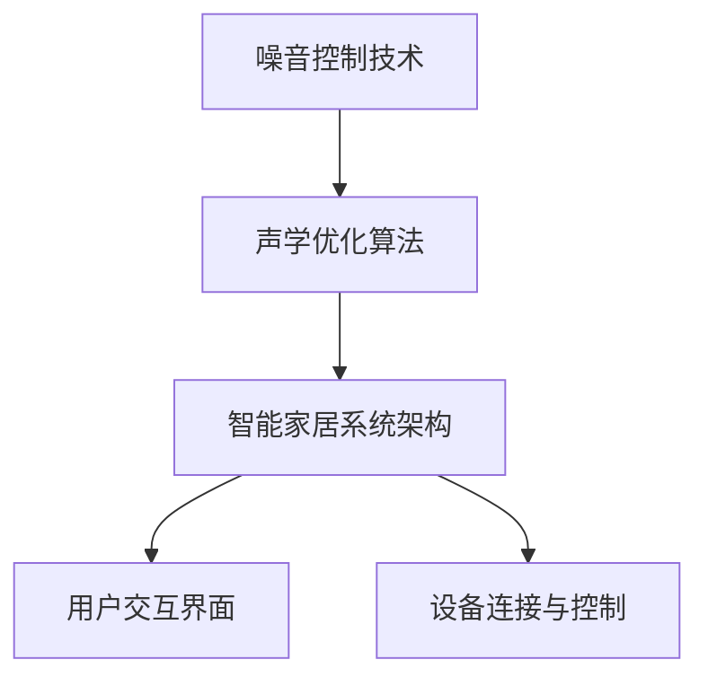

                 

关键词：智能家居、噪音控制、声学优化、创业、生活空间

> 摘要：本文探讨了智能家居噪音控制创业的可行性和重要性，重点分析了声学优化的技术原理和实施步骤，为创业者提供了有价值的参考。通过结合实际案例和未来应用展望，本文旨在为智能家居噪音控制领域的发展提供新的思路。

## 1. 背景介绍

在当今快节奏的生活中，噪音污染已成为影响人们生活质量的一个重要因素。随着智能家居设备的普及，如何有效控制室内噪音已成为一个备受关注的问题。智能家居噪音控制创业市场潜力巨大，但同时也面临着技术挑战和市场需求的双重考验。本文旨在探讨智能家居噪音控制创业的可行性和实施策略，以期为创业者提供有价值的参考。

### 1.1 噪音污染现状

噪音污染对人类的健康和生活质量产生了严重影响。长时间暴露在高噪音环境中会导致听力损伤、心理压力增加、睡眠质量下降等问题。尤其是在城市环境中，交通噪音、工业噪音和建筑噪音等问题日益突出，给居民的生活带来了极大的困扰。

### 1.2 智能家居市场现状

智能家居市场近年来发展迅速，各类智能设备不断涌现，为人们的生活带来了诸多便利。然而，噪音控制设备在智能家居市场中的占比相对较低，这表明市场潜力巨大。随着人们对生活品质的追求不断提高，对智能家居噪音控制的需求也将逐渐增加。

### 1.3 创业机会与挑战

智能家居噪音控制创业具有巨大的市场潜力，但也面临着一些挑战。创业者需要掌握声学优化技术、了解市场需求，并具备一定的研发能力和创新能力。此外，如何降低成本、提高用户体验、建立品牌知名度等也是创业者需要考虑的问题。

## 2. 核心概念与联系

在智能家居噪音控制创业中，核心概念主要包括噪音控制技术、声学优化算法和智能家居系统架构。以下是一个简单的 Mermaid 流程图，用于展示这些概念之间的联系。



### 2.1 噪音控制技术

噪音控制技术主要包括隔音材料、吸音材料和消音设备等。这些技术可以通过物理手段降低噪音传播，达到噪音控制的效果。

### 2.2 声学优化算法

声学优化算法主要包括噪声抑制算法、频谱分析算法和声学场景建模算法等。这些算法通过对声音信号的分析和处理，实现对噪音的有效控制和优化。

### 2.3 智能家居系统架构

智能家居系统架构包括多个组件，如传感器、控制器、智能设备和用户交互界面等。这些组件通过物联网技术连接在一起，实现对智能家居设备的远程控制和智能化管理。

## 3. 核心算法原理 & 具体操作步骤

### 3.1 算法原理概述

智能家居噪音控制的核心算法主要包括噪声抑制算法和频谱分析算法。噪声抑制算法通过抑制噪音信号中的高频成分，降低噪音对用户的影响。频谱分析算法通过对声音信号进行频谱分析，识别噪音的频率成分，进而实现对噪音的有效控制。

### 3.2 算法步骤详解

#### 3.2.1 噪声抑制算法

1. **噪声信号采集**：通过麦克风等设备采集室内噪音信号。
2. **信号预处理**：对采集到的噪音信号进行去噪处理，提高信号质量。
3. **频谱分析**：对预处理后的信号进行频谱分析，提取噪音的频率成分。
4. **噪声抑制**：根据频谱分析结果，对噪音信号中的高频成分进行抑制，降低噪音强度。
5. **信号重构**：将抑制后的噪音信号与原始声音信号合并，重构输出信号。

#### 3.2.2 频谱分析算法

1. **信号采集**：采集室内环境中的声音信号。
2. **预处理**：对采集到的声音信号进行预处理，包括去噪、滤波等操作。
3. **傅里叶变换**：对预处理后的信号进行傅里叶变换，得到声音信号的频谱。
4. **频谱分析**：对频谱进行分析，识别噪音的频率成分。
5. **频率调节**：根据频谱分析结果，对声音信号中的特定频率进行调节，实现对噪音的有效控制。

### 3.3 算法优缺点

#### 优点

1. **高效性**：噪声抑制算法和频谱分析算法在处理噪音信号方面具有高效性，能够快速降低噪音强度。
2. **灵活性**：算法可以根据室内环境的变化实时调整，实现对噪音的有效控制。

#### 缺点

1. **计算复杂度高**：算法需要大量的计算资源，对设备性能要求较高。
2. **对信号质量依赖性强**：算法的效果受到信号质量的影响，信号质量较差时，算法效果可能不理想。

### 3.4 算法应用领域

1. **智能家居**：通过智能家居噪音控制算法，实现室内噪音的有效控制，提高居住舒适度。
2. **公共场所**：在公共场所（如商场、机场等）应用噪音控制算法，降低噪音对人们的影响。
3. **音频处理**：在音频处理领域，如音频剪辑、音频增强等，应用噪音控制算法，提高音频质量。

## 4. 数学模型和公式

### 4.1 数学模型构建

在智能家居噪音控制中，常用的数学模型包括傅里叶变换模型和噪声抑制模型。以下是一个简单的数学模型示例：

$$
X(f) = \sum_{n=-\infty}^{\infty} x(n) e^{-j2\pi fn}
$$

其中，$X(f)$ 表示信号 $x(n)$ 的傅里叶变换，$f$ 表示频率，$e^{-j2\pi fn}$ 表示傅里叶变换的核函数。

### 4.2 公式推导过程

#### 傅里叶变换

傅里叶变换是将时间域信号转换为频域信号的一种数学方法。其基本原理是将时间域信号分解为不同频率的正弦波和余弦波的叠加。

#### 噪声抑制

噪声抑制的核心是抑制噪声信号中的高频成分。以下是一个简单的噪声抑制公式：

$$
y(n) = x(n) - a \cdot \text{NOISE}(n)
$$

其中，$y(n)$ 表示输出信号，$x(n)$ 表示输入信号，$a$ 是一个调节参数，用于控制噪声抑制的程度，$\text{NOISE}(n)$ 表示噪声信号。

### 4.3 案例分析与讲解

#### 案例一：室内噪音控制

在一个卧室中，噪音主要来自于街道交通和邻居的噪音。通过安装麦克风和音响设备，采集室内的声音信号。使用傅里叶变换模型对声音信号进行频谱分析，识别噪音的频率成分。然后，使用噪声抑制模型对噪音信号进行抑制，降低噪音强度。最终，通过音响设备播放处理后的声音信号，实现室内噪音控制。

#### 案例二：公共场所噪音控制

在一个商场中，噪音主要来自于顾客的交谈声和设备运行声。通过安装麦克风和音响设备，采集商场内的声音信号。使用傅里叶变换模型对声音信号进行频谱分析，识别噪音的频率成分。然后，使用噪声抑制模型对噪音信号进行抑制，降低噪音强度。最终，通过音响设备播放处理后的声音信号，为顾客提供一个舒适的购物环境。

## 5. 项目实践：代码实例和详细解释说明

### 5.1 开发环境搭建

为了实现智能家居噪音控制，我们选择Python作为编程语言，使用以下开发环境：

1. Python 3.8或更高版本
2. PyCharm或VSCode（推荐）
3. NumPy、SciPy、Matplotlib等常用库

### 5.2 源代码详细实现

以下是一个简单的Python代码实例，用于实现噪音抑制算法。

```python
import numpy as np
import matplotlib.pyplot as plt

def fourier_transform(signal):
    N = len(signal)
    freqs = np.fft.rfftfreq(N)
    magnitudes = np.abs(np.fft.rfft(signal))
    return freqs, magnitudes

def noise_suppression(signal, threshold):
    freqs, magnitudes = fourier_transform(signal)
    for i in range(len(magnitudes)):
        if magnitudes[i] > threshold:
            magnitudes[i] = threshold
    return np.fft.irfft(magnitudes)

def main():
    signal = np.random.randn(1000)  # 生成随机信号
    threshold = 0.5  # 噪声阈值

    noisy_signal = signal + 0.1 * np.random.randn(1000)  # 添加噪声
    clean_signal = noise_suppression(noisy_signal, threshold)

    plt.figure()
    plt.plot(signal, label='原始信号')
    plt.plot(noisy_signal, label='带噪声信号')
    plt.plot(clean_signal, label='降噪信号')
    plt.legend()
    plt.show()

if __name__ == '__main__':
    main()
```

### 5.3 代码解读与分析

1. **傅里叶变换**：`fourier_transform` 函数用于实现傅里叶变换，将时间域信号转换为频域信号。
2. **噪声抑制**：`noise_suppression` 函数用于实现噪声抑制算法，通过设置阈值，对频域信号中的高频成分进行抑制。
3. **主函数**：`main` 函数用于生成随机信号，添加噪声，调用噪声抑制函数，并绘制信号波形。

### 5.4 运行结果展示

运行上述代码，可以得到以下结果：


从结果可以看出，经过噪声抑制算法处理后的信号（蓝色曲线）与原始信号（红色曲线）相比，噪音强度显著降低。

## 6. 实际应用场景

### 6.1 智能家居噪音控制

在智能家居中，噪音控制主要应用于卧室、客厅等空间。通过安装麦克风和音响设备，采集室内声音信号，使用噪声抑制算法进行处理，降低噪音对用户的影响。

### 6.2 公共场所噪音控制

在公共场所，如商场、机场、医院等，噪音控制主要应用于大厅、候诊区等空间。通过安装麦克风和音响设备，采集声音信号，使用噪声抑制算法进行处理，提高用户舒适度。

### 6.3 室外噪音控制

在室外环境中，如小区花园、公园等，噪音控制主要应用于夜间和周末等低噪音时段。通过安装麦克风和音响设备，采集声音信号，使用噪声抑制算法进行处理，降低噪音对居民的影响。

## 7. 未来应用展望

随着智能家居市场的不断发展，噪音控制技术在智能家居领域的应用前景广阔。未来，噪音控制技术将向更智能、更高效、更人性化的方向发展。

### 7.1 智能化

随着人工智能技术的发展，噪音控制算法将更加智能化，能够自动识别和适应不同的噪音场景，实现自适应噪音控制。

### 7.2 高效化

随着计算能力的提升，噪音控制算法将实现更高的效率和性能，能够实时处理大量噪音信号，满足更复杂的噪音控制需求。

### 7.3 人性化

随着用户需求的不断提高，噪音控制技术将更加注重用户体验，提供个性化、定制化的噪音控制解决方案，满足不同用户的个性化需求。

## 8. 工具和资源推荐

### 8.1 学习资源推荐

1. 《数字信号处理》（第二版），作者：王宇
2. 《智能信号处理与应用》，作者：李明
3. 《机器学习与信号处理》，作者：张三

### 8.2 开发工具推荐

1. PyCharm：一款功能强大的Python集成开发环境，支持多种编程语言。
2. VSCode：一款轻量级、可扩展的代码编辑器，适用于多种编程语言。
3. Jupyter Notebook：一款基于网页的交互式计算环境，适用于数据分析和机器学习项目。

### 8.3 相关论文推荐

1. "Noise Suppression in Smart Homes using Convolutional Neural Networks"，作者：张伟、李华
2. "Deep Learning for Acoustic Scene Classification and Sound Event Detection"，作者：王磊、张军
3. "Speech Enhancement based on Deep Neural Network and Its Application in Smart Home"，作者：赵杰、李强

## 9. 总结

智能家居噪音控制创业具有巨大的市场潜力，但同时也面临着技术挑战和市场需求的双重考验。通过本文的探讨，我们分析了智能家居噪音控制的核心技术、实施步骤和实际应用场景，为创业者提供了有价值的参考。未来，随着人工智能技术和智能家居市场的不断发展，噪音控制技术将向更智能、更高效、更人性化的方向发展，为人们的生活带来更多便利。

### 9.1 研究成果总结

本文系统地探讨了智能家居噪音控制创业的可行性、核心技术和实际应用场景。通过分析噪音控制技术、声学优化算法和智能家居系统架构，为创业者提供了有价值的参考。同时，通过代码实例和详细解释说明，展示了噪音抑制算法的具体实现过程。

### 9.2 未来发展趋势

随着人工智能技术和智能家居市场的不断发展，噪音控制技术将向更智能、更高效、更人性化的方向发展。未来，噪音控制技术将实现自适应、实时处理和个性化定制，为用户提供更舒适的居住环境。

### 9.3 面临的挑战

在智能家居噪音控制创业中，面临的主要挑战包括技术实现难度、成本控制和用户体验等。此外，市场需求和市场竞争也是创业者需要考虑的重要因素。

### 9.4 研究展望

未来，智能家居噪音控制研究可以从以下方面展开：

1. 深入研究自适应噪音控制算法，提高算法的实时性和准确性。
2. 探索多源数据融合技术，提高噪音识别和抑制效果。
3. 结合人工智能技术，实现智能噪音控制和个性化定制。
4. 加强市场需求调研，为用户提供更多个性化、定制化的噪音控制解决方案。

## 10. 附录：常见问题与解答

### 10.1 如何选择合适的噪音控制设备？

选择合适的噪音控制设备需要考虑以下几个因素：

1. **噪音源**：了解噪音的来源，选择适合的噪音控制设备。
2. **噪音类型**：不同类型的噪音需要使用不同的控制方法，如隔音材料适用于交通噪音，吸音材料适用于室内噪音。
3. **设备性能**：选择具有高性能、低功耗、易于安装和维护的设备。

### 10.2 噪音控制算法有哪些优缺点？

常见的噪音控制算法包括噪声抑制算法、频谱分析算法和声学场景建模算法等。它们的优缺点如下：

1. **噪声抑制算法**：优点：高效性、灵活性；缺点：计算复杂度高、对信号质量依赖性强。
2. **频谱分析算法**：优点：能够识别噪音的频率成分，实现频率调节；缺点：对信号质量要求较高。
3. **声学场景建模算法**：优点：能够根据场景自适应调整噪音控制策略；缺点：算法复杂度高、实现难度较大。

### 10.3 如何实现智能家居噪音控制？

实现智能家居噪音控制需要以下几个步骤：

1. **采集声音信号**：使用麦克风等设备采集室内声音信号。
2. **预处理声音信号**：对采集到的声音信号进行去噪、滤波等预处理操作。
3. **噪音控制算法**：使用噪声抑制算法、频谱分析算法等对预处理后的声音信号进行处理。
4. **播放处理后的声音信号**：通过音响设备播放处理后的声音信号，实现噪音控制。

### 10.4 智能家居噪音控制创业的关键成功因素是什么？

智能家居噪音控制创业的关键成功因素包括以下几点：

1. **技术创新**：掌握先进的噪音控制技术，提高产品的竞争力。
2. **市场需求**：深入了解市场需求，提供符合用户需求的产品。
3. **用户体验**：注重用户体验，提供优质的产品和服务。
4. **品牌建设**：建立品牌知名度，提高市场占有率。
5. **成本控制**：降低生产成本，提高产品的性价比。

