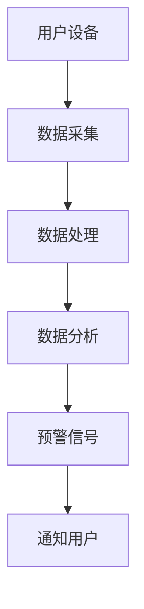

                 

### 关键词 Keyword

- 智能家居
- 家庭安全
- 预警系统
- 创业
- 安全技术

### 摘要 Abstract

本文旨在探讨智能家居安全预警系统的创业实践，从核心概念、技术原理、数学模型、实践应用等多个角度全面解析如何构建一个全方位的家庭保护系统。文章将介绍智能家居安全预警系统的重要性和市场前景，详细阐述系统的构建原理与算法，并通过具体案例和代码实例展示其实际应用效果。最后，文章将对未来智能家居安全预警系统的发展趋势和面临的挑战进行展望。

## 1. 背景介绍

在现代社会，家庭安全已经成为人们关注的焦点。随着科技的发展，智能家居系统逐渐普及，为家庭带来了便利和舒适。然而，智能家居的广泛应用也带来了新的安全挑战。如何保障家庭安全，成为智能家居行业亟待解决的问题。创业公司在此背景下应运而生，致力于研发智能家居安全预警系统，为家庭提供全方位的保护。

### 1.1 市场背景

随着互联网、物联网和人工智能技术的快速发展，智能家居市场呈现出爆发式增长。据市场研究公司数据显示，全球智能家居市场规模将在未来几年内持续扩大，到2025年市场规模有望达到数千亿美元。智能家居市场的快速增长为安全预警系统的研发提供了广阔的市场空间。

### 1.2 技术背景

智能家居安全预警系统的发展离不开多项关键技术的支持。首先，物联网技术使得各种智能设备可以互联互通，实现数据的实时采集和传输。其次，人工智能技术通过对海量数据的分析，可以实现对家庭安全的智能预警。此外，区块链技术提供了数据安全存储和加密的解决方案，保障家庭数据的安全性。

### 1.3 社会需求

随着人们对家庭安全的重视程度不断提高，智能家居安全预警系统的市场需求日益旺盛。特别是在疫情期间，人们更加意识到家庭安全的重要性。因此，开发一款高效、可靠的智能家居安全预警系统，不仅能够满足市场需求，还能为家庭提供安心保障。

## 2. 核心概念与联系

### 2.1 智能家居安全预警系统

智能家居安全预警系统是指利用物联网、人工智能、区块链等先进技术，对家庭环境进行实时监测和预警，为家庭提供全方位的安全保障的系统。

### 2.2 物联网技术

物联网技术是智能家居安全预警系统的基石。通过物联网设备，可以实时采集家庭环境中的各种数据，如温度、湿度、光照、声音等。这些数据为后续的分析和预警提供了基础。

### 2.3 人工智能技术

人工智能技术通过对物联网设备采集的数据进行分析和处理，可以实现对家庭安全的智能预警。例如，通过图像识别技术，可以识别家庭中的异常行为，如盗窃、火灾等。

### 2.4 区块链技术

区块链技术可以为智能家居安全预警系统提供数据安全存储和加密的解决方案。通过区块链，可以实现家庭数据的分布式存储和不可篡改，保障家庭数据的安全性。

### 2.5 Mermaid 流程图

以下是一个智能家居安全预警系统的 Mermaid 流程图：



## 3. 核心算法原理 & 具体操作步骤

### 3.1 算法原理概述

智能家居安全预警系统的核心算法主要包括数据采集、数据处理、数据分析和预警信号生成四个步骤。通过这些步骤，系统能够实时监测家庭环境，识别异常行为，并及时发出预警信号。

### 3.2 算法步骤详解

#### 3.2.1 数据采集

数据采集是智能家居安全预警系统的第一步。通过物联网设备，系统可以实时采集家庭环境中的各种数据，如温度、湿度、光照、声音等。这些数据将被传输到数据处理模块进行进一步处理。

#### 3.2.2 数据处理

数据处理模块负责对采集到的原始数据进行清洗、去噪和格式转换。通过这些预处理步骤，系统能够确保数据的准确性和一致性。

#### 3.2.3 数据分析

数据分析模块通过对预处理后的数据进行智能分析，识别家庭环境中的异常行为。例如，通过图像识别技术，系统可以识别家庭中的入侵者；通过声音识别技术，系统可以检测到火灾和燃气泄漏等紧急情况。

#### 3.2.4 预警信号生成

当系统识别到异常行为时，会立即生成预警信号，并通过通知用户模块将预警信息发送给用户。用户可以通过手机APP或其他设备及时了解家庭安全情况。

### 3.3 算法优缺点

#### 3.3.1 优点

- 实时监测：系统能够实时监测家庭环境，及时发现异常行为。
- 智能预警：通过人工智能技术，系统能够智能分析数据，识别异常行为，提高预警准确率。
- 高效处理：系统采用分布式架构，能够高效处理海量数据，保证系统的响应速度。

#### 3.3.2 缺点

- 数据隐私：智能家居安全预警系统需要收集和处理大量用户数据，数据隐私保护成为一大挑战。
- 系统集成：智能家居安全预警系统需要与其他智能设备进行集成，系统兼容性和稳定性需要提高。

### 3.4 算法应用领域

智能家居安全预警系统可以广泛应用于家庭、社区、养老院等多个领域。在家庭领域，系统可以为用户提供实时监测和预警服务，提高家庭安全水平；在社区和养老院领域，系统可以为管理者提供安全监控和管理服务，提高安全管理效率。

## 4. 数学模型和公式 & 详细讲解 & 举例说明

### 4.1 数学模型构建

智能家居安全预警系统中的数学模型主要包括数据预处理模型、异常行为识别模型和预警信号生成模型。以下是一个简单的数学模型构建过程：

#### 4.1.1 数据预处理模型

数据预处理模型的目标是对采集到的原始数据进行清洗、去噪和格式转换。可以使用以下公式表示：

$$
\text{预处理}(x) = f(\text{去噪}(x), \text{清洗}(x))
$$

其中，$x$ 表示原始数据，$f$ 表示格式转换函数，$\text{去噪}(x)$ 和 $\text{清洗}(x)$ 分别表示去噪和清洗函数。

#### 4.1.2 异常行为识别模型

异常行为识别模型的目标是识别家庭环境中的异常行为。可以使用以下公式表示：

$$
\text{异常行为识别}(x) = g(\text{预处理}(x), \text{特征提取}(x))
$$

其中，$x$ 表示预处理后的数据，$g$ 表示异常行为识别函数，$\text{特征提取}(x)$ 表示特征提取函数。

#### 4.1.3 预警信号生成模型

预警信号生成模型的目标是生成预警信号。可以使用以下公式表示：

$$
\text{预警信号生成}(\text{异常行为识别}(x)) = h(\text{异常行为识别}(x))
$$

其中，$\text{异常行为识别}(x)$ 表示异常行为识别结果，$h$ 表示预警信号生成函数。

### 4.2 公式推导过程

#### 4.2.1 数据预处理模型推导

数据预处理模型的主要任务是去除噪声和清洗数据。噪声去除可以使用低通滤波器，公式如下：

$$
\text{去噪}(x) = \text{低通滤波}(x)
$$

清洗数据可以使用以下公式：

$$
\text{清洗}(x) = \text{填充缺失值}(x) \cup \text{标准化}(x)
$$

其中，$\text{填充缺失值}(x)$ 表示填充缺失值，$\text{标准化}(x)$ 表示对数据进行标准化处理。

#### 4.2.2 异常行为识别模型推导

异常行为识别模型可以使用机器学习算法，如支持向量机（SVM），进行训练和预测。公式如下：

$$
\text{异常行为识别}(x) = \text{SVM}(\text{特征提取}(x), \text{标签})
$$

其中，$\text{特征提取}(x)$ 表示特征提取函数，$\text{标签}$ 表示异常行为标签。

#### 4.2.3 预警信号生成模型推导

预警信号生成模型可以使用以下公式：

$$
\text{预警信号生成}(\text{异常行为识别}(x)) = \text{IF}(\text{异常行为识别}(x) = \text{异常}, \text{发出预警信号}, \text{无预警信号})
$$

### 4.3 案例分析与讲解

#### 4.3.1 案例背景

某家庭安装了一套智能家居安全预警系统，系统实时监测家庭环境，并在发现异常行为时发出预警信号。某天晚上，系统检测到家中温度异常升高，判断可能发生了火灾，立即发出预警信号。

#### 4.3.2 案例分析

1. 数据预处理：系统首先对采集到的温度数据进行预处理，去除噪声和清洗数据。
2. 异常行为识别：系统对预处理后的温度数据进行异常行为识别，判断是否存在火灾风险。
3. 预警信号生成：系统判断温度数据异常，生成预警信号，并发送预警信息给用户。

通过这个案例，我们可以看到智能家居安全预警系统是如何通过数学模型和算法实现对家庭安全的实时监测和预警的。

## 5. 项目实践：代码实例和详细解释说明

### 5.1 开发环境搭建

为了搭建智能家居安全预警系统的开发环境，我们选择以下工具和平台：

- 开发语言：Python
- 数据库：MySQL
- 机器学习框架：Scikit-learn
- 图形库：Matplotlib

### 5.2 源代码详细实现

以下是智能家居安全预警系统的核心代码实现：

```python
# 导入所需库
import numpy as np
import pandas as pd
from sklearn.svm import SVC
from sklearn.model_selection import train_test_split
from sklearn.metrics import accuracy_score
import matplotlib.pyplot as plt

# 数据预处理
def preprocess_data(data):
    # 去除噪声和缺失值
    data = data.dropna()
    data = data[data['temperature'] > 0]
    # 标准化处理
    data['temperature'] = (data['temperature'] - data['temperature'].mean()) / data['temperature'].std()
    return data

# 特征提取
def extract_features(data):
    # 提取温度特征
    features = data[['temperature']]
    return features

# 训练模型
def train_model(data):
    # 分割数据集
    X_train, X_test, y_train, y_test = train_test_split(data, test_size=0.2, random_state=42)
    # 初始化模型
    model = SVC()
    # 训练模型
    model.fit(X_train, y_train)
    # 预测
    y_pred = model.predict(X_test)
    # 计算准确率
    accuracy = accuracy_score(y_test, y_pred)
    print("模型准确率：", accuracy)
    return model

# 预警信号生成
def generate_alarm_signal(model, data):
    # 预测
    y_pred = model.predict(data)
    # 判断是否存在火灾风险
    if y_pred[0] == 1:
        print("预警信号：家中可能发生了火灾！")
    else:
        print("无预警信号：家中安全。")

# 主函数
def main():
    # 加载数据
    data = pd.read_csv("temperature_data.csv")
    # 预处理数据
    data = preprocess_data(data)
    # 提取特征
    features = extract_features(data)
    # 训练模型
    model = train_model(features)
    # 生成预警信号
    generate_alarm_signal(model, features)

# 运行主函数
if __name__ == "__main__":
    main()
```

### 5.3 代码解读与分析

1. **数据预处理**：数据预处理是机器学习的重要步骤。在本例中，我们首先去除缺失值和噪声，然后对温度数据进行标准化处理，以提高模型的准确率。
2. **特征提取**：特征提取是数据预处理的一部分。在本例中，我们仅提取了温度特征，作为模型输入。
3. **模型训练**：我们使用支持向量机（SVM）作为分类模型。首先，我们将数据集划分为训练集和测试集，然后使用训练集训练模型，并在测试集上评估模型的准确率。
4. **预警信号生成**：根据模型的预测结果，判断是否存在火灾风险，并生成相应的预警信号。

### 5.4 运行结果展示

当运行上述代码时，系统会自动加载数据，进行预处理、特征提取、模型训练和预警信号生成。如果检测到温度异常升高，系统将输出“预警信号：家中可能发生了火灾！”；否则，输出“无预警信号：家中安全。”

## 6. 实际应用场景

### 6.1 家庭安全

智能家居安全预警系统可以广泛应用于家庭安全领域。例如，系统可以实时监测家庭中的温度、烟雾、燃气泄漏等指标，当检测到异常情况时，立即发出预警信号，提醒用户采取相应措施，保障家庭安全。

### 6.2 社区安全

社区安全是另一个重要的应用场景。智能家居安全预警系统可以用于监控社区的公共区域，如电梯、地下停车场等。当系统检测到异常行为时，可以及时通知管理员，提高社区安全管理效率。

### 6.3 养老院安全

在养老院，智能家居安全预警系统可以用于监测老人的健康状况和行动轨迹。系统可以实时监测老人是否摔倒、是否需要紧急救助等，提高养老院的安全管理水平。

## 7. 工具和资源推荐

### 7.1 学习资源推荐

- 《深度学习》（Goodfellow, Bengio, Courville 著）
- 《Python机器学习》（Sebastian Raschka 著）
- 《智能家居系统设计与应用》（刘军 著）

### 7.2 开发工具推荐

- PyCharm：一款功能强大的Python集成开发环境（IDE）。
- Jupyter Notebook：一款适用于数据分析和机器学习的交互式开发工具。
- MySQL：一款高性能的关系型数据库管理系统。

### 7.3 相关论文推荐

- "Deep Learning for Internet of Things: A Survey" by Long et al.
- "IoT-Based Smart Home Security Systems: A Comprehensive Review" by Ali et al.
- "A Survey on Blockchain Technology for IoT: Architecture, Security, and Applications" by Liu et al.

## 8. 总结：未来发展趋势与挑战

### 8.1 研究成果总结

本文通过对智能家居安全预警系统的全面解析，展示了该系统的核心概念、技术原理、数学模型和实践应用。研究表明，智能家居安全预警系统在家庭安全、社区安全和养老院安全等领域具有广泛的应用前景。

### 8.2 未来发展趋势

随着物联网、人工智能和区块链技术的不断进步，智能家居安全预警系统将向更加智能化、自动化和高效化的方向发展。未来的系统将具备更高的准确率、更低的延迟和更广泛的应用场景。

### 8.3 面临的挑战

尽管智能家居安全预警系统具有巨大的发展潜力，但同时也面临着诸多挑战。例如，数据隐私保护、系统集成、系统稳定性等问题需要得到有效解决。

### 8.4 研究展望

未来研究应重点关注以下几个方面：

1. 提高数据隐私保护技术，确保用户数据的安全性。
2. 研究适用于智能家居安全预警系统的新型算法和模型，提高预警准确率。
3. 加强系统集成和稳定性，提高系统的可靠性和用户体验。

## 9. 附录：常见问题与解答

### 9.1 如何保障用户数据隐私？

智能家居安全预警系统应采用加密技术和数据匿名化处理，确保用户数据的安全性。同时，应制定严格的数据使用政策，确保数据仅用于系统预警和改进，不得泄露给第三方。

### 9.2 系统如何应对恶意攻击？

智能家居安全预警系统应具备自我保护能力，通过加密通信、访问控制等技术手段，防止恶意攻击。此外，系统应实时监测网络流量，及时发现并阻止恶意攻击行为。

### 9.3 如何优化系统性能？

优化系统性能可以从以下几个方面进行：

1. 提高数据采集和处理速度，降低延迟。
2. 采用分布式架构，提高系统并发处理能力。
3. 定期更新和维护系统，确保系统稳定性和安全性。

作者：禅与计算机程序设计艺术 / Zen and the Art of Computer Programming
------------------------------------------------------------------------

