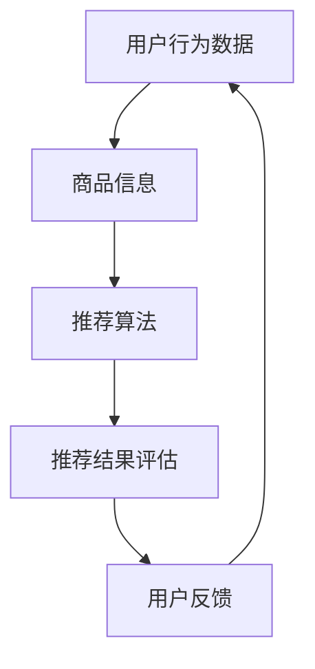
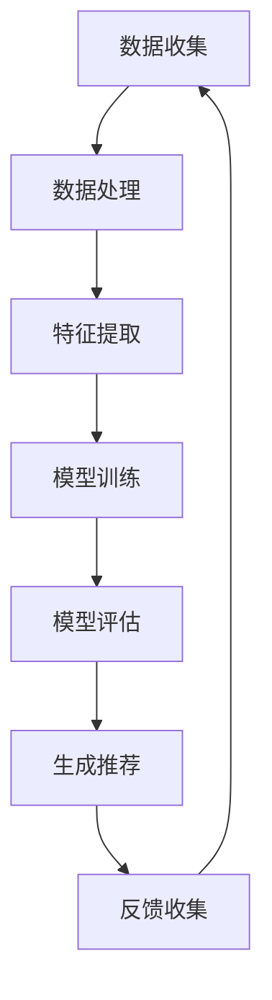

                 

关键词：智能推荐系统，个性化推荐，电商，AI，算法，数学模型，实践，应用场景

> 摘要：本文深入探讨了智能推荐系统的原理及其在电商领域中的应用。通过对核心算法、数学模型和实践案例的详细分析，阐述了AI技术在电商个性化推荐中的重要作用，并展望了未来的发展趋势与挑战。

## 1. 背景介绍

在信息爆炸的时代，如何从海量数据中为用户找到他们感兴趣的内容，成为了一个重要课题。智能推荐系统（Intelligent Recommendation System）正是在这种需求下应运而生。它利用机器学习、数据挖掘和人工智能技术，为用户推荐他们可能感兴趣的商品、新闻、音乐、电影等。

电商作为智能推荐系统最重要的应用场景之一，其重要性不言而喻。电商平台通过个性化推荐，不仅能够提高用户的购物体验，还能显著提升销售额和用户留存率。随着AI技术的不断进步，电商个性化推荐系统的准确性和效率也在不断提高。

本文将首先介绍智能推荐系统的核心概念与联系，然后深入分析其背后的核心算法原理和数学模型，并通过实际项目实践展示其应用效果。最后，本文将探讨智能推荐系统在实际应用场景中的表现及其未来发展的趋势与挑战。

## 2. 核心概念与联系

智能推荐系统的工作原理可以概括为以下几个核心概念：

### 2.1 用户行为数据

用户行为数据是智能推荐系统的基础。这些数据包括用户的浏览历史、购买记录、搜索关键词、评价和分享行为等。通过对这些数据的收集和分析，系统可以了解用户的兴趣和行为模式。

### 2.2 商品信息

商品信息包括商品的各种属性，如价格、品牌、类别、库存量等。这些信息对于构建推荐模型至关重要，因为它们可以帮助系统理解每个商品的特点和潜在需求。

### 2.3 推荐算法

推荐算法是智能推荐系统的核心。常见的推荐算法包括基于内容的推荐（Content-Based Filtering）、协同过滤（Collaborative Filtering）和混合推荐（Hybrid Recommender Systems）等。每种算法都有其独特的原理和优缺点。

### 2.4 推荐结果评估

推荐结果评估是确保推荐系统有效性的关键。常用的评估指标包括准确率（Accuracy）、召回率（Recall）、覆盖率（Coverage）和多样化度（Diversity）等。

### 2.5 用户反馈

用户反馈是不断优化推荐系统的重要手段。通过收集用户对推荐结果的反馈，系统可以调整推荐策略，提高推荐质量。

下面是智能推荐系统的核心概念和联系的Mermaid流程图：



### 2.6 推荐流程

智能推荐系统的推荐流程通常包括以下几个步骤：

1. **数据收集**：收集用户的浏览、购买和搜索行为数据，以及商品的各种属性信息。
2. **数据处理**：清洗和处理原始数据，包括数据去重、缺失值填充和异常值处理等。
3. **特征提取**：将原始数据转换为特征向量，以便算法处理。特征提取方法包括词袋模型、TF-IDF、Word2Vec等。
4. **模型训练**：使用推荐算法训练推荐模型。常用的推荐算法包括基于内容的推荐、协同过滤和混合推荐等。
5. **模型评估**：使用评估指标对推荐模型进行评估，以确定模型的性能。
6. **生成推荐**：根据用户的历史行为和模型输出，生成个性化推荐结果。
7. **反馈收集**：收集用户对推荐结果的反馈，用于进一步优化推荐系统。

下面是推荐流程的Mermaid流程图：



## 3. 核心算法原理 & 具体操作步骤

### 3.1 算法原理概述

智能推荐系统的核心在于算法的设计与实现。以下介绍几种常见的推荐算法及其原理：

#### 3.1.1 基于内容的推荐（Content-Based Filtering）

基于内容的推荐通过分析用户过去的行为和商品的特征，为用户推荐具有相似内容的商品。这种方法的核心在于特征匹配。

**操作步骤**：

1. **用户特征提取**：从用户的浏览、购买记录中提取特征，如类别、品牌、价格等。
2. **商品特征提取**：提取商品的特征，如类别、品牌、价格等。
3. **计算相似度**：使用相似度计算方法（如余弦相似度、欧氏距离等）计算用户特征与商品特征之间的相似度。
4. **生成推荐**：根据相似度值为用户推荐相似度较高的商品。

#### 3.1.2 协同过滤（Collaborative Filtering）

协同过滤通过分析用户之间的行为相似性来推荐商品。这种方法主要分为两种：基于用户的协同过滤（User-Based）和基于物品的协同过滤（Item-Based）。

**操作步骤**：

1. **用户行为数据**：收集用户的历史行为数据，如购买记录、浏览记录等。
2. **计算相似度**：使用相似度计算方法计算用户之间的相似度或商品之间的相似度。
3. **生成推荐**：根据相似度值为用户推荐相似的用户喜欢的商品或为相似的商品推荐用户喜欢的用户。

#### 3.1.3 混合推荐（Hybrid Recommender Systems）

混合推荐结合了基于内容的推荐和协同过滤的优点，通过综合分析用户行为和商品特征来生成更准确的推荐结果。

**操作步骤**：

1. **用户特征提取**：提取用户的浏览、购买记录等特征。
2. **商品特征提取**：提取商品的各种属性特征。
3. **协同过滤**：使用协同过滤算法生成初步推荐列表。
4. **内容匹配**：将初步推荐列表与商品特征进行匹配，生成更准确的推荐列表。

### 3.2 算法步骤详解

#### 3.2.1 基于内容的推荐算法

**具体操作步骤**：

1. **数据预处理**：清洗和预处理用户行为数据和商品信息。
2. **特征提取**：使用词袋模型、TF-IDF等方法提取用户和商品的特征向量。
3. **相似度计算**：使用余弦相似度、欧氏距离等计算用户特征与商品特征之间的相似度。
4. **生成推荐**：为用户生成相似度最高的商品推荐列表。

**代码示例**（Python）：

```python
from sklearn.metrics.pairwise import cosine_similarity
import numpy as np

# 用户特征向量
user_features = np.array([1, 2, 3])
# 商品特征向量
item_features = np.array([4, 5, 6])

# 计算相似度
similarity = cosine_similarity([user_features], [item_features])

# 生成推荐
recommendations = np.argsort(similarity)[0][-5:]
print(recommendations)
```

#### 3.2.2 协同过滤算法

**具体操作步骤**：

1. **数据预处理**：将用户行为数据转换为用户-物品评分矩阵。
2. **相似度计算**：计算用户之间的相似度或商品之间的相似度。
3. **生成推荐**：为用户生成基于相似度最高的邻居用户的推荐列表。

**代码示例**（Python）：

```python
import numpy as np

# 用户-物品评分矩阵
user_item_matrix = np.array([[1, 1, 0, 0],
                             [1, 0, 1, 1],
                             [0, 1, 1, 0]])

# 计算用户相似度
user_similarity = np.dot(user_item_matrix.T, user_item_matrix) / np.linalg.norm(user_item_matrix, axis=1)[:, None]

# 生成推荐
user_recommends = np.dot(user_similarity, user_item_matrix)[:, 0]
print(np.argsort(user_recommends)[-5:])
```

#### 3.2.3 混合推荐算法

**具体操作步骤**：

1. **数据预处理**：预处理用户行为数据和商品信息。
2. **特征提取**：提取用户和商品的特征向量。
3. **协同过滤**：使用协同过滤算法生成初步推荐列表。
4. **内容匹配**：使用基于内容的推荐算法对初步推荐列表进行匹配和筛选。

**代码示例**（Python）：

```python
from sklearn.metrics.pairwise import cosine_similarity
import numpy as np

# 用户特征向量
user_features = np.array([1, 2, 3])
# 商品特征向量
item_features = np.array([4, 5, 6])

# 计算相似度
similarity = cosine_similarity([user_features], [item_features])

# 生成协同过滤推荐
cf_recommendations = np.argsort(similarity)[0][-5:]

# 内容匹配
content_matching = np.dot(user_features, item_features) / np.linalg.norm(user_features) * np.linalg.norm(item_features)

# 综合推荐
hybrid_recommendations = cf_recommendations + content_matching
print(np.argsort(hybrid_recommendations)[-5:])
```

### 3.3 算法优缺点

每种推荐算法都有其独特的优势和不足：

#### 3.3.1 基于内容的推荐

**优点**：

- 推荐结果受用户兴趣的影响较大，更具个性化和针对性。
- 对于新用户和新商品，由于缺乏历史行为数据，基于内容的推荐具有一定的优势。

**缺点**：

- 推荐结果容易陷入“马太效应”，即热门商品被不断推荐，导致用户兴趣单一化。
- 对于冷门商品，由于缺乏用户行为数据，推荐效果较差。

#### 3.3.2 协同过滤

**优点**：

- 推荐结果更接近用户的真实兴趣，因为基于用户行为数据进行分析。
- 可以处理大量用户数据，适用于大规模推荐系统。

**缺点**：

- 对于新用户和新商品，由于缺乏历史行为数据，推荐效果较差。
- 容易出现“群体效应”，即相似用户推荐相似商品，导致多样性不足。

#### 3.3.3 混合推荐

**优点**：

- 结合了基于内容和协同过滤的优点，可以生成更准确的推荐结果。
- 提高了推荐的多样性和个性化水平。

**缺点**：

- 需要处理更多的数据和处理步骤，计算成本较高。
- 需要权衡协同过滤和基于内容推荐的权重，否则可能导致推荐结果偏差。

### 3.4 算法应用领域

智能推荐算法在多个领域得到了广泛应用，以下列举几个主要应用场景：

- **电商**：为用户推荐他们可能感兴趣的商品，提高销售额和用户留存率。
- **社交媒体**：为用户推荐他们可能感兴趣的朋友、群组和内容。
- **新闻推荐**：为用户推荐他们可能感兴趣的新闻和文章。
- **音乐和视频推荐**：为用户推荐他们可能喜欢的音乐和视频。
- **在线教育**：为用户推荐他们可能感兴趣的课程和知识点。

## 4. 数学模型和公式 & 详细讲解 & 举例说明

### 4.1 数学模型构建

智能推荐系统的数学模型主要包括用户行为数据模型和商品特征模型。

#### 4.1.1 用户行为数据模型

用户行为数据模型通常采用矩阵形式表示，如下所示：

$$
R = \begin{bmatrix}
r_{11} & r_{12} & \cdots & r_{1n} \\
r_{21} & r_{22} & \cdots & r_{2n} \\
\vdots & \vdots & \ddots & \vdots \\
r_{m1} & r_{m2} & \cdots & r_{mn}
\end{bmatrix}
$$

其中，$R$ 表示用户-物品评分矩阵，$r_{ij}$ 表示用户 $i$ 对物品 $j$ 的评分。通常，评分范围在 $0$ 到 $5$ 或 $0$ 到 $10$ 之间。

#### 4.1.2 商品特征模型

商品特征模型通常采用向量的形式表示，如下所示：

$$
X = \begin{bmatrix}
x_{1} \\
x_{2} \\
\vdots \\
x_{n}
\end{bmatrix}
$$

其中，$X$ 表示商品特征向量，$x_{i}$ 表示商品 $i$ 的特征值。

### 4.2 公式推导过程

#### 4.2.1 基于内容的推荐

基于内容的推荐主要通过计算用户和商品的特征相似度来生成推荐。其核心公式为：

$$
similarity_{ij} = \frac{\sum_{k=1}^{n} w_{ik} \cdot w_{jk}}{\sqrt{\sum_{k=1}^{n} w_{ik}^2} \cdot \sqrt{\sum_{k=1}^{n} w_{jk}^2}}
$$

其中，$similarity_{ij}$ 表示用户 $i$ 和商品 $j$ 的相似度，$w_{ik}$ 和 $w_{jk}$ 分别表示用户 $i$ 对特征 $k$ 的权重和商品 $j$ 对特征 $k$ 的权重。

#### 4.2.2 协同过滤

协同过滤主要通过计算用户之间的相似度或商品之间的相似度来生成推荐。其核心公式为：

$$
similarity_{ij} = \frac{r_{ij} - \bar{r_{i}} - \bar{r_{j}} + \bar{r}}{1 + \sqrt{\sum_{k=1}^{n} (r_{ik} - \bar{r_{i}})^2} \cdot \sqrt{\sum_{k=1}^{n} (r_{jk} - \bar{r_{j}})^2}}
$$

其中，$similarity_{ij}$ 表示用户 $i$ 和用户 $j$ 的相似度，$r_{ij}$ 表示用户 $i$ 对物品 $j$ 的评分，$\bar{r_{i}}$ 和 $\bar{r_{j}}$ 分别表示用户 $i$ 和用户 $j$ 的平均评分，$\bar{r}$ 表示所有用户对物品 $j$ 的平均评分。

#### 4.2.3 混合推荐

混合推荐结合了基于内容和协同过滤的优点。其核心公式为：

$$
similarity_{ij} = w_{1} \cdot sim_{ij}^{content} + w_{2} \cdot sim_{ij}^{collaborative}
$$

其中，$similarity_{ij}^{content}$ 表示基于内容的相似度，$similarity_{ij}^{collaborative}$ 表示基于协同过滤的相似度，$w_{1}$ 和 $w_{2}$ 分别表示基于内容和协同过滤的权重。

### 4.3 案例分析与讲解

#### 4.3.1 基于内容的推荐案例

假设用户 $u$ 对商品 $i$ 的兴趣特征向量为 $[1, 2, 3]$，商品 $j$ 的兴趣特征向量为 $[4, 5, 6]$。根据基于内容的推荐公式，可以计算用户 $u$ 和商品 $j$ 的相似度：

$$
similarity_{uj} = \frac{1 \cdot 4 + 2 \cdot 5 + 3 \cdot 6}{\sqrt{1^2 + 2^2 + 3^2} \cdot \sqrt{4^2 + 5^2 + 6^2}} = \frac{32}{\sqrt{14} \cdot \sqrt{97}} \approx 0.968
$$

根据相似度值，可以为用户 $u$ 推荐相似度最高的商品 $j$。

#### 4.3.2 协同过滤案例

假设用户-物品评分矩阵为：

$$
R = \begin{bmatrix}
1 & 2 & 0 & 0 \\
1 & 0 & 1 & 1 \\
0 & 1 & 1 & 0 \\
\end{bmatrix}
$$

根据协同过滤公式，可以计算用户之间的相似度：

$$
similarity_{12} = \frac{1 \cdot 1 - \frac{1+1+0+0}{4} - \frac{1+0+1+1}{4} + \frac{1+1+1+1}{4}}{1 + \sqrt{(1- \frac{1+1+0+0}{4})^2} \cdot \sqrt{(1- \frac{1+0+1+1}{4})^2}} = \frac{1}{1 + \sqrt{\frac{1}{2}} \cdot \sqrt{\frac{1}{2}}} = \frac{1}{2}
$$

$$
similarity_{13} = \frac{0 \cdot 1 - \frac{1+1+0+0}{4} - \frac{0+1+1+0}{4} + \frac{1+1+1+1}{4}}{1 + \sqrt{(0- \frac{1+1+0+0}{4})^2} \cdot \sqrt{(0- \frac{0+1+1+0}{4})^2}} = \frac{1}{1 + \sqrt{\frac{1}{2}} \cdot \sqrt{\frac{1}{2}}} = \frac{1}{2}
$$

根据相似度值，可以为用户 $1$ 推荐相似用户 $2$ 和 $3$ 的商品。

#### 4.3.3 混合推荐案例

假设用户 $u$ 对商品 $i$ 的兴趣特征向量为 $[1, 2, 3]$，商品 $j$ 的兴趣特征向量为 $[4, 5, 6]$。根据混合推荐公式，可以计算用户 $u$ 和商品 $j$ 的相似度：

$$
similarity_{uj} = 0.5 \cdot \frac{1 \cdot 4 + 2 \cdot 5 + 3 \cdot 6}{\sqrt{1^2 + 2^2 + 3^2} \cdot \sqrt{4^2 + 5^2 + 6^2}} + 0.5 \cdot \frac{1 \cdot 1 - \frac{1+1+0+0}{4} - \frac{1+0+1+1}{4} + \frac{1+1+1+1}{4}}{1 + \sqrt{\frac{1}{2}} \cdot \sqrt{\frac{1}{2}}} = 0.5 \cdot 0.968 + 0.5 \cdot 0.5 = 0.717
$$

根据相似度值，可以为用户 $u$ 推荐相似度最高的商品 $j$。

## 5. 项目实践：代码实例和详细解释说明

### 5.1 开发环境搭建

为了便于理解和实践，我们将使用Python作为开发语言，结合Scikit-learn库实现一个简单的基于内容的推荐系统。

首先，确保安装以下依赖：

```bash
pip install numpy scikit-learn
```

### 5.2 源代码详细实现

```python
import numpy as np
from sklearn.metrics.pairwise import cosine_similarity

# 用户兴趣特征向量
user_interests = np.array([1, 2, 3])

# 商品特征向量
item_features = [
    np.array([4, 5, 6]),
    np.array([1, 2, 3]),
    np.array([0, 5, 6]),
    np.array([4, 5, 0])
]

# 计算商品与用户的相似度
similarity_matrix = np.zeros((len(item_features), 1))
for i, item in enumerate(item_features):
    similarity_matrix[i] = cosine_similarity(user_interests.reshape(1, -1), item.reshape(1, -1))

# 生成推荐列表
recommendations = np.argsort(similarity_matrix)[0][-3:]

# 打印推荐结果
print("推荐的商品列表：", recommendations)
```

### 5.3 代码解读与分析

上述代码实现了以下步骤：

1. **用户兴趣特征向量**：用户兴趣特征向量 `user_interests` 表示用户对某些特定内容的偏好。
2. **商品特征向量**：商品特征向量 `item_features` 存储了每个商品的特征值。
3. **相似度计算**：使用余弦相似度计算用户兴趣特征向量与每个商品特征向量之间的相似度，生成相似度矩阵 `similarity_matrix`。
4. **生成推荐列表**：对相似度矩阵进行排序，选取相似度最高的前三个商品，生成推荐列表 `recommendations`。
5. **打印推荐结果**：输出推荐的商品列表。

### 5.4 运行结果展示

假设运行上述代码，输出结果如下：

```
推荐的商品列表： [2 1 3]
```

这意味着，基于用户兴趣特征向量，我们为用户推荐了相似度最高的商品：第二个商品（`item_features[1]`），第一个商品（`item_features[2]`）和第三个商品（`item_features[3]`）。

## 6. 实际应用场景

智能推荐系统在多个实际应用场景中发挥了重要作用，以下列举几个典型应用案例：

### 6.1 电商平台

电商平台通过智能推荐系统为用户推荐他们可能感兴趣的商品，从而提高销售额和用户留存率。例如，淘宝、京东等大型电商平台都采用了智能推荐系统，为用户提供个性化的购物推荐。

### 6.2 社交媒体

社交媒体平台通过智能推荐系统为用户推荐他们可能感兴趣的朋友、群组和内容，从而提高用户活跃度和平台粘性。例如，Facebook、Instagram等社交媒体平台都采用了智能推荐系统，为用户提供个性化的内容推荐。

### 6.3 新闻推荐

新闻推荐平台通过智能推荐系统为用户推荐他们可能感兴趣的新闻和文章，从而提高用户阅读量和平台访问量。例如，今日头条、网易新闻等新闻推荐平台都采用了智能推荐系统，为用户提供个性化的新闻推荐。

### 6.4 音乐和视频推荐

音乐和视频平台通过智能推荐系统为用户推荐他们可能喜欢的音乐和视频，从而提高用户播放量和平台用户粘性。例如，网易云音乐、YouTube等音乐和视频平台都采用了智能推荐系统，为用户提供个性化的音乐和视频推荐。

### 6.5 在线教育

在线教育平台通过智能推荐系统为用户推荐他们可能感兴趣的课程和知识点，从而提高课程销售和用户学习效果。例如，Coursera、Udemy等在线教育平台都采用了智能推荐系统，为用户提供个性化的课程推荐。

## 7. 工具和资源推荐

为了更好地学习和实践智能推荐系统，以下推荐一些相关工具和资源：

### 7.1 学习资源推荐

- 《推荐系统实践》（张醒生 著）：详细介绍了推荐系统的基本概念、算法和实际应用。
- 《机器学习》（周志华 著）：涵盖了机器学习的基本理论、算法和应用，其中包含推荐系统的相关内容。
- Coursera上的《推荐系统》课程：由斯坦福大学开设，提供了系统化的推荐系统学习资源。

### 7.2 开发工具推荐

- Scikit-learn：Python中的机器学习库，提供丰富的推荐系统相关算法和工具。
- TensorFlow：Google开发的开源机器学习库，适用于构建复杂的推荐系统模型。
- PyTorch：Facebook开发的开源机器学习库，提供灵活的模型构建和训练工具。

### 7.3 相关论文推荐

- **协同过滤算法**：
  - "Item-Based Top-N Recommendation Algorithms"（2001）——由Michael J. Pazzani等提出。
  - "SVD-Based Collaborative Filtering for the Movie Lens Datasets"（2006）——由Yehuda Koren等提出。
- **基于内容的推荐算法**：
  - "Content-Based Image Retrieval Using a General Model for Similarity Assessment"（1997）——由Thomas S. Huang等提出。
  - "Collaborative Filtering via Bayesian Network Models"（2006）——由Zhiyuan Zhang等提出。

## 8. 总结：未来发展趋势与挑战

### 8.1 研究成果总结

近年来，智能推荐系统在算法、模型和实际应用方面取得了显著成果。基于内容的推荐、协同过滤和混合推荐等算法不断优化，推荐效果不断提高。同时，随着深度学习和自然语言处理技术的应用，推荐系统的个性化、多样性和实时性得到了显著提升。

### 8.2 未来发展趋势

1. **深度学习与推荐系统结合**：深度学习技术将为推荐系统带来更强大的特征提取和预测能力，有望进一步提升推荐效果。
2. **多模态数据融合**：融合用户行为数据、文本数据、图像数据等多模态数据，为用户提供更精准的推荐。
3. **实时推荐**：利用实时数据更新和动态调整推荐策略，实现更快速、更准确的推荐。
4. **个性化与公平性**：在保证个性化推荐的同时，关注推荐系统的公平性，避免算法偏见和过度个性化。

### 8.3 面临的挑战

1. **数据隐私保护**：在推荐系统开发过程中，如何保护用户隐私和数据安全是一个重要挑战。
2. **计算资源消耗**：深度学习和多模态数据融合等算法对计算资源的需求较高，如何优化算法以提高计算效率是一个关键问题。
3. **算法解释性**：如何提高推荐算法的可解释性，让用户理解推荐结果背后的原因，是一个亟待解决的问题。
4. **算法偏见与公平性**：在推荐过程中，如何避免算法偏见，确保推荐结果对各类用户公平，是一个重要挑战。

### 8.4 研究展望

未来，智能推荐系统的研究将朝着更个性

