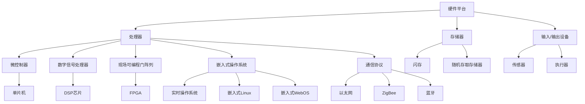

                 

 

智能设备正在改变我们的生活，从智能手机到智能家居，再到智能可穿戴设备和物联网（IoT）设备，它们正在成为我们日常生活中不可或缺的一部分。嵌入式系统作为智能设备的核心组成部分，其设计实现的复杂性和重要性日益凸显。本文将探讨嵌入式系统的基础知识、核心算法、数学模型、项目实践，以及未来应用展望，旨在为读者提供一幅全面的嵌入式系统开发蓝图。

## 关键词
- 智能设备
- 嵌入式系统
- 系统设计
- 算法实现
- 数学模型
- 项目实践
- 未来展望

## 摘要
本文首先介绍了嵌入式系统的基础知识，包括其定义、发展历程和应用领域。接着，深入探讨了嵌入式系统的核心算法原理，包括算法概述、步骤详解、优缺点分析以及应用领域。随后，我们详细讲解了数学模型的构建过程、公式推导以及案例分析。在项目实践部分，通过代码实例和详细解释，展示了嵌入式系统开发的实际操作过程。最后，我们对嵌入式系统的未来应用场景进行了展望，并提出了可能面临的挑战和研究方向。

### 背景介绍

#### 嵌入式系统的定义

嵌入式系统（Embedded System）是指嵌入在其他设备中，执行特定功能的计算机系统。与通用计算机系统不同，嵌入式系统通常具有以下特点：

1. **专用性**：嵌入式系统通常设计用于执行特定的任务，而非通用计算。
2. **实时性**：许多嵌入式系统需要在特定的时间内完成特定任务，具有严格的实时性能要求。
3. **资源受限**：嵌入式系统通常资源受限，包括处理器速度、内存和存储空间。
4. **集成性**：嵌入式系统往往与其他硬件设备集成在一起，形成一个完整的系统。

#### 嵌入式系统的发展历程

嵌入式系统的发展历程可以追溯到20世纪60年代。当时，计算机技术刚刚起步，计算机体积庞大、价格昂贵，不适合广泛使用。为了解决特定问题，研究人员开始将计算机嵌入到其他设备中，例如工业控制设备、汽车发动机控制系统等。

随着微处理器技术的发展，嵌入式系统逐渐成为可能。1971年，英特尔（Intel）推出了第一个商用微处理器4004，这标志着嵌入式系统时代的到来。此后，嵌入式系统在各个领域得到了广泛应用，从消费电子、工业控制到医疗设备、航空航天，无处不在。

#### 嵌入式系统的应用领域

嵌入式系统的应用领域非常广泛，涵盖了生活的方方面面：

1. **消费电子**：智能手机、平板电脑、智能电视等。
2. **工业控制**：生产线自动化、机器控制、传感器网络等。
3. **医疗设备**：心电图机、CT扫描仪、胰岛素泵等。
4. **交通工具**：汽车引擎控制、自动驾驶系统、航空电子设备等。
5. **智能家居**：智能门锁、智能照明、智能空调等。
6. **物联网**：智能家居设备、智能安防系统、智能交通系统等。

### 核心概念与联系

为了深入理解嵌入式系统，我们需要了解其核心概念，包括硬件平台、软件架构、操作系统和通信协议。以下是一个简化的Mermaid流程图，展示这些核心概念之间的联系。



#### 核心概念原理

1. **硬件平台**：硬件平台是嵌入式系统的物理基础，包括处理器、存储器、输入/输出设备等。其中，处理器是核心，负责执行指令和计算。存储器用于存储程序和数据。输入/输出设备用于与外部世界交互。
2. **处理器**：处理器可以是微控制器（MCU）、数字信号处理器（DSP）或现场可编程门阵列（FPGA）。微控制器通常用于简单的控制任务，DSP擅长处理数字信号，而FPGA可以定制，适用于复杂的逻辑和并行处理。
3. **嵌入式操作系统**：嵌入式操作系统（OS）是嵌入式系统的核心软件，负责管理硬件资源、调度任务和提供应用接口。常见的嵌入式操作系统有实时操作系统（RTOS）、嵌入式Linux和嵌入式WebOS等。
4. **通信协议**：通信协议定义了设备之间如何交换数据。常见的通信协议包括以太网、ZigBee和蓝牙等，它们在物联网（IoT）设备中尤为重要。

### 核心算法原理 & 具体操作步骤

#### 3.1 算法原理概述

嵌入式系统中的核心算法通常是针对特定任务和需求设计的。以下是一些常见算法及其原理：

1. **控制算法**：控制算法用于调节嵌入式系统的行为，使其达到预期目标。常见的控制算法有PID控制、模糊控制和神经网络控制等。
2. **信号处理算法**：信号处理算法用于对传感器数据进行处理，提取有用的信息。常见的算法有傅里叶变换、小波变换和卷积等。
3. **通信算法**：通信算法用于确保数据在嵌入式系统之间的可靠传输。常见的算法有TCP/IP、UDP和ZigBee等。

#### 3.2 算法步骤详解

以PID控制算法为例，其步骤如下：

1. **设定目标值**：首先，需要设定系统希望达到的目标值。
2. **采集当前值**：通过传感器采集当前系统的状态值。
3. **计算偏差**：计算目标值与当前值之间的偏差。
4. **计算控制量**：根据偏差值计算控制量，以调节系统的行为。
5. **执行控制动作**：根据计算出的控制量执行相应的动作。

#### 3.3 算法优缺点

PID控制算法具有以下优缺点：

- **优点**：
  - 简单易实现，对大多数系统都能提供良好的控制效果。
  - 对参数调整的敏感性较低，不易产生振荡。

- **缺点**：
  - 对系统的非线性特性处理较差。
  - 对参数调整需要经验，可能需要多次调试。

#### 3.4 算法应用领域

PID控制算法广泛应用于以下领域：

- **工业控制**：例如，电机控制、温度控制、压力控制等。
- **汽车电子**：例如，引擎控制、悬挂系统控制等。
- **消费电子**：例如，智能手机的触摸屏控制、音频设备音量控制等。

### 数学模型和公式 & 详细讲解 & 举例说明

#### 4.1 数学模型构建

在嵌入式系统中，数学模型用于描述系统的行为和特性。一个基本的数学模型可以包括以下部分：

- **状态变量**：描述系统的当前状态。
- **输入变量**：外部输入，例如控制信号。
- **输出变量**：系统的输出，例如传感器读数。
- **动态方程**：描述状态变量、输入变量和输出变量之间的关系。

以下是一个简单的数学模型示例：

$$
\begin{cases}
\dot{x} = ax + bu \\
y = cx + du
\end{cases}
$$

其中，\(x\) 是状态变量，\(u\) 是输入变量，\(y\) 是输出变量。\(a\)、\(b\)、\(c\) 和 \(d\) 是系统参数。

#### 4.2 公式推导过程

以上述模型为例，我们可以推导出系统的传递函数：

$$
G(s) = \frac{Y(s)}{U(s)} = C(sI - A)^{-1}B + D
$$

其中，\(G(s)\) 是传递函数，\(C\)、\(A\)、\(B\) 和 \(D\) 分别是系统的状态矩阵、输入矩阵、输出矩阵和直接传递矩阵。

#### 4.3 案例分析与讲解

假设我们有一个控制系统，其中温度传感器采集当前温度，加热器根据温度偏差调节加热功率。系统的数学模型如下：

$$
\begin{cases}
\dot{T} = 0.1T - 0.05u \\
y = T - 25
\end{cases}
$$

其中，\(T\) 是温度传感器读数，\(u\) 是加热功率。

我们希望系统在输入温度偏差为0时，输出温度稳定在25°C。

根据传递函数，我们可以计算出系统的响应：

$$
G(s) = \frac{y(s)}{u(s)} = \frac{0.1}{s + 0.1}
$$

对于单位阶跃输入 \(u(t) = 1\)，系统的输出响应为：

$$
y(t) = 0.1(1 - e^{-0.1t})
$$

#### 5. 项目实践：代码实例和详细解释说明

在本节中，我们将通过一个简单的项目实例，展示嵌入式系统开发的实际操作过程。我们选择一个温度控制项目，使用微控制器（MCU）和温度传感器实现。

#### 5.1 开发环境搭建

首先，我们需要搭建开发环境。本文使用Arduino IDE作为开发环境，硬件平台为Arduino Uno。

1. 下载并安装Arduino IDE。
2. 连接Arduino Uno到电脑，打开Arduino IDE。
3. 选择正确的Arduino型号和端口。

#### 5.2 源代码详细实现

以下是温度控制项目的源代码：

```cpp
#include <Arduino.h>

// 温度传感器引脚定义
const int tempSensorPin = A0;

// 加热器引脚定义
const int heaterPin = 9;

// 设置目标温度
const float targetTemp = 25.0;

void setup() {
  // 初始化引脚
  pinMode(tempSensorPin, INPUT);
  pinMode(heaterPin, OUTPUT);

  // 初始化串口通信
  Serial.begin(9600);
}

void loop() {
  // 读取温度传感器值
  int sensorValue = analogRead(tempSensorPin);
  float tempC = sensorValue * (5.0 / 1023.0) * 100;

  // 计算温度偏差
  float tempDiff = tempC - targetTemp;

  // 根据温度偏差调节加热功率
  float heaterPower = constrain(map(tempDiff, -10, 10, 0, 255), 0, 255);
  analogWrite(heaterPin, heaterPower);

  // 打印温度和加热功率
  Serial.print("Temperature: ");
  Serial.print(tempC);
  Serial.print("C, Heater Power: ");
  Serial.println(heaterPower);

  // 延时
  delay(1000);
}
```

#### 5.3 代码解读与分析

1. **引脚定义**：我们定义了温度传感器和加热器的引脚。
2. **setup函数**：初始化引脚和串口通信。
3. **loop函数**：读取温度传感器值，计算温度偏差，调节加热功率，并打印温度和加热功率。

#### 5.4 运行结果展示

当系统运行时，我们可以通过串口监视器查看温度和加热功率的变化。目标温度为25°C，当实际温度低于目标温度时，加热功率逐渐增加，反之逐渐减小。

### 实际应用场景

嵌入式系统在许多实际应用场景中发挥着关键作用。以下是一些典型的应用场景：

1. **智能家居**：智能家居设备，如智能门锁、智能照明和智能空调，依赖于嵌入式系统来实现自动化控制和远程监控。
2. **工业自动化**：嵌入式系统在工业自动化领域扮演着重要角色，如生产线自动化、机器控制和机器人控制等。
3. **医疗设备**：医疗设备，如心电图机、CT扫描仪和胰岛素泵，依赖于嵌入式系统来实时监测和控制系统。
4. **交通系统**：嵌入式系统在交通系统中得到广泛应用，如汽车引擎控制、自动驾驶系统和交通信号控制等。
5. **物联网**：物联网（IoT）设备，如智能传感器、智能设备和智能网络，依赖于嵌入式系统来实现数据采集、传输和处理。

### 未来应用展望

随着技术的发展，嵌入式系统在未来的应用前景将更加广阔。以下是一些可能的趋势：

1. **更高性能的处理器**：随着处理器技术的进步，嵌入式系统将能够执行更复杂的任务，处理更多的数据。
2. **更高效的能源管理**：随着能源效率的提高，嵌入式系统将能够更好地管理能源消耗，延长电池寿命。
3. **更先进的通信技术**：5G、物联网（IoT）和边缘计算等技术的进步将使得嵌入式系统之间的通信更加高效和可靠。
4. **更智能的算法**：随着人工智能和机器学习技术的发展，嵌入式系统将能够更好地处理复杂的数据，实现更智能的决策和控制。

### 工具和资源推荐

为了更好地进行嵌入式系统开发，以下是一些建议的工具和资源：

1. **学习资源**：
   - 《嵌入式系统原理与应用》
   - 《嵌入式系统设计与开发实践》
   - 《嵌入式Linux系统编程》
2. **开发工具**：
   - Arduino IDE
   - PlatformIO
   - Keil uVision
3. **相关论文**：
   - "An Introduction to Embedded Systems"
   - "Embedded System Design: A Unified Hardware/Software Approach"
   - "Embedded Systems: Introduction to Real-Time Systems and Design"

### 总结：未来发展趋势与挑战

嵌入式系统在智能设备中的应用前景广阔，随着处理器技术、通信技术和人工智能技术的不断进步，嵌入式系统将能够实现更高效、更智能、更可靠的性能。然而，也面临着一些挑战，如能源效率、安全性和实时性等。未来，嵌入式系统的研究将集中在如何更好地管理这些挑战，实现更广泛的应用。

### 附录：常见问题与解答

1. **什么是嵌入式系统？**
   嵌入式系统是指嵌入在其他设备中，执行特定功能的计算机系统。与通用计算机系统不同，嵌入式系统通常具有专用性、实时性、资源受限和集成性等特点。

2. **嵌入式系统有哪些应用领域？**
   嵌入式系统的应用领域非常广泛，包括消费电子、工业控制、医疗设备、交通工具、智能家居和物联网等。

3. **如何选择嵌入式系统的硬件平台？**
   选择嵌入式系统的硬件平台需要考虑任务需求、性能要求、资源限制和成本预算等因素。常用的硬件平台有微控制器（MCU）、数字信号处理器（DSP）和现场可编程门阵列（FPGA）等。

4. **什么是嵌入式操作系统？**
   嵌入式操作系统是嵌入式系统的核心软件，负责管理硬件资源、调度任务和提供应用接口。常见的嵌入式操作系统有实时操作系统（RTOS）、嵌入式Linux和嵌入式WebOS等。

5. **如何实现嵌入式系统中的实时控制？**
   实现嵌入式系统中的实时控制通常需要使用实时操作系统（RTOS）和特定的算法。RTOS可以确保任务在规定的时间内完成，算法可以确保系统按照预期响应。

6. **如何提高嵌入式系统的能源效率？**
   提高嵌入式系统的能源效率可以通过优化硬件设计、优化软件算法和采用节能技术等方法实现。例如，可以选择低功耗的处理器，优化程序代码以减少不必要的功耗等。

7. **如何确保嵌入式系统的安全性？**
   确保嵌入式系统的安全性需要从硬件、软件和通信等方面进行综合考虑。可以采用加密技术、访问控制和安全协议等措施来提高系统的安全性。

作者：禅与计算机程序设计艺术 / Zen and the Art of Computer Programming

