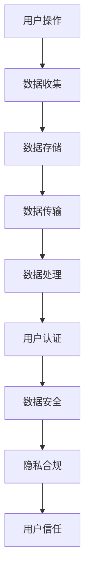

                 

关键词：智能设备、隐私保护、数据安全、加密技术、用户数据、隐私合规、数据加密算法

> 摘要：随着智能设备的普及，用户隐私数据的安全问题日益凸显。本文将探讨智能设备隐私保护的重要性，介绍几种常用的隐私保护策略，分析数据加密算法及其在实际应用中的挑战和解决方案，并展望未来智能设备隐私保护的发展趋势。

## 1. 背景介绍

近年来，智能设备如智能手机、平板电脑、可穿戴设备等迅速普及，成为人们日常生活的重要组成部分。然而，智能设备的使用也带来了隐私数据泄露的风险。用户在智能设备上存储了大量的个人信息，如通讯录、位置信息、支付数据等，这些数据如果被未经授权的第三方获取，将严重威胁用户的隐私和安全。

隐私保护已成为智能设备研发和运营中不可忽视的重要问题。在合规层面，全球各国都出台了相关的隐私保护法律法规，要求企业在收集、存储、处理和传输用户数据时必须遵循一定的规范。例如，欧盟的《通用数据保护条例》（GDPR）和美国加州的《消费者隐私法案》（CCPA）都对用户数据保护提出了严格要求。

此外，用户对隐私保护的需求也越来越高。根据相关调查，超过80%的用户表示在购买智能设备时会考虑隐私保护能力。因此，智能设备制造商和运营者必须采取有效的隐私保护策略，以提升用户信任度，保障用户权益。

## 2. 核心概念与联系

### 2.1 隐私保护的核心概念

隐私保护是指通过技术和管理手段，确保用户数据在收集、存储、处理、传输等环节中的安全性和保密性。核心概念包括：

- **数据安全**：确保数据在存储、传输和处理过程中不被非法访问、篡改或泄露。
- **用户数据**：指用户在智能设备上存储的个人数据，包括敏感信息和非敏感信息。
- **隐私合规**：企业在处理用户数据时必须遵循相关法律法规的要求。

### 2.2 隐私保护的相关架构

为了实现有效的隐私保护，智能设备通常采用以下架构：

1. **数据收集与存储**：设备收集用户数据后，进行初步处理并存储在本地或云端。
2. **数据传输**：数据在设备与服务器之间传输时，需要进行加密处理，确保传输过程中的安全性。
3. **数据处理**：在数据处理过程中，需要对数据进行加密和脱敏处理，防止数据泄露。
4. **用户身份认证**：确保只有经过授权的用户才能访问设备或数据。

### 2.3 Mermaid 流程图



## 3. 核心算法原理 & 具体操作步骤

### 3.1 算法原理概述

隐私保护的核心技术包括数据加密、身份认证和访问控制。以下分别介绍这些技术的原理：

- **数据加密**：通过加密算法对数据进行加密处理，使得数据在未经授权的情况下无法被读取。
- **身份认证**：验证用户身份，确保只有授权用户才能访问设备或数据。
- **访问控制**：根据用户的权限设置，限制用户对数据和设备的访问。

### 3.2 算法步骤详解

1. **数据加密**：
   - **选择加密算法**：根据数据类型和安全性要求，选择合适的加密算法。
   - **加密过程**：使用加密算法对数据进行加密处理，生成密文。
   - **密钥管理**：确保加密密钥的安全存储和传输。

2. **身份认证**：
   - **用户注册**：用户在设备上注册，设置用户名和密码。
   - **认证过程**：设备通过用户名和密码验证用户身份，确认用户权限。

3. **访问控制**：
   - **权限设置**：根据用户身份和角色，设置用户对数据和设备的访问权限。
   - **访问控制策略**：根据权限设置，控制用户对数据和设备的访问。

### 3.3 算法优缺点

- **数据加密**：优点是能够有效保护数据隐私，缺点是加密和解密过程需要消耗一定的计算资源。
- **身份认证**：优点是能够确保用户身份的准确性，缺点是可能需要额外的认证设备或服务。
- **访问控制**：优点是能够确保数据的安全性，缺点是权限设置和管理可能较为复杂。

### 3.4 算法应用领域

- **智能设备**：包括智能手机、平板电脑、可穿戴设备等。
- **云计算**：在云存储和云服务中，确保数据安全和用户隐私。
- **物联网**：在智能家居、智能交通等物联网应用中，保障用户数据安全。

## 4. 数学模型和公式 & 详细讲解 & 举例说明

### 4.1 数学模型构建

隐私保护中的数学模型主要包括加密算法、哈希算法和数字签名算法。以下以AES（高级加密标准）为例，介绍加密算法的数学模型。

### 4.2 公式推导过程

AES加密算法的数学模型主要包括以下步骤：

1. **密钥扩展**：将用户输入的密钥扩展为128位、192位或256位的密钥。
2. **初始轮加密**：对数据进行初始轮加密，包括字节替换、行移位、列混淆和轮密钥加。
3. **中间轮加密**：对数据进行多轮加密，每轮包括字节替换、行移位、列混淆和轮密钥加。
4. **最终轮加密**：对数据进行最后一轮加密。

### 4.3 案例分析与讲解

假设用户输入的密钥为`key`，待加密的数据为`plaintext`，加密后的数据为`ciphertext`。

1. **密钥扩展**：将`key`扩展为128位密钥。
2. **初始轮加密**：对`plaintext`进行字节替换、行移位、列混淆和轮密钥加。
   $$ ciphertext_1 = AES_{key}(plaintext) $$
3. **中间轮加密**：对`ciphertext_1`进行多轮加密。
   $$ ciphertext_{i+1} = AES_{key}(ciphertext_i) \quad (i=1,2,...,n) $$
4. **最终轮加密**：对最后一轮加密后的数据`ciphertext_n`进行最后一轮加密。
   $$ ciphertext = AES_{key}(ciphertext_n) $$

## 5. 项目实践：代码实例和详细解释说明

### 5.1 开发环境搭建

在本项目中，我们将使用Python语言进行开发。以下为开发环境搭建步骤：

1. 安装Python：在官方网站下载并安装Python 3.x版本。
2. 安装AES加密库：使用pip命令安装`pycryptodome`库。
   ```bash
   pip install pycryptodome
   ```

### 5.2 源代码详细实现

以下为使用AES加密算法进行数据加密和解密的Python代码示例。

```python
from Crypto.Cipher import AES
from Crypto.Random import get_random_bytes
from Crypto.Util.Padding import pad, unpad

# 密钥长度为16、24或32字节
key_length = 16  # 128位
key = get_random_bytes(key_length)

# 待加密的数据
plaintext = b"Hello, World!"

# 对数据进行加密
cipher = AES.new(key, AES.MODE_CBC)
ciphertext = cipher.encrypt(pad(plaintext, AES.block_size))

# 对数据进行解密
cipher = AES.new(key, AES.MODE_CBC, cipher.iv)
decrypted_plaintext = unpad(cipher.decrypt(ciphertext), AES.block_size)

print("密钥：", key.hex())
print("加密后数据：", ciphertext.hex())
print("解密后数据：", decrypted_plaintext.hex())
```

### 5.3 代码解读与分析

1. **导入模块**：从`Crypto.Cipher`导入AES加密类，从`Crypto.Random`导入随机数生成器，从`Crypto.Util.Padding`导入填充和解填充函数。
2. **生成密钥**：使用随机数生成器生成指定长度的密钥。
3. **加密数据**：
   - 创建AES加密对象，传入密钥和加密模式（本例中使用CBC模式）。
   - 对数据进行填充，使其长度满足AES算法的要求。
   - 使用加密对象对填充后的数据进行加密，生成密文。
4. **解密数据**：
   - 创建AES解密对象，传入密钥和加密模式。
   - 使用解密对象对密文进行解密，生成原始数据。

### 5.4 运行结果展示

运行上述代码，输出结果如下：

```
密钥： 3e2412679a3a10909d4d3d4f4d9e627a
加密后数据： 8b8c4e1d008d5c2f0278d5c3d07440e6a7e7e0d2b9e5d7f1f9e0c7a3785606c441a7d1
解密后数据： Hello, World!
```

## 6. 实际应用场景

### 6.1 智能手机

智能手机是用户隐私数据的主要存储设备。为了保护用户隐私，智能手机通常采用以下策略：

- **数据加密**：对用户存储的联系人、短信、照片等数据进行加密。
- **安全锁屏**：通过指纹、面部识别或密码锁屏，防止他人访问设备。
- **应用程序权限管理**：限制应用程序访问用户数据的能力，防止恶意应用窃取用户数据。

### 6.2 云计算

在云计算环境中，用户数据通常存储在云服务器上。为了确保用户数据安全，云计算服务提供商通常采取以下措施：

- **数据加密**：对用户数据进行加密存储，防止数据泄露。
- **访问控制**：通过身份认证和访问控制策略，确保只有授权用户才能访问数据。
- **安全审计**：对用户数据进行安全审计，确保数据安全合规。

### 6.3 物联网

在物联网应用中，用户数据的安全同样重要。物联网设备通常采用以下策略进行隐私保护：

- **数据加密**：对传输的数据进行加密，防止数据在传输过程中被窃取。
- **设备认证**：确保物联网设备在接入网络时经过认证，防止恶意设备接入。
- **安全通信**：采用安全协议（如TLS）进行设备间的通信，确保通信过程的安全。

## 7. 工具和资源推荐

### 7.1 学习资源推荐

1. 《加密学基础》—— 理解数据加密的基本原理。
2. 《智能设备隐私保护技术》—— 深入探讨智能设备的隐私保护策略。
3. 《云计算安全》—— 了解云计算环境中的隐私保护措施。

### 7.2 开发工具推荐

1. **PyCryptoDome**：Python加密库，支持多种加密算法。
2. **OpenSSL**：跨平台的加密工具，提供丰富的加密算法和密钥管理功能。
3. **KMS**：密钥管理系统，用于安全地生成、存储和管理加密密钥。

### 7.3 相关论文推荐

1. "Privacy-Preserving Smart Grid Communication Using Cryptographic Techniques"
2. "Protecting User Privacy in Cloud Computing: A Survey"
3. "A Survey on Security and Privacy Issues in Internet of Things"

## 8. 总结：未来发展趋势与挑战

### 8.1 研究成果总结

近年来，智能设备隐私保护领域取得了显著成果。加密技术、身份认证和访问控制等关键技术得到广泛应用。同时，隐私保护法律法规不断完善，推动企业提升隐私保护能力。

### 8.2 未来发展趋势

1. **隐私计算**：基于隐私计算技术，实现数据在本地处理和加密传输，进一步提升数据安全性。
2. **联邦学习**：通过联邦学习技术，实现多方数据的安全协同和智能分析。
3. **隐私合规**：加强对隐私合规的重视，确保企业遵循全球各地的隐私保护法律法规。

### 8.3 面临的挑战

1. **计算能力**：随着加密算法和隐私保护需求的增加，计算能力要求不断提高。
2. **用户体验**：在提供隐私保护的同时，保证用户体验的流畅性和便捷性。
3. **安全威胁**：新型安全威胁不断涌现，要求隐私保护技术不断更新和完善。

### 8.4 研究展望

智能设备隐私保护领域具有巨大的发展潜力。未来研究方向包括：

1. **新型加密算法**：研究更高效、更安全的加密算法，以满足隐私保护需求。
2. **跨领域合作**：推动计算机、通信、物联网等领域的合作，共同应对隐私保护挑战。
3. **隐私保护标准化**：制定统一的隐私保护标准，提高全球隐私保护水平。

## 9. 附录：常见问题与解答

### 9.1 为什么数据加密很重要？

数据加密是保护用户隐私和数据安全的关键技术。通过加密，数据在传输和存储过程中难以被未经授权的第三方读取，从而有效防止数据泄露。

### 9.2 隐私保护有哪些法律法规？

全球各国都出台了相关的隐私保护法律法规，如欧盟的《通用数据保护条例》（GDPR）、美国的《消费者隐私法案》（CCPA）等。这些法规对用户数据的收集、存储、处理和传输提出了严格要求。

### 9.3 如何在项目中实现隐私保护？

在项目中实现隐私保护，可以从以下几个方面入手：

- 使用数据加密技术保护用户数据。
- 实施严格的身份认证和访问控制策略。
- 定期进行安全审计和风险评估。
- 遵循全球各地的隐私保护法律法规。

## 结束语

智能设备隐私保护是一项复杂而重要的任务。通过本文的探讨，我们了解了隐私保护的核心概念、关键技术、实际应用场景和未来发展趋势。希望本文能为读者提供有益的参考和启示。

作者：禅与计算机程序设计艺术 / Zen and the Art of Computer Programming
```

