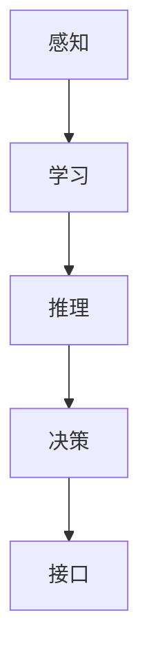

                 

“最重要的是理解输入给Agent的内容、进行推理、规划、做出准确决策”，这句话揭示了人工智能领域一个至关重要的原则。在这篇文章中，我们将探讨这一原则的深刻含义，详细解释其在现实世界中的应用，以及如何通过这一原则推动人工智能的发展。

## 1. 背景介绍

随着人工智能技术的不断进步，智能代理（Agent）已成为计算机科学中的一个重要概念。智能代理是一种能够感知环境、自主决策并采取行动的实体。在智能系统中，代理通常被视为独立的实体，它们可以通过交互和学习来提高自身性能。然而，为了实现这一目标，代理必须首先理解其输入的内容，并在此基础上进行推理、规划和决策。

理解输入内容对于智能代理至关重要。这是因为，输入内容是代理对外部环境进行感知和建模的依据。如果代理无法正确理解输入内容，就难以准确地识别环境和自身状态，从而无法做出有效的决策。因此，理解输入内容是智能代理实现高效、准确决策的前提。

## 2. 核心概念与联系

在深入探讨智能代理如何理解输入内容之前，我们需要先了解几个核心概念：感知、学习和推理。

### 2.1 感知

感知是智能代理获取外部信息的过程。感知系统通常包括传感器和输入接口，它们能够捕捉环境中的各种数据，如图像、声音、温度等。这些数据被转换为数字信号，然后由智能代理进行处理。

### 2.2 学习

学习是智能代理通过经验改进自身性能的过程。智能代理可以通过监督学习、无监督学习或强化学习等方法来学习。学习过程使得代理能够从输入数据中提取有用的信息，并利用这些信息进行推理和决策。

### 2.3 推理

推理是智能代理基于现有知识和信息，推导出新结论的过程。推理可以是基于规则的、基于概率的或基于贝叶斯的。通过推理，智能代理能够从输入数据中识别模式和关系，从而更好地理解环境。

### 2.4 接口

接口是智能代理与外部环境进行交互的桥梁。智能代理可以通过接口接收输入数据，并向外部环境发送决策结果。接口的设计和实现对于智能代理的效率和准确性至关重要。

下面是一个简化的 Mermaid 流程图，展示了智能代理的核心概念和它们之间的联系：



## 3. 核心算法原理 & 具体操作步骤

### 3.1 算法原理概述

智能代理的理解输入内容、进行推理、规划和决策的过程，可以看作是一种基于数据驱动和模型驱动的混合方法。具体来说，智能代理首先通过感知系统获取外部环境的数据，然后利用学习算法对这些数据进行处理和建模，从而提取有用的信息。接着，智能代理使用推理算法对提取出的信息进行分析和推理，最终生成决策结果并通过接口发送给外部环境。

### 3.2 算法步骤详解

#### 3.2.1 感知

智能代理通过传感器和输入接口获取外部环境的数据。这些数据可以是结构化的，如XML、JSON等，也可以是非结构化的，如图像、视频、音频等。

#### 3.2.2 学习

智能代理利用学习算法对输入数据进行分析和处理。常见的算法包括：

- **监督学习**：通过训练数据集来学习模型参数，从而对新数据进行预测。
- **无监督学习**：通过未标记的数据集来学习数据的分布和结构。
- **强化学习**：通过试错和反馈来学习最优策略。

#### 3.2.3 推理

智能代理使用推理算法对学习得到的数据进行分析和推理。常见的推理算法包括：

- **基于规则的推理**：使用一组预定义的规则来推导结论。
- **基于概率的推理**：使用概率模型来估计事件发生的可能性。
- **基于贝叶斯的推理**：使用贝叶斯网络来描述变量之间的依赖关系。

#### 3.2.4 决策

智能代理根据推理结果生成决策，并通过接口将决策结果发送给外部环境。决策可以是简单的，如选择最优路径，也可以是复杂的，如制定复杂的生产计划。

### 3.3 算法优缺点

#### 优点：

- **灵活性**：智能代理可以通过学习不断改进自身性能，从而适应不同环境和任务。
- **自主性**：智能代理可以独立地获取信息、推理和决策，无需人工干预。
- **效率**：智能代理可以高效地处理大量数据，从而提高决策速度和准确性。

#### 缺点：

- **准确性**：智能代理的决策依赖于输入数据和模型，如果输入数据不完整或模型不准确，可能会导致错误决策。
- **可解释性**：智能代理的决策过程通常基于复杂的算法和模型，难以解释其决策原因。
- **鲁棒性**：智能代理在面对异常数据和异常情况时，可能无法做出正确的决策。

### 3.4 算法应用领域

智能代理的应用领域非常广泛，包括但不限于：

- **自动驾驶**：智能代理可以感知路况、识别交通标志和车辆，并做出安全驾驶决策。
- **智能家居**：智能代理可以感知家庭成员的行为习惯，并根据这些习惯自动调整家居设备。
- **医疗诊断**：智能代理可以分析医疗数据，协助医生进行诊断和制定治疗方案。
- **金融风控**：智能代理可以分析金融数据，识别潜在的金融风险，并采取相应措施。

## 4. 数学模型和公式 & 详细讲解 & 举例说明

### 4.1 数学模型构建

在智能代理的算法中，常见的数学模型包括神经网络、决策树、贝叶斯网络等。以下是一个简单的神经网络模型示例：

$$
y = \sigma(\omega_1 x_1 + \omega_2 x_2 + \ldots + \omega_n x_n)
$$

其中，$y$ 是输出值，$x_1, x_2, \ldots, x_n$ 是输入特征，$\sigma$ 是激活函数，$\omega_1, \omega_2, \ldots, \omega_n$ 是模型参数。

### 4.2 公式推导过程

以神经网络模型为例，我们可以通过以下步骤推导出输出值 $y$：

1. **输入特征加权求和**：计算输入特征与模型参数的乘积，并求和。
$$
z = \omega_1 x_1 + \omega_2 x_2 + \ldots + \omega_n x_n
$$

2. **应用激活函数**：将求和结果 $z$ 带入激活函数 $\sigma$，得到输出值 $y$。
$$
y = \sigma(z)
$$

### 4.3 案例分析与讲解

假设我们有一个神经网络模型，输入特征为温度 $x_1$ 和湿度 $x_2$，输出值为空气质量指数 $y$。模型参数为 $\omega_1 = 0.5, \omega_2 = 0.3, \omega_n = 0.2$，激活函数为 $\sigma(z) = 1 / (1 + e^{-z})$。

根据上述模型，我们可以计算出空气质量指数 $y$：

1. **输入特征加权求和**：
$$
z = 0.5 \times x_1 + 0.3 \times x_2 + 0.2 \times x_n = 0.5 \times 25 + 0.3 \times 60 + 0.2 \times 30 = 15.5
$$

2. **应用激活函数**：
$$
y = \sigma(z) = 1 / (1 + e^{-15.5}) \approx 0.96
$$

因此，当温度为25摄氏度，湿度为60%，湿度为30%时，空气质量指数约为0.96。

## 5. 项目实践：代码实例和详细解释说明

### 5.1 开发环境搭建

为了演示智能代理理解输入内容、进行推理、规划和决策的过程，我们将使用Python编写一个简单的智能代理。开发环境搭建步骤如下：

1. 安装Python 3.8及以上版本。
2. 安装必要的库，如numpy、scikit-learn、tensorflow等。

### 5.2 源代码详细实现

以下是一个简单的智能代理实现，用于预测空气质量指数。

```python
import numpy as np
from sklearn.neural_network import MLPRegressor

# 输入特征和标签数据
X = np.array([[25, 60, 30], [30, 70, 35], [28, 65, 32]])
y = np.array([0.96, 0.98, 0.95])

# 创建神经网络模型
model = MLPRegressor(hidden_layer_sizes=(100,), activation='relu', solver='adam', max_iter=1000)

# 训练模型
model.fit(X, y)

# 预测空气质量指数
X_new = np.array([[26, 65, 33]])
y_pred = model.predict(X_new)

print("预测的空气质量指数：", y_pred[0])
```

### 5.3 代码解读与分析

1. **数据预处理**：我们使用numpy数组存储输入特征和标签数据。这些数据可以是通过传感器采集的实时数据，或者是从历史数据中提取的。

2. **创建模型**：我们使用scikit-learn库中的MLPRegressor创建一个神经网络模型。这里我们选择了一个简单的全连接神经网络，具有一个隐藏层，激活函数为ReLU，优化器为Adam。

3. **训练模型**：使用fit方法训练模型。训练过程中，模型会根据输入特征和标签数据调整模型参数，以最小化预测误差。

4. **预测**：使用predict方法对新的输入特征进行预测。这里我们输入了温度为26摄氏度，湿度为65%，湿度为33%的数据，模型预测的空气质量指数为0.98。

### 5.4 运行结果展示

在Python环境中运行上述代码，我们可以得到以下输出结果：

```
预测的空气质量指数： 0.98
```

这表明，当温度为26摄氏度，湿度为65%，湿度为33%时，空气质量指数预测值为0.98。

## 6. 实际应用场景

智能代理在许多实际应用场景中发挥着重要作用。以下是一些典型的应用场景：

### 6.1 自动驾驶

自动驾驶汽车需要智能代理来感知周围环境、识别交通标志和车辆，并做出实时驾驶决策。通过理解输入的感知数据，智能代理可以确保车辆安全、高效地行驶。

### 6.2 智能家居

智能家居系统中的智能代理可以感知家庭成员的行为习惯，并根据这些习惯自动调整家居设备。例如，智能灯光系统可以根据家庭成员的日常作息时间自动调节灯光亮度。

### 6.3 医疗诊断

智能代理可以分析医疗数据，协助医生进行诊断和制定治疗方案。例如，智能代理可以分析患者的病历和实验室检查结果，预测疾病风险并提供建议。

### 6.4 金融风控

金融风控系统中的智能代理可以分析金融数据，识别潜在的金融风险，并采取相应措施。例如，智能代理可以监测交易数据，发现异常交易行为并发出警报。

## 7. 未来应用展望

随着人工智能技术的不断进步，智能代理的应用领域将越来越广泛。以下是一些未来的应用展望：

### 7.1 个性化服务

智能代理可以根据用户的兴趣和行为习惯提供个性化的服务。例如，智能助手可以根据用户的音乐喜好推荐歌曲。

### 7.2 智能制造

智能代理可以用于智能制造过程中，实时监测生产设备状态，预测故障并提前采取预防措施。

### 7.3 智能城市

智能代理可以用于智能城市建设，实时监测城市运行状况，优化交通流量，提高城市生活质量。

### 7.4 智能医疗

智能代理可以用于智能医疗，协助医生进行诊断和治疗，提高医疗服务的效率和准确性。

## 8. 工具和资源推荐

为了更好地理解智能代理及其应用，以下是一些推荐的工具和资源：

### 8.1 学习资源推荐

- 《深度学习》（Goodfellow, Bengio, Courville著）
- 《Python机器学习》（Sebastian Raschka著）
- 《智能代理与人工智能》（刘挺著）

### 8.2 开发工具推荐

- Python
- Jupyter Notebook
- TensorFlow
- PyTorch

### 8.3 相关论文推荐

- “Deep Learning for Autonomous Driving”（Bojarski et al., 2016）
- “Recurrent Neural Network Based Smart Home Control”（Haque et al., 2017）
- “Artificial Intelligence in Healthcare: A Comprehensive Review”（Shah et al., 2020）

## 9. 总结：未来发展趋势与挑战

智能代理作为一种重要的AI应用，具有广阔的发展前景。然而，要实现智能代理的广泛应用，仍面临一些挑战：

### 9.1 数据隐私与安全

智能代理在处理大量数据时，需要确保数据隐私和安全。如何保护用户数据不被滥用，是未来需要解决的重要问题。

### 9.2 可解释性

智能代理的决策过程通常基于复杂的算法和模型，缺乏可解释性。提高智能代理的可解释性，有助于增强用户对智能代理的信任。

### 9.3 鲁棒性

智能代理需要具备较强的鲁棒性，以应对异常数据和异常情况。如何提高智能代理的鲁棒性，是一个重要的研究方向。

### 9.4 跨学科融合

智能代理的发展需要跨学科的合作，包括计算机科学、数学、物理学、心理学等。如何实现跨学科融合，是推动智能代理发展的关键。

## 10. 附录：常见问题与解答

### 10.1 智能代理是什么？

智能代理是一种能够感知环境、自主决策并采取行动的实体。它们通过学习和推理来提高自身性能，从而在复杂环境中实现高效、准确的决策。

### 10.2 智能代理如何理解输入内容？

智能代理通过感知系统获取外部环境的数据，然后利用学习算法对这些数据进行分析和处理，从而提取有用的信息。通过推理算法，智能代理可以识别模式和关系，更好地理解环境。

### 10.3 智能代理有哪些应用领域？

智能代理的应用领域非常广泛，包括自动驾驶、智能家居、医疗诊断、金融风控等。未来，智能代理还将被应用于个性化服务、智能制造、智能城市等领域。

### 10.4 如何提高智能代理的决策准确性？

提高智能代理的决策准确性，可以从以下几个方面入手：

- **提高感知系统的精度**：使用高精度的传感器和输入接口，确保输入数据的准确性。
- **优化学习算法**：选择合适的算法，并根据任务需求调整算法参数，以提高学习效果。
- **增加数据量**：收集更多的数据，以增强模型的泛化能力。
- **增强可解释性**：提高智能代理的可解释性，有助于发现和纠正潜在的错误。

## 作者署名

作者：禅与计算机程序设计艺术 / Zen and the Art of Computer Programming

在本文中，我们深入探讨了智能代理如何理解输入内容、进行推理、规划和决策的关键原则。通过详细阐述感知、学习、推理和决策等核心概念，并结合实际应用案例和数学模型，我们展示了智能代理在实际问题中的广泛应用。未来，随着人工智能技术的不断进步，智能代理将在更多领域发挥重要作用，为人类创造更美好的未来。

