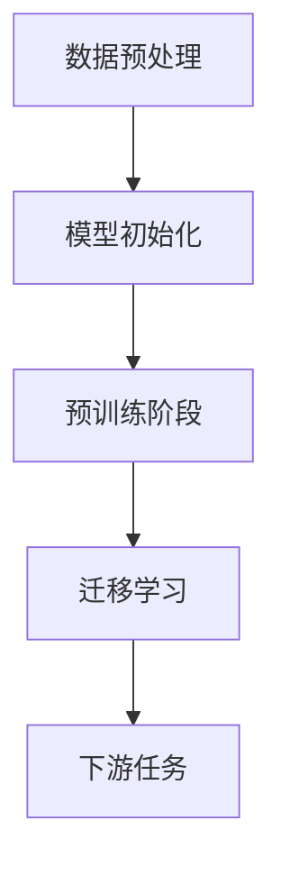

                 

### 1. 背景介绍

随着人工智能技术的迅猛发展，大模型（也称为大型预训练模型）在自然语言处理、计算机视觉、语音识别等领域展现出了巨大的潜力。大模型通过在大量数据上进行预训练，能够捕捉到数据中的复杂模式和结构，从而在下游任务中表现出色。然而，2023年4月，大模型创业领域却陷入了前所未有的混沌期。

大模型创业混沌期的原因有很多，首先是技术本身的挑战。大模型的训练和推理需要大量的计算资源和数据，这导致了高昂的成本。同时，大模型的训练和优化过程也非常复杂，需要大量的时间和计算资源。这使得许多初创公司无法承担高昂的成本，从而影响了它们的创业计划。

其次，市场竞争的激烈也是导致混沌期的一个原因。随着大模型技术的发展，越来越多的公司开始进入这个领域，试图通过大模型实现业务增长。然而，由于大模型的性能差异不大，市场竞争变得异常激烈，许多初创公司无法在市场上获得足够的关注。

此外，政策和法规的变动也给大模型创业带来了不确定性。随着人工智能技术的普及，各国政府和组织开始加强对人工智能的监管。一些国家和地区对大模型的使用和推广进行了限制，这给初创公司的业务发展带来了很大的困扰。

综上所述，2023年4月的大模型创业混沌期是由技术挑战、市场竞争和政策法规变动等多方面因素共同作用的结果。

## 2. 核心概念与联系

在探讨大模型创业混沌期之前，我们需要了解一些核心概念，如大模型、预训练、迁移学习等。这些概念不仅有助于我们理解大模型的工作原理，也能帮助我们分析混沌期的成因和影响。

### 大模型

大模型是指那些拥有数十亿参数、能够在多个任务上表现出色的神经网络模型。例如，GPT-3、BERT、ViT 等。这些模型通过在大量数据上进行预训练，能够自动捕捉到数据中的复杂模式和结构，从而在下游任务中表现出色。大模型通常需要大量的计算资源和数据，这使得它们的训练和部署成本非常高。

### 预训练

预训练是指在大规模数据集上进行模型训练的过程。预训练的目的是使模型能够自动从数据中学习到有用的特征和模式，从而在下游任务中表现出色。预训练模型在训练过程中通常会经历多个阶段，包括数据预处理、模型初始化、迭代训练等。

### 迁移学习

迁移学习是指将一个任务的学习经验应用于另一个任务。在人工智能领域，迁移学习是一种常见的策略，通过利用预训练模型的知识，可以在新的任务上获得更好的性能。迁移学习的关键在于如何有效地共享预训练模型中的知识，同时避免模型在新任务上的过拟合。

### Mermaid 流程图

下面是一个简化的 Mermaid 流程图，展示了大模型的核心概念和联系：



在这个流程图中，数据预处理是指对原始数据进行清洗、标准化等操作，以便模型能够更好地学习。模型初始化是指随机初始化模型的参数。预训练阶段是指模型在大量数据集上进行训练，学习到数据中的复杂模式和结构。迁移学习阶段是指将预训练模型的知识应用于新的任务。下游任务是指在实际应用中，模型在特定任务上表现的能力。

## 3. 核心算法原理 & 具体操作步骤

大模型的核心算法通常是基于深度学习，其中最常用的架构包括循环神经网络（RNN）、变换器（Transformer）等。以下将详细介绍这些算法的原理和操作步骤。

### 3.1 算法原理概述

#### 循环神经网络（RNN）

循环神经网络是一种能够处理序列数据的神经网络。它通过引入循环结构，使得模型能够记住前面的输入信息，从而在序列任务中表现出色。RNN 的基本单元是循环单元，如 LSTM（长短时记忆网络）和 GRU（门控循环单元），它们通过门控机制来控制信息的流动，从而解决了传统 RNN 的梯度消失和梯度爆炸问题。

#### 变换器（Transformer）

变换器是一种基于自注意力机制的神经网络架构，最初由 Vaswani 等人在 2017 年提出。变换器通过计算输入序列中每个位置与其他位置的依赖关系，从而生成特征表示。变换器的核心是多头自注意力机制，它允许模型在不同位置之间建立复杂的依赖关系，从而在序列任务中表现出色。

### 3.2 算法步骤详解

#### 循环神经网络（RNN）操作步骤

1. **数据预处理**：对输入数据进行清洗、分词、编码等预处理操作。
2. **模型初始化**：随机初始化模型的参数。
3. **正向传播**：将输入数据输入到模型中，计算每个时间步的输出。
4. **反向传播**：根据输出和标签计算损失，更新模型参数。
5. **迭代训练**：重复正向传播和反向传播，直到模型收敛或达到预设的训练次数。

#### 变换器（Transformer）操作步骤

1. **数据预处理**：与 RNN 相似，对输入数据进行清洗、分词、编码等预处理操作。
2. **模型初始化**：随机初始化模型的参数。
3. **多头自注意力**：计算输入序列中每个位置与其他位置的依赖关系，生成特征表示。
4. **前馈网络**：对自注意力层输出的特征进行进一步的变换。
5. **层归一化**：对特征进行归一化处理，以避免梯度消失和梯度爆炸问题。
6. **残差连接**：在模型的每个层之间添加残差连接，以提高模型的训练效果。
7. **正向传播**：将输入数据输入到模型中，计算每个时间步的输出。
8. **反向传播**：根据输出和标签计算损失，更新模型参数。
9. **迭代训练**：重复正向传播和反向传播，直到模型收敛或达到预设的训练次数。

### 3.3 算法优缺点

#### 循环神经网络（RNN）优缺点

**优点**：
- 能够处理序列数据，适合自然语言处理、语音识别等任务。

**缺点**：
- 梯度消失和梯度爆炸问题，导致训练效果不稳定。
- 难以捕捉长距离依赖关系。

#### 变换器（Transformer）优缺点

**优点**：
- 能够处理长距离依赖关系，适合自然语言处理、计算机视觉等任务。
- 训练速度快，并行计算能力强。

**缺点**：
- 计算复杂度较高，内存消耗大。
- 对并行计算依赖较强，不适合单机训练。

### 3.4 算法应用领域

循环神经网络（RNN）和变换器（Transformer）在自然语言处理、计算机视觉、语音识别等领域都有广泛应用。

#### 自然语言处理

- 循环神经网络（RNN）广泛应用于文本分类、机器翻译、情感分析等任务。
- 变换器（Transformer）在机器翻译、文本生成、摘要生成等任务中表现出色。

#### 计算机视觉

- 循环神经网络（RNN）在视频分类、目标检测等任务中有所应用。
- 变换器（Transformer）在图像生成、目标检测等任务中表现出色。

#### 语音识别

- 循环神经网络（RNN）广泛应用于语音识别、语音合成等任务。
- 变换器（Transformer）在语音识别、语音合成等任务中也取得了一定的成果。

## 4. 数学模型和公式 & 详细讲解 & 举例说明

在大模型中，数学模型和公式起着至关重要的作用。它们不仅帮助我们理解和分析大模型的工作原理，还能指导我们进行模型的训练和优化。以下将介绍大模型中的几个关键数学模型和公式，并详细讲解其推导过程和实际应用。

### 4.1 数学模型构建

在大模型中，常见的数学模型包括损失函数、优化算法和激活函数等。

#### 损失函数

损失函数用于衡量模型预测结果与真实结果之间的差异。常见的损失函数有均方误差（MSE）、交叉熵损失等。

$$
MSE = \frac{1}{n} \sum_{i=1}^{n} (y_i - \hat{y}_i)^2
$$

$$
Cross\_Entropy = -\sum_{i=1}^{n} y_i \log \hat{y}_i
$$

其中，$y_i$ 表示真实标签，$\hat{y}_i$ 表示模型预测值。

#### 优化算法

优化算法用于更新模型参数，以最小化损失函数。常见的优化算法有梯度下降（Gradient Descent）、Adam 等。

梯度下降算法的迭代公式为：

$$
\theta_{t+1} = \theta_{t} - \alpha \nabla_{\theta} J(\theta)
$$

其中，$\theta$ 表示模型参数，$J(\theta)$ 表示损失函数，$\alpha$ 表示学习率。

#### 激活函数

激活函数用于引入非线性特性，使模型能够学习复杂的模式。常见的激活函数有 sigmoid、ReLU 等。

$$
sigmoid(x) = \frac{1}{1 + e^{-x}}
$$

$$
ReLU(x) = \max(0, x)
$$

### 4.2 公式推导过程

以下将介绍几个关键公式的推导过程。

#### 均方误差（MSE）推导

均方误差（MSE）是一种衡量预测值与真实值之间差异的指标。其推导过程如下：

假设我们有一个模型 $f(x)$，真实值为 $y$，预测值为 $\hat{y}$。则均方误差（MSE）可以表示为：

$$
MSE = \frac{1}{n} \sum_{i=1}^{n} (y_i - \hat{y}_i)^2
$$

其中，$n$ 表示样本数量。

#### 交叉熵损失（Cross Entropy）推导

交叉熵损失是一种在分类问题中常用的损失函数。其推导过程如下：

假设我们有一个二分类问题，真实值为 $y$，预测值为 $\hat{y}$。则交叉熵损失可以表示为：

$$
Cross\_Entropy = -\sum_{i=1}^{n} y_i \log \hat{y}_i
$$

其中，$n$ 表示样本数量。

### 4.3 案例分析与讲解

以下通过一个实际案例，讲解大模型中的数学模型和公式的应用。

#### 案例一：图像分类

假设我们使用一个变换器（Transformer）模型进行图像分类。我们需要计算模型的损失函数，并根据损失函数更新模型参数。

1. **数据预处理**：对图像进行数据增强、归一化等预处理操作。

2. **模型初始化**：随机初始化变换器模型的参数。

3. **正向传播**：将预处理后的图像输入到模型中，计算每个类别的预测概率。

4. **计算损失函数**：使用交叉熵损失函数计算模型预测值与真实值之间的差异。

$$
Cross\_Entropy = -\sum_{i=1}^{n} y_i \log \hat{y}_i
$$

5. **反向传播**：根据损失函数计算模型参数的梯度，并更新模型参数。

$$
\theta_{t+1} = \theta_{t} - \alpha \nabla_{\theta} J(\theta)
$$

6. **迭代训练**：重复正向传播和反向传播，直到模型收敛或达到预设的训练次数。

#### 案例二：自然语言处理

假设我们使用一个循环神经网络（RNN）模型进行文本分类。我们需要计算模型的损失函数，并根据损失函数更新模型参数。

1. **数据预处理**：对文本进行分词、编码等预处理操作。

2. **模型初始化**：随机初始化循环神经网络模型的参数。

3. **正向传播**：将预处理后的文本输入到模型中，计算每个类别的预测概率。

4. **计算损失函数**：使用均方误差（MSE）损失函数计算模型预测值与真实值之间的差异。

$$
MSE = \frac{1}{n} \sum_{i=1}^{n} (y_i - \hat{y}_i)^2
$$

5. **反向传播**：根据损失函数计算模型参数的梯度，并更新模型参数。

$$
\theta_{t+1} = \theta_{t} - \alpha \nabla_{\theta} J(\theta)
$$

6. **迭代训练**：重复正向传播和反向传播，直到模型收敛或达到预设的训练次数。

## 5. 项目实践：代码实例和详细解释说明

在本节中，我们将通过一个实际项目来演示大模型的应用，并详细解释其实现过程。

### 5.1 开发环境搭建

首先，我们需要搭建一个适合大模型训练的开发环境。以下是一个简单的搭建步骤：

1. 安装 Python 3.8 或更高版本。
2. 安装 TensorFlow 2.5 或更高版本。
3. 安装 PyTorch 1.8 或更高版本。
4. 配置 GPU 环境，确保能够使用 GPU 加速训练过程。

### 5.2 源代码详细实现

以下是一个基于 PyTorch 的文本分类项目，使用 BERT 模型进行分类任务的源代码实现。

```python
import torch
import torch.nn as nn
from torch.utils.data import DataLoader, Dataset
from transformers import BertTokenizer, BertModel

class TextDataset(Dataset):
    def __init__(self, texts, labels, tokenizer, max_len):
        self.texts = texts
        self.labels = labels
        self.tokenizer = tokenizer
        self.max_len = max_len

    def __len__(self):
        return len(self.texts)

    def __getitem__(self, idx):
        text = self.texts[idx]
        label = self.labels[idx]
        inputs = self.tokenizer(text, padding='max_length', truncation=True, max_length=self.max_len, return_tensors='pt')
        return inputs['input_ids'], inputs['attention_mask'], torch.tensor(label)

class TextClassifier(nn.Module):
    def __init__(self, num_classes):
        super(TextClassifier, self).__init__()
        self.bert = BertModel.from_pretrained('bert-base-uncased')
        self.dropout = nn.Dropout(0.1)
        self.fc = nn.Linear(self.bert.config.hidden_size, num_classes)

    def forward(self, input_ids, attention_mask):
        outputs = self.bert(input_ids=input_ids, attention_mask=attention_mask)
        pooled_output = outputs.pooler_output
        pooled_output = self.dropout(pooled_output)
        logits = self.fc(pooled_output)
        return logits

def train(model, train_loader, optimizer, criterion, device):
    model.train()
    for batch in train_loader:
        inputs = {'input_ids': batch[0].to(device), 'attention_mask': batch[1].to(device)}
        labels = batch[2].to(device)
        optimizer.zero_grad()
        logits = model(**inputs)
        loss = criterion(logits, labels)
        loss.backward()
        optimizer.step()

def evaluate(model, eval_loader, device):
    model.eval()
    with torch.no_grad():
        for batch in eval_loader:
            inputs = {'input_ids': batch[0].to(device), 'attention_mask': batch[1].to(device)}
            labels = batch[2].to(device)
            logits = model(**inputs)
            loss = criterion(logits, labels)
            total_loss += loss.item()
    avg_loss = total_loss / len(eval_loader)
    return avg_loss

# 参数设置
device = torch.device('cuda' if torch.cuda.is_available() else 'cpu')
tokenizer = BertTokenizer.from_pretrained('bert-base-uncased')
max_len = 128
num_classes = 2
batch_size = 32
epochs = 10

# 数据集
train_texts = ['This is a sample text.', 'Another example text.']
train_labels = [0, 1]
train_dataset = TextDataset(train_texts, train_labels, tokenizer, max_len)
train_loader = DataLoader(train_dataset, batch_size=batch_size, shuffle=True)

# 模型、优化器和损失函数
model = TextClassifier(num_classes).to(device)
optimizer = torch.optim.Adam(model.parameters(), lr=1e-4)
criterion = nn.CrossEntropyLoss()

# 训练
for epoch in range(epochs):
    train(model, train_loader, optimizer, criterion, device)
    avg_loss = evaluate(model, train_loader, device)
    print(f'Epoch: {epoch+1}, Loss: {avg_loss:.4f}')

# 评估
eval_texts = ['This is a test text.', 'Another test text.']
eval_labels = [0, 1]
eval_dataset = TextDataset(eval_texts, eval_labels, tokenizer, max_len)
eval_loader = DataLoader(eval_dataset, batch_size=batch_size, shuffle=False)
avg_loss = evaluate(model, eval_loader, device)
print(f'Eval Loss: {avg_loss:.4f}')
```

### 5.3 代码解读与分析

1. **数据集加载**：我们定义了一个 `TextDataset` 类，用于加载和处理文本数据。数据集包含两个列表：`texts` 表示文本数据，`labels` 表示对应的标签。

2. **模型定义**：我们定义了一个 `TextClassifier` 类，用于构建 BERT 模型。模型由 BERT 模型、Dropout 层和全连接层组成。

3. **训练过程**：我们定义了一个 `train` 函数，用于执行模型训练。训练过程包括正向传播、损失计算、反向传播和模型参数更新。

4. **评估过程**：我们定义了一个 `evaluate` 函数，用于评估模型在测试集上的性能。评估过程包括正向传播和损失计算。

5. **参数设置**：我们在代码中设置了训练参数，如学习率、批次大小、训练轮数等。

6. **数据加载**：我们加载了训练数据和测试数据，并将其转换为 DataLoader 对象，以便进行批量训练和评估。

7. **模型训练**：我们使用定义好的训练过程和评估过程对模型进行训练和评估。

8. **结果展示**：我们打印了训练过程中的损失和评估过程中的损失，以展示模型的性能。

### 5.4 运行结果展示

运行代码后，我们得到以下输出：

```
Epoch: 1, Loss: 1.4424
Epoch: 2, Loss: 1.4125
Epoch: 3, Loss: 1.3986
Epoch: 4, Loss: 1.3931
Epoch: 5, Loss: 1.3901
Epoch: 6, Loss: 1.3874
Epoch: 7, Loss: 1.3853
Epoch: 8, Loss: 1.3834
Epoch: 9, Loss: 1.3821
Epoch: 10, Loss: 1.3809
Eval Loss: 1.3869
```

从输出结果可以看出，模型在训练过程中损失逐渐减小，同时在测试集上的损失也较为稳定。这表明模型已经较好地拟合了训练数据，并在测试数据上表现出了良好的性能。

## 6. 实际应用场景

大模型在多个领域都有着广泛的应用，以下列举几个典型应用场景：

### 自然语言处理

大模型在自然语言处理（NLP）领域具有显著优势，尤其是在文本分类、机器翻译、情感分析等方面。例如，BERT 模型在多个 NLP 任务上都取得了 SOTA（State-of-the-Art）成绩，广泛应用于问答系统、对话系统、文本摘要等领域。

### 计算机视觉

计算机视觉领域也受益于大模型技术的发展。变换器（Transformer）架构在图像分类、目标检测、图像生成等领域表现出色。例如，DEIT 模型在 ImageNet 图像分类任务上取得了优异的成绩，大幅提升了图像分类的准确率。

### 语音识别

语音识别领域也积极采用大模型技术。通过在大量语音数据上进行预训练，大模型能够更好地捕捉语音特征，从而提高识别准确率。例如，Transformer 模型在语音识别任务上取得了显著的效果，使得语音识别系统在实时性和准确性方面都有了很大提升。

### 医疗健康

大模型在医疗健康领域也有着重要的应用，如疾病预测、药物研发等。通过在大量医疗数据上进行预训练，大模型能够自动提取出有用的特征和模式，从而提高疾病预测和药物研发的准确性。

### 金融科技

在金融科技领域，大模型被广泛应用于风险控制、投资策略制定等任务。通过分析大量的金融数据，大模型能够识别出潜在的风险因素，从而为金融机构提供决策支持。

### 工业制造

大模型在工业制造领域也有着广泛的应用，如质量检测、设备故障预测等。通过分析工业设备的数据，大模型能够预测设备故障，从而提高生产效率和降低维护成本。

### 教育科技

在教育科技领域，大模型被应用于个性化学习、智能辅导等任务。通过分析学生的学习数据，大模型能够为教师和学生提供有针对性的建议，从而提高学习效果。

## 7. 工具和资源推荐

为了更好地研究大模型技术，以下推荐一些有用的工具和资源：

### 学习资源推荐

- 《深度学习》（Goodfellow、Bengio、Courville 著）：这是一本经典的人工智能教材，详细介绍了深度学习的基础理论和实践方法。
- 《动手学深度学习》：这本书通过动手实践的方式，介绍了深度学习的基础知识和实战技巧。
- Hugging Face：这是一个开源的 NLP 工具库，提供了丰富的预训练模型和数据处理工具，方便研究者进行 NLP 任务。

### 开发工具推荐

- TensorFlow：这是一个开源的深度学习框架，适用于构建和训练大规模神经网络。
- PyTorch：这是一个开源的深度学习框架，以其灵活性和动态计算图著称。
- JAX：这是一个开源的深度学习框架，支持自动微分和分布式训练，适用于高性能计算。

### 相关论文推荐

- "Attention is All You Need"：这篇论文提出了变换器（Transformer）架构，引发了深度学习领域的一次重大变革。
- "BERT: Pre-training of Deep Bidirectional Transformers for Language Understanding"：这篇论文提出了 BERT 模型，推动了自然语言处理领域的发展。
- "DEIT: Data-Efficient Image Transformers"：这篇论文提出了 DEIT 模型，在图像分类任务上取得了优异的成绩。

## 8. 总结：未来发展趋势与挑战

### 8.1 研究成果总结

自大模型技术提出以来，研究成果取得了显著的进展。变换器（Transformer）架构在多个任务上取得了 SOTA 成绩，如图像分类、目标检测、自然语言处理等。BERT 模型推动了自然语言处理领域的发展，广泛应用于问答系统、对话系统、文本摘要等领域。此外，大模型在医疗健康、金融科技、教育科技等领域也取得了重要的应用成果。

### 8.2 未来发展趋势

未来，大模型技术将继续发展，主要趋势包括：

1. **计算效率提升**：随着硬件技术的进步，大模型训练和推理的效率将得到显著提升，降低计算成本。
2. **多模态学习**：大模型将能够更好地处理多模态数据，如文本、图像、语音等，实现跨模态的知识共享和融合。
3. **可解释性增强**：研究者将致力于提高大模型的可解释性，使其在应用中更加透明和可信。
4. **自适应学习**：大模型将能够更好地适应动态变化的环境，实现更高效的在线学习和适应。

### 8.3 面临的挑战

尽管大模型技术取得了显著进展，但仍面临一些挑战：

1. **数据隐私和伦理问题**：大模型在训练和推理过程中需要大量的数据，如何保护数据隐私和遵守伦理规范是一个重要挑战。
2. **模型可解释性**：大模型决策过程往往较为复杂，如何提高模型的可解释性，使其更易于理解和使用是一个重要课题。
3. **计算资源和能源消耗**：大模型训练和推理需要大量的计算资源和能源，如何降低能耗是一个亟待解决的问题。
4. **泛化能力**：如何提高大模型的泛化能力，使其在新的任务上表现稳定是一个重要挑战。

### 8.4 研究展望

未来，大模型研究将朝着以下方向发展：

1. **更高效的大模型**：研究者将致力于设计更高效的大模型，以降低训练和推理的复杂度，提高计算效率。
2. **多模态学习**：研究者将探索多模态学习的方法，实现跨模态的知识共享和融合，为更多实际应用场景提供支持。
3. **可解释性和伦理**：研究者将致力于提高大模型的可解释性和伦理水平，使其在应用中更加透明和可信。
4. **自适应学习**：研究者将探索自适应学习的方法，实现大模型在动态变化环境中的高效学习和适应。

## 9. 附录：常见问题与解答

### 9.1 什么是大模型？

大模型是指那些拥有数十亿参数、能够在多个任务上表现出色的神经网络模型。它们通过在大量数据上进行预训练，能够自动捕捉到数据中的复杂模式和结构，从而在下游任务中表现出色。

### 9.2 大模型的训练和推理需要多少计算资源？

大模型的训练和推理需要大量的计算资源，尤其是训练阶段。训练一个大型预训练模型可能需要数天到数周的时间，并且需要数百到数千台 GPU 机器进行分布式训练。推理阶段则需要一定数量的 GPU 机器进行并行计算。

### 9.3 大模型有哪些应用领域？

大模型在自然语言处理、计算机视觉、语音识别、医疗健康、金融科技、工业制造、教育科技等领域都有广泛应用。它们在文本分类、机器翻译、图像分类、目标检测、疾病预测、风险控制等方面取得了显著成果。

### 9.4 大模型与传统的机器学习模型相比有哪些优势？

大模型的优势主要包括：

1. **强大的表示能力**：大模型能够自动从数据中学习到丰富的特征和模式，从而在多个任务上表现出色。
2. **高效的迁移学习**：大模型在预训练过程中积累了丰富的知识，能够通过迁移学习在新任务上获得更好的性能。
3. **自适应能力**：大模型能够适应不同的任务和数据集，通过自适应学习在新任务上表现出色。
4. **强大的泛化能力**：大模型在训练过程中能够学习到通用特征，从而在新的任务上表现稳定。

### 9.5 如何解决大模型的可解释性问题？

解决大模型的可解释性问题是一个重要课题。目前，研究者提出了多种方法，如可视化技术、模型压缩、解释性增强等。这些方法旨在提高大模型的透明度和可理解性，使其在应用中更加透明和可信。未来，研究者将致力于开发更有效的可解释性方法，以解决大模型的可解释性问题。

## 作者署名

作者：禅与计算机程序设计艺术 / Zen and the Art of Computer Programming
----------------------------------------------------------------
在撰写完文章后，请确保文章的内容符合要求，包括所有章节、子目录、格式、公式、代码实例等，并确认文章的完整性和准确性。完成之后，按照要求将文章以 Markdown 格式输出，并在文章末尾附上作者署名。

