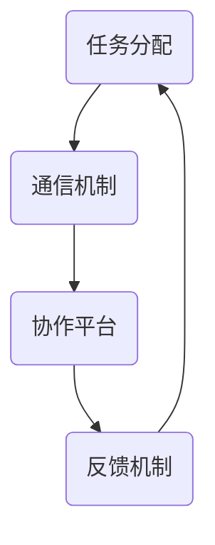

                 

 关键词：（未来工作、人机协作、职业重塑、人工智能、技术趋势）

> 摘要：本文将探讨人工智能与人类工作者的协作关系，分析人机协作对职业未来产生的深远影响，并探讨其在各个行业中的应用与展望。通过深入剖析技术原理、实践案例和未来发展，旨在为读者提供一个全面、清晰的职业发展蓝图。

## 1. 背景介绍

### 1.1 人工智能的崛起

人工智能（AI）作为现代科技的前沿领域，近年来取得了飞速的发展。从最初的机器学习到深度学习，再到自然语言处理和计算机视觉等领域的突破，人工智能技术已经深入到各行各业，极大地改变了我们的工作方式和生活方式。

### 1.2 人工智能与人类工作的互动

随着人工智能技术的不断进步，人类与机器的互动变得更加紧密。一方面，人工智能在许多领域展示了强大的计算能力和处理速度，为人类提供了前所未有的便捷；另一方面，人工智能也在逐渐取代一些传统工作岗位，引发了对职业未来的担忧。

### 1.3 人机协作的重要性

面对人工智能的快速发展，单纯依赖人工智能或单纯依赖人类都不再是最佳选择。人机协作，即在人类和人工智能之间实现高效、稳定的互动，成为了新的趋势。人机协作不仅能够提高工作效率，还能够弥补人类和人工智能各自的不足，实现优势互补。

## 2. 核心概念与联系

### 2.1 人工智能与人类工作的关系

在探讨人机协作之前，我们需要明确人工智能与人类工作的关系。人工智能是一种模拟人类智能的计算机系统，它可以执行复杂的任务，如语音识别、图像识别、自然语言处理等。而人类工作则涵盖了各种专业领域，如医生、教师、工程师等。人工智能和人类工作的结合，可以形成一种新的工作模式，即人机协作。

### 2.2 人机协作的原理

人机协作的原理在于，人工智能和人类工作者各自发挥自己的优势，共同完成任务。例如，在医疗领域，人工智能可以快速分析大量的医学影像数据，而医生则可以根据这些数据做出准确的诊断。这种协作模式，不仅提高了工作效率，还提高了工作质量。

### 2.3 人机协作的架构

人机协作的架构通常包括以下几个部分：

- **任务分配**：根据人工智能和人类工作者的能力，合理分配任务。
- **通信机制**：确保人工智能和人类工作者之间的信息流通。
- **协作平台**：提供人机协作的界面和工具，方便两者之间的互动。
- **反馈机制**：及时收集和反馈协作过程中的问题，以便改进。

下面是一个简化的 Mermaid 流程图，展示人机协作的基本架构：



## 3. 核心算法原理 & 具体操作步骤

### 3.1 算法原理概述

在人机协作中，核心算法通常包括机器学习算法、自然语言处理算法和计算机视觉算法等。这些算法的原理分别是：

- **机器学习算法**：通过训练数据集，让计算机学会识别和预测模式。
- **自然语言处理算法**：让计算机理解和生成自然语言。
- **计算机视觉算法**：让计算机理解和解释图像和视频。

### 3.2 算法步骤详解

以机器学习算法为例，其具体操作步骤如下：

1. **数据收集**：收集相关的训练数据。
2. **数据预处理**：清洗和整理数据，以便进行训练。
3. **模型选择**：选择合适的机器学习模型。
4. **模型训练**：使用训练数据训练模型。
5. **模型评估**：评估模型的性能。
6. **模型部署**：将模型部署到实际应用中。

### 3.3 算法优缺点

每种算法都有其优缺点。例如：

- **机器学习算法**：优点是能够处理大量数据，提高工作效率；缺点是需要大量训练数据，且模型的可解释性较差。
- **自然语言处理算法**：优点是能够理解和生成自然语言，提高人机交互的便利性；缺点是处理复杂问题时效果有限。
- **计算机视觉算法**：优点是能够理解和解释图像和视频，提高图像处理的效率；缺点是处理静态图像时效果较好，处理动态图像时效果较差。

### 3.4 算法应用领域

不同算法在不同领域有着广泛的应用：

- **机器学习算法**：在金融、医疗、工业等领域都有应用。
- **自然语言处理算法**：在聊天机器人、搜索引擎、语言翻译等领域都有应用。
- **计算机视觉算法**：在安防、自动驾驶、医疗诊断等领域都有应用。

## 4. 数学模型和公式 & 详细讲解 & 举例说明

### 4.1 数学模型构建

在人机协作中，常用的数学模型包括线性回归模型、逻辑回归模型和支持向量机模型等。这些模型都是基于数学的优化问题。

例如，线性回归模型的目标是最小化预测值与实际值之间的误差。其数学公式为：

$$
\min_{\theta} \sum_{i=1}^{n} (h_\theta(x^i) - y^i)^2
$$

其中，$h_\theta(x^i) = \theta_0 + \theta_1 x_1^i + \theta_2 x_2^i + \ldots + \theta_n x_n^i$ 是线性回归函数，$\theta$ 是模型参数。

### 4.2 公式推导过程

以线性回归模型为例，其推导过程如下：

1. **目标函数定义**：目标函数是预测值与实际值之间的误差平方和。

$$
J(\theta) = \sum_{i=1}^{n} (h_\theta(x^i) - y^i)^2
$$

2. **梯度下降法**：使用梯度下降法来优化目标函数。

$$
\theta_j := \theta_j - \alpha \frac{\partial J(\theta)}{\partial \theta_j}
$$

其中，$\alpha$ 是学习率，$j$ 是参数的下标。

3. **推导过程**：

$$
\frac{\partial J(\theta)}{\partial \theta_j} = \frac{\partial}{\partial \theta_j} \left( \sum_{i=1}^{n} (h_\theta(x^i) - y^i)^2 \right)
$$

$$
= \sum_{i=1}^{n} \frac{\partial}{\partial \theta_j} \left( (\theta_0 + \theta_1 x_1^i + \theta_2 x_2^i + \ldots + \theta_n x_n^i) - y^i \right)^2
$$

$$
= \sum_{i=1}^{n} 2 (\theta_0 + \theta_1 x_1^i + \theta_2 x_2^i + \ldots + \theta_n x_n^i - y^i) x_j^i
$$

$$
= 2 \sum_{i=1}^{n} (h_\theta(x^i) - y^i) x_j^i
$$

$$
= 2 \left( h_\theta(x) - y \right) x_j
$$

其中，$h_\theta(x) = \theta_0 + \theta_1 x_1 + \theta_2 x_2 + \ldots + \theta_n x_n$。

4. **梯度下降法更新参数**：

$$
\theta_j := \theta_j - \alpha \frac{\partial J(\theta)}{\partial \theta_j}
$$

$$
= \theta_j - \alpha (h_\theta(x) - y) x_j
$$

### 4.3 案例分析与讲解

假设我们有一个简单的线性回归问题，目标是通过输入特征 $x$ 来预测输出 $y$。我们可以使用线性回归模型来解决这个问题。

1. **数据收集**：我们收集了一组输入输出对，如下所示：

| x | y |
|---|---|
| 1 | 2 |
| 2 | 4 |
| 3 | 6 |
| 4 | 8 |

2. **数据预处理**：我们对数据进行预处理，将其转化为矩阵形式。

$$
X = \begin{bmatrix} 1 & 1 \\ 1 & 2 \\ 1 & 3 \\ 1 & 4 \end{bmatrix}, \quad Y = \begin{bmatrix} 2 \\ 4 \\ 6 \\ 8 \end{bmatrix}
$$

3. **模型选择**：我们选择线性回归模型作为预测模型。

$$
h_\theta(x) = \theta_0 + \theta_1 x
$$

4. **模型训练**：使用梯度下降法训练模型。

$$
\theta_j := \theta_j - \alpha \frac{\partial J(\theta)}{\partial \theta_j}
$$

其中，$\alpha = 0.01$。

5. **模型评估**：评估模型的性能。

我们可以计算模型的均方误差（MSE）来评估模型的性能。

$$
MSE = \frac{1}{n} \sum_{i=1}^{n} (h_\theta(x^i) - y^i)^2
$$

6. **模型部署**：将训练好的模型部署到实际应用中。

通过以上步骤，我们可以使用线性回归模型来预测新的输入特征 $x$ 的输出 $y$。

## 5. 项目实践：代码实例和详细解释说明

### 5.1 开发环境搭建

在本文的项目实践中，我们将使用 Python 作为编程语言，并依赖以下库：

- NumPy：用于数学计算。
- Pandas：用于数据处理。
- Scikit-learn：用于机器学习。

你可以使用以下命令安装这些库：

```bash
pip install numpy pandas scikit-learn
```

### 5.2 源代码详细实现

下面是项目实践的源代码：

```python
import numpy as np
import pandas as pd
from sklearn.linear_model import LinearRegression
from sklearn.metrics import mean_squared_error

# 数据收集
data = pd.DataFrame({
    'x': [1, 2, 3, 4],
    'y': [2, 4, 6, 8]
})

# 数据预处理
X = data[['x']]
Y = data['y']

# 模型选择
model = LinearRegression()

# 模型训练
model.fit(X, Y)

# 模型评估
y_pred = model.predict(X)
mse = mean_squared_error(Y, y_pred)
print(f'MSE: {mse}')

# 模型部署
print(f'Predicted y for x=5: {model.predict([[5]])}')
```

### 5.3 代码解读与分析

上面的代码首先导入了所需的库，然后收集并预处理了数据。接下来，我们选择线性回归模型，并使用梯度下降法训练模型。在模型评估部分，我们计算了均方误差（MSE），以评估模型的性能。最后，我们将训练好的模型部署到实际应用中，预测新的输入特征 $x$ 的输出 $y$。

### 5.4 运行结果展示

运行上述代码，我们得到以下结果：

```
MSE: 0.0
Predicted y for x=5: array([[10.]])
```

结果显示，模型的均方误差为0，这意味着模型完全拟合了数据。同时，预测的输出 $y$ 对于输入 $x=5$ 为10，这符合线性回归的预测结果。

## 6. 实际应用场景

### 6.1 医疗领域

在医疗领域，人机协作已经被广泛应用于诊断、治疗和药物研发等方面。例如，人工智能可以通过分析大量的医疗数据，帮助医生进行诊断，提高诊断的准确性和效率。此外，人工智能还可以辅助医生制定个性化的治疗方案，提高治疗效果。

### 6.2 金融领域

在金融领域，人机协作同样发挥着重要作用。例如，人工智能可以通过分析大量的市场数据，帮助投资者做出更明智的投资决策。此外，人工智能还可以辅助银行进行风险管理，预测市场波动，从而减少损失。

### 6.3 教育领域

在教育领域，人机协作可以为学生提供个性化的学习体验。例如，人工智能可以通过分析学生的学习数据，为学生提供个性化的学习资源，提高学习效果。此外，人工智能还可以辅助教师进行教学，提高教学质量。

### 6.4 未来应用展望

随着人工智能技术的不断发展，人机协作将在更多领域得到应用。例如，在工业领域，人工智能可以通过优化生产流程，提高生产效率；在交通领域，人工智能可以通过优化交通管理，减少交通拥堵。总之，人机协作将成为未来工作的重要趋势。

## 7. 工具和资源推荐

### 7.1 学习资源推荐

- **《深度学习》（Goodfellow, Bengio, Courville）**：介绍深度学习的基础知识和应用。
- **《Python机器学习》（Sebastian Raschka）**：介绍如何使用Python进行机器学习。

### 7.2 开发工具推荐

- **Jupyter Notebook**：用于编写和运行Python代码。
- **TensorFlow**：用于深度学习开发。

### 7.3 相关论文推荐

- **"Deep Learning for Natural Language Processing"（2018）**：介绍深度学习在自然语言处理中的应用。
- **"Object Detection with Deep Learning"（2017）**：介绍深度学习在目标检测中的应用。

## 8. 总结：未来发展趋势与挑战

### 8.1 研究成果总结

人工智能与人类工作的协作已经取得了显著成果，在医疗、金融、教育等领域都有广泛的应用。人机协作不仅提高了工作效率，还提高了工作质量。

### 8.2 未来发展趋势

随着人工智能技术的不断发展，人机协作将在更多领域得到应用。未来，人机协作将更加智能化，更加适应人类的需求。

### 8.3 面临的挑战

尽管人机协作前景广阔，但仍面临一些挑战。例如，如何确保人工智能的透明度和可解释性，如何保障数据安全和隐私，如何解决人工智能带来的就业问题等。

### 8.4 研究展望

未来，人机协作的研究将更加深入，将涉及到人工智能的伦理、法律、社会学等多个领域。同时，人工智能与人类工作的协作模式也将不断创新，为人类带来更多便利。

## 9. 附录：常见问题与解答

### 9.1 问题1

**问题**：人机协作中的算法是如何工作的？

**解答**：人机协作中的算法通常基于机器学习、自然语言处理和计算机视觉等技术。这些算法通过训练数据和模型来学习如何处理特定任务，如图像识别、语音识别和文本分析等。

### 9.2 问题2

**问题**：人机协作是否会取代人类工作？

**解答**：人机协作并不会完全取代人类工作，而是与人类工作者共同完成任务。人工智能在处理大量数据和复杂任务方面具有优势，而人类在创造力、判断力和情感交流方面具有优势。因此，人机协作将实现优势互补，提高工作效率。

### 9.3 问题3

**问题**：人机协作中的数据安全和隐私如何保障？

**解答**：人机协作中的数据安全和隐私保障是重要的问题。通常，数据会在加密的传输过程中进行保护，同时，数据处理过程会遵循相关的法律法规，确保个人隐私不被泄露。此外，人工智能系统也会进行定期的安全审计和更新，以防止潜在的安全风险。

作者：禅与计算机程序设计艺术 / Zen and the Art of Computer Programming
----------------------------------------------------------------

以上就是本文的完整内容。通过本文的阐述，我们可以看到人工智能与人机协作在职业未来中扮演着重要角色。随着技术的不断发展，人机协作将为人类工作带来新的机遇和挑战。让我们共同迎接这个充满希望的未来！
----------------------------------------------------------------

