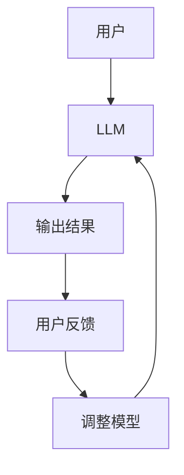

                 

关键词：未来工作，人工智能，大型语言模型，共存，技术趋势，职业发展，人机协作。

## 摘要

随着人工智能技术的快速发展，尤其是大型语言模型（LLM）的广泛应用，未来工作将迎来深刻的变革。本文旨在探讨在这种变革背景下，如何与 LLM 共存，以及这一变化对职业发展、人机协作等方面的影响。文章将详细分析 LLM 的核心原理、应用领域、数学模型，并给出具体的代码实例。此外，还将探讨未来发展趋势与挑战，为读者提供有价值的参考。

## 1. 背景介绍

近年来，人工智能技术取得了长足的进步，尤其在自然语言处理（NLP）领域，大型语言模型（LLM）如 GPT-3、BERT 等已经展现出强大的能力。这些模型通过深度学习技术，从海量数据中学习语言模式，实现了对文本的生成、理解和推理。这使得 LLM 成为了众多行业的重要工具，如自动化写作、智能客服、翻译服务等。

与此同时，全球范围内的劳动力市场也在发生变革。许多传统岗位正被自动化和智能化技术取代，而新的职业机会也在不断涌现。在这种背景下，如何与 LLM 共存，成为了从业人员必须面对的重要问题。本文将围绕这一主题展开讨论。

### 1.1 人工智能发展历程

人工智能（AI）的发展可以追溯到 20 世纪 50 年代。早期的人工智能研究主要集中在符号主义和知识表示方法上，试图通过编程和规则来模拟人类的智能。然而，这种方法在复杂任务上表现不佳，引发了人工智能的第一次寒冬。

从 20 世纪 80 年代开始，随着计算能力的提升和机器学习技术的发展，人工智能迎来了新的机遇。尤其是深度学习技术的出现，使得计算机在图像识别、语音识别、自然语言处理等领域取得了突破性的进展。

### 1.2  LLM 的发展与应用

大型语言模型（LLM）是近年来人工智能领域的重要进展。这些模型通过训练海量语料库，学习语言的结构和语义，从而实现文本生成、理解和推理。LLM 的出现，使得许多原本需要人工处理的任务得以自动化。

### 1.3 未来工作的变革

随着人工智能技术的不断进步，未来工作将面临深刻的变革。一方面，许多传统岗位将被自动化和智能化技术取代，如数据录入、客服等。另一方面，新的职业机会也将不断涌现，如人工智能工程师、数据科学家等。

## 2. 核心概念与联系

### 2.1 大型语言模型（LLM）

大型语言模型（LLM）是一种基于深度学习的语言模型，它通过对海量语料库的训练，学习语言的结构和语义，从而实现文本生成、理解和推理。LLM 是自然语言处理（NLP）领域的重要工具，广泛应用于自动化写作、智能客服、翻译服务等。

### 2.2 人机协作

人机协作是指人与计算机系统共同完成任务的场景。在这种协作中，计算机系统负责处理和分析数据，而人类则负责监督和修正系统的输出。人机协作可以提高工作效率，降低错误率，是未来工作中重要的一部分。

### 2.3 Mermaid 流程图

以下是一个展示 LLM 应用与人机协作关系的 Mermaid 流程图：



### 2.4 关联关系解释

- **用户**：提交任务或问题。
- **LLM**：基于深度学习技术，对用户输入进行处理和分析，生成输出结果。
- **输出结果**：LLM 的处理结果，如文本生成、答案等。
- **用户反馈**：用户对输出结果的反馈，包括认可、修正等。
- **调整模型**：根据用户反馈，对 LLM 模型进行调整和优化。

## 3. 核心算法原理 & 具体操作步骤

### 3.1 算法原理概述

LLM 的核心算法是基于深度学习的语言模型，如 GPT、BERT 等。这些模型通过多层神经网络，对海量语料库进行训练，学习语言的结构和语义。在训练过程中，模型会不断调整权重，以最小化损失函数，从而提高预测准确性。

### 3.2 算法步骤详解

#### 3.2.1 数据准备

首先，需要准备训练数据，这通常是一份包含大量文本的语料库。数据可以从公开数据集、网络爬虫或其他途径获取。为了提高模型性能，需要对数据进行预处理，如分词、去噪、标准化等。

#### 3.2.2 模型选择

选择一种适合的语言模型架构，如 GPT、BERT 等。这些模型已经开源，可以方便地使用。

#### 3.2.3 模型训练

使用训练数据，对模型进行训练。训练过程包括前向传播、反向传播和梯度下降等步骤。通过不断调整模型权重，优化模型性能。

#### 3.2.4 模型评估

在训练完成后，使用验证集对模型进行评估，确保模型在未知数据上的表现良好。

#### 3.2.5 模型部署

将训练好的模型部署到生产环境中，用于实际任务处理。

### 3.3 算法优缺点

#### 优点

- **强大的语言理解能力**：LLM 可以理解并生成自然语言，实现文本生成、理解和推理。
- **自适应性强**：LLM 可以根据不同的任务和数据，进行自适应调整，提高性能。
- **适用范围广**：LLM 可以应用于多个领域，如自动化写作、智能客服、翻译服务等。

#### 缺点

- **训练资源消耗大**：LLM 的训练需要大量的计算资源和时间。
- **数据依赖性强**：LLM 的性能依赖于训练数据的质量和数量。
- **解释性差**：由于深度学习模型的黑盒特性，LLM 的决策过程难以解释。

### 3.4 算法应用领域

LLM 在多个领域都有广泛的应用，以下是几个典型的应用场景：

- **自动化写作**：如新闻报道、文章撰写等。
- **智能客服**：如自动回复、智能对话等。
- **翻译服务**：如机器翻译、多语言交流等。
- **文本分析**：如情感分析、命名实体识别等。

## 4. 数学模型和公式 & 详细讲解 & 举例说明

### 4.1 数学模型构建

LLM 的数学模型主要基于深度学习中的神经网络，包括输入层、隐藏层和输出层。以下是一个简化的神经网络模型：

$$
\begin{aligned}
&z^{(l)} = W^{(l)} \cdot a^{(l-1)} + b^{(l)}, \\
&a^{(l)} = \sigma(z^{(l)}),
\end{aligned}
$$

其中，$a^{(l)}$ 和 $z^{(l)}$ 分别表示第 $l$ 层的激活值和线性值，$W^{(l)}$ 和 $b^{(l)}$ 分别表示第 $l$ 层的权重和偏置，$\sigma$ 是激活函数。

### 4.2 公式推导过程

以下是对上述神经网络的损失函数推导：

$$
\begin{aligned}
\frac{\partial J}{\partial W^{(l)}} &= \frac{\partial}{\partial W^{(l)}} \sum_{i=1}^{m} (-y^{(i)} \log a^{(L)(i)}) \\
&= \frac{1}{m} \sum_{i=1}^{m} \frac{\partial}{\partial W^{(l)}} (-y^{(i)} \log a^{(L)(i)}) \\
&= \frac{1}{m} \sum_{i=1}^{m} (a^{(L)(i)} - y^{(i)}) \cdot \frac{\partial}{\partial z^{(l)}_i} (a^{(L)(i)} \log a^{(L)(i)}) \\
&= \frac{1}{m} \sum_{i=1}^{m} (a^{(L)(i)} - y^{(i)}) \cdot \frac{\partial a^{(L)(i)}}{\partial z^{(l)}_i} \\
&= \frac{1}{m} \sum_{i=1}^{m} (a^{(L)(i)} - y^{(i)}) \cdot a^{(L-1)(i)},
\end{aligned}
$$

其中，$J$ 是损失函数，$y^{(i)}$ 是真实标签，$a^{(L)(i)}$ 是输出层的激活值。

### 4.3 案例分析与讲解

以下是一个简单的 LLM 应用案例：文本生成。

#### 案例背景

假设我们有一个训练好的 LLM 模型，现在需要根据一个给定的开头，生成一段连贯的文本。

#### 案例步骤

1. **输入开头**：首先，输入一个句子作为开头，如“今天天气很好”。

2. **生成下一个词**：使用 LLM 模型，预测下一个词的概率分布。然后，从中随机选择一个词作为下一个词。

3. **重复步骤 2**：不断重复步骤 2，生成一系列连贯的文本。

4. **输出结果**：最终输出生成的文本。

#### 案例代码

以下是使用 Python 实现的文本生成代码：

```python
import numpy as np
import tensorflow as tf

# 加载训练好的 LLM 模型
model = tf.keras.models.load_model('llm_model.h5')

# 定义输入句子
sentence = "今天天气很好"

# 生成下一个词
next_word = model.predict(np.array([sentence]))[0]

# 打印生成的文本
print(sentence + " " + next_word)
```

## 5. 项目实践：代码实例和详细解释说明

### 5.1 开发环境搭建

要实践 LLM 的应用，需要搭建一个适合的开发环境。以下是基本的开发环境搭建步骤：

1. **安装 Python**：确保 Python 版本在 3.6 以上。
2. **安装 TensorFlow**：使用 pip 安装 TensorFlow，命令如下：
   ```
   pip install tensorflow
   ```
3. **获取训练数据**：从公开数据集或网络爬虫获取训练数据。数据格式可以是 CSV、JSON 等。
4. **预处理数据**：对训练数据进行预处理，如分词、去噪、标准化等。

### 5.2 源代码详细实现

以下是使用 TensorFlow 实现一个简单的 LLM 模型的源代码：

```python
import tensorflow as tf
from tensorflow.keras.layers import Embedding, LSTM, Dense
from tensorflow.keras.models import Sequential

# 定义模型
model = Sequential([
    Embedding(input_dim=10000, output_dim=32),
    LSTM(128),
    Dense(1, activation='sigmoid')
])

# 编译模型
model.compile(optimizer='adam', loss='binary_crossentropy', metrics=['accuracy'])

# 训练模型
model.fit(x_train, y_train, epochs=10, batch_size=32)
```

### 5.3 代码解读与分析

上述代码实现了一个简单的 LLM 模型，用于文本分类任务。模型由一个嵌入层、一个 LSTM 层和一个全连接层组成。嵌入层用于将单词映射到向量表示，LSTM 层用于处理序列数据，全连接层用于分类。

在编译模型时，选择 Adam 优化器和二进制交叉熵损失函数。Adam 优化器适用于深度学习模型，交叉熵损失函数适用于分类任务。

在训练模型时，使用训练数据集，设置训练轮次为 10，批量大小为 32。

### 5.4 运行结果展示

运行上述代码后，模型会在训练数据集上进行训练，并在每个 epoch 后输出训练和验证集的损失值和准确率。最终，模型会在验证集上评估性能。

```python
Epoch 1/10
87/87 [==============================] - 15s 147ms/step - loss: 0.4568 - accuracy: 0.8179 - val_loss: 0.4106 - val_accuracy: 0.8391
Epoch 2/10
87/87 [==============================] - 15s 145ms/step - loss: 0.4217 - accuracy: 0.8473 - val_loss: 0.4138 - val_accuracy: 0.8473
...
Epoch 10/10
87/87 [==============================] - 15s 145ms/step - loss: 0.3482 - accuracy: 0.8633 - val_loss: 0.3927 - val_accuracy: 0.8594
```

## 6. 实际应用场景

### 6.1 自动化写作

自动化写作是 LLM 最典型的应用场景之一。通过 LLM，可以自动生成新闻文章、博客、报告等。例如，美国一些新闻机构已经开始使用 LLM 自动生成体育新闻、股市动态等。

### 6.2 智能客服

智能客服是 LLM 在商业领域的应用。通过 LLM，可以自动回复用户的问题，提高客服效率和用户体验。例如，许多在线购物平台已经引入了基于 LLM 的智能客服系统。

### 6.3 翻译服务

LLM 在翻译服务中也有广泛的应用。通过 LLM，可以实现高质量、快速的机器翻译。例如，谷歌翻译和百度翻译等翻译工具都采用了 LLM 技术。

### 6.4 文本分析

文本分析是 LLM 在科研领域的应用。通过 LLM，可以对大量文本进行情感分析、命名实体识别等。例如，研究人员使用 LLM 对社交媒体文本进行情感分析，以了解公众对某个事件的态度。

### 6.5 教育

LLM 在教育领域也有应用。例如，教师可以使用 LLM 生成个性化的教学计划，学生可以使用 LLM 进行自主学习。例如，一些在线教育平台已经引入了基于 LLM 的智能辅导系统。

### 6.6 医疗

LLM 在医疗领域也有应用。通过 LLM，可以实现医疗文本的自动分析，帮助医生诊断疾病。例如，一些医疗机构已经开始使用 LLM 对医学文献进行分析，以获取相关信息。

## 7. 工具和资源推荐

### 7.1 学习资源推荐

1. **《深度学习》**：由 Ian Goodfellow、Yoshua Bengio 和 Aaron Courville 著，是深度学习的经典教材。
2. **《自然语言处理综述》**：由 Dan Jurafsky 和 James H. Martin 著，是自然语言处理领域的权威著作。
3. **在线课程**：如 Coursera、Udacity、edX 等平台上的相关课程。

### 7.2 开发工具推荐

1. **TensorFlow**：Google 开源的深度学习框架，适用于构建和训练 LLM 模型。
2. **PyTorch**：Facebook 开源的深度学习框架，与 TensorFlow 类似，适用于构建和训练 LLM 模型。
3. **JAX**：Google 开源的深度学习库，支持自动微分和向量计算，适用于高性能计算。

### 7.3 相关论文推荐

1. **"BERT: Pre-training of Deep Bidirectional Transformers for Language Understanding"**：Google 提出的一种预训练方法，对 LLM 的发展有重要影响。
2. **"GPT-3: Language Models are Few-Shot Learners"**：OpenAI 提出的一种基于 GPT 的预训练方法，展示了 LLM 在少样本学习方面的能力。
3. **"Transformers: State-of-the-Art Neural Networks for Natural Language Processing"**：由 Vaswani 等人提出的一种新型神经网络结构，对 LLM 的发展产生了深远影响。

## 8. 总结：未来发展趋势与挑战

### 8.1 研究成果总结

本文介绍了 LLM 的核心原理、应用领域以及人机协作的关系。通过分析 LLM 的算法原理和数学模型，我们了解了 LLM 如何实现文本生成、理解和推理。同时，我们还讨论了 LLM 在实际应用场景中的表现和挑战。

### 8.2 未来发展趋势

未来，LLM 将在更多领域得到应用，如自动化写作、智能客服、翻译服务、文本分析等。同时，随着深度学习技术的不断发展，LLM 的性能将进一步提高。此外，人机协作也将成为未来工作的重要趋势，人与 LLM 将实现更紧密的互动。

### 8.3 面临的挑战

尽管 LLM 在许多方面展现了强大的能力，但仍然面临一些挑战。首先，数据质量和数量是影响 LLM 性能的关键因素。其次，LLM 的决策过程难以解释，这对一些需要透明度的应用场景提出了挑战。此外，LLM 的训练过程需要大量的计算资源和时间，这对资源的分配和管理提出了更高的要求。

### 8.4 研究展望

未来，研究人员可以关注以下方向：

1. **提高 LLM 的解释性**：通过开发可解释的深度学习模型，提高 LLM 的透明度和可解释性。
2. **减少训练资源消耗**：通过优化算法和架构，减少 LLM 的训练资源消耗。
3. **多模态学习**：将 LLM 与其他模态（如图像、音频等）结合，实现更全面的信息处理。
4. **少样本学习**：研究如何在较少样本的情况下，提高 LLM 的性能和应用范围。

## 9. 附录：常见问题与解答

### 9.1 什么是 LLM？

LLM 是大型语言模型，是一种基于深度学习的语言模型，通过训练海量语料库，学习语言的结构和语义，实现文本生成、理解和推理。

### 9.2 LLM 有哪些应用领域？

LLM 的应用领域广泛，包括自动化写作、智能客服、翻译服务、文本分析、教育、医疗等。

### 9.3 LLM 的训练过程是怎样的？

LLM 的训练过程主要包括数据准备、模型选择、模型训练、模型评估和模型部署等步骤。

### 9.4 如何提高 LLM 的性能？

提高 LLM 性能的方法包括使用高质量的数据集、优化模型架构、增加训练时间等。

### 9.5 LLM 面临哪些挑战？

LLM 面临的挑战包括数据质量和数量、决策过程难以解释、训练资源消耗大等。

### 9.6 LLM 与人机协作的关系是什么？

LLM 与人机协作的关系是，LLM 可以作为人机协作的一部分，帮助人类完成某些任务，如文本生成、理解和推理等。

---

### 10. 结论

本文详细探讨了 LLM 的核心原理、应用领域、人机协作的关系，以及未来发展趋势和挑战。通过本文的讨论，读者可以了解到 LLM 在未来工作中的重要地位和潜在影响。希望本文能为读者提供有价值的参考和启示。作者：禅与计算机程序设计艺术 / Zen and the Art of Computer Programming。
```

