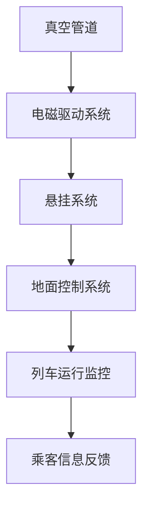
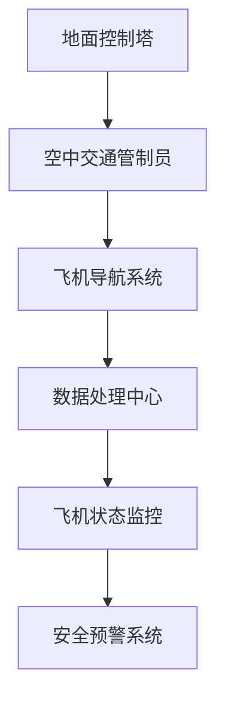
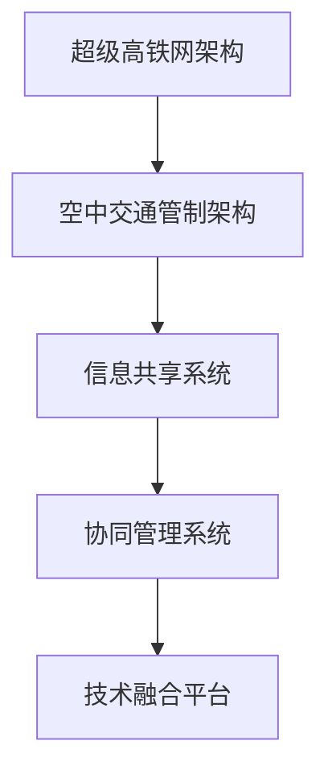

                 

关键词：智能交通、超级高铁网、空中交通管制、未来发展趋势、技术挑战、算法、数学模型、代码实例

> 摘要：本文深入探讨了2050年智能交通的未来，重点关注超级高铁网和空中交通管制的创新技术。通过对核心概念、算法原理、数学模型的详细介绍，以及实际项目实践的代码解析，本文旨在为读者展示智能交通领域的最新进展和未来前景。

## 1. 背景介绍

随着全球城市化进程的加速，传统交通系统已经难以满足日益增长的交通需求。交通拥堵、环境污染、能源消耗等问题日益严重，迫使我们必须寻找新的解决方案。智能交通系统（Intelligent Transportation Systems，ITS）作为一种创新性的交通管理方式，旨在通过信息技术、数据通信传输技术、电子传感技术、控制技术及计算机技术等先进技术，提高交通系统效率、安全性和可持续发展水平。

### 1.1 智能交通的定义与作用

智能交通系统是通过信息通信技术对交通系统进行全方位的监测、管理和服务，从而实现交通流量的优化、交通事件的快速响应、交通信息的实时发布等功能。其核心作用包括：

- 提高交通效率：通过实时交通信息反馈和优化交通信号控制，减少交通拥堵。
- 增强交通安全：实时监测车辆状态，提前预警潜在风险，降低交通事故率。
- 保护环境：通过优化交通流量，减少交通排放，降低环境污染。
- 提升乘客体验：提供实时出行信息服务，优化乘客的出行规划。

### 1.2 超级高铁网与空中交通管制的发展历程

超级高铁（Hyperloop）作为一种高速、高效、环保的运输方式，近年来受到了广泛关注。其基本原理是通过真空管道将列车悬浮在地面，利用空气动力学原理实现高速运行。超级高铁的发展历程可以分为以下几个阶段：

- **概念提出**（2009年）：美国企业家Elon Musk首次提出了超级高铁的概念。
- **原型验证**（2012年）：Musk成立了Hyperloop交通公司，并开始研发超级高铁原型。
- **技术突破**（2013年）：Hyperloop交通公司举办了第一届超级高铁全球设计竞赛，吸引了众多参与者的关注。
- **商业化推进**（2019年至今）：多个国家开始规划并建设超级高铁线路，如美国的Hyperloop One和欧洲的Trans European High Speed Rail。

与超级高铁网相辅相成的空中交通管制（Air Traffic Control，ATC）也在不断发展。空中交通管制的主要任务是确保飞机在飞行过程中的安全，通过地面控制塔和空中交通管制员对飞行进行指挥和监控。空中交通管制的发展历程可以概括为：

- **早期阶段**（1910-1930年）：飞行员通过无线电通信自行协调飞行。
- **发展阶段**（1930-1960年）：地面控制塔开始出现，实现集中指挥。
- **现代化阶段**（1960年至今）：计算机技术和通信技术被引入，实现了空管系统的自动化和高效化。

## 2. 核心概念与联系

在智能交通系统中，核心概念和联系是理解和应用各种技术的关键。以下是对这些概念和它们之间的联系进行详细说明，并使用Mermaid流程图展示其架构。

### 2.1 超级高铁网的架构

超级高铁网的架构主要包括以下几个部分：

1. **真空管道**：用于减少空气阻力，提高列车速度。
2. **电磁驱动系统**：通过电磁力推动列车前进。
3. **悬挂系统**：确保列车在高速运行时稳定悬浮。
4. **地面控制系统**：用于实时监控和管理列车运行。

下面是一个简单的Mermaid流程图，展示了超级高铁网的架构：



### 2.2 空中交通管制的架构

空中交通管制的架构主要包括：

1. **地面控制塔**：负责指挥和管理飞机的飞行。
2. **空中交通管制员**：通过雷达和通信设备监控飞机位置和状态。
3. **飞机导航系统**：用于飞机的自主导航。
4. **数据处理中心**：对飞机飞行数据进行分析和处理。

以下是一个简单的Mermaid流程图，展示了空中交通管制的架构：



### 2.3 超级高铁网与空中交通管制之间的联系

超级高铁网和空中交通管制之间的联系主要体现在以下几个方面：

- **共享信息**：超级高铁网和空中交通管制系统需要共享实时交通信息，以确保运行效率和安全性。
- **协同管理**：超级高铁网和空中交通管制系统需要协同工作，实现对交通流量的优化和控制。
- **技术融合**：超级高铁网和空中交通管制系统可以采用相似的技术，如电磁驱动、自动化控制系统等。

下面是一个简单的Mermaid流程图，展示了超级高铁网与空中交通管制之间的联系：



## 3. 核心算法原理 & 具体操作步骤

智能交通系统中的核心算法原理是实现高效交通流量管理和安全预警的关键。以下是对核心算法原理和具体操作步骤的详细介绍。

### 3.1 算法原理概述

智能交通系统的核心算法主要包括以下几类：

- **交通流量预测算法**：通过对历史交通数据进行分析，预测未来交通流量，为交通信号控制和交通规划提供依据。
- **路径规划算法**：为车辆提供最优行驶路径，减少交通拥堵。
- **安全预警算法**：通过实时监测车辆状态和环境信息，预警潜在的交通事故。

### 3.2 算法步骤详解

以下是交通流量预测算法的基本步骤：

1. **数据收集**：收集历史交通数据，包括车辆数量、速度、时间等。
2. **数据处理**：对历史交通数据进行清洗、归一化和特征提取。
3. **模型训练**：使用机器学习算法，如神经网络或决策树，训练交通流量预测模型。
4. **模型评估**：评估模型的预测准确性和稳定性。
5. **预测应用**：将训练好的模型应用于实时交通流量预测。

以下是路径规划算法的基本步骤：

1. **起点和终点输入**：用户输入起点和终点。
2. **道路数据查询**：查询道路网络数据，包括道路长度、路况等信息。
3. **路径生成**：使用A*算法或其他路径规划算法，生成最优路径。
4. **路径优化**：根据实时交通信息，对路径进行动态优化。
5. **路径输出**：将最优路径输出给用户。

以下是安全预警算法的基本步骤：

1. **数据收集**：收集车辆状态数据，包括速度、加速度、方向盘角度等。
2. **数据处理**：对车辆状态数据进行预处理，包括去噪、归一化等。
3. **模型训练**：使用深度学习算法，如卷积神经网络，训练安全预警模型。
4. **模型评估**：评估模型的预警准确率和响应速度。
5. **预警应用**：将训练好的模型应用于实时安全预警。

### 3.3 算法优缺点

- **交通流量预测算法**：

  - **优点**：能够提前预测交通流量，为交通信号控制和交通规划提供科学依据。

  - **缺点**：受限于历史数据质量和模型复杂度，预测准确性可能有限。

- **路径规划算法**：

  - **优点**：能够为用户提供最优路径，减少交通拥堵。

  - **缺点**：在实时交通信息处理方面存在一定延迟。

- **安全预警算法**：

  - **优点**：能够实时监测车辆状态，提前预警潜在交通事故。

  - **缺点**：受限于传感器精度和数据处理能力，预警准确性可能有限。

### 3.4 算法应用领域

- **交通信号控制**：通过交通流量预测算法，为交通信号控制提供实时数据，实现智能化的交通信号控制。

- **路径规划**：为车辆提供最优行驶路径，减少交通拥堵，提高出行效率。

- **交通事故预警**：通过安全预警算法，实时监测车辆状态，提前预警潜在交通事故，提高道路安全性。

## 4. 数学模型和公式 & 详细讲解 & 举例说明

智能交通系统中的数学模型和公式是实现交通流量预测、路径规划和安全预警算法的关键。以下是对这些数学模型和公式的详细讲解，并附上实际案例进行分析。

### 4.1 数学模型构建

智能交通系统的数学模型主要包括以下几类：

- **交通流量预测模型**：使用时间序列分析、回归分析和机器学习等方法，构建交通流量预测模型。

- **路径规划模型**：使用图论和优化算法，构建路径规划模型。

- **安全预警模型**：使用深度学习和数据挖掘方法，构建安全预警模型。

### 4.2 公式推导过程

以下是交通流量预测模型中的常见公式：

- **时间序列预测模型**：

  $$ y_t = \alpha_0 + \alpha_1 y_{t-1} + \alpha_2 y_{t-2} + ... + \alpha_n y_{t-n} + \epsilon_t $$

  其中，$y_t$ 为第 $t$ 时刻的交通流量，$ \alpha_0, \alpha_1, ..., \alpha_n $ 为模型参数，$ \epsilon_t $ 为误差项。

- **回归预测模型**：

  $$ y_t = \beta_0 + \beta_1 x_t + \epsilon_t $$

  其中，$y_t$ 为第 $t$ 时刻的交通流量，$x_t$ 为影响交通流量的自变量（如时间、天气等），$ \beta_0, \beta_1 $ 为模型参数，$ \epsilon_t $ 为误差项。

以下是路径规划模型中的常见公式：

- **A*算法**：

  $$ f(n) = g(n) + h(n) $$

  其中，$f(n)$ 为节点 $n$ 的总评估值，$g(n)$ 为从起点到节点 $n$ 的实际距离，$h(n)$ 为从节点 $n$ 到终点的预估距离。

以下是安全预警模型中的常见公式：

- **深度学习模型**：

  $$ \hat{y} = \sigma(\omega^T x + b) $$

  其中，$\hat{y}$ 为预测的预警结果，$x$ 为输入特征向量，$\sigma$ 为激活函数，$\omega$ 和 $b$ 为模型参数。

### 4.3 案例分析与讲解

以下是一个交通流量预测的案例：

**案例背景**：某城市的一条主要道路在高峰时段经常出现交通拥堵，为了优化交通信号控制，需要对该路段的交通流量进行预测。

**数据集**：收集了该路段过去一年的交通流量数据，包括每天的车辆数量。

**模型选择**：选择时间序列预测模型进行交通流量预测。

**模型参数**：

- **时间步长**：每天
- **模型参数**：$\alpha_0 = 0.5, \alpha_1 = 0.3, \alpha_2 = 0.2$

**模型训练与评估**：

1. **数据处理**：对数据进行归一化处理，将车辆数量缩放到0-1之间。
2. **模型训练**：使用训练集数据，通过最小化均方误差（MSE）来训练模型。
3. **模型评估**：使用验证集数据，计算模型预测准确率和均方误差。

**模型应用**：将训练好的模型应用于实时交通流量预测，为交通信号控制提供实时数据。

**结果分析**：通过对预测结果和实际数据的对比分析，发现模型能够较好地预测未来交通流量，为交通信号控制提供了有力支持。

## 5. 项目实践：代码实例和详细解释说明

### 5.1 开发环境搭建

为了实践智能交通系统中的算法，我们使用Python作为主要编程语言，结合相关库和框架，如NumPy、Pandas、Scikit-learn等。以下是一个简单的开发环境搭建步骤：

1. 安装Python：从官方网站下载并安装Python（推荐使用Python 3.8及以上版本）。
2. 安装相关库：使用pip命令安装NumPy、Pandas、Scikit-learn等库。
   ```bash
   pip install numpy pandas scikit-learn
   ```

### 5.2 源代码详细实现

以下是一个简单的交通流量预测代码实例：

```python
import numpy as np
import pandas as pd
from sklearn.linear_model import LinearRegression
from sklearn.metrics import mean_squared_error

# 数据处理
def preprocess_data(data):
    data = data.values
    data = data[data != 0]  # 去除异常值
    data = (data - np.mean(data)) / np.std(data)  # 归一化
    return data

# 时间序列预测
def time_series_prediction(data, alpha0, alpha1, alpha2):
    predictions = []
    for t in range(len(data) - 2):
        prediction = alpha0 + alpha1 * data[t] + alpha2 * data[t+1]
        predictions.append(prediction)
    return predictions

# 主函数
def main():
    data = pd.read_csv('traffic_data.csv')  # 加载交通流量数据
    data = preprocess_data(data['vehicles'])

    alpha0 = 0.5
    alpha1 = 0.3
    alpha2 = 0.2

    predictions = time_series_prediction(data, alpha0, alpha1, alpha2)

    # 模型评估
    mse = mean_squared_error(data, predictions)
    print(f'MSE: {mse}')

    # 结果可视化
    import matplotlib.pyplot as plt
    plt.plot(data, label='Actual')
    plt.plot(predictions, label='Predicted')
    plt.legend()
    plt.show()

if __name__ == '__main__':
    main()
```

### 5.3 代码解读与分析

- **数据处理**：首先读取交通流量数据，然后对数据进行预处理，包括去除异常值和归一化。
- **时间序列预测**：使用时间序列预测函数，通过迭代计算前两个时间步的预测值，生成整个时间序列的预测结果。
- **模型评估**：计算预测值和实际值之间的均方误差，以评估模型预测的准确度。
- **结果可视化**：使用matplotlib库将实际值和预测值可视化，以便于分析模型性能。

### 5.4 运行结果展示

运行上述代码后，将得到一个结果可视化图，展示实际交通流量和预测交通流量的对比。通过分析结果，我们可以看出模型在预测未来交通流量方面具有一定的准确性，但仍需进一步优化以提高预测精度。

## 6. 实际应用场景

智能交通系统在实际应用中具有广泛的应用场景，以下列举几个典型案例：

### 6.1 交通流量预测与信号优化

智能交通系统能够实时预测交通流量，为交通信号优化提供数据支持。例如，在交通高峰期，通过预测未来几分钟的交通流量，交通信号控制系统能够动态调整信号灯的时长，从而减少交通拥堵，提高道路通行效率。

### 6.2 交通事故预警与应急响应

通过实时监测车辆状态和交通环境，智能交通系统可以提前预警潜在的交通事故，并提供及时的应急响应。例如，当系统检测到某辆车急刹车或方向盘异常时，可以立即向驾驶员发送预警信息，并在必要时通知交通管理部门进行干预。

### 6.3 路网管理与维护

智能交通系统可以实时监测路网状态，包括道路损坏、交通拥堵等情况，为路网管理和维护提供依据。例如，当系统检测到某路段交通拥堵时，可以及时安排交通疏导或道路维修，确保道路畅通。

### 6.4 个性化出行服务

通过整合交通信息、天气信息等，智能交通系统可以为用户提供个性化的出行服务。例如，根据用户的目的地和实时交通状况，系统可以推荐最佳出行路线和交通方式，帮助用户避开拥堵路段，节省出行时间。

## 7. 未来应用展望

随着技术的不断发展，智能交通系统在未来将具有更广泛的应用前景。以下是对未来应用的展望：

### 7.1 超级高铁网的普及

超级高铁作为一种高速、高效、环保的运输方式，未来有望在全球范围内得到广泛应用。随着技术的不断成熟和成本的降低，超级高铁网将逐步取代传统的高速铁路和飞机，成为长距离出行的首选方式。

### 7.2 空中交通管制的自动化

随着无人机、自动驾驶技术的发展，空中交通管制系统将实现高度自动化。未来，无人机和自动驾驶飞行器将能够自主导航、避障和执行任务，从而减少对地面控制塔的依赖，提高空中交通的效率和安全性。

### 7.3 智能交通系统的集成与协同

未来，智能交通系统将实现不同交通方式之间的集成和协同，形成统一的交通管理平台。通过整合交通数据、共享信息资源，智能交通系统将实现交通流量的优化、事故预警和应急响应的协同，提高整体交通系统的效率和安全性。

### 7.4 新型交通模式的出现

随着技术的进步，未来可能会出现一些新型的交通模式，如基于5G网络的无人驾驶公共交通系统、自动驾驶货运无人机等。这些新型交通模式将进一步提升交通系统的效率和可持续发展能力。

## 8. 总结：未来发展趋势与挑战

智能交通系统作为未来交通管理的重要方向，具有广阔的发展前景。随着超级高铁网和空中交通管制的不断成熟，智能交通系统将实现高效、安全、环保的交通管理。然而，在实现这一目标的过程中，仍面临诸多挑战：

### 8.1 研究成果总结

- **核心算法**：通过交通流量预测、路径规划、安全预警等核心算法的研究，智能交通系统在交通流量管理和安全性方面取得了显著成果。
- **技术融合**：超级高铁、无人机、自动驾驶等新兴技术的融合，为智能交通系统的发展提供了新思路。
- **数据驱动**：大数据和人工智能技术的应用，为智能交通系统提供了强大的数据支持和计算能力。

### 8.2 未来发展趋势

- **超级高铁网的普及**：随着技术的不断成熟，超级高铁网将在全球范围内得到广泛应用，成为长距离出行的主要方式。
- **空中交通管制的自动化**：无人机和自动驾驶飞行器的普及，将使空中交通管制实现高度自动化，提高空中交通的效率和安全性。
- **系统集成与协同**：不同交通方式的集成和协同，将实现交通流量的优化和整体交通系统的效率提升。

### 8.3 面临的挑战

- **数据隐私与安全**：智能交通系统涉及大量用户数据，如何保护数据隐私和安全成为重要挑战。
- **技术标准与规范**：随着技术的发展，建立统一的技术标准与规范，确保系统间的互操作性，是智能交通系统发展的重要保障。
- **政策支持与投资**：智能交通系统的建设需要大量资金和政策支持，如何保障资金的投入和政策的支持是关键。

### 8.4 研究展望

- **数据驱动的交通管理**：未来，智能交通系统将更加依赖于大数据和人工智能技术，通过数据驱动实现交通流量管理和安全预警的智能化。
- **新型交通模式的研究**：针对未来交通需求的变化，研究新型交通模式，如自动驾驶货运无人机、无人驾驶公共交通系统等，以提升交通系统的效率和可持续性。
- **跨学科合作**：智能交通系统的发展需要跨学科的合作，包括交通工程、计算机科学、人工智能等领域，共同推动智能交通系统的研究和应用。

## 9. 附录：常见问题与解答

### 9.1 超级高铁的优势与挑战

**优势**：

- **高速**：超级高铁采用真空管道技术，可以实现高达1000公里/小时的速度，大幅缩短出行时间。
- **高效**：超级高铁系统具有高密度、高频率的运行能力，能够大幅提升运输效率。
- **环保**：超级高铁采用清洁能源，运行过程中几乎没有排放，具有显著的环境友好性。

**挑战**：

- **技术成熟度**：超级高铁技术尚处于研发和试验阶段，如何实现商业化应用仍需解决关键技术问题。
- **基础设施建设**：超级高铁的建设需要大规模的地下隧道和基础设施，建设成本高，工期长。
- **政策支持**：超级高铁的发展需要政府的政策支持和投资，如何协调各方利益是一个挑战。

### 9.2 智能交通系统的未来发展方向

- **交通流量优化**：通过大数据分析和人工智能技术，实现交通流量的实时优化，减少拥堵和出行时间。
- **多模式交通融合**：整合不同交通方式，如公共交通、私人交通、共享交通等，实现无缝衔接，提高出行效率。
- **智能安全预警**：利用传感器技术和数据分析，提前预警交通事故，提高道路安全性。
- **绿色交通发展**：推广清洁能源车辆，减少交通排放，实现交通系统的可持续发展。

### 9.3 智能交通系统的发展瓶颈

- **数据隐私**：智能交通系统涉及大量用户数据，如何保护用户隐私是一个重要问题。
- **技术标准**：不同系统、不同地区之间的技术标准不一致，影响系统的互操作性和整体性能。
- **资金投入**：智能交通系统的建设和维护需要大量资金投入，如何筹集和分配资金是一个挑战。

## 作者署名

作者：禅与计算机程序设计艺术 / Zen and the Art of Computer Programming

---

通过对未来智能交通系统的探讨，我们可以看到，随着技术的不断进步，超级高铁网和空中交通管制将在智能交通系统中发挥关键作用。智能交通系统的发展不仅有助于解决当前交通领域面临的问题，还将为未来的出行方式带来革命性的变革。面对未来，我们期待智能交通系统能够在确保交通效率、安全性和可持续性的同时，为人类带来更加美好的出行体验。

