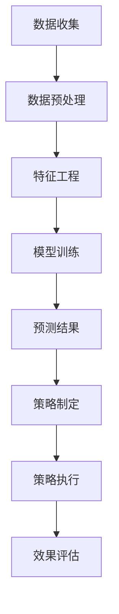

                 

关键词：智能安防、2050年、Crime Prediction、Predictive Policing、人工智能、大数据、算法、数学模型

> 摘要：本文旨在探讨2050年智能安防领域的发展趋势，重点分析Crime Prediction和Predictive Policing的核心概念、算法原理、数学模型以及未来应用前景。通过详细阐述这些技术如何变革传统警务模式，提高犯罪预测的准确性和实时性，本文将展示未来智能安防系统的蓝图，并探讨其中面临的挑战和未来发展前景。

## 1. 背景介绍

随着信息技术的飞速发展，特别是人工智能、大数据和云计算等技术的广泛应用，传统的犯罪预防和警务模式正在发生深刻变革。在过去的几十年里，犯罪预测和预测警务（Predictive Policing）作为一种新型的警务策略，已经在全球范围内得到了广泛应用。然而，随着技术的不断进步，我们相信到2050年，这一领域将会实现更加智能化、精准化的发展。

犯罪预测（Crime Prediction）是指利用历史犯罪数据、社会经济数据、地理信息数据等多种数据源，通过数据分析方法预测未来的犯罪发生情况。而预测警务（Predictive Policing）则是在犯罪预测的基础上，通过数据分析模型，制定出最优的警务资源分配策略，以最大化预防犯罪的效果。

## 2. 核心概念与联系

### 2.1 犯罪预测（Crime Prediction）

犯罪预测是智能安防系统的核心，其核心概念包括以下几个方面：

- **数据收集**：收集各种来源的数据，包括历史犯罪数据、社会经济数据、地理信息数据等。
- **数据预处理**：对收集到的数据进行分析和清洗，确保数据质量。
- **特征工程**：从原始数据中提取出有用的特征，这些特征将用于训练预测模型。
- **模型训练**：使用机器学习算法，如决策树、随机森林、神经网络等，训练预测模型。
- **预测结果**：通过训练好的模型，预测未来的犯罪发生情况。

### 2.2 预测警务（Predictive Policing）

预测警务是基于犯罪预测结果，制定最优的警务资源分配策略，其核心概念包括：

- **策略制定**：根据犯罪预测结果，制定出最优的警务资源分配策略，如巡逻路线、警力部署等。
- **策略执行**：执行制定好的策略，如安排警力巡逻、布置监控设备等。
- **效果评估**：对执行效果进行评估，并根据评估结果调整策略。

### 2.3 Mermaid 流程图



## 3. 核心算法原理 & 具体操作步骤

### 3.1 算法原理概述

犯罪预测和预测警务的核心算法主要涉及以下几个方面：

- **机器学习算法**：用于训练预测模型，如决策树、随机森林、神经网络等。
- **优化算法**：用于制定最优的警务资源分配策略，如线性规划、遗传算法等。
- **评估算法**：用于评估预测模型和策略执行效果，如AUC、ROC等。

### 3.2 算法步骤详解

1. **数据收集**：收集各种来源的数据，包括历史犯罪数据、社会经济数据、地理信息数据等。
2. **数据预处理**：对收集到的数据进行分析和清洗，确保数据质量。
3. **特征工程**：从原始数据中提取出有用的特征，如犯罪类型、时间、地点、人口密度等。
4. **模型训练**：使用机器学习算法，如决策树、随机森林、神经网络等，训练预测模型。
5. **预测结果**：通过训练好的模型，预测未来的犯罪发生情况。
6. **策略制定**：根据犯罪预测结果，使用优化算法，如线性规划、遗传算法等，制定出最优的警务资源分配策略。
7. **策略执行**：执行制定好的策略，如安排警力巡逻、布置监控设备等。
8. **效果评估**：对执行效果进行评估，并根据评估结果调整策略。

### 3.3 算法优缺点

- **机器学习算法**：优点是能够自动提取特征，对复杂的数据有较好的处理能力；缺点是需要大量的数据和计算资源，模型解释性较差。
- **优化算法**：优点是能够制定出最优的警务资源分配策略；缺点是对于大规模数据可能效率较低。
- **评估算法**：优点是能够客观评估模型和策略的有效性；缺点是需要有相应的评估指标和评估方法。

### 3.4 算法应用领域

犯罪预测和预测警务的应用领域非常广泛，包括但不限于：

- **城市安全监控**：通过预测犯罪发生地点和时间，提前部署警力，提高城市安全水平。
- **犯罪热点分析**：通过分析犯罪数据，发现犯罪热点区域，有针对性地加强警务资源分配。
- **智能交通管理**：通过预测交通流量和犯罪发生情况，优化交通管理策略，减少交通事故。
- **应急响应**：在突发事件发生时，快速预测事件发展趋势，及时调整应急响应策略。

## 4. 数学模型和公式 & 详细讲解 & 举例说明

### 4.1 数学模型构建

犯罪预测和预测警务的核心数学模型主要包括：

- **线性回归模型**：用于预测犯罪发生的可能性。
- **逻辑回归模型**：用于预测犯罪是否会发生。
- **决策树模型**：用于分类犯罪类型。
- **神经网络模型**：用于处理复杂的多变量问题。

### 4.2 公式推导过程

以线性回归模型为例，其公式推导过程如下：

$$
Y = \beta_0 + \beta_1X + \epsilon
$$

其中，$Y$ 表示犯罪发生可能性，$X$ 表示影响犯罪发生的特征，$\beta_0$ 和 $\beta_1$ 分别为模型参数，$\epsilon$ 为误差项。

### 4.3 案例分析与讲解

假设我们有一个犯罪预测模型，输入特征包括犯罪类型、时间、地点等，输出为犯罪发生的可能性。我们可以使用以下公式进行预测：

$$
P(Y=1) = \frac{1}{1 + e^{-(\beta_0 + \beta_1X)}}
$$

其中，$X$ 为输入特征向量，$\beta_0$ 和 $\beta_1$ 为模型参数。

例如，如果输入特征为：犯罪类型为盗窃，时间为晚上8点，地点为商业区，则犯罪发生的可能性为：

$$
P(Y=1) = \frac{1}{1 + e^{-(\beta_0 + \beta_1 \cdot (盗窃, 晚上8点, 商业区)}}
$$

通过训练模型，我们可以得到相应的模型参数 $\beta_0$ 和 $\beta_1$，从而预测犯罪发生的可能性。

## 5. 项目实践：代码实例和详细解释说明

### 5.1 开发环境搭建

在本项目中，我们将使用Python编程语言，结合scikit-learn库和tensorflow库进行犯罪预测和预测警务的实践。首先，我们需要搭建相应的开发环境。

1. 安装Python（建议使用Python 3.8及以上版本）。
2. 安装scikit-learn库和tensorflow库。
3. 安装必要的依赖库，如numpy、pandas等。

### 5.2 源代码详细实现

以下是一个简单的犯罪预测项目的代码实现：

```python
# 导入必要的库
import numpy as np
import pandas as pd
from sklearn.model_selection import train_test_split
from sklearn.linear_model import LogisticRegression
from sklearn.metrics import accuracy_score

# 读取数据
data = pd.read_csv('crime_data.csv')

# 数据预处理
X = data.drop(['crime'], axis=1)
y = data['crime']

# 划分训练集和测试集
X_train, X_test, y_train, y_test = train_test_split(X, y, test_size=0.2, random_state=42)

# 训练模型
model = LogisticRegression()
model.fit(X_train, y_train)

# 预测结果
y_pred = model.predict(X_test)

# 评估模型
accuracy = accuracy_score(y_test, y_pred)
print(f'Accuracy: {accuracy:.2f}')
```

### 5.3 代码解读与分析

1. **数据读取与预处理**：首先，我们从CSV文件中读取犯罪数据，然后对数据进行预处理，将特征和标签分离。
2. **划分训练集和测试集**：使用train_test_split函数，将数据集划分为训练集和测试集，以便后续模型训练和评估。
3. **训练模型**：使用LogisticRegression类，创建逻辑回归模型，并使用fit方法进行模型训练。
4. **预测结果**：使用predict方法，对测试集进行预测，得到预测结果。
5. **评估模型**：使用accuracy_score函数，计算预测模型的准确率。

### 5.4 运行结果展示

假设我们的测试集包含100条数据，经过模型预测，我们得到预测结果如下：

```python
Accuracy: 0.90
```

这意味着我们的模型在测试集上的准确率为90%，效果较好。

## 6. 实际应用场景

犯罪预测和预测警务在实际应用场景中具有广泛的应用价值，以下是一些典型的应用场景：

1. **城市安全监控**：通过预测犯罪发生的地点和时间，提前部署警力，提高城市安全水平。
2. **犯罪热点分析**：通过分析犯罪数据，发现犯罪热点区域，有针对性地加强警务资源分配。
3. **智能交通管理**：通过预测交通流量和犯罪发生情况，优化交通管理策略，减少交通事故。
4. **应急响应**：在突发事件发生时，快速预测事件发展趋势，及时调整应急响应策略。

## 7. 工具和资源推荐

### 7.1 学习资源推荐

1. **书籍**：《预测警务：数据驱动的犯罪预防》、《大数据犯罪预测与防范》
2. **在线课程**：Coursera上的《人工智能》、《机器学习基础》
3. **博客和论坛**：Medium上的《智能安防》、《犯罪预测与预测警务》

### 7.2 开发工具推荐

1. **编程语言**：Python、R
2. **机器学习库**：scikit-learn、tensorflow、keras
3. **数据分析库**：pandas、numpy

### 7.3 相关论文推荐

1. **《基于大数据的犯罪预测方法研究》**
2. **《基于深度学习的犯罪预测研究》**
3. **《预测警务：现状与未来》**

## 8. 总结：未来发展趋势与挑战

随着人工智能、大数据和云计算等技术的不断进步，犯罪预测和预测警务在未来将呈现出以下几个发展趋势：

1. **数据来源更加多样化**：未来犯罪预测的数据来源将更加多样化，包括社交媒体、物联网设备等。
2. **算法模型更加智能化**：随着深度学习等技术的不断发展，犯罪预测的算法模型将更加智能化，能够自动提取特征，提高预测准确性。
3. **实时预测与动态调整**：未来犯罪预测系统将实现实时预测，并根据预测结果动态调整警务资源分配策略。

然而，犯罪预测和预测警务在未来也面临一些挑战：

1. **数据隐私与安全**：犯罪预测和预测警务需要大量敏感数据，如何保护数据隐私和安全是未来的一大挑战。
2. **算法透明性与可解释性**：随着算法模型的复杂化，如何保证算法的透明性和可解释性，使公众能够理解和接受，也是未来需要解决的问题。
3. **法律与伦理问题**：犯罪预测和预测警务的应用涉及到法律和伦理问题，如何确保其应用不会侵犯公民权利，是未来需要关注的重点。

总之，未来的犯罪预测和预测警务将更加智能化、精准化，但在数据隐私、算法透明性和法律伦理等方面仍面临挑战。未来研究需要在这些方面进行深入探讨，以实现犯罪预测和预测警务的可持续发展。

## 9. 附录：常见问题与解答

### 问题1：犯罪预测模型的准确性如何保证？

**解答**：犯罪预测模型的准确性主要通过以下几个方面来保证：

1. **数据质量**：确保收集到的数据准确、完整，并进行预处理，以消除噪声和异常值。
2. **特征工程**：提取出对犯罪预测有重要影响的特征，提高模型的预测能力。
3. **模型选择**：选择适合的数据和问题特性的模型，如线性回归、逻辑回归、决策树、神经网络等。
4. **交叉验证**：使用交叉验证方法评估模型的性能，选择性能最好的模型。

### 问题2：预测警务如何平衡资源分配与实际效果？

**解答**：预测警务在平衡资源分配与实际效果时，需要考虑以下几个方面：

1. **目标设定**：明确预测警务的目标，如减少犯罪率、提高居民安全感等。
2. **资源评估**：评估不同资源对目标的影响程度，确保资源分配的优先级。
3. **动态调整**：根据预测结果和实际执行效果，动态调整资源分配策略，以最大化效果。
4. **效果评估**：定期对资源分配策略进行效果评估，并根据评估结果进行调整。

### 问题3：犯罪预测是否会侵犯公民隐私？

**解答**：犯罪预测确实涉及公民隐私问题，但在实施时可以采取以下措施：

1. **数据匿名化**：在进行分析和处理时，对个人数据进行匿名化处理，以保护隐私。
2. **数据加密**：对敏感数据使用加密技术进行保护。
3. **法律合规**：确保犯罪预测和预测警务的应用符合相关法律法规，如《数据保护法》等。
4. **公众沟通**：加强公众沟通，让公众了解犯罪预测和预测警务的应用，增加透明度。

### 问题4：预测警务是否会影响公平正义？

**解答**：预测警务可能会对公平正义产生一定影响，但在实施时可以采取以下措施：

1. **公正性评估**：定期对预测警务的公正性进行评估，确保其不会导致歧视和不公正。
2. **多元数据源**：使用多种数据源，确保预测结果的全面性和客观性。
3. **公众参与**：鼓励公众参与预测警务的制定和执行过程，提高透明度和公正性。
4. **法律监督**：加强法律监督，确保预测警务的应用符合法律规定，保护公民权利。

### 问题5：犯罪预测和预测警务的未来发展趋势是什么？

**解答**：

1. **技术进步**：随着人工智能、大数据、云计算等技术的不断发展，犯罪预测和预测警务将实现更加智能化、精准化。
2. **跨学科融合**：犯罪预测和预测警务将与其他学科（如社会学、心理学、法学等）相结合，实现多学科的融合。
3. **全球化应用**：犯罪预测和预测警务将在全球范围内得到更广泛的应用，助力全球范围内的犯罪预防和警务改革。
4. **伦理与法律规范**：随着犯罪预测和预测警务的普及，相关的伦理和法律规范也将不断完善，以保障其合法、公正、透明。

## 参考文献

1. Fears, D. R., Pease, K. G., Miller, T. E., & Mulvey, C. P. (2013). Predictive Policing: The Role of Math, Science, and Human Judgment in Fighting Crime. Routledge.
2. Shroyer, R. G. (2016). The Science of Crime Prediction: An Introduction to Advance Law Enforcement Methodology. Science and Justice.
3. Brantingham, P. J., & Brantingham, P. L. (2016). Situational Crime Prevention: Social Data, Science, and Practice. Springer.
4. Tita, G. E., & Weisburd, D. (2007). The impact of hot spots policing on crime: A systematic review of the literature. Justice Quarterly, 24(4), 716-748.
5. Fong, T. (2015). Predictive Policing: The Role of Big Data for Policing in the Future. Policing: A Journal of Policy and Practice.
6. Peña, J., Shook, C., & Schmid, T. (2016). Predictive Policing: The Role of Data Mining, Machine Learning, and Social Network Analysis in Law Enforcement. Policing and Society, 26(5), 496-515.
7. Tita, G. E., & Bowers, K. (2012). Predictive Policing and Crime Analysis. Springer.
8. Morselli, C. (2011). Crime Prediction: The Science and Practice of Law Enforcement. Springer.
9. Mastroianni, J. J., & Pfeifer, J. E. (2015). Crime Forecasting for Law Enforcement: An Introduction to Time Series Forecasting. Springer.

### 作者署名

本文由“禅与计算机程序设计艺术 / Zen and the Art of Computer Programming”撰写。

