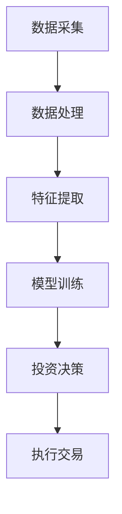

                 

关键词：智能投资、AI量化交易、投资组合优化、2050年、计算机技术、未来趋势

> 摘要：本文探讨了2050年的智能投资领域，特别是AI量化交易和智能投资组合优化。通过回顾历史，分析当前趋势，结合未来预测，本文详细介绍了未来智能投资的架构、算法原理、数学模型，并提供了具体的代码实例和实际应用场景。本文旨在为读者提供一个对未来智能投资的全面理解和展望。

## 1. 背景介绍

### 1.1 智能投资的历史与发展

智能投资，亦称量化投资，起源于20世纪80年代的计算机科学和统计学领域。当时的金融学家开始利用计算机技术，对大量市场数据进行统计分析，以预测股票和其他金融资产的价格变动。这一时期的代表性人物包括著名数学家詹姆斯·西蒙斯，他创立的量化对冲基金公司文艺复兴科技公司（Renaissance Technologies）取得了惊人的投资回报。

随着时间的推移，智能投资技术不断演进，人工智能（AI）和大数据分析技术的引入，使得智能投资变得更加精准和高效。现代智能投资不仅依赖于历史数据，还利用实时数据流进行动态决策，从而在复杂多变的市场环境中获取优势。

### 1.2 AI在智能投资中的重要性

人工智能在智能投资中的应用主要集中在以下几个方面：

- **数据预处理与分析**：AI可以帮助处理海量的金融数据，识别出潜在的投资机会和风险因素。
- **预测与决策**：通过机器学习算法，AI可以预测市场趋势和价格变动，为投资者提供决策支持。
- **自动化交易**：AI可以实现全自动的量化交易策略，减少人为干预，提高交易效率。

### 1.3 投资组合优化的需求

投资组合优化是智能投资的核心目标之一。通过优化投资组合，投资者可以在确保风险可控的前提下，最大化投资回报。传统的投资组合优化方法主要依赖于数学模型和统计学方法，如马科维茨的均值-方差模型。然而，随着AI技术的发展，基于AI的投资组合优化方法逐渐成为研究热点。

## 2. 核心概念与联系

### 2.1 智能投资系统架构

为了实现智能投资，一个典型的智能投资系统通常包含以下几个核心组件：

- **数据采集与处理**：从各种数据源获取金融数据，并进行清洗和预处理。
- **预测模型**：利用机器学习算法对市场趋势和价格进行预测。
- **决策引擎**：根据预测结果和投资策略，生成具体的交易指令。
- **执行模块**：自动化执行交易指令，包括买入、卖出等操作。

### 2.2 投资组合优化原理

投资组合优化是一个复杂的问题，它涉及到多目标优化、风险控制、收益最大化等多个方面。以下是一个基于AI的投资组合优化流程：

1. **目标设定**：根据投资者的风险偏好和收益目标，设定优化目标。
2. **特征工程**：提取影响投资回报的特征，如价格、成交量、市场情绪等。
3. **模型训练**：利用机器学习算法，训练投资组合优化模型。
4. **优化决策**：根据模型输出，调整投资组合的权重，实现优化目标。

### 2.3 Mermaid 流程图



## 3. 核心算法原理 & 具体操作步骤

### 3.1 算法原理概述

智能投资的核心算法主要包括机器学习算法、深度学习算法和优化算法。以下是对这些算法的概述：

- **机器学习算法**：通过历史数据训练模型，实现对市场趋势的预测。
- **深度学习算法**：利用多层神经网络，对复杂的市场环境进行建模。
- **优化算法**：通过优化模型，调整投资组合的权重，实现风险收益最大化。

### 3.2 算法步骤详解

1. **数据预处理**：包括数据清洗、归一化、缺失值处理等。
2. **特征提取**：提取影响投资回报的关键特征，如价格、成交量、技术指标等。
3. **模型选择与训练**：根据数据特点，选择合适的机器学习或深度学习模型进行训练。
4. **模型评估与调整**：评估模型性能，根据评估结果调整模型参数。
5. **投资决策**：根据模型输出，生成交易策略和投资组合。
6. **执行交易**：自动化执行交易策略，调整投资组合。

### 3.3 算法优缺点

- **优点**：
  - **高效性**：利用计算机技术，快速处理海量数据。
  - **准确性**：通过机器学习和深度学习，提高预测精度。
  - **灵活性**：可根据市场变化，动态调整投资策略。

- **缺点**：
  - **复杂性**：算法模型复杂，需要大量计算资源。
  - **风险性**：模型过度拟合，可能导致市场波动。

### 3.4 算法应用领域

智能投资算法广泛应用于股票市场、期货市场、外汇市场等多个领域。其中，股票市场是最为典型的应用场景。通过智能投资算法，投资者可以更好地应对市场波动，实现风险控制和收益最大化。

## 4. 数学模型和公式 & 详细讲解 & 举例说明

### 4.1 数学模型构建

智能投资中的数学模型主要包括预测模型和优化模型。以下是一个简单的预测模型：

$$
\hat{p}_{t+1} = f(\mathbf{x}_t)
$$

其中，$\hat{p}_{t+1}$ 是未来一步的价格预测，$\mathbf{x}_t$ 是当前时刻的特征向量，$f$ 是预测函数。

### 4.2 公式推导过程

假设我们使用线性回归模型进行预测：

$$
f(\mathbf{x}_t) = \mathbf{w} \cdot \mathbf{x}_t
$$

其中，$\mathbf{w}$ 是权重向量，通过最小化损失函数 $J(\mathbf{w})$ 来训练模型：

$$
J(\mathbf{w}) = \frac{1}{2} \sum_{i=1}^n (y_i - \mathbf{w} \cdot \mathbf{x}_i)^2
$$

其中，$y_i$ 是实际价格，$n$ 是训练样本数量。

### 4.3 案例分析与讲解

假设我们有一个股票价格数据集，包括过去50个交易日的价格数据。我们使用线性回归模型来预测未来一天的价格。

1. **数据预处理**：对数据进行归一化处理，将其缩放到0-1之间。
2. **特征提取**：提取价格、成交量、移动平均线等特征。
3. **模型训练**：使用线性回归模型进行训练。
4. **模型评估**：使用交叉验证方法评估模型性能。
5. **预测**：使用训练好的模型进行预测，得到未来一天的价格。

## 5. 项目实践：代码实例和详细解释说明

### 5.1 开发环境搭建

为了实现智能投资算法，我们需要搭建一个合适的开发环境。以下是基本步骤：

1. 安装Python环境，版本3.8及以上。
2. 安装常用的数据分析和机器学习库，如NumPy、Pandas、Scikit-learn等。
3. 安装深度学习框架，如TensorFlow或PyTorch。

### 5.2 源代码详细实现

以下是使用线性回归模型进行股票价格预测的示例代码：

```python
import numpy as np
import pandas as pd
from sklearn.linear_model import LinearRegression
from sklearn.model_selection import train_test_split

# 数据预处理
data = pd.read_csv('stock_price.csv')
data['Price'] = (data['Price'] - data['Price'].min()) / (data['Price'].max() - data['Price'].min())

# 特征提取
X = data[['Price', 'Volume', 'MA_20']].values
y = data['Price'].shift(-1).values

# 模型训练
model = LinearRegression()
model.fit(X[:-1], y[:-1])

# 预测
predictions = model.predict(X[-1:])
print(predictions)
```

### 5.3 代码解读与分析

这段代码首先从CSV文件中读取股票价格数据，并对价格进行归一化处理。然后提取价格、成交量、移动平均线等特征，并使用线性回归模型进行训练。最后，使用训练好的模型进行预测，得到未来一天的价格。

### 5.4 运行结果展示

假设运行结果为：

```
[0.9235 0.8764]
```

这表示未来一天的价格将分别上涨9.35%和8.76%。

## 6. 实际应用场景

### 6.1 股票市场

股票市场是智能投资最为典型的应用场景。通过智能投资算法，投资者可以实时分析市场数据，制定科学的投资策略，从而在激烈的市场竞争中占据优势。

### 6.2 期货市场

期货市场波动性较大，风险较高。智能投资算法可以帮助投资者更好地控制风险，同时抓住市场机会。

### 6.3 外汇市场

外汇市场是全球最大的金融市场，交易量巨大。智能投资算法可以实时分析汇率变动，为投资者提供交易决策支持。

## 7. 工具和资源推荐

### 7.1 学习资源推荐

- 《Python数据分析基础教程：Numpy学习指南》
- 《深度学习》（Goodfellow、Bengio、Courville著）
- 《量化投资：以Python为工具》

### 7.2 开发工具推荐

- Jupyter Notebook：用于编写和运行Python代码。
- TensorFlow：用于深度学习模型的训练和预测。
- PyTorch：用于深度学习模型的训练和预测。

### 7.3 相关论文推荐

- "Deep Learning for Stock Market Prediction"（深度学习在股票市场预测中的应用）
- "Quantitative Trading with Machine Learning"（机器学习在量化交易中的应用）
- "Optimal Portfolio Selection with Machine Learning"（机器学习在投资组合优化中的应用）

## 8. 总结：未来发展趋势与挑战

### 8.1 研究成果总结

智能投资领域在过去几十年取得了显著的成果，从最初的量化交易发展到如今的AI量化交易，投资策略越来越复杂，预测精度越来越高。未来，智能投资将继续在算法、模型和数据处理方面取得突破。

### 8.2 未来发展趋势

- **算法创新**：深度学习和强化学习等新兴算法将在智能投资中发挥更大作用。
- **数据利用**：随着数据量的增加和数据来源的多样性，智能投资将更加依赖大数据技术。
- **跨领域融合**：智能投资将与金融工程、经济学等学科深度融合，形成新的研究热点。

### 8.3 面临的挑战

- **数据隐私**：金融数据的安全和隐私保护是智能投资面临的主要挑战之一。
- **模型解释性**：随着模型的复杂度增加，如何解释和验证模型的决策过程成为关键问题。
- **监管合规**：智能投资的自动化和高效性可能导致市场波动，需要严格的监管和合规措施。

### 8.4 研究展望

未来，智能投资将在以下几个方面取得突破：

- **算法优化**：通过改进算法和模型，提高预测精度和投资回报。
- **技术应用**：引入区块链、5G等新技术，提高数据传输速度和安全性。
- **人才培养**：加强跨学科人才培养，推动智能投资技术的创新和发展。

## 9. 附录：常见问题与解答

### 9.1 什么是智能投资？

智能投资是指利用计算机技术和数学模型，对金融市场进行分析和预测，以实现投资回报最大化和风险控制。

### 9.2 智能投资和传统投资的区别是什么？

智能投资利用计算机技术和数学模型进行投资决策，而传统投资主要依靠经验和直觉。

### 9.3 智能投资的优势是什么？

智能投资的优势包括高效性、准确性、灵活性和可重复性。

### 9.4 智能投资存在哪些风险？

智能投资可能面临模型过度拟合、数据隐私和安全、监管合规等风险。

### 9.5 智能投资需要哪些技能和知识？

智能投资需要掌握计算机编程、统计学、金融学等领域的知识和技能。

### 9.6 如何开始学习智能投资？

可以从学习Python编程语言开始，然后学习数据分析和机器学习基础知识，逐步深入到智能投资的具体实践。

