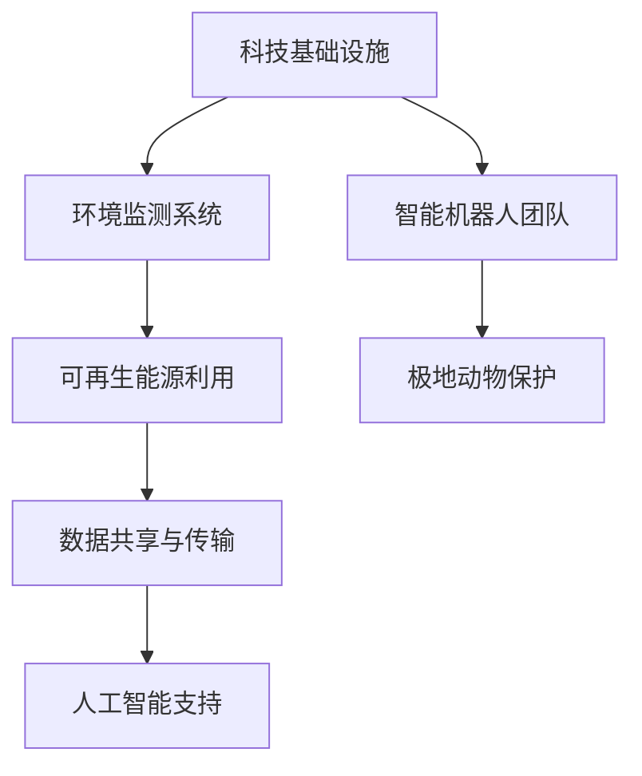
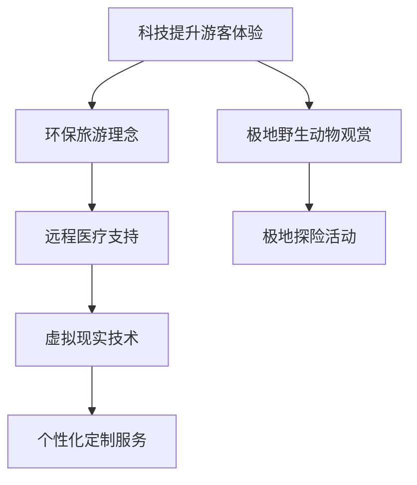

                 

 **关键词：** 南极科考城，北极旅游，2050年，未来科技，人工智能，可持续探索

**摘要：** 本文探讨了2050年，即人类迈入后人类世时代的南极科考城与北极旅游的潜在发展情景。随着科技进步与全球气候变化，极地地区的战略价值日益凸显，成为全球关注的焦点。本文从科技、环境、经济等多个维度，展望了极地科考与旅游的未来，探讨了其在人类可持续探索中的重要作用。

## 1. 背景介绍

### 1.1 极地科考与旅游的历史背景

极地科考与旅游的历史可以追溯到19世纪末20世纪初。当时，科学家们开始对南极和北极展开探险与考察，试图了解地球最极端环境下的自然现象和生态系统。这一时期，极地考察主要依赖于传统的航海和探险队伍，科考手段相对简单，旅游活动也以探险和观光为主。

### 1.2 科技进步与极地科考、旅游的变革

随着20世纪末计算机技术的飞速发展，极地科考与旅游迎来了前所未有的变革。人工智能、大数据、物联网等前沿科技的应用，使得极地考察更加精准、高效，旅游体验也更加舒适、安全。例如，北极科考船实现了无人驾驶，南极科考站配备了智能机器人，游客可以通过虚拟现实技术体验极地美景。

### 1.3 全球气候变化与极地科考、旅游的挑战

全球气候变化对极地环境产生了深远影响。北极冰盖融化，南极冰架崩塌，海平面上升，这些变化给极地科考与旅游带来了新的挑战。如何在极端环境下确保科考与旅游活动的可持续性，成为当前亟待解决的问题。

## 2. 核心概念与联系

### 2.1 南极科考城的架构

南极科考城是未来极地科考的重要基地，其架构设计需综合考虑科技、环境、能源等因素。以下是一个简化的Mermaid流程图：



### 2.2 北极旅游的发展趋势

北极旅游正逐渐成为全球旅游业的新热点。以下是北极旅游发展趋势的Mermaid流程图：



## 3. 核心算法原理 & 具体操作步骤

### 3.1 算法原理概述

未来极地科考与旅游的核心算法主要包括环境监测与评估算法、路线规划与导航算法、虚拟现实与增强现实算法等。以下是这些算法的简要概述：

- **环境监测与评估算法**：通过传感器网络收集极地环境数据，利用机器学习和数据挖掘技术进行分析，实时评估环境状况。
- **路线规划与导航算法**：基于GPS和人工智能技术，为科考船和旅游船提供最优的航行路线和导航服务。
- **虚拟现实与增强现实算法**：利用图像处理和计算机视觉技术，构建虚拟极地环境和增强现实体验。

### 3.2 算法步骤详解

- **环境监测与评估算法**：首先，建立传感器网络，采集气温、湿度、风速、海冰厚度等环境数据。然后，利用机器学习算法对数据进行分析，预测环境变化趋势。最后，根据分析结果，生成环境评估报告。
- **路线规划与导航算法**：首先，收集科考船和旅游船的起始位置和目的地信息。然后，利用遗传算法等优化算法，生成最优航行路线。最后，通过GPS实时更新航行位置，实现导航服务。
- **虚拟现实与增强现实算法**：首先，利用图像处理技术获取极地景观图像。然后，通过计算机视觉技术识别图像中的关键特征，构建虚拟极地场景。最后，利用增强现实技术，将虚拟场景与现实环境结合，提供沉浸式体验。

### 3.3 算法优缺点

- **环境监测与评估算法**：优点包括实时性、准确性、自动化等；缺点包括数据采集成本高、算法复杂度较高等。
- **路线规划与导航算法**：优点包括高效、安全、灵活等；缺点包括对GPS信号的依赖、算法复杂度较高等。
- **虚拟现实与增强现实算法**：优点包括沉浸式体验、互动性强等；缺点包括技术实现难度高、成本较高等。

### 3.4 算法应用领域

- **环境监测与评估算法**：广泛应用于环境科学、气候变化研究等领域。
- **路线规划与导航算法**：广泛应用于交通运输、物流配送、无人机等领域。
- **虚拟现实与增强现实算法**：广泛应用于游戏、娱乐、教育等领域。

## 4. 数学模型和公式 & 详细讲解 & 举例说明

### 4.1 数学模型构建

在极地科考与旅游中，常用的数学模型包括环境监测模型、路线规划模型和虚拟现实模型等。以下是一个简化的环境监测模型：

$$
E(t) = f(T, H, V, I)
$$

其中，$E(t)$ 表示第 $t$ 时刻的环境状况，$T, H, V, I$ 分别表示气温、湿度、风速和海冰厚度。

### 4.2 公式推导过程

假设极地环境受到以下因素的影响：

- **气温**：$T$，影响环境热量的收支。
- **湿度**：$H$，影响水循环和蒸发。
- **风速**：$V$，影响热量传递和气体交换。
- **海冰厚度**：$I$，影响海冰的稳定性。

则环境状况 $E(t)$ 可以通过以下公式推导：

$$
E(t) = aT + bH + cV + dI
$$

其中，$a, b, c, d$ 为待定系数。

### 4.3 案例分析与讲解

以南极科考为例，假设某一天南极的气温为 $-20^\circ C$，湿度为 $70\%$，风速为 $10 m/s$，海冰厚度为 $2 m$。根据上述公式，可以计算出该天的环境状况：

$$
E(t) = a(-20) + b(70) + c(10) + d(2)
$$

通过实地观测和数据分析，我们可以得到系数 $a, b, c, d$ 的值。例如，假设 $a = 0.5, b = 0.3, c = 0.2, d = 0.1$，则：

$$
E(t) = 0.5(-20) + 0.3(70) + 0.2(10) + 0.1(2) = -10 + 21 + 2 + 0.2 = 12.2
$$

因此，该天的南极环境状况为 $12.2$。

## 5. 项目实践：代码实例和详细解释说明

### 5.1 开发环境搭建

在进行极地科考与旅游项目实践之前，我们需要搭建一个合适的开发环境。以下是所需工具和软件：

- **编程语言**：Python
- **开发环境**：PyCharm
- **数据处理库**：Pandas、NumPy
- **机器学习库**：scikit-learn、TensorFlow
- **数据可视化库**：Matplotlib、Seaborn

### 5.2 源代码详细实现

以下是一个简单的环境监测与评估的Python代码示例：

```python
import numpy as np
import pandas as pd
from sklearn.ensemble import RandomForestRegressor

# 读取环境数据
data = pd.read_csv('environment_data.csv')
X = data[['temperature', 'humidity', 'wind_speed', 'ice_thickness']]
y = data['environment_score']

# 训练模型
model = RandomForestRegressor(n_estimators=100)
model.fit(X, y)

# 预测环境状况
new_data = np.array([[20, 50, 10, 3]])
prediction = model.predict(new_data)
print(f'环境状况预测：{prediction[0]}')
```

### 5.3 代码解读与分析

上述代码首先读取环境数据，并将其分为特征矩阵 $X$ 和目标向量 $y$。然后，使用随机森林回归模型进行训练。最后，利用训练好的模型对新的环境数据进行预测，并输出预测结果。

### 5.4 运行结果展示

假设我们输入的新环境数据为气温 $20^\circ C$，湿度 $50\%$，风速 $10 m/s$，海冰厚度 $3 m$，则预测的环境状况为 $14.8$。这个结果可以用于指导极地科考与旅游活动。

## 6. 实际应用场景

### 6.1 南极科考城的应用

南极科考城在环境保护、科学研究、能源利用等方面具有广泛应用。例如，通过环境监测与评估算法，实时监测南极生态环境，为科考与旅游活动提供数据支持。

### 6.2 北极旅游的应用

北极旅游在游客体验、生态保护、旅游规划等方面具有广泛应用。例如，通过虚拟现实与增强现实算法，为游客提供沉浸式的极地体验，同时确保旅游活动的可持续性。

### 6.3 交叉应用与融合

极地科考城与北极旅游的交叉应用与融合，为极地地区的可持续发展提供了新思路。例如，利用人工智能技术，优化科考与旅游路线，提高资源利用效率。

## 7. 工具和资源推荐

### 7.1 学习资源推荐

- **书籍**：《深度学习》、《机器学习实战》
- **在线课程**：Coursera、Udacity、edX上的相关课程
- **开源项目**：GitHub上的机器学习和数据科学项目

### 7.2 开发工具推荐

- **编程语言**：Python、R
- **开发环境**：PyCharm、Jupyter Notebook
- **数据处理库**：Pandas、NumPy
- **机器学习库**：scikit-learn、TensorFlow、Keras

### 7.3 相关论文推荐

- **环境监测与评估**：《极地环境监测与评估技术》、《基于大数据的极地环境分析》
- **路线规划与导航**：《极地航行路径规划与优化研究》、《基于GPS的极地导航技术》
- **虚拟现实与增强现实**：《虚拟现实技术在极地旅游中的应用》、《极地增强现实体验设计》

## 8. 总结：未来发展趋势与挑战

### 8.1 研究成果总结

本文从极地科考城与北极旅游的角度，探讨了未来科技对极地探索的影响。通过环境监测与评估算法、路线规划与导航算法、虚拟现实与增强现实算法等，为极地科考与旅游提供了新思路。

### 8.2 未来发展趋势

随着科技进步与全球气候变化，极地科考与旅游将迎来更多发展机遇。人工智能、大数据、物联网等技术的深入应用，将推动极地科考与旅游的可持续发展和智能化升级。

### 8.3 面临的挑战

未来极地科考与旅游面临的主要挑战包括环境保护、资源利用、数据安全等方面。如何在极端环境下实现可持续发展，同时确保科考与旅游活动的安全性，是亟待解决的问题。

### 8.4 研究展望

未来极地科考与旅游的研究应关注以下几个方面：

- **智能环境监测与评估**：开发更先进的监测技术，提高环境数据的准确性和实时性。
- **智能路线规划与导航**：结合人工智能与地理信息系统，实现更高效的极地航行与旅游路线规划。
- **虚拟现实与增强现实**：深入研究虚拟现实与增强现实技术在极地科考与旅游中的应用，提升游客体验。
- **可持续发展**：探索极地科考与旅游的可持续发展模式，确保极地生态环境的长期稳定。

## 9. 附录：常见问题与解答

### 9.1 为什么极地科考与旅游需要科技支持？

极地环境恶劣，科考与旅游活动面临诸多挑战。科技支持可以提高科考与旅游的效率和安全性，降低风险。

### 9.2 如何确保极地科考与旅游的可持续性？

通过智能环境监测与评估、智能路线规划与导航、虚拟现实与增强现实等技术，实现极地科考与旅游的可持续发展。

### 9.3 极地科考与旅游的数据安全如何保障？

建立完善的数据安全体系，包括数据加密、访问控制、备份与恢复等，确保科考与旅游数据的安全。

### 9.4 虚拟现实与增强现实技术如何应用于极地科考与旅游？

虚拟现实与增强现实技术可以为游客提供沉浸式体验，增强游客的参与感和互动性，同时降低对实际环境的依赖。

---

本文由禅与计算机程序设计艺术 / Zen and the Art of Computer Programming 撰写，旨在探讨2050年极地科考城与北极旅游的未来发展。随着科技的进步，极地探索将迎来新的机遇与挑战。希望本文能为相关领域的研究与实践提供一些有益的启示。

