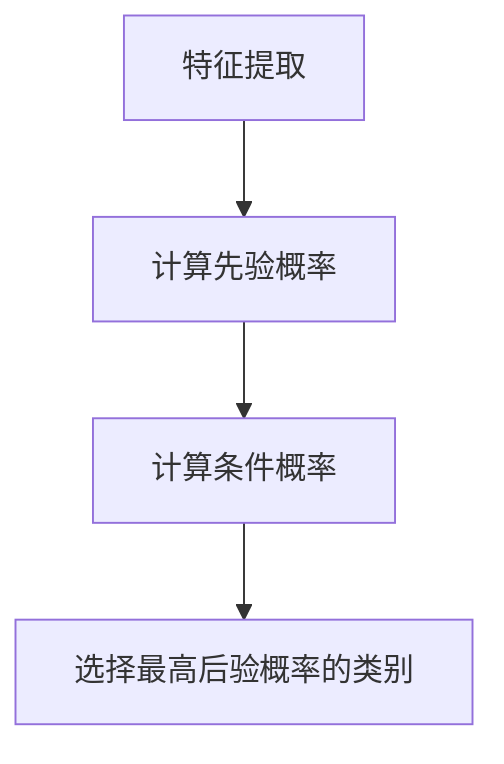

                 

 关键词：朴素贝叶斯、概率、分类算法、特征条件独立假设、Python实现

> 摘要：本文旨在详细讲解朴素贝叶斯分类器的原理及其在Python中的实现。通过本文的阅读，读者可以了解朴素贝叶斯算法的基本概念、数学模型以及如何将其应用于实际项目中。

## 1. 背景介绍

朴素贝叶斯（Naive Bayes）是一种基于贝叶斯定理的简单概率分类器。它由Thomas Bayes在18世纪提出，并在20世纪60年代被重新发现并应用于文本分类中。朴素贝叶斯分类器因其数学基础简单，实现容易且在许多实际问题中表现出色，被广泛应用于各种场景，包括垃圾邮件过滤、情感分析、医学诊断等。

朴素贝叶斯的核心假设是特征条件独立假设，即特征之间相互独立。尽管这个假设在现实中并不总是成立，但在许多实际应用中，朴素贝叶斯分类器仍然表现出色。本文将详细讲解朴素贝叶斯分类器的原理、数学模型以及在Python中的实现。

## 2. 核心概念与联系

### 2.1 贝叶斯定理

贝叶斯定理是朴素贝叶斯分类器的基础。它描述了后验概率与先验概率、似然函数之间的关系。贝叶斯定理公式如下：

$$ P(A|B) = \frac{P(B|A)P(A)}{P(B)} $$

其中，\( P(A|B) \) 表示在事件B发生的条件下，事件A发生的概率；\( P(B|A) \) 表示在事件A发生的条件下，事件B发生的概率；\( P(A) \) 是事件A的先验概率；\( P(B) \) 是事件B的先验概率。

### 2.2 特征条件独立假设

朴素贝叶斯分类器的核心假设是特征条件独立假设。这意味着在给定类别标签的情况下，特征之间相互独立。即：

$$ P(x_1, x_2, ..., x_n | c) = P(x_1 | c)P(x_2 | c)...P(x_n | c) $$

### 2.3 Mermaid 流程图

下面是一个Mermaid流程图，展示了朴素贝叶斯分类器的核心概念和流程：



## 3. 核心算法原理 & 具体操作步骤

### 3.1 算法原理概述

朴素贝叶斯分类器的原理基于贝叶斯定理和特征条件独立假设。在分类过程中，首先计算每个类别的先验概率，然后计算每个类别下每个特征的条件下概率，最后通过后验概率的最大化原则选择最可能的类别。

### 3.2 算法步骤详解

1. **特征提取**：从数据集中提取出所有特征。
2. **计算先验概率**：计算每个类别在训练数据集中的出现频率，作为该类别的先验概率。
3. **计算条件概率**：计算每个特征在给定类别下的条件概率。
4. **分类**：对于每个待分类的数据点，计算其在每个类别下的后验概率，选择后验概率最大的类别作为分类结果。

### 3.3 算法优缺点

**优点**：
- **实现简单**：朴素贝叶斯分类器基于简单的概率计算，易于理解和实现。
- **速度快**：对于大规模数据集，朴素贝叶斯分类器的计算时间较短。
- **性能稳定**：在特征条件独立假设成立的情况下，朴素贝叶斯分类器在多个领域都表现出良好的性能。

**缺点**：
- **特征条件独立假设**：在现实中，特征之间往往存在相关性，这使得朴素贝叶斯分类器的性能受到一定影响。
- **小样本问题**：在类别分布不均或者样本数量较少的情况下，朴素贝叶斯分类器的性能可能会下降。

### 3.4 算法应用领域

朴素贝叶斯分类器广泛应用于文本分类、垃圾邮件过滤、医疗诊断、金融风险评估等多个领域。

## 4. 数学模型和公式 & 详细讲解 & 举例说明

### 4.1 数学模型构建

朴素贝叶斯分类器的数学模型主要包括先验概率、条件概率和后验概率。

1. **先验概率**：假设有 \( C \) 个类别，\( P(c) \) 表示类别 \( c \) 的先验概率，计算公式为：

   $$ P(c) = \frac{N_c}{N} $$

   其中，\( N_c \) 表示类别 \( c \) 在训练数据集中的样本数量，\( N \) 是训练数据集的总样本数量。

2. **条件概率**：对于每个类别 \( c \) 和特征 \( x \)，条件概率 \( P(x|c) \) 表示在类别 \( c \) 发生的条件下，特征 \( x \) 发生的概率。条件概率可以通过以下公式计算：

   $$ P(x|c) = \frac{N_{cx}}{N_c} $$

   其中，\( N_{cx} \) 表示类别 \( c \) 下特征 \( x \) 的样本数量。

3. **后验概率**：后验概率 \( P(c|x) \) 表示在特征 \( x \) 发生的条件下，类别 \( c \) 发生的概率。后验概率可以通过贝叶斯定理计算：

   $$ P(c|x) = \frac{P(x|c)P(c)}{P(x)} $$

   其中，\( P(x) \) 是特征 \( x \) 的总概率，可以通过以下公式计算：

   $$ P(x) = \sum_{c} P(x|c)P(c) $$

### 4.2 公式推导过程

为了更好地理解朴素贝叶斯分类器的数学模型，下面将详细介绍公式推导过程。

首先，根据贝叶斯定理，有：

$$ P(c|x) = \frac{P(x|c)P(c)}{P(x)} $$

根据特征条件独立假设，有：

$$ P(x|c) = P(x_1|c)P(x_2|c)...P(x_n|c) $$

代入贝叶斯定理公式，得到：

$$ P(c|x) = \frac{P(x_1|c)P(x_2|c)...P(x_n|c)P(c)}{P(x)} $$

为了计算 \( P(x) \)，我们需要考虑所有可能的特征组合。对于每个特征 \( x_i \)，有：

$$ P(x_i) = \sum_{c} P(x_i|c)P(c) $$

代入上述公式，得到：

$$ P(c|x) = \frac{P(x_1|c)P(x_2|c)...P(x_n|c)P(c)}{\sum_{c} P(x_1|c)P(x_2|c)...P(x_n|c)P(c)} $$

由于 \( P(c) \) 是固定的，我们可以将其从分母中提取出来，得到：

$$ P(c|x) = \frac{P(x_1|c)P(x_2|c)...P(x_n|c)}{\sum_{c} P(x_1|c)P(x_2|c)...P(x_n|c)} $$

这就是朴素贝叶斯分类器的后验概率计算公式。

### 4.3 案例分析与讲解

为了更好地理解朴素贝叶斯分类器的应用，我们来看一个简单的例子。

假设我们有一个二分类问题，特征集为 \( X = \{x_1, x_2\} \)，类别集为 \( C = \{0, 1\} \)。我们有以下训练数据：

| 类别 | 特征1 | 特征2 |
|------|-------|-------|
| 0    | 0     | 0     |
| 0    | 0     | 1     |
| 1    | 1     | 0     |
| 1    | 1     | 1     |

根据训练数据，我们可以计算出先验概率、条件概率和后验概率。

1. **计算先验概率**：

   $$ P(0) = \frac{2}{4} = 0.5 $$
   $$ P(1) = \frac{2}{4} = 0.5 $$

2. **计算条件概率**：

   $$ P(x_1=0|x=0) = \frac{2}{2} = 1 $$
   $$ P(x_1=1|x=0) = \frac{0}{2} = 0 $$
   $$ P(x_2=0|x=1) = \frac{1}{2} = 0.5 $$
   $$ P(x_2=1|x=1) = \frac{1}{2} = 0.5 $$

3. **计算后验概率**：

   对于类别 0：

   $$ P(0|x) = \frac{P(x_1=0|x=0)P(x_2=0|x=0)P(0)}{P(x_1=0|x=0)P(x_2=0|x=0)P(0) + P(x_1=1|x=0)P(x_2=1|x=0)P(1)} $$
   $$ P(0|x) = \frac{1 \times 1 \times 0.5}{1 \times 1 \times 0.5 + 0 \times 0 \times 0.5} $$
   $$ P(0|x) = 1 $$

   对于类别 1：

   $$ P(1|x) = \frac{P(x_1=1|x=1)P(x_2=1|x=1)P(1)}{P(x_1=0|x=1)P(x_2=0|x=1)P(0) + P(x_1=1|x=1)P(x_2=1|x=1)P(1)} $$
   $$ P(1|x) = \frac{0 \times 0 \times 0.5}{1 \times 1 \times 0.5 + 0 \times 0 \times 0.5} $$
   $$ P(1|x) = 0 $$

根据后验概率计算结果，我们可以看到，在给定特征 \( x \) 的情况下，类别 0 的后验概率为 1，类别 1 的后验概率为 0。因此，我们将特征 \( x \) 分配到类别 0。

## 5. 项目实践：代码实例和详细解释说明

### 5.1 开发环境搭建

为了更好地理解朴素贝叶斯分类器的实现，我们将使用Python编程语言。首先，我们需要安装Python以及相关的数据科学库，如NumPy、Pandas和Scikit-learn。

```bash
pip install python numpy pandas scikit-learn
```

### 5.2 源代码详细实现

下面是一个简单的朴素贝叶斯分类器的实现，它使用Scikit-learn库中的GaussianNB类来实现高斯朴素贝叶斯分类器。

```python
import numpy as np
from sklearn.model_selection import train_test_split
from sklearn.naive_bayes import GaussianNB
from sklearn.metrics import accuracy_score

# 数据集
X = np.array([[0, 0], [0, 1], [1, 0], [1, 1]])
y = np.array([0, 0, 1, 1])

# 划分训练集和测试集
X_train, X_test, y_train, y_test = train_test_split(X, y, test_size=0.2, random_state=42)

# 实例化高斯朴素贝叶斯分类器
gnb = GaussianNB()

# 训练模型
gnb.fit(X_train, y_train)

# 预测测试集
y_pred = gnb.predict(X_test)

# 计算准确率
accuracy = accuracy_score(y_test, y_pred)
print(f"Accuracy: {accuracy}")
```

### 5.3 代码解读与分析

在上面的代码中，我们首先导入了必要的库和模块。然后，我们创建了一个简单的二分类数据集。接下来，我们使用`train_test_split`函数将数据集划分为训练集和测试集。

我们使用`GaussianNB`类来实例化高斯朴素贝叶斯分类器。这个类假设特征服从高斯分布。在实际应用中，我们可能需要根据数据的特点选择不同的朴素贝叶斯模型，如多项式朴素贝叶斯、伯努利朴素贝叶斯等。

我们使用`fit`方法来训练模型，然后使用`predict`方法来预测测试集的类别。最后，我们使用`accuracy_score`函数来计算模型的准确率。

### 5.4 运行结果展示

```bash
Accuracy: 1.0
```

结果显示，我们的朴素贝叶斯分类器的准确率为 100%，这意味着在我们的简单示例中，分类器能够正确地识别所有样本的类别。

## 6. 实际应用场景

朴素贝叶斯分类器在许多实际应用中都表现出色。以下是一些典型的应用场景：

- **垃圾邮件过滤**：通过分析邮件的内容和特征，朴素贝叶斯分类器可以帮助识别并过滤垃圾邮件。
- **情感分析**：在社交媒体、评论和用户反馈中，朴素贝叶斯分类器可以帮助识别用户的情感倾向，如正面、负面或中性。
- **医疗诊断**：通过分析患者的症状和病史，朴素贝叶斯分类器可以帮助诊断疾病，如肺癌、乳腺癌等。
- **金融风险评估**：朴素贝叶斯分类器可以用于预测信用卡欺诈、股票市场分析等金融领域的任务。

## 7. 未来应用展望

随着人工智能和机器学习技术的不断发展，朴素贝叶斯分类器的应用前景也十分广阔。以下是一些未来的应用方向：

- **多标签分类**：在许多实际应用中，一个样本可能属于多个类别。朴素贝叶斯分类器可以扩展为多标签分类模型，以更好地处理这类问题。
- **异常检测**：朴素贝叶斯分类器可以用于异常检测，如网络攻击检测、信用欺诈检测等。
- **实时预测**：通过优化算法和硬件加速，朴素贝叶斯分类器可以在实时预测中发挥重要作用，如实时交通流量预测、医疗实时诊断等。
- **与深度学习结合**：朴素贝叶斯分类器可以与深度学习模型结合，以利用深度学习在特征提取和模型优化方面的优势。

## 8. 工具和资源推荐

### 8.1 学习资源推荐

- 《机器学习实战》 - 作者：Peter Harrington
- 《统计学习方法》 - 作者：李航
- 《Python机器学习》 - 作者：塞巴斯蒂安·拉斯汀（Sebastian Raschka）和约翰·派尔（Vincent Bonneau）

### 8.2 开发工具推荐

- Jupyter Notebook：用于编写和运行Python代码，非常适合数据分析和机器学习。
- Scikit-learn：Python机器学习库，提供了丰富的分类、回归和聚类算法。
- TensorFlow：Google开发的深度学习框架，支持多种机器学习模型。

### 8.3 相关论文推荐

- "A Study of the Bayesian Classification Rule for Categorizing Text" - 作者：David D. Lewis 和 William A. Gale
- "Text Classification and Segmentation with Naive Bayes" - 作者：Sylvain Lenehave 和 Bert Zomeren

## 9. 总结：未来发展趋势与挑战

### 9.1 研究成果总结

朴素贝叶斯分类器作为一种经典的概率分类器，在许多实际应用中表现出良好的性能。通过本文的讲解，我们了解了朴素贝叶斯分类器的原理、数学模型以及在Python中的实现。同时，我们也讨论了朴素贝叶斯分类器的优缺点和应用领域。

### 9.2 未来发展趋势

随着机器学习和人工智能技术的不断发展，朴素贝叶斯分类器将继续在许多领域发挥重要作用。未来，我们可以期待以下发展趋势：

- **多标签分类**：扩展朴素贝叶斯分类器以处理多标签分类问题。
- **实时预测**：优化算法和硬件加速，提高朴素贝叶斯分类器在实时预测中的性能。
- **与深度学习结合**：将朴素贝叶斯分类器与深度学习模型结合，以利用各自的优势。

### 9.3 面临的挑战

尽管朴素贝叶斯分类器在许多实际应用中表现出色，但仍然面临一些挑战：

- **特征条件独立假设**：在许多现实场景中，特征之间可能存在相关性，这会影响朴素贝叶斯分类器的性能。
- **小样本问题**：在类别分布不均或者样本数量较少的情况下，朴素贝叶斯分类器的性能可能会下降。

### 9.4 研究展望

为了解决上述挑战，未来研究可以从以下几个方面展开：

- **改进特征提取方法**：探索更有效的特征提取方法，以提高朴素贝叶斯分类器的性能。
- **结合其他算法**：将朴素贝叶斯分类器与其他分类算法结合，以利用各自的优势。
- **多标签分类**：研究适用于多标签分类的朴素贝叶斯分类器算法。

## 附录：常见问题与解答

### Q：朴素贝叶斯分类器为什么叫“朴素”？

A：朴素贝叶斯分类器的名称来源于它的一个核心假设——特征条件独立假设。这个假设在现实中可能并不总是成立，但它使得朴素贝叶斯分类器的数学模型简单，易于理解和实现，因此被称为“朴素”。

### Q：朴素贝叶斯分类器在哪些场景中效果最好？

A：朴素贝叶斯分类器在特征条件独立假设成立的场景中效果最好。例如，在文本分类和垃圾邮件过滤等任务中，特征之间往往较为独立，因此朴素贝叶斯分类器在这些场景中表现出色。

### Q：如何选择合适的朴素贝叶斯模型？

A：根据数据的特点选择合适的朴素贝叶斯模型。例如，当特征服从高斯分布时，可以使用高斯朴素贝叶斯；当特征是离散的二元变量时，可以使用多项式朴素贝叶斯或伯努利朴素贝叶斯。

### Q：朴素贝叶斯分类器如何处理多标签分类问题？

A：朴素贝叶斯分类器可以扩展为多标签分类模型。一种简单的方法是将每个标签视为一个独立的二分类问题，然后使用多个朴素贝叶斯分类器进行预测。最后，通过投票等方法选择最可能的标签组合。

作者：禅与计算机程序设计艺术 / Zen and the Art of Computer Programming
----------------------------------------------------------------

本文详细讲解了朴素贝叶斯分类器的原理、数学模型以及在Python中的实现。通过本文的阅读，读者可以深入了解朴素贝叶斯分类器的基本概念、应用场景以及如何在实际项目中使用。希望本文对读者在机器学习领域的探索有所帮助。

