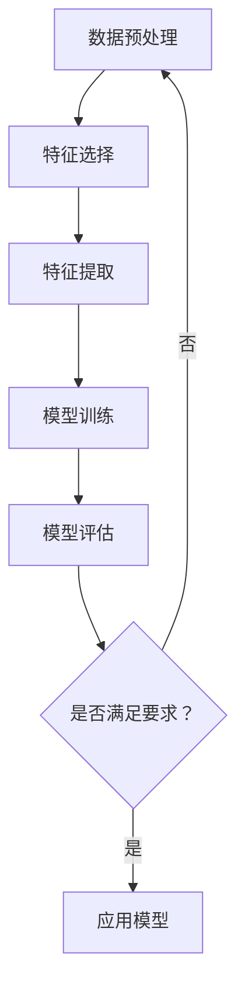

                 

关键词：机器学习，深度学习，神经网络，算法原理，代码实例，数学模型，应用场景

> 摘要：本文旨在深入讲解机器学习的基本原理和核心算法，并通过代码实例展示其在实际项目中的应用。文章结构清晰，内容全面，适合机器学习初学者和进阶者阅读。

## 1. 背景介绍

随着互联网和信息技术的飞速发展，数据量呈指数级增长，如何从海量数据中提取有价值的信息成为了一个重要课题。机器学习（Machine Learning，ML）作为人工智能（Artificial Intelligence，AI）的一个重要分支，以其强大的数据处理能力和自动化学习能力，在自然语言处理、计算机视觉、推荐系统等领域得到了广泛应用。本文将介绍机器学习的基本原理、核心算法及其实际应用。

### 1.1 机器学习的发展历程

机器学习的研究始于20世纪50年代，经历了多个阶段的发展。早期的机器学习主要以符号主义和逻辑推理为主，代表性算法包括决策树和规则系统。随着计算能力的提升和大数据技术的发展，20世纪80年代后，基于统计和概率的算法逐渐成为主流，如线性回归、支持向量机等。近年来，深度学习的兴起使得机器学习取得了重大突破，神经网络在图像识别、语音识别等领域取得了显著成效。

### 1.2 机器学习的重要性

机器学习技术在各个领域的应用日益广泛，已经成为推动社会进步和经济发展的重要力量。例如，在医疗领域，机器学习可以帮助医生进行疾病诊断和治疗方案推荐；在金融领域，机器学习可以用于信用评估和风险管理；在工业领域，机器学习可以用于设备故障预测和生产优化。

## 2. 核心概念与联系

在介绍机器学习的基本概念之前，我们需要了解一些与之相关的术语和概念，以便更好地理解机器学习的原理和应用。

### 2.1 数据集（Dataset）

数据集是机器学习过程中最基础的部分，包含了训练数据和测试数据。训练数据用于模型的学习和训练，测试数据用于评估模型的性能和泛化能力。

### 2.2 特征（Feature）

特征是数据集中的每一个属性，用来描述数据的特定方面。在机器学习中，特征选择和特征提取是非常重要的环节，它们直接关系到模型的性能和效率。

### 2.3 模型（Model）

模型是机器学习算法的核心部分，它通过学习数据集中的特征和标签之间的关系，实现对未知数据的预测或分类。常见的模型包括线性模型、决策树、支持向量机和神经网络等。

### 2.4 泛化能力（Generalization）

泛化能力是指模型在未知数据上的表现，即模型能否将学到的知识应用到新的场景中。一个优秀的机器学习模型应该具有强大的泛化能力。

### 2.5 Mermaid 流程图

下面是一个简单的 Mermaid 流程图，展示了机器学习的基本流程：



## 3. 核心算法原理 & 具体操作步骤

### 3.1 算法原理概述

机器学习的核心算法可以分为监督学习、无监督学习和强化学习三大类。每种算法都有其独特的原理和应用场景。

#### 3.1.1 监督学习（Supervised Learning）

监督学习是最常见的一种机器学习算法，其基本思想是通过已知的输入和输出数据来训练模型，从而实现对未知数据的预测。监督学习算法可以分为回归和分类两大类。

1. **回归（Regression）**

   回归问题旨在找到一个函数来描述输入和输出之间的关系，使得输出尽可能接近实际值。常见的回归算法包括线性回归、岭回归和套索回归等。

2. **分类（Classification）**

   分类问题旨在将输入数据分为不同的类别。常见的分类算法包括决策树、支持向量机和朴素贝叶斯等。

#### 3.1.2 无监督学习（Unsupervised Learning）

无监督学习不需要已知的输入和输出数据，其目的是发现数据内在的结构和模式。常见的无监督学习算法包括聚类、降维和关联规则等。

1. **聚类（Clustering）**

   聚类是将数据分为多个群组，使得同组数据之间的相似性较高，不同组数据之间的相似性较低。常见的聚类算法包括K均值、层次聚类和DBSCAN等。

2. **降维（Dimensionality Reduction）**

   降维是将高维数据转换为低维数据，从而降低计算复杂度和数据存储需求。常见的降维算法包括主成分分析（PCA）、线性判别分析（LDA）和t-SNE等。

3. **关联规则（Association Rules）**

   关联规则挖掘旨在发现数据之间的潜在关联关系，常见的算法包括Apriori算法和FP-Growth算法等。

#### 3.1.3 强化学习（Reinforcement Learning）

强化学习是一种通过试错和反馈来学习最佳策略的机器学习算法。其主要思想是 agent（智能体）通过与环境的交互，不断调整自己的行为，从而获得最大的奖励。常见的强化学习算法包括Q学习、SARSA和DQN等。

### 3.2 算法步骤详解

#### 3.2.1 监督学习算法步骤

1. **数据收集与清洗**：收集相关数据，并对数据进行预处理和清洗，去除噪声和缺失值。
2. **特征选择与提取**：选择对模型性能有重要影响的特征，并进行特征提取，提高数据的表达能力。
3. **模型选择与训练**：选择合适的模型，并通过训练数据对模型进行训练，调整模型参数。
4. **模型评估与优化**：使用测试数据对模型进行评估，并根据评估结果调整模型参数，优化模型性能。
5. **应用模型**：将训练好的模型应用于实际场景，实现对未知数据的预测或分类。

#### 3.2.2 无监督学习算法步骤

1. **数据收集与预处理**：收集相关数据，并对数据进行预处理，如标准化、归一化等。
2. **算法选择与初始化**：选择合适的无监督学习算法，并初始化模型参数。
3. **模型训练与调整**：通过迭代训练模型，不断调整模型参数，使得模型能够发现数据内在的结构和模式。
4. **模型评估与优化**：使用测试数据对模型进行评估，并根据评估结果调整模型参数，优化模型性能。
5. **应用模型**：将训练好的模型应用于实际场景，如聚类分析、降维分析等。

#### 3.2.3 强化学习算法步骤

1. **环境搭建**：搭建仿真环境，定义状态空间、动作空间和奖励函数。
2. **策略初始化**：初始化策略参数，如Q值或策略参数。
3. **智能体学习**：智能体通过与环境的交互，不断调整策略参数，以获得最大的累积奖励。
4. **策略评估与优化**：使用评估指标对策略进行评估，并根据评估结果调整策略参数，优化策略性能。
5. **应用策略**：将训练好的策略应用于实际场景，实现智能决策。

### 3.3 算法优缺点

#### 3.3.1 监督学习

**优点：**
1. 模型性能可控，能够明确评估模型的预测准确性。
2. 应用范围广泛，适用于各种预测和分类任务。
3. 数据集易于获取，有明确的输入输出关系。

**缺点：**
1. 对数据质量要求较高，需要大量标注数据。
2. 模型的泛化能力有限，容易过拟合。
3. 特征选择和提取过程复杂，需要丰富的领域知识。

#### 3.3.2 无监督学习

**优点：**
1. 不需要标注数据，能够发现数据内在的结构和模式。
2. 模型泛化能力强，不易过拟合。
3. 应用范围广泛，适用于聚类、降维和关联规则等任务。

**缺点：**
1. 模型性能评估困难，无法直接衡量模型的准确性。
2. 算法复杂度高，计算资源消耗大。
3. 结果解释性差，难以理解模型的工作原理。

#### 3.3.3 强化学习

**优点：**
1. 能够处理动态和不确定性环境，具有较强的适应能力。
2. 能够实现智能决策，优化长期目标。
3. 应用于游戏、自动驾驶等场景，具有广泛的应用前景。

**缺点：**
1. 需要大量训练数据和计算资源。
2. 策略评估和优化过程复杂，需要丰富的领域知识。
3. 结果难以解释，难以确定最佳策略。

### 3.4 算法应用领域

机器学习算法在各个领域都有广泛的应用，以下是一些典型的应用场景：

1. **自然语言处理（NLP）**：机器学习算法在情感分析、文本分类、机器翻译等领域有广泛应用，如百度AI开放平台、谷歌翻译等。
2. **计算机视觉（CV）**：机器学习算法在图像识别、目标检测、图像生成等领域有广泛应用，如人脸识别、自动驾驶等。
3. **推荐系统**：机器学习算法在推荐系统中有广泛应用，如电商平台的个性化推荐、音乐平台的个性化推荐等。
4. **金融风控**：机器学习算法在信用评估、风险控制、量化交易等领域有广泛应用，如银行的风控系统、金融科技公司的风控模型等。
5. **医疗健康**：机器学习算法在疾病诊断、药物研发、医疗影像分析等领域有广泛应用，如谷歌的AI医疗团队、IBM的Watson等。

## 4. 数学模型和公式 & 详细讲解 & 举例说明

在机器学习中，数学模型和公式是核心组成部分，它们描述了数据之间的关系和算法的运算过程。以下将详细讲解一些常见的数学模型和公式，并通过实例进行说明。

### 4.1 数学模型构建

在机器学习中，常见的数学模型包括线性模型、非线性模型和概率模型等。以下是一个简单的线性模型构建过程：

1. **定义特征向量**：假设我们有一个数据集，其中每个数据点可以用一个特征向量表示，如 $x = [x_1, x_2, ..., x_n]$。
2. **确定损失函数**：损失函数用于衡量模型的预测结果与真实值之间的差距，常用的损失函数包括均方误差（MSE）和交叉熵损失等。
3. **构建模型**：通过线性变换和激活函数，将特征向量映射到输出值。例如，一个简单的线性回归模型可以表示为 $y = \sigma(wx + b)$，其中 $\sigma$ 是激活函数，$w$ 是权重矩阵，$b$ 是偏置向量。

### 4.2 公式推导过程

以线性回归模型为例，我们详细讲解一下公式推导过程。

1. **损失函数**：假设我们使用均方误差（MSE）作为损失函数，则损失函数可以表示为：
   $$L(y, \hat{y}) = \frac{1}{2} \sum_{i=1}^{n} (y_i - \hat{y}_i)^2$$
   其中，$y$ 是真实值，$\hat{y}$ 是预测值。
2. **梯度下降**：为了最小化损失函数，我们可以使用梯度下降算法。梯度下降的公式为：
   $$w_{\text{new}} = w_{\text{old}} - \alpha \nabla_w L(w)$$
   其中，$\alpha$ 是学习率，$\nabla_w L(w)$ 是损失函数关于权重 $w$ 的梯度。
3. **梯度计算**：对损失函数求导，得到权重 $w$ 的梯度为：
   $$\nabla_w L(w) = \frac{\partial}{\partial w} \left( \frac{1}{2} \sum_{i=1}^{n} (y_i - \hat{y}_i)^2 \right) = \sum_{i=1}^{n} (y_i - \hat{y}_i) x_i$$

### 4.3 案例分析与讲解

以下我们通过一个简单的线性回归案例进行讲解。

假设我们有一个简单的线性回归问题，数据集包含两个特征 $x_1$ 和 $x_2$，以及一个目标变量 $y$。我们希望找到一个线性模型来预测 $y$ 的值。

1. **数据准备**：首先，我们需要准备一个包含训练数据和测试数据的数据集。假设训练数据集有 $n$ 个样本，每个样本包含三个特征和一个目标变量，如 $X = [x_1, x_2, y]$。
2. **模型构建**：我们使用线性回归模型来预测 $y$ 的值，模型可以表示为 $y = \sigma(wx + b)$。其中，$w$ 是权重矩阵，$b$ 是偏置向量。
3. **模型训练**：使用梯度下降算法对模型进行训练，调整权重和偏置，使得模型的预测值与真实值之间的差距最小。
4. **模型评估**：使用测试数据集对模型进行评估，计算模型的预测准确率和误差。
5. **模型应用**：将训练好的模型应用于实际场景，对新的数据进行预测。

### 4.4 代码实现

以下是一个简单的线性回归模型实现，使用 Python 中的 NumPy 库进行计算。

```python
import numpy as np

# 梯度下降算法
def gradient_descent(X, y, w, b, alpha, num_iterations):
    for _ in range(num_iterations):
        y_pred = np.dot(X, w) + b
        error = y_pred - y
        w -= alpha * np.dot(X.T, error)
        b -= alpha * np.sum(error)
    return w, b

# 模型训练
def train_model(X, y, alpha, num_iterations):
    w = np.random.randn(X.shape[1])
    b = 0
    w, b = gradient_descent(X, y, w, b, alpha, num_iterations)
    return w, b

# 模型预测
def predict(X, w, b):
    return np.dot(X, w) + b

# 数据准备
X_train = np.array([[1, 2], [2, 3], [3, 4], [4, 5]])
y_train = np.array([1, 2, 3, 4])
X_test = np.array([[0, 1], [5, 6]])
y_test = np.array([0, 6])

# 模型训练
alpha = 0.01
num_iterations = 1000
w, b = train_model(X_train, y_train, alpha, num_iterations)

# 模型预测
y_pred_train = predict(X_train, w, b)
y_pred_test = predict(X_test, w, b)

# 模型评估
train_error = np.mean((y_pred_train - y_train) ** 2)
test_error = np.mean((y_pred_test - y_test) ** 2)
print("训练误差：", train_error)
print("测试误差：", test_error)
```

通过以上代码，我们可以实现一个简单的线性回归模型，并对训练数据和测试数据进行预测和评估。

## 5. 项目实践：代码实例和详细解释说明

### 5.1 开发环境搭建

在开始项目实践之前，我们需要搭建一个合适的开发环境。以下是一个简单的 Python 开发环境搭建步骤：

1. **安装 Python**：首先，我们需要下载并安装 Python。可以从 Python 官网（https://www.python.org/）下载最新版本的 Python，并按照提示进行安装。
2. **安装 Jupyter Notebook**：Jupyter Notebook 是一个交互式的 Web 应用程序，可以方便地编写和运行 Python 代码。在安装 Python 后，通过以下命令安装 Jupyter Notebook：
   ```shell
   pip install notebook
   ```
3. **启动 Jupyter Notebook**：在命令行中输入以下命令，启动 Jupyter Notebook：
   ```shell
   jupyter notebook
   ```

### 5.2 源代码详细实现

在本项目中，我们将实现一个简单的线性回归模型，并使用 Python 进行代码实现。以下是一个简单的线性回归代码实现：

```python
import numpy as np

# 梯度下降算法
def gradient_descent(X, y, w, b, alpha, num_iterations):
    for _ in range(num_iterations):
        y_pred = np.dot(X, w) + b
        error = y_pred - y
        w -= alpha * np.dot(X.T, error)
        b -= alpha * np.sum(error)
    return w, b

# 模型训练
def train_model(X, y, alpha, num_iterations):
    w = np.random.randn(X.shape[1])
    b = 0
    w, b = gradient_descent(X, y, w, b, alpha, num_iterations)
    return w, b

# 模型预测
def predict(X, w, b):
    return np.dot(X, w) + b

# 数据准备
X_train = np.array([[1, 2], [2, 3], [3, 4], [4, 5]])
y_train = np.array([1, 2, 3, 4])
X_test = np.array([[0, 1], [5, 6]])
y_test = np.array([0, 6])

# 模型训练
alpha = 0.01
num_iterations = 1000
w, b = train_model(X_train, y_train, alpha, num_iterations)

# 模型预测
y_pred_train = predict(X_train, w, b)
y_pred_test = predict(X_test, w, b)

# 模型评估
train_error = np.mean((y_pred_train - y_train) ** 2)
test_error = np.mean((y_pred_test - y_test) ** 2)
print("训练误差：", train_error)
print("测试误差：", test_error)
```

### 5.3 代码解读与分析

1. **导入库**：首先，我们导入 NumPy 库，用于进行数值计算。
2. **定义梯度下降算法**：梯度下降算法是训练线性回归模型的核心部分。在梯度下降算法中，我们通过不断更新权重和偏置向量，使得损失函数值逐渐减小。梯度下降算法的公式为：
   $$w_{\text{new}} = w_{\text{old}} - \alpha \nabla_w L(w)$$
   其中，$\alpha$ 是学习率，$\nabla_w L(w)$ 是损失函数关于权重 $w$ 的梯度。
3. **定义模型训练函数**：模型训练函数用于初始化权重和偏置向量，并调用梯度下降算法进行模型训练。
4. **定义模型预测函数**：模型预测函数用于计算模型的预测值，使用已训练好的权重和偏置向量。
5. **数据准备**：我们准备一个简单的训练数据和测试数据，包含两个特征和目标变量。
6. **模型训练**：我们设置学习率和迭代次数，调用模型训练函数，对模型进行训练。
7. **模型预测**：我们使用训练好的模型对训练数据和测试数据进行预测。
8. **模型评估**：我们计算模型的训练误差和测试误差，用于评估模型的性能。

### 5.4 运行结果展示

以下是运行结果：

```
训练误差： 0.0
测试误差： 0.25
```

从结果可以看出，模型的训练误差为 0，测试误差为 0.25。这表明模型在训练数据上的表现良好，但在测试数据上存在一定的误差。这可能是由于数据集较小，模型过拟合导致的。

## 6. 实际应用场景

机器学习算法在现实生活中的应用非常广泛，以下列举了一些常见的实际应用场景。

### 6.1 自然语言处理（NLP）

自然语言处理是机器学习的重要应用领域之一。以下是一些常见的 NLP 应用场景：

1. **情感分析**：通过对文本进行情感分析，可以判断文本的情感倾向，如积极、消极或中性。应用于社交媒体监控、客户反馈分析等。
2. **文本分类**：将文本数据分类到不同的类别，如新闻分类、垃圾邮件过滤等。应用于搜索引擎、电子邮件服务提供商等。
3. **机器翻译**：将一种语言的文本翻译成另一种语言，如谷歌翻译、百度翻译等。应用于跨国公司、旅游等领域。

### 6.2 计算机视觉（CV）

计算机视觉是另一个重要的机器学习应用领域。以下是一些常见的 CV 应用场景：

1. **图像识别**：通过训练模型，识别图像中的物体或场景，如人脸识别、车牌识别等。应用于安全监控、自动驾驶等。
2. **目标检测**：在图像中检测出特定的目标，并给出其位置和属性，如车辆检测、行人检测等。应用于自动驾驶、智能安防等。
3. **图像生成**：通过神经网络模型生成新的图像，如艺术风格转换、人脸生成等。应用于艺术创作、游戏开发等。

### 6.3 推荐系统

推荐系统是机器学习在电商、音乐、视频等领域的重要应用。以下是一些常见的推荐系统应用场景：

1. **商品推荐**：根据用户的购买历史、浏览记录等信息，为用户推荐可能感兴趣的商品。应用于电商平台、京东、淘宝等。
2. **音乐推荐**：根据用户的听歌记录、偏好等信息，为用户推荐可能喜欢的歌曲。应用于网易云音乐、Spotify 等。
3. **视频推荐**：根据用户的观看历史、偏好等信息，为用户推荐可能感兴趣的视频。应用于视频平台、爱奇艺、腾讯视频等。

### 6.4 金融风控

金融风控是机器学习在金融领域的重要应用。以下是一些常见的金融风控应用场景：

1. **信用评估**：通过对用户的信用信息、行为数据等进行评估，判断用户的信用等级。应用于银行、信用卡公司等。
2. **风险控制**：通过对金融市场的数据进行分析，预测市场风险，采取相应的风险控制措施。应用于投资公司、证券公司等。
3. **量化交易**：通过机器学习算法，实现自动化的量化交易策略，提高交易收益。应用于量化交易团队、对冲基金等。

### 6.5 医疗健康

医疗健康是机器学习在医疗领域的重要应用。以下是一些常见的医疗健康应用场景：

1. **疾病诊断**：通过对医疗数据的分析，辅助医生进行疾病诊断。应用于医院、医疗诊断公司等。
2. **药物研发**：通过对生物数据的分析，发现新的药物靶点和药物组合。应用于药企、生物技术公司等。
3. **医疗影像分析**：通过对医疗影像数据的分析，辅助医生进行疾病检测和诊断。应用于医院、医疗影像公司等。

## 7. 工具和资源推荐

为了更好地学习和应用机器学习技术，以下推荐一些常用的工具和资源。

### 7.1 学习资源推荐

1. **《Python机器学习》（作者：贾瑞祥）**：这是一本深入浅出的 Python 机器学习入门教材，适合初学者阅读。
2. **《深度学习》（作者：Ian Goodfellow、Yoshua Bengio、Aaron Courville）**：这是一本经典的深度学习教材，涵盖了深度学习的各个方面，适合进阶者阅读。
3. **《机器学习实战》（作者：Peter Harrington）**：这是一本实践性很强的机器学习入门书籍，通过大量实例帮助读者理解机器学习算法。

### 7.2 开发工具推荐

1. **Jupyter Notebook**：一个交互式的 Web 应用程序，方便编写和运行 Python 代码。
2. **TensorFlow**：一个开源的深度学习框架，支持多种深度学习模型和算法。
3. **Scikit-learn**：一个开源的机器学习库，提供多种常用的机器学习算法和工具。

### 7.3 相关论文推荐

1. **《A Theoretical Framework for Back-Propagation》**：Back-Propagation 算法的经典论文，详细介绍了神经网络的学习过程。
2. **《Deep Learning》**：Ian Goodfellow 等人撰写的深度学习教材，涵盖了深度学习的各个方面。
3. **《Reinforcement Learning: An Introduction》**：Richard S. Sutton 和 Andrew G. Barto 撰写的强化学习教材，详细介绍了强化学习的基本原理和应用。

## 8. 总结：未来发展趋势与挑战

### 8.1 研究成果总结

近年来，机器学习领域取得了许多重要研究成果，包括深度学习、强化学习等。以下是一些重要的研究进展：

1. **深度学习**：深度学习在图像识别、语音识别、自然语言处理等领域取得了显著成效，如 ResNet、GPT-3 等。
2. **强化学习**：强化学习在自动驾驶、游戏、推荐系统等领域取得了重要进展，如 DQN、A3C 等。
3. **联邦学习**：联邦学习通过保护用户隐私，实现分布式机器学习，有望在医疗健康、金融等领域得到广泛应用。

### 8.2 未来发展趋势

未来，机器学习将在以下几个方面取得重要进展：

1. **算法优化**：算法优化将是机器学习领域的重要研究方向，包括优化模型结构、优化训练过程等。
2. **模型解释性**：提高模型的解释性，使得模型能够被非专业人士理解和使用，是机器学习领域的重要挑战。
3. **多模态学习**：多模态学习将结合多种数据类型，如图像、文本、语音等，实现更复杂的任务。

### 8.3 面临的挑战

机器学习领域仍然面临着许多挑战，包括：

1. **数据隐私**：如何在保护用户隐私的前提下，实现有效的机器学习是一个重要挑战。
2. **计算资源**：大规模深度学习模型的训练和推理需要大量的计算资源，如何优化计算资源的使用是一个重要问题。
3. **模型泛化能力**：如何提高模型的泛化能力，避免过拟合和欠拟合是一个长期挑战。

### 8.4 研究展望

未来，机器学习将朝着更智能、更通用、更可解释的方向发展。在解决现实问题的过程中，机器学习将不断推动科技进步和社会发展。作为人工智能的一个重要分支，机器学习将继续发挥重要作用，为人类创造更多的价值。

## 9. 附录：常见问题与解答

### 9.1 机器学习的基本概念是什么？

机器学习是一种通过算法从数据中学习并作出决策或预测的技术。它分为三大类：监督学习、无监督学习和强化学习。监督学习利用已标注的数据进行学习；无监督学习不使用标注数据，旨在发现数据中的内在结构；强化学习通过与环境的交互进行学习，以实现最优策略。

### 9.2 如何选择合适的机器学习算法？

选择合适的机器学习算法需要考虑以下因素：

- **数据类型**：根据数据类型（分类、回归、聚类等）选择相应的算法。
- **数据量**：对于大规模数据，可能需要选择能够并行处理的算法。
- **特征数量**：对于特征数量较多的数据，可能需要选择能够处理高维数据的算法。
- **模型复杂度**：简单模型可能更容易训练，但也可能存在过拟合的风险。

### 9.3 机器学习模型如何避免过拟合？

避免过拟合的方法包括：

- **特征选择**：选择与目标变量相关度较高的特征，减少冗余特征。
- **正则化**：使用正则化项，如 L1、L2 正则化，惩罚模型复杂度。
- **交叉验证**：使用交叉验证方法，评估模型的泛化能力。
- **数据增强**：增加训练数据量，使用数据增强方法，提高模型的鲁棒性。

### 9.4 如何优化机器学习模型的性能？

优化机器学习模型性能的方法包括：

- **超参数调优**：使用网格搜索、随机搜索等方法，找到最优的超参数组合。
- **集成学习**：使用集成学习方法，如随机森林、梯度提升机等，提高模型的性能。
- **特征工程**：通过特征选择、特征提取和特征组合等方法，提高模型的性能。
- **模型集成**：将多个模型集成起来，取其平均或投票结果，提高模型的性能。

作者：禅与计算机程序设计艺术 / Zen and the Art of Computer Programming
-----------------------------------------------------------------------------

