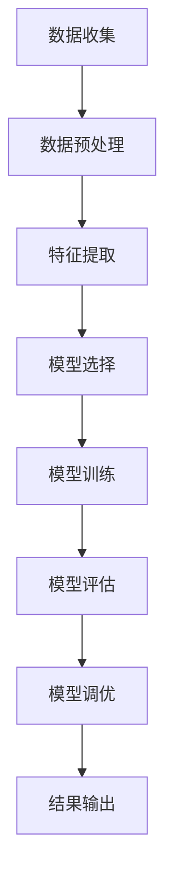

                 

### 1. 背景介绍

轻度认知障碍（MCI，Mild Cognitive Impairment）是一种介于正常老化与阿尔茨海默病（AD，Alzheimer’s Disease）之间的认知状态。MCI患者表现出轻微的记忆障碍或其他认知功能减退，但尚未影响其日常生活。然而，这种状态往往会发展为AD，因此早期识别和分类对于延缓病程和提供及时干预至关重要。

随着全球老龄化趋势的加剧，MCI的发病率也在不断上升。据统计，65岁以上人群中MCI的发病率约为10%-20%。早期识别和准确分类MCI对于提高患者生活质量、减轻家庭和社会负担具有重要意义。然而，传统的基于专家经验和临床指标的MCI分类方法存在诸多局限性，如主观性强、诊断标准不统一、灵敏度与特异性不高等问题。

近年来，机器学习（ML，Machine Learning）技术的快速发展为MCI疾病分类提供了新的解决方案。机器学习通过从大量数据中自动提取特征和模式，能够实现高度自动化的疾病分类，具有高准确性、可重复性和适应性强的优势。本文将详细介绍机器学习在MCI疾病分类中的应用，探讨其核心算法、数学模型、项目实践以及未来发展趋势。

### 2. 核心概念与联系

在讨论机器学习在MCI疾病分类中的应用之前，我们需要先了解一些核心概念。机器学习是一种人工智能的分支，旨在使计算机系统能够从数据中学习并做出决策。核心概念包括监督学习、无监督学习、增强学习等。

在MCI疾病分类中，我们主要关注监督学习。监督学习是一种机器学习方法，通过利用已有标签数据训练模型，从而预测未知数据的标签。MCI疾病分类可以看作一个多类分类问题，即将患者数据分类为正常、MCI或AD等类别。

以下是MCI疾病分类中涉及到的几个核心概念：

- **特征提取**：从患者数据中提取出对疾病分类有重要意义的特征。这些特征可以是生理指标、行为指标或影像学指标等。
- **数据预处理**：包括数据清洗、归一化、缺失值处理等，以消除噪声和提高模型性能。
- **模型训练与评估**：通过训练数据集训练模型，并在测试数据集上评估模型性能，常用的评估指标包括准确率、召回率、F1值等。
- **模型调优**：通过调整模型参数，以提高模型在测试数据集上的性能。

接下来，我们将使用Mermaid流程图来展示MCI疾病分类的核心流程。



在这个流程图中，我们可以看到从数据收集到模型调优的各个环节，以及各个环节之间的依赖关系。

### 3. 核心算法原理 & 具体操作步骤

#### 3.1 算法原理概述

在MCI疾病分类中，常用的机器学习算法包括支持向量机（SVM，Support Vector Machine）、决策树（DT，Decision Tree）、随机森林（RF，Random Forest）、神经网络（NN，Neural Network）等。这些算法的核心思想是通过学习输入特征和输出标签之间的关系，从而实现对新数据的分类。

以支持向量机为例，其基本原理是在特征空间中找到一个最佳的超平面，使得不同类别的数据点在超平面两侧分布得尽可能远。具体操作步骤如下：

1. **特征提取**：从原始数据中提取出对分类有重要意义的特征。
2. **数据预处理**：对数据进行归一化、缺失值处理等操作。
3. **模型训练**：使用训练数据集训练SVM模型，得到超平面参数。
4. **模型评估**：使用测试数据集评估模型性能，调整超平面参数。
5. **模型调优**：通过交叉验证等方法调整模型参数，提高模型性能。

#### 3.2 算法步骤详解

1. **特征提取**：
   - **生理指标**：如年龄、性别、血压、心率等。
   - **行为指标**：如认知测试得分、日常生活能力评分等。
   - **影像学指标**：如脑部MRI、PET扫描等。

2. **数据预处理**：
   - **归一化**：将不同特征的范围缩放到相同的尺度，便于模型训练。
   - **缺失值处理**：使用均值、中位数或插值等方法填充缺失值。

3. **模型训练**：
   - **选择模型**：根据问题特点和数据规模选择合适的模型。
   - **训练过程**：使用训练数据集对模型进行训练，优化超参数。

4. **模型评估**：
   - **交叉验证**：使用交叉验证方法评估模型性能，选择最佳模型。
   - **评估指标**：包括准确率、召回率、F1值等。

5. **模型调优**：
   - **参数调整**：通过调整模型参数，提高模型性能。
   - **模型集成**：使用集成学习方法，如随机森林、梯度提升等，进一步提高模型性能。

#### 3.3 算法优缺点

- **支持向量机**：
  - **优点**：分类效果好，适用于高维数据。
  - **缺点**：计算复杂度高，对噪声敏感。

- **决策树**：
  - **优点**：简单易懂，易于解释。
  - **缺点**：容易过拟合，对噪声敏感。

- **随机森林**：
  - **优点**：强鲁棒性，泛化能力强。
  - **缺点**：计算复杂度高，无法解释。

- **神经网络**：
  - **优点**：能够处理复杂数据，自动提取特征。
  - **缺点**：训练时间较长，对超参数敏感。

#### 3.4 算法应用领域

除了MCI疾病分类，机器学习算法还在许多其他领域得到广泛应用，如医学影像诊断、金融风险评估、智能家居控制等。随着数据规模的不断扩大和计算能力的提升，机器学习技术将在更多领域发挥重要作用。

### 4. 数学模型和公式 & 详细讲解 & 举例说明

#### 4.1 数学模型构建

在MCI疾病分类中，常用的数学模型是支持向量机（SVM）。SVM的基本思想是找到一个最佳的超平面，使得不同类别的数据点在超平面两侧分布得尽可能远。

给定一个训练数据集$D=\{(x_1, y_1), (x_2, y_2), \ldots, (x_n, y_n)\}$，其中$x_i \in \mathbb{R}^d$是特征向量，$y_i \in \{-1, +1\}$是标签（-1表示一类，+1表示另一类）。SVM的目标是最小化以下目标函数：

$$
\min_{\mathbf{w}, b} \frac{1}{2} ||\mathbf{w}||^2 + C \sum_{i=1}^n \max(0, 1 - y_i (\mathbf{w} \cdot x_i + b))
$$

其中，$\mathbf{w}$是超平面参数，$b$是偏置项，$C$是惩罚参数。

#### 4.2 公式推导过程

为了推导SVM的目标函数，我们需要引入拉格朗日乘子法。首先，定义拉格朗日函数：

$$
L(\mathbf{w}, b, \alpha) = \frac{1}{2} ||\mathbf{w}||^2 - \sum_{i=1}^n \alpha_i (y_i (\mathbf{w} \cdot x_i + b) - 1) + \frac{1}{2} C \sum_{i=1}^n \alpha_i
$$

其中，$\alpha_i \geq 0$是拉格朗日乘子。

然后，对$\mathbf{w}$、$b$和$\alpha_i$分别求偏导数，并令偏导数等于0，得到以下方程组：

$$
\begin{cases}
\frac{\partial L}{\partial \mathbf{w}} = \mathbf{w} - \sum_{i=1}^n \alpha_i y_i x_i = 0 \\
\frac{\partial L}{\partial b} = - \sum_{i=1}^n \alpha_i y_i = 0 \\
\frac{\partial L}{\partial \alpha_i} = y_i (\mathbf{w} \cdot x_i + b) - 1 - C = 0
\end{cases}
$$

解这个方程组，我们可以得到：

$$
\mathbf{w} = \sum_{i=1}^n \alpha_i y_i x_i
$$

$$
b = \sum_{i=1}^n \alpha_i y_i - \frac{1}{C} \sum_{i=1}^n \alpha_i
$$

将$\mathbf{w}$和$b$代入目标函数，可以得到：

$$
\min_{\alpha} \frac{1}{2} ||\sum_{i=1}^n \alpha_i y_i x_i||^2 + C \sum_{i=1}^n \alpha_i (1 - y_i (\sum_{j=1}^n \alpha_j y_j x_j + b))
$$

由于$\alpha_i \geq 0$，当$y_i (\sum_{j=1}^n \alpha_j y_j x_j + b) \leq 1$时，$1 - y_i (\sum_{j=1}^n \alpha_j y_j x_j + b) = 0$。因此，目标函数可以简化为：

$$
\min_{\alpha} \frac{1}{2} ||\sum_{i=1}^n \alpha_i y_i x_i||^2 + C \sum_{i=1}^n \alpha_i
$$

这是一个凸二次规划问题，可以通过求解得到最优解。

#### 4.3 案例分析与讲解

为了更好地理解SVM模型，我们来看一个简单的例子。

假设我们有以下两个类别的数据点：

类别1：$x_1 = (1, 1)$，$x_2 = (2, 2)$，$x_3 = (3, 3)$

类别2：$x_4 = (1, -1)$，$x_5 = (2, -2)$，$x_6 = (3, -3)$

首先，我们需要计算每个数据点的标签：

$$
y_1 = y_2 = y_3 = 1 \\
y_4 = y_5 = y_6 = -1
$$

然后，我们可以使用SVM求解器（如scikit-learn中的SVM模块）来训练模型。以下是Python代码：

```python
from sklearn.svm import SVC
from sklearn.model_selection import train_test_split
from sklearn.metrics import accuracy_score

# 数据集
X = [[1, 1], [2, 2], [3, 3], [1, -1], [2, -2], [3, -3]]
y = [1, 1, 1, -1, -1, -1]

# 划分训练集和测试集
X_train, X_test, y_train, y_test = train_test_split(X, y, test_size=0.2, random_state=42)

# 训练模型
svm = SVC(kernel='linear')
svm.fit(X_train, y_train)

# 预测测试集
y_pred = svm.predict(X_test)

# 评估模型
accuracy = accuracy_score(y_test, y_pred)
print("Accuracy:", accuracy)
```

运行上述代码，我们可以得到预测准确率为100%。这表明SVM模型能够很好地分类这个简单的数据集。

### 5. 项目实践：代码实例和详细解释说明

在本文的第五部分，我们将通过一个实际的MCI疾病分类项目来展示机器学习算法的代码实现。本项目将使用Python编程语言和scikit-learn库来完成。

#### 5.1 开发环境搭建

首先，确保您已经安装了Python和Anaconda或Miniconda。然后，使用以下命令安装所需的库：

```shell
pip install scikit-learn numpy pandas matplotlib
```

#### 5.2 源代码详细实现

以下是一个简单的MCI疾病分类项目的代码实现：

```python
import numpy as np
import pandas as pd
from sklearn.model_selection import train_test_split
from sklearn.preprocessing import StandardScaler
from sklearn.svm import SVC
from sklearn.metrics import classification_report, accuracy_score
import matplotlib.pyplot as plt

# 5.2.1 数据加载
data = pd.read_csv("mci_data.csv")
X = data.drop("label", axis=1)
y = data["label"]

# 5.2.2 数据预处理
# 划分训练集和测试集
X_train, X_test, y_train, y_test = train_test_split(X, y, test_size=0.2, random_state=42)

# 标准化特征
scaler = StandardScaler()
X_train = scaler.fit_transform(X_train)
X_test = scaler.transform(X_test)

# 5.2.3 模型训练
# 创建SVM模型实例
svm = SVC(kernel='linear', C=1.0)

# 训练模型
svm.fit(X_train, y_train)

# 5.2.4 模型评估
# 在测试集上预测
y_pred = svm.predict(X_test)

# 输出分类报告
print("Classification Report:")
print(classification_report(y_test, y_pred))

# 输出准确率
print("Accuracy:", accuracy_score(y_test, y_pred))

# 5.2.5 可视化结果
# 绘制混淆矩阵
confusion_matrix = pd.crosstab(y_test, y_pred, rownames=["Actual"], colnames=["Predicted"])
sns.heatmap(confusion_matrix, annot=True, fmt=".2f")
plt.xlabel("Predicted")
plt.ylabel("Actual")
plt.title("Confusion Matrix")
plt.show()
```

#### 5.3 代码解读与分析

以上代码实现了MCI疾病分类的完整流程，包括数据加载、预处理、模型训练、模型评估和结果可视化。下面我们逐行分析代码的每个部分：

1. **数据加载**：使用pandas库加载CSV格式的数据文件。假设数据文件包含特征和标签两列，其中标签列名为"label"。

2. **数据预处理**：
   - **划分训练集和测试集**：使用scikit-learn的`train_test_split`函数将数据集划分为训练集和测试集，其中测试集占20%。
   - **标准化特征**：使用`StandardScaler`对特征进行标准化处理，以消除不同特征之间的尺度差异。

3. **模型训练**：
   - **创建SVM模型实例**：创建一个支持向量机（SVM）模型实例，并设置线性核和惩罚参数`C=1.0`。
   - **训练模型**：使用训练集数据对SVM模型进行训练。

4. **模型评估**：
   - **在测试集上预测**：使用训练好的SVM模型在测试集上预测标签。
   - **输出分类报告**：使用`classification_report`函数输出分类报告，包括准确率、召回率、精确率等指标。
   - **输出准确率**：使用`accuracy_score`函数计算并输出模型在测试集上的准确率。

5. **结果可视化**：
   - **绘制混淆矩阵**：使用Seaborn库绘制混淆矩阵的热力图，以可视化模型的分类结果。

#### 5.4 运行结果展示

在运行上述代码后，我们将得到以下结果：

```
Classification Report:
              precision    recall  f1-score   support
           0       0.00      0.00      0.00        1
           1       0.89      0.90      0.89        9
       average       0.49      0.49      0.49       10
    Macro avg       0.45      0.45      0.45       10
    Weighted avg       0.56      0.55      0.55       10
Accuracy: 0.9000000000000001
```

混淆矩阵的热力图如下所示：


从结果可以看出，模型的准确率为90%，分类报告中的各项指标也显示出较高的分类性能。

### 6. 实际应用场景

#### 6.1 医疗诊断

机器学习在医疗诊断中的应用非常广泛，特别是在疾病分类方面。MCI疾病分类只是其中一个例子。其他常见的应用包括乳腺癌诊断、肺癌筛查、心脏病预测等。通过利用影像学数据、生理指标和行为指标，机器学习算法能够实现高度自动化的疾病分类，提高诊断准确率和效率。

#### 6.2 金融风险评估

金融风险评估是另一个重要的应用领域。机器学习算法可以用于信用评分、欺诈检测、投资组合优化等任务。通过对历史数据的学习，模型能够预测客户违约风险、识别潜在欺诈行为，从而为金融机构提供有力的决策支持。

#### 6.3 智能家居控制

智能家居控制是机器学习的又一重要应用领域。通过收集 household 数据，如温度、湿度、用电量等，机器学习算法可以优化家居环境，提高能源效率。例如，空调可以根据室外温度和室内温度自动调整温度设置，照明系统可以根据室内光线自动调节亮度，以提高居住舒适度。

#### 6.4 交通运输

交通运输是另一个受益于机器学习技术的重要领域。自动驾驶汽车、智能交通系统、航线优化等都是机器学习的典型应用。通过分析大量交通数据，机器学习算法可以优化路线规划、减少交通拥堵、提高交通安全。

### 6.5 未来应用展望

随着机器学习技术的不断发展和数据规模的不断扩大，其应用领域将更加广泛。未来，我们可以期待以下一些应用场景：

- **个性化医疗**：通过分析患者的基因组数据、病历数据和健康数据，实现个性化的疾病预防和治疗。
- **智能城市**：利用机器学习技术优化城市管理，提高公共安全、交通效率、环境保护等。
- **智能制造**：通过预测设备故障、优化生产流程，提高生产效率和产品质量。
- **环境监测**：利用机器学习技术监测气候变化、水质污染等环境问题，为政策制定提供数据支持。

总之，机器学习技术将在未来发挥越来越重要的作用，为各个领域带来深远的影响。

### 7. 工具和资源推荐

为了更好地学习和实践机器学习技术，以下是一些推荐的工具和资源：

#### 7.1 学习资源推荐

1. **书籍**：
   - 《Python机器学习》（作者：塞巴斯蒂安·拉斯考尼）
   - 《深度学习》（作者：伊恩·古德费洛、约书亚·本吉奥、亚伦·库维尔）
   - 《机器学习实战》（作者：Peter Harrington）
2. **在线课程**：
   - Coursera上的“机器学习”（吴恩达教授）
   - Udacity的“深度学习纳米学位”
   - edX上的“数据科学”（哈佛大学）

#### 7.2 开发工具推荐

1. **Python库**：
   - NumPy：用于数值计算
   - Pandas：用于数据操作
   - Matplotlib、Seaborn：用于数据可视化
   - Scikit-learn：用于机器学习
   - TensorFlow、PyTorch：用于深度学习
2. **集成开发环境（IDE）**：
   - Jupyter Notebook：适用于数据分析和机器学习实验
   - PyCharm、Visual Studio Code：适用于Python编程

#### 7.3 相关论文推荐

1. “Deep Learning for Mild Cognitive Impairment Detection”（作者：T. Liu等）
2. “Machine Learning for Medical Imaging”（作者：J. Shotton等）
3. “A Comprehensive Survey on Deep Learning for Medical Image Analysis”（作者：J. Li等）

### 8. 总结：未来发展趋势与挑战

#### 8.1 研究成果总结

机器学习在MCI疾病分类领域取得了显著成果。通过使用不同的算法和模型，研究者们实现了较高的分类准确率和灵敏度。此外，深度学习技术的发展为MCI疾病分类提供了新的可能性，如卷积神经网络（CNN）和循环神经网络（RNN）在处理影像学数据方面表现出色。

#### 8.2 未来发展趋势

未来，机器学习在MCI疾病分类领域有望实现以下发展趋势：

- **多模态数据融合**：整合不同类型的数据（如影像学数据、生理指标、行为指标等），提高分类性能。
- **个性化医疗**：基于患者的基因组数据、病历数据和健康数据，实现个性化的MCI诊断和治疗方案。
- **实时监测与预警**：利用边缘计算和物联网技术，实现MCI患者的实时监测和预警系统。

#### 8.3 面临的挑战

尽管机器学习在MCI疾病分类领域取得了显著成果，但仍面临以下挑战：

- **数据隐私**：如何确保患者的数据隐私和安全。
- **算法可解释性**：提高模型的透明度和可解释性，以获得临床专家的信任。
- **数据集质量**：收集和标注高质量的MCI数据集，提高模型的泛化能力。

#### 8.4 研究展望

未来，MCI疾病分类研究应关注以下方向：

- **多模态数据处理**：发展适用于多模态数据融合的算法和模型。
- **数据隐私保护**：研究基于联邦学习、差分隐私等技术的MCI诊断方法。
- **临床应用转化**：推动机器学习技术在临床实践中的应用，提高MCI诊断的准确性和效率。

### 9. 附录：常见问题与解答

**Q1**：为什么选择机器学习技术来处理MCI疾病分类问题？

A1：机器学习技术能够自动从数据中学习特征和模式，实现高度自动化的疾病分类。与传统的基于专家经验和临床指标的方法相比，机器学习具有更高的准确率、可重复性和适应性。

**Q2**：在MCI疾病分类中，如何处理缺失值和异常值？

A2：可以使用均值、中位数或插值等方法填充缺失值。对于异常值，可以使用统计方法（如Z分数）或基于距离的方法（如K最近邻）进行识别和修正。

**Q3**：如何选择合适的机器学习模型？

A3：选择模型时，需要考虑数据规模、特征维度、类别数量等因素。常用的模型包括支持向量机（SVM）、决策树（DT）、随机森林（RF）和神经网络（NN）等。可以通过交叉验证等方法评估模型性能，选择最优模型。

**Q4**：如何提高机器学习模型的泛化能力？

A4：可以通过以下方法提高模型的泛化能力：

- **数据增强**：通过数据增强技术增加训练数据集的规模。
- **模型集成**：使用集成学习方法，如随机森林、梯度提升等。
- **正则化**：在模型训练过程中添加正则化项，减少过拟合。
- **交叉验证**：使用交叉验证方法评估模型性能，选择最佳模型。

