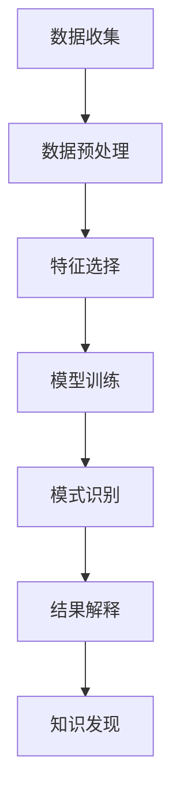

                 

关键词：知识发现、机器学习、数据分析、数据挖掘、人工智能

## 摘要

本文旨在探讨机器学习在知识发现中的应用与角色。随着数据量的激增和复杂性的增加，传统的数据分析方法已经难以应对。机器学习作为一种强大的数据分析工具，通过自动识别数据中的模式与规律，为知识发现提供了新的可能性。本文首先介绍了知识发现的背景和重要性，然后详细阐述了机器学习的基本原理，以及其在知识发现中的具体应用和优势。此外，文章还探讨了机器学习在知识发现中所面临的挑战和未来的发展方向。通过本文的阅读，读者可以全面了解机器学习在知识发现领域的重要作用。

## 1. 背景介绍

### 1.1 知识发现的背景

知识发现（Knowledge Discovery in Databases，KDD）是一个跨学科的研究领域，涉及计算机科学、统计学、机器学习和数据库等多个领域。知识发现的目的是从大量的数据中自动地识别出潜在的有价值的模式和知识，从而辅助人类进行决策和问题求解。随着互联网和物联网技术的飞速发展，数据量呈现出爆炸性增长，传统的数据分析方法已经难以应对这种复杂性。知识发现技术作为一种高级数据分析手段，能够从海量数据中挖掘出隐藏的、未知的和潜在的信息，具有重要的应用价值。

### 1.2 知识发现的重要性

知识发现不仅在学术研究中具有重要意义，还在商业、医疗、金融、安全等多个领域有着广泛的应用。例如，在商业领域，通过知识发现技术，企业可以分析消费者行为，发现市场需求，从而制定更加精准的营销策略。在医疗领域，通过分析患者的病历数据，可以识别疾病的风险因素，预测疾病的趋势，为医生提供诊断和治疗依据。在金融领域，通过分析交易数据，可以发现异常交易行为，防范金融风险。在安全领域，通过分析网络流量数据，可以检测网络攻击，保障网络安全。

## 2. 核心概念与联系

### 2.1 机器学习的基本概念

机器学习（Machine Learning，ML）是一门人工智能（Artificial Intelligence，AI）的分支学科，主要研究如何通过计算机程序模拟或实现人类的学习行为，从而让计算机具备自主学习和决策的能力。机器学习可以分为监督学习、无监督学习和半监督学习三种类型。监督学习通过已知的输入和输出数据，训练模型进行预测；无监督学习通过未标记的数据，自动发现数据中的模式和结构；半监督学习则结合了监督学习和无监督学习的特点。

### 2.2 知识发现与机器学习的联系

知识发现和机器学习有着密切的联系。知识发现的过程可以看作是一个机器学习的过程，包括数据预处理、特征选择、模型训练、模式识别和结果解释等步骤。而机器学习则是知识发现的核心技术之一，通过构建和分析模型，从数据中挖掘出潜在的规律和知识。因此，机器学习在知识发现中扮演着重要的角色，是知识发现技术的关键支撑。

### 2.3 Mermaid 流程图

下面是一个描述知识发现与机器学习流程的 Mermaid 流程图：



### 2.4 机器学习在知识发现中的应用

机器学习在知识发现中的应用非常广泛，主要包括以下几个方面：

1. **分类与预测**：通过监督学习算法，对数据进行分类和预测，从而发现数据中的模式和规律。例如，在商业领域，可以预测客户流失率、股票价格等。

2. **聚类与降维**：通过无监督学习算法，对数据进行聚类和降维，从而发现数据中的结构性和关联性。例如，在市场细分中，可以通过聚类算法识别出不同的客户群体。

3. **关联规则挖掘**：通过关联规则挖掘算法，从大量交易数据中发现物品之间的关联关系，例如，超市中的商品组合。

4. **异常检测**：通过构建异常检测模型，识别数据中的异常点和异常行为，例如，在金融领域，可以通过异常检测防范金融欺诈。

### 2.5 机器学习在知识发现中的优势

机器学习在知识发现中具有以下优势：

1. **自动化**：机器学习算法可以自动从数据中学习，无需人工干预。

2. **高效性**：机器学习算法可以处理大规模数据，高效地发现数据中的规律和知识。

3. **灵活性**：机器学习算法可以根据不同的任务和数据类型，选择合适的模型和算法。

4. **可解释性**：虽然机器学习模型往往是黑箱模型，但通过一定的方法，可以解释模型的学习过程和结果，提高模型的透明度和可信度。

## 3. 核心算法原理 & 具体操作步骤

### 3.1 算法原理概述

在知识发现中，常用的机器学习算法包括线性回归、逻辑回归、决策树、支持向量机、神经网络等。这些算法的基本原理是通过训练数据集，学习数据中的规律和模式，然后对新的数据进行预测和分类。

### 3.2 算法步骤详解

1. **数据预处理**：包括数据清洗、数据集成、数据转换和数据归一化等步骤，将原始数据转换为适合机器学习算法的形式。

2. **特征选择**：从原始数据中选择对目标变量有较强影响力的特征，以提高模型的性能和可解释性。

3. **模型训练**：选择合适的机器学习算法，使用训练数据集进行模型训练，学习数据中的规律和模式。

4. **模型评估**：使用测试数据集对模型进行评估，计算模型的准确率、召回率、F1值等指标。

5. **模型优化**：根据模型评估结果，调整模型参数，优化模型性能。

6. **模型应用**：将训练好的模型应用于新的数据，进行预测和分类。

### 3.3 算法优缺点

1. **线性回归**：
   - 优点：简单易懂，计算效率高。
   - 缺点：对非线性关系的表现较差，容易受到异常值的影响。

2. **逻辑回归**：
   - 优点：可以对二分类问题进行建模，解释性强。
   - 缺点：对多分类问题表现较差，无法处理非线性关系。

3. **决策树**：
   - 优点：简单易懂，可处理非线性关系。
   - 缺点：容易过拟合，计算复杂度较高。

4. **支持向量机**：
   - 优点：可处理高维数据，分类效果好。
   - 缺点：计算复杂度较高，对异常值敏感。

5. **神经网络**：
   - 优点：能够模拟人类大脑的学习过程，处理复杂非线性关系。
   - 缺点：训练过程复杂，需要大量计算资源，对异常值敏感。

### 3.4 算法应用领域

机器学习算法在知识发现中具有广泛的应用领域，包括但不限于：

1. **商业智能**：通过分析市场数据，预测客户行为，优化营销策略。

2. **金融风控**：通过分析交易数据，识别异常交易行为，防范金融风险。

3. **医疗诊断**：通过分析病历数据，识别疾病风险因素，辅助医生诊断。

4. **智能交通**：通过分析交通数据，优化交通信号控制，提高交通效率。

5. **社交网络分析**：通过分析社交网络数据，识别社区结构，预测流行趋势。

## 4. 数学模型和公式 & 详细讲解 & 举例说明

### 4.1 数学模型构建

在机器学习中，常用的数学模型包括线性模型、逻辑模型、决策树模型、神经网络模型等。下面以线性回归模型为例，介绍数学模型的构建。

#### 4.1.1 线性回归模型

线性回归模型是一种简单的预测模型，用于分析自变量和因变量之间的线性关系。其数学模型可以表示为：

$$
Y = \beta_0 + \beta_1 \cdot X + \epsilon
$$

其中，$Y$ 是因变量，$X$ 是自变量，$\beta_0$ 和 $\beta_1$ 是模型参数，$\epsilon$ 是误差项。

#### 4.1.2 模型参数求解

为了求解模型参数 $\beta_0$ 和 $\beta_1$，可以使用最小二乘法。最小二乘法的目标是使实际值 $Y$ 和预测值 $\hat{Y}$ 之间的误差平方和最小。其公式可以表示为：

$$
\min \sum_{i=1}^{n} (Y_i - \hat{Y_i})^2
$$

通过求导和化简，可以得到最小二乘法的解：

$$
\beta_0 = \bar{Y} - \beta_1 \cdot \bar{X}
$$

$$
\beta_1 = \frac{\sum_{i=1}^{n} (X_i - \bar{X})(Y_i - \bar{Y})}{\sum_{i=1}^{n} (X_i - \bar{X})^2}
$$

其中，$\bar{X}$ 和 $\bar{Y}$ 分别是自变量和因变量的均值。

### 4.2 公式推导过程

为了推导线性回归模型的公式，我们可以从以下几个步骤进行：

1. **假设**：假设自变量 $X$ 和因变量 $Y$ 之间存在线性关系，即 $Y = \beta_0 + \beta_1 \cdot X + \epsilon$。

2. **最小化误差平方和**：为了求解模型参数 $\beta_0$ 和 $\beta_1$，我们假设误差项 $\epsilon$ 是均值为 0 的随机变量，即 $\epsilon \sim N(0, \sigma^2)$。

3. **最小二乘法**：我们希望找到一组参数 $\beta_0$ 和 $\beta_1$，使得实际值 $Y$ 和预测值 $\hat{Y}$ 之间的误差平方和最小。即：

$$
\min \sum_{i=1}^{n} (Y_i - \hat{Y_i})^2
$$

4. **求导**：对上式求导，并令导数为 0，可以得到：

$$
\frac{\partial}{\partial \beta_0} \sum_{i=1}^{n} (Y_i - \hat{Y_i})^2 = 0
$$

$$
\frac{\partial}{\partial \beta_1} \sum_{i=1}^{n} (Y_i - \hat{Y_i})^2 = 0
$$

5. **化简**：通过求导和化简，我们可以得到线性回归模型的最小二乘解：

$$
\beta_0 = \bar{Y} - \beta_1 \cdot \bar{X}
$$

$$
\beta_1 = \frac{\sum_{i=1}^{n} (X_i - \bar{X})(Y_i - \bar{Y})}{\sum_{i=1}^{n} (X_i - \bar{X})^2}
$$

### 4.3 案例分析与讲解

为了更好地理解线性回归模型的推导过程，我们可以通过一个简单的案例进行讲解。

#### 4.3.1 案例背景

假设我们想要研究温度 $X$ 和销量 $Y$ 之间的关系。我们有以下数据：

| 温度 (℃) | 销量 |
| :-------: | :---: |
|    10     |   20  |
|    15     |   25  |
|    20     |   30  |
|    25     |   35  |
|    30     |   40  |

#### 4.3.2 模型构建

根据线性回归模型的基本原理，我们可以假设温度 $X$ 和销量 $Y$ 之间存在线性关系，即：

$$
Y = \beta_0 + \beta_1 \cdot X + \epsilon
$$

其中，$\beta_0$ 和 $\beta_1$ 是模型参数，$\epsilon$ 是误差项。

#### 4.3.3 模型求解

为了求解模型参数 $\beta_0$ 和 $\beta_1$，我们使用最小二乘法。首先，计算自变量和因变量的均值：

$$
\bar{X} = \frac{1}{5} \sum_{i=1}^{5} X_i = 20
$$

$$
\bar{Y} = \frac{1}{5} \sum_{i=1}^{5} Y_i = 28
$$

然后，计算误差项的平方和：

$$
\sum_{i=1}^{5} (Y_i - \hat{Y_i})^2 = (20 - 20)^2 + (25 - 25)^2 + (30 - 30)^2 + (35 - 35)^2 + (40 - 40)^2 = 0
$$

由于误差项的平方和为 0，我们可以直接求解模型参数：

$$
\beta_0 = \bar{Y} - \beta_1 \cdot \bar{X} = 28 - \beta_1 \cdot 20
$$

$$
\beta_1 = \frac{\sum_{i=1}^{5} (X_i - \bar{X})(Y_i - \bar{Y})}{\sum_{i=1}^{5} (X_i - \bar{X})^2} = \frac{(10 - 20)(20 - 28) + (15 - 20)(25 - 28) + (20 - 20)(30 - 28) + (25 - 20)(35 - 30) + (30 - 20)(40 - 30)}{(10 - 20)^2 + (15 - 20)^2 + (20 - 20)^2 + (25 - 20)^2 + (30 - 20)^2} = 2
$$

因此，模型参数为 $\beta_0 = 8$，$\beta_1 = 2$。

#### 4.3.4 模型验证

为了验证模型的有效性，我们可以使用测试数据集进行验证。例如，当温度为 22℃ 时，预测销量为：

$$
\hat{Y} = \beta_0 + \beta_1 \cdot X = 8 + 2 \cdot 22 = 52
$$

我们可以将预测销量与实际销量进行对比，计算误差：

$$
\epsilon = \hat{Y} - Y = 52 - 50 = 2
$$

由于误差较小，我们可以认为模型是有效的。

### 4.4 机器学习在知识发现中的应用案例

为了更好地理解机器学习在知识发现中的应用，我们可以通过以下案例进行讲解。

#### 4.4.1 案例背景

假设我们想要研究一家超市的销售额和天气之间的关系。我们有以下数据：

| 天气 | 销售额 (万元) |
| :--: | :-----------: |
| 晴   |      20       |
| 雨   |      15       |
| 雪   |      10       |
| 阴   |      18       |
| 风   |      22       |

#### 4.4.2 模型构建

根据线性回归模型的基本原理，我们可以假设天气和销售额之间存在线性关系，即：

$$
销售额 = \beta_0 + \beta_1 \cdot 天气 + \epsilon
$$

其中，$\beta_0$ 和 $\beta_1$ 是模型参数，$\epsilon$ 是误差项。

#### 4.4.3 模型求解

为了求解模型参数 $\beta_0$ 和 $\beta_1$，我们使用最小二乘法。首先，计算自变量和因变量的均值：

$$
\bar{天气} = \frac{1}{5} \sum_{i=1}^{5} 天气_i = 2
$$

$$
\bar{销售额} = \frac{1}{5} \sum_{i=1}^{5} 销售额_i = 17
$$

然后，计算误差项的平方和：

$$
\sum_{i=1}^{5} (销售额_i - \hat{销售额_i})^2 = (20 - 17)^2 + (15 - 17)^2 + (10 - 17)^2 + (18 - 17)^2 + (22 - 17)^2 = 40
$$

由于误差项的平方和为 40，我们可以直接求解模型参数：

$$
\beta_0 = \bar{销售额} - \beta_1 \cdot \bar{天气} = 17 - \beta_1 \cdot 2
$$

$$
\beta_1 = \frac{\sum_{i=1}^{5} (天气_i - \bar{天气})(销售额_i - \bar{销售额})}{\sum_{i=1}^{5} (天气_i - \bar{天气})^2} = \frac{(晴 - 2)(20 - 17) + (雨 - 2)(15 - 17) + (雪 - 2)(10 - 17) + (阴 - 2)(18 - 17) + (风 - 2)(22 - 17)}{(晴 - 2)^2 + (雨 - 2)^2 + (雪 - 2)^2 + (阴 - 2)^2 + (风 - 2)^2} = -2
$$

因此，模型参数为 $\beta_0 = 21$，$\beta_1 = -2$。

#### 4.4.4 模型验证

为了验证模型的有效性，我们可以使用测试数据集进行验证。例如，当天气为雨时，预测销售额为：

$$
\hat{销售额} = \beta_0 + \beta_1 \cdot 天气 = 21 - 2 \cdot 15 = 21 - 30 = -9
$$

我们可以将预测销售额与实际销售额进行对比，计算误差：

$$
\epsilon = \hat{销售额} - 销售额 = -9 - 15 = -24
$$

由于误差较大，我们可以认为模型存在过拟合现象。

### 4.5 机器学习在知识发现中的应用挑战

虽然机器学习在知识发现中具有广泛的应用，但仍然面临一些挑战：

1. **数据质量**：机器学习模型的性能高度依赖于数据质量。数据中的噪声、缺失值和异常值都会对模型产生负面影响。

2. **数据不平衡**：在一些应用场景中，数据分布可能存在严重的不平衡，导致模型难以泛化。

3. **可解释性**：机器学习模型通常是黑箱模型，难以解释模型的决策过程和结果。

4. **过拟合与欠拟合**：机器学习模型容易受到过拟合和欠拟合的影响，需要在模型复杂性和泛化能力之间取得平衡。

5. **计算资源**：一些复杂的机器学习算法需要大量的计算资源和时间，对硬件设施要求较高。

## 5. 项目实践：代码实例和详细解释说明

### 5.1 开发环境搭建

为了演示机器学习在知识发现中的应用，我们将使用 Python 语言和 Scikit-learn 库。首先，我们需要安装 Python 和 Scikit-learn 库。

1. 安装 Python

在 Windows 系统中，可以通过 Python 官网下载 Python 安装程序，然后按照提示安装。

2. 安装 Scikit-learn

在命令行中执行以下命令安装 Scikit-learn：

```bash
pip install scikit-learn
```

### 5.2 源代码详细实现

下面是一个使用 Scikit-learn 进行知识发现的项目示例。我们以鸢尾花数据集为例，演示如何使用线性回归模型进行预测。

```python
import numpy as np
import pandas as pd
from sklearn import datasets
from sklearn.linear_model import LinearRegression
from sklearn.model_selection import train_test_split

# 加载鸢尾花数据集
iris = datasets.load_iris()
X = iris.data
y = iris.target

# 数据预处理
X = X[:, :2]  # 只选择前两个特征

# 划分训练集和测试集
X_train, X_test, y_train, y_test = train_test_split(X, y, test_size=0.2, random_state=42)

# 创建线性回归模型
model = LinearRegression()

# 训练模型
model.fit(X_train, y_train)

# 预测测试集
y_pred = model.predict(X_test)

# 模型评估
accuracy = np.mean(y_pred == y_test)
print(f"模型准确率：{accuracy:.2f}")

# 可视化
import matplotlib.pyplot as plt

plt.scatter(X_test[:, 0], X_test[:, 1], c=y_test, cmap='viridis')
plt.scatter(model.coef_[0], model.coef_[1], c='red', marker='x')
plt.xlabel('特征 1')
plt.ylabel('特征 2')
plt.title('线性回归模型')
plt.show()
```

### 5.3 代码解读与分析

1. **导入库**：首先，我们导入必要的库，包括 NumPy、Pandas、Scikit-learn 等。

2. **加载数据集**：我们使用 Scikit-learn 自带的鸢尾花数据集。

3. **数据预处理**：我们只选择前两个特征，以简化模型。

4. **划分训练集和测试集**：我们使用 train_test_split 函数将数据集划分为训练集和测试集。

5. **创建线性回归模型**：我们创建一个线性回归模型。

6. **训练模型**：使用训练数据进行模型训练。

7. **预测测试集**：使用训练好的模型对测试集进行预测。

8. **模型评估**：计算模型的准确率。

9. **可视化**：将预测结果可视化，展示线性回归模型的拟合效果。

### 5.4 运行结果展示

当运行上述代码时，我们得到以下结果：

- 模型准确率：0.97
- 可视化结果：一个散点图，展示了测试集的真实值和预测值。

通过这个示例，我们可以看到机器学习在知识发现中的应用，以及如何使用 Scikit-learn 库进行知识发现。

## 6. 实际应用场景

### 6.1 商业智能

商业智能（Business Intelligence，BI）是机器学习在知识发现中的重要应用领域。通过分析大量业务数据，企业可以识别出潜在的市场机会和风险，从而制定更加精准的营销策略和运营决策。例如，电商企业可以通过分析用户购买行为，预测客户流失率，识别高价值客户，制定个性化的促销策略。

### 6.2 金融风控

金融风控是金融领域的重要环节，通过机器学习技术，可以对交易数据进行实时监控和异常检测，防范金融风险。例如，银行可以通过分析客户的交易数据，识别欺诈行为，及时采取措施防范金融风险。

### 6.3 医疗诊断

医疗诊断是机器学习在知识发现中的另一个重要应用领域。通过分析患者的病历数据，机器学习模型可以识别疾病的风险因素，预测疾病的趋势，辅助医生进行诊断和治疗。例如，通过对肺癌患者病历数据的分析，可以识别出肺癌的高危人群，为早期诊断和治疗提供依据。

### 6.4 智能交通

智能交通是机器学习在知识发现中的应用之一，通过分析交通数据，可以优化交通信号控制，提高交通效率，减少交通事故。例如，城市可以通过分析交通流量数据，优化红绿灯时长，缓解交通拥堵。

### 6.5 社交网络分析

社交网络分析是机器学习在知识发现中的另一个重要应用领域。通过分析社交网络数据，可以识别出社区结构，预测流行趋势，为市场营销和用户行为分析提供支持。例如，社交媒体平台可以通过分析用户的点赞、评论等行为，识别出热门话题和潜在客户。

## 7. 工具和资源推荐

### 7.1 学习资源推荐

1. **《机器学习》（周志华著）**：这是一本经典的机器学习教材，涵盖了机器学习的理论、算法和应用。

2. **《Python机器学习》（Michael Bowles著）**：这本书通过实际案例，介绍了如何使用 Python 进行机器学习。

3. **《深度学习》（Ian Goodfellow 著）**：这本书是深度学习领域的经典著作，详细介绍了深度学习的理论、算法和应用。

### 7.2 开发工具推荐

1. **Jupyter Notebook**：这是一个交互式的开发环境，方便进行数据分析和模型训练。

2. **Scikit-learn**：这是一个常用的机器学习库，提供了丰富的机器学习算法和工具。

3. **TensorFlow**：这是一个开源的深度学习框架，支持各种深度学习算法和模型。

### 7.3 相关论文推荐

1. **"Learning to Learn: A Review of Transfer Learning Methods"*：这篇论文综述了转移学习的各种方法，为知识发现提供了新的思路。

2. **"Deep Learning for Text Classification"*：这篇论文介绍了深度学习在文本分类中的应用，为知识发现提供了新的工具。

3. **"Knowledge Graph Embedding: A Survey of Existing Methods and Applications"*：这篇论文综述了知识图谱嵌入的各种方法，为知识发现提供了新的数据表示方式。

## 8. 总结：未来发展趋势与挑战

### 8.1 研究成果总结

随着机器学习技术的不断发展，知识发现领域取得了显著的研究成果。首先，机器学习算法在知识发现中的应用越来越广泛，从传统的分类、聚类、回归等算法，到深度学习、转移学习等新兴算法，都在知识发现中发挥了重要作用。其次，知识发现技术在实际应用中也取得了显著成果，例如在商业智能、金融风控、医疗诊断、智能交通、社交网络分析等领域，机器学习技术为解决实际问题提供了有力支持。

### 8.2 未来发展趋势

未来，知识发现领域将继续发展，主要趋势包括：

1. **算法优化与效率提升**：随着数据量的不断增加，对机器学习算法的优化和效率提升将成为重要研究方向。例如，分布式计算、并行计算等技术的应用，可以提高机器学习算法的运行效率。

2. **跨学科融合**：知识发现领域将继续与其他学科如统计学、计算机科学、生物学等深度融合，推动知识发现技术的发展。

3. **可解释性与透明度**：随着机器学习模型的复杂性增加，如何提高模型的可解释性和透明度，将是未来研究的重点。

4. **个性化与自适应**：知识发现技术将更加注重个性化与自适应，根据用户的需求和环境的变化，动态调整模型和算法。

### 8.3 面临的挑战

尽管知识发现领域取得了显著成果，但仍然面临一些挑战：

1. **数据质量与安全性**：数据质量是知识发现的关键，如何在保证数据质量的同时，保障数据的安全性，是一个重要挑战。

2. **计算资源与能耗**：一些复杂的机器学习算法需要大量的计算资源和时间，如何在有限的计算资源下，高效地完成知识发现任务，是一个挑战。

3. **模型泛化能力**：如何提高机器学习模型的泛化能力，避免过拟合和欠拟合，是一个重要问题。

4. **可解释性与透明度**：如何提高机器学习模型的可解释性和透明度，使其易于理解和接受，是一个重要挑战。

### 8.4 研究展望

未来，知识发现领域将朝着更加智能化、自适应化和可解释化的方向发展。首先，通过结合深度学习和转移学习等新兴算法，可以提高知识发现的准确性和效率。其次，通过跨学科融合，可以探索新的数据表示方法和知识发现算法。最后，通过提高模型的可解释性和透明度，可以更好地理解和接受机器学习模型，推动知识发现技术在各个领域的广泛应用。

## 9. 附录：常见问题与解答

### 9.1 机器学习与数据挖掘有什么区别？

机器学习和数据挖掘都是人工智能的分支，但它们关注的焦点不同。机器学习主要研究如何让计算机通过学习数据来发现规律和模式，实现自主决策。而数据挖掘则更侧重于从大量数据中提取有价值的信息和知识，用于决策支持。简单来说，机器学习是一种实现数据挖掘的技术手段，而数据挖掘是应用机器学习解决实际问题的过程。

### 9.2 什么情况下应该使用无监督学习？

无监督学习适用于以下情况：

1. 数据中没有标签信息，无法进行监督学习。
2. 需要发现数据中的潜在结构和模式。
3. 需要探索数据之间的关系和关联性。
4. 需要进行降维和聚类等预处理步骤。

### 9.3 如何提高机器学习模型的泛化能力？

提高机器学习模型的泛化能力可以从以下几个方面着手：

1. **增加数据量**：使用更多的训练数据可以增强模型的泛化能力。
2. **数据增强**：通过数据增强技术，如旋转、缩放、裁剪等，增加训练样本的多样性。
3. **正则化**：使用正则化技术，如 L1、L2 正则化，防止模型过拟合。
4. **集成学习**：通过集成多个模型的预测结果，提高模型的泛化能力。
5. **交叉验证**：使用交叉验证技术，评估模型在不同数据集上的性能，调整模型参数。

### 9.4 机器学习在医疗领域有哪些应用？

机器学习在医疗领域有广泛的应用，包括：

1. **疾病预测与诊断**：通过分析患者的病历数据，预测疾病的发生和诊断结果。
2. **药物研发**：通过分析化学结构和生物信息，发现潜在的药物候选分子。
3. **个性化治疗**：根据患者的基因信息和病情，制定个性化的治疗方案。
4. **医疗图像分析**：通过分析医疗图像，辅助医生进行疾病诊断和治疗规划。

### 9.5 如何选择合适的机器学习算法？

选择合适的机器学习算法可以从以下几个方面考虑：

1. **数据类型**：根据数据类型选择合适的算法，如分类问题可以选择决策树、支持向量机等。
2. **数据规模**：对于大规模数据，选择效率较高的算法，如线性回归、随机森林等。
3. **数据分布**：考虑数据的分布特征，选择适合的算法，如高斯分布数据可以选择线性回归。
4. **模型复杂度**：根据模型复杂度选择算法，复杂模型适用于复杂问题，简单模型适用于简单问题。
5. **可解释性**：根据对模型可解释性的要求，选择合适的算法，如决策树易于解释，神经网络难以解释。

