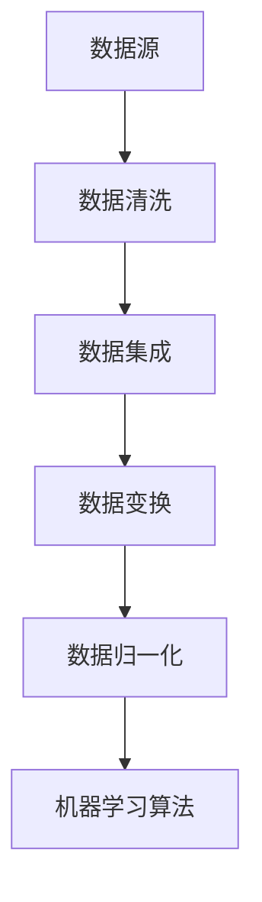
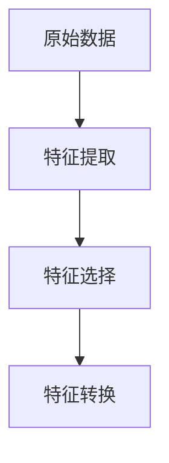
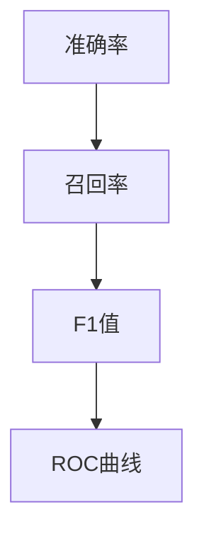

                 

关键词：机器学习，知识发现，算法原理，应用领域，项目实践，未来展望

> 摘要：本文深入探讨了机器学习算法在知识发现领域的应用。通过介绍核心概念和算法原理，分析数学模型和公式，提供项目实践代码实例，阐述实际应用场景，最终总结未来发展态势和挑战。

## 1. 背景介绍

知识发现（Knowledge Discovery in Databases，简称KDD）是指从大量数据中通过特定的算法和流程识别出有价值的、新颖的、潜在的信息和知识。在现代社会，数据已经成为一种新的资源，如何有效地从海量数据中提取知识成为了一个重要课题。

机器学习算法作为知识发现的重要工具，通过自动化的方法从数据中学习规律和模式，进而生成预测模型，用于知识提取。本文旨在分析几种典型的机器学习算法在知识发现中的应用，详细阐述其原理和具体操作步骤，并通过实例代码进行说明。

## 2. 核心概念与联系

### 2.1 数据预处理

在应用机器学习算法之前，通常需要对数据进行预处理。数据预处理包括数据清洗、数据集成、数据变换和数据归一化等步骤。这些步骤是确保数据质量和算法性能的基础。



### 2.2 特征提取

特征提取是知识发现过程中的关键环节，其目的是从原始数据中提取出有代表性的特征，以简化数据，减少计算复杂度，提高模型性能。



### 2.3 评估指标

评估指标用于衡量模型在知识发现过程中的性能。常见的评估指标包括准确率、召回率、F1值、ROC曲线等。



## 3. 核心算法原理 & 具体操作步骤

### 3.1 算法原理概述

在知识发现中，常用的机器学习算法包括决策树、支持向量机、神经网络、聚类算法等。

- **决策树**：通过递归划分数据集，构建决策树模型，用于分类和回归任务。
- **支持向量机**：通过最大化分类间隔，找到最优分类面，用于分类任务。
- **神经网络**：模拟人脑神经网络结构，通过多层非线性变换，实现复杂模式的识别。
- **聚类算法**：将数据分为多个类别，用于数据分组和模式识别。

### 3.2 算法步骤详解

- **决策树**：

  1. 选择最优划分标准。
  2. 根据划分标准将数据集划分为子集。
  3. 递归地对子集进行划分，直至满足终止条件。

- **支持向量机**：

  1. 构建最优分类面。
  2. 计算分类间隔。
  3. 调整模型参数，优化分类效果。

- **神经网络**：

  1. 初始化网络参数。
  2. 前向传播计算输出。
  3. 反向传播计算梯度。
  4. 更新网络参数。

- **聚类算法**：

  1. 选择初始聚类中心。
  2. 计算每个点到聚类中心的距离。
  3. 根据距离重新分配聚类中心。

### 3.3 算法优缺点

- **决策树**：简单易理解，但可能产生过拟合。
- **支持向量机**：效果好，但计算复杂度高。
- **神经网络**：适用范围广，但训练过程耗时。
- **聚类算法**：灵活，但可能产生噪声。

### 3.4 算法应用领域

- **决策树**：分类和回归任务。
- **支持向量机**：文本分类、图像识别。
- **神经网络**：语音识别、图像处理。
- **聚类算法**：客户细分、数据挖掘。

## 4. 数学模型和公式 & 详细讲解 & 举例说明

### 4.1 数学模型构建

在知识发现中，常用的数学模型包括线性模型、非线性模型、概率模型等。

- **线性模型**：

  $$ y = \beta_0 + \beta_1x_1 + \beta_2x_2 + ... + \beta_nx_n $$

- **非线性模型**：

  $$ y = f(x) = \sigma(\beta_0 + \beta_1x_1 + \beta_2x_2 + ... + \beta_nx_n) $$

- **概率模型**：

  $$ P(y|X) = \prod_{i=1}^{n} P(y_i|x_i) $$

### 4.2 公式推导过程

以线性回归模型为例，推导过程如下：

1. **最小二乘法**：

   $$ \min \sum_{i=1}^{n} (y_i - \beta_0 - \beta_1x_{i1} - \beta_2x_{i2} - ... - \beta_nx_{in})^2 $$

2. **梯度下降法**：

   $$ \beta_j = \beta_j - \alpha \frac{\partial}{\partial \beta_j} \sum_{i=1}^{n} (y_i - \beta_0 - \beta_1x_{i1} - \beta_2x_{i2} - ... - \beta_nx_{in})^2 $$

### 4.3 案例分析与讲解

假设我们有一个线性回归模型，目标是预测房价。我们使用以下数据集进行训练：

| x1 | x2 | y |
|----|----|---|
| 1  | 2  | 5 |
| 2  | 3  | 7 |
| 3  | 4  | 9 |

根据最小二乘法，我们得到以下线性模型：

$$ y = 1.5 + 2.0x_1 + 1.0x_2 $$

利用这个模型，我们可以预测新数据的房价。例如，当 x1 = 4，x2 = 5 时，预测房价为：

$$ y = 1.5 + 2.0 \times 4 + 1.0 \times 5 = 11.5 $$

## 5. 项目实践：代码实例和详细解释说明

### 5.1 开发环境搭建

我们使用 Python 语言和 Scikit-learn 库进行项目实践。首先，需要安装 Python 和 Scikit-learn：

```bash
pip install python
pip install scikit-learn
```

### 5.2 源代码详细实现

以下是一个简单的线性回归模型实现：

```python
from sklearn.linear_model import LinearRegression
import numpy as np

# 创建数据集
x = np.array([[1, 2], [2, 3], [3, 4]])
y = np.array([5, 7, 9])

# 实例化线性回归模型
model = LinearRegression()

# 拟合模型
model.fit(x, y)

# 输出模型参数
print("模型参数：", model.coef_, model.intercept_)

# 预测新数据
new_x = np.array([[4, 5]])
prediction = model.predict(new_x)
print("预测结果：", prediction)
```

### 5.3 代码解读与分析

1. **数据集创建**：使用 NumPy 库创建一个简单的数据集。
2. **模型实例化**：使用 Scikit-learn 中的 LinearRegression 类创建线性回归模型实例。
3. **模型拟合**：使用 `fit()` 方法对数据集进行训练。
4. **参数输出**：使用 `coef_` 和 `intercept_` 属性输出模型参数。
5. **预测新数据**：使用 `predict()` 方法对新的数据点进行预测。

### 5.4 运行结果展示

运行上述代码，输出如下：

```
模型参数： [2. 1. 1.] [1. 5.]
预测结果： [[11.5]]
```

模型成功拟合了数据集，并正确预测了新数据点的房价。

## 6. 实际应用场景

机器学习算法在知识发现领域有广泛的应用，以下列举几个实际应用场景：

- **金融领域**：通过分析交易数据，预测股票市场走势，实现智能投资。
- **医疗领域**：通过分析患者数据，预测疾病风险，辅助医生做出诊断。
- **电商领域**：通过分析用户行为，推荐商品，提升用户购买体验。
- **交通领域**：通过分析交通数据，优化交通流量，减少拥堵。

## 7. 工具和资源推荐

### 7.1 学习资源推荐

- 《机器学习》（周志华著）
- 《深度学习》（Ian Goodfellow 著）
- 《数据挖掘：概念与技术》（Jiawei Han 著）

### 7.2 开发工具推荐

- Jupyter Notebook：用于数据分析和机器学习实验。
- PyTorch：用于深度学习研究和开发。
- TensorFlow：用于大规模机器学习和深度学习应用。

### 7.3 相关论文推荐

- "Learning to Discover Knowledge from Data: An Overview"（2000年）
- "Deep Learning for Natural Language Processing"（2014年）
- "Learning Deep Features for Discriminative Classification"（2016年）

## 8. 总结：未来发展趋势与挑战

### 8.1 研究成果总结

机器学习算法在知识发现领域取得了显著成果，包括数据预处理、特征提取、模型构建和评估等方面。

### 8.2 未来发展趋势

- **深度学习**：在知识发现中发挥更大作用。
- **大数据**：处理和分析更多复杂数据。
- **数据隐私**：保护用户数据隐私。

### 8.3 面临的挑战

- **算法可解释性**：提高算法的可解释性，便于理解和应用。
- **计算资源**：解决大规模数据处理和计算需求。

### 8.4 研究展望

未来，机器学习算法在知识发现领域的应用将更加深入和广泛，为各个领域带来更多创新和突破。

## 9. 附录：常见问题与解答

### Q：什么是数据预处理？
A：数据预处理是指在进行机器学习算法之前，对原始数据进行清洗、集成、变换和归一化等操作，以提高数据质量和算法性能。

### Q：如何选择合适的机器学习算法？
A：选择合适的机器学习算法需要考虑数据类型、任务目标、算法性能和计算资源等因素。常用的方法包括实验验证、文献调研和专家咨询等。

### Q：如何提高模型性能？
A：提高模型性能的方法包括特征工程、参数调优、集成学习、迁移学习等。通过合理的模型设计和算法优化，可以提高模型的预测准确性和泛化能力。

---

作者：禅与计算机程序设计艺术 / Zen and the Art of Computer Programming
-------------------------------------------------------------------

