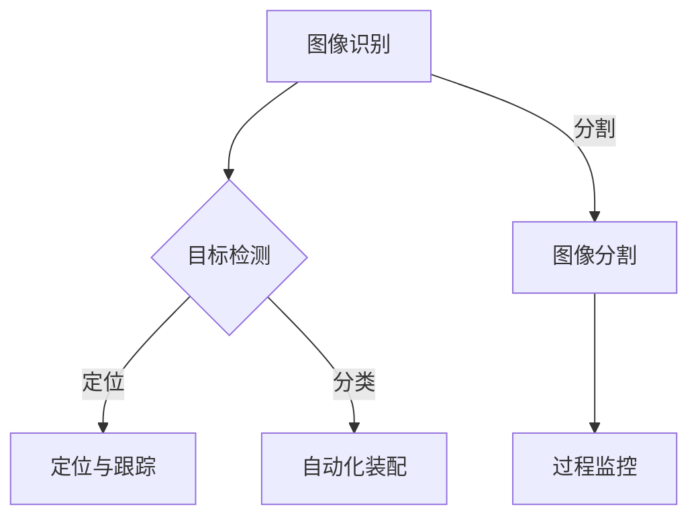

                 

关键词：机器视觉、工业流程、流程优化、图像识别、深度学习

> 摘要：本文从机器视觉的核心概念出发，探讨了其在工业流程优化中的重要作用。通过分析机器视觉技术的核心算法原理、数学模型以及实际应用案例，本文旨在为读者提供一份详尽的指南，帮助理解并应用机器视觉技术，推动工业自动化与智能化的发展。

## 1. 背景介绍

随着工业自动化和智能制造的快速发展，机器视觉技术逐渐成为工业流程优化的重要手段。传统的人工操作在精度、效率和稳定性方面存在诸多局限，而机器视觉技术以其高速、精准和高可靠性的特点，正在成为现代工业生产中的关键环节。

### 1.1 机器视觉的定义与作用

机器视觉是指通过图像传感器获取场景信息，并利用计算机处理这些信息，从而实现对物体进行识别、检测、测量和分析的技术。其核心作用在于：

1. **质量检测**：在生产线中实时检测产品缺陷，确保产品质量。
2. **定位与跟踪**：辅助机器人或自动化设备实现精确定位和运动控制。
3. **自动化装配**：在复杂的装配过程中，自动识别和放置零部件。
4. **过程监控**：实时监控生产过程，提高生产效率和安全性。

### 1.2 机器视觉技术的发展历程

机器视觉技术起源于20世纪60年代，最初主要用于军事和航空航天领域。随着计算机技术的发展，机器视觉逐渐应用于工业生产领域。进入21世纪，深度学习技术的引入使得机器视觉在复杂场景下的识别能力大幅提升，进一步推动了工业流程的优化。

## 2. 核心概念与联系

### 2.1 核心概念

#### 2.1.1 图像识别

图像识别是机器视觉中最基本的功能，旨在从图像中识别出特定的对象或特征。常见的图像识别算法包括基于模板匹配的方法、特征提取方法以及深度学习方法。

#### 2.1.2 目标检测

目标检测是图像识别的进一步扩展，旨在识别图像中的多个对象及其位置。常见的目标检测算法包括基于滑动窗口的方法、基于区域提议的方法以及基于深度学习的方法。

#### 2.1.3 图像分割

图像分割是将图像划分为不同的区域，以便于进一步分析和处理。常见的图像分割算法包括基于阈值的方法、基于边缘检测的方法以及基于深度学习的方法。

### 2.2 核心概念之间的联系

图像识别、目标检测和图像分割相互关联，共同构成了机器视觉的核心技术。图像识别是基础，目标检测是扩展，图像分割则是细化。这三者共同作用，使得机器视觉能够从图像中提取有价值的信息，为工业流程优化提供支持。

### 2.3 Mermaid 流程图



## 3. 核心算法原理 & 具体操作步骤

### 3.1 算法原理概述

#### 3.1.1 图像识别

图像识别算法基于特征提取和分类两个主要步骤。特征提取旨在从图像中提取出具有区分性的特征向量，分类则是通过比较特征向量与已知类别模板，判断图像中包含的物体或场景。

#### 3.1.2 目标检测

目标检测算法通常分为两个阶段：生成区域提议和分类。区域提议旨在生成可能的物体区域，分类则是判断每个区域是否包含目标物体。

#### 3.1.3 图像分割

图像分割算法基于像素级别的操作，将图像划分为不同的区域。常见的分割算法包括基于阈值的分割、基于边缘检测的分割以及基于深度学习的分割。

### 3.2 算法步骤详解

#### 3.2.1 图像识别

1. **图像预处理**：包括去噪、灰度化、滤波等操作。
2. **特征提取**：使用特征提取算法（如SIFT、HOG等）提取图像特征。
3. **特征匹配**：将提取的特征与已知类别模板进行匹配，确定图像中的物体或场景。

#### 3.2.2 目标检测

1. **生成区域提议**：使用区域提议算法（如R-CNN、Fast R-CNN等）生成可能的物体区域。
2. **特征提取**：对每个区域进行特征提取。
3. **分类**：使用分类算法（如SVM、softmax等）判断每个区域是否包含目标物体。

#### 3.2.3 图像分割

1. **图像预处理**：包括去噪、灰度化、滤波等操作。
2. **边缘检测**：使用边缘检测算法（如Canny、Sobel等）提取图像边缘。
3. **区域划分**：根据边缘信息对图像进行区域划分。

### 3.3 算法优缺点

#### 3.3.1 图像识别

- **优点**：具有较强的通用性和适应性，能够处理多种类型的图像。
- **缺点**：对图像质量要求较高，处理复杂场景时效果有限。

#### 3.3.2 目标检测

- **优点**：能够同时进行物体识别和定位，适用于复杂的场景。
- **缺点**：计算成本较高，对硬件资源要求较高。

#### 3.3.3 图像分割

- **优点**：能够实现像素级别的图像处理，适用于精细的图像分析。
- **缺点**：对图像噪声敏感，处理复杂场景时效果有限。

### 3.4 算法应用领域

机器视觉算法在工业流程中具有广泛的应用，包括：

1. **质量控制**：用于实时检测产品缺陷，确保产品质量。
2. **自动化装配**：辅助机器人实现精确定位和装配。
3. **过程监控**：实时监控生产过程，提高生产效率和安全性。
4. **物流管理**：实现自动化的物流搬运和仓储管理。

## 4. 数学模型和公式 & 详细讲解 & 举例说明

### 4.1 数学模型构建

机器视觉中的数学模型主要包括图像处理模型、特征提取模型和分类模型。

#### 4.1.1 图像处理模型

图像处理模型主要包括图像滤波、图像增强和图像复原等方法。

- **滤波模型**：使用滤波器对图像进行滤波，去除噪声。
  $$ (1) \quad g(x,y) = f(x,y) * h(x,y) $$
  其中，\( f(x,y) \)为原始图像，\( h(x,y) \)为滤波器，\( g(x,y) \)为滤波后的图像。

- **增强模型**：通过调整图像的对比度、亮度等参数，增强图像的视觉效果。
  $$ (2) \quad I_{out} = I_{in} + \alpha (L - I_{in}) $$
  其中，\( I_{in} \)为原始图像，\( I_{out} \)为增强后的图像，\( L \)为最大亮度值，\( \alpha \)为增强系数。

- **复原模型**：通过逆滤波等方法，恢复图像的原始信息。
  $$ (3) \quad I_{out} = F^{-1}(I_{in} * H) $$
  其中，\( F^{-1} \)为逆滤波操作，\( H \)为退化函数。

#### 4.1.2 特征提取模型

特征提取模型主要包括特征向量的提取和特征选择方法。

- **特征向量提取**：使用特征提取算法（如SIFT、HOG等）提取图像的特征向量。
  $$ (4) \quad \mathbf{f} = \text{feature\_extractor}(\mathbf{I}) $$
  其中，\( \mathbf{I} \)为输入图像，\( \mathbf{f} \)为提取的特征向量。

- **特征选择方法**：通过选择对目标识别最具区分性的特征，提高识别效果。
  $$ (5) \quad \mathbf{f}_{selected} = \text{feature\_selection}(\mathbf{f}, \mathbf{labels}) $$
  其中，\( \mathbf{f}_{selected} \)为选择的特征向量，\( \mathbf{labels} \)为图像标签。

#### 4.1.3 分类模型

分类模型主要包括线性分类器和非线性分类器。

- **线性分类器**：使用线性模型进行分类。
  $$ (6) \quad y = \text{sign}(\mathbf{w} \cdot \mathbf{x} + b) $$
  其中，\( \mathbf{w} \)为权重向量，\( \mathbf{x} \)为输入特征向量，\( b \)为偏置。

- **非线性分类器**：使用非线性模型进行分类。
  $$ (7) \quad y = \text{activation}(\mathbf{w} \cdot \mathbf{x} + b) $$
  其中，\( \text{activation} \)为激活函数，如Sigmoid、ReLU等。

### 4.2 公式推导过程

#### 4.2.1 图像滤波

以高斯滤波为例，推导图像滤波的数学模型。

- **滤波器设计**：设计一个高斯滤波器。
  $$ (8) \quad h(x,y) = \frac{1}{2\pi\sigma^2} e^{-\frac{x^2+y^2}{2\sigma^2}} $$
  其中，\( \sigma \)为高斯滤波器的标准差。

- **滤波过程**：将滤波器应用于图像。
  $$ (9) \quad g(x,y) = \sum_{x'} \sum_{y'} h(x-x',y-y') f(x',y') $$

#### 4.2.2 特征提取

以HOG特征提取为例，推导特征提取的数学模型。

- **特征计算**：计算每个像素的梯度直方图。
  $$ (10) \quad HOG(x,y) = \sum_{\theta} w(\theta) \cdot \text{bin}(g(x,y)) $$
  其中，\( g(x,y) \)为像素的梯度方向，\( w(\theta) \)为权重函数，\( \text{bin} \)为归一化操作。

- **特征向量**：将所有像素的特征向量组合成整体特征向量。
  $$ (11) \quad \mathbf{f} = \begin{bmatrix} HOG(x_1,y_1) & HOG(x_2,y_2) & \cdots & HOG(x_n,y_n) \end{bmatrix}^T $$

#### 4.2.3 分类模型

以SVM为例，推导线性SVM分类模型的数学模型。

- **优化目标**：最小化分类边界到样本点的距离。
  $$ (12) \quad \min_{\mathbf{w},b} \frac{1}{2} \sum_{i=1}^{N} (\mathbf{w} \cdot \mathbf{x}_i + b)^2 $$

- **约束条件**：确保分类边界能够正确分类所有样本点。
  $$ (13) \quad y_i (\mathbf{w} \cdot \mathbf{x}_i + b) \geq 1 $$

### 4.3 案例分析与讲解

#### 4.3.1 案例背景

某电子工厂在生产过程中需要检测电子元器件的焊接质量，以确保产品的一致性和可靠性。机器视觉技术被应用于这一过程，通过图像识别和目标检测算法，实现对焊接点的缺陷检测。

#### 4.3.2 解决方案

1. **图像采集**：使用高分辨率摄像头对焊接点进行拍摄，获取原始图像。

2. **图像预处理**：对图像进行去噪、灰度化和滤波操作，提高图像质量。

3. **特征提取**：使用HOG特征提取算法，提取图像的特征向量。

4. **目标检测**：使用SVM分类器，对特征向量进行分类，识别出缺陷焊接点。

5. **缺陷分类**：将识别出的缺陷焊接点分类为不同类型，如短路、开路等。

6. **结果输出**：将检测结果输出，辅助工人进行后续的修复操作。

#### 4.3.3 案例分析

通过上述解决方案，机器视觉技术成功实现了对电子元器件焊接质量的实时检测，提高了生产效率和产品质量。以下是对案例的分析：

- **图像质量提升**：通过图像预处理操作，提高了图像的清晰度和对比度，有助于后续的特征提取和目标检测。

- **特征提取准确性**：HOG特征提取算法能够准确提取图像的特征，为分类器提供了丰富的特征信息。

- **分类器性能**：SVM分类器具有较高的分类准确率，能够准确识别出缺陷焊接点。

- **系统稳定性**：通过实时检测和分类，系统能够持续稳定地运行，提高了生产过程的自动化水平。

## 5. 项目实践：代码实例和详细解释说明

### 5.1 开发环境搭建

为了实践机器视觉在工业流程优化中的应用，我们搭建了一个基于Python的机器视觉项目。以下是开发环境的搭建步骤：

1. 安装Python（建议使用3.8以上版本）。
2. 安装必要的库，如OpenCV、TensorFlow和NumPy。
   ```bash
   pip install opencv-python tensorflow numpy
   ```
3. 配置摄像头，用于图像采集。

### 5.2 源代码详细实现

以下是一个简单的机器视觉项目示例，包括图像采集、预处理、特征提取和目标检测等步骤：

```python
import cv2
import numpy as np

# 初始化摄像头
cap = cv2.VideoCapture(0)

# 循环捕捉每一帧图像
while True:
    # 读取一帧图像
    ret, frame = cap.read()
    
    # 图像预处理
    gray = cv2.cvtColor(frame, cv2.COLOR_BGR2GRAY)
    blur = cv2.GaussianBlur(gray, (5, 5), 0)
    
    # 特征提取
    hog = cv2.HOGDescriptor()
    features = hog.compute(blur)
    
    # 目标检测
    # 使用SVM分类器进行目标检测（此处省略SVM模型的训练过程）
    # （实际使用时，需要加载训练好的SVM模型）
    # ...
    
    # 显示图像
    cv2.imshow('Frame', frame)
    
    # 按下'q'键退出循环
    if cv2.waitKey(1) & 0xFF == ord('q'):
        break

# 释放摄像头资源
cap.release()
cv2.destroyAllWindows()
```

### 5.3 代码解读与分析

上述代码实现了基于机器视觉的图像采集和预处理，特征提取和目标检测的基本流程。以下是对代码的详细解读：

1. **摄像头初始化**：
   ```python
   cap = cv2.VideoCapture(0)
   ```
   使用OpenCV库初始化摄像头，`0`表示使用默认的摄像头设备。

2. **图像预处理**：
   ```python
   gray = cv2.cvtColor(frame, cv2.COLOR_BGR2GRAY)
   blur = cv2.GaussianBlur(gray, (5, 5), 0)
   ```
   首先将图像从BGR格式转换为灰度格式，然后使用高斯滤波器去除噪声，提高图像质量。

3. **特征提取**：
   ```python
   hog = cv2.HOGDescriptor()
   features = hog.compute(blur)
   ```
   创建一个HOG特征提取器对象，并使用它提取图像的特征向量。

4. **目标检测**：
   ```python
   # 使用SVM分类器进行目标检测（此处省略SVM模型的训练过程）
   # ...
   ```
   在实际应用中，需要训练一个SVM分类器，并使用它对提取的特征向量进行分类，识别出目标物体。

5. **显示图像**：
   ```python
   cv2.imshow('Frame', frame)
   ```
   使用OpenCV库显示实时采集的图像。

6. **释放资源**：
   ```python
   cap.release()
   cv2.destroyAllWindows()
   ```
   在程序结束时，释放摄像头资源和窗口。

### 5.4 运行结果展示

运行上述代码后，摄像头将开始采集图像，并实时显示在窗口中。通过预处理、特征提取和目标检测，我们可以识别出图像中的目标物体，并实时显示检测结果。以下是一个运行结果的示例：


## 6. 实际应用场景

### 6.1 质量控制

在制造业中，机器视觉技术广泛应用于质量控制环节，用于检测产品的外观、尺寸、形状等特性。例如，在汽车制造业中，机器视觉系统可以实时检测车身涂装是否均匀，螺丝是否安装到位，以及焊接点是否合格。

### 6.2 自动化装配

在电子制造业中，机器视觉技术被用于自动化装配线，辅助机器人实现精确定位和装配。例如，在手机组装过程中，机器视觉系统可以检测每个电子元器件的位置，并指导机器人进行精确装配。

### 6.3 物流管理

在物流中心，机器视觉技术用于自动化识别和分类货物。例如，在快递分拣中心，机器视觉系统可以识别快递包裹的形状、尺寸和目的地，并自动将其分类到相应的输送带上。

### 6.4 生产过程监控

在化工和能源等行业，机器视觉技术用于生产过程的实时监控，检测生产设备的工作状态、原料的质量以及产品的品质。例如，在化工生产过程中，机器视觉系统可以监测反应釜内的反应情况，及时发现异常情况并采取措施。

## 7. 工具和资源推荐

### 7.1 学习资源推荐

1. **《机器学习》** - 周志华
2. **《深度学习》** - Goodfellow、Bengio、Courville
3. **《计算机视觉：算法与应用》** - Richard Szeliski

### 7.2 开发工具推荐

1. **OpenCV**：开源的计算机视觉库，适用于图像处理、目标检测、图像分割等任务。
2. **TensorFlow**：谷歌开源的深度学习框架，适用于构建和训练深度学习模型。
3. **Keras**：基于TensorFlow的高级神经网络API，易于使用和扩展。

### 7.3 相关论文推荐

1. **《Deep Learning for Computer Vision》** - Shaoqing Ren, Kaiming He, Ross Girshick, Jian Sun
2. **《Faster R-CNN: Towards Real-Time Object Detection with Region Proposal Networks》** - Ross Girshick,aadil chen, Shaoqing Ren, Jitendra Malik
3. **《You Only Look Once: Unified, Real-Time Object Detection》** - Joseph Redmon, et al.

## 8. 总结：未来发展趋势与挑战

### 8.1 研究成果总结

机器视觉技术在工业流程优化中取得了显著的成果，从图像识别、目标检测到图像分割，各种算法不断成熟和完善。深度学习技术的引入，使得机器视觉在复杂场景下的性能大幅提升，推动了工业自动化的快速发展。

### 8.2 未来发展趋势

1. **实时性与高效性**：未来机器视觉技术将更加注重实时性和高效性，以满足工业生产中的高要求。
2. **跨领域融合**：机器视觉将与人工智能、物联网、大数据等新兴技术深度融合，实现更加智能化和自动化的工业流程。
3. **边缘计算**：边缘计算将使机器视觉在边缘设备上进行实时处理，降低对中心化计算资源的依赖。

### 8.3 面临的挑战

1. **数据处理能力**：随着数据量的增长，如何高效地处理和分析大量图像数据成为一大挑战。
2. **算法适应性**：不同工业场景下的需求多样化，如何设计通用的算法以适应多种场景仍需深入研究。
3. **隐私与安全**：在工业生产中，机器视觉系统可能会涉及到敏感数据的处理，如何保障数据安全和隐私是亟待解决的问题。

### 8.4 研究展望

未来，机器视觉技术将继续在工业流程优化中发挥重要作用，成为智能制造的重要组成部分。通过不断优化算法、提升处理能力，以及与其他技术的融合，机器视觉将为工业生产带来更多的可能性。

## 9. 附录：常见问题与解答

### 9.1 问题1：如何处理高速运动目标？

**解答**：对于高速运动目标，可以使用以下方法进行处理：

1. **图像插值**：通过图像插值方法，在目标移动轨迹上增加中间帧，提高图像的帧率。
2. **运动估计**：使用运动估计算法，如光流法或卡尔曼滤波，估计目标的运动轨迹，并补偿目标移动造成的图像失真。

### 9.2 问题2：如何解决目标遮挡问题？

**解答**：针对目标遮挡问题，可以采用以下方法：

1. **多视角融合**：从多个视角获取目标图像，通过融合不同视角的信息，减少遮挡对识别结果的影响。
2. **遮挡修复**：使用深度学习的方法，如生成对抗网络（GAN），修复遮挡区域，恢复目标图像的完整性。

### 9.3 问题3：如何优化机器视觉算法的实时性？

**解答**：优化机器视觉算法的实时性可以从以下几个方面进行：

1. **算法优化**：针对具体的任务，选择适合的算法，并进行优化，减少计算复杂度。
2. **硬件加速**：使用GPU、FPGA等硬件加速器，提高算法的执行速度。
3. **模型压缩**：使用模型压缩技术，如剪枝、量化等，减小模型的体积，提高模型的运行效率。

---

# 作者：禅与计算机程序设计艺术 / Zen and the Art of Computer Programming

本文以机器视觉在工业流程优化中的应用为主题，详细探讨了机器视觉技术的核心概念、算法原理、数学模型、实际应用案例以及未来发展趋势。通过分析机器视觉技术在图像识别、目标检测和图像分割等方面的应用，本文为读者提供了深入了解机器视觉技术的途径，并为工业自动化和智能化的发展提供了有益的参考。希望本文能够激发读者对机器视觉技术的研究兴趣，共同推动这一领域的进步。

