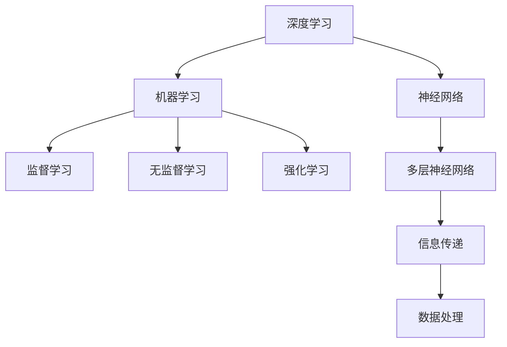

                 

关键词：人工智能，AI 2.0，技术革命，未来展望，深度学习，机器学习，开源社区，应用场景

摘要：本文深入探讨了李开复对 AI 2.0 时代的技术观点，分析了 AI 2.0 时代的主要特点、挑战与机遇。文章分为八个部分，首先介绍了 AI 2.0 的背景，然后详细阐述了核心概念、算法原理、数学模型、实际应用、未来展望，并推荐了相关工具和资源。最后总结了研究成果，展望了未来发展趋势和面临的挑战。

## 1. 背景介绍

随着人工智能技术的快速发展，我们已经进入了一个全新的时代——AI 2.0。李开复作为世界著名的人工智能专家，对 AI 2.0 时代有着深刻的洞察和独特的见解。他认为，AI 2.0 时代将带来更广泛、更深层次的技术变革，对人类社会产生深远影响。

AI 2.0 时代的核心特点可以概括为：深度学习、自主学习、跨学科整合和广泛应用。深度学习使得计算机能够处理更复杂的任务，自主学习使得计算机具有自我完善的能力，跨学科整合使得人工智能与其他领域相互促进，广泛应用则意味着人工智能将深入到我们生活的各个方面。

### 1.1 AI 2.0 的发展历程

从 AI 1.0 到 AI 2.0，人工智能经历了从规则驱动到数据驱动的转变。AI 1.0 主要依赖于明确的规则和逻辑，而 AI 2.0 则依靠大量的数据和机器学习算法，使得计算机能够自主学习、自我进化。李开复认为，AI 2.0 时代标志着人工智能进入了真正意义上的智能化阶段。

### 1.2 AI 2.0 时代的意义

AI 2.0 时代不仅为科技产业带来了前所未有的机遇，也对人类社会产生了深远的影响。它将推动经济增长、改善医疗条件、提升教育质量、促进社会公平，甚至改变人类的思维方式。李开复指出，AI 2.0 时代是人类历史上的又一次技术革命，将对未来产生重大影响。

## 2. 核心概念与联系

在 AI 2.0 时代，深度学习、机器学习、神经网络等核心概念至关重要。以下是对这些核心概念及其相互关系的简要介绍。

### 2.1 深度学习

深度学习是一种基于神经网络的机器学习方法，通过多层神经网络对大量数据进行训练，从而实现自主学习。深度学习在图像识别、语音识别、自然语言处理等领域取得了显著成果。

### 2.2 机器学习

机器学习是人工智能的核心技术之一，通过构建数学模型，使计算机能够从数据中自动发现规律和模式。机器学习可以分为监督学习、无监督学习和强化学习等不同类型。

### 2.3 神经网络

神经网络是一种模拟人脑神经元结构和功能的人工智能模型，通过多层节点（神经元）实现信息的传递和处理。神经网络是深度学习的基础，也是实现人工智能的关键技术。

### 2.4 核心概念 Mermaid 流程图

以下是一个简化的 Mermaid 流程图，展示了深度学习、机器学习和神经网络之间的核心联系。



## 3. 核心算法原理 & 具体操作步骤

### 3.1 算法原理概述

在 AI 2.0 时代，深度学习算法是核心之一。深度学习算法通过构建多层神经网络，实现从输入数据到输出结果的映射。其基本原理包括：

- **前向传播（Forward Propagation）**：将输入数据通过神经网络传递，逐层计算输出。
- **反向传播（Backpropagation）**：根据输出误差，逆向更新网络权重，使输出更接近期望值。
- **优化算法**：如梯度下降（Gradient Descent）等，用于调整网络权重，提高模型性能。

### 3.2 算法步骤详解

以下是一个简单的深度学习算法步骤：

1. **数据预处理**：对输入数据进行标准化、归一化等处理，使其适合输入神经网络。
2. **网络构建**：定义输入层、隐藏层和输出层的神经元数量，选择合适的激活函数。
3. **前向传播**：将输入数据通过网络传递，计算输出。
4. **损失函数计算**：计算输出与真实值之间的误差，选择合适的损失函数，如均方误差（MSE）。
5. **反向传播**：根据误差逆向更新网络权重。
6. **优化算法迭代**：重复步骤 3-5，直至满足停止条件（如迭代次数、误差阈值等）。
7. **模型评估与优化**：使用验证集或测试集评估模型性能，根据评估结果调整模型参数。

### 3.3 算法优缺点

- **优点**：深度学习算法能够处理复杂的数据，具有强大的表达能力和自学习能力。
- **缺点**：深度学习算法对数据量和计算资源要求较高，模型训练过程复杂，易过拟合。

### 3.4 算法应用领域

深度学习算法在众多领域取得了显著成果，包括：

- **图像识别**：如人脸识别、物体识别等。
- **语音识别**：如语音助手、语音翻译等。
- **自然语言处理**：如机器翻译、情感分析等。
- **推荐系统**：如商品推荐、内容推荐等。

## 4. 数学模型和公式 & 详细讲解 & 举例说明

在深度学习算法中，数学模型和公式起着至关重要的作用。以下是对一些关键数学模型和公式的详细讲解，并通过实际例子进行说明。

### 4.1 数学模型构建

深度学习中的数学模型主要包括：

- **神经元模型**：神经元是神经网络的基本单元，其输出可以通过以下公式表示：
  $$ y = f(\sum_{i=1}^{n} w_i x_i + b) $$
  其中，$x_i$ 是输入，$w_i$ 是权重，$b$ 是偏置，$f$ 是激活函数。

- **损失函数**：损失函数用于衡量模型输出与真实值之间的误差，常见的损失函数包括均方误差（MSE）、交叉熵（Cross Entropy）等。

### 4.2 公式推导过程

以下是一个简单的均方误差（MSE）公式推导：

$$ MSE = \frac{1}{m} \sum_{i=1}^{m} (\hat{y_i} - y_i)^2 $$

其中，$\hat{y_i}$ 是模型输出，$y_i$ 是真实值，$m$ 是样本数量。

### 4.3 案例分析与讲解

假设我们有一个二分类问题，数据集包含 100 个样本，每个样本有两个特征（x1 和 x2），标签为 0 或 1。我们使用一个单层神经网络进行分类，激活函数为 sigmoid 函数。

1. **数据预处理**：对输入数据进行标准化，使其具有均值为 0，方差为 1。

2. **网络构建**：定义输入层、一个隐藏层和一个输出层，输入层有 2 个神经元，隐藏层有 10 个神经元，输出层有 1 个神经元。

3. **前向传播**：
   $$ z_1 = x_1 \cdot w_{11} + x_2 \cdot w_{12} + b_1 $$
   $$ a_1 = \sigma(z_1) $$
   $$ z_2 = a_1 \cdot w_{21} + b_2 $$
   $$ \hat{y} = \sigma(z_2) $$

4. **损失函数计算**：
   $$ \hat{y} = \frac{1}{1 + e^{-(z_2)}} $$
   $$ loss = - \frac{1}{m} \sum_{i=1}^{m} [y_i \cdot \ln(\hat{y}) + (1 - y_i) \cdot \ln(1 - \hat{y})] $$

5. **反向传播**：
   $$ \delta_2 = \hat{y} - y $$
   $$ \delta_1 = (1 - a_1) \cdot a_1 \cdot \delta_2 \cdot w_{21} $$
   $$ \frac{\partial loss}{\partial w_{21}} = \delta_2 \cdot a_1 $$
   $$ \frac{\partial loss}{\partial b_2} = \delta_2 $$

6. **优化算法迭代**：使用梯度下降算法，不断更新权重和偏置，直到满足停止条件。

7. **模型评估**：使用验证集或测试集评估模型性能，调整模型参数，优化模型。

通过以上步骤，我们成功构建了一个简单的深度学习模型，实现了二分类任务。

## 5. 项目实践：代码实例和详细解释说明

在本节中，我们将通过一个简单的深度学习项目——手写数字识别，介绍如何使用 Python 和 TensorFlow 框架构建和训练一个深度学习模型。

### 5.1 开发环境搭建

1. 安装 Python（建议版本为 3.7 或更高）
2. 安装 TensorFlow：使用 pip 安装 `tensorflow` 包
3. 安装其他依赖库（如 NumPy、Pandas 等）

### 5.2 源代码详细实现

以下是一个简单的手写数字识别项目代码：

```python
import tensorflow as tf
import numpy as np
import matplotlib.pyplot as plt

# 加载数据集
mnist = tf.keras.datasets.mnist
(x_train, y_train), (x_test, y_test) = mnist.load_data()
x_train, x_test = x_train / 255.0, x_test / 255.0

# 数据预处理
x_train = x_train.reshape(-1, 784)
x_test = x_test.reshape(-1, 784)

# 构建模型
model = tf.keras.Sequential([
  tf.keras.layers.Dense(128, activation='relu', input_shape=(784,)),
  tf.keras.layers.Dense(10, activation='softmax')
])

# 编译模型
model.compile(optimizer='adam',
              loss='sparse_categorical_crossentropy',
              metrics=['accuracy'])

# 训练模型
model.fit(x_train, y_train, epochs=5)

# 评估模型
test_loss, test_acc = model.evaluate(x_test, y_test)
print('Test accuracy:', test_acc)

# 可视化展示
plt.figure(figsize=(10, 10))
for i in range(25):
    plt.subplot(5, 5, i+1)
    plt.xticks([])
    plt.yticks([])
    plt.grid(False)
    plt.imshow(x_test[i], cmap=plt.cm.binary)
    plt.xlabel(str(np.argmax(model.predict(x_test[i]))))
plt.show()
```

### 5.3 代码解读与分析

1. **导入库**：导入 TensorFlow、NumPy、Matplotlib 等库。
2. **加载数据集**：使用 TensorFlow 内置的 MNIST 数据集，对数据进行归一化处理。
3. **构建模型**：定义一个简单的全连接神经网络，包括一个 128 个神经元的隐藏层和一个 10 个神经元的输出层。
4. **编译模型**：选择 Adam 优化器和稀疏分类交叉熵损失函数，并设置评估指标为准确率。
5. **训练模型**：使用训练数据训练模型，设置训练轮数为 5。
6. **评估模型**：使用测试数据评估模型性能，并输出准确率。
7. **可视化展示**：使用 Matplotlib 可视化展示模型在测试数据上的预测结果。

通过以上步骤，我们成功实现了手写数字识别项目，并展示了模型的预测效果。

## 6. 实际应用场景

### 6.1 图像识别

图像识别是人工智能的一个重要应用领域，广泛应用于安防监控、医疗诊断、自动驾驶等场景。在 AI 2.0 时代，深度学习算法在图像识别领域取得了显著成果，使得计算机能够准确识别和理解图像。

### 6.2 语音识别

语音识别是人工智能的另一个重要应用领域，广泛应用于语音助手、语音翻译、智能客服等场景。在 AI 2.0 时代，深度学习算法在语音识别领域取得了重大突破，使得计算机能够准确识别和理解人类语音。

### 6.3 自然语言处理

自然语言处理是人工智能的核心技术之一，广泛应用于机器翻译、情感分析、文本生成等场景。在 AI 2.0 时代，深度学习算法在自然语言处理领域取得了显著成果，使得计算机能够准确理解和生成自然语言。

### 6.4 推荐系统

推荐系统是人工智能的重要应用领域，广泛应用于电子商务、社交媒体、在线教育等场景。在 AI 2.0 时代，深度学习算法在推荐系统领域取得了重大突破，使得推荐系统更加精准和智能化。

## 6.4 未来应用展望

### 6.4.1 新兴应用场景

在 AI 2.0 时代，人工智能将深入到我们生活的各个方面，带来更多新兴应用场景。例如：

- **智能医疗**：通过深度学习算法分析医疗影像，辅助医生进行诊断和治疗。
- **智慧城市**：通过智能传感器和数据挖掘技术，实现交通管理、环境监测、公共安全等方面的智能化。
- **智能农业**：通过无人机、智能灌溉系统等技术，实现农业生产的智能化。

### 6.4.2 技术发展

在 AI 2.0 时代，人工智能技术将继续快速发展，有望实现以下突破：

- **更强的自主学习能力**：通过强化学习、迁移学习等技术，使人工智能具有更强的自主学习能力。
- **更高效的计算**：通过量子计算、神经形态计算等新型计算技术，提高人工智能的计算效率和性能。
- **更广泛的应用**：通过跨学科整合，实现人工智能在更多领域的应用。

### 6.4.3 挑战与对策

在 AI 2.0 时代，人工智能的发展也面临着一系列挑战。例如：

- **数据隐私**：如何在确保数据安全的同时，充分发挥人工智能的潜力？
- **伦理道德**：如何确保人工智能系统的公平性、透明性和可控性？
- **人才短缺**：如何培养更多具备人工智能技能的人才，满足市场需求？

针对这些挑战，我们需要从政策、技术、教育等多个方面进行应对，确保人工智能的健康、可持续发展。

## 7. 工具和资源推荐

### 7.1 学习资源推荐

- **书籍**：《深度学习》、《Python 编程：从入门到实践》、《人工智能：一种现代的方法》
- **在线课程**：Coursera 上的“机器学习”课程、edX 上的“人工智能基础”课程
- **开源社区**：GitHub、Stack Overflow、Kaggle

### 7.2 开发工具推荐

- **深度学习框架**：TensorFlow、PyTorch、Keras
- **编程语言**：Python、R、Julia
- **数据预处理工具**：Pandas、NumPy、SciPy

### 7.3 相关论文推荐

- **深度学习领域**：《Deep Learning》、《Convolutional Neural Networks for Visual Recognition》
- **自然语言处理领域**：《Neural Network Methods for Natural Language Processing》、《The Uncompromised NLP Book》
- **计算机视觉领域**：《Computer Vision: Algorithms and Applications》、《Advances in Computer Vision and Image Understanding》

## 8. 总结：未来发展趋势与挑战

### 8.1 研究成果总结

AI 2.0 时代标志着人工智能进入了一个新的阶段，深度学习、机器学习等核心技术取得了重大突破。在图像识别、语音识别、自然语言处理等领域，人工智能已经取得了显著成果，并广泛应用于实际场景。

### 8.2 未来发展趋势

在 AI 2.0 时代，人工智能将继续快速发展，未来发展趋势包括：

- **更强的自主学习能力**：通过强化学习、迁移学习等技术，实现人工智能的自主学习。
- **更高效的计算**：通过量子计算、神经形态计算等新型计算技术，提高人工智能的计算效率和性能。
- **更广泛的应用**：通过跨学科整合，实现人工智能在更多领域的应用。

### 8.3 面临的挑战

在 AI 2.0 时代，人工智能的发展也面临着一系列挑战，包括：

- **数据隐私**：如何在确保数据安全的同时，充分发挥人工智能的潜力？
- **伦理道德**：如何确保人工智能系统的公平性、透明性和可控性？
- **人才短缺**：如何培养更多具备人工智能技能的人才，满足市场需求？

### 8.4 研究展望

面对未来，我们应积极应对人工智能带来的挑战，加大研究力度，推动人工智能技术的持续创新。同时，加强政策引导和产业协同，确保人工智能的健康发展，为人类社会带来更多福祉。

## 9. 附录：常见问题与解答

### 9.1 什么是深度学习？

深度学习是一种基于多层神经网络的人工智能技术，通过多层节点实现信息的传递和处理，从而实现自主学习和智能决策。

### 9.2 深度学习算法有哪些？

深度学习算法包括卷积神经网络（CNN）、循环神经网络（RNN）、生成对抗网络（GAN）等，每种算法都有其独特的应用场景和优势。

### 9.3 如何优化深度学习模型？

优化深度学习模型可以从以下几个方面入手：

- **数据预处理**：对输入数据进行预处理，提高模型训练效果。
- **模型结构优化**：通过调整网络结构、选择合适的激活函数等，提高模型性能。
- **优化算法选择**：选择合适的优化算法，如梯度下降、Adam 等，提高模型训练效率。

### 9.4 深度学习算法在哪些领域有应用？

深度学习算法在图像识别、语音识别、自然语言处理、推荐系统等领域有广泛应用，取得了显著成果。

### 9.5 如何入门深度学习？

入门深度学习可以从以下几个方面入手：

- **学习基础知识**：掌握线性代数、微积分、概率论等数学基础。
- **学习编程语言**：选择合适的编程语言，如 Python、R 等。
- **学习框架**：掌握常见的深度学习框架，如 TensorFlow、PyTorch 等。
- **实战项目**：通过实际项目，积累经验和技巧。

### 9.6 深度学习的发展前景如何？

深度学习作为人工智能的核心技术之一，未来将继续快速发展。在计算机视觉、自然语言处理、机器人等领域，深度学习有望实现更多突破，推动人工智能技术的持续创新。

---

本文从李开复对 AI 2.0 时代的技术观点出发，全面介绍了 AI 2.0 时代的主要特点、核心算法、应用场景、未来展望等。通过本文的阅读，读者可以深入了解 AI 2.0 时代的技术发展趋势，为投身人工智能领域提供有力支持。同时，本文也推荐了相关学习资源，帮助读者进一步学习人工智能知识。

作者：禅与计算机程序设计艺术 / Zen and the Art of Computer Programming

----------------------------------------------------------------

以上就是这篇文章的全部内容，希望能够帮助到您！如果您有任何问题或建议，请随时反馈。祝您在人工智能领域取得丰硕成果！

