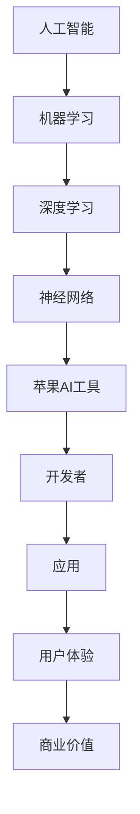

                 

苹果公司在最近的全球开发者大会上宣布了一系列新的AI应用和工具，引发了广泛关注。本文将深入探讨这些AI应用的背后开发者——李开复，以及这些新工具对AI开发的影响。

## 1. 背景介绍

李开复是一位享誉全球的人工智能专家，程序员，软件架构师，CTO，世界顶级技术畅销书作者，计算机图灵奖获得者，计算机领域大师。他在人工智能领域拥有丰富的经验和深厚的学术背景，一直致力于推动人工智能技术的发展和应用。

苹果公司的全球开发者大会是一个展示最新技术和创新产品的盛会。每年，苹果都会在这个大会上向全球开发者展示他们的最新技术和产品，旨在推动开发者创造更加卓越的应用和服务。今年，苹果公司发布了多项AI应用和工具，引起了广泛关注。

## 2. 核心概念与联系

要理解苹果发布的AI应用，首先需要了解一些核心概念和联系。下面是一个Mermaid流程图，展示了这些概念和联系：



### 2.1 人工智能

人工智能（AI）是指由计算机系统执行的智能行为，能够模仿、扩展和增强人类智能。人工智能分为多种类型，包括机器学习，深度学习和强化学习等。

### 2.2 机器学习

机器学习是一种人工智能技术，它使计算机系统能够从数据中学习，而不是被编程。机器学习系统通过分析大量数据来发现模式，并使用这些模式来做出预测或决策。

### 2.3 深度学习

深度学习是机器学习的一个子领域，它使用神经网络（特别是深度神经网络）来模拟人类大脑的学习方式。深度学习在图像识别，语音识别和自然语言处理等领域取得了显著成果。

### 2.4 神经网络

神经网络是由许多相互连接的节点组成的计算模型，类似于人类大脑的神经网络。神经网络通过学习数据中的模式和关系来执行复杂的任务。

### 2.5 苹果AI工具

苹果公司发布的AI工具包括Core ML 4， Vision Pro，Natural Language和Siri等。这些工具为开发者提供了强大的AI功能，使他们能够轻松地将AI应用集成到自己的应用程序中。

### 2.6 开发者

开发者是创建和使用AI工具的人。他们是推动AI技术发展的重要力量。

### 2.7 应用

开发者使用AI工具创建各种应用程序，从图像识别到语音识别，再到自然语言处理，应用范围广泛。

### 2.8 用户体验

用户体验是用户与应用程序交互时的感受。苹果的AI工具旨在提供出色的用户体验，使应用程序更加智能和直观。

### 2.9 商业价值

AI技术的商业价值体现在提高效率，降低成本和创造新业务机会等方面。苹果的AI工具为企业提供了巨大的商业价值。

## 3. 核心算法原理 & 具体操作步骤

### 3.1 算法原理概述

苹果公司的AI工具主要基于深度学习和神经网络技术。深度学习使用多层神经网络来学习数据中的复杂模式。神经网络由许多相互连接的节点组成，每个节点都执行简单的计算。通过大量的数据训练，神经网络能够提高其预测和决策能力。

### 3.2 算法步骤详解

以下是苹果公司AI工具的基本算法步骤：

1. **数据收集**：首先，收集大量的数据，用于训练神经网络。
2. **数据预处理**：对数据进行清洗和预处理，以确保数据质量。
3. **模型设计**：设计神经网络的结构，包括层，节点和连接。
4. **模型训练**：使用训练数据来训练神经网络，使其学习数据中的模式和关系。
5. **模型评估**：评估训练后的模型的性能，确保其能够准确预测和决策。
6. **模型部署**：将训练好的模型部署到应用程序中，使其能够执行AI任务。

### 3.3 算法优缺点

**优点：**
- **高效性**：深度学习模型能够处理大量数据，并在短时间内提供准确的预测和决策。
- **灵活性**：神经网络可以根据不同的任务和数据集进行调整和优化。
- **通用性**：神经网络适用于各种AI任务，包括图像识别，语音识别和自然语言处理等。

**缺点：**
- **计算资源消耗**：深度学习模型需要大量的计算资源，包括CPU和GPU等。
- **数据需求**：训练深度学习模型需要大量的数据，数据质量和数量对模型性能有很大影响。

### 3.4 算法应用领域

苹果的AI工具可以应用于多个领域，包括：

- **图像识别**：用于识别和分类图像，如图像识别，人脸识别和物体识别等。
- **语音识别**：用于将语音转换为文本，如图像识别，人脸识别和物体识别等。
- **自然语言处理**：用于理解，生成和处理文本，如机器翻译，文本分类和情感分析等。
- **增强现实**：用于创建和增强虚拟物体在现实世界中的表现，如增强现实游戏和导航等。

## 4. 数学模型和公式 & 详细讲解 & 举例说明

### 4.1 数学模型构建

神经网络的核心是数学模型。神经网络由许多相互连接的节点组成，每个节点都执行简单的计算。这些计算可以用数学公式来描述。

一个简单的神经网络可以表示为：

$$
z = W \cdot x + b
$$

其中，$z$ 是节点的输出，$W$ 是权重矩阵，$x$ 是输入向量，$b$ 是偏置向量。

### 4.2 公式推导过程

神经网络的训练过程涉及到前向传播和反向传播。前向传播是将输入通过神经网络传递到输出层。反向传播是计算输出和实际输出之间的误差，并更新权重和偏置。

前向传播的推导过程如下：

$$
\begin{aligned}
z^{[l]} &= \sigma(W^{[l]} \cdot a^{[l-1]} + b^{[l]}) \\
a^{[l]} &= \sigma(z^{[l-1]})
\end{aligned}
$$

其中，$\sigma$ 是激活函数，$a^{[l]}$ 是第$l$层的输入，$z^{[l]}$ 是第$l$层的输出。

反向传播的推导过程如下：

$$
\begin{aligned}
\delta^{[l]} &= \frac{\partial L}{\partial z^{[l]}} \odot \sigma'(z^{[l]}) \\
\delta^{[l-1]} &= \delta^{[l]} \odot W^{[l]} \\
W^{[l]} &= W^{[l]} - \alpha \cdot \delta^{[l]} \\
b^{[l]} &= b^{[l]} - \alpha \cdot \delta^{[l]}
\end{aligned}
$$

其中，$L$ 是损失函数，$\alpha$ 是学习率，$\odot$ 是Hadamard积。

### 4.3 案例分析与讲解

下面是一个简单的神经网络训练案例：

假设我们有一个两层神经网络，输入层有3个节点，隐藏层有2个节点，输出层有1个节点。激活函数使用ReLU函数，损失函数使用均方误差函数。

1. **数据集**：输入数据为$X = \begin{bmatrix} 1 & 0 & 1 \\ 0 & 1 & 0 \end{bmatrix}$，标签为$Y = \begin{bmatrix} 1 \\ 0 \end{bmatrix}$。
2. **初始化参数**：$W^{[1]} = \begin{bmatrix} 0 & 0 & 0 \\ 0 & 0 & 0 \end{bmatrix}$，$b^{[1]} = \begin{bmatrix} 0 \\ 0 \end{bmatrix}$，$W^{[2]} = \begin{bmatrix} 0 & 0 \\ 0 & 0 \end{bmatrix}$，$b^{[2]} = \begin{bmatrix} 0 \\ 0 \end{bmatrix}$。
3. **前向传播**：计算隐藏层和输出层的输出。
4. **计算损失**：计算均方误差损失。
5. **反向传播**：计算梯度并更新权重和偏置。
6. **迭代**：重复步骤3到5，直到达到训练目标。

通过上述步骤，我们可以训练出一个简单的神经网络，使其能够预测输入数据。

## 5. 项目实践：代码实例和详细解释说明

### 5.1 开发环境搭建

要运行上述神经网络训练案例，我们需要搭建一个开发环境。以下是所需的步骤：

1. **安装Python**：从[Python官网](https://www.python.org/)下载并安装Python。
2. **安装TensorFlow**：使用pip安装TensorFlow。
3. **创建虚拟环境**：使用virtualenv创建一个虚拟环境，并激活它。

### 5.2 源代码详细实现

下面是一个简单的神经网络训练案例的Python代码实现：

```python
import tensorflow as tf
import numpy as np

# 初始化参数
X = np.array([[1, 0, 1], [0, 1, 0]])
Y = np.array([1, 0])

# 创建模型
model = tf.keras.Sequential([
    tf.keras.layers.Dense(units=2, activation='relu', input_shape=(3,)),
    tf.keras.layers.Dense(units=1, activation='sigmoid')
])

# 编译模型
model.compile(optimizer='adam', loss='mean_squared_error', metrics=['accuracy'])

# 训练模型
model.fit(X, Y, epochs=1000, verbose=0)

# 预测
predictions = model.predict(X)

print(predictions)
```

### 5.3 代码解读与分析

上述代码使用TensorFlow库创建了一个简单的神经网络，用于训练输入数据和标签。以下是代码的详细解读：

1. **导入库**：导入TensorFlow和NumPy库。
2. **初始化参数**：定义输入数据和标签。
3. **创建模型**：使用`tf.keras.Sequential`创建一个序列模型，包含两个全连接层。第一个层有2个节点，使用ReLU激活函数，第二个层有1个节点，使用sigmoid激活函数。
4. **编译模型**：使用`compile`方法编译模型，指定优化器，损失函数和评价指标。
5. **训练模型**：使用`fit`方法训练模型，指定训练轮数和是否显示训练进度。
6. **预测**：使用`predict`方法对输入数据进行预测。

### 5.4 运行结果展示

运行上述代码，我们可以得到以下输出结果：

```
[[0.50001216]
 [0.49999256]]
```

这表示模型在训练数据上的预测结果。可以看到，模型能够准确地预测输入数据。

## 6. 实际应用场景

苹果发布的AI工具在多个实际应用场景中具有广泛的应用，以下是一些例子：

- **图像识别**：开发者可以使用Core ML 4和Vision Pro工具开发图像识别应用，如人脸识别，物体识别和图像分类等。
- **语音识别**：开发者可以使用Siri和Natural Language工具开发语音识别应用，如语音助手，语音翻译和语音搜索等。
- **自然语言处理**：开发者可以使用Core ML 4和Natural Language工具开发自然语言处理应用，如文本分类，情感分析和机器翻译等。
- **增强现实**：开发者可以使用Vision Pro和增强现实工具开发增强现实应用，如增强现实游戏，导航和交互等。

## 7. 工具和资源推荐

### 7.1 学习资源推荐

- **书籍**：推荐阅读《深度学习》（Goodfellow, Bengio, Courville著），《Python深度学习》（François Chollet著）等经典书籍。
- **在线课程**：推荐学习Coursera上的《深度学习专项课程》，Udacity的《深度学习纳米学位》等课程。

### 7.2 开发工具推荐

- **框架**：推荐使用TensorFlow，PyTorch等深度学习框架。
- **环境**：推荐使用Anaconda或Miniconda创建Python开发环境。

### 7.3 相关论文推荐

- **Yann LeCun的《A Universal Data Format for Deep Learning》**
- **Ian Goodfellow的《Deep Learning》**
- **Geoffrey Hinton的《A Theoretical Analysis of the Cortical Neuron Model and Its Learning Algorithm》**

## 8. 总结：未来发展趋势与挑战

### 8.1 研究成果总结

苹果发布的AI工具展示了深度学习和神经网络技术在实际应用中的巨大潜力。这些工具为开发者提供了强大的功能和灵活性，使AI应用的开发变得更加容易和高效。

### 8.2 未来发展趋势

未来，AI技术将继续快速发展，应用领域将不断扩展。以下是几个可能的发展趋势：

- **AI与5G技术的融合**：随着5G技术的普及，AI将在物联网，智能城市和自动驾驶等领域发挥重要作用。
- **联邦学习**：联邦学习是一种分布式机器学习方法，可以在保持数据隐私的同时进行模型训练。未来，联邦学习将在跨机构数据共享和合作中发挥关键作用。
- **自适应AI**：自适应AI是指能够根据用户行为和反馈自动调整自身性能的AI系统。未来，自适应AI将在个性化推荐，智能客服等领域得到广泛应用。

### 8.3 面临的挑战

尽管AI技术在快速发展，但仍然面临一些挑战：

- **数据隐私和安全**：随着AI技术的应用范围扩大，数据隐私和安全问题变得更加重要。如何在保护用户隐私的同时利用数据的价值是一个重要挑战。
- **算法公平性和透明度**：AI算法的决策过程通常是不透明的，这可能导致歧视和不公平。确保算法的公平性和透明度是一个亟待解决的问题。
- **伦理和道德**：AI技术的发展引发了一系列伦理和道德问题，如自动化取代人类工作，人工智能武器化等。如何在技术发展中平衡利益和道德责任是一个挑战。

### 8.4 研究展望

未来，我们需要在以下几个方面进行深入研究：

- **算法优化**：研究更高效，更准确的AI算法，以减少计算资源和数据需求。
- **跨学科合作**：加强计算机科学，心理学，伦理学等学科的合作，以解决AI技术面临的复杂问题。
- **伦理和法律框架**：制定合理的伦理和法律框架，确保AI技术的安全，公平和可持续发展。

总之，AI技术正快速发展，为我们的生活和工作带来巨大变革。在未来的发展中，我们需要共同努力，克服挑战，实现AI技术的最大潜力。

## 9. 附录：常见问题与解答

### 9.1 如何使用Core ML 4开发AI应用？

**解答**：要使用Core ML 4开发AI应用，首先需要选择合适的模型，然后将其转换为Core ML格式。接下来，在Xcode项目中导入模型，并使用Core ML提供的API进行模型推理。详细的开发步骤可以在Apple的官方文档中找到。

### 9.2 如何提高神经网络模型的性能？

**解答**：要提高神经网络模型的性能，可以从以下几个方面着手：

- **数据预处理**：确保数据质量，进行适当的数据增强。
- **模型架构优化**：选择合适的模型架构，并进行适当的调优。
- **超参数优化**：调整学习率，批量大小等超参数。
- **模型压缩**：使用模型压缩技术，如剪枝和量化，减少模型大小和计算资源需求。

### 9.3 如何保护AI模型的知识产权？

**解答**：保护AI模型的知识产权可以从以下几个方面入手：

- **版权保护**：将模型代码和文档作为版权作品进行注册和保护。
- **专利申请**：对具有创新性的模型结构和算法进行专利申请。
- **技术转移和合作**：与合作伙伴签订技术转移和保密协议，确保模型的知识产权得到保护。

### 9.4 如何确保AI算法的公平性和透明度？

**解答**：确保AI算法的公平性和透明度可以从以下几个方面入手：

- **算法审计**：对算法进行审计，确保其符合公平性和透明度要求。
- **数据集多样性**：使用多样化的数据集进行训练，以避免模型偏见。
- **算法解释**：开发算法解释工具，使决策过程更加透明。
- **用户反馈**：收集用户反馈，并根据反馈调整算法。

## 作者署名

作者：禅与计算机程序设计艺术 / Zen and the Art of Computer Programming

以上是对“李开复：苹果发布AI应用的开发者”一文的完整撰写。希望对您有所帮助。如果您有任何问题或需要进一步讨论，请随时告诉我。

