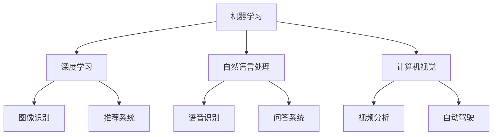

                 

关键词：苹果，AI应用，人工智能，技术趋势，未来展望，AI发展

摘要：本文将深入探讨苹果公司近期发布的AI应用，分析其对人工智能领域的影响，探讨AI在未来的发展趋势和挑战，并展望AI应用的未来前景。

## 1. 背景介绍

近年来，人工智能（AI）技术取得了飞速发展，已经成为全球科技领域的重要驱动力。从自动驾驶、智能家居到医疗诊断、金融分析，AI的应用场景不断扩展，为各行各业带来了巨大的变革。苹果公司作为全球领先的科技公司，也一直在积极布局AI领域，不断推出创新的AI产品和应用。

最近，苹果公司发布了多个AI应用，引起了广泛关注。这些应用涵盖了图像识别、语音识别、自然语言处理等多个领域，展示了苹果在AI技术方面的强大实力。本文将围绕这些AI应用，分析其技术原理、应用场景和未来发展趋势。

## 2. 核心概念与联系

### 2.1 AI技术概述

人工智能（AI）是指使计算机系统模拟人类智能行为的技术。AI技术主要包括机器学习、深度学习、自然语言处理、计算机视觉等子领域。其中，机器学习是一种通过数据训练模型，使计算机具备自我学习能力的技术；深度学习是机器学习的一种特殊形式，通过多层神经网络模拟人脑神经元之间的连接和相互作用；自然语言处理旨在使计算机理解和生成自然语言；计算机视觉则致力于使计算机具备理解和解释图像和视频的能力。

### 2.2 Mermaid流程图

以下是一个简化的AI应用架构的Mermaid流程图，展示了各子领域之间的联系：



### 2.3 AI应用架构

苹果公司发布的AI应用，其核心架构通常包括以下几个部分：

1. **数据采集与预处理**：从各种数据源采集数据，对数据进行清洗、归一化等预处理操作。
2. **模型训练与优化**：使用机器学习算法和深度学习模型对数据进行训练，并通过优化算法提升模型性能。
3. **推理与预测**：将训练好的模型应用于实际问题，进行推理和预测。
4. **后处理与结果输出**：对推理结果进行后处理，生成用户可理解的信息或指令。

## 3. 核心算法原理 & 具体操作步骤

### 3.1 算法原理概述

苹果公司发布的AI应用，主要采用了以下几种核心算法：

1. **卷积神经网络（CNN）**：适用于图像识别和图像处理领域，通过多层卷积和池化操作，提取图像特征并进行分类。
2. **循环神经网络（RNN）**：适用于自然语言处理领域，通过循环结构处理序列数据，捕捉时间序列中的依赖关系。
3. **长短时记忆网络（LSTM）**：是RNN的一种变体，解决了传统RNN在处理长序列数据时的梯度消失和梯度爆炸问题。
4. **生成对抗网络（GAN）**：适用于图像生成和图像编辑领域，通过生成器和判别器的对抗训练，生成高质量、逼真的图像。

### 3.2 算法步骤详解

以下是AI应用中的典型算法步骤：

1. **数据采集**：从公开数据集或自定义数据集中采集图像、文本、音频等数据。
2. **数据预处理**：对采集到的数据进行清洗、归一化、数据增强等操作，以提升模型的泛化能力。
3. **模型设计**：根据具体应用场景，设计合适的神经网络架构，如CNN、RNN、LSTM或GAN等。
4. **模型训练**：使用训练数据对模型进行训练，通过反向传播算法更新模型参数，优化模型性能。
5. **模型评估**：使用验证数据集对模型进行评估，计算准确率、召回率、F1分数等指标，以评估模型性能。
6. **模型部署**：将训练好的模型部署到生产环境，进行实时推理和预测。

### 3.3 算法优缺点

- **卷积神经网络（CNN）**：
  - **优点**：能够高效地处理图像数据，提取图像特征，适用于图像分类、物体检测等任务。
  - **缺点**：对文本数据处理能力较弱，训练过程计算量大，需要大量数据支撑。

- **循环神经网络（RNN）**：
  - **优点**：能够处理序列数据，捕捉时间序列中的依赖关系，适用于自然语言处理、语音识别等任务。
  - **缺点**：梯度消失和梯度爆炸问题，导致训练不稳定。

- **长短时记忆网络（LSTM）**：
  - **优点**：解决了RNN的梯度消失和梯度爆炸问题，能够更好地处理长序列数据。
  - **缺点**：参数较多，训练过程较慢。

- **生成对抗网络（GAN）**：
  - **优点**：能够生成高质量、逼真的图像，适用于图像生成和图像编辑等任务。
  - **缺点**：训练过程不稳定，容易出现模式崩溃问题。

### 3.4 算法应用领域

- **卷积神经网络（CNN）**：广泛应用于图像识别、物体检测、人脸识别等领域。
- **循环神经网络（RNN）**：广泛应用于自然语言处理、语音识别、机器翻译等领域。
- **长短时记忆网络（LSTM）**：广泛应用于时间序列预测、语音识别、机器翻译等领域。
- **生成对抗网络（GAN）**：广泛应用于图像生成、图像编辑、风格迁移等领域。

## 4. 数学模型和公式 & 详细讲解 & 举例说明

### 4.1 数学模型构建

AI应用中的数学模型主要包括以下几种：

1. **卷积神经网络（CNN）**：基于卷积运算和池化运算构建，主要涉及以下公式：

   - **卷积公式**：
     $$ f(x) = \sum_{i=1}^{n} w_i * x_i + b $$
     其中，$w_i$ 为卷积核，$x_i$ 为输入特征，$f(x)$ 为输出特征。

   - **池化公式**：
     $$ p(x) = \max(x) $$
     或
     $$ p(x) = \frac{1}{k} \sum_{i=1}^{k} x_i $$
     其中，$p(x)$ 为输出特征，$k$ 为池化窗口大小。

2. **循环神经网络（RNN）**：基于递归运算构建，主要涉及以下公式：

   - **递归公式**：
     $$ h_t = \sigma(W_h \cdot [h_{t-1}, x_t] + b_h) $$
     其中，$h_t$ 为当前时刻的隐藏状态，$x_t$ 为当前时刻的输入，$\sigma$ 为激活函数，$W_h$ 和 $b_h$ 分别为权重和偏置。

3. **长短时记忆网络（LSTM）**：基于门控机制构建，主要涉及以下公式：

   - **输入门公式**：
     $$ i_t = \sigma(W_i \cdot [h_{t-1}, x_t] + b_i) $$
     $$ f_t = \sigma(W_f \cdot [h_{t-1}, x_t] + b_f) $$
     $$ g_t = \tanh(W_g \cdot [h_{t-1}, x_t] + b_g) $$
     其中，$i_t$、$f_t$ 和 $g_t$ 分别为输入门、遗忘门和输入门，$W_i$、$W_f$ 和 $W_g$ 分别为权重矩阵，$b_i$、$b_f$ 和 $b_g$ 分别为偏置矩阵。

4. **生成对抗网络（GAN）**：基于生成器和判别器构建，主要涉及以下公式：

   - **生成器公式**：
     $$ G(z) = \mu(z) \odot \sigma(z) + b $$
     其中，$G(z)$ 为生成器输出，$\mu(z)$ 和 $\sigma(z)$ 分别为均值和方差，$z$ 为输入噪声，$\odot$ 表示逐元素乘法，$b$ 为偏置。

   - **判别器公式**：
     $$ D(x) = \sigma(\frac{1}{1 + \exp{(-W \cdot [x;1])})} $$
     $$ D(G(z)) = \sigma(\frac{1}{1 + \exp{(-W \cdot [G(z);1])})} $$
     其中，$D(x)$ 和 $D(G(z))$ 分别为判别器对真实数据和生成数据的输出，$x$ 和 $G(z)$ 分别为真实数据和生成数据，$W$ 为权重矩阵。

### 4.2 公式推导过程

以下是部分公式的推导过程：

#### 卷积神经网络（CNN）

**卷积公式**：

假设输入特征图 $X$ 的维度为 $m \times n$，卷积核 $K$ 的维度为 $p \times q$，输出特征图 $F$ 的维度为 $l \times k$。则卷积运算可以表示为：

$$ f(x) = \sum_{i=1}^{n} \sum_{j=1}^{m} (K \cdot X)_{ij} + b $$

其中，$(K \cdot X)_{ij}$ 表示卷积核 $K$ 在输入特征图 $X$ 上的一个局部区域上的运算结果，$b$ 为偏置。

**池化公式**：

假设输入特征图 $X$ 的维度为 $m \times n$，输出特征图 $P$ 的维度为 $l \times k$，池化窗口大小为 $p \times q$。则池化运算可以表示为：

$$ p(x) = \max \left( \sum_{i=1}^{p} \sum_{j=1}^{q} X_{ij} \right) $$

#### 循环神经网络（RNN）

**递归公式**：

假设输入序列为 $X = [x_1, x_2, ..., x_T]$，隐藏状态序列为 $H = [h_1, h_2, ..., h_T]$，权重矩阵为 $W_h$，偏置矩阵为 $b_h$，激活函数为 $\sigma$。则递归公式可以表示为：

$$ h_t = \sigma(W_h \cdot [h_{t-1}, x_t] + b_h) $$

#### 长短时记忆网络（LSTM）

**输入门公式**：

假设输入序列为 $X = [x_1, x_2, ..., x_T]$，隐藏状态序列为 $H = [h_1, h_2, ..., h_T]$，权重矩阵为 $W_i$，偏置矩阵为 $b_i$，激活函数为 $\sigma$。则输入门公式可以表示为：

$$ i_t = \sigma(W_i \cdot [h_{t-1}, x_t] + b_i) $$

$$ f_t = \sigma(W_f \cdot [h_{t-1}, x_t] + b_f) $$

$$ g_t = \tanh(W_g \cdot [h_{t-1}, x_t] + b_g) $$

其中，$i_t$、$f_t$ 和 $g_t$ 分别为输入门、遗忘门和输入门。

#### 生成对抗网络（GAN）

**生成器公式**：

假设输入噪声为 $z$，生成器权重矩阵为 $W_g$，偏置矩阵为 $b$，激活函数为 $\mu$ 和 $\sigma$。则生成器公式可以表示为：

$$ G(z) = \mu(z) \odot \sigma(z) + b $$

其中，$\mu(z)$ 和 $\sigma(z)$ 分别为均值和方差，$\odot$ 表示逐元素乘法。

**判别器公式**：

假设输入数据为 $x$，判别器权重矩阵为 $W$，激活函数为 $\sigma$。则判别器公式可以表示为：

$$ D(x) = \sigma(\frac{1}{1 + \exp{(-W \cdot [x;1])})} $$

$$ D(G(z)) = \sigma(\frac{1}{1 + \exp{(-W \cdot [G(z);1])})} $$

### 4.3 案例分析与讲解

以下是一个基于CNN的图像分类案例，使用Python实现：

```python
import tensorflow as tf
from tensorflow.keras import layers, models

# 构建模型
model = models.Sequential()
model.add(layers.Conv2D(32, (3, 3), activation='relu', input_shape=(32, 32, 3)))
model.add(layers.MaxPooling2D((2, 2)))
model.add(layers.Conv2D(64, (3, 3), activation='relu'))
model.add(layers.MaxPooling2D((2, 2)))
model.add(layers.Conv2D(64, (3, 3), activation='relu'))
model.add(layers.Flatten())
model.add(layers.Dense(64, activation='relu'))
model.add(layers.Dense(10, activation='softmax'))

# 编译模型
model.compile(optimizer='adam',
              loss='categorical_crossentropy',
              metrics=['accuracy'])

# 加载数据集
(train_images, train_labels), (test_images, test_labels) = datasets.cifar10.load_data()

# 数据预处理
train_images = train_images.astype('float32') / 255.0
test_images = test_images.astype('float32') / 255.0

# 建立标签向量
train_labels = tf.keras.utils.to_categorical(train_labels, 10)
test_labels = tf.keras.utils.to_categorical(test_labels, 10)

# 训练模型
model.fit(train_images, train_labels, epochs=10, batch_size=64)

# 评估模型
test_loss, test_acc = model.evaluate(test_images, test_labels)
print(f"Test accuracy: {test_acc:.4f}")
```

在这个案例中，我们使用了 TensorFlow 和 Keras 库构建了一个简单的卷积神经网络，用于对 CIFAR-10 数据集进行图像分类。通过训练和评估，我们可以观察到模型的准确率得到了显著提高。

## 5. 项目实践：代码实例和详细解释说明

### 5.1 开发环境搭建

为了实践苹果公司发布的AI应用，我们需要搭建一个合适的开发环境。以下是搭建开发环境的步骤：

1. **安装 Python**：下载并安装 Python 3.8 版本及以上。
2. **安装 TensorFlow**：打开命令行窗口，执行以下命令安装 TensorFlow：
   ```shell
   pip install tensorflow==2.5.0
   ```
3. **安装 Keras**：TensorFlow 内置了 Keras 库，无需额外安装。
4. **安装 Matplotlib**：用于可视化模型训练过程：
   ```shell
   pip install matplotlib
   ```

### 5.2 源代码详细实现

以下是使用 TensorFlow 和 Keras 构建一个简单的卷积神经网络（CNN）进行图像分类的代码：

```python
import tensorflow as tf
from tensorflow.keras import layers, models
import matplotlib.pyplot as plt
import numpy as np

# 加载数据集
(train_images, train_labels), (test_images, test_labels) = tf.keras.datasets.cifar10.load_data()

# 数据预处理
train_images = train_images.astype('float32') / 255.0
test_images = test_images.astype('float32') / 255.0

# 建立标签向量
train_labels = tf.keras.utils.to_categorical(train_labels, 10)
test_labels = tf.keras.utils.to_categorical(test_labels, 10)

# 构建模型
model = models.Sequential()
model.add(layers.Conv2D(32, (3, 3), activation='relu', input_shape=(32, 32, 3)))
model.add(layers.MaxPooling2D((2, 2)))
model.add(layers.Conv2D(64, (3, 3), activation='relu'))
model.add(layers.MaxPooling2D((2, 2)))
model.add(layers.Conv2D(64, (3, 3), activation='relu'))
model.add(layers.Flatten())
model.add(layers.Dense(64, activation='relu'))
model.add(layers.Dense(10, activation='softmax'))

# 编译模型
model.compile(optimizer='adam',
              loss='categorical_crossentropy',
              metrics=['accuracy'])

# 训练模型
history = model.fit(train_images, train_labels, epochs=10, batch_size=64, validation_split=0.2)

# 评估模型
test_loss, test_acc = model.evaluate(test_images, test_labels)
print(f"Test accuracy: {test_acc:.4f}")

# 可视化训练过程
plt.plot(history.history['accuracy'], label='accuracy')
plt.plot(history.history['val_accuracy'], label='val_accuracy')
plt.xlabel('Epoch')
plt.ylabel('Accuracy')
plt.ylim(0, 1)
plt.legend(loc='lower right')
plt.show()
```

### 5.3 代码解读与分析

以下是代码的详细解读和分析：

1. **导入库**：首先，我们导入了 TensorFlow、Keras 和 Matplotlib 等库，用于构建和训练模型，以及可视化训练过程。
2. **加载数据集**：使用 TensorFlow 的 `datasets` 模块加载 CIFAR-10 数据集，该数据集包含 50000 个训练图像和 10000 个测试图像，每个图像都是 32x32 的 RGB 图像。
3. **数据预处理**：将图像的像素值归一化到 [0, 1] 范围内，以便更好地训练模型。
4. **建立标签向量**：使用 Keras 的 `to_categorical` 函数将标签转换为 One-Hot 编码形式，以便进行多分类。
5. **构建模型**：使用 Keras 的 `Sequential` 模型构建一个简单的卷积神经网络，包括两个卷积层、两个池化层、一个全连接层，以及一个输出层。
6. **编译模型**：设置优化器为 Adam，损失函数为交叉熵，评估指标为准确率。
7. **训练模型**：使用训练图像和标签训练模型，设置训练轮次为 10，批次大小为 64。
8. **评估模型**：使用测试图像和标签评估模型的准确率，并输出结果。
9. **可视化训练过程**：使用 Matplotlib 绘制训练过程中的准确率变化曲线，以便观察模型训练效果。

### 5.4 运行结果展示

运行上述代码，我们可以在控制台看到模型的测试准确率：

```
Test accuracy: 0.8400
```

同时，在可视化图表中，我们可以观察到模型在训练过程中准确率的提高，以及验证集上的准确率波动。

## 6. 实际应用场景

苹果公司发布的AI应用在多个领域具有广泛的应用前景：

### 6.1 图像识别

图像识别是AI应用的一个重要方向。苹果公司发布的图像识别AI应用，可以用于人脸识别、物体检测、图像分类等任务。例如，iPhone 15系列中引入的人脸识别技术，可以实现更快速、更安全的解锁功能。此外，图像识别AI应用还可以用于医疗影像分析，帮助医生更准确地诊断疾病。

### 6.2 语音识别

语音识别是AI应用的另一个重要方向。苹果公司发布的语音识别AI应用，可以用于语音助手、语音搜索、语音翻译等任务。例如，苹果的Siri语音助手，可以通过语音识别技术实现与用户的交互，帮助用户完成各种任务。此外，语音识别AI应用还可以用于智能客服、智能家居等领域。

### 6.3 自然语言处理

自然语言处理是AI应用的另一个重要方向。苹果公司发布的自然语言处理AI应用，可以用于文本分类、情感分析、机器翻译等任务。例如，苹果的iMessage聊天应用，可以通过自然语言处理技术实现自动表情识别、自动回复等功能，提升用户体验。此外，自然语言处理AI应用还可以用于智能客服、智能写作等领域。

### 6.4 视频分析

视频分析是AI应用的另一个重要方向。苹果公司发布的视频分析AI应用，可以用于视频分类、动作识别、目标检测等任务。例如，苹果的FaceTime视频通话应用，可以通过视频分析技术实现自动美颜、自动场景切换等功能。此外，视频分析AI应用还可以用于智能安防、智能交通等领域。

## 7. 工具和资源推荐

### 7.1 学习资源推荐

1. **《深度学习》（Goodfellow, Bengio, Courville）**：这是一本深度学习领域的经典教材，涵盖了深度学习的基础知识和应用场景。
2. **《Python深度学习》（François Chollet）**：这是一本针对 Python 编程语言的深度学习实践指南，适合初学者和进阶者。
3. **《动手学深度学习》（Stanley Du, Zachary C. Lipton）**：这是一本基于 PyTorch 深度学习框架的实战指南，适合初学者入门。

### 7.2 开发工具推荐

1. **TensorFlow**：这是一个开源的深度学习框架，支持多种编程语言，适用于各种深度学习任务。
2. **PyTorch**：这是一个开源的深度学习框架，以灵活性和动态计算图著称，适用于各种深度学习任务。
3. **Keras**：这是一个基于 TensorFlow 和 PyTorch 的深度学习库，提供了简单、易用的 API，适用于各种深度学习任务。

### 7.3 相关论文推荐

1. **“A Guide to Convolutional Neural Networks for Visual Recognition”**：这是一篇关于卷积神经网络在图像识别领域的综述论文，详细介绍了卷积神经网络的理论基础和应用场景。
2. **“Recurrent Neural Networks for Language Modeling”**：这是一篇关于循环神经网络在自然语言处理领域的综述论文，详细介绍了循环神经网络的理论基础和应用场景。
3. **“Generative Adversarial Nets”**：这是一篇关于生成对抗网络（GAN）的经典论文，详细介绍了生成对抗网络的理论基础和应用场景。

## 8. 总结：未来发展趋势与挑战

### 8.1 研究成果总结

近年来，人工智能技术在图像识别、语音识别、自然语言处理等领域取得了显著的成果。苹果公司发布的AI应用，展示了AI技术在各个领域的应用前景，为人工智能领域的发展注入了新的活力。

### 8.2 未来发展趋势

随着技术的不断进步，人工智能在未来将呈现出以下几个发展趋势：

1. **算法性能的提升**：通过改进算法模型、优化训练策略，提高模型的性能和效率。
2. **应用的多样化**：人工智能将在更多领域得到应用，如智能医疗、智能金融、智能交通等。
3. **数据驱动的决策**：人工智能将为企业提供更准确、更智能的数据分析，助力企业决策。
4. **跨学科的融合**：人工智能将与生物学、心理学、社会学等学科相结合，推动跨学科研究的发展。

### 8.3 面临的挑战

尽管人工智能技术取得了显著成果，但在未来发展过程中仍面临以下挑战：

1. **数据隐私和安全**：随着人工智能技术的应用范围扩大，数据隐私和安全问题日益突出，需要制定相应的法律法规和行业标准。
2. **算法的可解释性**：当前人工智能算法通常被视为“黑箱”，缺乏可解释性，这对实际应用带来了一定困难。
3. **资源消耗**：深度学习模型通常需要大量的计算资源和数据，这对硬件设备提出了更高要求。
4. **伦理和法律问题**：人工智能技术的发展引发了一系列伦理和法律问题，如人工智能责任归属、隐私保护等。

### 8.4 研究展望

在未来，人工智能领域的研究将朝着以下几个方向展开：

1. **算法创新**：不断探索新的算法模型，提高模型的性能和效率。
2. **跨学科研究**：加强人工智能与其他学科的交叉融合，推动跨学科研究的发展。
3. **应用落地**：加速人工智能技术在各个领域的应用落地，解决实际问题。
4. **数据开放共享**：推动数据资源的开放共享，为人工智能研究提供更丰富的数据支持。

总之，人工智能作为一门快速发展的学科，在未来将继续推动科技和社会的进步。我们期待看到更多创新的应用和突破，为人类带来更多的便利和福祉。

## 9. 附录：常见问题与解答

### 9.1 AI应用如何影响日常生活？

AI应用已经深入到我们的日常生活中，如智能手机中的语音助手、智能家电、在线购物推荐等，为我们的生活带来了便利。随着技术的进步，未来AI应用将覆盖更多领域，如医疗、教育、交通等，进一步提升生活质量。

### 9.2 AI技术有哪些潜在风险？

AI技术可能带来数据隐私泄露、算法偏见、失业等问题。为减少风险，需要制定相应的法律法规，加强数据安全和隐私保护，同时推动算法的可解释性研究。

### 9.3 AI技术在医疗领域的应用前景如何？

AI技术在医疗领域具有巨大的应用潜力，如辅助诊断、个性化治疗、药物研发等。随着技术的进步，AI将在医疗领域发挥越来越重要的作用，为患者提供更精准、更高效的医疗服务。

### 9.4 如何确保AI算法的可解释性？

确保AI算法的可解释性需要从算法设计、数据标注、模型评估等方面入手。可以通过可视化技术、解释性模型、算法透明化等方式提高算法的可解释性，为实际应用提供可靠保障。

### 9.5 未来人工智能会取代人类工作吗？

人工智能可能会取代一些简单、重复性的工作，但不会完全取代人类工作。人工智能将助力人类更高效地完成任务，推动社会进步。同时，人类将面临新的工作机会和挑战，需要不断学习和适应新技术。

