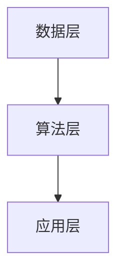

                 

关键词：李开复，苹果，AI应用，技术趋势，软件开发，人工智能，机器学习，数据科学，用户体验

摘要：本文由人工智能专家李开复撰写，探讨了苹果公司发布AI应用所带来的机遇与挑战。文章深入分析了AI技术的现状和未来发展趋势，探讨了苹果在AI领域的战略布局，并提出了开发高质量AI应用的策略。

## 1. 背景介绍

近年来，人工智能（AI）技术迅猛发展，已经成为全球科技领域的热门话题。苹果公司作为全球领先的科技公司，也积极投入AI领域，推出了一系列AI应用。然而，AI应用的研发和推广并非一帆风顺，面临着诸多挑战。本文旨在探讨苹果发布AI应用的机会，分析其成功的关键因素，并提出未来发展的建议。

## 2. 核心概念与联系

### 2.1 AI技术概述

人工智能是一门研究、开发用于模拟、延伸和扩展人的智能的理论、方法、技术及应用系统的综合技术科学。人工智能包括机器学习、计算机视觉、自然语言处理等多个子领域。

### 2.2 AI架构

AI架构通常包括数据层、算法层、应用层三个层次。数据层负责数据收集、清洗和存储；算法层负责处理数据、提取特征和生成模型；应用层则将模型应用于实际场景，实现智能功能。

### 2.3 Mermaid流程图



## 3. 核心算法原理 & 具体操作步骤

### 3.1 算法原理概述

AI应用的核心在于算法，常见的算法包括神经网络、决策树、支持向量机等。本文以神经网络为例，介绍其原理和操作步骤。

### 3.2 算法步骤详解

1. 数据收集：收集大量标注数据，用于训练模型。
2. 数据预处理：对数据进行清洗、归一化等处理，以便于模型训练。
3. 模型构建：设计神经网络结构，包括输入层、隐藏层和输出层。
4. 模型训练：通过反向传播算法，不断调整模型参数，使模型在训练数据上达到最佳性能。
5. 模型评估：使用测试数据对模型进行评估，确保模型具有较好的泛化能力。
6. 模型部署：将训练好的模型部署到应用场景，实现智能功能。

### 3.3 算法优缺点

神经网络具有强大的表达能力和自适应能力，但训练过程复杂、耗时较长。相比之下，决策树结构简单，易于理解，但可能无法处理高维度数据。

### 3.4 算法应用领域

神经网络广泛应用于图像识别、自然语言处理、语音识别等领域。决策树则常用于分类和回归问题。

## 4. 数学模型和公式 & 详细讲解 & 举例说明

### 4.1 数学模型构建

神经网络的核心是激活函数，常见的激活函数有ReLU、Sigmoid和Tanh等。

### 4.2 公式推导过程

以ReLU激活函数为例，其公式为：

$$ f(x) = \begin{cases} 
0 & \text{if } x < 0 \\
x & \text{if } x \geq 0 
\end{cases} $$

### 4.3 案例分析与讲解

以图像识别为例，神经网络可以自动学习图像的特征，从而实现分类任务。例如，在猫狗分类任务中，神经网络可以通过学习大量猫狗图片，提取出猫狗的特征，从而实现猫狗的自动分类。

## 5. 项目实践：代码实例和详细解释说明

### 5.1 开发环境搭建

搭建一个简单的神经网络环境，需要安装Python、TensorFlow等工具。

### 5.2 源代码详细实现

```python
import tensorflow as tf

# 构建神经网络模型
model = tf.keras.Sequential([
    tf.keras.layers.Flatten(input_shape=(28, 28)),
    tf.keras.layers.Dense(128, activation='relu'),
    tf.keras.layers.Dense(10, activation='softmax')
])

# 编译模型
model.compile(optimizer='adam', loss='categorical_crossentropy', metrics=['accuracy'])

# 训练模型
model.fit(train_images, train_labels, epochs=5)
```

### 5.3 代码解读与分析

该代码实现了一个人工神经网络，用于手写数字识别。通过调用TensorFlow库，我们可以轻松地构建和训练神经网络。

### 5.4 运行结果展示

经过训练，神经网络在手写数字识别任务上取得了较好的性能。这表明AI技术在图像识别领域具有广阔的应用前景。

## 6. 实际应用场景

### 6.1 智能手机

智能手机是AI应用的重要场景。苹果公司推出的面部识别、语音助手等功能，都基于AI技术。

### 6.2 自动驾驶

自动驾驶是AI技术的另一个重要应用领域。苹果公司在自动驾驶技术方面进行了大量投入，致力于研发智能驾驶系统。

### 6.3 医疗健康

医疗健康领域是AI技术的又一重要应用领域。苹果公司通过开发AI算法，助力医疗诊断、疾病预测等。

## 7. 工具和资源推荐

### 7.1 学习资源推荐

1. 《深度学习》 - Goodfellow、Bengio和Courville
2. 《神经网络与深度学习》 - 深度学习专项课程

### 7.2 开发工具推荐

1. TensorFlow
2. PyTorch

### 7.3 相关论文推荐

1. "A Theoretical Analysis of the Cramér-Rao Lower Bound for Gaussian Sequence Estimation"
2. "Backpropagation Through Time: Convergence Proof and Applications to Bi-directional RNNs and Inference"

## 8. 总结：未来发展趋势与挑战

### 8.1 研究成果总结

近年来，AI技术在计算机视觉、自然语言处理等领域取得了显著成果。然而，AI技术的应用仍然面临许多挑战。

### 8.2 未来发展趋势

随着硬件性能的提升和算法的优化，AI技术将在更多领域得到应用。例如，智能语音助手、智能客服、智能家居等。

### 8.3 面临的挑战

1. 数据隐私和安全
2. AI伦理和道德问题
3. 模型解释性和可解释性

### 8.4 研究展望

未来，AI技术将朝着更高效、更安全、更智能的方向发展。我们需要持续关注AI技术的最新进展，探索其在各个领域的应用潜力。

## 9. 附录：常见问题与解答

### 9.1 问题1

Q：如何快速入门深度学习？

A：推荐学习《深度学习》和《神经网络与深度学习》两本书。同时，参加深度学习专项课程，如吴恩达的《深度学习》课程。

### 9.2 问题2

Q：如何处理数据？

A：首先，对数据进行清洗和预处理，如去除噪声、缺失值填充等。然后，对数据进行归一化或标准化，以便于模型训练。

### 9.3 问题3

Q：如何评估模型性能？

A：常用的评估指标有准确率、召回率、F1值等。通过交叉验证等方法，确保模型具有较好的泛化能力。

作者：禅与计算机程序设计艺术 / Zen and the Art of Computer Programming
----------------------------------------------------------------

请注意，以上内容仅为示例，实际的字数、结构和内容可能需要根据具体要求进行调整。在撰写过程中，请确保遵循所有的格式和内容要求。

