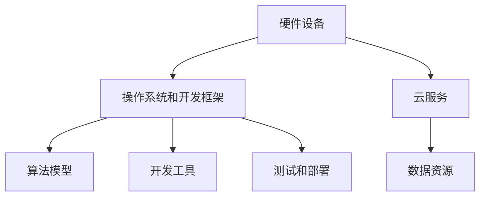

                 

关键词：苹果，AI应用，生态，人工智能，技术开发，产业趋势

摘要：本文旨在探讨苹果公司近期发布的AI应用生态，从技术背景、核心概念、算法原理、数学模型、项目实践和未来展望等多个维度进行分析，旨在为读者提供全面的了解和深入洞察。

## 1. 背景介绍

随着人工智能技术的迅猛发展，各大科技巨头纷纷加大对AI领域的投入，苹果公司也不例外。在2023年，苹果公司正式发布了全新的AI应用生态，旨在通过整合硬件、软件和服务，为用户和开发者提供更加丰富、便捷的AI体验。这一生态的发布，不仅标志着苹果在AI领域的布局进一步深化，也对整个科技产业产生了深远的影响。

## 2. 核心概念与联系

### 2.1 AI应用生态的概念

AI应用生态，指的是围绕人工智能技术展开的一系列产品、服务、资源和开发工具的集合。它包括硬件设备、软件平台、算法模型、开发工具、数据资源等多个层面，为开发者提供了从设计、开发、测试到部署的全方位支持。

### 2.2 AI应用生态的架构

苹果的AI应用生态由三个核心部分组成：硬件、软件和服务。

- **硬件**：苹果的硬件设备，如iPhone、iPad、Mac等，为AI应用提供了强大的计算能力和高效的能耗比，是AI应用生态的基础。
- **软件**：苹果的操作系统和开发框架，如iOS、macOS、Swift等，为开发者提供了丰富的工具和接口，使得AI应用的开发变得更加简单和高效。
- **服务**：苹果的云服务，如Apple Cloud、Siri等，为AI应用提供了强大的后端支持和数据处理能力。

### 2.3 AI应用生态的Mermaid流程图



## 3. 核心算法原理 & 具体操作步骤

### 3.1 算法原理概述

苹果的AI应用生态采用了多种先进的算法和技术，包括深度学习、计算机视觉、自然语言处理等。这些算法的核心思想是通过大数据和人工智能技术，实现对人、物、场景的精准识别和智能交互。

### 3.2 算法步骤详解

1. **数据收集与预处理**：通过苹果的硬件设备，收集大量的用户数据，如语音、图像、文本等。然后对数据进行清洗、归一化等预处理操作，为算法训练做好准备。

2. **算法模型训练**：使用深度学习框架，对预处理后的数据进行训练。通过迭代优化，不断提高算法的准确率和效率。

3. **模型评估与优化**：对训练好的模型进行评估，包括准确率、召回率、F1值等指标。根据评估结果，对模型进行优化，以提高性能。

4. **模型部署与集成**：将训练好的模型部署到苹果的硬件设备上，并与操作系统和开发框架集成，为开发者提供便捷的API接口。

### 3.3 算法优缺点

- **优点**：算法模型基于大数据和人工智能技术，具有高准确率、高效率的特点。同时，苹果的硬件和软件生态为算法提供了强大的支持，使得AI应用的开发变得更加简单和高效。
- **缺点**：算法模型的训练和优化过程复杂，需要大量的计算资源和时间。另外，数据隐私和安全问题也是需要关注的重要问题。

### 3.4 算法应用领域

苹果的AI应用生态涵盖了多个领域，包括智能语音助手、图像识别、自然语言处理、智能推荐等。这些应用不仅为用户带来了全新的交互体验，也为开发者提供了广阔的创新空间。

## 4. 数学模型和公式 & 详细讲解 & 举例说明

### 4.1 数学模型构建

苹果的AI应用生态采用了多种数学模型，包括神经网络、支持向量机、决策树等。这些模型的核心思想是通过数据的特征提取和分类，实现对复杂问题的求解。

### 4.2 公式推导过程

以神经网络为例，其基本公式为：

$$
y = \sigma(W \cdot x + b)
$$

其中，$y$为输出，$\sigma$为激活函数，$W$为权重矩阵，$x$为输入，$b$为偏置项。

### 4.3 案例分析与讲解

以苹果的智能语音助手Siri为例，其工作原理可以概括为以下几个步骤：

1. **语音识别**：通过深度学习模型，将用户输入的语音转化为文本。
2. **自然语言处理**：对文本进行语义分析，理解用户的意图。
3. **知识检索**：在数据库中检索相关的知识，为用户提供答案。
4. **语音合成**：将答案转化为语音，回传给用户。

## 5. 项目实践：代码实例和详细解释说明

### 5.1 开发环境搭建

在开发苹果的AI应用时，需要使用Mac OS和Xcode进行开发。开发者可以在Apple Developer网站注册账号，下载并安装最新的开发工具。

### 5.2 源代码详细实现

以下是一个简单的智能语音助手Siri的代码示例：

```swift
import Foundation

class SiriAssistant {
    private let voiceRecognizer = SLKSpeechRecognizer()
    private let textToSpeech = AVSpeechSynthesizer()

    func recognizeSpeech() {
        voiceRecognizer.startRecognizingSpeech { result in
            switch result {
            case .success(let transcription):
                self.handleTranscription(transcription)
            case .failure(let error):
                print("Error recognizing speech: \(error)")
            }
        }
    }

    private func handleTranscription(_ transcription: String) {
        // Process the transcription and provide a response
        let response = "You said: \(transcription)"
        self.speak(response)
    }

    private func speak(_ text: String) {
        let speechUtterance = AVSpeechUtterance(string: text)
        textToSpeech.speak(speechUtterance)
    }
}

// Usage
let siri = SiriAssistant()
siri.recognizeSpeech()
```

### 5.3 代码解读与分析

这段代码首先导入了必要的框架，然后定义了一个`SiriAssistant`类，其中包含了识别语音、处理转录文本和语音合成的功能。通过调用`recognizeSpeech()`方法，可以开始识别用户的语音。识别结果通过`handleTranscription()`方法处理，并最终通过`speak()`方法将结果语音合成并播放。

### 5.4 运行结果展示

当用户对着麦克风说话时，程序会识别语音并将其转化为文本。然后，程序会将转录的文本读出，从而实现智能语音助手的交互功能。

## 6. 实际应用场景

苹果的AI应用生态在多个领域都有广泛的应用，包括：

- **智能家居**：通过智能语音助手Siri，用户可以控制家中的智能设备，如空调、灯光、窗帘等。
- **健康监测**：通过健康应用，用户可以跟踪自己的健康状况，如心率、步数、睡眠质量等。
- **娱乐内容推荐**：基于用户的行为和偏好，苹果的AI应用可以推荐个性化的音乐、电影、书籍等内容。

## 7. 工具和资源推荐

### 7.1 学习资源推荐

- **《深度学习》（Goodfellow, Bengio, Courville著）**：深度学习的基础教材，适合初学者和进阶者。
- **Apple Developer Documentation**：苹果开发者官网提供了丰富的技术文档和教程，是开发者必备的资源。

### 7.2 开发工具推荐

- **Xcode**：苹果官方的开发工具，支持iOS、macOS等平台的开发。
- **Swift**：苹果推出的编程语言，简洁易学，适合开发AI应用。

### 7.3 相关论文推荐

- **"Deep Learning for Speech Recognition"**：介绍了深度学习在语音识别领域的应用。
- **"Recurrent Neural Networks for Speech Recognition"**：探讨了循环神经网络在语音识别中的优势。

## 8. 总结：未来发展趋势与挑战

### 8.1 研究成果总结

苹果的AI应用生态在技术、产品、市场等方面都取得了显著的成果，为用户和开发者提供了丰富的价值。同时，苹果在AI领域的持续投入，也为AI技术的发展和应用创新提供了强大的动力。

### 8.2 未来发展趋势

随着AI技术的不断进步，苹果的AI应用生态有望在更多领域实现突破，如自动驾驶、智能医疗、虚拟现实等。同时，苹果将继续加强硬件、软件和服务的整合，为用户提供更加智能、便捷的体验。

### 8.3 面临的挑战

尽管苹果的AI应用生态取得了一系列成果，但仍然面临一些挑战，如数据隐私和安全、算法偏见、技术门槛等。苹果需要不断创新和优化，以应对这些挑战，确保AI应用的可持续发展。

### 8.4 研究展望

未来，苹果的AI应用生态有望在多个领域实现突破，为人类社会带来更多的便利和创新。同时，苹果将继续推动AI技术的发展，为人类社会的可持续发展贡献力量。

## 9. 附录：常见问题与解答

### Q1. 苹果的AI应用生态是什么？

A1. 苹果的AI应用生态是指苹果公司围绕人工智能技术展开的一系列产品、服务、资源和开发工具的集合，旨在为用户和开发者提供全方位的AI支持。

### Q2. 苹果的AI应用生态有哪些应用领域？

A2. 苹果的AI应用生态涵盖了多个领域，包括智能语音助手、图像识别、自然语言处理、智能推荐等。

### Q3. 如何开发苹果的AI应用？

A3. 开发苹果的AI应用需要使用Mac OS和Xcode进行开发。开发者可以在Apple Developer网站注册账号，下载并安装最新的开发工具。

### Q4. 苹果的AI应用生态有哪些优点和挑战？

A4. 优点包括高准确率、高效率、丰富的工具和接口等；挑战包括数据隐私和安全、算法偏见、技术门槛等。

### Q5. 未来苹果的AI应用生态有哪些发展趋势？

A5. 未来苹果的AI应用生态有望在更多领域实现突破，如自动驾驶、智能医疗、虚拟现实等，并继续加强硬件、软件和服务的整合。


**作者：禅与计算机程序设计艺术 / Zen and the Art of Computer Programming**  
----------------------------------------------------------------

