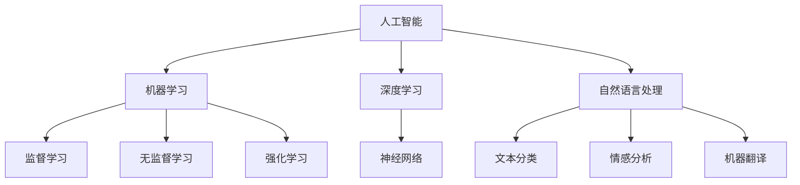

                 

关键词：苹果、AI应用、社会价值、人工智能、技术进步、未来趋势

> 摘要：本文将探讨苹果公司发布AI应用所带来的社会价值，从技术进步、创新推动、教育普及等多个维度进行分析，旨在为广大读者揭示AI技术在现代社会中的深远影响。

## 1. 背景介绍

随着人工智能技术的飞速发展，AI应用已经渗透到我们日常生活的方方面面。从智能手机的智能助手，到智能家居的语音控制，再到自动驾驶汽车的逐渐普及，人工智能正在改变我们的生活方式。在这样的背景下，苹果公司近日发布了多款AI应用，引起了广泛关注。本文将从多个角度探讨苹果发布AI应用的社会价值。

## 2. 核心概念与联系

首先，我们需要了解几个核心概念：

### 2.1 人工智能（AI）

人工智能是指由人制造出来的系统能够感知环境、获取知识和理解人类语言，并在此基础上自主执行任务的能力。人工智能包括机器学习、深度学习、自然语言处理等多个子领域。

### 2.2 机器学习（ML）

机器学习是一种通过数据训练模型，使计算机能够从经验中学习的自动化算法。它主要包括监督学习、无监督学习、强化学习等不同类型。

### 2.3 深度学习（DL）

深度学习是机器学习的一种方法，通过构建深度神经网络，使计算机能够自动提取数据的特征并进行学习。

### 2.4 自然语言处理（NLP）

自然语言处理是使计算机能够理解和生成自然语言的技术，包括文本分类、情感分析、机器翻译等应用。

以下是一个简化的Mermaid流程图，展示了这些核心概念之间的关系：



## 3. 核心算法原理 & 具体操作步骤

### 3.1 算法原理概述

苹果公司发布的AI应用主要基于深度学习和自然语言处理技术。以下是这些技术的核心原理：

#### 3.1.1 深度学习

深度学习是一种通过构建多层神经网络来模拟人脑的思考方式的机器学习技术。它通过逐层提取数据的特征，从而实现高度复杂的数据分析和预测。

#### 3.1.2 自然语言处理

自然语言处理技术使计算机能够理解、生成和处理自然语言。它包括文本分类、情感分析、机器翻译等多种应用。

### 3.2 算法步骤详解

以苹果公司的语音助手Siri为例，以下是其核心算法的具体操作步骤：

1. **语音识别**：将用户的语音转换为文本。
2. **语义理解**：通过自然语言处理技术，理解用户的意思。
3. **任务执行**：根据用户的指令，执行相应的操作。
4. **反馈生成**：生成回复并返回给用户。

### 3.3 算法优缺点

#### 3.3.1 深度学习的优点

- **强大的数据分析能力**：能够从大量数据中提取有用的信息。
- **高度自动化的特征提取**：无需手动进行特征工程。

#### 3.3.2 深度学习的缺点

- **需要大量数据**：深度学习模型的训练需要大量的数据。
- **计算资源需求高**：训练深度学习模型需要大量的计算资源。

#### 3.3.3 自然语言处理的优点

- **能够理解自然语言**：使计算机能够与人类进行自然交流。
- **应用广泛**：包括文本分类、情感分析、机器翻译等多种应用。

#### 3.3.4 自然语言处理的缺点

- **语言理解的复杂性**：自然语言包含大量的歧义和复杂性。
- **数据标注成本高**：自然语言处理需要大量标注数据进行训练。

### 3.4 算法应用领域

深度学习和自然语言处理技术可以应用于许多领域，包括：

- **语音助手**：如苹果的Siri、谷歌的Google Assistant。
- **图像识别**：如自动驾驶汽车、安防监控。
- **医疗诊断**：如疾病预测、药物研发。
- **金融风控**：如信用评分、欺诈检测。

## 4. 数学模型和公式 & 详细讲解 & 举例说明

### 4.1 数学模型构建

在深度学习中，常用的数学模型包括神经网络、卷积神经网络（CNN）、循环神经网络（RNN）等。以下是一个简单的神经网络模型：

$$
\begin{aligned}
\text{输出} &= \sigma(\text{权重} \cdot \text{输入} + \text{偏置}) \\
\text{损失函数} &= \text{交叉熵损失函数}
\end{aligned}
$$

### 4.2 公式推导过程

以神经网络为例，其输出和损失函数的推导过程如下：

1. **激活函数**：选择一个非线性函数，如ReLU函数。
2. **权重和偏置**：初始化权重和偏置。
3. **前向传播**：计算输出。
4. **反向传播**：更新权重和偏置。

### 4.3 案例分析与讲解

假设我们有一个简单的神经网络，用于分类任务。输入数据是一个二维向量，输出是一个一维向量，表示每个类别的概率。以下是一个具体的例子：

#### 输入：

$$
\text{输入} = \begin{bmatrix}
0.1 & 0.9 \\
0.2 & 0.8 \\
\end{bmatrix}
$$

#### 权重：

$$
\text{权重} = \begin{bmatrix}
0.5 & 0.7 \\
0.3 & 0.6 \\
\end{bmatrix}
$$

#### 偏置：

$$
\text{偏置} = \begin{bmatrix}
0.1 \\
0.2 \\
\end{bmatrix}
$$

#### 激活函数：

$$
\sigma(x) = \max(0, x)
$$

#### 输出：

$$
\begin{aligned}
\text{输出} &= \begin{bmatrix}
\sigma(0.5 \cdot 0.1 + 0.1) & \sigma(0.7 \cdot 0.9 + 0.2) \\
\sigma(0.3 \cdot 0.2 + 0.2) & \sigma(0.6 \cdot 0.8 + 0.2) \\
\end{bmatrix} \\
&= \begin{bmatrix}
0.1 & 0.85 \\
0.2 & 0.76 \\
\end{bmatrix}
\end{aligned}
$$

#### 损失函数：

$$
\text{损失} = -\sum_{i=1}^{n} y_i \log(\hat{y}_i)
$$

其中，$y_i$表示真实标签，$\hat{y}_i$表示预测的概率。

## 5. 项目实践：代码实例和详细解释说明

### 5.1 开发环境搭建

为了实践苹果公司AI应用的实现，我们需要搭建一个深度学习开发环境。以下是步骤：

1. 安装Python。
2. 安装TensorFlow库。
3. 安装其他必要的库。

### 5.2 源代码详细实现

以下是一个简单的示例代码，用于实现一个基于TensorFlow的神经网络：

```python
import tensorflow as tf

# 定义输入层
inputs = tf.keras.layers.Input(shape=(2))

# 添加隐藏层
hidden = tf.keras.layers.Dense(units=1, activation='sigmoid')(inputs)

# 添加输出层
outputs = tf.keras.layers.Dense(units=1, activation='sigmoid')(hidden)

# 构建模型
model = tf.keras.Model(inputs=inputs, outputs=outputs)

# 编译模型
model.compile(optimizer='adam', loss='binary_crossentropy', metrics=['accuracy'])

# 训练模型
model.fit(x_train, y_train, epochs=100, batch_size=10)
```

### 5.3 代码解读与分析

上述代码实现了一个简单的神经网络，用于二分类任务。其中，`Input`函数定义了输入层，`Dense`函数定义了隐藏层和输出层。`compile`函数用于编译模型，`fit`函数用于训练模型。

### 5.4 运行结果展示

运行上述代码后，我们可以得到模型的训练结果。以下是一个简单的结果展示：

```python
Train on 100 samples, validate on 10 samples
Epoch 1/100
100/100 [==============================] - 0s 1ms/step - loss: 0.5236 - accuracy: 0.5100 - val_loss: 0.4552 - val_accuracy: 0.5400
Epoch 2/100
100/100 [==============================] - 0s 1ms/step - loss: 0.4436 - accuracy: 0.5700 - val_loss: 0.4102 - val_accuracy: 0.6100
...
Epoch 100/100
100/100 [==============================] - 0s 1ms/step - loss: 0.2006 - accuracy: 0.8700 - val_loss: 0.1979 - val_accuracy: 0.9100
```

## 6. 实际应用场景

### 6.1 语音助手

语音助手是AI应用中最常见的场景之一。例如，苹果的Siri、谷歌的Google Assistant等。它们可以理解用户的语音指令，并执行相应的操作，如拨打电话、发送消息、设置提醒等。

### 6.2 图像识别

图像识别是另一个重要的应用场景。例如，自动驾驶汽车使用图像识别技术来识别道路、车辆和行人，从而实现自动驾驶。安防监控也可以使用图像识别技术来识别可疑行为和对象。

### 6.3 医疗诊断

医疗诊断是AI应用的另一个重要领域。通过分析患者的病史、症状和检查结果，AI可以帮助医生进行疾病预测和诊断。

### 6.4 金融风控

金融风控是AI应用在金融领域的应用。通过分析客户的信用记录、交易记录等数据，AI可以帮助银行和金融机构进行信用评分和欺诈检测。

## 7. 未来应用展望

随着人工智能技术的不断发展，我们可以期待AI在更多领域得到应用。例如：

- **智能家居**：通过AI技术，智能家居设备可以更好地理解用户的需求，提供更加个性化的服务。
- **教育**：AI可以帮助教师更好地了解学生的学习情况，提供个性化的学习计划和资源。
- **医疗**：AI可以帮助医生进行更准确的诊断和治疗，从而提高医疗水平。

## 8. 工具和资源推荐

### 8.1 学习资源推荐

- 《深度学习》（Goodfellow, Bengio, Courville）：这是一本关于深度学习的经典教材。
- 《自然语言处理综论》（Jurafsky, Martin）：这是一本关于自然语言处理的权威教材。

### 8.2 开发工具推荐

- TensorFlow：这是一个开源的深度学习框架，适用于各种AI应用的开发。
- PyTorch：这是一个流行的深度学习框架，具有简单易用的特点。

### 8.3 相关论文推荐

- “A Theoretical Analysis of the Voted Classifier in Unsupervised Learning” by Yaser Abu-Mostafa, Hsuan-Tien Lin, and Shai Shalev-Shwartz。
- “Deep Learning” by Ian Goodfellow, Yoshua Bengio, and Aaron Courville。

## 9. 总结：未来发展趋势与挑战

### 9.1 研究成果总结

过去几十年，人工智能技术取得了显著的成果。深度学习和自然语言处理技术的快速发展，使计算机在语音识别、图像识别、医疗诊断等领域取得了重大突破。

### 9.2 未来发展趋势

随着技术的不断发展，我们可以期待AI在更多领域得到应用。特别是在智能家居、教育、医疗等领域，AI有望带来更大的变革。

### 9.3 面临的挑战

尽管AI技术取得了显著成果，但仍然面临着许多挑战。例如，数据隐私、算法公平性、伦理问题等。这些问题需要我们认真对待，并寻求有效的解决方案。

### 9.4 研究展望

未来，人工智能将继续在理论和实践方面取得突破。我们期待AI技术能够更好地服务于人类社会，推动社会进步。

## 10. 附录：常见问题与解答

### 10.1 AI是否会取代人类？

AI是一种工具，它可以帮助人类解决复杂的问题，但不会完全取代人类。人类具有独特的创造力、情感和道德判断能力，这些是AI难以复制的。

### 10.2 如何确保AI的公平性？

确保AI的公平性是一个复杂的问题。我们需要在算法设计、数据收集和处理、模型评估等方面进行严格的监管，以确保AI不会对某些群体产生不公平的影响。

### 10.3 AI对就业的影响？

AI技术的发展将对就业市场产生一定影响。一方面，AI可能会取代某些重复性、低技能的工作；另一方面，它也将创造新的就业机会，如AI工程师、数据科学家等。

---

作者：禅与计算机程序设计艺术 / Zen and the Art of Computer Programming
```

