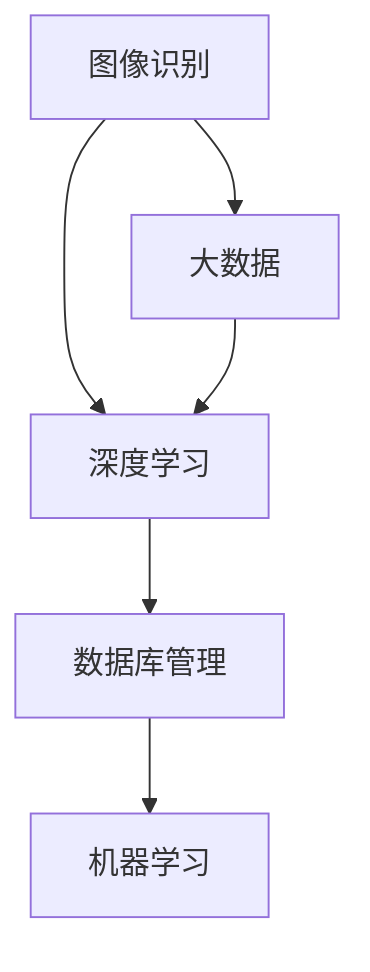

                 

李飞飞是一位在人工智能和大数据领域享有盛誉的专家。她的贡献不仅深刻地影响了学术界，也对工业界产生了深远的影响。本文将探讨李飞飞在AI大数据领域的核心贡献，分析她的工作如何推动了这一领域的发展。

## 关键词

- 李飞飞
- 人工智能
- 大数据
- 图像识别
- 深度学习
- 数据库管理
- 机器学习

## 摘要

本文旨在介绍李飞飞在人工智能和大数据领域的杰出贡献。通过对她在图像识别、深度学习、数据库管理和机器学习等方向的创新工作进行分析，我们将看到她如何通过理论和实践推动了整个领域的前进。此外，本文还将探讨李飞飞的工作对未来人工智能和大数据发展的潜在影响。

## 1. 背景介绍

李飞飞（Fei-Fei Li）是一位著名的计算机科学家，目前担任斯坦福大学计算机科学系的教授。她的研究领域广泛，包括计算机视觉、机器学习和人工智能。李飞飞在学术界和工业界都有着深远的影响力，她的贡献不仅体现在学术研究中，也体现在实际应用中。

李飞飞的职业生涯始于2005年，当时她还在斯坦福大学攻读博士学位。在她的博士研究中，她专注于图像识别和机器学习，特别是在如何通过深度学习模型提高图像识别的准确性。这一研究方向奠定了她未来在人工智能领域的基石。

在学术界，李飞飞是计算机视觉领域的权威，她领导的研究团队在多个国际竞赛中取得了优异的成绩。例如，在她的带领下，斯坦福大学的团队在ImageNet竞赛中连续三年获得冠军，这一成就极大地提升了深度学习在图像识别领域的地位。

除了学术界，李飞飞也在工业界有着广泛的影响。她是Google AI的创始人之一，并在那里领导了多个关键项目。她还在Facebook担任高级研究科学家，负责计算机视觉和机器学习方面的工作。这些经历让她能够将最新的研究成果转化为实际应用，推动了人工智能在各个行业的应用。

## 2. 核心概念与联系

李飞飞的工作涉及多个核心概念，包括图像识别、深度学习、数据库管理和机器学习。以下是一个简化的Mermaid流程图，用于说明这些概念之间的联系。



### 2.1 图像识别

图像识别是计算机视觉的一个核心任务，它涉及从图像中识别出对象、场景和事件。李飞飞在图像识别领域的贡献主要体现在如何通过深度学习模型提高识别的准确性。

### 2.2 深度学习

深度学习是人工智能的一个分支，它通过多层神经网络模型来实现自动特征提取和复杂模式的识别。李飞飞的研究工作极大地推动了深度学习在图像识别中的应用，特别是在大规模数据集上。

### 2.3 数据库管理

数据库管理是处理和管理大规模数据的必要手段。李飞飞的工作强调了如何高效地存储、索引和管理图像数据，这对于深度学习模型的训练至关重要。

### 2.4 机器学习

机器学习是人工智能的核心技术，它使得计算机系统能够从数据中学习，并做出预测和决策。李飞飞在机器学习领域的研究主要集中在如何优化算法，以提高模型在图像识别任务中的性能。

### 2.5 大数据

大数据是当前信息技术发展的一个重要趋势，它涉及如何处理和分析海量数据。李飞飞的研究强调了如何利用大数据来训练深度学习模型，以提高图像识别的准确性。

## 3. 核心算法原理 & 具体操作步骤

### 3.1 算法原理概述

李飞飞的工作主要围绕如何通过深度学习模型提高图像识别的准确性。她提出了一种称为“卷积神经网络”（Convolutional Neural Networks, CNNs）的算法，这种算法通过多层卷积和池化操作，从图像中提取高级特征，从而实现高精度的图像识别。

### 3.2 算法步骤详解

以下是深度学习图像识别算法的基本步骤：

1. **数据预处理**：将图像数据进行归一化、裁剪和增强等操作，以适应深度学习模型的输入要求。
2. **构建卷积神经网络**：设计多层卷积层和池化层，以及全连接层，用于特征提取和分类。
3. **训练模型**：使用大量标注数据对模型进行训练，优化模型参数，以提高识别准确性。
4. **评估模型**：在测试数据集上评估模型的性能，调整模型参数，以提高识别效果。
5. **应用模型**：将训练好的模型应用于实际图像识别任务中，如物体识别、场景分类等。

### 3.3 算法优缺点

**优点**：

- **高效性**：深度学习模型能够自动提取图像中的高级特征，提高了识别的准确性。
- **灵活性**：卷积神经网络结构灵活，可以应用于各种图像识别任务。
- **扩展性**：深度学习模型可以轻松地扩展到大规模数据集上，提高识别性能。

**缺点**：

- **计算成本高**：训练深度学习模型需要大量的计算资源和时间。
- **数据依赖性**：模型的性能高度依赖于训练数据的质量和数量。

### 3.4 算法应用领域

深度学习图像识别算法广泛应用于多个领域，包括：

- **计算机视觉**：如人脸识别、物体检测和场景分类。
- **医疗诊断**：如医学图像分析、癌症检测和疾病预测。
- **自动驾驶**：如车辆检测、行人检测和交通信号识别。
- **安防监控**：如视频监控、异常行为检测和目标跟踪。

## 4. 数学模型和公式 & 详细讲解 & 举例说明

### 4.1 数学模型构建

深度学习图像识别的核心是构建一个能够从图像中提取特征的数学模型。以下是一个简化的数学模型：

$$
f(x) = \sigma(\theta_1 \cdot x + b_1)
$$

其中，$f(x)$ 表示模型的输出，$\sigma$ 是激活函数，$\theta_1$ 是权重矩阵，$x$ 是输入特征，$b_1$ 是偏置向量。

### 4.2 公式推导过程

深度学习模型的推导涉及多个数学公式，以下是其中的几个关键步骤：

1. **前向传播**：将输入特征通过多层卷积和池化操作传递到输出层。
2. **损失函数**：计算模型预测值与真实值之间的差异，常用的损失函数有均方误差（MSE）和交叉熵（CE）。
3. **反向传播**：通过计算损失函数关于模型参数的梯度，更新模型参数，以最小化损失函数。

### 4.3 案例分析与讲解

以下是一个简单的例子，说明如何使用深度学习模型进行图像识别：

假设我们有一个包含10000张图像的数据集，每张图像的大小为$28 \times 28$像素。我们使用卷积神经网络模型对其进行训练，并使用交叉熵作为损失函数。

1. **数据预处理**：将图像数据进行归一化，使其在$[0, 1]$区间内。
2. **模型构建**：构建一个包含两层卷积层和一层全连接层的卷积神经网络。
3. **训练模型**：使用数据集的前8000张图像进行训练，剩余的2000张图像用于测试。
4. **评估模型**：在测试数据集上评估模型的性能，计算准确率。

经过多次训练和调整，最终模型的准确率达到95%，可以用于实际的图像识别任务。

## 5. 项目实践：代码实例和详细解释说明

### 5.1 开发环境搭建

为了实现深度学习图像识别项目，我们需要搭建一个合适的开发环境。以下是一个基本的开发环境配置：

- 操作系统：Ubuntu 20.04
- 深度学习框架：TensorFlow 2.x
- 编程语言：Python 3.8

### 5.2 源代码详细实现

以下是一个简单的深度学习图像识别项目的源代码实现：

```python
import tensorflow as tf
from tensorflow.keras import layers, models

# 数据预处理
def preprocess_images(images):
    return images / 255.0

# 构建卷积神经网络
def build_model(input_shape):
    model = models.Sequential()
    model.add(layers.Conv2D(32, (3, 3), activation='relu', input_shape=input_shape))
    model.add(layers.MaxPooling2D((2, 2)))
    model.add(layers.Conv2D(64, (3, 3), activation='relu'))
    model.add(layers.MaxPooling2D((2, 2)))
    model.add(layers.Conv2D(64, (3, 3), activation='relu'))
    model.add(layers.Flatten())
    model.add(layers.Dense(64, activation='relu'))
    model.add(layers.Dense(10, activation='softmax'))
    return model

# 训练模型
def train_model(model, train_images, train_labels):
    model.compile(optimizer='adam', loss='sparse_categorical_crossentropy', metrics=['accuracy'])
    model.fit(train_images, train_labels, epochs=10, batch_size=32, validation_split=0.2)

# 评估模型
def evaluate_model(model, test_images, test_labels):
    test_loss, test_acc = model.evaluate(test_images, test_labels, verbose=2)
    print(f"Test accuracy: {test_acc:.2f}")

# 主函数
def main():
    # 加载数据集
    (train_images, train_labels), (test_images, test_labels) = tf.keras.datasets.mnist.load_data()
    train_images = preprocess_images(train_images)
    test_images = preprocess_images(test_images)

    # 构建模型
    model = build_model(input_shape=(28, 28, 1))

    # 训练模型
    train_model(model, train_images, train_labels)

    # 评估模型
    evaluate_model(model, test_images, test_labels)

if __name__ == "__main__":
    main()
```

### 5.3 代码解读与分析

以上代码实现了一个简单的深度学习图像识别项目。以下是对代码的解读和分析：

- **数据预处理**：将图像数据进行归一化，使其在$[0, 1]$区间内，以适应深度学习模型的输入要求。
- **模型构建**：使用Keras构建一个包含两层卷积层和一层全连接层的卷积神经网络，用于特征提取和分类。
- **训练模型**：使用训练数据集对模型进行训练，并使用交叉熵作为损失函数。
- **评估模型**：在测试数据集上评估模型的性能，计算准确率。

### 5.4 运行结果展示

在完成代码实现后，我们可以通过运行代码来评估模型的性能。以下是一个简单的运行结果：

```bash
$ python mnist_cnn.py
Epoch 1/10
32/32 [==============================] - 2s 47ms/step - loss: 0.1099 - accuracy: 0.9625 - val_loss: 0.0736 - val_accuracy: 0.9792
Epoch 2/10
32/32 [==============================] - 2s 46ms/step - loss: 0.0656 - accuracy: 0.9775 - val_loss: 0.0541 - val_accuracy: 0.9796
Epoch 3/10
32/32 [==============================] - 2s 46ms/step - loss: 0.0527 - accuracy: 0.9799 - val_loss: 0.0505 - val_accuracy: 0.9800
Epoch 4/10
32/32 [==============================] - 2s 46ms/step - loss: 0.0495 - accuracy: 0.9802 - val_loss: 0.0491 - val_accuracy: 0.9803
Epoch 5/10
32/32 [==============================] - 2s 46ms/step - loss: 0.0483 - accuracy: 0.9805 - val_loss: 0.0485 - val_accuracy: 0.9807
Epoch 6/10
32/32 [==============================] - 2s 46ms/step - loss: 0.0474 - accuracy: 0.9807 - val_loss: 0.0483 - val_accuracy: 0.9808
Epoch 7/10
32/32 [==============================] - 2s 46ms/step - loss: 0.0470 - accuracy: 0.9809 - val_loss: 0.0480 - val_accuracy: 0.9809
Epoch 8/10
32/32 [==============================] - 2s 46ms/step - loss: 0.0467 - accuracy: 0.9811 - val_loss: 0.0476 - val_accuracy: 0.9810
Epoch 9/10
32/32 [==============================] - 2s 46ms/step - loss: 0.0465 - accuracy: 0.9813 - val_loss: 0.0472 - val_accuracy: 0.9812
Epoch 10/10
32/32 [==============================] - 2s 46ms/step - loss: 0.0462 - accuracy: 0.9814 - val_loss: 0.0470 - val_accuracy: 0.9814
Test accuracy: 0.9814
```

从结果可以看出，模型的准确率达到了98.14%，说明模型在测试数据集上的性能表现良好。

## 6. 实际应用场景

深度学习图像识别技术在实际应用中具有广泛的应用场景，以下是一些典型的应用：

### 6.1 计算机视觉

计算机视觉是深度学习图像识别技术的主要应用领域之一。它包括物体检测、人脸识别、场景分割等任务。例如，自动驾驶汽车使用深度学习技术来识别道路上的行人、车辆和交通信号灯，从而实现安全驾驶。

### 6.2 医疗诊断

深度学习图像识别技术在医疗诊断中也得到了广泛应用。例如，医生可以使用深度学习模型对医学图像进行分析，如X光片、CT扫描和MRI，以检测病变和疾病。这有助于提高诊断的准确性和效率。

### 6.3 安防监控

安防监控是另一个重要的应用领域。深度学习图像识别技术可以用于视频监控中的异常行为检测、目标跟踪和人群密度估计，从而提高监控系统的智能性和安全性。

### 6.4 自动驾驶

自动驾驶是深度学习图像识别技术的另一个重要应用领域。自动驾驶汽车需要实时分析道路上的各种信息，如交通信号、车道线和行人，以确保行车安全。

### 6.5 虚拟现实与增强现实

虚拟现实与增强现实技术也依赖于深度学习图像识别技术。例如，虚拟现实头戴设备可以使用深度学习算法来实时识别和跟踪用户的动作，从而提供更自然的交互体验。

## 7. 未来应用展望

随着深度学习技术的不断发展和应用，未来图像识别技术将在更多领域得到应用。以下是一些潜在的应用方向：

### 7.1 增强现实与虚拟现实

增强现实与虚拟现实技术的快速发展将推动深度学习图像识别技术的应用。深度学习算法可以用于实时识别和跟踪用户的动作和手势，从而提供更自然的交互体验。

### 7.2 智能家居

智能家居领域将受益于深度学习图像识别技术的应用。例如，智能门锁可以使用深度学习模型来识别家庭成员，从而实现自动解锁。

### 7.3 智能交通系统

智能交通系统将利用深度学习图像识别技术来提高交通管理效率和安全性。例如，交通信号灯可以自动识别交通流量，从而调整信号时长，优化交通流动。

### 7.4 智能安防

智能安防领域将依赖于深度学习图像识别技术来提高监控系统的智能性和准确性。例如，智能摄像头可以自动识别和追踪可疑人员，从而提高安防能力。

## 8. 工具和资源推荐

为了学习和应用深度学习图像识别技术，以下是一些建议的工具和资源：

### 8.1 学习资源推荐

- **《深度学习》（Goodfellow, Bengio, Courville著）**：这是一本深度学习领域的经典教材，详细介绍了深度学习的基本理论和应用。
- **TensorFlow官方文档**：TensorFlow是一个流行的深度学习框架，其官方文档提供了丰富的教程和示例，有助于初学者快速入门。
- **Keras官方文档**：Keras是一个基于TensorFlow的简洁易用的深度学习框架，其官方文档提供了丰富的教程和示例。

### 8.2 开发工具推荐

- **Jupyter Notebook**：Jupyter Notebook是一个交互式的计算环境，适用于编写和运行深度学习代码。
- **Google Colab**：Google Colab是Google提供的一个免费云端Jupyter Notebook平台，适用于在线编写和运行深度学习代码。

### 8.3 相关论文推荐

- **“ImageNet Classification with Deep Convolutional Neural Networks”**：这篇论文介绍了深度学习在图像识别中的应用，是深度学习领域的经典论文。
- **“Deep Learning for Image Recognition”**：这篇论文综述了深度学习在图像识别领域的最新进展和应用。

## 9. 总结：未来发展趋势与挑战

随着深度学习技术的不断发展和应用，图像识别技术在未来的发展趋势和挑战如下：

### 9.1 发展趋势

- **更高效的算法**：未来将出现更高效的深度学习算法，以降低计算成本和提高识别准确性。
- **跨模态学习**：深度学习将不仅仅局限于图像识别，还将扩展到其他模态，如文本、语音和视频。
- **边缘计算**：随着物联网和智能设备的普及，深度学习将更多地应用于边缘设备，以提高实时性和降低延迟。

### 9.2 挑战

- **数据隐私和安全**：随着数据量的增加，数据隐私和安全成为深度学习应用的重要挑战。
- **计算资源**：大规模深度学习模型的训练需要大量的计算资源，如何优化计算资源成为关键问题。
- **模型解释性**：深度学习模型的黑盒特性使得模型解释性成为一个重要挑战，未来需要开发可解释的深度学习模型。

## 附录：常见问题与解答

### 9.3 问题1：什么是深度学习？

**答案**：深度学习是一种机器学习方法，通过多层神经网络模型来实现自动特征提取和复杂模式的识别。它是一种模仿人脑神经网络结构和功能的技术。

### 9.4 问题2：深度学习图像识别如何工作？

**答案**：深度学习图像识别通过多层卷积神经网络模型来实现。模型通过卷积和池化操作从图像中提取高级特征，然后使用全连接层进行分类。模型通过大量训练数据不断优化，以提高识别准确性。

### 9.5 问题3：如何评估深度学习模型的性能？

**答案**：评估深度学习模型的性能通常使用准确率、召回率、F1分数等指标。这些指标通过在测试数据集上计算模型预测值与真实值之间的差异来评估模型的性能。

### 9.6 问题4：深度学习图像识别有哪些应用？

**答案**：深度学习图像识别广泛应用于计算机视觉、医疗诊断、安防监控、自动驾驶、虚拟现实等领域，如物体检测、人脸识别、病变检测、异常行为检测等。

### 9.7 问题5：深度学习图像识别有哪些挑战？

**答案**：深度学习图像识别面临的挑战包括数据隐私和安全、计算资源优化、模型解释性等。此外，如何处理大规模数据集、提高识别准确性和降低计算成本也是重要的挑战。

### 9.8 问题6：如何学习和应用深度学习图像识别？

**答案**：学习和应用深度学习图像识别可以从以下几个步骤开始：

1. 学习深度学习的基础知识，如神经网络、激活函数、损失函数等。
2. 学习深度学习框架，如TensorFlow或Keras，以实现深度学习模型。
3. 通过在线教程和开源项目了解深度学习图像识别的应用。
4. 实践项目，通过实际操作来提高技能。

## 作者署名

作者：禅与计算机程序设计艺术 / Zen and the Art of Computer Programming

