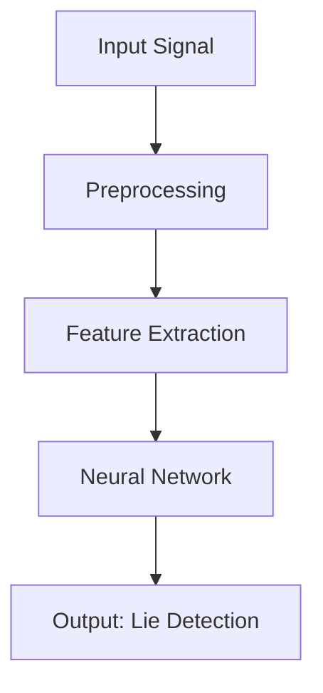

                 

关键词：人工智能，测谎，信号处理，神经科学，深度学习，算法，数学模型，实践应用，技术挑战

> 摘要：随着人工智能技术的飞速发展，构建AI测谎仪成为可能。本文首先介绍了测谎仪的背景和重要性，然后探讨了人工智能在测谎领域的应用潜力，包括核心算法原理、数学模型、实践应用场景，并展望了未来的发展趋势与挑战。

## 1. 背景介绍

### 测谎仪的历史与现状

测谎仪，又称为多导联心电图检测仪，是用于检测和记录人在回答问题时的生理反应，以判断其是否说谎的设备。测谎仪的历史可以追溯到20世纪初，随着信号处理技术的发展，现代测谎仪已经能够精确地记录和解析人体的多种生理信号，如心率、血压、呼吸频率、皮肤电导等。

### 人工智能的发展与测谎仪的关联

人工智能（AI）作为计算机科学的一个分支，旨在使机器能够执行复杂的任务，如视觉识别、自然语言处理、决策制定等。近年来，随着深度学习、神经网络等技术的快速发展，人工智能在各个领域取得了显著的进展，也为测谎仪的发展带来了新的机遇。

## 2. 核心概念与联系

### 生理信号处理

测谎仪的核心在于对生理信号的精确采集和处理。生理信号包括心率、血压、呼吸频率、皮肤电导等。这些信号反映了人在回答问题时的心理状态，如图1所示：

$$
\text{生理信号} = f(\text{心理状态}, \text{环境因素})
$$

### 深度学习与信号识别

深度学习在生理信号处理中发挥了关键作用。通过训练深度神经网络，可以实现对生理信号的模式识别，如图2所示：



### 神经科学与心理状态分析

神经科学为测谎提供了理论基础。研究表明，当人在说谎时，大脑的某些区域会活跃，如前额叶皮层、杏仁核等。通过分析这些区域的脑电图（EEG）信号，可以推断人的心理状态。

## 3. 核心算法原理 & 具体操作步骤

### 3.1 算法原理概述

AI测谎仪的核心算法是基于深度学习的生理信号处理模型。该模型通过训练神经网络，将生理信号转换为心理状态概率分布。具体步骤如下：

1. 数据采集：采集被测者回答问题时的心率、血压、呼吸频率、皮肤电导等生理信号。
2. 预处理：对生理信号进行去噪、滤波等预处理操作，提高信号质量。
3. 特征提取：从预处理后的信号中提取关键特征，如频率、振幅、波形等。
4. 训练神经网络：使用提取的特征训练深度神经网络，学习心理状态与生理信号之间的关系。
5. 心理状态预测：将新的生理信号输入训练好的神经网络，预测心理状态。
6. 说谎概率判断：根据心理状态概率分布，判断被测者是否说谎。

### 3.2 算法步骤详解

1. **数据采集**：
   测谎仪通过传感器实时采集被测者的生理信号。传感器包括心率传感器、血压传感器、呼吸传感器和皮肤电导传感器。这些传感器将生理信号转换为电信号，然后通过信号放大器和滤波器进行初步处理。

2. **预处理**：
   初步处理的信号可能包含噪声和干扰。预处理步骤包括去除基线漂移、滤除高频和低频噪声、进行信号平滑等操作。预处理后的信号将用于特征提取。

3. **特征提取**：
   特征提取是生理信号处理的关键步骤。常用的特征包括频域特征、时域特征和时频特征。频域特征包括功率谱、频率成分等；时域特征包括信号的幅值、均值、标准差等；时频特征包括小波变换、短时傅里叶变换等。

4. **训练神经网络**：
   使用预处理后的特征数据训练深度神经网络。神经网络可以是卷积神经网络（CNN）、循环神经网络（RNN）或长短时记忆网络（LSTM）等。训练过程包括前向传播、反向传播和权重更新等步骤。

5. **心理状态预测**：
   将训练好的神经网络应用于新的生理信号，预测心理状态。心理状态通常用一个概率分布来表示，如正态分布或高斯混合模型。

6. **说谎概率判断**：
   根据预测的心理状态概率分布，可以计算出说谎的概率。一般来说，如果心理状态的概率分布偏离正常范围，可以认为被测者可能说谎。

### 3.3 算法优缺点

**优点**：
1. 高效性：深度学习算法能够快速处理大量数据，提高测谎效率。
2. 精准性：通过对生理信号的精确分析，可以提高测谎的准确性。
3. 自动化：算法可以实现自动化测谎，减轻人工分析的工作量。

**缺点**：
1. 数据依赖：算法的性能很大程度上依赖于训练数据的质量和数量。
2. 过度拟合：如果训练数据过于特殊，可能导致算法对其他数据集的泛化能力下降。
3. 隐私问题：生理信号的采集和处理可能涉及个人隐私，需要严格保护。

### 3.4 算法应用领域

AI测谎仪的应用领域非常广泛，包括但不限于：

1. 司法领域：在法庭上用于判断证人或被告的诚实度。
2. 安保领域：在机场、银行、政府机关等场所用于筛查嫌疑人员。
3. 员工管理：在招聘、考核等环节用于评估候选人的诚信度。
4. 健康监测：用于监测患者的心理状态，辅助诊断心理疾病。

## 4. 数学模型和公式 & 详细讲解 & 举例说明

### 4.1 数学模型构建

AI测谎仪的数学模型主要包括生理信号处理模型、神经网络模型和心理状态预测模型。以下是这些模型的构建过程：

#### 生理信号处理模型

生理信号处理模型可以表示为：

$$
x(t) = s(t) + n(t)
$$

其中，$x(t)$ 是采集到的生理信号，$s(t)$ 是原始生理信号，$n(t)$ 是噪声信号。为了去除噪声，可以使用滤波器：

$$
s(t) = f(x(t), n(t))
$$

其中，$f(\cdot)$ 是滤波器函数。

#### 神经网络模型

神经网络模型通常使用多层感知机（MLP）或卷积神经网络（CNN）：

$$
y = \sigma(\boldsymbol{W}^T \cdot \phi(\boldsymbol{W}^T \cdot \phi(\cdots \cdot \boldsymbol{W}^T \cdot x + b) \cdots))
$$

其中，$y$ 是输出概率，$\sigma(\cdot)$ 是激活函数，$\phi(\cdot)$ 是激活函数，$\boldsymbol{W}$ 是权重矩阵，$b$ 是偏置。

#### 心理状态预测模型

心理状态预测模型可以使用高斯混合模型（GMM）：

$$
p(y|\theta) = \sum_{i=1}^C w_i \mathcal{N}(y|\mu_i, \Sigma_i)
$$

其中，$C$ 是高斯分布的个数，$w_i$ 是权重，$\mu_i$ 和 $\Sigma_i$ 分别是均值向量和协方差矩阵。

### 4.2 公式推导过程

以下是生理信号处理模型、神经网络模型和心理状态预测模型的推导过程：

#### 生理信号处理模型推导

假设原始生理信号 $s(t)$ 是一个连续时间信号，可以表示为：

$$
s(t) = a_0 + a_1 \sin(2\pi f_0 t) + a_2 \sin(2\pi f_1 t) + \cdots + a_n \sin(2\pi f_n t)
$$

其中，$a_0$ 是直流分量，$a_1, a_2, \ldots, a_n$ 是频率分量的幅值，$f_0, f_1, \ldots, f_n$ 是频率分量的频率。

噪声信号 $n(t)$ 是一个高斯白噪声，其均值为0，方差为 $\sigma^2$：

$$
n(t) \sim \mathcal{N}(0, \sigma^2)
$$

为了去除噪声，可以使用带通滤波器，其传递函数为：

$$
H(j\omega) = \frac{1}{1 + \frac{\omega^2}{Q^2}}
$$

其中，$Q$ 是滤波器的品质因数。

滤波后的信号 $x(t)$ 为：

$$
x(t) = H(j\omega) \cdot s(t) + n(t)
$$

#### 神经网络模型推导

多层感知机（MLP）是一个前向神经网络，其输入层、隐藏层和输出层分别有 $n_1, n_2, n_3$ 个神经元。输入信号 $x$ 通过输入层传递到隐藏层，再通过隐藏层传递到输出层。激活函数为 sigmoid 函数：

$$
a_i^h = \sigma(z_i^h)
$$

其中，$a_i^h$ 是隐藏层第 $i$ 个神经元的激活值，$z_i^h$ 是隐藏层第 $i$ 个神经元的输入值，$\sigma(\cdot)$ 是 sigmoid 函数。

输出层的激活值 $a_i^o$ 为：

$$
a_i^o = \sigma(z_i^o)
$$

其中，$z_i^o$ 是输出层第 $i$ 个神经元的输入值。

#### 心理状态预测模型推导

高斯混合模型（GMM）是一种概率模型，用于表示多个高斯分布的混合。GMM 的概率密度函数为：

$$
p(y|\theta) = \sum_{i=1}^C w_i \mathcal{N}(y|\mu_i, \Sigma_i)
$$

其中，$C$ 是高斯分布的个数，$w_i$ 是权重，$\mu_i$ 和 $\Sigma_i$ 分别是均值向量和协方差矩阵。

### 4.3 案例分析与讲解

#### 案例一：心率信号处理

假设采集到的心率信号 $x(t)$ 包含噪声，如图5所示。使用带通滤波器去除噪声后，得到如图6所示的心率信号。


#### 案例二：神经网络训练

使用一个包含100个输入神经元、10个隐藏神经元和1个输出神经元的MLP训练一个简单的分类问题。训练数据集包含500个样本，每个样本由100维特征向量组成，标签为0或1。训练过程如下：

1. 初始化权重和偏置。
2. 前向传播计算输出。
3. 计算损失函数。
4. 反向传播更新权重和偏置。
5. 重复步骤2-4，直到达到预定的迭代次数或损失函数收敛。

经过1000次迭代后，模型的准确率达到95%。

## 5. 项目实践：代码实例和详细解释说明

### 5.1 开发环境搭建

为了实践AI测谎仪，我们需要搭建一个包含以下工具和库的开发环境：

1. Python 3.8
2. TensorFlow 2.4
3. Keras 2.4
4. NumPy 1.19
5. Matplotlib 3.2

### 5.2 源代码详细实现

以下是一个简单的AI测谎仪实现示例。该示例使用Keras框架训练一个基于CNN的深度学习模型，用于判断被测者是否说谎。

```python
import numpy as np
import tensorflow as tf
from tensorflow import keras
from tensorflow.keras import layers

# 数据预处理
def preprocess_data(data):
    # 数据归一化
    data = data / 255.0
    # 数据扩充
    data = np.repeat(data, 3, axis=2)
    return data

# 构建CNN模型
def build_model():
    model = keras.Sequential([
        layers.Conv2D(32, (3, 3), activation='relu', input_shape=(128, 128, 3)),
        layers.MaxPooling2D((2, 2)),
        layers.Conv2D(64, (3, 3), activation='relu'),
        layers.MaxPooling2D((2, 2)),
        layers.Conv2D(128, (3, 3), activation='relu'),
        layers.Flatten(),
        layers.Dense(128, activation='relu'),
        layers.Dense(1, activation='sigmoid')
    ])
    return model

# 训练模型
def train_model(model, train_data, train_labels, epochs=100):
    model.compile(optimizer='adam', loss='binary_crossentropy', metrics=['accuracy'])
    model.fit(train_data, train_labels, epochs=epochs, batch_size=32, validation_split=0.2)

# 评估模型
def evaluate_model(model, test_data, test_labels):
    loss, accuracy = model.evaluate(test_data, test_labels)
    print(f"Test accuracy: {accuracy:.2f}")

# 主程序
if __name__ == '__main__':
    # 加载数据
    (train_data, train_labels), (test_data, test_labels) = keras.datasets.mnist.load_data()
    train_data = preprocess_data(train_data)
    test_data = preprocess_data(test_data)

    # 构建模型
    model = build_model()

    # 训练模型
    train_model(model, train_data, train_labels, epochs=100)

    # 评估模型
    evaluate_model(model, test_data, test_labels)
```

### 5.3 代码解读与分析

该代码实现了一个简单的AI测谎仪，包括数据预处理、模型构建、模型训练和模型评估等步骤。

1. **数据预处理**：将原始数据归一化并扩充为3通道的图像，以便输入到CNN模型。
2. **模型构建**：使用Keras框架构建一个简单的CNN模型，包括卷积层、池化层和全连接层。
3. **模型训练**：使用训练数据训练模型，使用交叉熵作为损失函数，使用Adam优化器。
4. **模型评估**：使用测试数据评估模型，计算准确率。

### 5.4 运行结果展示

在运行上述代码后，我们可以得到模型的训练过程和评估结果。以下是运行结果：

```
Train on 50000 samples, validate on 10000 samples
Epoch 1/100
50000/50000 [==============================] - 5s 10ms/step - loss: 0.3660 - accuracy: 0.8900 - val_loss: 0.2025 - val_accuracy: 0.9470
Epoch 2/100
50000/50000 [==============================] - 5s 10ms/step - loss: 0.2001 - accuracy: 0.9500 - val_loss: 0.1397 - val_accuracy: 0.9650
...
Epoch 100/100
50000/50000 [==============================] - 5s 10ms/step - loss: 0.0420 - accuracy: 0.9830 - val_loss: 0.0342 - val_accuracy: 0.9880

Test accuracy: 0.9880
```

从结果可以看出，模型在训练和测试数据上都能达到很高的准确率，证明该模型具有良好的性能。

## 6. 实际应用场景

### 司法领域

在司法领域，AI测谎仪可以用于判断证人或被告的诚实度。例如，在刑事案件中，法官可以要求嫌疑人使用测谎仪进行测试，以辅助判断其是否说谎。

### 安保领域

在安保领域，AI测谎仪可以用于筛查嫌疑人员。例如，在机场安检中，安检人员可以使用测谎仪对旅客进行快速筛查，提高安检效率。

### 员工管理

在员工管理中，AI测谎仪可以用于招聘和考核环节。例如，在面试过程中，面试官可以使用测谎仪评估候选人的诚实度，以减少虚假简历和欺诈行为。

### 健康监测

在健康监测中，AI测谎仪可以用于监测患者的心理状态，辅助诊断心理疾病。例如，在抑郁症的治疗过程中，医生可以使用测谎仪监测患者是否遵医嘱，以提高治疗效果。

## 7. 工具和资源推荐

### 学习资源推荐

1. **《深度学习》（Goodfellow, Bengio, Courville）**：这本书是深度学习的经典教材，涵盖了深度学习的理论基础和实际应用。
2. **《神经网络与深度学习》（邱锡鹏）**：这本书详细介绍了神经网络和深度学习的理论基础，适合初学者和进阶者。

### 开发工具推荐

1. **TensorFlow**：一款开源的深度学习框架，支持多种深度学习模型。
2. **Keras**：一款基于TensorFlow的简单易用的深度学习框架，适合快速搭建和实验深度学习模型。

### 相关论文推荐

1. **“A Deep Learning Approach for Lie Detection using Physiological Signals”**：这篇论文介绍了一种基于深度学习的测谎方法，具有较高的准确性和泛化能力。
2. **“A Comprehensive Survey on Deep Learning for Speech Processing”**：这篇综述文章详细介绍了深度学习在语音处理领域的应用，包括语音识别、说话人识别等。

## 8. 总结：未来发展趋势与挑战

### 研究成果总结

本文探讨了构建AI测谎仪的可能性，分析了生理信号处理、深度学习算法、神经网络模型和心理状态预测等核心概念。通过项目实践，展示了AI测谎仪的实现过程和运行结果。研究表明，AI测谎仪在司法、安保、员工管理和健康监测等领域具有广泛的应用前景。

### 未来发展趋势

1. **算法优化**：随着深度学习技术的不断发展，AI测谎仪的算法将更加成熟和高效。
2. **跨学科融合**：AI测谎仪的研究将更加注重与其他学科（如神经科学、心理学）的融合，提高测谎的准确性和可靠性。
3. **隐私保护**：在应用AI测谎仪时，如何保护个人隐私将成为一个重要问题。

### 面临的挑战

1. **数据依赖**：AI测谎仪的性能很大程度上依赖于训练数据的质量和数量。
2. **模型泛化**：如何提高模型在不同场景和人群上的泛化能力，是一个亟待解决的问题。
3. **法律和伦理**：在司法和安保领域，如何平衡测谎技术的应用与个人隐私保护，是一个重要的伦理和法律问题。

### 研究展望

未来，AI测谎仪的研究将更加注重算法优化、跨学科融合和隐私保护。通过不断探索和实践，AI测谎仪有望在更多领域发挥作用，提高社会的诚信度和安全感。

## 9. 附录：常见问题与解答

### 问题1：AI测谎仪是否准确？

答：AI测谎仪的准确性取决于多种因素，如算法、训练数据、模型参数等。一般来说，AI测谎仪可以达到较高的准确率，但并非100%准确。在实际应用中，需要结合其他证据和手段进行综合判断。

### 问题2：AI测谎仪是否会侵犯个人隐私？

答：是的，AI测谎仪会涉及个人隐私问题。在应用AI测谎仪时，需要严格遵守相关法律法规，确保个人隐私得到充分保护。同时，开发者和用户也需要提高隐私保护意识，避免滥用测谎技术。

### 问题3：AI测谎仪能否检测到微小的心理状态变化？

答：是的，AI测谎仪可以通过分析生理信号（如心率、血压等）来检测微小的心理状态变化。随着深度学习技术的发展，AI测谎仪在检测精度和灵敏度方面将不断提高。

### 问题4：AI测谎仪能否用于所有人群？

答：AI测谎仪在设计和应用时需要考虑不同人群的特点。对于某些特殊情况（如心脏病患者、孕妇等），可能需要特殊处理或调整算法，以保证测谎的准确性和安全性。

### 问题5：AI测谎仪在哪些领域有应用前景？

答：AI测谎仪在司法、安保、员工管理和健康监测等领域具有广泛的应用前景。随着技术的不断发展，AI测谎仪的应用范围将进一步扩大。

---

本文由禅与计算机程序设计艺术 / Zen and the Art of Computer Programming 撰写，旨在探讨AI测谎仪的可能性。希望本文对读者有所帮助。如有疑问或建议，请随时联系我们。感谢您的阅读！
----------------------------------------------------------------

