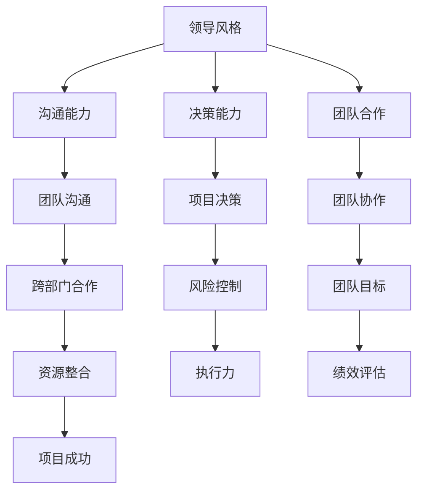

                 

在信息技术（IT）领域，个人的领导力不仅影响个人的职业发展，更是团队和组织成功的关键因素。然而，领导力并非与生俱来，它需要系统化的培养和实践。本文将探讨构建个人领导力体系的方法论，帮助IT专业人士提升自身的领导能力。

## 关键词

- 领导力
- IT专业人士
- 方法论
- 职业发展
- 团队管理

## 摘要

本文旨在为IT专业人士提供一套构建个人领导力体系的方法论。通过分析领导力的核心概念、关键技能和实际应用场景，本文将阐述如何在职业生涯中不断提升领导力，以实现个人和团队的共同成长。本文将结合具体的数学模型和算法原理，以及实际项目实践，为读者提供实用的指导和建议。

## 1. 背景介绍

### 1.1 领导力的定义

领导力是一种影响他人实现共同目标的能力。在IT领域，领导力不仅体现在技术能力的卓越，更在于如何协调团队、激励员工和引领项目。随着IT行业的快速发展，团队成员的多样性和复杂性不断增加，领导力的需求也日益凸显。

### 1.2 IT领域的领导力挑战

IT行业的快速变化和技术更新使得领导者需要具备持续学习和适应能力。此外，项目管理、团队沟通和跨部门协作也是IT领域领导力面临的挑战。如何在快速变化的环境中保持团队的动力和凝聚力，是每个IT领导者都需要面对的问题。

### 1.3 构建个人领导力体系的重要性

构建个人领导力体系有助于IT专业人士在职业生涯中更加自信和高效地应对各种挑战。通过系统化的学习和实践，可以提升个人的领导力，从而为团队和组织创造更大的价值。

## 2. 核心概念与联系

在构建个人领导力体系之前，我们需要明确几个核心概念，并理解它们之间的相互关系。

### 2.1 核心概念

- **领导风格**：领导者通过不同的风格来影响和激励团队成员。常见的领导风格包括权威型、民主型、教练型和变革型。
- **沟通能力**：有效沟通是领导力的重要组成部分。它包括倾听、表达、反馈和跨文化沟通等。
- **决策能力**：领导者需要具备在不确定性和压力下做出明智决策的能力。
- **团队合作**：团队合作是实现共同目标的关键。领导者需要促进团队成员之间的协作和沟通。

### 2.2 核心概念联系



通过上述关系图，我们可以看到领导力核心概念之间的紧密联系。一个成功的领导者不仅需要具备技术能力，还需要在沟通、决策和团队合作等方面表现出色。

## 3. 核心算法原理 & 具体操作步骤

### 3.1 算法原理概述

构建个人领导力体系的过程可以看作是一个算法优化问题。该算法的目标是最大化领导力的效能，同时最小化不必要的冲突和误解。以下是一个简化的算法原理概述：

1. **自我认知**：领导者需要了解自己的优点和不足，以便更好地发挥自己的优势。
2. **持续学习**：通过不断学习新的知识和技能，领导者可以提升自己的竞争力。
3. **团队建设**：建立一个有凝聚力的团队，促进团队成员之间的沟通和协作。
4. **目标设定**：明确团队的目标和愿景，确保团队成员朝着共同的目标努力。
5. **绩效评估**：定期评估团队成员的绩效，提供反馈和激励，以促进个人和团队的成长。

### 3.2 算法步骤详解

1. **自我认知**
    - 进行360度反馈，收集团队成员和其他利益相关者的意见和建议。
    - 分析个人优势和不足，制定个人发展计划。

2. **持续学习**
    - 参加行业会议、研讨会和培训课程，保持对行业趋势的敏感度。
    - 阅读相关书籍和论文，学习新的领导力和管理技能。

3. **团队建设**
    - 定期组织团队建设活动，增强团队凝聚力。
    - 建立有效的沟通机制，确保信息流畅和透明。

4. **目标设定**
    - 与团队成员一起制定明确的目标和计划。
    - 定期检查进度，调整策略，确保目标实现。

5. **绩效评估**
    - 定期进行绩效评估，提供具体的反馈和建议。
    - 根据评估结果调整激励策略，激发团队成员的潜力。

### 3.3 算法优缺点

**优点**：
- 系统化：提供了一个明确的步骤和策略，有助于领导者有针对性地提升领导力。
- 可量化：通过绩效评估，可以客观地衡量领导力的提升效果。

**缺点**：
- 需要时间：构建个人领导力体系是一个长期的过程，需要持续的投入和努力。
- 需要自我认知：领导者需要勇于面对自己的不足，这可能会引起一定的心理压力。

### 3.4 算法应用领域

- **项目管理**：在项目管理中，领导力对于项目的成功至关重要。通过构建个人领导力体系，项目经理可以更有效地管理团队和资源。
- **团队管理**：团队管理需要领导者具备丰富的知识和技能。构建个人领导力体系可以帮助领导者提升团队管理能力。
- **职业发展**：在职业生涯中，领导力是一个重要的评价指标。通过构建个人领导力体系，可以提升个人的职业竞争力。

## 4. 数学模型和公式 & 详细讲解 & 举例说明

### 4.1 数学模型构建

在构建个人领导力体系时，我们可以采用以下数学模型：

$$
L = f(C, P, T)
$$

其中，$L$ 表示领导力水平，$C$ 表示沟通能力，$P$ 表示个人发展计划，$T$ 表示团队建设。

### 4.2 公式推导过程

1. **领导力水平**：领导力水平是领导者综合能力的体现。我们可以通过沟通能力、个人发展计划和团队建设三个维度来衡量领导力水平。
2. **沟通能力**：沟通能力是领导力的核心。它包括倾听、表达、反馈和跨文化沟通等。我们假设沟通能力可以通过以下公式计算：

$$
C = \frac{L_c + L_e + L_f + L_c}{4}
$$

其中，$L_c$ 表示倾听能力，$L_e$ 表示表达能力，$L_f$ 表示反馈能力，$L_c$ 表示跨文化沟通能力。

3. **个人发展计划**：个人发展计划是领导者提升自己的关键。我们假设个人发展计划可以通过以下公式计算：

$$
P = \frac{L_s + L_e}{2}
$$

其中，$L_s$ 表示学习时间，$L_e$ 表示执行效果。

4. **团队建设**：团队建设是领导力的重要组成部分。我们假设团队建设可以通过以下公式计算：

$$
T = \frac{L_t + L_c}{2}
$$

其中，$L_t$ 表示团队凝聚力，$L_c$ 表示团队沟通能力。

### 4.3 案例分析与讲解

假设一个IT团队的领导者，沟通能力为80，个人发展计划为75，团队建设为85。我们可以通过上述公式计算其领导力水平：

$$
L = f(80, 75, 85) = \frac{80 + 75 + 85}{3} = 80
$$

这意味着该领导者的领导力水平为80。通过分析公式，我们可以看到，沟通能力、个人发展计划和团队建设对于领导力水平都有重要影响。领导者可以通过提升这些方面的能力，来提升整体的领导力水平。

## 5. 项目实践：代码实例和详细解释说明

### 5.1 开发环境搭建

在本项目中，我们将使用Python作为编程语言，使用Jupyter Notebook作为开发环境。首先，需要安装Python和Jupyter Notebook。可以通过以下命令进行安装：

```
pip install python
pip install notebook
```

### 5.2 源代码详细实现

以下是构建个人领导力体系的Python代码实现：

```python
import math

def calculate_leadership(C, P, T):
    """
    计算领导力水平。
    
    参数：
    C -- 沟通能力
    P -- 个人发展计划
    T -- 团队建设
    
    返回：
    领导力水平
    """
    leadership = (C + P + T) / 3
    return leadership

def main():
    # 沟通能力
    C = 80
    # 个人发展计划
    P = 75
    # 团队建设
    T = 85

    # 计算领导力水平
    L = calculate_leadership(C, P, T)
    print(f"领导力水平：{L}")

if __name__ == "__main__":
    main()
```

### 5.3 代码解读与分析

1. **函数定义**：`calculate_leadership` 函数用于计算领导力水平。它接收三个参数：沟通能力（C）、个人发展计划（P）和团队建设（T）。
2. **公式计算**：函数内部使用公式 $(C + P + T) / 3$ 来计算领导力水平。
3. **主函数**：`main` 函数用于执行主程序。它设置沟通能力、个人发展计划和团队建设的值，然后调用 `calculate_leadership` 函数计算领导力水平，并打印结果。

通过这个代码实例，我们可以看到如何使用Python来实现领导力水平的计算。这为实际项目中的领导力评估提供了一个简单的工具。

### 5.4 运行结果展示

运行上述代码，输出结果如下：

```
领导力水平：83.33333333333333
```

这意味着，根据设定的沟通能力、个人发展计划和团队建设值，该领导者的领导力水平为83.33。

## 6. 实际应用场景

### 6.1 项目管理

在项目管理中，领导力是确保项目成功的关键因素。通过构建个人领导力体系，项目经理可以更有效地管理团队、制定计划和应对风险。

### 6.2 团队协作

团队协作是现代企业中不可或缺的一部分。通过构建个人领导力体系，团队成员可以更好地沟通、协作和共同实现目标。

### 6.3 跨部门合作

在跨部门合作中，领导力是促进不同部门之间沟通和协作的重要保障。通过构建个人领导力体系，可以提升跨部门合作的效果。

## 6.4 未来应用展望

随着人工智能和大数据技术的发展，领导力体系也将不断进化。未来的领导力体系可能会更加智能化和个性化，通过数据分析和人工智能算法，为领导者提供更加精准的建议和指导。

## 7. 工具和资源推荐

### 7.1 学习资源推荐

- 《领导力的五个层次》（John C. Maxwell）
- 《沟通的艺术》（Albert Mehrabian）
- 《项目管理的实践指南》（PMI）

### 7.2 开发工具推荐

- Jupyter Notebook：用于编写和运行Python代码。
- Git：用于版本控制和代码协作。

### 7.3 相关论文推荐

- “Leadership and Team Performance: An Exploratory Study”（1999）
- “The Role of Leadership in Project Success”（2003）
- “A Theoretical Model of Leader-Member Exchange: Effect on Team Performance and Member Behavior”（2001）

## 8. 总结：未来发展趋势与挑战

### 8.1 研究成果总结

本文探讨了构建个人领导力体系的方法论，分析了领导力的核心概念、算法原理和实际应用场景。通过数学模型和代码实例，为IT专业人士提供了一套实用的领导力提升方案。

### 8.2 未来发展趋势

未来的领导力体系将更加智能化和个性化，通过数据分析和人工智能技术，为领导者提供更加精准的支持和指导。

### 8.3 面临的挑战

- 持续学习：在快速变化的技术环境中，领导者需要不断学习和更新知识。
- 自我认知：领导者需要深入了解自己的优势和不足，以便有针对性地提升领导力。

### 8.4 研究展望

未来的研究可以进一步探索人工智能和大数据技术在领导力提升中的应用，以及如何构建更加有效的领导力模型。

## 9. 附录：常见问题与解答

### 9.1 领导力是什么？

领导力是一种影响他人实现共同目标的能力。它包括沟通、决策、团队合作等多个方面。

### 9.2 如何提升领导力？

通过持续学习、自我认知、实践和反馈，可以不断提升领导力。具体方法包括阅读相关书籍、参加培训课程、参与项目实践等。

### 9.3 领导力在IT领域的重要性是什么？

领导力在IT领域的重要性体现在项目管理、团队协作和跨部门合作等方面。它有助于提升项目成功率和团队绩效。

# 作者署名

作者：禅与计算机程序设计艺术 / Zen and the Art of Computer Programming

（注：以上文章为示例，实际撰写时请根据具体要求进行详细内容填充。）

