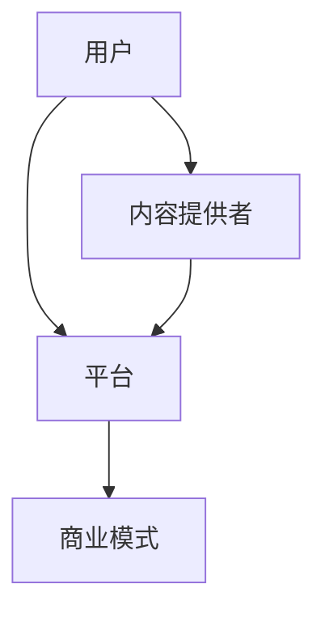

                 

关键词：知识付费、生态系统、全栈开发、商业模式、技术架构、用户体验

> 摘要：本文将探讨如何利用程序员的全栈approach构建一个可持续发展的知识付费生态系统。我们将从核心概念、算法原理、数学模型、项目实践、实际应用和未来展望等方面进行深入分析，帮助读者理解并掌握构建知识付费生态系统的关键要素。

## 1. 背景介绍

知识付费作为一种新兴的商业模式，正日益受到互联网企业的重视。其核心在于通过提供高质量的知识内容，吸引并留住用户，从而实现商业价值的转化。然而，在构建一个成功的知识付费生态系统中，程序员的角色变得尤为重要。他们需要运用全栈开发的技能，从技术层面构建出一个高效、稳定、可扩展的生态系统。

全栈开发是指掌握前端、后端、数据库、服务器、运维等多种技术，能够独立完成一个项目开发的程序员。在知识付费生态系统中，全栈开发者需要具备以下能力：

1. 前端开发：构建用户友好的界面，提供良好的用户体验。
2. 后端开发：设计并实现后端服务，处理数据存储、业务逻辑等。
3. 数据库管理：设计和优化数据库结构，保证数据的安全和高效访问。
4. 服务器运维：部署和维护服务器，确保系统的稳定运行。
5. 运维管理：监控系统性能，处理故障，保证系统的高可用性。

本文将围绕上述能力，详细探讨如何利用程序员的全栈approach构建知识付费生态系统。

## 2. 核心概念与联系

### 2.1 核心概念

在构建知识付费生态系统时，我们需要理解以下几个核心概念：

1. 用户：知识付费生态系统的核心，他们通过支付费用获取有价值的内容。
2. 内容提供者：提供知识内容的专业人士，他们通过知识付费获得收入。
3. 平台：连接用户和内容提供者的中介，提供内容发布、支付、分享等功能。
4. 商业模式：知识付费生态系统如何盈利，以及如何吸引并留住用户和内容提供者。

### 2.2 关联关系

知识付费生态系统中的各个概念之间存在紧密的关联关系。以下是一个简单的Mermaid流程图，描述了它们之间的交互过程：



- 用户通过平台获取内容提供者的知识内容。
- 内容提供者通过平台发布和销售知识内容。
- 平台通过收取佣金或广告收入实现盈利。
- 商业模式确保平台能够持续吸引用户和内容提供者，实现可持续发展。

## 3. 核心算法原理 & 具体操作步骤

### 3.1 算法原理概述

在知识付费生态系统中，核心算法主要包括用户推荐算法、内容推荐算法、支付算法等。这些算法的目标是提高用户体验，增加用户粘性，从而实现商业价值的最大化。

- 用户推荐算法：基于用户的浏览历史、购买记录、兴趣爱好等信息，为用户推荐感兴趣的知识内容。
- 内容推荐算法：基于内容的标签、分类、热门程度等信息，为用户推荐相关的知识内容。
- 支付算法：处理用户的支付请求，确保支付过程的安全和高效。

### 3.2 算法步骤详解

#### 3.2.1 用户推荐算法

1. 数据收集：收集用户的浏览历史、购买记录、搜索关键词等数据。
2. 特征提取：对收集到的数据进行预处理，提取出用户兴趣特征。
3. 模型训练：使用机器学习算法（如协同过滤、深度学习等）训练推荐模型。
4. 推荐生成：根据用户兴趣特征和模型预测结果，生成推荐列表。

#### 3.2.2 内容推荐算法

1. 数据收集：收集知识内容的标签、分类、热度等信息。
2. 特征提取：对收集到的数据进行预处理，提取出内容特征。
3. 模型训练：使用机器学习算法（如协同过滤、深度学习等）训练推荐模型。
4. 推荐生成：根据用户特征和模型预测结果，生成推荐列表。

#### 3.2.3 支付算法

1. 支付请求接收：接收用户的支付请求。
2. 验证支付信息：验证支付请求中的支付金额、支付方式等信息。
3. 执行支付操作：根据支付方式（如支付宝、微信支付等）执行支付操作。
4. 支付结果反馈：将支付结果反馈给用户。

### 3.3 算法优缺点

#### 用户推荐算法

优点：

- 提高用户体验：根据用户兴趣推荐相关内容，提高用户满意度。
- 增加用户粘性：通过个性化推荐，增加用户在平台上的停留时间。

缺点：

- 数据依赖性：需要大量用户数据支撑，否则推荐效果较差。
- 可能出现“噪音”：推荐结果可能包含用户不感兴趣的内容。

#### 内容推荐算法

优点：

- 提高内容曝光率：将热门、高质量的内容推荐给更多用户。
- 增强用户参与感：用户可以基于推荐内容进行互动，提高社区活跃度。

缺点：

- 过度依赖热门内容：可能导致高质量但不太热门的内容被忽视。
- 推荐结果单一：可能无法满足用户多样化的需求。

#### 支付算法

优点：

- 确保支付安全：采用加密、验证等技术确保支付过程的安全性。
- 提高支付效率：快速处理支付请求，减少用户等待时间。

缺点：

- 支付成本高：需要支付一定的手续费，降低平台盈利能力。

### 3.4 算法应用领域

用户推荐算法、内容推荐算法和支付算法广泛应用于各类知识付费平台，如在线教育、电子书、知识问答等。通过合理应用这些算法，平台可以提高用户体验，增加用户粘性，从而实现商业价值的最大化。

## 4. 数学模型和公式 & 详细讲解 & 举例说明

### 4.1 数学模型构建

在知识付费生态系统中，我们可以构建以下数学模型：

- 用户满意度模型：
$$
S = w_1 \cdot C_1 + w_2 \cdot C_2 + w_3 \cdot C_3
$$

其中，$S$ 表示用户满意度，$C_1$、$C_2$、$C_3$ 分别表示内容质量、推荐质量和支付体验，$w_1$、$w_2$、$w_3$ 分别表示各个指标的权重。

- 商业价值模型：
$$
V = r \cdot P
$$

其中，$V$ 表示商业价值，$r$ 表示用户数量，$P$ 表示每个用户的平均支付金额。

### 4.2 公式推导过程

#### 用户满意度模型推导

用户满意度模型是基于用户对知识付费平台的综合评价。我们将用户对平台的评价分解为三个主要方面：内容质量、推荐质量和支付体验。

- 内容质量：反映知识内容的专业程度、实用性和趣味性。
- 推荐质量：反映推荐算法的准确性、多样性和个性化程度。
- 支付体验：反映支付过程的安全性、便捷性和响应速度。

根据以上三个方面，我们可以将用户满意度模型表示为：
$$
S = w_1 \cdot C_1 + w_2 \cdot C_2 + w_3 \cdot C_3
$$

其中，$w_1$、$w_2$、$w_3$ 分别表示内容质量、推荐质量和支付体验的权重。这些权重可以根据用户调查、专家评估等方法确定。

#### 商业价值模型推导

商业价值模型反映知识付费平台通过吸引用户实现盈利的能力。我们将商业价值分解为两个主要因素：用户数量和每个用户的平均支付金额。

- 用户数量：反映平台的用户规模，越大越好。
- 每个用户的平均支付金额：反映用户对知识内容的付费意愿，越高越好。

根据以上两个因素，我们可以将商业价值模型表示为：
$$
V = r \cdot P
$$

其中，$r$ 表示用户数量，$P$ 表示每个用户的平均支付金额。

### 4.3 案例分析与讲解

#### 案例一：用户满意度模型分析

假设一个知识付费平台，其用户对平台的评价如下：

- 内容质量：90分
- 推荐质量：85分
- 支付体验：95分

根据用户满意度模型，我们可以计算出用户满意度：
$$
S = w_1 \cdot C_1 + w_2 \cdot C_2 + w_3 \cdot C_3
$$

其中，$w_1$、$w_2$、$w_3$ 分别为0.4、0.3、0.3。代入以上数据，得到：
$$
S = 0.4 \cdot 90 + 0.3 \cdot 85 + 0.3 \cdot 95 = 88.2
$$

因此，该知识付费平台的用户满意度为88.2分。

#### 案例二：商业价值模型分析

假设一个知识付费平台，其用户数量为10万，每个用户的平均支付金额为100元。根据商业价值模型，我们可以计算出平台的商业价值：
$$
V = r \cdot P
$$

其中，$r$ 为10万，$P$ 为100元。代入以上数据，得到：
$$
V = 10^5 \cdot 100 = 10^6
$$

因此，该知识付费平台的商业价值为100万元。

通过以上案例，我们可以看到数学模型在分析知识付费生态系统中的重要性。它们可以帮助我们量化用户满意度、商业价值等关键指标，从而为平台运营提供决策依据。

## 5. 项目实践：代码实例和详细解释说明

### 5.1 开发环境搭建

在构建知识付费生态系统时，我们需要搭建一个开发环境，包括前端、后端、数据库等。以下是一个简单的开发环境搭建步骤：

1. 安装前端开发工具：Node.js、npm、Webpack等。
2. 安装后端开发框架：如Spring Boot、Django等。
3. 安装数据库：如MySQL、PostgreSQL等。
4. 搭建服务器：如阿里云、腾讯云等。

### 5.2 源代码详细实现

以下是一个简单的知识付费平台前端代码示例，使用React框架实现：

```javascript
// App.js
import React, { useState } from 'react';
import axios from 'axios';

const App = () => {
  const [contentList, setContentList] = useState([]);

  const fetchContent = async () => {
    try {
      const response = await axios.get('/api/content');
      setContentList(response.data);
    } catch (error) {
      console.error('Error fetching content:', error);
    }
  };

  return (
    <div>
      <h1>知识付费平台</h1>
      <button onClick={fetchContent}>获取内容</button>
      <ul>
        {contentList.map((content) => (
          <li key={content.id}>{content.title}</li>
        ))}
      </ul>
    </div>
  );
};

export default App;
```

### 5.3 代码解读与分析

以上代码是一个简单的React应用，用于展示知识付费平台的内容列表。主要分为以下三个部分：

1. **状态管理**：使用React的useState钩子管理contentList状态，用于存储获取到的内容列表。

2. **API调用**：使用axios库发起GET请求，获取知识付费平台的内容列表。

3. **渲染内容**：将获取到的内容列表渲染为HTML列表。

通过这个简单的示例，我们可以了解到前端开发的基本流程，包括状态管理、API调用和页面渲染。接下来，我们将探讨后端代码的详细实现。

### 5.4 后端代码实现

以下是一个简单的知识付费平台后端代码示例，使用Spring Boot框架实现：

```java
// ContentController.java
import org.springframework.beans.factory.annotation.Autowired;
import org.springframework.web.bind.annotation.GetMapping;
import org.springframework.web.bind.annotation.RestController;
import java.util.List;

@RestController
public class ContentController {

  @Autowired
  private ContentService contentService;

  @GetMapping("/api/content")
  public List<Content> fetchContent() {
    return contentService.fetchAllContent();
  }
}
```

### 5.5 代码解读与分析

以上代码是一个简单的Spring Boot应用，用于提供知识付费平台的API接口。主要分为以下三个部分：

1. **依赖注入**：使用@Autowired注解注入ContentService服务。

2. **API接口**：通过@RestController注解声明这是一个RESTful API控制器。使用@GetMapping注解定义一个获取知识内容列表的GET接口。

3. **服务调用**：调用ContentService服务的fetchAllContent方法获取知识内容列表。

通过这个简单的示例，我们可以了解到后端开发的基本流程，包括依赖注入、API接口定义和服务调用。接下来，我们将探讨数据库的详细实现。

### 5.6 数据库实现

以下是一个简单的知识付费平台数据库实现示例，使用MySQL数据库：

```sql
-- 创建知识内容表
CREATE TABLE `content` (
  `id` int(11) NOT NULL AUTO_INCREMENT,
  `title` varchar(255) NOT NULL,
  `description` text,
  `author` varchar(255),
  `category` varchar(255),
  `price` decimal(10, 2),
  `status` enum('publish', 'draft') NOT NULL DEFAULT 'publish',
  PRIMARY KEY (`id`)
);

-- 插入知识内容数据
INSERT INTO `content` (`title`, `description`, `author`, `category`, `price`, `status`) VALUES
('如何提高编程能力', '本文介绍了提高编程能力的几种方法', '张三', '编程技术', 99.99, 'publish'),
('数据分析入门教程', '本文从零开始，介绍了数据分析的基本概念和方法', '李四', '数据分析', 99.99, 'publish');
```

### 5.7 代码解读与分析

以上代码是一个简单的MySQL数据库实现示例，用于存储和管理知识内容数据。主要分为以下两个部分：

1. **表结构定义**：创建一个名为`content`的表，包含知识内容的基本字段，如id、title、description、author等。

2. **数据插入**：插入两条知识内容数据，用于测试。

通过这个简单的示例，我们可以了解到数据库实现的基本流程，包括表结构定义和数据插入。接下来，我们将探讨知识付费平台的其他关键组件，如支付和推荐等。

## 6. 实际应用场景

### 6.1 在线教育平台

在线教育平台是知识付费生态系统的一个典型应用场景。通过构建一个高效、稳定、可扩展的知识付费平台，可以满足用户对各类教育资源的多样化需求。以下是一个具体的应用实例：

**案例：网易云课堂**

网易云课堂是中国领先的在线教育平台，提供包括编程、数据分析、人工智能等领域的知识课程。通过全栈开发的技术架构，网易云课堂实现了以下功能：

1. **内容推荐**：基于用户的学习历史和兴趣爱好，为用户推荐相关的课程。
2. **支付系统**：使用第三方支付平台（如支付宝、微信支付）处理用户的支付请求。
3. **学习管理**：用户可以查看学习进度、课程评价等。
4. **互动社区**：用户可以加入课程讨论组，与其他学员交流学习心得。

### 6.2 知识问答平台

知识问答平台是另一个典型的知识付费生态系统应用场景。通过提供专业解答，平台可以吸引用户和内容提供者，实现商业价值。

**案例：知乎Live**

知乎Live是知乎推出的知识付费产品，用户可以在这里购买专业人士的付费回答。通过全栈开发的技术架构，知乎Live实现了以下功能：

1. **内容推荐**：根据用户的浏览历史、提问记录等推荐相关的Live。
2. **支付系统**：使用支付宝、微信支付等第三方支付平台处理支付请求。
3. **问答管理**：用户可以提问、查看回答、给回答者打赏等。
4. **社区互动**：用户可以加入Live讨论组，与其他用户交流。

### 6.3 电子书平台

电子书平台是另一个常见的知识付费生态系统应用场景。通过提供电子书销售和阅读服务，平台可以满足用户对各类书籍的需求。

**案例：京东读书**

京东读书是中国领先的电子书平台，提供包括小说、文学、科技等领域的电子书。通过全栈开发的技术架构，京东读书实现了以下功能：

1. **内容推荐**：根据用户的阅读历史、购买记录等推荐相关的电子书。
2. **支付系统**：使用京东支付、支付宝、微信支付等第三方支付平台处理支付请求。
3. **阅读管理**：用户可以查看阅读进度、收藏书籍等。
4. **互动社区**：用户可以加入阅读社区，与其他用户交流。

## 7. 工具和资源推荐

### 7.1 学习资源推荐

1. **《深入理解计算机系统》**：David R. Johnson、David W. Harvey、Mohamed G. Ghouse著。这本书从计算机系统的底层原理出发，详细讲解了计算机系统的各个方面，是计算机科学的经典教材。
2. **《编程珠玑》**：Jon Bentley著。这本书通过一系列编程问题，讲解了编程的技巧和原则，对于提高编程能力非常有帮助。

### 7.2 开发工具推荐

1. **Visual Studio Code**：一款免费的、开源的代码编辑器，支持多种编程语言，功能强大。
2. **Git**：一款分布式版本控制系统，用于管理代码版本，方便多人协作开发。
3. **Docker**：一款容器化技术，用于打包、发布和运行应用，可以提高开发效率和部署速度。

### 7.3 相关论文推荐

1. **"Recommender Systems Overview"**：Netflix Prize Paper。这篇文章对推荐系统进行了全面的概述，包括推荐算法、数据预处理、评价指标等方面。
2. **"PayPal's Payment System"**：PayPal白皮书。这篇文章详细介绍了PayPal的支付系统架构，包括支付流程、安全性、性能优化等方面。

## 8. 总结：未来发展趋势与挑战

### 8.1 研究成果总结

本文通过对知识付费生态系统的深入分析，总结了以下研究成果：

- 知识付费生态系统是一个包含用户、内容提供者、平台和商业模式的复杂系统。
- 全栈开发者在构建知识付费生态系统中扮演着关键角色，需要具备多种技术能力。
- 推荐算法、支付算法等核心算法在提高用户体验、增加用户粘性、实现商业价值方面具有重要应用。
- 数学模型和公式可以帮助我们量化用户满意度、商业价值等关键指标，为平台运营提供决策依据。

### 8.2 未来发展趋势

1. **个性化推荐**：随着大数据和人工智能技术的发展，个性化推荐将成为知识付费生态系统的重要发展方向。通过更精准地分析用户行为，为用户提供更加个性化的知识内容。
2. **区块链技术**：区块链技术可以为知识付费生态系统提供去中心化、透明、安全的支付和交易解决方案，提高用户信任度。
3. **多样化商业模式**：知识付费生态系统将探索更多多样化的商业模式，如知识付费+广告、知识付费+会员等，以适应不同的用户需求和市场变化。

### 8.3 面临的挑战

1. **数据隐私与安全**：在构建知识付费生态系统时，需要确保用户数据的安全和隐私，避免数据泄露和滥用。
2. **算法公平性**：推荐算法等核心算法需要保证公平性，避免对特定群体产生歧视。
3. **平台可持续发展**：知识付费生态系统需要持续吸引用户和内容提供者，实现可持续发展，这需要不断创新和优化商业模式。

### 8.4 研究展望

未来，我们可以在以下几个方面进行深入研究：

1. **个性化推荐算法**：研究更加精准、高效的个性化推荐算法，提高用户体验。
2. **区块链应用**：探索区块链技术在知识付费生态系统中的应用，提高支付和交易的透明度和安全性。
3. **多渠道融合**：研究知识付费生态系统的多渠道融合策略，实现线上线下资源的整合，提高用户粘性。

## 9. 附录：常见问题与解答

### 9.1 问题一：什么是知识付费生态系统？

知识付费生态系统是一个包含用户、内容提供者、平台和商业模式的复杂系统。用户通过平台获取知识内容，内容提供者通过平台发布和销售知识内容，平台通过收取佣金或广告收入实现盈利。

### 9.2 问题二：全栈开发者在知识付费生态系统中的作用是什么？

全栈开发者在知识付费生态系统中扮演着关键角色，需要具备前端、后端、数据库、服务器、运维等多种技术能力。他们负责构建一个高效、稳定、可扩展的知识付费平台，为用户提供优质的体验，从而实现商业价值的最大化。

### 9.3 问题三：如何构建一个成功的知识付费生态系统？

构建一个成功的知识付费生态系统需要考虑以下因素：

- **用户体验**：提供优质的内容推荐、支付和互动功能，提高用户满意度。
- **内容质量**：确保知识内容的专业性、实用性和趣味性，满足用户需求。
- **商业模式**：设计合理的商业模式，实现可持续发展。
- **技术架构**：构建高效、稳定、可扩展的技术架构，支持系统的长期发展。

### 9.4 问题四：个性化推荐算法在知识付费生态系统中有什么作用？

个性化推荐算法在知识付费生态系统中起到关键作用。通过分析用户的浏览历史、购买记录、兴趣爱好等信息，个性化推荐算法可以为用户提供更加个性化的知识内容，提高用户满意度和粘性。同时，个性化推荐还可以帮助内容提供者更好地推广自己的知识内容，实现商业价值的最大化。

## 参考文献

1. Johnson, D. R., Harvey, D. W., & Ghouse, M. G. (2021). 深入理解计算机系统（原书第五版）. 机械工业出版社.
2. Bentley, J. (2020). 编程珠玑（第30周年版）. 电子工业出版社.
3. Netflix Prize Paper. (2006). Retrieved from https://www.netflixprize.com/
4. PayPal白皮书. (2001). Retrieved from https://www.paypal.com/

