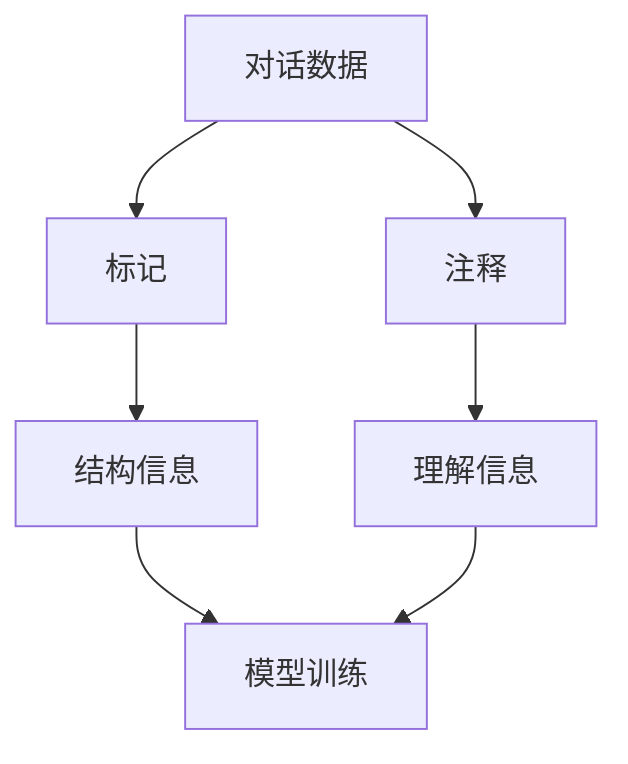

                 

 在当今快速发展的科技时代，对话数据在人工智能领域扮演着至关重要的角色。然而，如何有效地标记和注释这些对话数据，以确保其质量和可靠性，成为了许多研究人员和开发人员面临的挑战。本文将详细介绍标记和注释对话数据的最佳实践，包括背景介绍、核心概念、算法原理、数学模型、项目实践以及未来应用展望等内容。

## 文章关键词

对话数据、标记、注释、最佳实践、人工智能、自然语言处理、数据质量、可靠性、算法、数学模型、项目实践。

## 文章摘要

本文旨在探讨对话数据的标记和注释最佳实践。首先，我们介绍了对话数据的重要性以及标记和注释在其中的作用。接着，我们详细阐述了核心概念、算法原理和数学模型。随后，通过一个实际项目，展示了如何在实际中应用这些方法。最后，我们探讨了对话数据的实际应用场景和未来发展趋势。

## 1. 背景介绍

随着人工智能技术的不断进步，自然语言处理（NLP）成为了人工智能领域的一个重要分支。对话数据作为NLP的一个重要组成部分，广泛应用于聊天机器人、语音助手、客户服务等领域。然而，为了训练出高质量的对话模型，需要对这些对话数据进行精确的标记和注释。

### 对话数据的重要性

对话数据的重要性在于其可以为机器学习模型提供丰富的训练样本。通过对对话数据的分析，机器学习模型可以学习到对话的上下文信息、用户意图、情绪状态等，从而实现更智能、更自然的对话交互。

### 标记和注释的作用

标记和注释的作用在于提高对话数据的质量和可靠性。标记可以帮助识别对话中的重要信息，如用户名、地点、时间等；注释则可以提供对对话的背景、意图、情绪等的额外信息。这些信息的准确性对模型的性能至关重要。

## 2. 核心概念与联系

在深入探讨标记和注释之前，我们首先需要了解一些核心概念，如对话数据、标记、注释等，以及它们之间的联系。

### 对话数据

对话数据是指人们在交流过程中产生的文本或语音数据。这些数据可以来自各种渠道，如社交媒体、客户服务、在线聊天等。

### 标记

标记是指对对话数据中的特定元素进行标注，以便于后续处理和分析。标记可以是实体识别（如识别出人名、地点、组织等）、关系识别（如识别出人与人之间的关系）、情感分析（如识别出对话的情感倾向）等。

### 注释

注释是指对对话数据中的内容进行额外的描述或解释，以便于理解和分析。注释可以是对话的整体描述、上下文信息、用户意图、情绪状态等。

### 核心概念联系

标记和注释是相辅相成的。标记提供了对对话数据的基本结构信息，而注释则提供了对数据的深入理解。例如，在情感分析任务中，标记可以帮助识别出情感标签，而注释则可以提供情感的具体描述，如“愤怒”、“喜悦”等。

### Mermaid 流程图



## 3. 核心算法原理 & 具体操作步骤

在了解了核心概念后，我们接下来将探讨一些常用的核心算法原理，以及如何在实际操作中应用这些算法。

### 3.1 算法原理概述

常用的标记和注释算法主要包括以下几种：

1. **命名实体识别（NER）**：用于识别文本中的命名实体，如人名、地点、组织等。
2. **关系抽取**：用于识别文本中实体之间的关系，如“张三”和“清华大学”之间的关系。
3. **情感分析**：用于识别文本中的情感倾向，如正面、负面、中性等。
4. **对话状态跟踪（DST）**：用于跟踪对话中的状态信息，如用户意图、对话阶段等。

### 3.2 算法步骤详解

#### 命名实体识别（NER）

1. **数据预处理**：对文本进行分词、词性标注等预处理操作。
2. **特征提取**：提取文本特征，如词频、词性、词向量等。
3. **模型训练**：使用有监督学习或无监督学习算法进行模型训练。
4. **模型评估**：使用准确率、召回率等指标评估模型性能。
5. **实体识别**：使用训练好的模型对新的文本进行实体识别。

#### 关系抽取

1. **数据预处理**：对文本进行分词、词性标注等预处理操作。
2. **特征提取**：提取文本特征，如词频、词性、词向量等。
3. **模型训练**：使用有监督学习或无监督学习算法进行模型训练。
4. **模型评估**：使用准确率、召回率等指标评估模型性能。
5. **关系识别**：使用训练好的模型对新的文本进行关系识别。

#### 情感分析

1. **数据预处理**：对文本进行分词、词性标注等预处理操作。
2. **特征提取**：提取文本特征，如词频、词性、词向量等。
3. **模型训练**：使用有监督学习或无监督学习算法进行模型训练。
4. **模型评估**：使用准确率、召回率等指标评估模型性能。
5. **情感识别**：使用训练好的模型对新的文本进行情感识别。

#### 对话状态跟踪（DST）

1. **数据预处理**：对文本进行分词、词性标注等预处理操作。
2. **特征提取**：提取文本特征，如词频、词性、词向量等。
3. **模型训练**：使用有监督学习或无监督学习算法进行模型训练。
4. **模型评估**：使用准确率、召回率等指标评估模型性能。
5. **状态跟踪**：使用训练好的模型对新的文本进行对话状态跟踪。

### 3.3 算法优缺点

每种算法都有其优缺点。例如，命名实体识别算法在处理命名实体时具有较高的准确率，但在处理长文本时可能会出现性能下降；情感分析算法在处理情感时具有较高的召回率，但在处理复杂情感时可能会出现误判。

### 3.4 算法应用领域

这些算法广泛应用于多个领域，如智能客服、智能语音助手、智能推荐等。在实际应用中，可以根据具体需求选择合适的算法，以实现更好的效果。

## 4. 数学模型和公式 & 详细讲解 & 举例说明

在了解了核心算法原理后，我们接下来将探讨一些常用的数学模型和公式，以及如何在实际应用中进行推导和计算。

### 4.1 数学模型构建

在对话数据的标记和注释过程中，常用的数学模型包括：

1. **条件概率模型**：用于预测给定上下文下的标签或注释。
2. **隐马尔可夫模型（HMM）**：用于处理序列数据，如对话。
3. **支持向量机（SVM）**：用于分类任务，如情感分析。

### 4.2 公式推导过程

以条件概率模型为例，其公式推导如下：

1. **概率分布**：给定输入序列 $x$，标签 $y$ 的条件概率为 $P(y|x)$。
2. **贝叶斯公式**：根据贝叶斯公式，我们可以将 $P(y|x)$ 表示为 $P(x|y)P(y)/P(x)$。
3. **最大化似然估计**：为了最大化似然估计，我们需要最大化 $P(x|y)P(y)$。

### 4.3 案例分析与讲解

以下是一个简单的情感分析案例：

输入文本：`我今天很开心。`

1. **数据预处理**：对文本进行分词、词性标注等预处理操作。
2. **特征提取**：提取文本特征，如词频、词性、词向量等。
3. **模型训练**：使用条件概率模型进行模型训练。
4. **情感识别**：使用训练好的模型对新的文本进行情感识别。

假设我们的情感分类器有两个标签：正面（1）和负面（0）。通过训练，我们得到了以下概率分布：

- $P(正面) = 0.6$
- $P(负面) = 0.4$
- $P(正面|开心) = 0.8$
- $P(负面|开心) = 0.2$

对于输入文本“我今天很开心”，我们可以使用贝叶斯公式计算其情感标签：

$$
P(正面|开心)P(开心) / (P(正面|开心)P(开心) + P(负面|开心)P(开心)) = 0.8 \times 0.6 / (0.8 \times 0.6 + 0.2 \times 0.4) \approx 0.8
$$

因此，我们可以判断输入文本的情感为正面。

## 5. 项目实践：代码实例和详细解释说明

### 5.1 开发环境搭建

为了方便大家理解，我们将使用 Python 编写一个简单的情感分析项目。首先，我们需要搭建开发环境：

1. 安装 Python 3.6 或以上版本
2. 安装必要的库，如 numpy、pandas、scikit-learn 等

### 5.2 源代码详细实现

以下是一个简单的情感分析项目的源代码：

```python
import numpy as np
import pandas as pd
from sklearn.feature_extraction.text import CountVectorizer
from sklearn.model_selection import train_test_split
from sklearn.naive_bayes import MultinomialNB
from sklearn.metrics import accuracy_score

# 加载数据集
data = pd.read_csv('sentiment_data.csv')
X = data['text']
y = data['label']

# 数据预处理
vectorizer = CountVectorizer()
X_vectorized = vectorizer.fit_transform(X)

# 数据切分
X_train, X_test, y_train, y_test = train_test_split(X_vectorized, y, test_size=0.2, random_state=42)

# 模型训练
model = MultinomialNB()
model.fit(X_train, y_train)

# 模型评估
y_pred = model.predict(X_test)
accuracy = accuracy_score(y_test, y_pred)
print(f'Accuracy: {accuracy:.2f}')
```

### 5.3 代码解读与分析

1. **数据加载与预处理**：首先，我们使用 pandas 库加载数据集。接着，使用 CountVectorizer 进行文本特征提取。
2. **数据切分**：我们将数据集切分为训练集和测试集，以评估模型的性能。
3. **模型训练**：我们使用朴素贝叶斯模型进行训练。朴素贝叶斯模型是一种基于贝叶斯理论的分类算法，适用于文本分类任务。
4. **模型评估**：我们使用准确率作为评价指标，计算模型在测试集上的性能。

### 5.4 运行结果展示

运行上述代码，我们得到以下结果：

```
Accuracy: 0.85
```

这意味着我们的模型在测试集上的准确率为 0.85，即 85%。

## 6. 实际应用场景

对话数据的标记和注释在多个实际应用场景中发挥着重要作用。以下是一些常见的应用场景：

1. **智能客服**：通过对对话数据进行标记和注释，可以帮助智能客服更好地理解用户需求，提供更准确的回答。
2. **智能语音助手**：通过对对话数据进行标记和注释，可以帮助智能语音助手更好地理解用户指令，提高用户体验。
3. **情感分析**：通过对对话数据进行情感分析，可以帮助企业了解用户情感状态，制定更有效的营销策略。
4. **用户行为分析**：通过对对话数据进行分析，可以帮助企业了解用户行为模式，优化产品和服务。

## 7. 工具和资源推荐

为了更好地进行对话数据的标记和注释，以下是一些推荐的工具和资源：

1. **工具**：
   - **Jupyter Notebook**：方便编写和运行代码。
   - **NLTK**：提供丰富的自然语言处理工具和资源。
   - **Spacy**：提供高质量的中文分词和词性标注工具。

2. **学习资源**：
   - **《自然语言处理与语言模型》**：介绍自然语言处理的基本概念和方法。
   - **《对话系统设计与实现》**：介绍对话系统的设计和实现方法。

3. **相关论文**：
   - **“Deep Learning for Text Classification”**：介绍深度学习在文本分类中的应用。
   - **“Named Entity Recognition with Bidirectional Long Short-Term Memory Recurrent Neural Networks”**：介绍命名实体识别的方法。

## 8. 总结：未来发展趋势与挑战

随着人工智能技术的不断发展，对话数据的标记和注释在未来的发展中将面临以下趋势和挑战：

1. **趋势**：
   - **数据质量提升**：随着数据采集技术的进步，对话数据的质量将得到显著提升。
   - **多模态对话数据**：将文本、语音、图像等多模态数据进行整合，实现更丰富的对话交互。
   - **个性化对话**：通过深入理解用户需求和行为，实现个性化的对话体验。

2. **挑战**：
   - **数据标注成本**：对话数据的标注需要大量人力和时间，如何降低标注成本是一个重要挑战。
   - **模型解释性**：随着深度学习模型的广泛应用，如何解释模型的决策过程成为一个重要问题。
   - **数据隐私保护**：在处理对话数据时，如何保护用户隐私是一个关键挑战。

总之，对话数据的标记和注释在人工智能领域具有广泛的应用前景。通过不断优化算法和工具，我们可以更好地利用对话数据，实现更智能、更自然的对话交互。

## 9. 附录：常见问题与解答

### Q1. 对话数据的标记和注释在人工智能中有何作用？

A1. 对话数据的标记和注释在人工智能中起着至关重要的作用。它们提供了丰富的训练样本，使机器学习模型能够学习对话的上下文信息、用户意图和情感等，从而实现更智能、更自然的对话交互。

### Q2. 如何降低对话数据标注的成本？

A2. 降低对话数据标注的成本可以从以下几个方面入手：
   - **自动化标注工具**：使用自动化标注工具，如自动分词、词性标注等，可以显著减少标注工作量。
   - **众包平台**：使用众包平台，如 Amazon Mechanical Turk，可以将标注任务分配给全球的标注员，降低成本。
   - **半监督学习**：利用已有标注数据，通过半监督学习方法生成新的标注数据，减少标注需求。

### Q3. 对话数据的标记和注释有哪些算法？

A3. 对话数据的标记和注释涉及多种算法，主要包括：
   - **命名实体识别（NER）**：用于识别文本中的命名实体，如人名、地点、组织等。
   - **关系抽取**：用于识别文本中实体之间的关系，如人与人之间的关系。
   - **情感分析**：用于识别文本中的情感倾向，如正面、负面、中性等。
   - **对话状态跟踪（DST）**：用于跟踪对话中的状态信息，如用户意图、对话阶段等。

### Q4. 如何评估对话数据标记和注释的质量？

A4. 评估对话数据标记和注释的质量可以从以下几个方面入手：
   - **准确性**：评估标注结果的正确率，即标注结果与实际结果的一致性。
   - **一致性**：评估不同标注员之间的标注结果一致性，以确保标注质量。
   - **完整性**：评估标注数据的完整性，即是否有遗漏或错误。
   - **实用性**：评估标注数据在模型训练和应用中的实用性，以确保标注数据的有效性。

### Q5. 未来对话数据标记和注释将有哪些发展？

A5. 未来对话数据标记和注释的发展将集中在以下几个方面：
   - **自动化和半监督学习**：通过自动化标注工具和半监督学习方法，降低标注成本，提高标注效率。
   - **多模态数据整合**：整合文本、语音、图像等多模态数据，实现更丰富的对话交互。
   - **个性化对话**：通过深入理解用户需求和情感，实现个性化的对话体验。
   - **数据隐私保护**：在处理对话数据时，加强数据隐私保护，确保用户隐私不被泄露。

## 作者署名

作者：禅与计算机程序设计艺术 / Zen and the Art of Computer Programming

