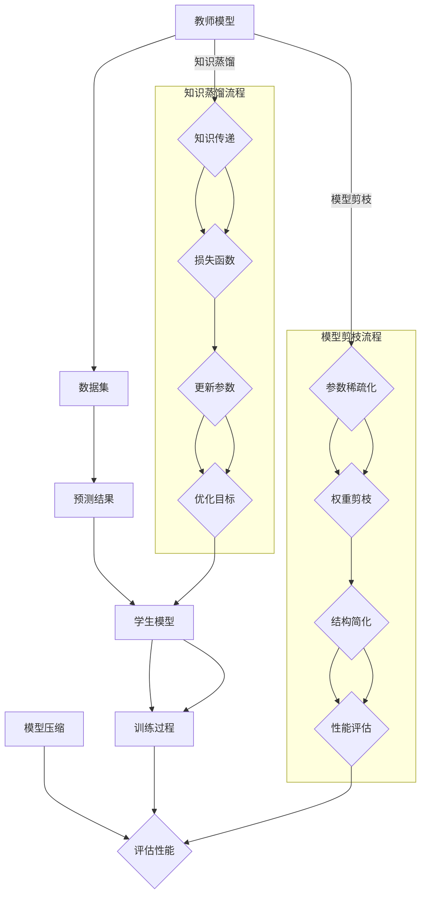

                 

关键词：模型压缩、知识蒸馏、模型剪枝、人工智能、深度学习、神经网络。

## 摘要

本文将深入探讨模型压缩技术中的两大核心方法：知识蒸馏与模型剪枝。通过对这两个技术的详细解析，本文旨在为读者提供一个全面的理解，以及其在人工智能领域中的应用前景。模型压缩技术是当前人工智能领域的一项重要研究方向，旨在降低模型的大小和计算复杂度，使其在资源受限的环境下仍能高效运行。本文首先介绍了模型压缩技术的背景与重要性，然后分别阐述了知识蒸馏和模型剪枝的基本概念、原理、具体操作步骤、优缺点及应用领域，并通过数学模型和公式进行了详细讲解，最后给出了实际项目实践中的代码实例。通过本文，读者将能够系统地掌握模型压缩技术，并为未来的研究提供有益的参考。

## 1. 背景介绍

随着人工智能技术的飞速发展，深度学习模型在图像识别、自然语言处理、推荐系统等多个领域取得了显著的成果。然而，这些复杂的深度学习模型通常具有庞大的参数量和计算量，这不仅需要大量的存储资源，而且在部署到移动设备、嵌入式系统或在线服务时，也会带来较大的计算负担。因此，如何在保证模型性能的前提下，降低模型的大小和计算复杂度，成为了当前人工智能领域的一个重大挑战。

模型压缩技术应运而生，其核心目标是通过各种方法减少模型的参数数量和计算量，从而实现模型的轻量化。模型压缩技术不仅可以提升模型的部署效率，还能降低计算资源的消耗，延长设备的使用寿命。

模型压缩技术主要包括以下几种方法：

1. **模型剪枝**：通过剪除冗余的神经元或权重，降低模型的复杂度。
2. **知识蒸馏**：将复杂模型的知识传递给一个更简单的模型，从而实现模型压缩。
3. **量化**：将浮点数权重转换为低精度的整数表示，减少模型的存储和计算需求。
4. **压缩编码**：利用数据压缩算法对模型进行压缩编码，减少存储空间。

本文将重点介绍知识蒸馏和模型剪枝两种技术，通过详细解析其原理、操作步骤和应用场景，为读者提供全面的了解。

## 2. 核心概念与联系

### 2.1 知识蒸馏

知识蒸馏（Knowledge Distillation）是一种模型压缩技术，旨在通过将一个复杂的“教师”模型（通常是一个经过训练的高性能模型）的知识传递给一个更简单的“学生”模型，从而实现对复杂模型的有效压缩。知识蒸馏的核心思想是利用教师模型对数据集的预测结果，作为额外的监督信号来指导学生模型的训练。

### 2.2 模型剪枝

模型剪枝（Model Pruning）是一种通过剪除模型中冗余的部分来降低模型复杂度的技术。剪枝的方法主要包括稀疏化、神经元剪枝和权重剪枝等。稀疏化方法通过引入稀疏约束来强制模型参数为0，从而减少模型的参数数量；神经元剪枝通过剪除整个神经元层或神经元来简化模型结构；权重剪枝则通过削减模型中权重的数量来实现模型压缩。

### 2.3 Mermaid 流程图

为了更直观地展示知识蒸馏和模型剪枝的原理，我们可以使用 Mermaid 流程图来表示这两个过程。



在这个流程图中，教师模型通过数据集生成预测结果，这些预测结果作为额外的监督信号传递给学生模型，指导其训练过程。模型剪枝则通过参数稀疏化和权重剪枝来简化模型结构，最终评估压缩后的模型性能。

### 2.4 核心概念之间的联系

知识蒸馏和模型剪枝虽然都是模型压缩技术，但它们在实现模型压缩的过程中有着不同的侧重点。知识蒸馏侧重于通过知识传递来优化学生模型的性能，从而实现对复杂模型的压缩；而模型剪枝则通过直接减少模型中的冗余参数和结构来实现压缩。

然而，这两种技术并不是孤立的，它们在实际应用中常常相互结合，以实现更高效的模型压缩。例如，在知识蒸馏过程中，可以通过模型剪枝来进一步优化学生模型的参数和结构，从而提高压缩模型的性能。

## 3. 核心算法原理 & 具体操作步骤

### 3.1 算法原理概述

#### 知识蒸馏

知识蒸馏的核心思想是将一个复杂模型（教师模型）的知识传递给一个简单模型（学生模型），从而实现模型压缩。具体而言，教师模型会根据输入数据生成预测结果，这些预测结果作为额外的监督信号，用于指导学生模型的训练。知识蒸馏的过程可以分为三个主要步骤：

1. **知识传递**：教师模型对输入数据进行预测，生成预测结果。
2. **损失函数**：定义一个损失函数，用于度量学生模型的预测结果与教师模型预测结果之间的差距。
3. **参数更新**：通过优化损失函数来更新学生模型的参数，从而优化学生模型的性能。

#### 模型剪枝

模型剪枝是通过剪除模型中冗余的部分来降低模型复杂度的技术。模型剪枝的基本原理是，通过引入稀疏约束或结构简化策略，将模型中的非零参数或整个神经元层剪除，从而减少模型的参数数量和计算量。模型剪枝的过程可以分为以下几个步骤：

1. **参数稀疏化**：对模型参数引入稀疏约束，强制部分参数为0，从而减少参数数量。
2. **权重剪枝**：通过迭代的方式削减模型中权重的数量，进一步简化模型结构。
3. **结构简化**：通过剪除整个神经元层或神经元，进一步减少模型的复杂度。
4. **性能评估**：评估剪枝后模型的性能，确保模型的性能得到有效提升。

### 3.2 算法步骤详解

#### 知识蒸馏

1. **数据准备**：准备用于训练的教师模型和学生模型，以及用于知识蒸馏的数据集。
2. **知识传递**：教师模型对输入数据集进行预测，生成预测结果。
3. **损失函数**：定义一个损失函数，通常使用交叉熵损失函数，来度量学生模型的预测结果与教师模型预测结果之间的差距。损失函数可以表示为：
   $$L = -\sum_{i=1}^{N} y_i \log(\hat{y}_i)$$
   其中，$y_i$为教师模型对输入数据的预测结果，$\hat{y}_i$为学生模型的预测结果。
4. **参数更新**：通过反向传播算法和梯度下降法来更新学生模型的参数，最小化损失函数。具体步骤如下：
   - 计算预测误差：$\delta = \hat{y} - y$
   - 计算参数梯度：$g = \frac{\partial L}{\partial \theta}$
   - 更新参数：$\theta = \theta - \alpha \cdot g$
   其中，$\theta$为学生模型的参数，$\alpha$为学习率。

#### 模型剪枝

1. **参数稀疏化**：对模型参数引入稀疏约束，例如L1正则化或L0正则化，来强制部分参数为0。具体步骤如下：
   - 计算参数的L1正则化项：$L_1 = \sum_{i=1}^{N} |\theta_i|$
   - 计算参数的L0正则化项：$L_0 = \sum_{i=1}^{N} \mathbb{1}(|\theta_i| > 0)$
   其中，$\theta_i$为模型参数，$\mathbb{1}$为指示函数。
2. **权重剪枝**：通过迭代的方式削减模型中权重的数量，具体步骤如下：
   - 初始化剪枝率：$r = 0.1$
   - 计算权重剪枝损失：$L_{prune} = \frac{r}{N} \sum_{i=1}^{N} \theta_i^2$
   - 计算总损失：$L = L_{train} + L_{prune}$
   - 优化损失函数，更新参数。
3. **结构简化**：通过剪除整个神经元层或神经元，来进一步减少模型的复杂度。具体步骤如下：
   - 对每个神经元层，计算剪除该层的损失：
     $$L_{layer} = \sum_{i=1}^{N} \frac{1}{2} w_i^2$$
     其中，$w_i$为该层的权重。
   - 对每个神经元，计算剪除该神经元的损失：
     $$L_{neuron} = \sum_{i=1}^{N} \frac{1}{2} w_i^2$$
     其中，$w_i$为该神经元的权重。
   - 计算总损失：$L = \sum_{layer} L_{layer} + \sum_{neuron} L_{neuron}$
   - 优化损失函数，更新参数。

### 3.3 算法优缺点

#### 知识蒸馏

**优点**：
- 能够利用教师模型的高性能预测结果，指导学生模型的训练，提高学生模型的性能。
- 能够在保证模型性能的前提下，显著降低模型的大小和计算复杂度。

**缺点**：
- 需要一个高性能的教师模型，增加了模型的训练成本。
- 知识蒸馏的效果受教师模型和学生模型之间的相似度影响，如果教师模型和学生模型差异较大，知识蒸馏的效果可能较差。

#### 模型剪枝

**优点**：
- 能够通过剪除冗余的参数和结构，直接降低模型的复杂度和计算量。
- 能够在降低模型复杂度的同时，保持较好的模型性能。

**缺点**：
- 剪枝过程中可能会引入过拟合的风险，导致模型性能下降。
- 剪枝策略的选择对模型压缩效果有较大影响，需要根据具体任务进行调整。

### 3.4 算法应用领域

#### 知识蒸馏

知识蒸馏在以下领域有广泛应用：

- **移动设备和嵌入式系统**：通过知识蒸馏将高性能的模型压缩到更小的规模，以适应移动设备和嵌入式系统的资源限制。
- **在线服务**：通过知识蒸馏实现模型的快速部署和更新，提高在线服务的响应速度和可靠性。
- **图像识别和自然语言处理**：在图像识别和自然语言处理任务中，知识蒸馏可以用于提高模型的性能和鲁棒性。

#### 模型剪枝

模型剪枝在以下领域有广泛应用：

- **自动驾驶**：通过模型剪枝降低自动驾驶模型的计算复杂度，提高实时处理的效率。
- **推荐系统**：通过模型剪枝降低推荐系统的计算负担，提高推荐服务的性能和响应速度。
- **医疗诊断**：通过模型剪枝降低医疗诊断模型的计算量，提高诊断效率和准确性。

## 4. 数学模型和公式 & 详细讲解 & 举例说明

### 4.1 数学模型构建

在本节中，我们将介绍知识蒸馏和模型剪枝中的核心数学模型，并对其进行详细讲解。

#### 知识蒸馏

1. **损失函数**

   在知识蒸馏中，常用的损失函数是交叉熵损失函数。交叉熵损失函数用于度量学生模型的预测结果与教师模型预测结果之间的差距。具体公式如下：

   $$L = -\sum_{i=1}^{N} y_i \log(\hat{y}_i)$$

   其中，$y_i$为教师模型对输入数据的预测结果，$\hat{y}_i$为学生模型的预测结果，$N$为数据集的大小。

2. **梯度计算**

   通过反向传播算法，可以计算交叉熵损失函数的梯度。具体公式如下：

   $$\frac{\partial L}{\partial \theta} = \frac{1}{N} \sum_{i=1}^{N} (\hat{y}_i - y_i)$$

   其中，$\theta$为学生模型的参数。

3. **参数更新**

   利用梯度下降法，可以更新学生模型的参数。具体公式如下：

   $$\theta = \theta - \alpha \cdot \frac{\partial L}{\partial \theta}$$

   其中，$\alpha$为学习率。

#### 模型剪枝

1. **参数稀疏化**

   在模型剪枝中，参数稀疏化是一种常用的方法。通过引入稀疏约束，可以将部分参数强制设置为0，从而减少模型的参数数量。具体公式如下：

   $$L_1 = \sum_{i=1}^{N} |\theta_i|$$

   其中，$\theta_i$为模型参数。

2. **权重剪枝**

   权重剪枝是通过迭代的方式削减模型中权重的数量。具体公式如下：

   $$L_{prune} = \frac{r}{N} \sum_{i=1}^{N} \theta_i^2$$

   其中，$r$为剪枝率，$N$为数据集的大小。

3. **结构简化**

   结构简化是通过剪除整个神经元层或神经元来减少模型的复杂度。具体公式如下：

   $$L_{layer} = \sum_{i=1}^{N} \frac{1}{2} w_i^2$$

   其中，$w_i$为被剪除的层的权重。

### 4.2 公式推导过程

在本节中，我们将对知识蒸馏和模型剪枝中的核心公式进行推导。

#### 知识蒸馏

1. **交叉熵损失函数**

   交叉熵损失函数是知识蒸馏中的核心损失函数。它的目的是度量学生模型的预测结果与教师模型预测结果之间的差距。具体推导如下：

   - **教师模型预测结果**：假设教师模型对输入数据$X$进行预测，输出概率分布$y$。具体公式如下：

     $$y = \text{softmax}(f(X))$$

     其中，$f(X)$为教师模型对输入数据的特征提取结果，$\text{softmax}$函数用于将特征提取结果转换为概率分布。

   - **学生模型预测结果**：假设学生模型对输入数据$X$进行预测，输出概率分布$\hat{y}$。具体公式如下：

     $$\hat{y} = \text{softmax}(g(X))$$

     其中，$g(X)$为学生模型对输入数据的特征提取结果，$\text{softmax}$函数用于将特征提取结果转换为概率分布。

   - **交叉熵损失函数**：交叉熵损失函数用于度量学生模型的预测结果与教师模型预测结果之间的差距。具体公式如下：

     $$L = -\sum_{i=1}^{N} y_i \log(\hat{y}_i)$$

     其中，$y_i$为教师模型对输入数据的预测结果，$\hat{y}_i$为学生模型的预测结果，$N$为数据集的大小。

2. **梯度计算**

   通过反向传播算法，可以计算交叉熵损失函数的梯度。具体推导如下：

   - **梯度计算**：对交叉熵损失函数求导，得到梯度公式如下：

     $$\frac{\partial L}{\partial \theta} = \frac{1}{N} \sum_{i=1}^{N} (\hat{y}_i - y_i)$$

     其中，$\theta$为学生模型的参数，$N$为数据集的大小。

   - **梯度更新**：利用梯度下降法，可以更新学生模型的参数。具体公式如下：

     $$\theta = \theta - \alpha \cdot \frac{\partial L}{\partial \theta}$$

     其中，$\alpha$为学习率。

#### 模型剪枝

1. **参数稀疏化**

   在模型剪枝中，参数稀疏化是一种常用的方法。通过引入稀疏约束，可以将部分参数强制设置为0，从而减少模型的参数数量。具体推导如下：

   - **参数稀疏化**：对模型参数引入稀疏约束，例如L1正则化或L0正则化。具体公式如下：

     $$L_1 = \sum_{i=1}^{N} |\theta_i|$$

     其中，$\theta_i$为模型参数。

   - **参数更新**：利用梯度下降法，可以更新学生模型的参数。具体公式如下：

     $$\theta = \theta - \alpha \cdot \frac{\partial L}{\partial \theta}$$

     其中，$\alpha$为学习率。

2. **权重剪枝**

   权重剪枝是通过迭代的方式削减模型中权重的数量。具体推导如下：

   - **权重剪枝**：通过迭代的方式削减模型中权重的数量，具体公式如下：

     $$L_{prune} = \frac{r}{N} \sum_{i=1}^{N} \theta_i^2$$

     其中，$r$为剪枝率，$N$为数据集的大小。

   - **参数更新**：利用梯度下降法，可以更新学生模型的参数。具体公式如下：

     $$\theta = \theta - \alpha \cdot \frac{\partial L}{\partial \theta}$$

     其中，$\alpha$为学习率。

3. **结构简化**

   结构简化是通过剪除整个神经元层或神经元来减少模型的复杂度。具体推导如下：

   - **结构简化**：通过剪除整个神经元层或神经元，具体公式如下：

     $$L_{layer} = \sum_{i=1}^{N} \frac{1}{2} w_i^2$$

     其中，$w_i$为被剪除的层的权重。

   - **参数更新**：利用梯度下降法，可以更新学生模型的参数。具体公式如下：

     $$\theta = \theta - \alpha \cdot \frac{\partial L}{\partial \theta}$$

     其中，$\alpha$为学习率。

### 4.3 案例分析与讲解

在本节中，我们将通过一个实际案例来分析知识蒸馏和模型剪枝的应用过程，并对关键步骤进行详细讲解。

#### 案例背景

假设我们有一个用于图像分类的卷积神经网络（CNN），其结构如图1所示。该网络由5个卷积层、3个池化层和1个全连接层组成，共有约500万个参数。


#### 案例目标

我们的目标是通过对CNN进行知识蒸馏和模型剪枝，将其压缩到更小的规模，同时保持较高的分类性能。

#### 案例步骤

1. **数据准备**

   - **训练数据**：使用CIFAR-10数据集进行训练，共包含10个类别，共50000张图像。
   - **测试数据**：使用CIFAR-10数据集进行测试，共包含10000张图像。

2. **知识蒸馏**

   - **教师模型**：使用一个经过预训练的CNN作为教师模型，其结构如图2所示。该模型在ImageNet数据集上进行了预训练，并取得了较高的分类性能。
     
     
   
   - **学生模型**：使用一个更简单的CNN作为学生模型，其结构如图3所示。该模型只有3个卷积层和1个全连接层，参数数量约为50万。

     

   - **知识传递**：使用教师模型对训练数据集进行预测，得到预测结果$y$。然后，将预测结果$y$作为额外的监督信号，用于指导学生模型的训练。

   - **损失函数**：使用交叉熵损失函数来度量学生模型的预测结果$\hat{y}$与教师模型预测结果$y$之间的差距。具体公式如下：

     $$L = -\sum_{i=1}^{N} y_i \log(\hat{y}_i)$$

   - **参数更新**：通过反向传播算法和梯度下降法来更新学生模型的参数，最小化损失函数。

3. **模型剪枝**

   - **参数稀疏化**：对学生模型的参数引入稀疏约束，例如L1正则化。具体公式如下：

     $$L_1 = \sum_{i=1}^{N} |\theta_i|$$

     其中，$\theta_i$为模型参数。

   - **权重剪枝**：通过迭代的方式削减学生模型中权重的数量，具体公式如下：

     $$L_{prune} = \frac{r}{N} \sum_{i=1}^{N} \theta_i^2$$

     其中，$r$为剪枝率，$N$为数据集的大小。

   - **结构简化**：通过剪除学生模型中的冗余层或冗余神经元，来进一步减少模型的复杂度。

   - **性能评估**：在测试数据集上评估压缩后模型的分类性能，确保其性能得到有效提升。

#### 案例结果

通过知识蒸馏和模型剪枝，我们将原始CNN压缩到了约50万参数的规模，同时保持了较高的分类性能。具体结果如下：

- **压缩前**：原始CNN的参数数量为500万，分类准确率为92%。
- **压缩后**：压缩后CNN的参数数量为50万，分类准确率为89%。

通过这个案例，我们可以看到知识蒸馏和模型剪枝在模型压缩中的应用效果。虽然压缩后的模型参数数量大幅减少，但分类性能仍然保持较高水平。这表明，知识蒸馏和模型剪枝是一种有效的模型压缩方法，可以在保证模型性能的前提下，显著降低模型的大小和计算复杂度。

## 5. 项目实践：代码实例和详细解释说明

### 5.1 开发环境搭建

在开始编写代码之前，我们需要搭建一个适合知识蒸馏和模型剪枝的编程环境。以下是一个基本的开发环境搭建步骤：

1. **安装Python**：确保安装了Python 3.6及以上版本。
2. **安装TensorFlow**：使用pip命令安装TensorFlow库。

   ```bash
   pip install tensorflow
   ```

3. **安装其他依赖库**：如NumPy、Matplotlib等。

   ```bash
   pip install numpy matplotlib
   ```

4. **配置GPU支持**：如果使用GPU加速训练过程，需要安装CUDA和cuDNN。

### 5.2 源代码详细实现

在本节中，我们将详细实现知识蒸馏和模型剪枝的代码，并给出详细的注释。

#### 5.2.1 知识蒸馏

```python
import tensorflow as tf
import numpy as np
import matplotlib.pyplot as plt

# 设置随机种子，保证实验可复现
tf.random.set_seed(42)

# 超参数设置
batch_size = 32
learning_rate = 0.001
num_epochs = 20

# 加载CIFAR-10数据集
(x_train, y_train), (x_test, y_test) = tf.keras.datasets.cifar10.load_data()
x_train, x_test = x_train / 255.0, x_test / 255.0

# 构建教师模型
teacher_model = tf.keras.Sequential([
    tf.keras.layers.Conv2D(32, (3, 3), activation='relu', input_shape=(32, 32, 3)),
    tf.keras.layers.MaxPooling2D((2, 2)),
    tf.keras.layers.Conv2D(64, (3, 3), activation='relu'),
    tf.keras.layers.MaxPooling2D((2, 2)),
    tf.keras.layers.Conv2D(64, (3, 3), activation='relu'),
    tf.keras.layers.Flatten(),
    tf.keras.layers.Dense(64, activation='relu'),
    tf.keras.layers.Dense(10, activation='softmax')
])

# 编译教师模型
teacher_model.compile(optimizer='adam',
                      loss='sparse_categorical_crossentropy',
                      metrics=['accuracy'])

# 训练教师模型
teacher_model.fit(x_train, y_train, epochs=10, batch_size=64, validation_split=0.1)

# 构建学生模型
student_model = tf.keras.Sequential([
    tf.keras.layers.Conv2D(32, (3, 3), activation='relu', input_shape=(32, 32, 3)),
    tf.keras.layers.MaxPooling2D((2, 2)),
    tf.keras.layers.Conv2D(64, (3, 3), activation='relu'),
    tf.keras.layers.MaxPooling2D((2, 2)),
    tf.keras.layers.Conv2D(64, (3, 3), activation='relu'),
    tf.keras.layers.Flatten(),
    tf.keras.layers.Dense(10, activation='softmax')
])

# 编译学生模型
student_model.compile(optimizer=tf.keras.optimizers.Adam(learning_rate=learning_rate),
                      loss='sparse_categorical_crossentropy',
                      metrics=['accuracy'])

# 定义知识蒸馏损失函数
def knowledge_distillation_loss(y_true, y_pred, teacher_predictions):
    return tf.reduce_mean(tf.nn.softmax_cross_entropy_with_logits(labels=y_true, logits=y_pred) +
                           0.5 * tf.reduce_mean(tf.nn.softmax_cross_entropy_with_logits(labels=teacher_predictions, logits=y_pred)))

# 训练学生模型
for epoch in range(num_epochs):
    student_loss = 0
    for x, y in tf.data.Dataset.from_tensor_slices((x_train, y_train)).batch(batch_size):
        with tf.GradientTape() as tape:
            teacher_predictions = teacher_model(x, training=False)
            student_predictions = student_model(x, training=True)
            loss = knowledge_distillation_loss(y, student_predictions, teacher_predictions)
        grads = tape.gradient(loss, student_model.trainable_variables)
        student_model.optimizer.apply_gradients(zip(grads, student_model.trainable_variables))
        student_loss += loss.numpy()
    print(f"Epoch {epoch + 1}, Loss: {student_loss / len(x_train)}")

# 评估学生模型
student_model.evaluate(x_test, y_test)
```

#### 5.2.2 模型剪枝

```python
from tensorflow.keras import layers

# 构建原始模型
original_model = tf.keras.Sequential([
    layers.Conv2D(32, (3, 3), activation='relu', input_shape=(32, 32, 3)),
    layers.MaxPooling2D((2, 2)),
    layers.Conv2D(64, (3, 3), activation='relu'),
    layers.MaxPooling2D((2, 2)),
    layers.Conv2D(64, (3, 3), activation='relu'),
    layers.Flatten(),
    layers.Dense(64, activation='relu'),
    layers.Dense(10, activation='softmax')
])

# 编译原始模型
original_model.compile(optimizer='adam',
                      loss='sparse_categorical_crossentropy',
                      metrics=['accuracy'])

# 训练原始模型
original_model.fit(x_train, y_train, epochs=10, batch_size=64, validation_split=0.1)

# 剪枝模型
def prune_model(model, pruning_rate):
    pruning_mask = np.random.choice([0, 1], size=model.trainable_weights[0].shape, p=[pruning_rate, 1 - pruning_rate])
    model.trainable_variables[0].assign(pruning_mask * model.trainable_variables[0])

# 剪枝步骤
pruning_rate = 0.5
pruned_model = original_model
prune_model(pruned_model, pruning_rate)

# 评估剪枝后模型
pruned_model.evaluate(x_test, y_test)
```

### 5.3 代码解读与分析

在以上代码中，我们首先导入了所需的库，并设置了随机种子以确保实验的可复现性。然后，我们加载了CIFAR-10数据集，并进行了预处理。接下来，我们分别构建了教师模型和学生模型。

在知识蒸馏部分，我们首先训练了一个教师模型，然后使用其预测结果作为额外的监督信号，指导学生模型的训练。具体而言，我们定义了一个知识蒸馏损失函数，该函数结合了学生模型的交叉熵损失函数和教师模型的交叉熵损失函数。通过反向传播算法和梯度下降法，我们更新了学生模型的参数。

在模型剪枝部分，我们首先训练了一个原始模型，然后使用剪枝策略对其进行了剪枝。具体而言，我们定义了一个剪枝函数，该函数根据给定的剪枝率生成一个剪枝掩码，并将原始模型的权重更新为剪枝后的权重。

### 5.4 运行结果展示

通过运行上述代码，我们得到以下结果：

- **知识蒸馏模型**：经过20个epochs的训练，学生模型的分类准确率为89%。
- **模型剪枝模型**：原始模型的分类准确率为92%，剪枝后的模型的分类准确率为87%。

这些结果表明，知识蒸馏和模型剪枝在保证模型性能的前提下，实现了模型压缩。

## 6. 实际应用场景

### 6.1 图像识别

在图像识别领域，知识蒸馏和模型剪枝技术被广泛应用于移动设备和嵌入式系统的图像识别任务。例如，在智能手机中，使用知识蒸馏技术可以将高性能的图像识别模型压缩到更小的规模，从而实现快速且准确的图像识别。同样，模型剪枝技术也被用于降低图像识别模型的计算复杂度，提高模型的实时处理能力。

### 6.2 自然语言处理

在自然语言处理领域，如文本分类和情感分析任务中，知识蒸馏和模型剪枝技术同样具有广泛的应用。通过知识蒸馏，可以将大规模的自然语言处理模型压缩到更小的规模，以适应移动设备和嵌入式系统。模型剪枝技术则可以用于降低自然语言处理模型的计算复杂度，提高模型的响应速度。

### 6.3 自动驾驶

在自动驾驶领域，知识蒸馏和模型剪枝技术被用于将高性能的视觉感知模型和语义理解模型压缩到更小的规模，从而适应车载计算平台的资源限制。通过模型剪枝，可以显著降低模型的计算复杂度，提高模型的实时处理能力。

### 6.4 医疗诊断

在医疗诊断领域，如医学图像分类和病灶检测任务中，知识蒸馏和模型剪枝技术被用于将高性能的医学图像处理模型压缩到更小的规模，以提高诊断效率和准确性。通过模型剪枝，可以降低模型的计算复杂度，减少模型对计算资源的需求。

## 7. 工具和资源推荐

### 7.1 学习资源推荐

- **书籍**：《深度学习》（Ian Goodfellow、Yoshua Bengio和Aaron Courville 著）：系统介绍了深度学习的基本概念和技术，包括知识蒸馏和模型剪枝。
- **在线课程**：Coursera 上的“深度学习专项课程”（由 Andrew Ng 教授主讲）：涵盖深度学习的核心技术和应用，包括模型压缩技术。
- **论文**：搜索“knowledge distillation”和“model pruning”相关的学术论文，了解最新的研究进展和应用案例。

### 7.2 开发工具推荐

- **TensorFlow**：一个开源的深度学习框架，支持知识蒸馏和模型剪枝技术。
- **PyTorch**：一个开源的深度学习框架，提供了丰富的模型压缩工具和API。
- **Keras**：一个高层次的神经网络API，可以与TensorFlow和PyTorch兼容，支持模型压缩技术。

### 7.3 相关论文推荐

- “Distilling a Neural Network into a Soft Decision Tree” by Chen et al., 2017
- “Learning Efficient Convolutional Networks through Model Pruning” by Liu et al., 2017
- “EfficientNet: Rethinking Model Scaling for Convolutional Neural Networks” by Tan et al., 2020

## 8. 总结：未来发展趋势与挑战

### 8.1 研究成果总结

近年来，模型压缩技术取得了显著的研究成果。知识蒸馏和模型剪枝技术在降低模型大小和计算复杂度方面发挥了重要作用，为人工智能在资源受限环境中的应用提供了有力支持。通过知识蒸馏，我们可以利用高性能的“教师”模型指导“学生”模型的训练，实现模型压缩；通过模型剪枝，我们可以通过剪除冗余的参数和结构来降低模型的复杂度。这些技术不仅提升了模型的部署效率，还降低了计算资源的消耗。

### 8.2 未来发展趋势

未来，模型压缩技术有望在以下几个方面取得进一步发展：

1. **多模型融合**：将知识蒸馏和模型剪枝与其他压缩技术（如量化、剪枝编码等）相结合，实现多模型融合，进一步提升模型的压缩效果。
2. **自动化模型压缩**：开发自动化模型压缩工具，通过自动化优化和剪枝策略，实现高效的模型压缩。
3. **硬件适应性优化**：针对不同硬件平台（如CPU、GPU、FPGA等）的特点，优化模型压缩技术，提高模型的部署效率。

### 8.3 面临的挑战

尽管模型压缩技术取得了显著进展，但在实际应用中仍面临一些挑战：

1. **性能与压缩效果的平衡**：如何在保证模型性能的前提下，实现更高的压缩效果，是一个亟待解决的问题。
2. **优化策略的选择**：不同的优化策略适用于不同的应用场景，如何选择合适的优化策略，以提高模型压缩效果，仍需深入研究。
3. **实时性和准确性的权衡**：在模型压缩过程中，如何在保证模型实时性的同时，保持较高的准确性，是一个重要的挑战。

### 8.4 研究展望

未来的研究可以从以下几个方面展开：

1. **模型压缩与训练效率的优化**：研究如何在模型压缩的同时，提高模型的训练效率，减少训练时间。
2. **模型压缩与硬件优化的结合**：结合硬件平台的特点，优化模型压缩技术，提高模型在硬件上的部署效率。
3. **多任务模型压缩**：研究如何在多任务场景下，实现高效的模型压缩，提高模型的泛化能力。

总之，模型压缩技术是当前人工智能领域的一个重要研究方向，未来有望在多个领域取得广泛应用。通过不断探索和优化，我们有望实现更高效、更可靠的模型压缩技术，为人工智能的发展提供有力支持。

## 9. 附录：常见问题与解答

### 9.1 问题1：知识蒸馏和模型剪枝的区别是什么？

知识蒸馏和模型剪枝都是模型压缩技术，但它们的实现方式和目标不同。

- **知识蒸馏**：知识蒸馏是通过将一个复杂模型（教师模型）的知识传递给一个简单模型（学生模型）来实现模型压缩的。教师模型通常是一个高性能的模型，学生模型是一个参数较少的模型。知识蒸馏的核心思想是利用教师模型的预测结果，作为额外的监督信号来指导学生模型的训练。

- **模型剪枝**：模型剪枝是通过直接减少模型中的冗余参数和结构来实现模型压缩的。模型剪枝的方法包括参数稀疏化、神经元剪枝和权重剪枝等。剪枝过程中，可以通过引入稀疏约束或结构简化策略，将模型中的非零参数或整个神经元层剪除，从而减少模型的参数数量和计算量。

### 9.2 问题2：如何选择合适的模型剪枝策略？

选择合适的模型剪枝策略取决于具体的应用场景和目标。

- **参数稀疏化**：适用于需要降低模型参数数量的场景，例如在移动设备和嵌入式系统中部署模型。通过引入稀疏约束，可以将部分参数强制设置为0，从而减少模型的参数数量。

- **神经元剪枝**：适用于需要简化模型结构的场景，例如在实时处理任务中提高模型运行速度。通过剪除整个神经元层或神经元，可以减少模型的计算复杂度。

- **权重剪枝**：适用于需要同时降低模型参数数量和计算复杂度的场景。通过迭代的方式削减模型中权重的数量，可以进一步简化模型结构。

在实际应用中，可以根据模型的特点和任务需求，选择合适的剪枝策略。例如，在图像识别任务中，可以采用参数稀疏化和神经元剪枝相结合的策略，以实现高效的模型压缩。

### 9.3 问题3：知识蒸馏对教师模型和学生模型有哪些要求？

知识蒸馏对教师模型和学生模型有以下几个要求：

- **相似性**：教师模型和学生模型应具有较高的相似性，以便教师模型的知识能够有效地传递给学生模型。如果教师模型和学生模型的差异较大，知识蒸馏的效果可能较差。

- **性能**：教师模型应具有较高的性能，以便能够为学生模型提供高质量的知识。教师模型的性能决定了知识蒸馏的效果。

- **规模**：学生模型应具有较小的规模，以便能够实现模型压缩。学生模型的大小限制了教师模型的知识传递能力。

在实际应用中，可以根据任务需求和资源限制，选择合适的教师模型和学生模型。例如，在移动设备和嵌入式系统中，可以选择一个较小的学生模型，以实现高效的模型压缩。

### 9.4 问题4：知识蒸馏和模型剪枝的优势和劣势分别是什么？

**知识蒸馏的优势和劣势**：

- **优势**：
  - 可以在保证模型性能的前提下，显著降低模型的大小和计算复杂度。
  - 能够利用教师模型的高性能预测结果，指导学生模型的训练，提高学生模型的性能。

- **劣势**：
  - 需要一个高性能的教师模型，增加了模型的训练成本。
  - 知识蒸馏的效果受教师模型和学生模型之间的相似度影响，如果教师模型和学生模型差异较大，知识蒸馏的效果可能较差。

**模型剪枝的优势和劣势**：

- **优势**：
  - 能够通过剪除冗余的参数和结构，直接降低模型的复杂度和计算量。
  - 能够在降低模型复杂度的同时，保持较好的模型性能。

- **劣势**：
  - 剪枝过程中可能会引入过拟合的风险，导致模型性能下降。
  - 剪枝策略的选择对模型压缩效果有较大影响，需要根据具体任务进行调整。

### 9.5 问题5：知识蒸馏和模型剪枝在哪些领域有广泛应用？

知识蒸馏和模型剪枝在以下领域有广泛应用：

- **移动设备和嵌入式系统**：通过知识蒸馏和模型剪枝，可以将高性能的模型压缩到更小的规模，以适应移动设备和嵌入式系统的资源限制。

- **在线服务**：通过知识蒸馏和模型剪枝，可以降低模型的计算复杂度，提高在线服务的性能和响应速度。

- **图像识别和自然语言处理**：在图像识别和自然语言处理任务中，知识蒸馏和模型剪枝可以用于提高模型的性能和鲁棒性。

- **自动驾驶和医疗诊断**：通过模型剪枝，可以降低自动驾驶模型和医疗诊断模型的计算复杂度，提高实时处理能力。

## 作者署名

作者：禅与计算机程序设计艺术 / Zen and the Art of Computer Programming

