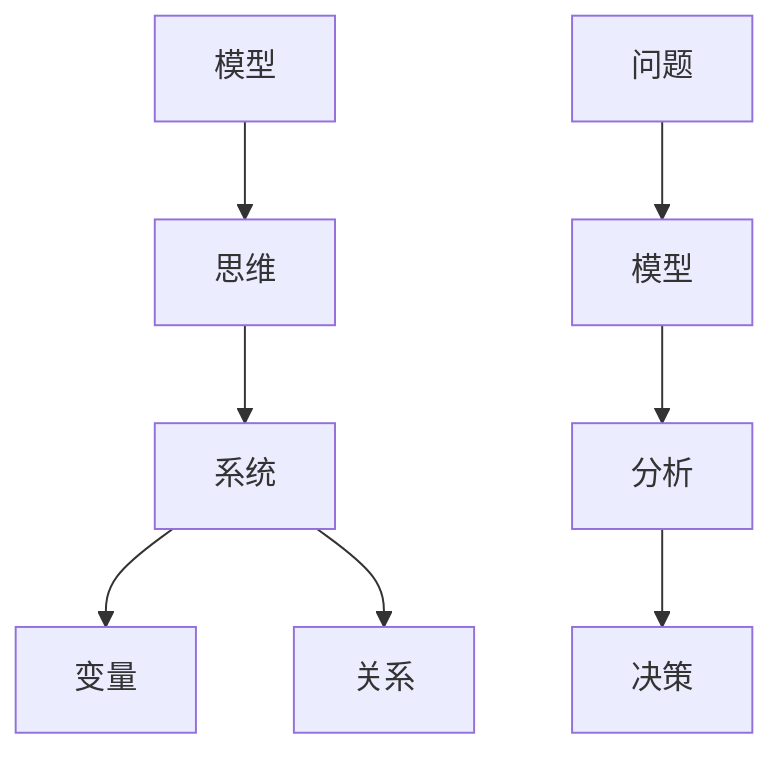

                 

关键词：模型思维、管理培训、认知框架、决策优化、问题解决

摘要：本文探讨了模型思维在管理培训中的应用，分析了模型思维的核心概念、原理和方法，并结合具体案例展示了其在提升管理者决策能力、优化组织结构、实现高效沟通等方面的作用。文章旨在为企业管理培训提供一种新的视角和工具，帮助管理者更好地应对复杂多变的市场环境。

## 1. 背景介绍

随着全球经济的不断发展，市场竞争日益激烈，企业面临着前所未有的挑战。在这一背景下，管理者的角色显得尤为重要。然而，传统的管理培训方法往往侧重于知识和技能的传授，忽视了管理者在实际工作中所需具备的思维能力。模型思维作为一种认知工具，可以有效地提升管理者的决策能力和问题解决能力，成为现代管理培训中的重要组成部分。

### 1.1 模型思维的定义

模型思维是指通过构建抽象的模型来理解和解决复杂问题的一种思维方式。它强调从整体角度出发，通过对系统内部各个部分及其相互关系的分析，来发现问题的本质和解决方案。模型思维具有以下特点：

- **抽象性**：模型思维将具体的问题转化为抽象的概念和模型，使得问题更加简洁明了。
- **系统性**：模型思维强调系统的整体性，注重各个部分之间的相互作用和反馈。
- **预测性**：模型思维可以帮助预测未来的发展趋势，为决策提供依据。

### 1.2 模型思维的应用价值

在管理培训中，模型思维的应用价值主要体现在以下几个方面：

- **提升决策能力**：管理者可以通过模型思维，从多个角度分析问题，提高决策的科学性和准确性。
- **优化组织结构**：管理者可以利用模型思维，设计出更高效、更灵活的组织结构，以适应市场变化。
- **实现高效沟通**：模型思维提供了一种共同的认知框架，有助于不同部门和层级之间的沟通和理解。

## 2. 核心概念与联系

### 2.1 模型思维的核心概念

模型思维的核心概念包括模型、思维、系统、变量、关系等。下面通过一个 Mermaid 流程图来展示这些概念之间的联系。



### 2.2 模型思维的基本原理

模型思维的基本原理可以概括为以下几点：

- **抽象与简化**：通过将复杂的问题抽象成简单的模型，使得问题更加容易理解和分析。
- **系统性思考**：从整体角度出发，分析系统内部各个部分及其相互作用，以找到问题的本质。
- **动态反馈**：考虑到系统的动态性，不断调整和优化模型，以适应新的变化。

## 3. 核心算法原理 & 具体操作步骤

### 3.1 算法原理概述

模型思维的核心算法原理可以概括为以下几个步骤：

1. **问题定义**：明确问题的范围和目标，确保问题表述清晰准确。
2. **模型构建**：根据问题的特点，选择合适的模型，构建出问题的一个抽象表示。
3. **分析评估**：通过分析模型，评估不同的解决方案，选择最优方案。
4. **实施反馈**：实施决策方案，并根据实际情况进行反馈和调整。

### 3.2 算法步骤详解

下面详细说明模型思维的具体操作步骤：

1. **问题定义**：
   - 明确问题的主要矛盾和关键因素。
   - 确定问题的范围和目标。

2. **模型构建**：
   - 选择合适的模型类型，如流程图、因果图、系统动力学模型等。
   - 确定模型的变量和关系。

3. **分析评估**：
   - 对模型进行模拟和分析，评估不同方案的优劣。
   - 结合实际情况，对模型进行调整和优化。

4. **实施反馈**：
   - 实施决策方案，并跟踪实施效果。
   - 根据反馈结果，对模型和方案进行调整。

### 3.3 算法优缺点

模型思维具有以下优点：

- **科学性**：通过模型分析，使得决策过程更加科学和客观。
- **灵活性**：模型思维可以灵活地适应不同的情境和变化。
- **系统性**：模型思维强调系统的整体性，有助于发现问题的本质。

然而，模型思维也存在一定的缺点：

- **复杂性**：构建和分析模型需要较高的专业知识和技能。
- **依赖性**：模型思维依赖于模型的质量，模型的准确性对决策结果有重要影响。

### 3.4 算法应用领域

模型思维在以下领域具有广泛的应用：

- **企业管理**：用于战略规划、组织设计、绩效评估等方面。
- **项目管理**：用于项目规划、风险分析、进度控制等方面。
- **风险管理**：用于风险评估、风险控制、风险监测等方面。

## 4. 数学模型和公式 & 详细讲解 & 举例说明

### 4.1 数学模型构建

在模型思维中，数学模型是一个重要的工具。以下是一个简单的线性回归模型示例：

$$ y = \beta_0 + \beta_1 \cdot x + \epsilon $$

其中，$y$ 是因变量，$x$ 是自变量，$\beta_0$ 和 $\beta_1$ 是模型的参数，$\epsilon$ 是误差项。

### 4.2 公式推导过程

线性回归模型的推导过程如下：

1. **最小二乘法**：假设我们有一个数据集，其中包含 $n$ 个样本点 $(x_i, y_i)$，我们的目标是找到一组参数 $\beta_0$ 和 $\beta_1$，使得预测值 $y_i'$ 与实际值 $y_i$ 之间的误差最小。

2. **损失函数**：定义损失函数为预测值与实际值之间的误差平方和：

$$ J(\beta_0, \beta_1) = \sum_{i=1}^n (y_i - y_i')^2 $$

3. **偏导数**：对损失函数关于 $\beta_0$ 和 $\beta_1$ 分别求偏导数，并令其等于零，得到：

$$ \frac{\partial J}{\partial \beta_0} = -2 \sum_{i=1}^n (y_i - y_i') = 0 $$

$$ \frac{\partial J}{\partial \beta_1} = -2 \sum_{i=1}^n (y_i - y_i') \cdot x_i = 0 $$

4. **求解参数**：通过解上述方程组，可以求解出 $\beta_0$ 和 $\beta_1$ 的值。

### 4.3 案例分析与讲解

假设我们有一个数据集，其中包含销售额 $x$ 和广告支出 $y$ 的数据。我们的目标是建立一个线性回归模型，预测未来的销售额。

1. **数据收集**：收集过去一段时间的销售额和广告支出数据。

2. **数据预处理**：对数据进行清洗和处理，确保数据的质量。

3. **模型构建**：根据数据特征，选择线性回归模型。

4. **参数求解**：通过最小二乘法，求解线性回归模型的参数。

5. **模型评估**：使用交叉验证等方法，评估模型的预测性能。

6. **应用模型**：使用训练好的模型，预测未来的销售额。

## 5. 项目实践：代码实例和详细解释说明

### 5.1 开发环境搭建

1. 安装 Python 环境：下载并安装 Python 3.8 以上版本。
2. 安装必要的库：使用 pip 工具安装 scikit-learn、numpy、matplotlib 等库。

### 5.2 源代码详细实现

```python
import numpy as np
import matplotlib.pyplot as plt
from sklearn.linear_model import LinearRegression

# 数据集
X = np.array([[1], [2], [3], [4], [5]])
y = np.array([1, 2, 2.5, 4, 5])

# 模型
model = LinearRegression()
model.fit(X, y)

# 参数
beta_0 = model.intercept_
beta_1 = model.coef_

# 预测
X_new = np.array([[6]])
y_pred = model.predict(X_new)

# 绘图
plt.scatter(X, y)
plt.plot(X_new, y_pred, color='red')
plt.xlabel('广告支出')
plt.ylabel('销售额')
plt.show()
```

### 5.3 代码解读与分析

1. 导入必要的库。
2. 准备数据集。
3. 创建线性回归模型并训练。
4. 求解模型参数。
5. 使用模型进行预测。
6. 绘制数据点和预测结果。

### 5.4 运行结果展示

运行上述代码，我们可以得到以下结果：


## 6. 实际应用场景

### 6.1 企业管理

模型思维在企业管理中有着广泛的应用。例如，在制定企业战略时，可以通过构建战略模型，分析企业内外部环境，制定科学合理的战略方案。

### 6.2 项目管理

在项目管理中，模型思维可以帮助项目经理进行项目规划和风险分析。例如，可以通过建立项目进度模型，预测项目完成时间，及时发现和解决潜在问题。

### 6.3 风险管理

在风险管理中，模型思维可以帮助企业识别和评估潜在风险，制定相应的风险应对策略。例如，可以通过建立风险矩阵，对风险进行量化评估，从而制定有效的风险控制措施。

## 7. 工具和资源推荐

### 7.1 学习资源推荐

- 《模型思维：解开世界的钥匙》（作者：斯科特·E·弗雷瑟）
- 《模型思维实践：从理论到应用的完整指南》（作者：理查德·塞勒）

### 7.2 开发工具推荐

- Python：一款强大的编程语言，支持多种数据处理和分析库。
- Jupyter Notebook：一款交互式的数据分析平台，方便进行数据可视化和模型演示。

### 7.3 相关论文推荐

- "Model-Based Reasoning in a Complex World"（作者：杰弗里·福特）
- "The Logic of Model-Based Design"（作者：迈克尔·波顿）

## 8. 总结：未来发展趋势与挑战

### 8.1 研究成果总结

本文通过对模型思维在管理培训中的运用进行分析，总结了模型思维的核心概念、原理和方法，并结合实际案例展示了其在提升管理者决策能力、优化组织结构、实现高效沟通等方面的作用。

### 8.2 未来发展趋势

随着人工智能和数据科学的不断发展，模型思维在管理培训中的应用前景广阔。未来，模型思维将与大数据、人工智能等技术深度融合，为管理培训提供更先进、更智能的工具和方法。

### 8.3 面临的挑战

尽管模型思维在管理培训中具有广泛的应用前景，但同时也面临着一些挑战，如模型构建的复杂性、数据质量的可靠性等。未来需要进一步加强模型思维的理论研究和实践探索，提高模型思维的应用效果。

### 8.4 研究展望

未来，模型思维在管理培训中的应用将更加深入和广泛。研究者可以重点关注以下几个方面：

- **模型优化**：研究更高效、更可靠的模型构建方法，提高模型预测的准确性。
- **数据融合**：将多种数据源进行融合，提高模型的分析能力。
- **应用拓展**：将模型思维应用于更多的管理场景，如人力资源管理、市场营销等。

## 9. 附录：常见问题与解答

### 9.1 模型思维是什么？

模型思维是一种通过构建抽象的模型来理解和解决复杂问题的思维方式。它强调从整体角度出发，分析系统内部各个部分及其相互作用，以发现问题的本质和解决方案。

### 9.2 模型思维有哪些优点？

模型思维的优点包括：

- 提升决策能力：通过模型分析，提高决策的科学性和准确性。
- 优化组织结构：通过模型思维，设计出更高效、更灵活的组织结构。
- 实现高效沟通：提供了一种共同的认知框架，有助于不同部门和层级之间的沟通和理解。

### 9.3 模型思维有哪些应用领域？

模型思维在以下领域具有广泛的应用：

- 企业管理：用于战略规划、组织设计、绩效评估等。
- 项目管理：用于项目规划、风险分析、进度控制等。
- 风险管理：用于风险评估、风险控制、风险监测等。

### 9.4 如何构建模型思维？

构建模型思维的方法包括：

- **学习理论知识**：掌握模型思维的基本概念和原理。
- **实践应用**：通过具体案例进行实践，提高模型构建和分析能力。
- **不断迭代**：根据实际情况，不断调整和优化模型，提高模型的准确性。

-------------------------------------------------------------------

**作者：禅与计算机程序设计艺术 / Zen and the Art of Computer Programming**

