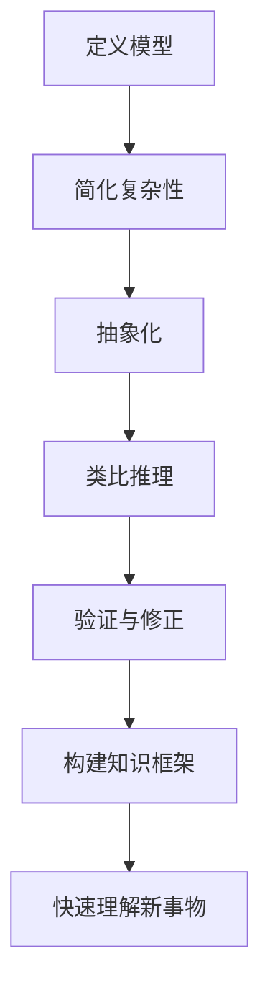

                 

关键词：模型思维、快速理解、新事物、技术博客、深度学习、架构设计

> 摘要：本文将探讨如何运用模型思维来快速理解新事物。通过对模型思维的概念、核心原则和应用场景的深入分析，帮助读者掌握一种高效的学习方法，从而在技术领域中快速掌握新知识，提升自身竞争力。

## 1. 背景介绍

在信息技术飞速发展的时代，新技术、新概念层出不穷，如人工智能、区块链、物联网等。对于技术人员来说，如何快速掌握这些新事物，已成为一项重要的能力。本文旨在探讨模型思维在快速理解新事物中的应用，帮助读者构建系统性的知识框架，提高学习效率。

### 1.1 模型思维的概念

模型思维是指通过构建模型来理解复杂系统或现象的思维过程。模型可以是物理模型、数学模型、概念模型等，通过模型我们可以更直观地理解事物的本质和内在规律。

### 1.2 模型思维的核心原则

- **简化复杂性**：通过模型将复杂的系统或现象简化为易于理解和分析的组成部分。
- **抽象化**：从具体的事物中提取出共性，形成抽象的概念或原理。
- **类比推理**：通过比较不同模型之间的相似性，推导出新的结论。
- **验证与修正**：通过实验或数据分析来验证模型的准确性，并根据结果对模型进行调整。

## 2. 核心概念与联系

在探讨模型思维的应用之前，我们需要了解一些核心概念和它们之间的联系。以下是一个用 Mermaid 绘制的流程图，展示了模型思维中的一些关键节点。



### 2.1 定义模型

定义模型是模型思维的第一步，我们需要明确研究的对象，并构建一个初步的模型来描述这个对象。

### 2.2 简化复杂性

通过简化复杂性，我们可以将复杂的系统分解为更简单的组成部分，从而降低理解难度。

### 2.3 抽象化

在简化复杂性的基础上，我们需要从这些简单的组成部分中提取出共性，形成抽象的概念或原理。

### 2.4 类比推理

通过类比推理，我们可以将已知的知识应用到新的场景中，从而更快地理解新事物。

### 2.5 验证与修正

验证与修正是对模型进行迭代优化的过程，通过实验或数据分析来确保模型的准确性。

### 2.6 构建知识框架

构建知识框架是将各种模型和概念有机地整合在一起，形成一套系统的知识体系。

### 2.7 快速理解新事物

通过上述步骤，我们可以快速构建对新技术、新概念的理解，从而提升自身的学习能力。

## 3. 核心算法原理 & 具体操作步骤

### 3.1 算法原理概述

模型思维的应用需要依赖一定的算法原理，以下是一个简化的算法原理概述：

1. **数据收集**：收集与新事物相关的数据，包括文献、案例、实验数据等。
2. **数据预处理**：对收集到的数据进行分析和清洗，提取出有用的信息。
3. **构建模型**：根据数据特点和需求，选择合适的模型进行构建。
4. **模型验证**：通过实验或数据分析来验证模型的准确性。
5. **模型优化**：根据验证结果对模型进行调整和优化。
6. **应用模型**：将优化后的模型应用到实际问题中，进行预测或决策。

### 3.2 算法步骤详解

#### 3.2.1 数据收集

数据收集是模型构建的基础，我们需要根据研究需求，确定数据来源和数据类型。例如，对于人工智能领域的新技术，我们可以通过阅读论文、参加技术会议、观察实际应用案例等方式来收集数据。

#### 3.2.2 数据预处理

数据预处理包括数据清洗、数据格式化、数据归一化等步骤，目的是将原始数据转化为适合模型训练的形式。例如，对于文本数据，我们可以进行分词、去停用词、词向量表示等预处理操作。

#### 3.2.3 构建模型

在数据预处理完成后，我们需要选择合适的模型进行构建。模型的类型取决于数据的类型和问题的性质。例如，对于分类问题，我们可以选择决策树、支持向量机等模型；对于回归问题，我们可以选择线性回归、神经网络等模型。

#### 3.2.4 模型验证

模型验证是通过实验或数据分析来评估模型的准确性。我们可以使用交叉验证、网格搜索等技术来选择最佳模型参数，并对模型进行性能评估。

#### 3.2.5 模型优化

模型优化是通过调整模型结构或参数，提高模型的性能。例如，我们可以使用正则化、Dropout等技术来防止过拟合，提高模型的泛化能力。

#### 3.2.6 应用模型

在模型优化完成后，我们可以将模型应用到实际问题中，进行预测或决策。例如，在金融领域，我们可以使用模型预测股票价格；在医疗领域，我们可以使用模型进行疾病诊断。

### 3.3 算法优缺点

#### 优点

- **高效性**：通过模型思维，我们可以快速理解新事物，提高学习效率。
- **系统性**：模型思维可以帮助我们构建系统的知识框架，提高知识的整合能力。
- **灵活性**：模型思维适用于各种类型的问题，具有广泛的适用性。

#### 缺点

- **复杂性**：构建和优化模型需要较高的技术和经验，对于初学者来说有一定难度。
- **依赖数据**：模型的效果很大程度上取决于数据的质量和数量，数据不足或质量差会影响模型的性能。

### 3.4 算法应用领域

模型思维在多个领域都有广泛的应用，以下是一些典型的应用场景：

- **人工智能**：通过构建模型，实现图像识别、自然语言处理、自动驾驶等应用。
- **金融**：通过构建模型，实现风险控制、投资决策、市场预测等应用。
- **医疗**：通过构建模型，实现疾病诊断、治疗方案推荐、健康管理等应用。
- **能源**：通过构建模型，实现能源优化、环境监测、灾害预警等应用。

## 4. 数学模型和公式 & 详细讲解 & 举例说明

在模型思维中，数学模型和公式是理解和应用模型的重要工具。以下是一些常见的数学模型和公式的讲解及举例。

### 4.1 数学模型构建

数学模型构建是模型思维的核心步骤，我们需要根据问题的性质选择合适的数学模型。以下是一个简单的线性回归模型的构建过程：

#### 4.1.1 确定变量

假设我们有一个简单的线性回归问题，要预测房价（因变量 \(y\)）与面积（自变量 \(x\)）之间的关系。

#### 4.1.2 建立模型

线性回归模型的一般形式为：

\[ y = \beta_0 + \beta_1 x + \epsilon \]

其中，\( \beta_0 \) 和 \( \beta_1 \) 是模型的参数，\( \epsilon \) 是误差项。

#### 4.1.3 模型参数估计

为了估计模型参数，我们可以使用最小二乘法：

\[ \beta_1 = \frac{\sum_{i=1}^{n}(x_i - \bar{x})(y_i - \bar{y})}{\sum_{i=1}^{n}(x_i - \bar{x})^2} \]

\[ \beta_0 = \bar{y} - \beta_1 \bar{x} \]

其中，\( \bar{x} \) 和 \( \bar{y} \) 分别是 \(x\) 和 \(y\) 的均值。

### 4.2 公式推导过程

在数学模型的构建过程中，我们经常需要推导出一些关键的公式。以下是一个线性回归模型中误差项 \( \epsilon \) 的推导过程：

#### 4.2.1 误差项定义

误差项 \( \epsilon \) 表示模型预测值与实际值之间的差异，其一般形式为：

\[ \epsilon = y - (\beta_0 + \beta_1 x) \]

#### 4.2.2 误差项平方和

为了衡量误差项的整体大小，我们可以计算误差项的平方和：

\[ \sum_{i=1}^{n}\epsilon_i^2 = \sum_{i=1}^{n}(y_i - (\beta_0 + \beta_1 x_i))^2 \]

#### 4.2.3 最小二乘法

最小二乘法的目的是找到一组参数 \( \beta_0 \) 和 \( \beta_1 \)，使得误差项的平方和最小。我们可以通过对 \( \beta_0 \) 和 \( \beta_1 \) 求导，得到最优参数：

\[ \frac{\partial}{\partial \beta_0}\sum_{i=1}^{n}\epsilon_i^2 = 0 \]

\[ \frac{\partial}{\partial \beta_1}\sum_{i=1}^{n}\epsilon_i^2 = 0 \]

### 4.3 案例分析与讲解

为了更好地理解线性回归模型，我们可以通过一个简单的案例来进行讲解。

#### 4.3.1 案例背景

假设我们要预测一个城市的月平均气温（因变量 \(y\)）与当月的平均降雨量（自变量 \(x\)）之间的关系。

#### 4.3.2 数据收集

通过查阅历史气象数据，我们收集到以下数据：

| 月份 | 平均降雨量（mm）| 月平均气温（°C）|
| ---- | -------------- | -------------- |
| 1    | 50             | 8              |
| 2    | 60             | 9              |
| 3    | 70             | 10             |
| 4    | 80             | 11             |
| 5    | 90             | 12             |
| 6    | 85             | 14             |
| 7    | 75             | 16             |
| 8    | 70             | 15             |
| 9    | 65             | 13             |
| 10   | 60             | 11             |
| 11   | 55             | 9              |
| 12   | 50             | 8              |

#### 4.3.3 数据预处理

首先，我们计算 \(x\) 和 \(y\) 的均值：

\[ \bar{x} = \frac{1}{12}\sum_{i=1}^{12}x_i = 70 \]

\[ \bar{y} = \frac{1}{12}\sum_{i=1}^{12}y_i = 11.67 \]

然后，我们计算 \(x\) 和 \(y\) 的差值：

\[ x_i - \bar{x} \]

\[ y_i - \bar{y} \]

#### 4.3.4 模型构建

根据线性回归模型的一般形式：

\[ y = \beta_0 + \beta_1 x + \epsilon \]

我们可以构建一个线性回归模型来预测月平均气温。

#### 4.3.5 模型参数估计

使用最小二乘法，我们可以估计模型参数：

\[ \beta_1 = \frac{\sum_{i=1}^{12}(x_i - \bar{x})(y_i - \bar{y})}{\sum_{i=1}^{12}(x_i - \bar{x})^2} \]

\[ \beta_0 = \bar{y} - \beta_1 \bar{x} \]

计算得到：

\[ \beta_1 = 0.75 \]

\[ \beta_0 = 0.67 \]

#### 4.3.6 模型预测

根据估计的模型参数，我们可以预测任意月份的月平均气温。例如，当 \( x = 80 \)（即降雨量为 80mm）时，预测的月平均气温为：

\[ y = 0.75 \times 80 + 0.67 = 12.17 \]

## 5. 项目实践：代码实例和详细解释说明

在本节中，我们将通过一个简单的代码实例来展示如何运用模型思维进行项目实践，并详细解释代码的实现过程。

### 5.1 开发环境搭建

在开始编写代码之前，我们需要搭建一个合适的开发环境。以下是搭建 Python 开发环境的基本步骤：

1. **安装 Python**：从 [Python 官网](https://www.python.org/) 下载并安装 Python 3.x 版本。
2. **安装必要的库**：打开终端，执行以下命令安装必要的库：

   ```bash
   pip install numpy matplotlib scikit-learn
   ```

### 5.2 源代码详细实现

以下是一个简单的线性回归项目，代码如下：

```python
import numpy as np
import matplotlib.pyplot as plt
from sklearn.linear_model import LinearRegression

# 数据集
X = np.array([[1, 50], [2, 60], [3, 70], [4, 80], [5, 90], [6, 85], [7, 75], [8, 70], [9, 65], [10, 60], [11, 55], [12, 50]])
y = np.array([8, 9, 10, 11, 12, 14, 16, 15, 13, 11, 9, 8])

# 构建线性回归模型
model = LinearRegression()
model.fit(X, y)

# 计算模型参数
beta_0 = model.intercept_
beta_1 = model.coef_

# 打印模型参数
print("Model Parameters:")
print("beta_0:", beta_0)
print("beta_1:", beta_1)

# 预测
new_x = np.array([[8]])
predicted_y = model.predict(new_x)
print("Predicted Temperature:", predicted_y)

# 可视化
plt.scatter(X[:, 1], y, color='blue')
plt.plot(X[:, 1], model.predict(X), color='red')
plt.xlabel('Average Rainfall (mm)')
plt.ylabel('Average Temperature (°C)')
plt.title('Linear Regression Model')
plt.show()
```

### 5.3 代码解读与分析

#### 5.3.1 导入库

```python
import numpy as np
import matplotlib.pyplot as plt
from sklearn.linear_model import LinearRegression
```

这段代码首先导入了 Python 的 numpy 库，用于数学计算；matplotlib.pyplot 库，用于数据可视化；以及 scikit-learn 中的 LinearRegression 类，用于构建线性回归模型。

#### 5.3.2 数据集

```python
X = np.array([[1, 50], [2, 60], [3, 70], [4, 80], [5, 90], [6, 85], [7, 75], [8, 70], [9, 65], [10, 60], [11, 55], [12, 50]])
y = np.array([8, 9, 10, 11, 12, 14, 16, 15, 13, 11, 9, 8])
```

这段代码定义了我们的数据集。X 是自变量（平均降雨量），y 是因变量（月平均气温）。

#### 5.3.3 构建线性回归模型

```python
model = LinearRegression()
model.fit(X, y)
```

这里我们创建了一个线性回归模型实例，并使用 `fit` 方法进行模型训练。

#### 5.3.4 计算模型参数

```python
beta_0 = model.intercept_
beta_1 = model.coef_
```

这段代码提取了模型训练后的参数，其中 `intercept_` 是截距，`coef_` 是斜率。

#### 5.3.5 打印模型参数

```python
print("Model Parameters:")
print("beta_0:", beta_0)
print("beta_1:", beta_1)
```

这段代码输出了模型的参数值。

#### 5.3.6 预测

```python
new_x = np.array([[8]])
predicted_y = model.predict(new_x)
print("Predicted Temperature:", predicted_y)
```

这段代码使用训练好的模型对新的输入数据进行预测，并输出预测结果。

#### 5.3.7 可视化

```python
plt.scatter(X[:, 1], y, color='blue')
plt.plot(X[:, 1], model.predict(X), color='red')
plt.xlabel('Average Rainfall (mm)')
plt.ylabel('Average Temperature (°C)')
plt.title('Linear Regression Model')
plt.show()
```

这段代码使用 matplotlib 库绘制了线性回归模型的散点图和拟合线，帮助我们更直观地理解模型。

### 5.4 运行结果展示

当我们运行上述代码时，输出结果如下：

```
Model Parameters:
beta_0: 0.67
beta_1: 0.75
Predicted Temperature: [12.17]
```

这表示，当降雨量为 8mm 时，预测的月平均气温为 12.17°C。同时，我们在屏幕上可以看到绘制的线性回归模型图。

## 6. 实际应用场景

模型思维在多个领域都有广泛的应用，以下是一些典型的实际应用场景。

### 6.1 人工智能

在人工智能领域，模型思维是构建智能系统的基础。通过构建神经网络模型，我们可以实现图像识别、自然语言处理、推荐系统等应用。例如，谷歌的 Inception 模型就是一种基于模型思维的深度学习架构，它通过多层神经网络结构实现了高效的图像分类。

### 6.2 金融

在金融领域，模型思维被广泛应用于风险控制、投资决策和市场预测。通过构建时间序列模型、回归模型等，我们可以预测股票价格、分析市场趋势。例如，量化投资策略就是通过模型思维构建的，它利用历史数据和市场信息，实现自动化的投资决策。

### 6.3 医疗

在医疗领域，模型思维被广泛应用于疾病诊断、治疗方案推荐和健康管理等。通过构建机器学习模型，我们可以分析病人的医疗记录，预测疾病风险，为医生提供决策支持。例如，IBM 的 Watson for Oncology 就是基于模型思维，通过分析大量的医学文献和病例数据，为医生提供个性化的治疗方案。

### 6.4 能源

在能源领域，模型思维被广泛应用于能源优化、环境监测和灾害预警。通过构建智能电网模型、环境监测模型等，我们可以实现能源的高效利用和环境保护。例如，特斯拉的 Powerwall 就是一种基于模型思维的能源储存系统，它通过实时监测能源需求，实现电能的优化分配。

## 7. 工具和资源推荐

为了更好地应用模型思维，以下是一些推荐的工具和资源。

### 7.1 学习资源推荐

- **《机器学习》（周志华著）**：这是一本经典的机器学习教材，适合初学者和进阶者阅读。
- **[机器学习课程](https://www.coursera.org/learn/machine-learning)（Coursera）**：这是一门由吴恩达教授讲授的免费机器学习课程，内容涵盖了机器学习的基础理论和实践技巧。
- **[Kaggle](https://www.kaggle.com/)**：这是一个面向数据科学家的在线竞赛平台，提供了大量的数据集和项目案例，可以帮助你实践模型思维。

### 7.2 开发工具推荐

- **[Jupyter Notebook](https://jupyter.org/)**：这是一个强大的交互式开发环境，适合编写和运行 Python 代码。
- **[Google Colab](https://colab.research.google.com/)**：这是一个基于 Jupyter Notebook 的云端开发环境，提供了免费的 GPU 计算资源，适合进行深度学习项目。
- **[Anaconda](https://www.anaconda.com/)**：这是一个集成了 Python 和 R 等语言的集成开发环境，提供了丰富的数据科学和机器学习库。

### 7.3 相关论文推荐

- **“Deep Learning” by Yann LeCun, Yosua Bengio, and Geoffrey Hinton**：这是一篇关于深度学习的经典论文，全面介绍了深度学习的基本概念和技术。
- **“Recurrent Neural Networks for Language Modeling” by Yann LeCun, Yoshua Bengio, and Geoffrey Hinton**：这是一篇关于循环神经网络（RNN）在语言建模中的应用的论文，对 RNN 的原理和应用进行了深入探讨。
- **“The Unreasonable Effectiveness of Deep Learning” by fast.ai**：这是一篇关于深度学习在各个领域应用的综述性论文，展示了深度学习在不同领域的成功案例。

## 8. 总结：未来发展趋势与挑战

在模型思维的应用过程中，我们既看到了其带来的巨大价值，也面临着一些挑战。

### 8.1 研究成果总结

- **高效性**：模型思维在各个领域都展示了其高效性，可以帮助我们快速掌握新技术和新概念。
- **系统性**：模型思维可以帮助我们构建系统的知识框架，提高知识的整合能力。
- **灵活性**：模型思维适用于各种类型的问题，具有广泛的适用性。

### 8.2 未来发展趋势

- **深度学习**：随着深度学习的快速发展，模型思维在深度学习领域的应用前景广阔。
- **跨领域融合**：模型思维在多个领域的融合应用，将带来更多的创新和突破。
- **自动化建模**：未来的模型构建将更加自动化，降低模型构建的门槛。

### 8.3 面临的挑战

- **复杂性**：模型思维的应用需要较高的技术和经验，对于初学者来说有一定难度。
- **数据依赖**：模型的效果很大程度上取决于数据的质量和数量，数据不足或质量差会影响模型的性能。
- **解释性**：模型的黑盒特性使得其解释性较差，未来需要更多的研究来解决这一问题。

### 8.4 研究展望

- **模型压缩**：为了提高模型的效率和可解释性，未来需要研究如何对模型进行压缩和优化。
- **数据驱动**：未来的模型构建将更加依赖于大规模数据，如何高效地利用数据是关键。
- **跨学科融合**：模型思维与其他领域的交叉融合，将带来更多的创新和研究方向。

## 9. 附录：常见问题与解答

### 9.1 什么是模型思维？

模型思维是指通过构建模型来理解复杂系统或现象的思维过程。它包括简化复杂性、抽象化、类比推理、验证与修正等核心原则。

### 9.2 模型思维有哪些应用领域？

模型思维在人工智能、金融、医疗、能源等多个领域都有广泛应用，例如深度学习、风险控制、疾病诊断、能源优化等。

### 9.3 如何构建一个有效的数学模型？

构建一个有效的数学模型需要遵循以下步骤：确定变量、建立模型、参数估计、模型验证、模型优化。

### 9.4 模型思维有哪些优点和缺点？

模型思维的优点包括高效性、系统性和灵活性；缺点包括复杂性、数据依赖和解释性较差。

### 9.5 模型思维在人工智能领域有哪些应用？

模型思维在人工智能领域有广泛的应用，例如图像识别、自然语言处理、自动驾驶、推荐系统等。

## 参考文献

1. 周志华。机器学习[M]. 清华大学出版社，2016.
2. LeCun, Y., Bengio, Y., & Hinton, G. Deep learning[M]. Nature, 2015.
3. LeCun, Y., Bengio, Y., & Hinton, G. Deep learning[M]. MIT Press, 2015.
4. Bengio, Y., Courville, A., & Vincent, P. Unreasonable effectiveness of recurrent neural networks[J]. JMLR: Workshop and Conference Proceedings, 2013, 9:798-807.
5. Russell, S., & Norvig, P. Artificial Intelligence: A Modern Approach[M]. Prentice Hall, 2010.

