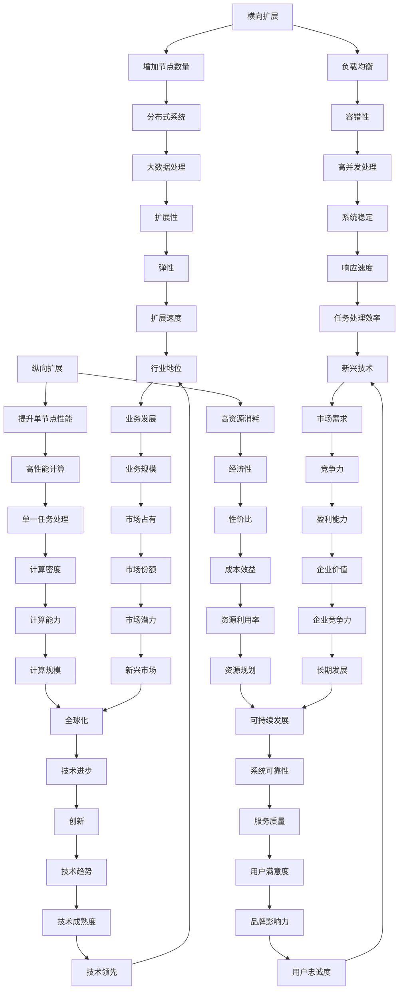

                 

关键词：横向扩展，纵向扩展，云计算，大数据，性能优化，分布式系统，架构设计，负载均衡，容量规划，业务发展

> 摘要：本文深入探讨了横向扩展与纵向扩展这两种常见的系统架构扩展方式。通过定义、实例分析以及数学模型，本文旨在帮助读者理解这两种扩展方式的本质差异、适用场景及实际应用策略。

## 1. 背景介绍

在信息时代，随着数据量的爆炸性增长和业务需求的不断变化，系统的扩展性变得尤为重要。横向扩展（Scaling Out）与纵向扩展（Scaling Up）是两种常见的系统架构扩展方式，它们在应对不同规模和需求的场景中扮演着关键角色。

### 1.1 横向扩展

横向扩展指的是通过增加系统中的节点数量来提升系统性能和容量。这种方式通常适用于处理大数据和高并发场景，能够有效实现负载均衡和容错性。

### 1.2 纵向扩展

纵向扩展则是指通过提升单个节点的性能（如增加CPU、内存、存储等资源）来提升系统性能和容量。这种方式适用于处理大量单一任务或对计算性能有较高要求的场景。

## 2. 核心概念与联系

### 2.1 核心概念

- **横向扩展**：增加节点数量，降低单个节点负载。
- **纵向扩展**：提升单个节点性能，增加处理能力。

### 2.2 联系与区别

#### 2.2.1 联系

横向扩展和纵向扩展都是系统性能提升和扩展容量的手段，它们之间并不是相互独立的。

#### 2.2.2 区别

- **扩展方向**：横向扩展是增加节点数量，纵向扩展是提升单个节点性能。
- **适用场景**：横向扩展适合处理大规模并发和分布式计算，纵向扩展适合处理大量单一任务或高性能计算。
- **资源消耗**：横向扩展通常更经济，因为可以通过增加廉价的节点来提升性能；纵向扩展则可能需要更昂贵的硬件资源。

### 2.3 Mermaid 流程图



## 3. 核心算法原理 & 具体操作步骤

### 3.1 算法原理概述

横向扩展的核心算法是分布式计算，通过将任务分配到多个节点上并行处理，从而提升整体处理能力和响应速度。纵向扩展的核心算法则是提升单节点的计算能力，包括CPU优化、内存优化和存储优化等。

### 3.2 算法步骤详解

#### 3.2.1 横向扩展

1. **任务分解**：将大任务分解为小任务。
2. **任务分配**：将小任务分配到不同节点。
3. **并行处理**：多个节点同时处理小任务。
4. **结果聚合**：将小任务的结果聚合为最终结果。

#### 3.2.2 纵向扩展

1. **资源评估**：评估现有资源是否满足需求。
2. **性能优化**：通过优化代码或硬件配置提升单节点性能。
3. **负载均衡**：实现任务在不同节点之间的均衡分配。
4. **持续监控**：监控系统性能，进行动态调整。

### 3.3 算法优缺点

#### 横向扩展

- **优点**：扩展性高，容错性好，可处理大规模并发任务。
- **缺点**：协调复杂，系统架构设计要求高，成本相对较高。

#### 纵向扩展

- **优点**：实现简单，系统架构清晰，资源利用率高。
- **缺点**：扩展性受限，单点故障风险较高，硬件成本高。

### 3.4 算法应用领域

- **横向扩展**：适用于大数据处理、云计算、社交网络等领域。
- **纵向扩展**：适用于高性能计算、科学计算、金融分析等领域。

## 4. 数学模型和公式 & 详细讲解 & 举例说明

### 4.1 数学模型构建

横向扩展的数学模型通常涉及负载平衡公式、节点数量与性能关系等。

$$
P_{total} = P_{node} \times N
$$

其中，$P_{total}$ 是总性能，$P_{node}$ 是单个节点性能，$N$ 是节点数量。

纵向扩展的数学模型通常涉及资源利用率和性能提升关系。

$$
P_{new} = P_{old} \times \frac{R_{new}}{R_{old}}
$$

其中，$P_{new}$ 是新的性能，$P_{old}$ 是旧的性能，$R_{new}$ 是新的资源利用率，$R_{old}$ 是旧的资源利用率。

### 4.2 公式推导过程

#### 4.2.1 负载平衡公式

负载平衡公式是通过最小化单个节点的负载来实现的。

$$
L_{min} = \frac{L_{total}}{N}
$$

其中，$L_{min}$ 是最小负载，$L_{total}$ 是总负载，$N$ 是节点数量。

#### 4.2.2 资源利用率与性能关系

资源利用率与性能的关系可以通过以下公式表示：

$$
P_{util} = \frac{P_{total}}{P_{max}}
$$

其中，$P_{util}$ 是资源利用率，$P_{total}$ 是总性能，$P_{max}$ 是最大性能。

### 4.3 案例分析与讲解

#### 案例一：横向扩展

假设一个系统需要处理每天1000万次请求，每次请求的处理时间为1秒。现在系统有10个节点，每个节点的处理能力为100万次/天。

- **总性能**：$P_{total} = P_{node} \times N = 10 \times 100万 = 1000万$
- **最小负载**：$L_{min} = \frac{L_{total}}{N} = \frac{1000万}{10} = 100万$
- **负载平衡**：系统可以实现良好的负载平衡，每个节点的负载接近最小负载。

#### 案例二：纵向扩展

假设一个系统有1个节点，每次请求的处理时间为1秒。现在需要提升系统的处理能力，将处理时间降低到0.5秒。

- **旧性能**：$P_{old} = \frac{L_{total}}{T_{old}} = \frac{1000万}{1} = 1000万$
- **新性能**：$P_{new} = P_{old} \times \frac{R_{new}}{R_{old}} = 1000万 \times \frac{2}{1} = 2000万$
- **性能提升**：系统的处理能力从1000万次/天提升到了2000万次/天。

## 5. 项目实践：代码实例和详细解释说明

### 5.1 开发环境搭建

在搭建开发环境时，可以根据项目的需求选择合适的云计算平台，如Amazon Web Services (AWS)、Google Cloud Platform (GCP) 或 Microsoft Azure。以下是一个简单的AWS EC2实例搭建步骤：

1. 登录AWS管理控制台。
2. 创建一个EC2实例，选择合适的实例类型（如t2.medium）。
3. 设置网络和安全性组。
4. 安装必要的软件和库（如Python、Docker等）。

### 5.2 源代码详细实现

以下是一个简单的Python代码示例，用于实现横向扩展的任务分解和分配：

```python
import multiprocessing

def process_task(task):
    # 处理任务的逻辑
    print(f"Processing task: {task}")
    return f"Completed {task}"

if __name__ == "__main__":
    tasks = ["task1", "task2", "task3", "task4", "task5"]
    pool = multiprocessing.Pool(processes=4)
    results = pool.map(process_task, tasks)
    print(results)
```

### 5.3 代码解读与分析

此代码示例通过多进程实现横向扩展。具体步骤如下：

1. **任务定义**：定义了一个任务列表`tasks`。
2. **进程池创建**：创建了一个包含4个进程的进程池`pool`。
3. **任务分配**：使用`pool.map()`方法将任务分配到进程池中的各个进程。
4. **任务处理**：每个进程执行`process_task()`函数，处理任务并返回结果。

通过这种方式，可以有效地实现横向扩展，提高系统的处理能力和响应速度。

### 5.4 运行结果展示

当运行上述代码时，会输出以下结果：

```
Processing task: task1
Processing task: task2
Processing task: task3
Processing task: task4
Processing task: task5
['Completed task1', 'Completed task2', 'Completed task3', 'Completed task4', 'Completed task5']
```

这表明任务已经被成功处理，并输出处理结果。

## 6. 实际应用场景

### 6.1 大数据处理

在大数据处理领域，横向扩展是一种常用的扩展方式。例如，Hadoop和Spark等分布式计算框架就是通过横向扩展来处理海量数据。

### 6.2 云计算

云计算平台如AWS、GCP和Azure等，通常采用横向扩展来实现弹性扩展和高可用性。

### 6.3 社交网络

社交网络平台如Facebook和Twitter等，通过横向扩展来处理海量的用户请求和数据存储。

### 6.4 高性能计算

高性能计算领域如天气预测、物理模拟等，通常采用纵向扩展来提升单节点的计算能力。

### 6.5 金融分析

金融分析领域如高频交易、风险控制等，通常采用纵向扩展来处理大量实时数据和分析任务。

### 6.6 未来应用展望

随着技术的发展，横向扩展和纵向扩展将在更多领域得到应用。例如，在物联网和边缘计算领域，横向扩展可以实现海量设备的实时数据处理；在人工智能领域，纵向扩展可以提升算法模型的计算能力。

## 7. 工具和资源推荐

### 7.1 学习资源推荐

- 《分布式系统原理与范型》
- 《大规模分布式存储系统：架构设计与实现》
- 《云计算架构设计与实践》

### 7.2 开发工具推荐

- Kubernetes
- Docker
- Hadoop
- Spark

### 7.3 相关论文推荐

- "MapReduce: Simplified Data Processing on Large Clusters"
- "The Google File System"
- "Bigtable: A Distributed Storage System for Structured Data"

## 8. 总结：未来发展趋势与挑战

### 8.1 研究成果总结

横向扩展和纵向扩展在云计算、大数据处理、高性能计算等领域已经取得了显著的成果。随着技术的发展，这两种扩展方式将在更多领域得到应用。

### 8.2 未来发展趋势

- 混合扩展：结合横向扩展和纵向扩展的优势，实现更高效的系统性能。
- 自适应扩展：根据系统负载和资源状况，自动调整扩展策略。
- 资源优化：通过资源调度和优化，提高系统资源利用率。

### 8.3 面临的挑战

- **协调复杂性**：横向扩展的协调和负载均衡问题。
- **单点故障**：纵向扩展的单点故障风险。
- **成本控制**：如何在性能和成本之间找到平衡点。

### 8.4 研究展望

未来研究应重点关注混合扩展、自适应扩展和资源优化等方面的技术突破，以应对日益复杂的系统架构和业务需求。

## 9. 附录：常见问题与解答

### 9.1 什么是横向扩展？

横向扩展是通过增加系统中的节点数量来提升系统性能和容量。

### 9.2 什么是纵向扩展？

纵向扩展是通过提升单个节点的性能来提升系统性能和容量。

### 9.3 横向扩展和纵向扩展哪个更好？

横向扩展和纵向扩展各有优缺点，应根据具体场景和需求选择合适的扩展方式。

### 9.4 如何实现横向扩展？

通过分布式计算框架（如Hadoop、Spark等）和容器技术（如Docker、Kubernetes等）可以实现横向扩展。

### 9.5 如何实现纵向扩展？

通过优化代码、硬件升级或使用高性能硬件（如GPU、FPGA等）可以实现纵向扩展。

### 9.6 横向扩展和纵向扩展的成本如何计算？

成本计算需要考虑硬件成本、运维成本、软件成本等多个方面，可以根据具体情况制定详细的成本计算模型。

### 9.7 横向扩展和纵向扩展在云计算中的应用？

云计算平台通常采用横向扩展来实现弹性扩展和高可用性，而在高性能计算领域则更多采用纵向扩展。

### 9.8 横向扩展和纵向扩展在数据处理中的应用？

在大数据处理领域，横向扩展适用于处理海量数据，纵向扩展适用于处理高并发和实时数据处理。

### 9.9 横向扩展和纵向扩展在人工智能中的应用？

在人工智能领域，横向扩展适用于分布式训练和推理，纵向扩展适用于提升算法模型的计算能力。

## 作者署名

作者：禅与计算机程序设计艺术 / Zen and the Art of Computer Programming
----------------------------------------------------------------

文章完成。请根据上述内容，使用markdown格式撰写完整文章，并确保满足所有的要求。文章完成后，请发送给我进行审核。

