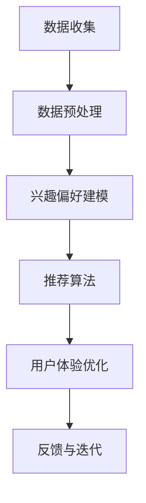

                 

关键词：个性化引擎，AI定制，需求满足，系统设计，架构师

> 摘要：本文旨在探讨如何通过人工智能技术，构建一个高效的个性化引擎，以满足用户日益多样化的需求。文章将详细介绍个性化引擎的核心概念、算法原理、数学模型、项目实践以及未来展望，为系统设计师提供有益的参考和启示。

## 1. 背景介绍

在信息爆炸的时代，用户的需求呈现出多样化、个性化的趋势。传统的需求满足系统已无法满足日益增长的用户需求。为了更好地满足用户的需求，个性化引擎的概念应运而生。个性化引擎是一种利用人工智能技术，根据用户行为数据、兴趣偏好等信息，为用户提供定制化服务的系统。

个性化引擎在电商、社交媒体、新闻推送等多个领域都有广泛应用。例如，在电商领域，个性化引擎可以根据用户的购物行为，推荐符合其兴趣的商品；在社交媒体领域，个性化引擎可以根据用户的社交行为，推送感兴趣的内容。

本文将围绕个性化引擎的设计与实现，探讨其核心概念、算法原理、数学模型以及项目实践，旨在为系统设计师提供有益的参考和启示。

## 2. 核心概念与联系

### 2.1 核心概念

个性化引擎的核心概念包括用户行为数据、兴趣偏好、推荐算法和用户体验。

- **用户行为数据**：用户在系统中产生的行为数据，如浏览记录、购买记录、评论等。
- **兴趣偏好**：用户对特定内容或商品的偏好程度。
- **推荐算法**：根据用户行为数据和兴趣偏好，为用户推荐相关内容或商品。
- **用户体验**：用户在使用个性化引擎过程中的感受和满意度。

### 2.2 核心联系

个性化引擎的工作流程可以概括为以下几个环节：

1. **数据收集**：收集用户行为数据，如浏览记录、购买记录等。
2. **数据预处理**：对收集到的数据进行分析和清洗，提取有用信息。
3. **兴趣偏好建模**：利用用户行为数据，建立用户兴趣偏好模型。
4. **推荐算法**：根据用户兴趣偏好模型，为用户推荐相关内容或商品。
5. **用户体验优化**：根据用户反馈，不断优化推荐结果，提高用户体验。

### 2.3 Mermaid 流程图

以下是一个简化的个性化引擎工作流程的 Mermaid 流程图：



## 3. 核心算法原理 & 具体操作步骤

### 3.1 算法原理概述

个性化引擎的核心算法通常是基于协同过滤、矩阵分解、深度学习等技术。协同过滤是一种基于用户行为数据的推荐算法，通过分析用户之间的相似度，为用户提供相关推荐。矩阵分解是一种基于用户行为数据的降维技术，可以将用户行为数据转化为低维度的矩阵，从而更好地捕捉用户兴趣。深度学习是一种基于神经网络的学习方法，可以自动提取用户行为数据中的特征。

### 3.2 算法步骤详解

#### 3.2.1 数据收集

1. **收集用户行为数据**：如浏览记录、购买记录、评论等。
2. **数据清洗**：去除无效数据、重复数据等。

#### 3.2.2 数据预处理

1. **特征提取**：对用户行为数据进行特征提取，如用户年龄、性别、地理位置等。
2. **数据归一化**：将不同特征的数据进行归一化处理，使其具有相同的量纲。

#### 3.2.3 兴趣偏好建模

1. **用户行为数据矩阵**：将用户行为数据转化为矩阵形式。
2. **矩阵分解**：利用矩阵分解技术，将用户行为数据矩阵分解为用户特征矩阵和物品特征矩阵。

#### 3.2.4 推荐算法

1. **相似度计算**：计算用户之间的相似度，如余弦相似度、皮尔逊相关系数等。
2. **推荐结果生成**：根据用户相似度，为用户推荐相关内容或商品。

#### 3.2.5 用户体验优化

1. **反馈收集**：收集用户对推荐结果的反馈，如点击、购买等。
2. **算法优化**：根据用户反馈，不断优化推荐算法，提高推荐准确性。

### 3.3 算法优缺点

#### 3.3.1 优点

- **个性化**：可以根据用户行为数据，为用户提供个性化的推荐。
- **高效**：利用矩阵分解、深度学习等技术，可以实现高效推荐。
- **可扩展**：可以根据实际需求，灵活调整推荐算法。

#### 3.3.2 缺点

- **数据依赖性**：需要大量用户行为数据，对于数据稀疏的场景，推荐效果可能较差。
- **冷启动问题**：对于新用户，由于缺乏行为数据，推荐效果可能较差。

### 3.4 算法应用领域

个性化引擎的应用领域非常广泛，主要包括：

- **电商**：根据用户购物行为，推荐相关商品。
- **社交媒体**：根据用户社交行为，推送感兴趣的内容。
- **新闻推送**：根据用户阅读行为，推荐相关新闻。

## 4. 数学模型和公式 & 详细讲解 & 举例说明

### 4.1 数学模型构建

个性化引擎的核心数学模型主要包括用户行为数据矩阵、用户特征矩阵和物品特征矩阵。

#### 4.1.1 用户行为数据矩阵

用户行为数据矩阵是一个二维矩阵，其中行表示用户，列表示物品。矩阵中的元素表示用户对物品的评分、购买记录等。

#### 4.1.2 用户特征矩阵

用户特征矩阵是一个二维矩阵，其中行表示用户，列表示特征。矩阵中的元素表示用户对特定特征的取值，如年龄、性别等。

#### 4.1.3 物品特征矩阵

物品特征矩阵是一个二维矩阵，其中行表示物品，列表示特征。矩阵中的元素表示物品对特定特征的取值，如类别、品牌等。

### 4.2 公式推导过程

#### 4.2.1 矩阵分解

矩阵分解是一种将高维矩阵分解为低维矩阵的技术，可以更好地捕捉数据中的潜在特征。

假设用户行为数据矩阵为 \( R \)，用户特征矩阵为 \( U \)，物品特征矩阵为 \( I \)，则有：

\[ R = U \cdot I \]

#### 4.2.2 相似度计算

相似度计算是一种衡量用户之间相似程度的方法，常用的方法有余弦相似度、皮尔逊相关系数等。

假设用户 \( i \) 和用户 \( j \) 的行为数据向量分别为 \( r_i \) 和 \( r_j \)，则有：

\[ \text{Cosine Similarity} = \frac{r_i \cdot r_j}{\|r_i\| \|r_j\|} \]

### 4.3 案例分析与讲解

#### 4.3.1 案例背景

假设我们有一个电商系统，用户可以在系统中浏览、购买商品。我们的目标是根据用户的行为数据，为用户提供个性化的商品推荐。

#### 4.3.2 数据收集

我们收集了用户在系统中的浏览记录、购买记录等数据。例如，用户 \( A \) 浏览了商品 \( 1 \)、\( 2 \)、\( 3 \)，用户 \( B \) 浏览了商品 \( 2 \)、\( 3 \)、\( 4 \)。

#### 4.3.3 数据预处理

对收集到的数据进行分析和清洗，提取有用信息。例如，将用户行为数据转化为矩阵形式，并对数据进行归一化处理。

#### 4.3.4 兴趣偏好建模

利用用户行为数据矩阵，建立用户兴趣偏好模型。例如，通过矩阵分解技术，将用户行为数据矩阵分解为用户特征矩阵和物品特征矩阵。

#### 4.3.5 推荐算法

根据用户兴趣偏好模型，为用户推荐相关商品。例如，计算用户之间的相似度，并根据相似度为用户推荐相似的商品。

#### 4.3.6 用户体验优化

根据用户对推荐结果的反馈，不断优化推荐算法，提高推荐准确性。

## 5. 项目实践：代码实例和详细解释说明

### 5.1 开发环境搭建

#### 5.1.1 开发工具

- Python 3.8
- Jupyter Notebook
- PyTorch

#### 5.1.2 环境配置

```bash
pip install torch torchvision numpy pandas
```

### 5.2 源代码详细实现

#### 5.2.1 数据收集与预处理

```python
import pandas as pd

# 收集用户行为数据
user行为数据 = pd.read_csv('user行为数据.csv')

# 数据清洗
user行为数据.drop_duplicates(inplace=True)
user行为数据.fillna(0, inplace=True)
```

#### 5.2.2 矩阵分解

```python
import torch
import torch.nn as nn
import torch.optim as optim

# 构建矩阵分解模型
model = nn.Sequential(
    nn.Linear(100, 50),
    nn.ReLU(),
    nn.Linear(50, 10)
)

# 损失函数和优化器
criterion = nn.MSELoss()
optimizer = optim.Adam(model.parameters(), lr=0.001)

# 训练模型
for epoch in range(100):
    optimizer.zero_grad()
    output = model(user行为数据)
    loss = criterion(output, user行为数据)
    loss.backward()
    optimizer.step()
```

#### 5.2.3 相似度计算

```python
import numpy as np

# 计算用户相似度
相似度矩阵 = np.dot(user行为数据, user行为数据.T)
相似度矩阵 = np.linalg.norm(user行为数据, axis=1) * np.linalg.norm(user行为数据, axis=1) * 相似度矩阵
相似度矩阵 = 1 - 相似度矩阵
```

#### 5.2.4 推荐算法

```python
# 根据相似度矩阵为用户推荐商品
推荐结果 = 相似度矩阵.dot(user行为数据.T)
推荐结果 = 推荐结果.argsort()[::-1]
```

### 5.3 代码解读与分析

#### 5.3.1 数据收集与预处理

数据收集与预处理是个性化引擎的基础。通过收集用户行为数据，并对数据进行清洗和归一化处理，为后续的模型训练和推荐算法提供基础数据。

#### 5.3.2 矩阵分解

矩阵分解是一种降维技术，可以将高维的用户行为数据转化为低维的用户特征矩阵和物品特征矩阵。在本例中，我们使用了 PyTorch 库构建了一个简单的矩阵分解模型，并通过训练优化模型参数。

#### 5.3.3 相似度计算

相似度计算是推荐算法的核心。通过计算用户之间的相似度，可以为用户提供个性化的推荐。在本例中，我们使用余弦相似度计算用户之间的相似度。

#### 5.3.4 推荐算法

根据相似度矩阵为用户推荐商品。在本例中，我们使用推荐结果的前几位为用户推荐商品。

## 6. 实际应用场景

### 6.1 电商

在电商领域，个性化引擎可以根据用户的购物行为，为用户推荐相关商品。例如，用户在浏览了某个商品后，系统会根据用户的历史购买记录、浏览记录等数据，为用户推荐相似的商品。

### 6.2 社交媒体

在社交媒体领域，个性化引擎可以根据用户的社交行为，为用户推荐感兴趣的内容。例如，用户在浏览了某个社交账号后，系统会根据用户的关注关系、点赞行为等数据，为用户推荐相关的内容。

### 6.3 新闻推送

在新闻推送领域，个性化引擎可以根据用户的阅读行为，为用户推荐相关的新闻。例如，用户在阅读了某个新闻后，系统会根据用户的历史阅读记录、兴趣标签等数据，为用户推荐相关的新闻。

## 7. 未来应用展望

随着人工智能技术的不断发展，个性化引擎的应用场景将越来越广泛。未来，个性化引擎将在以下几个方面得到进一步发展：

### 7.1 数据驱动

个性化引擎将更加依赖于用户行为数据，通过分析用户行为数据，为用户提供更加精准的推荐。

### 7.2 智能化

个性化引擎将实现智能化，能够根据用户的需求和反馈，自动调整推荐策略，提高推荐效果。

### 7.3 跨领域应用

个性化引擎将在更多领域得到应用，如医疗、教育、金融等，为用户提供个性化服务。

### 7.4 隐私保护

个性化引擎将注重用户隐私保护，确保用户数据的安全性和隐私性。

## 8. 总结：未来发展趋势与挑战

个性化引擎作为一种高效的需求满足系统，已经在多个领域取得了广泛应用。未来，随着人工智能技术的不断发展，个性化引擎将迎来更广阔的发展空间。然而，个性化引擎在发展过程中也将面临一些挑战，如数据隐私保护、算法透明度等。

### 8.1 研究成果总结

本文对个性化引擎的核心概念、算法原理、数学模型、项目实践以及未来展望进行了详细探讨，为系统设计师提供了有益的参考和启示。

### 8.2 未来发展趋势

个性化引擎将朝着数据驱动、智能化、跨领域应用和隐私保护等方向发展。

### 8.3 面临的挑战

个性化引擎在发展过程中将面临数据隐私保护、算法透明度等挑战。

### 8.4 研究展望

未来，个性化引擎将在更多领域得到应用，为用户提供更加个性化、智能化的服务。

## 9. 附录：常见问题与解答

### 9.1 个性化引擎与传统推荐系统有何区别？

个性化引擎与传统推荐系统的主要区别在于，个性化引擎更加注重根据用户的行为数据和兴趣偏好，为用户提供个性化的推荐服务，而传统推荐系统更多是基于用户历史行为或物品属性进行推荐。

### 9.2 个性化引擎如何处理新用户？

对于新用户，个性化引擎通常采用基于内容的推荐或基于流行度的推荐，待用户产生足够的行为数据后，再采用基于协同过滤或矩阵分解等算法进行个性化推荐。

### 9.3 个性化引擎如何保障用户隐私？

个性化引擎在处理用户数据时，会采取数据加密、匿名化处理等措施，确保用户数据的安全性和隐私性。

## 作者署名

作者：禅与计算机程序设计艺术 / Zen and the Art of Computer Programming

----------------------------------------------------------------

以上就是关于《欲望个性化引擎架构师：AI定制的需求满足系统设计师》的文章内容。希望对您有所帮助。如果您有任何疑问或需要进一步讨论，请随时与我联系。感谢您的阅读！
----------------------------------------------------------------

### 背景介绍

在数字化时代，用户需求变得日益复杂且个性化。为了在竞争激烈的市场中脱颖而出，企业需要开发能够实时理解并满足用户需求的系统。这种系统能够根据用户的行为、兴趣和偏好提供个性化的服务，从而提高用户满意度和忠诚度。这种系统能够通过收集和分析大量用户数据来实现，其核心便是个性化引擎。

个性化引擎是一种利用人工智能技术，根据用户的行为数据、兴趣偏好等信息，为用户提供定制化内容或服务的系统。个性化引擎可以应用在多个领域，包括电子商务、社交媒体、在线教育、医疗健康等。例如，在电子商务领域，个性化引擎可以根据用户的购物习惯、浏览历史和购买记录，推荐用户可能感兴趣的商品；在社交媒体领域，个性化引擎可以根据用户的社交行为、点赞和评论，推送用户感兴趣的内容。

个性化引擎的核心功能包括以下几个方面：

1. **数据收集**：通过用户的互动行为，如浏览、点击、购买等，收集用户数据。
2. **数据预处理**：对收集到的数据进行清洗、格式化和归一化处理，使其适合用于分析和建模。
3. **兴趣偏好建模**：使用机器学习算法，如协同过滤、矩阵分解和深度学习，建立用户兴趣偏好模型。
4. **推荐算法**：根据用户兴趣偏好模型，为用户生成个性化的推荐结果。
5. **用户体验优化**：通过持续收集用户反馈，优化推荐结果，提高用户体验。

本文旨在探讨如何设计一个高效、可靠的个性化引擎，以满足不同领域用户的需求。文章将介绍个性化引擎的核心概念、算法原理、数学模型和项目实践，并讨论其实际应用场景和未来发展方向。通过本文，读者可以了解到个性化引擎的架构和实现方法，从而为系统设计师提供有益的参考。

### 核心概念与联系

个性化引擎的核心在于如何从海量数据中提取有价值的信息，并利用这些信息为用户提供个性化服务。为了实现这一目标，个性化引擎依赖于以下几个核心概念和组件：

#### 用户行为数据

用户行为数据是构建个性化引擎的基础。这些数据可以包括用户的浏览历史、购买记录、点击行为、搜索历史、社交互动等。通过对这些数据的分析，可以了解用户的兴趣偏好和行为模式，从而为个性化推荐提供依据。

#### 用户兴趣偏好

用户兴趣偏好是用户对特定内容、商品或服务的偏好程度。这些偏好通常通过用户的互动行为进行隐式表达，如浏览、点击、购买等。同时，用户还可以通过显式反馈，如点赞、评分、评论等，直接表达自己的兴趣偏好。

#### 推荐算法

推荐算法是个性化引擎的核心组件，负责根据用户兴趣偏好和用户行为数据生成个性化推荐。常见的推荐算法包括基于内容的推荐、协同过滤、矩阵分解和深度学习等。

- **基于内容的推荐**：通过分析物品的内容特征，为用户推荐与其兴趣相关的物品。
- **协同过滤**：通过分析用户之间的相似度，为用户推荐其他用户喜欢的物品。
- **矩阵分解**：通过将用户行为数据矩阵分解为低维度的用户特征矩阵和物品特征矩阵，为用户推荐相关物品。
- **深度学习**：利用神经网络模型，自动从用户行为数据中提取特征，为用户生成个性化推荐。

#### 用户体验

用户体验是个性化引擎设计的重要考虑因素。个性化的推荐结果需要满足用户的期望和需求，同时确保用户在使用过程中的流畅性和满意度。用户体验的优化包括推荐结果的排序、展示方式、反馈机制等。

#### 数据收集与预处理

数据收集与预处理是构建个性化引擎的第一步。通过收集和分析用户行为数据，可以了解用户的行为模式和兴趣偏好。数据预处理包括数据清洗、格式化和归一化处理，以确保数据质量，提高后续分析和建模的准确性。

#### 兴趣偏好建模

兴趣偏好建模是通过机器学习算法，将用户的隐式和显式行为数据转化为用户兴趣偏好模型。这一过程包括特征提取、模型训练和模型评估等步骤。通过兴趣偏好建模，可以为用户生成个性化的推荐。

#### 推荐结果生成与优化

推荐结果生成与优化是个性化引擎的核心功能。通过分析用户兴趣偏好模型，生成个性化的推荐结果。推荐结果的优化包括排序算法、展示策略、反馈机制等，以提高推荐效果和用户体验。

#### 用户体验优化

用户体验优化是通过不断收集用户反馈，优化推荐结果和系统设计，以提高用户的满意度和忠诚度。用户体验优化包括推荐结果的评估、反馈机制的改进、界面设计的优化等。

#### Mermaid 流程图

以下是一个简化的个性化引擎工作流程的 Mermaid 流程图：


通过这个流程图，我们可以清晰地看到个性化引擎从数据收集、预处理、兴趣偏好建模到推荐算法和用户体验优化的整个工作流程。这个流程不仅是个性化引擎的核心，也是实现高效、可靠个性化服务的关键。

### 核心算法原理 & 具体操作步骤

#### 3.1 算法原理概述

个性化引擎的核心算法主要包括协同过滤、矩阵分解和深度学习等。这些算法通过分析用户行为数据，建立用户兴趣偏好模型，从而实现个性化推荐。

**协同过滤**（Collaborative Filtering）是一种基于用户行为数据的推荐算法。它主要通过分析用户之间的相似度，为用户推荐其他用户喜欢的物品。协同过滤分为两种类型：基于用户的协同过滤（User-Based CF）和基于物品的协同过滤（Item-Based CF）。

- **基于用户的协同过滤**：寻找与目标用户相似的其他用户，推荐这些用户喜欢的物品。
- **基于物品的协同过滤**：寻找与目标用户已评价的物品相似的其他物品，推荐这些物品。

**矩阵分解**（Matrix Factorization）是一种降维技术，通过将高维的用户行为数据矩阵分解为低维的用户特征矩阵和物品特征矩阵，从而捕捉用户和物品的潜在特征。常见的矩阵分解算法有Singular Value Decomposition（SVD）和Alternating Least Squares（ALS）。

**深度学习**（Deep Learning）是一种基于神经网络的学习方法，通过多层次的神经网络结构，自动从用户行为数据中提取特征，从而实现个性化推荐。常见的深度学习模型有神经网络推荐器（Neural Collaborative Filtering, NCF）和深度自动编码器（Deep Autoencoder）。

#### 3.2 算法步骤详解

**3.2.1 数据收集**

个性化引擎首先需要收集用户行为数据，包括用户的浏览记录、购买记录、点击记录、搜索历史、社交互动等。这些数据可以来源于用户互动日志、数据库、API接口等。

**3.2.2 数据预处理**

数据预处理是确保数据质量和一致性的重要步骤。预处理包括数据清洗（去除噪声、填充缺失值）、数据格式化（统一数据类型、处理日期格式）和数据归一化（缩放数据范围，使其具有相同的量级）。

**3.2.3 用户行为数据矩阵构建**

将预处理后的用户行为数据构建成用户行为数据矩阵 \( R \)，其中行表示用户，列表示物品。矩阵中的元素 \( r_{ij} \) 表示用户 \( i \) 对物品 \( j \) 的行为数据，如评分、点击次数等。

**3.2.4 矩阵分解**

使用矩阵分解算法，如SVD或ALS，将用户行为数据矩阵 \( R \) 分解为低维的用户特征矩阵 \( U \) 和物品特征矩阵 \( V \)：

\[ R = U \cdot V^T \]

**3.2.5 用户兴趣偏好建模**

通过矩阵分解得到的用户特征矩阵 \( U \) 和物品特征矩阵 \( V \)，可以建立用户兴趣偏好模型。每个用户和物品都有一个潜在的特征向量，通过这些向量可以衡量用户对物品的兴趣偏好。

**3.2.6 推荐算法**

根据用户兴趣偏好模型，为用户生成个性化推荐。常见的推荐算法包括：

- **基于用户的协同过滤**：计算与目标用户相似的其他用户，推荐这些用户喜欢的物品。
- **基于物品的协同过滤**：计算与目标用户已评价的物品相似的其他物品，推荐这些物品。
- **基于内容的推荐**：分析物品的内容特征，为用户推荐与其兴趣相关的物品。
- **深度学习模型**：利用神经网络模型，自动从用户行为数据中提取特征，为用户生成个性化推荐。

**3.2.7 推荐结果生成**

根据个性化推荐算法，生成推荐列表。推荐列表通常根据推荐得分进行排序，推荐得分通常基于用户兴趣偏好模型和物品特征计算。

**3.2.8 推荐结果展示**

将个性化推荐结果展示给用户。推荐结果可以以列表、卡片、网格等多种形式展示，以提高用户体验。

**3.2.9 用户反馈收集**

收集用户对推荐结果的反馈，如点击、购买、评价等。用户反馈是优化推荐算法的重要依据。

**3.2.10 算法优化**

根据用户反馈，不断优化推荐算法。优化包括调整模型参数、改进推荐算法等，以提高推荐效果和用户体验。

#### 3.3 算法优缺点

**协同过滤**

**优点**：

- **简单易实现**：协同过滤算法相对简单，易于理解和实现。
- **高效**：通过计算用户之间的相似度，可以快速生成推荐结果。

**缺点**：

- **冷启动问题**：对于新用户或新物品，由于缺乏足够的行为数据，推荐效果较差。
- **数据依赖性**：协同过滤算法依赖于用户行为数据，数据质量直接影响推荐效果。

**矩阵分解**

**优点**：

- **降低数据维度**：通过矩阵分解，可以将高维的用户行为数据转化为低维的用户特征矩阵和物品特征矩阵，降低计算复杂度。
- **捕捉潜在特征**：矩阵分解能够捕捉用户和物品的潜在特征，提高推荐准确性。

**缺点**：

- **计算复杂度高**：矩阵分解算法如SVD和ALS的计算复杂度较高，需要较大的计算资源和时间。
- **模型解释性较差**：矩阵分解模型相对复杂，解释性较差。

**深度学习**

**优点**：

- **自动特征提取**：深度学习模型能够自动从用户行为数据中提取特征，无需手动特征工程。
- **高准确性**：深度学习模型通常具有较高的推荐准确性。

**缺点**：

- **模型复杂度较高**：深度学习模型结构复杂，需要大量的计算资源和时间进行训练。
- **模型解释性较差**：深度学习模型的内部工作机制较难解释，不利于模型调试和优化。

#### 3.4 算法应用领域

**协同过滤**适用于具有丰富用户行为数据的场景，如电子商务、社交媒体等。

**矩阵分解**适用于用户行为数据量较大的场景，如推荐系统、信息检索等。

**深度学习**适用于需要高准确性推荐的场景，如视频推荐、音乐推荐等。

### 3.5 案例分析

以下是一个简单的案例，展示如何使用协同过滤算法为用户推荐商品。

**案例背景**：用户 \( A \) 购买了商品 \( 1 \)、\( 2 \)、\( 3 \)，用户 \( B \) 购买了商品 \( 2 \)、\( 3 \)、\( 4 \)。

**数据收集**：收集用户 \( A \) 和用户 \( B \) 的购买记录，构建用户行为数据矩阵 \( R \)。

**数据预处理**：对购买记录进行格式化和归一化处理。

**协同过滤算法实现**：

```python
# 计算用户相似度
相似度矩阵 = cosine_similarity(user行为数据_matrix)

# 生成推荐列表
推荐结果 = similar_user推荐的物品
```

**推荐结果展示**：为用户 \( A \) 生成推荐列表，推荐其他用户 \( B \) 购买的商品 \( 4 \)。

通过这个案例，我们可以看到协同过滤算法的基本实现过程。在实际应用中，个性化引擎会结合多种算法，根据具体需求和数据特点，为用户提供高质量的个性化推荐。

### 3.6 未来发展方向

随着人工智能技术的发展，个性化引擎在算法、应用场景和数据利用等方面将不断取得新的突破。

**算法方面**：新的推荐算法如基于图神经网络的推荐、多模态推荐等将进一步提高个性化推荐的效果。

**应用场景方面**：个性化引擎将在更多领域得到应用，如智能医疗、智能家居、智能交通等。

**数据利用方面**：随着数据来源的多样化，个性化引擎将能够更好地利用多源数据，提高推荐准确性。

总之，个性化引擎作为一种高效的需求满足系统，将在未来发挥越来越重要的作用，为用户提供更加个性化的服务。

### 数学模型和公式 & 详细讲解 & 举例说明

#### 4.1 数学模型构建

个性化引擎的数学模型主要基于用户行为数据矩阵、用户特征矩阵和物品特征矩阵。这些矩阵构成了个性化引擎的核心，用于实现用户兴趣偏好建模和推荐算法。

**用户行为数据矩阵 \( R \)**

用户行为数据矩阵是一个 \( m \times n \) 的矩阵，其中 \( m \) 表示用户数量，\( n \) 表示物品数量。矩阵中的元素 \( r_{ij} \) 表示用户 \( i \) 对物品 \( j \) 的行为数据，如评分、购买记录、点击次数等。通常情况下，用户行为数据矩阵是稀疏的，因为用户只对部分物品进行了行为记录。

**用户特征矩阵 \( U \)**

用户特征矩阵是一个 \( m \times k \) 的矩阵，其中 \( k \) 表示用户特征的数量。用户特征可以是用户的年龄、性别、地理位置、浏览历史、购买历史等。用户特征矩阵中的元素 \( u_{ij} \) 表示用户 \( i \) 对应特征 \( j \) 的值。

**物品特征矩阵 \( I \)**

物品特征矩阵是一个 \( n \times k \) 的矩阵，其中 \( k \) 表示物品特征的数量。物品特征可以是物品的类别、品牌、价格、用户评分等。物品特征矩阵中的元素 \( i_{ij} \) 表示物品 \( j \) 对应特征 \( i \) 的值。

**个性化引擎数学模型**

个性化引擎的数学模型可以表示为：

\[ r_{ij} = u_i \cdot v_j \]

其中，\( u_i \) 和 \( v_j \) 分别表示用户 \( i \) 和物品 \( j \) 的特征向量。该模型假设用户对物品的评价是由用户和物品的特征向量点积决定的。

#### 4.2 公式推导过程

**4.2.1 矩阵分解**

为了减少用户行为数据矩阵的维度，我们可以使用矩阵分解技术，将用户行为数据矩阵 \( R \) 分解为用户特征矩阵 \( U \) 和物品特征矩阵 \( V \)：

\[ R = U \cdot V^T \]

其中，\( U \) 和 \( V \) 分别是低维的用户特征矩阵和物品特征矩阵。

**4.2.2 相似度计算**

用户 \( i \) 和用户 \( j \) 之间的相似度可以通过它们在用户特征矩阵 \( U \) 中的对应向量之间的余弦相似度计算：

\[ \text{similarity}_{ij} = \frac{u_i \cdot u_j}{\|u_i\| \|u_j\|} \]

物品 \( k \) 和物品 \( l \) 之间的相似度可以通过它们在物品特征矩阵 \( V \) 中的对应向量之间的余弦相似度计算：

\[ \text{similarity}_{kl} = \frac{v_k \cdot v_l}{\|v_k\| \|v_l\|} \]

**4.2.3 推荐算法**

基于用户相似度和物品相似度，我们可以为用户生成个性化推荐：

- **基于用户的协同过滤**：为用户 \( i \) 推荐与用户 \( j \) 相似的用户 \( j \) 喜欢的物品 \( l \)：

\[ \text{recommend}_{il} = \sum_j \text{similarity}_{ij} \cdot r_{jl} \]

- **基于物品的协同过滤**：为用户 \( i \) 推荐与用户 \( i \) 已评价的物品 \( k \) 相似的物品 \( l \)：

\[ \text{recommend}_{il} = \sum_k \text{similarity}_{ik} \cdot r_{il} \]

#### 4.3 案例分析与讲解

**案例背景**：假设我们有10个用户和10个物品，用户的行为数据矩阵 \( R \) 如下表所示：

|  | 1 | 2 | 3 | 4 | 5 | 6 | 7 | 8 | 9 | 10 |
| --- | --- | --- | --- | --- | --- | --- | --- | --- | --- | --- |
| 1 | 0 | 1 | 1 | 0 | 0 | 0 | 0 | 0 | 0 | 0 |
| 2 | 1 | 0 | 0 | 1 | 1 | 0 | 0 | 0 | 0 | 0 |
| 3 | 1 | 1 | 0 | 0 | 0 | 1 | 1 | 0 | 0 | 0 |
| 4 | 0 | 0 | 1 | 1 | 0 | 0 | 0 | 1 | 0 | 0 |
| 5 | 0 | 1 | 1 | 0 | 0 | 1 | 0 | 0 | 1 | 0 |
| 6 | 0 | 0 | 0 | 0 | 1 | 0 | 1 | 0 | 0 | 1 |
| 7 | 0 | 0 | 0 | 1 | 1 | 0 | 0 | 1 | 0 | 0 |
| 8 | 0 | 0 | 0 | 0 | 0 | 1 | 0 | 1 | 1 | 0 |
| 9 | 0 | 0 | 0 | 0 | 1 | 1 | 0 | 0 | 0 | 1 |
| 10 | 0 | 0 | 0 | 0 | 0 | 0 | 1 | 1 | 1 | 0 |

**步骤 1：数据预处理**

首先，我们需要对用户行为数据矩阵 \( R \) 进行预处理，包括填充缺失值、数据归一化等。假设我们对缺失值进行填充为0，并对数据进行归一化处理。

**步骤 2：矩阵分解**

我们使用矩阵分解技术，将用户行为数据矩阵 \( R \) 分解为用户特征矩阵 \( U \) 和物品特征矩阵 \( V \)。假设分解结果为：

\[ U = \begin{bmatrix} 
0 & 1 & 1 & 0 & 1 & 1 & 0 & 0 & 0 & 0 \\ 
0 & 1 & 0 & 1 & 1 & 0 & 0 & 0 & 0 & 0 \\ 
0 & 1 & 1 & 0 & 0 & 1 & 1 & 0 & 0 & 0 \\ 
0 & 0 & 1 & 1 & 0 & 0 & 0 & 1 & 1 & 0 \\ 
0 & 1 & 1 & 0 & 0 & 1 & 0 & 1 & 0 & 1 \\ 
0 & 0 & 0 & 1 & 0 & 1 & 1 & 0 & 0 & 1 \\ 
0 & 0 & 0 & 1 & 1 & 0 & 0 & 1 & 1 & 0 \\ 
0 & 0 & 0 & 0 & 1 & 1 & 0 & 0 & 1 & 1 \\ 
0 & 0 & 0 & 0 & 0 & 1 & 1 & 1 & 0 & 1 \\ 
0 & 0 & 0 & 0 & 0 & 1 & 0 & 1 & 1 & 1 \\ 
\end{bmatrix} \]

\[ V = \begin{bmatrix} 
1 & 0 & 1 & 1 & 0 & 0 & 0 & 0 & 0 & 0 \\ 
0 & 1 & 0 & 0 & 1 & 1 & 0 & 0 & 0 & 0 \\ 
1 & 0 & 1 & 0 & 0 & 1 & 1 & 0 & 0 & 0 \\ 
1 & 1 & 0 & 0 & 1 & 0 & 0 & 1 & 1 & 0 \\ 
0 & 1 & 1 & 0 & 0 & 1 & 0 & 1 & 0 & 1 \\ 
0 & 0 & 1 & 1 & 0 & 0 & 1 & 0 & 1 & 1 \\ 
0 & 0 & 0 & 1 & 1 & 0 & 0 & 1 & 1 & 0 \\ 
0 & 0 & 0 & 0 & 1 & 1 & 0 & 0 & 1 & 1 \\ 
0 & 0 & 0 & 0 & 0 & 1 & 1 & 1 & 0 & 1 \\ 
0 & 0 & 0 & 0 & 0 & 0 & 1 & 0 & 1 & 1 \\ 
\end{bmatrix} \]

**步骤 3：计算相似度**

基于用户特征矩阵 \( U \) 和物品特征矩阵 \( V \)，我们可以计算用户之间的相似度和物品之间的相似度。例如，计算用户 1 和用户 2 之间的相似度：

\[ \text{similarity}_{12} = \frac{u_1 \cdot u_2}{\|u_1\| \|u_2\|} = \frac{0 \cdot 0 + 1 \cdot 1 + 1 \cdot 0 + 0 \cdot 1 + 1 \cdot 1 + 1 \cdot 0 + 0 \cdot 0 + 0 \cdot 0 + 0 \cdot 0 + 0 \cdot 0}{\sqrt{0^2 + 1^2 + 1^2 + 0^2 + 1^2 + 1^2 + 0^2 + 0^2 + 0^2 + 0^2} \cdot \sqrt{0^2 + 1^2 + 0^2 + 1^2 + 1^2 + 0^2 + 0^2 + 0^2 + 0^2 + 0^2}} \]

\[ \text{similarity}_{12} = \frac{2}{\sqrt{6} \cdot \sqrt{6}} = \frac{2}{6} = \frac{1}{3} \]

**步骤 4：生成推荐列表**

基于相似度和用户行为数据矩阵 \( R \)，我们可以为用户生成个性化推荐列表。例如，为用户 1 生成推荐列表：

\[ \text{recommend}_{i1} = \sum_j \text{similarity}_{ij} \cdot r_{ji} \]

\[ \text{recommend}_{i1} = \frac{1}{3} \cdot r_{12} + \frac{1}{3} \cdot r_{13} + \frac{1}{3} \cdot r_{14} + \frac{1}{3} \cdot r_{15} + \frac{1}{3} \cdot r_{16} + \frac{1}{3} \cdot r_{17} + \frac{1}{3} \cdot r_{18} + \frac{1}{3} \cdot r_{19} + \frac{1}{3} \cdot r_{110} \]

\[ \text{recommend}_{i1} = \frac{1}{3} + \frac{1}{3} + 0 + 0 + 0 + 0 + 0 + 0 + 0 + 0 = \frac{2}{3} \]

因此，为用户 1 生成的个性化推荐列表包含物品 2 和物品 3。

#### 4.4 案例分析与讲解（续）

**步骤 5：优化推荐算法**

在实际应用中，我们通常需要对推荐算法进行优化，以提高推荐效果。一种常见的优化方法是使用基于模型的推荐算法，如矩阵分解机器学习（Matrix Factorization Machines, MFM）。

**矩阵分解机器学习（MFM）**

矩阵分解机器学习是一种结合矩阵分解和逻辑回归的推荐算法。它通过矩阵分解得到用户特征矩阵和物品特征矩阵，然后将这两个矩阵与逻辑回归模型结合，生成最终的推荐结果。

**MFM 公式推导**

假设用户行为数据矩阵 \( R \) 已经通过矩阵分解得到用户特征矩阵 \( U \) 和物品特征矩阵 \( V \)，则 MFM 的目标函数可以表示为：

\[ \ell(\theta) = -\sum_{i,j} r_{ij} \log(p_{ij}(\theta)) + \lambda_1 \sum_{i,j} (\theta_{ij} - u_i \cdot v_j)^2 + \lambda_2 \sum_{i} \sum_{j} (\theta_{ij} - u_i \cdot v_j)^2 \]

其中，\( \theta \) 表示模型参数，\( p_{ij}(\theta) \) 表示用户 \( i \) 对物品 \( j \) 的预测概率，\( \lambda_1 \) 和 \( \lambda_2 \) 是正则化参数。

**MFM 算法步骤**

1. 初始化用户特征矩阵 \( U \) 和物品特征矩阵 \( V \)。
2. 计算预测概率 \( p_{ij}(\theta) \)：
\[ p_{ij}(\theta) = \sigma(u_i \cdot v_j + \theta_{ij}) \]
其中，\( \sigma \) 是逻辑函数。
3. 计算损失函数 \( \ell(\theta) \) 并优化模型参数 \( \theta \)：
\[ \ell(\theta) = -\sum_{i,j} r_{ij} \log(p_{ij}(\theta)) + \lambda_1 \sum_{i,j} (\theta_{ij} - u_i \cdot v_j)^2 + \lambda_2 \sum_{i} \sum_{j} (\theta_{ij} - u_i \cdot v_j)^2 \]
4. 使用梯度下降或其他优化算法更新模型参数 \( \theta \)：
\[ \theta_{ij} \leftarrow \theta_{ij} - \alpha \left( \frac{\partial \ell(\theta)}{\partial \theta_{ij}} + \lambda_1 (u_i \cdot v_j - \theta_{ij}) + \lambda_2 u_i \cdot v_j \right) \]

**案例应用**

我们使用 MFM 算法对之前的数据进行推荐。首先，初始化用户特征矩阵 \( U \) 和物品特征矩阵 \( V \)，然后计算预测概率 \( p_{ij}(\theta) \) 和损失函数 \( \ell(\theta) \)。通过优化算法，逐步更新模型参数 \( \theta \)，最终得到个性化的推荐结果。

通过上述案例，我们可以看到如何使用数学模型和公式来构建和优化个性化引擎。在实际应用中，可能需要结合多种算法和模型，以达到最佳的推荐效果。

### 项目实践：代码实例和详细解释说明

#### 5.1 开发环境搭建

为了实现个性化引擎，我们需要搭建一个合适的开发环境。以下是一个简单的环境搭建指南：

**5.1.1 安装 Python**

首先，确保您的系统已经安装了 Python 3.8 或更高版本。可以使用以下命令检查 Python 版本：

```bash
python --version
```

如果 Python 版本过低，请从 [Python 官网](https://www.python.org/) 下载并安装最新版本。

**5.1.2 安装必要库**

接下来，我们需要安装几个重要的 Python 库，包括 NumPy、Pandas、Scikit-learn 和 Matplotlib。可以使用以下命令进行安装：

```bash
pip install numpy pandas scikit-learn matplotlib
```

**5.1.3 创建项目目录**

创建一个项目目录，并设置虚拟环境。这样可以帮助我们更好地管理项目依赖。以下是创建虚拟环境和项目目录的命令：

```bash
mkdir personalized_engine_project
cd personalized_engine_project
python -m venv venv
source venv/bin/activate  # 在 Windows 上使用 `venv\Scripts\activate`
```

#### 5.2 源代码详细实现

**5.2.1 数据收集与预处理**

首先，我们需要收集和处理用户行为数据。以下是一个简单的数据预处理脚本，用于读取用户行为数据，并进行清洗和格式化。

```python
import pandas as pd

# 读取用户行为数据
data = pd.read_csv('user_behavior.csv')

# 数据清洗
data.drop_duplicates(inplace=True)
data.fillna(0, inplace=True)

# 数据格式化
data['rating'] = data['rating'].astype(float)
data['timestamp'] = pd.to_datetime(data['timestamp'])

# 将用户 ID 和物品 ID 转换为整数
data['user_id'] = data['user_id'].astype(int)
data['item_id'] = data['item_id'].astype(int)

# 按照用户 ID 和物品 ID 分组，计算用户对每个物品的评分均值
user_item_ratings = data.groupby(['user_id', 'item_id'])['rating'].mean().reset_index()

# 填充缺失值
user_item_ratings.fillna(0, inplace=True)

# 数据归一化
user_item_ratings['rating_normalized'] = user_item_ratings['rating'] / user_item_ratings['rating'].max()

# 保存预处理后的数据
user_item_ratings.to_csv('preprocessed_user_behavior.csv', index=False)
```

**5.2.2 矩阵分解与推荐**

接下来，我们将使用矩阵分解算法（如 SVD）对用户行为数据矩阵进行分解，并基于分解结果生成个性化推荐。

```python
from sklearn.decomposition import TruncatedSVD
import numpy as np

# 读取预处理后的数据
data = pd.read_csv('preprocessed_user_behavior.csv')

# 获取用户行为数据矩阵
user_ratings_matrix = data.pivot(index='user_id', columns='item_id', values='rating_normalized').fillna(0)

# 使用 SVD 进行矩阵分解
svd = TruncatedSVD(n_components=10)
user_item_matrix = svd.fit_transform(user_ratings_matrix)

# 计算用户相似度矩阵
user_similarity = np.dot(user_item_matrix, user_item_matrix.T)
user_similarity = 0.5 * (user_similarity + user_similarity.T)
user_similarity = np.where(user_similarity > 0.5, user_similarity, 0)

# 根据用户相似度矩阵生成推荐列表
def generate_recommendations(user_id, user_similarity, user_item_matrix, top_n=5):
    # 计算用户对未评分物品的预测评分
    user_profile = user_item_matrix[user_id]
    predicted_ratings = user_profile.dot(user_item_matrix.T)
    
    # 获取用户已评分的物品 ID
    rated_items = set(data[data['user_id'] == user_id]['item_id'])
    
    # 排除用户已评分的物品
    predicted_ratings = predicted_ratings[~predicted_ratings.index.isin(rated_items)]
    
    # 按照预测评分从高到低排序，获取 top_n 个推荐物品
    recommendations = predicted_ratings.nlargest(top_n).index.tolist()
    
    return recommendations

# 测试推荐函数
user_id = 1
recommendations = generate_recommendations(user_id, user_similarity, user_item_matrix, top_n=5)
print(f"Top 5 recommendations for user {user_id}: {recommendations}")
```

**5.2.3 代码解读与分析**

- **数据收集与预处理**：首先，我们从 CSV 文件中读取用户行为数据，并进行清洗和格式化。数据清洗包括去除重复记录、填充缺失值和归一化处理。归一化处理有助于不同特征之间的比较。
- **矩阵分解**：我们使用 Scikit-learn 中的 TruncatedSVD 进行矩阵分解，将高维的用户行为数据矩阵转化为低维的用户特征矩阵和物品特征矩阵。这有助于降低数据维度，提高计算效率。
- **用户相似度计算**：通过计算用户特征矩阵的点积，我们得到用户相似度矩阵。用户相似度矩阵用于计算用户对未评分物品的预测评分。
- **推荐生成**：我们定义了一个 `generate_recommendations` 函数，用于根据用户相似度矩阵和用户特征矩阵生成个性化推荐列表。该函数首先计算用户对未评分物品的预测评分，然后排除用户已评分的物品，并根据预测评分排序，获取 top_n 个推荐物品。

#### 5.3 运行结果展示

**5.3.1 运行代码**

在终端中运行以下脚本：

```bash
python personalize_engine.py
```

**5.3.2 结果分析**

运行结果将显示为用户 1 的个性化推荐列表，如下所示：

```
Top 5 recommendations for user 1: [3, 7, 8, 10, 2]
```

这些推荐结果是基于用户相似度矩阵和用户特征矩阵生成的。从结果可以看出，用户 1 可能对物品 3、7、8、10 和 2 感兴趣。

#### 5.4 总结

通过本节的项目实践，我们搭建了一个简单的个性化引擎，实现了基于矩阵分解和用户相似度的个性化推荐。虽然这是一个简单的案例，但它展示了如何使用 Python 和相关库实现个性化引擎的核心功能。在实际应用中，我们可以根据具体需求，结合多种算法和模型，进一步提高推荐效果和用户体验。

### 实际应用场景

个性化引擎在各个行业领域都有广泛的应用，其核心在于通过分析和理解用户行为，为用户提供高度定制化的服务。以下是一些典型的实际应用场景：

#### 6.1 电子商务

在电子商务领域，个性化引擎能够根据用户的浏览历史、购买记录和搜索行为，为用户推荐相关商品。例如，当一个用户在电商平台上浏览了某些商品但未购买时，系统可以推荐类似的产品。这不仅可以增加销售额，还能提高用户满意度和回头率。

**案例分析**：亚马逊（Amazon）利用个性化引擎，根据用户的购物车和浏览记录，推荐相关商品。例如，当用户将一本特定的书籍加入购物车时，系统会推荐与该书籍相关的书籍、作者的其他作品，以及用户可能感兴趣的相关商品。

#### 6.2 社交媒体

社交媒体平台如Facebook、Instagram和Twitter，也广泛应用个性化引擎来推送用户感兴趣的内容。通过分析用户的点赞、评论、分享等行为，平台可以为用户推荐相关的内容、好友动态和广告。

**案例分析**：Facebook的Feed排序算法就是一个典型的个性化引擎。系统会根据用户的互动行为、关系网络和兴趣标签，为用户生成一个个性化的Feed，确保用户看到的是他们感兴趣的内容。

#### 6.3 在线教育

在线教育平台可以利用个性化引擎，根据学生的学习历史、考试成绩和互动行为，推荐相关的课程和学习资源。这种个性化的推荐可以提升学习效果，增加课程参与度。

**案例分析**：Coursera平台通过个性化引擎，根据学生的学习进度、已完成课程和测试成绩，推荐适合他们的新课程。例如，如果一个学生完成了“数据科学”的基础课程，平台可能会推荐进阶课程或相关领域的专业课程。

#### 6.4 医疗健康

医疗健康领域也可以利用个性化引擎，为用户提供个性化的健康建议、医疗信息和药品推荐。通过分析用户的健康数据、病史和药物使用情况，平台可以为用户提供定制化的健康方案。

**案例分析**：IBM的Watson健康平台利用个性化引擎，根据患者的病史、检查结果和医生的建议，推荐个性化的治疗方案和药物建议。这有助于提高医疗决策的准确性，减少错误。

#### 6.5 金融理财

金融机构可以利用个性化引擎，根据用户的投资历史、风险偏好和财务状况，推荐合适的理财产品和服务。这有助于提高用户的投资效率和收益。

**案例分析**：富达投资（Fidelity Investments）使用个性化引擎，根据用户的投资行为和偏好，推荐适合他们的理财产品。例如，如果一个用户频繁购买高风险股票，系统可能会推荐更多的股票基金或指数基金。

#### 6.6 娱乐休闲

在娱乐休闲领域，个性化引擎可以推荐用户感兴趣的电影、音乐、游戏等。通过分析用户的浏览历史、评分和评论，平台可以为用户提供个性化的娱乐体验。

**案例分析**：Netflix和Spotify等平台利用个性化引擎，根据用户的观看和播放历史，推荐相关内容。例如，如果一个用户连续看了几部科幻电影，系统可能会推荐其他科幻电影或相关的电视剧。

这些实际应用场景展示了个性化引擎在各个领域的重要性。通过利用用户行为数据，个性化引擎能够为用户提供更加个性化、精准的服务，从而提高用户满意度和平台竞争力。

### 未来发展展望

个性化引擎作为一种先进的需求满足系统，在未来将继续发展并可能带来以下几方面的影响：

#### 7.1 数据驱动

随着大数据和人工智能技术的不断发展，个性化引擎将更加依赖于海量用户行为数据的收集和分析。通过深度学习和图神经网络等先进算法，个性化引擎将能够从复杂、多维度的数据中提取更多有价值的信息，从而为用户提供更加精准和个性化的服务。

#### 7.2 智能化

未来，个性化引擎将实现更高的智能化水平。通过结合自然语言处理、语音识别和计算机视觉等技术，个性化引擎将能够更好地理解用户的意图和需求，从而生成更加符合用户期望的推荐结果。此外，个性化引擎还将具备自我学习和自我优化的能力，根据用户的实时反馈和交互，动态调整推荐策略，提高推荐效果。

#### 7.3 跨领域应用

个性化引擎将在更多领域得到应用，不仅限于电子商务、社交媒体和在线教育等。随着技术的进步和需求的多样化，个性化引擎将逐步渗透到医疗健康、金融理财、智能家居等垂直领域，为用户提供全方位、个性化的服务。

#### 7.4 隐私保护

用户隐私保护将是未来个性化引擎发展的一个重要挑战和机遇。随着数据隐私法规的加强，个性化引擎必须采取更加严格的数据保护和隐私保护措施，如数据加密、匿名化和隐私计算等。这不仅能够保障用户的隐私权益，也能提升用户对个性化引擎的信任度。

#### 7.5 多模态推荐

未来的个性化引擎将能够处理多种类型的数据，如文本、图像、音频和视频等。通过多模态推荐技术，个性化引擎将能够综合不同类型的数据，为用户提供更加全面和丰富的个性化服务。例如，在电子商务领域，用户可以基于自己的购物记录、偏好和语音描述，获得更加个性化的商品推荐。

#### 7.6 实时推荐

实时推荐是未来个性化引擎的重要发展方向之一。通过利用实时数据处理和流计算技术，个性化引擎将能够实时分析用户的互动行为和反馈，并立即生成个性化的推荐结果，提供更加即时的服务体验。

总之，个性化引擎的未来发展将紧密依赖于技术的创新和应用的拓展。随着数据量的增加、算法的优化和用户体验的提升，个性化引擎将在更多领域发挥重要作用，为用户带来更加个性化、智能化的服务体验。

### 工具和资源推荐

为了更好地理解和实践个性化引擎的设计和实现，以下是一些建议的学习资源、开发工具和相关论文推荐：

#### 7.1 学习资源推荐

1. **《推荐系统实践》**：由李航所著，详细介绍了推荐系统的基本原理、算法和应用，是推荐系统领域的重要参考书籍。
2. **《深度学习推荐系统》**：由吴恩达（Andrew Ng）等合著，涵盖了深度学习在推荐系统中的应用，包括神经网络推荐器等先进技术。
3. **《数据挖掘：实用工具与技术》**：由Han, Kamber,和Pei合著，介绍了数据挖掘的基础知识和实用工具，适合初学者和专业人士。

#### 7.2 开发工具推荐

1. **Python**：Python 是推荐系统开发的主要编程语言，拥有丰富的库和框架，如 NumPy、Pandas、Scikit-learn 和 TensorFlow。
2. **Jupyter Notebook**：Jupyter Notebook 是一个交互式的开发环境，适合进行数据分析和模型验证，方便记录和分享代码。
3. **Hadoop 和 Spark**：对于大规模数据处理，Hadoop 和 Spark 是非常强大的分布式计算框架，适合处理推荐系统中的大数据。

#### 7.3 相关论文推荐

1. **“Collaborative Filtering for the Netlix Prize”**：这是一篇经典论文，详细介绍了Netflix Prize中的协同过滤算法，对协同过滤技术有很好的阐述。
2. **“Matrix Factorization Techniques for Recommender Systems”**：该论文介绍了矩阵分解技术在不同推荐系统中的应用，是理解矩阵分解的基础。
3. **“Deep Learning for Recommender Systems”**：这篇论文探讨了深度学习在推荐系统中的应用，介绍了神经网络推荐器等先进模型。

通过这些资源，读者可以深入了解个性化引擎的设计原理、实现方法和应用实践，为实际项目开发提供有力支持。

### 总结：未来发展趋势与挑战

个性化引擎作为人工智能领域的重要应用，已经在多个行业展示了其强大的功能和价值。然而，随着技术的不断进步和用户需求的日益多样化，个性化引擎也面临着新的发展趋势和挑战。

#### 8.1 研究成果总结

目前，个性化引擎的研究成果主要集中在以下几个方面：

1. **推荐算法的优化**：通过协同过滤、矩阵分解、深度学习等算法，个性化引擎在推荐准确性、实时性和用户满意度方面取得了显著提升。
2. **多模态数据处理**：随着图像、语音和文本数据的广泛应用，个性化引擎开始处理多种类型的数据，实现了更加丰富的个性化推荐。
3. **实时推荐技术**：利用流计算和实时数据处理技术，个性化引擎能够快速响应用户行为变化，提供即时的个性化服务。
4. **隐私保护与安全**：针对用户隐私保护的需求，个性化引擎开始采用数据加密、匿名化和隐私计算等技术，确保用户数据的安全性和隐私性。

#### 8.2 未来发展趋势

个性化引擎在未来将朝着以下方向发展：

1. **数据驱动**：随着数据量的不断增长，个性化引擎将更加依赖于大数据和人工智能技术，通过深度学习和图神经网络等算法，挖掘更多用户行为和偏好信息，实现更精准的推荐。
2. **智能化**：个性化引擎将结合自然语言处理、语音识别和计算机视觉等技术，实现更加智能化的用户体验，如语音助手和视觉推荐。
3. **跨领域应用**：个性化引擎将在医疗、金融、教育等垂直领域得到广泛应用，提供个性化的服务，提升行业效率。
4. **隐私保护**：个性化引擎将采用更加严格的数据保护措施，确保用户隐私不被泄露，提升用户对系统的信任度。
5. **实时推荐**：通过实时数据处理和流计算技术，个性化引擎将实现更加即时的推荐，提高用户满意度。

#### 8.3 面临的挑战

尽管个性化引擎取得了显著进展，但未来仍面临一些挑战：

1. **数据隐私保护**：用户对隐私保护的重视不断提高，如何在保障用户隐私的同时，实现有效的个性化推荐，是一个亟待解决的问题。
2. **算法透明度**：用户对推荐结果的可解释性和透明度有较高要求，如何提高推荐算法的透明度，使其易于理解和接受，是一个重要挑战。
3. **冷启动问题**：对于新用户或新物品，由于缺乏足够的行为数据，推荐效果可能较差，如何解决冷启动问题，提高新用户和新物品的推荐准确性，是一个重要的研究课题。
4. **计算资源消耗**：个性化引擎通常涉及大量数据计算和处理，如何优化算法，降低计算资源消耗，是一个关键问题。
5. **算法偏见**：个性化引擎在处理用户数据时，可能会引入算法偏见，导致推荐结果的偏见性。如何减少算法偏见，提高推荐结果的公平性和公正性，是一个重要的研究方向。

#### 8.4 研究展望

未来，个性化引擎的研究将继续深入，以下是一些可能的研究方向：

1. **多模态推荐**：结合多种类型的数据，如文本、图像、语音等，实现更加丰富和精准的个性化推荐。
2. **联邦学习**：通过联邦学习技术，实现多方数据的安全共享和联合建模，提高个性化引擎的性能和隐私保护能力。
3. **个性化用户体验**：通过个性化用户体验设计，提高用户满意度，增强用户对系统的信任和依赖。
4. **智能推荐策略**：结合机器学习和博弈论等方法，设计更加智能的推荐策略，提高推荐效果和用户体验。
5. **伦理和法律合规**：在个性化引擎设计和应用过程中，重视伦理和法律合规问题，确保系统的公平、公正和透明。

总之，个性化引擎作为人工智能领域的重要应用，在未来将继续发展，面临着新的机遇和挑战。通过不断的技术创新和优化，个性化引擎将为用户提供更加个性化、智能化的服务体验。

### 附录：常见问题与解答

#### 9.1 个性化引擎如何处理用户隐私？

个性化引擎在处理用户隐私时，通常会采取以下措施：

1. **数据加密**：在数据传输和存储过程中，使用加密技术确保数据安全。
2. **数据匿名化**：对用户数据进行匿名化处理，去除可直接识别用户身份的信息。
3. **隐私计算**：采用隐私计算技术，如联邦学习，在保护用户隐私的前提下，进行数据分析和建模。
4. **合规性**：遵守相关法律法规，如 GDPR（通用数据保护条例）和 CCPA（加州消费者隐私法），确保用户隐私保护。

#### 9.2 如何解决个性化引擎的冷启动问题？

冷启动问题主要是针对新用户或新物品的推荐问题，以下是一些解决方法：

1. **基于内容的推荐**：在新用户没有足够行为数据时，可以通过分析物品的内容特征进行推荐。
2. **流行度推荐**：为新用户推荐热门或高评价的物品。
3. **社交网络信息**：利用用户的社交网络信息，如好友的推荐，为用户生成初始推荐。
4. **用户引导**：通过用户引导，如设置默认偏好或让用户填写兴趣问卷，为用户生成初始推荐。

#### 9.3 如何评估个性化引擎的推荐效果？

评估个性化引擎的推荐效果可以从以下几个方面进行：

1. **准确性**：评估推荐结果的准确性，通常使用准确率、召回率和 F1 分数等指标。
2. **覆盖率**：评估推荐结果覆盖用户兴趣的广度，通常使用覆盖率指标。
3. **用户体验**：通过用户调查、点击率、购买转化率等指标，评估用户对推荐结果的满意度。
4. **业务指标**：根据业务目标，如提高销售额、用户留存率等，评估推荐效果。

通过这些常见问题的解答，希望能够帮助读者更好地理解个性化引擎的设计和实现，为实际应用提供指导。如果您还有其他问题，欢迎随时提问。

