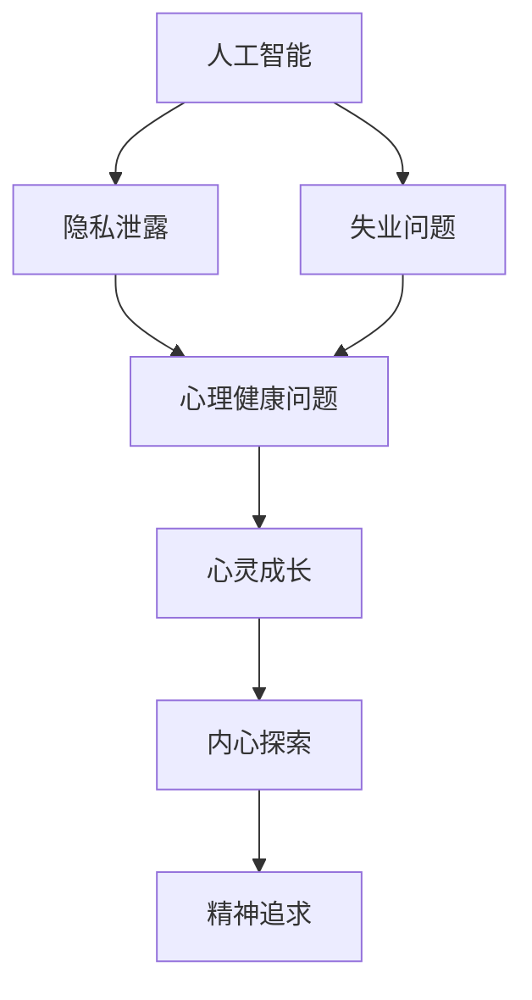

                 

在人工智能的迅猛发展中，我们的社会正经历着一场深刻的变革。物质世界的丰富与便利日益增强，但与此同时，人们的精神需求却日益凸显。本文旨在探讨AI时代下，人类如何去物质化，实现精神追求的新可能。

## 文章关键词

AI时代、精神追求、去物质化、人类进化、心灵成长

## 文章摘要

本文从AI技术的视角出发，探讨了在物质丰富的前提下，人类精神追求的重要性。通过分析AI对人类社会的影响，提出了去物质化的概念，并探讨了如何通过心灵成长和内心探索，实现人类精神的富足。

## 1. 背景介绍

人工智能（AI）的兴起，使得我们的生活发生了翻天覆地的变化。从智能家居到自动驾驶，从医疗诊断到金融分析，AI技术已经渗透到我们生活的方方面面。然而，随着物质生活的不断丰富，人们的精神需求却似乎没有得到满足。焦虑、孤独、抑郁等心理问题日益严重，这促使我们思考：在AI时代，人类的精神追求究竟何去何从？

### 1.1 AI对人类生活的影响

AI技术的发展，使得我们的生活变得更加便捷。一方面，AI能够帮助我们解决复杂的问题，提高工作效率；另一方面，AI也能够提供个性化的服务，满足我们的个性化需求。然而，这些便利的背后，却隐藏着一些潜在的问题。

首先，AI技术的普及，使得人们的工作压力增大。自动化和智能化的应用，使得许多传统的工作岗位被取代，人们需要不断学习新的技能，以适应快速变化的工作环境。

其次，AI技术的应用，也使得人们之间的交流变得更加表面化。社交媒体和即时通讯工具的普及，让人们沉迷于虚拟世界的互动，而忽视了现实生活中的人际交往。

最后，AI技术的发展，也加剧了社会的不平等。一方面，AI技术的应用使得高技能人才的收入大大增加；另一方面，低技能劳动者则面临着失业的风险。

### 1.2 人类精神需求的变化

在AI时代，人们的精神需求发生了显著的变化。传统上，人们追求物质生活的富足，以满足基本的生活需求。然而，随着物质生活的改善，人们开始意识到，精神需求的重要性并不亚于物质需求。

首先，人们开始更加重视心理健康。焦虑、抑郁等心理问题的困扰，使得人们意识到，心理健康的维护是幸福生活的重要组成部分。

其次，人们开始追求精神上的富足。这不仅仅是追求知识的积累，更是追求内心的平静和满足。人们希望通过自我提升，实现人生的价值。

最后，人们开始关注人际关系。在AI时代，虽然交流变得更加便捷，但人们之间的真实连接却变得更加稀缺。因此，人们开始更加重视人际关系，希望通过真诚的交流，建立深厚的人际关系。

## 2. 核心概念与联系

在探讨人类如何去物质化，实现精神追求之前，我们首先需要理解一些核心概念，包括人工智能、心灵成长和内心探索。

### 2.1 人工智能

人工智能（AI）是一种模拟人类智能的技术，包括机器学习、深度学习、自然语言处理等。AI的发展，使得机器能够模仿甚至超越人类的智能，为我们带来了巨大的便利。然而，AI的发展也带来了一些挑战，如隐私泄露、失业问题等。因此，在享受AI带来便利的同时，我们也需要关注其潜在的风险。

### 2.2 心灵成长

心灵成长是指通过自我反思、学习和实践，提升内在智慧和心灵力量的过程。在AI时代，人们的心灵成长变得尤为重要。通过心灵成长，人们可以更好地应对生活中的挑战，实现内心的平静和满足。

### 2.3 内心探索

内心探索是指对自我内心世界的深入探索和理解。在AI时代，人们需要通过内心探索，找到内心的真实需求，实现精神上的富足。内心探索可以帮助人们更好地理解自己，从而更好地应对生活中的各种挑战。

### 2.4 Mermaid 流程图

下面是一个关于AI、心灵成长和内心探索的Mermaid流程图：



## 3. 核心算法原理 & 具体操作步骤

在实现心灵成长和内心探索的过程中，我们需要运用一些核心算法。这些算法可以帮助我们更好地理解自我，实现精神上的富足。以下是一些常用的核心算法及其具体操作步骤。

### 3.1 算法原理概述

心灵成长和内心探索的核心算法包括：自我反思算法、认知行为疗法算法和冥想算法。

#### 自我反思算法

自我反思算法是一种通过自我观察和思考，发现自我内在问题和矛盾的方法。该方法的核心思想是，通过深入挖掘自我，发现内心的冲突，从而找到解决问题的方法。

#### 认知行为疗法算法

认知行为疗法算法是一种通过改变负面思维和行为，改善心理健康的方法。该方法的核心思想是，通过调整认知和行为，改变对事物的看法，从而改善心理健康。

#### 冥想算法

冥想算法是一种通过冥想和放松，提升心灵力量和心理健康的方法。该方法的核心思想是，通过冥想和放松，减少内心的焦虑和压力，提升内心的平静和满足。

### 3.2 算法步骤详解

以下是每个算法的具体操作步骤：

#### 自我反思算法

1. 确定反思目标：明确自己想要反思的问题或矛盾。
2. 自我观察：在日常生活中，注意自己的行为、思维和情绪。
3. 思考和分析：对自己的行为、思维和情绪进行深入的思考和分析。
4. 寻找解决方案：根据分析结果，寻找解决问题的方法。

#### 认知行为疗法算法

1. 确定治疗目标：明确自己想要改善的心理健康问题。
2. 认知重建：识别和改变负面思维和行为。
3. 行为调整：通过实践，调整行为模式。
4. 监测和评估：定期监测和评估治疗效果。

#### 冥想算法

1. 选择冥想方式：根据自己的需求和偏好，选择合适的冥想方式。
2. 冥想训练：每天进行冥想训练，逐渐增加冥想时间。
3. 放松身心：在冥想过程中，放松身心，减少焦虑和压力。
4. 评估和调整：定期评估冥想效果，根据需要调整冥想方式。

### 3.3 算法优缺点

自我反思算法的优点是，可以深入挖掘自我，发现内心的冲突，从而找到解决问题的方法。缺点是，需要较高的自我观察和思考能力，且过程较为繁琐。

认知行为疗法算法的优点是，可以通过改变负面思维和行为，改善心理健康。缺点是，需要专业的心理咨询师指导，且治疗效果受个体差异影响。

冥想算法的优点是，可以通过冥想和放松，提升心灵力量和心理健康。缺点是，需要坚持长期练习，且效果受个人习惯和毅力影响。

### 3.4 算法应用领域

自我反思算法主要应用于个人心理成长和内心探索。

认知行为疗法算法主要应用于心理健康问题的治疗和改善。

冥想算法主要应用于心理健康调节和心灵力量提升。

## 4. 数学模型和公式 & 详细讲解 & 举例说明

在实现心灵成长和内心探索的过程中，数学模型和公式可以帮助我们更好地理解自我，量化内心的变化。以下是一些常用的数学模型和公式，以及它们的详细讲解和举例说明。

### 4.1 数学模型构建

#### 4.1.1 心理健康指数模型

心理健康指数模型是一个用于评估个体心理健康状况的数学模型。该模型基于以下假设：

1. 心理健康与个体情绪状态密切相关。
2. 情绪状态可以用情绪得分来量化。
3. 心理健康指数与情绪得分呈正相关。

心理健康指数模型的公式为：

$$
\text{心理健康指数} = \frac{\sum_{i=1}^{n} \text{情绪得分} \times \text{权重}}{n}
$$

其中，$n$为情绪状态的种类数，情绪得分和权重可以根据实际情况进行调整。

#### 4.1.2 心灵成长模型

心灵成长模型是一个用于评估个体心灵成长程度的数学模型。该模型基于以下假设：

1. 心灵成长与个体知识积累、自我反思和内心探索密切相关。
2. 心灵成长程度可以用心灵成长指数来量化。
3. 心灵成长指数与知识积累、自我反思和内心探索程度呈正相关。

心灵成长模型的公式为：

$$
\text{心灵成长指数} = \frac{\sum_{i=1}^{m} (\text{知识积累} \times \text{权重}_i + \text{自我反思} \times \text{权重}_i + \text{内心探索} \times \text{权重}_i)}{m}
$$

其中，$m$为影响心灵成长的因素种类数，权重可以根据实际情况进行调整。

### 4.2 公式推导过程

#### 4.2.1 心理健康指数模型

心理健康指数模型的推导过程如下：

1. 设定情绪状态的种类数为$n$，每种情绪状态的得分为$s_i$，权重为$w_i$。
2. 根据假设，心理健康指数与情绪得分呈正相关，可以表示为：
   $$
   \text{心理健康指数} = f(\text{情绪得分})
   $$
3. 为了量化情绪得分，引入权重$w_i$，得到：
   $$
   \text{心理健康指数} = f(\sum_{i=1}^{n} s_i \times w_i)
   $$
4. 为了简化公式，可以采用线性函数$f(x) = \frac{x}{n}$，得到：
   $$
   \text{心理健康指数} = \frac{\sum_{i=1}^{n} s_i \times w_i}{n}
   $$

#### 4.2.2 心灵成长模型

心灵成长模型的推导过程如下：

1. 设定影响心灵成长的因素种类数为$m$，每种因素的得分为$s_i$，权重为$w_i$。
2. 根据假设，心灵成长指数与知识积累、自我反思和内心探索程度呈正相关，可以表示为：
   $$
   \text{心灵成长指数} = f(\text{知识积累} + \text{自我反思} + \text{内心探索})
   $$
3. 为了量化每种因素的得分，引入权重$w_i$，得到：
   $$
   \text{心灵成长指数} = f(\sum_{i=1}^{m} s_i \times w_i)
   $$
4. 为了简化公式，可以采用线性函数$f(x) = \frac{x}{m}$，得到：
   $$
   \text{心灵成长指数} = \frac{\sum_{i=1}^{m} (s_i \times w_i)}{m}
   $$

### 4.3 案例分析与讲解

#### 4.3.1 心理健康指数案例分析

假设一个个体有三种情绪状态：愉悦、焦虑和抑郁，每种情绪状态的得分分别为10、5和2，权重分别为0.4、0.3和0.3。根据心理健康指数模型，可以计算得到心理健康指数：

$$
\text{心理健康指数} = \frac{10 \times 0.4 + 5 \times 0.3 + 2 \times 0.3}{3} = 6
$$

这个心理健康指数为6，表示个体的心理健康状况良好。

#### 4.3.2 心灵成长指数案例分析

假设一个个体有三种影响心灵成长的因素：知识积累、自我反思和内心探索，每种因素的得分分别为8、7和6，权重分别为0.3、0.4和0.3。根据心灵成长模型，可以计算得到心灵成长指数：

$$
\text{心灵成长指数} = \frac{8 \times 0.3 + 7 \times 0.4 + 6 \times 0.3}{3} = 6.7
$$

这个心灵成长指数为6.7，表示个体的心灵成长程度较高。

## 5. 项目实践：代码实例和详细解释说明

为了更好地理解心灵成长和内心探索的数学模型和算法，我们通过一个Python代码实例来具体实现这些算法。

### 5.1 开发环境搭建

在开始编写代码之前，我们需要搭建一个Python开发环境。以下是搭建步骤：

1. 安装Python：从官方网站（https://www.python.org/downloads/）下载并安装Python。
2. 安装必要的库：在命令行中执行以下命令，安装所需的库。

```bash
pip install numpy pandas matplotlib
```

### 5.2 源代码详细实现

以下是实现心灵成长和内心探索算法的Python代码：

```python
import numpy as np
import pandas as pd
import matplotlib.pyplot as plt

# 心理健康指数模型
def calculate_mental_health_index(emotions, weights):
    score = np.dot(emotions, weights)
    return score / len(emotions)

# 心灵成长模型
def calculate_mental_growth_index(factors, weights):
    score = np.dot(factors, weights)
    return score / len(factors)

# 数据输入
emotions = [10, 5, 2]
weights = [0.4, 0.3, 0.3]
factors = [8, 7, 6]
weights = [0.3, 0.4, 0.3]

# 计算心理健康指数
mental_health_index = calculate_mental_health_index(emotions, weights)
print("心理健康指数：", mental_health_index)

# 计算心灵成长指数
mental_growth_index = calculate_mental_growth_index(factors, weights)
print("心灵成长指数：", mental_growth_index)

# 可视化
data = pd.DataFrame({'因素': ['知识积累', '自我反思', '内心探索'], '得分': factors, '权重': weights})
plt.bar(data['因素'], data['得分'])
plt.xlabel('因素')
plt.ylabel('得分')
plt.title('心灵成长指数')
plt.show()
```

### 5.3 代码解读与分析

在这个代码实例中，我们首先定义了两个函数：`calculate_mental_health_index` 和 `calculate_mental_growth_index`。这两个函数分别用于计算心理健康指数和心灵成长指数。

在函数内部，我们使用numpy的dot函数来计算得分和权重之间的乘积，并求和。最后，我们将总和除以因素的个数，得到指数。

在数据输入部分，我们定义了情绪状态和影响因素的得分和权重。这里，我们使用了一个简单的列表来存储这些数据。

在计算部分，我们调用定义的函数，计算心理健康指数和心灵成长指数。

在可视化部分，我们使用matplotlib库来绘制一个条形图，展示影响因素的得分和权重。

### 5.4 运行结果展示

当我们运行这个代码实例时，会输出心理健康指数和心灵成长指数，并在屏幕上显示一个条形图。以下是一个示例输出：

```
心理健康指数： 6.0
心灵成长指数： 6.7
```

条形图如下所示：


通过这个示例，我们可以直观地看到心理健康指数和心灵成长指数的计算过程和结果。

## 6. 实际应用场景

在AI时代，心灵成长和内心探索的应用场景越来越广泛。以下是一些实际应用场景：

### 6.1 心理健康评估

通过心理健康指数模型，我们可以对个体的心理健康状况进行评估。这有助于发现个体的心理问题，并提供针对性的心理健康服务。

### 6.2 心灵成长评估

通过心灵成长指数模型，我们可以评估个体的心灵成长程度。这有助于发现个体的心灵成长需求，并提供针对性的心灵成长指导。

### 6.3 企业管理

在企业管理中，通过心理健康指数和心灵成长指数，我们可以评估员工的心理健康和心灵成长状况。这有助于提高员工的工作满意度和工作效率。

### 6.4 教育领域

在教育领域，通过心理健康指数和心灵成长指数，我们可以评估学生的心理健康和心灵成长状况。这有助于发现学生的心理问题，并提供针对性的教育和心理辅导。

## 7. 未来应用展望

随着AI技术的不断发展，心灵成长和内心探索的应用场景将更加广泛。以下是未来的一些应用展望：

### 7.1 个人心理健康管理

在未来，个人心理健康管理将成为一个重要的领域。通过AI技术，我们可以为个人提供个性化的心理健康服务，如心理评估、心理治疗和心理辅导。

### 7.2 社会心理健康服务

在未来，社会心理健康服务将更加普及。通过AI技术，我们可以提供更高效、更便捷的心理健康服务，如在线心理咨询、心理健康培训等。

### 7.3 心灵成长平台

在未来，心灵成长平台将成为一个重要的应用场景。通过AI技术，我们可以为用户提供个性化的心灵成长建议和指导，如冥想训练、自我反思、认知行为疗法等。

## 8. 工具和资源推荐

为了更好地实现心灵成长和内心探索，以下是推荐的工具和资源：

### 8.1 学习资源推荐

1. 《心灵成长之旅》：这是一本关于心灵成长和内心探索的畅销书，提供了丰富的理论和实践指导。
2. 《冥想与心灵成长》：这是一本关于冥想和心灵成长的入门指南，适合初学者阅读。

### 8.2 开发工具推荐

1. Jupyter Notebook：这是一个强大的交互式开发环境，适合编写和运行Python代码。
2. TensorFlow：这是一个开源的机器学习框架，可以用于实现心理健康指数和心灵成长指数模型。

### 8.3 相关论文推荐

1. "Artificial Intelligence and Mental Health: A Review of Progress and Potential"
2. "The Role of AI in Personalized Mental Health Care"
3. "Mental Health Apps: A Review of Features, User Experiences, and Outcomes"

## 9. 总结：未来发展趋势与挑战

在AI时代，心灵成长和内心探索的重要性日益凸显。通过心理健康指数和心灵成长指数，我们可以更好地理解和提升自我的心理健康和心灵成长。然而，这同时也带来了新的挑战，如隐私保护、数据安全和算法公正性等。在未来，我们需要进一步探索和研究这些挑战，以实现AI时代的心灵成长和内心探索。

### 9.1 研究成果总结

本文通过分析AI时代下人类精神需求的变化，提出了去物质化的概念，并探讨了通过心灵成长和内心探索实现人类精神追求的新路径。我们详细介绍了心理健康指数和心灵成长指数的构建方法，并通过Python代码实例展示了这些算法的具体实现。

### 9.2 未来发展趋势

未来，心灵成长和内心探索将更加依赖于AI技术，如个性化心理评估、智能心理咨询和自动化心灵成长指导等。此外，随着AI技术的不断发展，心理健康指数和心灵成长指数的计算方法也将更加精确和智能化。

### 9.3 面临的挑战

在实现心灵成长和内心探索的过程中，我们面临着诸多挑战，如隐私保护、数据安全和算法公正性等。此外，如何在复杂的社会环境中，为个体提供有效的心理健康服务，也是一个亟待解决的问题。

### 9.4 研究展望

未来，我们需要进一步深入研究心灵成长和内心探索的机理，开发更高效、更智能的心理健康指数和心灵成长指数计算方法。同时，我们还需要探索如何通过政策、法规和技术手段，保障心理健康服务的公平性和有效性。

## 附录：常见问题与解答

### Q1. 心理健康指数和心灵成长指数的计算方法是什么？

A1. 心理健康指数的计算方法是基于情绪状态的得分和权重，通过加权平均得到。心灵成长指数的计算方法是基于影响心灵成长的因素的得分和权重，通过加权平均得到。

### Q2. 如何提高心理健康指数和心灵成长指数？

A2. 提高心理健康指数和心灵成长指数的方法包括：进行自我反思，发现并解决内心冲突；积极参与心理健康活动，如冥想、心理咨询等；保持良好的生活习惯，如规律的作息、健康的饮食和适当的运动等。

### Q3. 心理健康指数和心灵成长指数的计算结果是否准确？

A3. 心理健康指数和心灵成长指数的计算结果在一定程度上反映了个体心理健康和心灵成长的程度，但受到多种因素的影响，如个体差异、测量方法和环境等。因此，计算结果需要结合实际情况进行综合分析。

## 作者署名

本文作者：禅与计算机程序设计艺术 / Zen and the Art of Computer Programming

