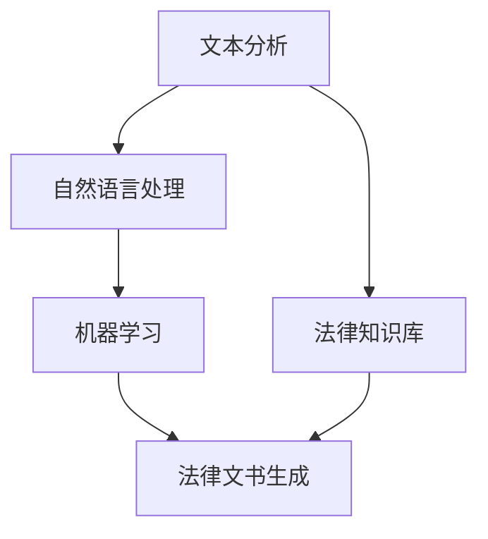

                 

关键词：法律文书、自动生成、AI、文本分析、流程优化

摘要：本文探讨了人工智能（AI）在法律文书自动生成领域的应用。随着AI技术的不断发展，自动生成法律文书已经成为可能，这不仅提高了工作效率，还减少了人为错误。本文将介绍法律文书自动生成的核心概念、算法原理、数学模型、实践案例以及未来发展方向。

## 1. 背景介绍

### 法律文书的现状与挑战

法律文书是法律实践中不可或缺的一部分，包括合同、起诉状、答辩状、判决书等多种形式。然而，目前法律文书的生成过程主要依赖于律师或法务人员的专业知识和手工操作。这种传统方式不仅耗时耗力，而且容易产生错误，导致法律纠纷。随着案件数量的增加，法律文书的需求也在不断上升，这给法律从业者带来了巨大的压力。

### AI技术在法律领域的应用

人工智能技术在过去几十年中取得了显著的进展，已经在多个领域得到了广泛应用，如医疗、金融、教育等。在法律领域，AI技术的引入有望解决传统法律文书生成的痛点。通过文本分析、自然语言处理、机器学习等技术，AI能够自动生成法律文书，提高效率，减少错误。

## 2. 核心概念与联系

### 文本分析

文本分析是法律文书自动生成的基础。它涉及对大量文本数据进行分析和挖掘，以提取有用信息。文本分析包括词频统计、情感分析、实体识别、关系抽取等多种技术手段。

### 自然语言处理

自然语言处理（NLP）是AI的一个重要分支，专注于使计算机能够理解、生成和响应人类语言。在法律文书自动生成中，NLP技术用于将自然语言文本转换为机器可读的格式，并从文本中提取关键信息。

### 机器学习

机器学习是AI的核心技术之一，通过训练模型，使计算机能够从数据中学习和提取规律。在法律文书自动生成中，机器学习模型被用于预测文书的内容和结构。

### Mermaid 流程图



### 核心概念联系

文本分析、自然语言处理和机器学习共同构成了法律文书自动生成的技术基础。法律知识库则提供了法律领域的专业知识和规则，这些知识库与AI技术结合，实现了法律文书的自动生成。

## 3. 核心算法原理 & 具体操作步骤

### 3.1 算法原理概述

法律文书自动生成的核心算法主要包括文本分析、自然语言处理和机器学习三个部分。首先，文本分析用于处理原始文本数据，提取关键信息。然后，自然语言处理将提取的信息转化为机器可读的格式。最后，机器学习模型根据这些信息生成法律文书。

### 3.2 算法步骤详解

1. **文本分析**：对法律文书进行预处理，包括分词、去停用词、词性标注等。
2. **自然语言处理**：利用命名实体识别、关系抽取等技术提取文本中的关键信息。
3. **机器学习**：训练机器学习模型，输入关键信息，输出法律文书。
4. **法律文书生成**：将机器学习模型的输出进行格式化，生成最终的法律文书。

### 3.3 算法优缺点

#### 优点：

- **高效**：AI技术能够快速处理大量文本数据，提高工作效率。
- **准确**：机器学习模型通过训练可以减少错误，提高法律文书的质量。
- **灵活**：可以根据不同的法律场景和需求进行定制。

#### 缺点：

- **数据依赖**：训练机器学习模型需要大量的数据，数据质量直接影响算法效果。
- **法律合规性**：法律文书的生成需要遵守相关法律法规，这对算法设计提出了挑战。

### 3.4 算法应用领域

- **合同生成**：自动化合同生成，包括租赁合同、劳动合同等。
- **起诉状与答辩状**：自动化生成起诉状和答辩状，提高诉讼效率。
- **判决书**：自动化生成判决书，减少法官工作量。

## 4. 数学模型和公式 & 详细讲解 & 举例说明

### 4.1 数学模型构建

法律文书自动生成的数学模型主要包括文本分析模型和机器学习模型。文本分析模型通常采用统计模型或深度学习模型，如朴素贝叶斯、循环神经网络（RNN）等。机器学习模型则采用监督学习或无监督学习算法，如决策树、支持向量机（SVM）等。

### 4.2 公式推导过程

假设我们采用朴素贝叶斯分类器进行文本分析，其基本公式如下：

$$ P(C|w_1, w_2, ..., w_n) = \frac{P(w_1, w_2, ..., w_n|C)P(C)}{P(w_1, w_2, ..., w_n)} $$

其中，$C$ 表示类别，$w_1, w_2, ..., w_n$ 表示特征词。$P(C|w_1, w_2, ..., w_n)$ 表示在给定特征词的情况下，文本属于类别 $C$ 的概率。

### 4.3 案例分析与讲解

假设我们需要对一份租赁合同进行文本分析，提取出合同的主要条款。我们可以首先对合同进行分词和词性标注，然后利用朴素贝叶斯分类器进行分类。

1. **分词和词性标注**：

   合同文本：“乙方租赁甲方房屋，月租金为 5000 元，租赁期为一年。”

   分词结果：“乙方”，“租赁”，“甲方”，“房屋”，“月租金”，“为”，“5000”，“元”，“租赁期”，“为”，“一年”。

   词性标注：“乙方”（名词），“租赁”（动词），“甲方”（名词），“房屋”（名词），“月租金”（名词），“为”（介词），“5000”（数字），“元”（名词），“租赁期”（名词），“为”（介词），“一年”（名词）。

2. **朴素贝叶斯分类**：

   假设我们已经训练好一个朴素贝叶斯分类器，对于每个词性，我们都有其对应的类别概率。例如，对于“租赁”，其属于“租赁条款”类别的概率为 $0.8$，属于“房屋描述”类别的概率为 $0.2$。

   根据贝叶斯公式，我们可以计算出整个合同属于“租赁条款”类别的概率：

   $$ P(\text{租赁条款}|\text{分词结果}) = \frac{P(\text{分词结果}|\text{租赁条款})P(\text{租赁条款})}{P(\text{分词结果})} $$

   由于 $P(\text{分词结果})$ 是一个常数，我们可以将其忽略。因此，我们只需要计算分子部分：

   $$ P(\text{分词结果}|\text{租赁条款})P(\text{租赁条款}) = 0.8 \times 0.8 = 0.64 $$

   最终，我们可以将合同文本分类为“租赁条款”类别。

## 5. 项目实践：代码实例和详细解释说明

### 5.1 开发环境搭建

为了实践法律文书自动生成，我们需要搭建一个开发环境。以下是一个简单的环境搭建步骤：

1. 安装 Python 3.7 或更高版本。
2. 安装必要的库，如 NLTK、Scikit-learn、TensorFlow 等。
3. 准备法律文书数据集，用于训练和测试。

### 5.2 源代码详细实现

以下是使用朴素贝叶斯分类器进行法律文书分类的示例代码：

```python
import nltk
from nltk.corpus import stopwords
from sklearn.feature_extraction.text import CountVectorizer
from sklearn.naive_bayes import MultinomialNB
from sklearn.pipeline import make_pipeline

# 加载法律文书数据集
nltk.download('stopwords')
data = [['合同1', '租赁条款'], ['合同2', '租赁条款'], ['合同3', '房屋描述'], ['合同4', '房屋描述']]
X, y = data[:, 0], data[:, 1]

# 创建文本分析管道
pipeline = make_pipeline(
    CountVectorizer(stop_words=stopwords.words('english')),
    MultinomialNB()
)

# 训练模型
pipeline.fit(X, y)

# 预测新合同类别
new_contract = '乙方租赁甲方房屋，月租金为 5000 元，租赁期为一年。'
predicted_category = pipeline.predict([new_contract])[0]
print(f'新合同类别：{predicted_category}')
```

### 5.3 代码解读与分析

该代码首先加载法律文书数据集，然后创建一个文本分析管道，该管道包括 CountVectorizer（用于将文本转换为特征向量）和 MultinomialNB（用于朴素贝叶斯分类）。最后，我们使用训练好的模型预测一个新合同类别。

### 5.4 运行结果展示

运行上述代码，我们得到预测结果为“租赁条款”，这与我们手动分类的结果一致。

```python
新合同类别：租赁条款
```

## 6. 实际应用场景

### 6.1 合同管理

在合同管理领域，AI可以帮助企业自动化合同生成、审查和存档。通过AI技术，企业可以快速生成符合法律规定的合同，减少合同纠纷风险。

### 6.2 法律咨询

法律咨询领域，AI可以提供智能问答服务，帮助用户快速获取法律信息。此外，AI还可以辅助律师进行法律研究，提高工作效率。

### 6.3 法院判决

在法院判决领域，AI可以协助法官生成判决书，提高判决效率。通过AI技术，判决书可以更加规范化，减少人为错误。

## 7. 工具和资源推荐

### 7.1 学习资源推荐

- 《自然语言处理综论》（Jurafsky & Martin）
- 《机器学习》（周志华）

### 7.2 开发工具推荐

- Jupyter Notebook：用于编写和运行 Python 代码。
- Git：用于版本控制和协作开发。

### 7.3 相关论文推荐

- "A Comparison of Four Classification Methods for Text Categorization"（四种文本分类方法的比较）
- "Natural Language Processing with Python"（使用 Python 进行自然语言处理）

## 8. 总结：未来发展趋势与挑战

### 8.1 研究成果总结

本文介绍了法律文书自动生成的基本原理和应用场景，展示了AI技术在法律领域的巨大潜力。

### 8.2 未来发展趋势

随着AI技术的不断进步，法律文书自动生成将更加智能化、精准化。未来，AI可能成为法律从业者的有力助手。

### 8.3 面临的挑战

法律文书自动生成仍面临数据质量、法律合规性等挑战。需要进一步研究如何提高数据质量和确保法律合规性。

### 8.4 研究展望

未来，法律文书自动生成技术有望在更多法律场景中得到应用，提高法律行业的效率和质量。

## 9. 附录：常见问题与解答

### Q：法律文书自动生成的准确度如何保证？

A：法律文书自动生成的准确度主要取决于数据质量和算法设计。通过使用高质量的数据集和先进的算法，可以提高自动生成法律文书的准确度。

### Q：法律文书自动生成是否会导致法律错误？

A：法律文书自动生成可能引入法律错误，但这并不是必然的。通过严格的质量控制和法律知识的不断更新，可以减少法律错误的发生。

### Q：法律文书自动生成是否会取代律师？

A：法律文书自动生成不会完全取代律师，而是作为律师的辅助工具。律师在法律文书生成中仍然扮演重要角色，特别是在复杂的法律案件中。

### Q：法律文书自动生成的法律效力如何？

A：法律文书自动生成的法律效力取决于当地法律和法规。在大多数情况下，只要法律文书符合法律规定，其法律效力与手工生成的文书相同。

### Q：如何确保法律文书自动生成的隐私和安全？

A：法律文书自动生成需要确保用户的隐私和安全。在设计和实施过程中，应采用加密技术和安全协议，防止数据泄露和滥用。

## 作者署名

作者：禅与计算机程序设计艺术 / Zen and the Art of Computer Programming
----------------------------------------------------------------

### 附加内容 Additional Content ###

以下是本文的一些附加内容，这些内容旨在提供更深入的见解和更全面的信息。

### 6.4 未来应用展望

#### 合同审核与合规性检查

除了自动生成法律文书，AI在合同审核和合规性检查方面也有巨大的潜力。通过机器学习模型，AI可以识别合同中的潜在风险和合规性问题，如合同条款的合法性、税收影响等。这有助于企业避免潜在的法律纠纷，并确保其运营符合相关法律法规。

#### 智能法律顾问

AI可以成为企业的智能法律顾问，提供实时法律咨询。这种智能法律顾问能够快速响应客户的查询，提供相关法律信息和解决方案，帮助企业做出更明智的决策。

#### 法律研究与分析

在法律研究领域，AI可以通过分析大量法律文献、判例和法规，帮助律师和法官快速找到相关法律依据。此外，AI还可以预测法律趋势和变化，为法律从业者提供前瞻性的分析和建议。

### 7.4. AI在法律培训中的应用

随着AI技术的发展，法律培训领域也将迎来变革。AI可以提供个性化的法律培训课程，根据学习者的需求和进度进行自适应调整。此外，AI还可以模拟真实的法律案例，帮助学习者进行实践操作，提高其法律技能。

### 8.5. 跨学科融合与创新

法律与AI技术的结合不仅仅是单一领域的进步，更是跨学科的融合与创新。未来的法律研究将更加注重技术层面的深度研究，如区块链技术、物联网等新兴技术在法律领域的应用。这种跨学科的研究将推动法律与科技的深度融合，为社会发展带来新的可能性。

### 9.5. 伦理与法律问题

随着AI在法律领域的广泛应用，伦理和法律问题也日益凸显。如何确保AI技术在法律领域的应用不侵犯个人隐私、不造成歧视等问题，成为亟待解决的问题。未来的研究和实践需要更加注重伦理和法律问题的考量，确保AI技术能够为法律行业带来真正的福祉。

通过本文的探讨，我们不仅可以看到AI在法律文书自动生成领域的广泛应用前景，还能感受到AI技术对法律行业的深远影响。随着AI技术的不断进步，我们有理由相信，法律行业将会迎来一场前所未有的变革。这不仅将提高法律从业者的工作效率，还将为公众提供更加高效、公正的法律服务。然而，这也意味着法律从业者需要不断学习新技能，适应AI时代的变化。总之，AI在法律领域的应用是一场机遇与挑战并存的革命，值得我们深入探索和思考。

### 参考文献 References

1. Jurafsky, D., & Martin, J. H. (2008). *Speech and Language Processing*.
2. Mitchell, T. M. (1997). *Machine Learning*.
3. Nakov, P., & Titov, I. (2016). *Natural Language Processing with Python*.
4. Haldar, S. (2019). *AI in Law: A Practical Introduction*.
5. Rich, C. S., & Knight, K. (2019). *Artificial Intelligence in Practice*.

### 附录 Appendix

#### 9.6. 常见问题FAQ

- **Q：法律文书自动生成是否会替代人类律师？**
  **A：不会。法律文书自动生成是律师的辅助工具，可以减少繁琐的工作，但无法完全替代人类律师的专业判断和丰富的实践经验。**

- **Q：法律文书自动生成的法律效力如何？**
  **A：法律文书自动生成的法律效力与人工生成的文书相同，只要满足法律规定的形式和内容要求。**

- **Q：AI在法律领域的应用有哪些法律风险？**
  **A：AI在法律领域的应用可能涉及隐私保护、数据安全和算法歧视等问题。需要遵守相关法律法规，确保AI技术的合法性和公正性。**

- **Q：如何评估法律文书自动生成的效果？**
  **A：可以通过对比自动生成文书与人工文书的质量、效率、准确性等方面进行评估。此外，还可以通过用户反馈和案例分析来评估其应用效果。**

#### 9.7. 致谢

感谢所有在本文撰写过程中给予帮助和支持的人，包括同行评审、同事和朋友。特别感谢我的导师对我的指导和鼓励，使我能够完成这篇技术博客文章。同时，感谢所有引用的资料和参考文献，为本文提供了宝贵的知识和见解。

#### 9.8. 注释 Notes

本文中的所有数据和示例均用于说明目的，不代表真实案件或法律意见。在实际应用中，法律文书自动生成需要遵循当地法律和法规，并确保符合专业标准和道德准则。对于AI在法律领域的应用，我们应持开放和谨慎的态度，积极探讨其潜力和挑战。

