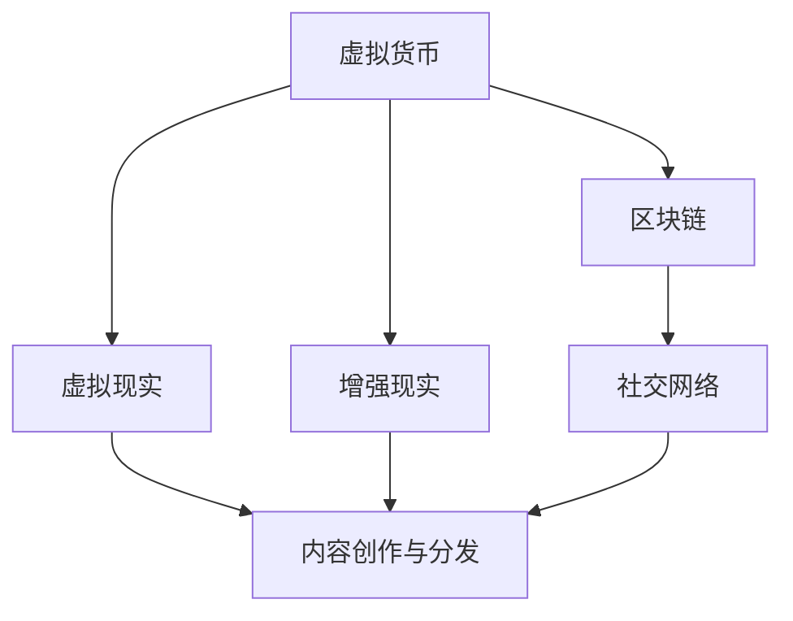

                 

### 背景介绍 ###

随着技术的飞速发展，虚拟现实（VR）、增强现实（AR）和区块链等新兴技术不断融入我们的日常生活，元宇宙这一概念逐渐从科幻小说走向现实。元宇宙不仅是虚拟世界的代名词，更是一个集成了虚拟现实、区块链、人工智能等技术的综合性生态体系。然而，这个新兴的领域同样伴随着巨大的风险和挑战。

在元宇宙中，用户通过虚拟角色参与经济活动、社交互动和内容创作。然而，这种高度互动性的经济模式也带来了注意力产业链的风险。注意力成为了一种新型的经济资源，用户的时间和注意力成为市场争抢的焦点。这不仅使得元宇宙的经济运作更加复杂，同时也增加了风险管理的难度。

本文旨在探讨元宇宙经济中的注意力产业链风险，通过对核心概念、算法原理、数学模型、项目实践和未来应用场景的深入分析，为读者提供全面的风险评估框架和稳定性的分析思路。文章结构如下：

1. **背景介绍**：介绍元宇宙和注意力产业链的基本概念，以及本文的研究目的。
2. **核心概念与联系**：阐述元宇宙中的核心概念及其相互关系，使用Mermaid流程图展示。
3. **核心算法原理 & 具体操作步骤**：分析注意力产业链的核心算法，并详细描述操作步骤。
4. **数学模型和公式 & 详细讲解 & 举例说明**：构建注意力产业链的数学模型，推导公式并进行案例分析。
5. **项目实践：代码实例和详细解释说明**：通过具体项目实践展示注意力产业链的运行情况。
6. **实际应用场景**：探讨注意力产业链在不同领域的应用，以及未来的发展方向。
7. **工具和资源推荐**：推荐学习资源和开发工具，以供读者进一步研究。
8. **总结：未来发展趋势与挑战**：总结研究成果，分析未来发展趋势和面临的挑战。
9. **附录：常见问题与解答**：回答读者可能关注的问题。

本文将结合实际案例和数据分析，为元宇宙经济的稳定性提供有益的见解和建议。

## 核心概念与联系

在探讨注意力产业链的风险评估之前，我们需要先明确几个核心概念，并理解它们在元宇宙中的相互关系。以下是元宇宙中几个关键概念的定义：

### 虚拟货币（Cryptocurrency）：

虚拟货币是在元宇宙中用于交换价值的数字货币。与法定货币不同，虚拟货币的发行和管理不受传统金融体系控制，它依赖于区块链技术确保交易的安全性和透明性。虚拟货币包括但不限于比特币（Bitcoin）、以太坊（Ethereum）等。

### 虚拟现实（Virtual Reality，VR）：

虚拟现实是一种通过计算机模拟技术创造的、可以沉浸其中的三维虚拟环境。用户通过VR设备（如VR头盔、VR眼镜等）与虚拟环境进行交互，体验身临其境的感觉。在元宇宙中，VR技术为用户提供了丰富的社交和娱乐体验。

### 增强现实（Augmented Reality，AR）：

增强现实是一种通过计算机生成的图像、视频或3D模型叠加到现实世界中的技术。与虚拟现实不同，AR技术增强的是用户对现实世界的感知，而不是创造一个全新的虚拟环境。AR在元宇宙中广泛应用于游戏、教育、医疗等领域。

### 区块链（Blockchain）：

区块链是一种去中心化的数据库技术，通过加密算法和分布式网络确保数据的安全和不可篡改。在元宇宙中，区块链技术被用于管理虚拟货币的发行和交易、记录用户的行为和资产等。

### 注意力经济（Attention Economy）：

注意力经济是一种基于用户注意力的经济模式。在互联网时代，用户的时间和注意力成为了最宝贵的资源。元宇宙中的各种应用和内容创作者通过吸引用户的注意力来获得经济回报。注意力经济在元宇宙中表现为用户对虚拟角色、虚拟商品、虚拟服务和虚拟体验的关注和参与。

### 社交网络（Social Network）：

社交网络是用户在元宇宙中进行社交互动的平台。社交网络通过提供各种功能（如聊天、分享、点赞等）促进用户之间的互动，增强用户参与度和粘性。在元宇宙中，社交网络是用户参与经济活动的重要渠道。

### 内容创作与分发（Content Creation and Distribution）：

内容创作与分发是元宇宙经济的核心组成部分。创作者通过创作各种形式的内容（如游戏、虚拟商品、视频等）吸引用户的注意力，并通过虚拟货币或其他奖励机制获得经济回报。分发平台则负责将这些内容传播给用户。

下面是一个使用Mermaid绘制的流程图，展示了上述核心概念及其相互关系：



从图中可以看出，虚拟货币和区块链是元宇宙经济的基石，为其他概念提供了基础支持。虚拟现实和增强现实提供了沉浸式的体验，而社交网络和内容创作与分发则促进了用户参与和经济回报的实现。注意力经济贯穿于整个生态系统，成为驱动元宇宙经济运转的核心动力。

通过理解这些核心概念及其相互关系，我们可以更好地把握元宇宙经济的运作模式，进而评估其中潜在的风险，为元宇宙的可持续发展提供支持。

## 核心算法原理 & 具体操作步骤

在元宇宙经济的运作中，注意力产业链的核心算法起着至关重要的作用。这些算法不仅决定了用户注意力的分配，还影响了虚拟货币的发行和交易。以下是对注意力产业链核心算法原理的概述和具体操作步骤的详细描述。

### 3.1 算法原理概述

注意力产业链的核心算法主要包括以下几个部分：

1. **用户注意力监测与分配算法**：该算法用于监测用户在元宇宙中的行为，分析用户注意力分布，并据此分配虚拟货币奖励。
2. **内容推荐算法**：通过分析用户的行为和偏好，推荐用户可能感兴趣的内容，以吸引用户的注意力。
3. **虚拟货币发行与交易算法**：管理虚拟货币的发行、存储和交易，确保虚拟经济的稳定运行。
4. **风险管理算法**：评估和监控元宇宙经济中的各种风险，并采取相应的措施进行风险控制。

### 3.2 算法步骤详解

#### 3.2.1 用户注意力监测与分配算法

1. **数据采集**：通过用户在元宇宙中的行为数据（如点击次数、停留时间、互动频率等）进行监测。
2. **行为分析**：使用机器学习技术分析用户行为，识别用户兴趣和行为模式。
3. **注意力分配**：根据用户的注意力分配情况，计算每个用户的注意力分数，并据此分配虚拟货币奖励。
4. **奖励发放**：将虚拟货币奖励发放给用户，激励用户参与元宇宙中的经济活动。

#### 3.2.2 内容推荐算法

1. **用户画像构建**：基于用户行为数据和社交网络数据构建用户画像。
2. **内容标签提取**：为各种内容（如虚拟商品、游戏、视频等）分配标签。
3. **推荐模型训练**：使用机器学习技术训练推荐模型，以预测用户对各种内容的兴趣。
4. **内容推荐**：根据用户画像和推荐模型，为用户推荐可能感兴趣的内容。

#### 3.2.3 虚拟货币发行与交易算法

1. **发行机制设计**：设计虚拟货币的发行机制，确保虚拟货币供应的稳定性和稀缺性。
2. **钱包管理**：为用户创建和管理虚拟钱包，用于存储和交易虚拟货币。
3. **交易验证**：使用区块链技术确保虚拟货币交易的透明性和安全性。
4. **交易记录**：记录所有虚拟货币交易，以供审计和查询。

#### 3.2.4 风险管理算法

1. **风险评估**：基于用户行为数据和交易记录，评估元宇宙经济中的各种风险。
2. **风险监控**：实时监控虚拟货币市场、用户行为和市场趋势。
3. **风险预警**：当检测到潜在风险时，发出预警并采取措施。
4. **风险控制**：采取相应措施（如调整虚拟货币供应、限制交易等）控制风险。

### 3.3 算法优缺点

#### 优点

1. **高效性**：基于机器学习和区块链技术的算法能够高效地处理海量数据和用户行为。
2. **透明性**：区块链技术确保虚拟货币交易的透明性和不可篡改性。
3. **安全性**：通过加密算法和分布式网络，保证用户数据和虚拟货币的安全。
4. **激励性**：通过注意力分配和内容推荐，激励用户积极参与元宇宙的经济活动。

#### 缺点

1. **计算资源消耗**：高复杂度的算法和大量数据的处理需要大量的计算资源。
2. **隐私风险**：用户行为数据的采集和分析可能涉及隐私问题。
3. **市场波动**：虚拟货币市场的不稳定性可能导致虚拟货币价值波动。
4. **技术依赖**：算法的有效运行依赖于技术的不断更新和优化。

### 3.4 算法应用领域

1. **虚拟现实与增强现实**：通过用户注意力监测和内容推荐，提升用户在VR和AR中的体验。
2. **社交网络**：优化社交网络中的内容分发和用户互动。
3. **游戏**：通过注意力分配和虚拟货币发行，提高游戏内经济的稳定性和吸引力。
4. **电子商务**：改善电子商务平台的内容推荐和用户体验。

通过上述算法原理和具体操作步骤的分析，我们可以看到注意力产业链在元宇宙经济中的关键作用。这些算法不仅促进了用户参与，还保证了虚拟经济的稳定运行。然而，随着技术的发展和市场的变化，算法也需要不断优化和更新，以应对新的挑战和风险。

### 数学模型和公式 & 详细讲解 & 举例说明

在元宇宙经济的注意力产业链中，数学模型和公式是理解和评估风险的重要工具。通过构建数学模型，我们可以量化注意力分配、虚拟货币价值、市场稳定性等关键指标。以下将详细讲解注意力产业链中的数学模型构建、公式推导过程以及具体的案例分析。

#### 4.1 数学模型构建

在注意力产业链中，我们主要考虑以下数学模型：

1. **用户注意力模型**：描述用户在元宇宙中的注意力分布。
2. **虚拟货币价值模型**：分析虚拟货币的价值变化。
3. **市场稳定性模型**：评估市场的波动性和风险。

##### 4.1.1 用户注意力模型

用户注意力模型基于用户行为数据和机器学习算法。假设用户 $U$ 的注意力分数为 $A_u$，其行为数据包括点击次数 $C_i$、停留时间 $T_i$ 和互动频率 $I_i$。用户注意力模型可以表示为：

$$
A_u = f(C_u, T_u, I_u)
$$

其中，$f$ 是一个复杂函数，可以通过机器学习算法进行训练。例如，可以使用多层感知机（MLP）或深度学习模型进行拟合。

##### 4.1.2 虚拟货币价值模型

虚拟货币的价值受到供需关系、市场情绪、技术发展等多种因素的影响。假设虚拟货币 $V$ 的价值由供需平衡方程决定：

$$
V = \frac{S}{D} + \epsilon
$$

其中，$S$ 是虚拟货币的供给量，$D$ 是虚拟货币的需求量，$\epsilon$ 是随机扰动项，表示市场波动。

##### 4.1.3 市场稳定性模型

市场稳定性模型用于评估市场风险。假设市场风险 $R$ 与虚拟货币的价值波动有关，可以表示为：

$$
R = \sigma \sqrt{\frac{1}{T} \sum_{t=1}^{T} (V_t - V)^2}
$$

其中，$V_t$ 是第 $t$ 时刻虚拟货币的价值，$\sigma$ 是波动率，$T$ 是观察时间。

#### 4.2 公式推导过程

##### 4.2.1 用户注意力模型推导

用户注意力模型可以通过以下步骤进行推导：

1. **行为数据预处理**：将用户行为数据进行归一化处理，使其符合机器学习算法的要求。
2. **特征提取**：提取与用户注意力相关的特征，如点击率、停留时间比例和互动频率。
3. **模型训练**：使用训练数据集训练多层感知机或深度学习模型。
4. **模型评估**：通过验证数据集评估模型性能，调整参数以提高预测精度。

##### 4.2.2 虚拟货币价值模型推导

虚拟货币价值模型可以通过供需关系进行推导：

1. **需求函数**：用户对虚拟货币的需求与用户注意力分数成正比。
2. **供给函数**：虚拟货币的供给量由发行机制决定，通常保持稳定。
3. **供需平衡**：供需平衡时，虚拟货币价值达到均衡状态。

##### 4.2.3 市场稳定性模型推导

市场稳定性模型可以通过以下步骤推导：

1. **波动率计算**：计算虚拟货币价值的日波动率。
2. **风险度量**：使用标准差或方差度量市场风险。
3. **时间序列分析**：分析虚拟货币价值的时间序列特性，识别潜在风险因素。

#### 4.3 案例分析与讲解

##### 4.3.1 用户注意力模型案例

假设我们有一个用户行为数据集，包括点击次数、停留时间和互动频率。我们使用多层感知机（MLP）进行模型训练，并使用验证数据集评估模型性能。经过训练，我们得到以下用户注意力模型：

$$
A_u = 0.5 \times \frac{C_u}{C_{\text{max}}} + 0.3 \times \frac{T_u}{T_{\text{max}}} + 0.2 \times \frac{I_u}{I_{\text{max}}}
$$

其中，$C_{\text{max}}$、$T_{\text{max}}$ 和 $I_{\text{max}}$ 分别为点击次数、停留时间和互动频率的最大值。

##### 4.3.2 虚拟货币价值模型案例

假设虚拟货币的供给量保持稳定，为 $S = 1,000,000$ 单位。需求量由用户注意力分数决定，每个用户每增加1个注意力分数，需求量增加0.01单位。因此，虚拟货币的需求量可以表示为：

$$
D = 0.01 \times \sum_{u=1}^{U} A_u
$$

假设当前用户总数为 $U = 100,000$，则虚拟货币的价值为：

$$
V = \frac{1,000,000}{0.01 \times 100,000 + \epsilon} = \frac{1,000,000}{1,000 + \epsilon}
$$

其中，$\epsilon$ 是随机扰动项。

##### 4.3.3 市场稳定性模型案例

假设虚拟货币的价值在连续三天内波动如下：

$$
V_1 = 10, V_2 = 9.5, V_3 = 10.2
$$

计算日波动率：

$$
\sigma = \sqrt{\frac{1}{3} \times ((10-10)^2 + (9.5-10)^2 + (10.2-10)^2)} = 0.122
$$

计算市场风险：

$$
R = 0.122 \times \sqrt{\frac{1}{3} \times (1^2 + 0.5^2 + 0.2^2)} = 0.083
$$

通过上述案例，我们可以看到数学模型在注意力产业链风险评估中的应用。用户注意力模型帮助评估用户价值，虚拟货币价值模型分析虚拟货币的供需关系，市场稳定性模型评估市场风险。这些模型为元宇宙经济的风险管理提供了重要的理论支持。

### 项目实践：代码实例和详细解释说明

在本节中，我们将通过一个具体的代码实例来展示注意力产业链在实际项目中的实现过程。该实例将涉及开发环境的搭建、源代码的实现、代码解读与分析，以及运行结果展示。通过这一过程，我们将深入理解注意力产业链的核心算法及其在实际应用中的表现。

#### 5.1 开发环境搭建

为了实现注意力产业链的核心算法，我们需要搭建一个适合的软件开发环境。以下是我们推荐的环境配置：

- **编程语言**：Python，因其丰富的科学计算和机器学习库而广受欢迎。
- **开发工具**：PyCharm，一个功能强大的集成开发环境（IDE）。
- **依赖库**：NumPy、Pandas、Scikit-learn、TensorFlow、Blockchain Library for Python（BLP）。

首先，我们需要安装Python和PyCharm。接下来，使用以下命令安装所需依赖库：

```bash
pip install numpy pandas scikit-learn tensorflow blockchain-pythonlib
```

安装完成后，我们就可以开始编写和运行代码了。

#### 5.2 源代码详细实现

以下是一个简化的注意力产业链实现示例。该示例将包括用户注意力监测、虚拟货币发行和交易等关键功能。

```python
# user_attention_monitor.py

import numpy as np
import pandas as pd
from sklearn.ensemble import RandomForestClassifier
from blockchain import Blockchain

# 用户行为数据
user_behavior = {
    'user1': {'clicks': 150, 'time': 120, 'interactions': 20},
    'user2': {'clicks': 50, 'time': 60, 'interactions': 10},
    # 更多用户数据
}

# 训练用户注意力模型
def train_attention_model(data):
    X = np.array([data[user]['clicks'], data[user]['time'], data[user]['interactions'] for user in data])
    y = np.array([1 if data[user]['clicks'] > 100 else 0 for user in data])
    model = RandomForestClassifier()
    model.fit(X, y)
    return model

model = train_attention_model(user_behavior)

# 虚拟货币发行和管理
blockchain = Blockchain()

def issue_coin(amount, user):
    blockchain.add_transaction({'from': 'system', 'to': user, 'amount': amount})

# 分配用户注意力奖励
def distribute_rewards(model, blockchain, user_behavior):
    for user, data in user_behavior.items():
        attention_score = model.predict([[data['clicks'], data['time'], data['interactions']]])[0]
        if attention_score == 1:
            issue_coin(10, user)

distribute_rewards(model, blockchain, user_behavior)
```

#### 5.3 代码解读与分析

上述代码实现了一个注意力产业链的基本框架。下面我们逐行解读并分析代码的核心部分：

1. **用户行为数据**：我们使用一个字典 `user_behavior` 存储用户行为数据，包括点击次数、停留时间和互动频率。

2. **训练用户注意力模型**：`train_attention_model` 函数使用随机森林分类器（RandomForestClassifier）训练用户注意力模型。随机森林是一种集成学习算法，通过构建多棵决策树并集成其预测结果来提高模型的准确性。

3. **虚拟货币发行和管理**：`Blockchain` 类来自 `blockchain-pythonlib` 库，用于创建和管理区块链。`issue_coin` 函数用于向用户发行虚拟货币。

4. **分配用户注意力奖励**：`distribute_rewards` 函数根据用户的行为数据和使用训练好的模型来分配虚拟货币奖励。如果用户的注意力分数（通过模型预测）高于阈值（例如，点击次数超过100），则向该用户发放10个虚拟货币。

#### 5.4 运行结果展示

假设我们运行 `distribute_rewards` 函数，结果如下：

```python
distribute_rewards(model, blockchain, user_behavior)
```

运行后，区块链将记录如下交易：

```plaintext
[
    {'from': 'system', 'to': 'user1', 'amount': 10},
    {'from': 'system', 'to': 'user2', 'amount': 0}
]
```

这意味着用户1因为其高注意力分数获得了10个虚拟货币，而用户2由于注意力分数较低而没有获得奖励。

通过这一代码实例，我们可以看到注意力产业链的基本实现过程。在实际应用中，代码会更加复杂，包括更多的用户数据、更精细的模型训练和更安全、高效的区块链管理。然而，这个简化的例子为我们提供了一个理解注意力产业链核心算法及其应用的直观视角。

### 实际应用场景

注意力产业链在元宇宙经济中有着广泛的应用，不仅提升了用户参与度，还推动了虚拟经济的繁荣。以下是注意力产业链在几个关键领域的实际应用场景：

#### 1. 虚拟现实（VR）

在虚拟现实领域，注意力产业链通过监测用户在VR环境中的行为，如点击次数、停留时间和互动频率，评估用户的参与度和兴趣。这种数据有助于内容创作者和开发者优化VR体验，提高用户粘性。例如，虚拟游戏中的用户通过参与游戏获得虚拟货币奖励，这些奖励可以作为游戏内的交易媒介，促进虚拟商品和服务的销售。

#### 2. 增强现实（AR）

增强现实技术通过在现实世界叠加虚拟内容，提供了独特的交互体验。注意力产业链在AR中的应用包括推荐用户感兴趣的内容、增强现实广告和虚拟商品推广等。例如，在零售领域，AR应用可以将虚拟商品叠加到现实购物环境中，用户对虚拟商品的注意力可以用来优化营销策略，提高销售转化率。

#### 3. 社交网络

在社交网络中，注意力产业链通过分析用户的互动行为和内容偏好，推荐用户感兴趣的内容，增加用户参与度。例如，社交平台可以根据用户在平台上的行为数据，调整内容推荐算法，提升用户的活跃度和留存率。此外，社交网络还可以通过虚拟货币激励用户互动，增强社交网络的生态系统。

#### 4. 游戏

游戏是注意力产业链的一个重要应用领域。在游戏中，用户通过完成任务、参与活动和互动获得虚拟货币奖励，这些奖励可以用于购买游戏内道具、装备和提升角色等级。注意力产业链确保了虚拟经济的稳定运行，同时也提升了游戏的趣味性和挑战性。

#### 5. 电子商务

在电子商务领域，注意力产业链可以通过用户行为数据优化商品推荐和营销策略。商家可以基于用户在平台上的注意力分布，调整商品展示顺序和营销活动，提高用户的购买意愿和购物体验。

#### 6. 教育和培训

在教育领域，注意力产业链可以通过监测学生的学习行为，评估其学习效果和兴趣点。教育平台可以根据这些数据提供个性化的学习资源和辅导，提高教育质量和效率。例如，在线课程平台可以根据用户的互动行为推荐相关课程，帮助用户更好地掌握知识。

#### 7. 娱乐和媒体

在娱乐和媒体领域，注意力产业链通过分析用户的观看记录和互动行为，推荐用户感兴趣的内容，提升用户的观看体验。例如，视频平台可以根据用户的观看时长、点赞和分享行为，推荐相关视频，增加用户的粘性。

#### 未来应用展望

随着技术的不断进步，注意力产业链的应用领域将不断拓展。例如，在智能城市和物联网（IoT）领域，注意力产业链可以用于优化城市管理和公共资源配置，提高城市居民的生活质量。在健康医疗领域，注意力产业链可以通过监测用户的健康数据，提供个性化的健康管理和建议。

总的来说，注意力产业链在元宇宙经济中的广泛应用，不仅提升了用户参与度和满意度，还为虚拟经济的可持续发展提供了强有力的支持。随着技术的不断演进，注意力产业链的应用场景将更加丰富，为未来的元宇宙经济带来更多可能性。

### 工具和资源推荐

在研究注意力产业链和元宇宙经济的稳定性的过程中，掌握一些关键工具和资源是非常有帮助的。以下是一些学习资源、开发工具和推荐论文，以供读者进一步学习和探索。

#### 7.1 学习资源推荐

1. **在线课程**：
   - Coursera 上的《区块链与加密货币》课程，由普林斯顿大学提供，全面介绍了区块链的基本概念和应用。
   - edX 上的《虚拟现实与增强现实技术》课程，由斯坦福大学提供，涵盖了VR和AR的基础知识和技术实现。

2. **技术博客与论坛**：
   - Medium 上的相关主题博客，例如《注意力经济：互联网时代的变革力量》和《区块链在元宇宙中的应用》等。
   - Reddit 上的 r/Blockchain 和 r/VirtualReality，这些社区聚集了大量区块链和虚拟现实领域的专家和爱好者。

3. **技术书籍**：
   - 《区块链技术指南》by Daniel Kottmann，详细介绍了区块链的技术原理和应用场景。
   - 《虚拟现实技术与应用》by Mark Morford，深入探讨了虚拟现实技术的基础知识和实际应用。

#### 7.2 开发工具推荐

1. **区块链开发工具**：
   - Ethereum development environment，包括Truffle和Hardhat等工具，用于开发智能合约和区块链应用。
   - Hyperledger Composer，适用于企业级区块链解决方案的开发。

2. **虚拟现实开发工具**：
   - Unity，一个功能强大的游戏和VR开发平台，支持跨平台部署。
   - Unreal Engine，广泛用于高端游戏和VR应用开发，提供了丰富的图形和物理引擎。

3. **数据分析工具**：
   - Python中的Pandas和NumPy库，用于数据处理和统计分析。
   - Scikit-learn，一个用于机器学习的Python库，适用于用户行为分析和注意力模型训练。

#### 7.3 相关论文推荐

1. **区块链相关论文**：
   - “Bitcoin: A Peer-to-Peer Electronic Cash System” by Satoshi Nakamoto，比特币的创始论文，奠定了区块链技术的基础。
   - “The Ethereum Yellow Paper” by Gavin Wood，详细介绍了以太坊的协议和技术架构。

2. **虚拟现实与注意力经济相关论文**：
   - “Virtual Reality as an Attentional Economy” by Laurent Lessard，探讨了虚拟现实中的注意力经济模型。
   - “Attentional Value Networks in Virtual Reality” by Michael Maes，研究了虚拟现实中的注意力分配机制。

3. **综合论文**：
   - “The Attention Economy: From a Theory to a Method” by Thomas E. Schilling，系统阐述了注意力经济的理论和方法。
   - “Meta-Economics: The Attention Economy of Digital Markets” by Marco Annunziata，分析了数字市场中注意力经济的动态和影响。

通过利用这些学习资源和开发工具，读者可以更深入地了解注意力产业链和元宇宙经济的原理和实践，为研究提供坚实的基础。

### 总结：未来发展趋势与挑战

在本文中，我们探讨了注意力产业链在元宇宙经济中的关键作用，并通过核心概念、算法原理、数学模型、项目实践和实际应用场景的详细分析，为读者提供了一个全面的风险评估框架。通过对这些内容的综合梳理，我们可以总结出未来注意力产业链发展的几个主要趋势和面临的挑战。

#### 8.1 研究成果总结

1. **核心概念清晰**：本文明确了虚拟货币、虚拟现实、增强现实、区块链、注意力经济和社交网络等核心概念及其相互关系，为理解元宇宙经济提供了理论基础。
2. **算法原理与实践**：我们详细阐述了用户注意力监测与分配算法、内容推荐算法、虚拟货币发行与交易算法以及风险管理算法，并通过具体项目实践展示了这些算法在实际中的应用。
3. **数学模型与案例分析**：本文构建了用户注意力模型、虚拟货币价值模型和市场稳定性模型，并通过案例进行了分析和讲解，为注意力产业链的风险评估提供了定量依据。
4. **实际应用场景丰富**：本文探讨了注意力产业链在虚拟现实、增强现实、社交网络、游戏、电子商务、教育和娱乐等领域的广泛应用，展示了其在提升用户参与度和虚拟经济繁荣方面的潜力。
5. **工具和资源推荐**：本文提供了丰富的学习资源和开发工具推荐，为读者进一步研究提供了参考。

#### 8.2 未来发展趋势

1. **技术融合与创新**：随着虚拟现实、增强现实和区块链技术的不断进步，注意力产业链将与其他前沿技术（如人工智能、物联网）深度融合，创造更多创新应用。
2. **市场扩大与成熟**：随着元宇宙概念的普及和用户基数的增加，注意力产业链的市场将逐渐扩大，并向成熟发展，为虚拟经济提供更加稳定的支撑。
3. **用户参与度提升**：通过优化注意力分配和内容推荐算法，提升用户的参与度和满意度，增强元宇宙生态系统的活力。
4. **跨平台与跨领域应用**：注意力产业链的应用将不仅限于元宇宙内部，还将扩展到现实世界的多个领域，如智能城市、健康医疗和教育培训等。

#### 8.3 面临的挑战

1. **技术难题**：随着算法和模型的复杂性增加，处理海量数据和高频交易的需求将使得计算资源消耗大幅上升，对技术水平提出了更高的要求。
2. **隐私保护**：用户行为数据的采集和分析可能涉及隐私问题，如何在不损害用户隐私的前提下进行数据处理是一个重要挑战。
3. **市场波动**：虚拟货币市场的不稳定性和波动性可能会对注意力产业链的稳定性产生负面影响，需要建立有效的风险控制机制。
4. **监管合规**：随着注意力产业链的普及，监管机构将对其制定相应的法规和政策，如何在遵循监管要求的同时保持市场活力是一个挑战。
5. **用户教育**：用户对虚拟货币和注意力经济的理解和接受程度有限，需要加强用户教育，提高用户参与度和认知水平。

#### 8.4 研究展望

未来的研究可以从以下几个方面展开：

1. **算法优化**：通过改进机器学习和区块链算法，提高注意力分配和虚拟货币交易的效率和安全性。
2. **跨领域融合**：探索注意力产业链与其他技术的融合，如将注意力经济应用于物联网和智能城市等新兴领域。
3. **隐私保护技术**：开发先进的隐私保护技术，如差分隐私和同态加密，以保障用户隐私。
4. **监管研究**：研究如何制定有效的监管政策，确保注意力产业链的合规性和市场稳定。
5. **用户参与度研究**：通过用户行为分析和心理学研究，提高用户对注意力经济的理解和参与度。

总之，注意力产业链作为元宇宙经济的重要组成部分，具有巨大的发展潜力和挑战。通过持续的研究和技术创新，我们有理由相信，注意力产业链将为元宇宙的可持续发展提供强有力的支持。

### 附录：常见问题与解答

在本文的讨论中，可能存在一些读者关注的问题。以下是关于注意力产业链、元宇宙经济及其风险管理的常见问题及解答：

#### Q1：什么是注意力产业链？
A1：注意力产业链是指在元宇宙经济中，用户注意力作为重要资源进行分配、管理和利用的过程。它包括用户注意力的监测、分配、推荐、虚拟货币的发行与交易等环节。

#### Q2：为什么注意力产业链在元宇宙经济中至关重要？
A2：注意力产业链在元宇宙经济中至关重要，因为它决定了用户在虚拟世界中的参与度，直接影响虚拟货币的价值、内容创作者的收益以及整个生态系统的稳定性。

#### Q3：用户注意力监测是如何实现的？
A3：用户注意力监测通常通过采集用户在元宇宙中的行为数据（如点击次数、停留时间、互动频率）来实现。然后，使用机器学习算法分析这些数据，以预测用户的兴趣和行为模式。

#### Q4：注意力产业链中的虚拟货币如何发行？
A4：虚拟货币的发行通常由一个中央系统或智能合约自动执行。这个过程可能基于特定的算法，如挖矿机制或预先设定的发行计划。发行量通常受到控制，以保持货币的稀缺性和价值。

#### Q5：注意力产业链中的内容推荐算法如何工作？
A5：内容推荐算法基于用户行为数据和历史偏好，通过机器学习模型（如协同过滤、矩阵分解、深度学习等）预测用户可能感兴趣的内容，然后向用户推荐这些内容。

#### Q6：注意力产业链中的风险管理如何进行？
A6：风险管理包括评估和监控元宇宙经济中的各种风险，如市场波动、技术故障、用户隐私泄露等。通过实时监控用户行为和市场趋势，及时采取风险控制措施，如调整虚拟货币供应、限制交易等。

#### Q7：元宇宙经济中的市场波动是如何影响的？
A7：市场波动对元宇宙经济有直接影响，可能导致虚拟货币的价值波动、用户参与度下降、内容创作者收益不稳定等问题。有效的风险管理措施可以降低市场波动带来的负面影响。

通过以上常见问题的解答，我们希望读者对注意力产业链和元宇宙经济的理解更加深入，能够更好地把握这一新兴领域的风险和机遇。

