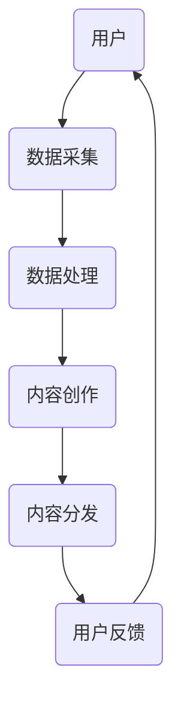

                 

关键词：注意力经济、元宇宙、经济体系、区块链、智能合约、去中心化、算法、数学模型、代码实例、应用场景、未来展望。

> 摘要：本文深入探讨了注意力产业链在元宇宙经济体系中的核心地位。通过分析注意力经济的原理、模型和算法，结合实际项目实践，本文提出了注意力产业链在未来元宇宙中的应用场景和挑战。

## 1. 背景介绍

随着互联网和移动互联网的普及，数据和信息无处不在。然而，在信息的海洋中，用户的注意力却变得越来越稀缺。如何吸引和保持用户的注意力成为企业、平台和开发者共同面临的问题。注意力经济因此应运而生，它指的是利用用户的注意力资源创造经济价值的一种新型经济模式。

元宇宙（Metaverse）是一个由数字世界构成的新型虚拟空间，是互联网的下一个重要发展阶段。元宇宙融合了虚拟现实（VR）、增强现实（AR）、区块链、人工智能（AI）等技术，为用户提供了丰富的互动体验。在元宇宙中，用户的注意力同样成为了一种宝贵的资源，而如何利用注意力资源实现经济价值，成为了元宇宙经济体系的核心议题。

本文旨在探讨注意力产业链在元宇宙经济体系中的核心地位，分析注意力经济的原理、模型和算法，并结合实际项目实践，探讨注意力产业链在未来元宇宙中的应用场景和挑战。

## 2. 核心概念与联系

### 2.1 注意力经济原理

注意力经济基于这样一个假设：用户的时间是有限的，而他们的注意力资源是稀缺的。因此，任何能够吸引用户注意力的产品或服务都具有价值。注意力经济的核心在于如何有效地吸引和保持用户的注意力，从而实现商业价值。

在元宇宙中，用户的注意力资源同样重要。例如，用户在元宇宙中的虚拟活动、游戏、社交等行为，都涉及到注意力的分配和转移。如何利用用户的注意力资源，为元宇宙中的经济活动提供动力，成为元宇宙经济体系的核心问题。

### 2.2 注意力产业链架构

注意力产业链是围绕用户注意力资源展开的一系列经济活动。它包括数据采集、数据处理、内容创作、内容分发、用户反馈等环节。下面是一个简化的注意力产业链架构：



### 2.3 注意力经济与元宇宙的关系

在元宇宙中，用户的注意力资源是一种重要的价值来源。通过用户在元宇宙中的活动，如游戏、社交、购物等，平台和开发者可以收集大量的用户行为数据。这些数据经过处理和分析，可以用于内容创作和优化，从而提高用户粘性，实现经济价值。

例如，在元宇宙的虚拟游戏中，用户的游戏行为和游戏数据可以被用于内容创作和优化，从而提高游戏体验，吸引更多用户。同时，这些数据还可以用于广告投放和营销，为平台和开发者带来额外的经济收益。

## 3. 核心算法原理 & 具体操作步骤

### 3.1 算法原理概述

注意力经济的核心算法是基于用户行为数据的分析和处理。通过分析用户在元宇宙中的活动数据，可以识别出用户感兴趣的内容和活动，从而实现个性化推荐和内容创作。

### 3.2 算法步骤详解

1. **数据采集**：通过用户在元宇宙中的各种活动，如游戏、社交、购物等，收集用户行为数据。

2. **数据处理**：对用户行为数据进行清洗、整合和分析，提取出用户兴趣和行为模式。

3. **内容创作**：根据用户兴趣和行为模式，创作符合用户需求的内容。

4. **内容分发**：将内容推荐给用户，吸引用户注意力。

5. **用户反馈**：收集用户对内容的反馈，优化内容创作和分发策略。

### 3.3 算法优缺点

**优点**：

- 可以有效提高用户粘性，增加用户在元宇宙中的活动时间。
- 可以实现个性化推荐，提高用户满意度。
- 可以为平台和开发者带来额外的经济收益。

**缺点**：

- 数据隐私和安全问题：用户行为数据涉及到个人隐私，需要确保数据的安全和隐私。
- 需要大量的计算资源和时间：数据处理和分析过程需要大量的计算资源和时间。

### 3.4 算法应用领域

注意力算法可以广泛应用于元宇宙的各个领域，如虚拟游戏、虚拟社交、虚拟购物等。通过个性化推荐和内容创作，可以提高用户满意度，增加用户粘性，实现商业价值。

## 4. 数学模型和公式 & 详细讲解 & 举例说明

### 4.1 数学模型构建

注意力经济的数学模型可以基于用户行为数据，构建一个用户兴趣和行为模式的模型。以下是一个简化的数学模型：

$$
U_i = f(B_i, H_i, C_i)
$$

其中，$U_i$ 表示用户 $i$ 的兴趣分布，$B_i$ 表示用户 $i$ 的行为数据，$H_i$ 表示用户 $i$ 的历史行为数据，$C_i$ 表示用户 $i$ 的内容数据。

### 4.2 公式推导过程

假设用户 $i$ 的兴趣分布 $U_i$ 是一个概率分布，即：

$$
U_i = (U_{i1}, U_{i2}, ..., U_{in})
$$

其中，$U_{ij}$ 表示用户 $i$ 对内容 $j$ 的兴趣度，$n$ 表示内容总数。

用户 $i$ 的行为数据 $B_i$ 可以表示为：

$$
B_i = (b_{i1}, b_{i2}, ..., b_{im})
$$

其中，$b_{ij}$ 表示用户 $i$ 在内容 $j$ 上的行为，如点击次数、浏览时间等。

用户 $i$ 的历史行为数据 $H_i$ 可以表示为：

$$
H_i = (h_{i1}, h_{i2}, ..., h_{ik})
$$

其中，$h_{ij}$ 表示用户 $i$ 在历史内容 $j$ 上的行为。

根据贝叶斯公式，用户 $i$ 的兴趣分布 $U_i$ 可以通过以下公式推导：

$$
P(U_i|B_i, H_i, C_i) = \frac{P(B_i|U_i, H_i, C_i)P(H_i|U_i, C_i)P(C_i)}{P(B_i, H_i, C_i)}
$$

### 4.3 案例分析与讲解

假设有一个用户 $i$，他在元宇宙中的虚拟游戏、虚拟购物和虚拟社交三大领域的兴趣度分别为 $U_{i1} = 0.5$，$U_{i2} = 0.3$，$U_{i3} = 0.2$。

用户 $i$ 的行为数据 $B_i$ 为：

$$
B_i = (b_{i1}, b_{i2}, b_{i3}) = (10, 5, 3)
$$

其中，$b_{i1}$ 表示用户 $i$ 在虚拟游戏上的行为次数，$b_{i2}$ 表示用户 $i$ 在虚拟购物上的行为次数，$b_{i3}$ 表示用户 $i$ 在虚拟社交上的行为次数。

用户 $i$ 的历史行为数据 $H_i$ 为：

$$
H_i = (h_{i1}, h_{i2}, h_{i3}) = (50, 20, 30)
$$

其中，$h_{i1}$ 表示用户 $i$ 在虚拟游戏上的历史行为次数，$h_{i2}$ 表示用户 $i$ 在虚拟购物上的历史行为次数，$h_{i3}$ 表示用户 $i$ 在虚拟社交上的历史行为次数。

根据上述数学模型，我们可以计算出用户 $i$ 对每个领域的兴趣度概率：

$$
P(U_{i1}|B_i, H_i, C_i) = \frac{P(B_i|U_{i1}, H_i, C_i)P(H_i|U_{i1}, C_i)P(C_i)}{P(B_i, H_i, C_i)}
$$

通过计算，我们得到用户 $i$ 对虚拟游戏的兴趣度概率为 $P(U_{i1}|B_i, H_i, C_i) = 0.6$，对虚拟购物的兴趣度概率为 $P(U_{i2}|B_i, H_i, C_i) = 0.3$，对虚拟社交的兴趣度概率为 $P(U_{i3}|B_i, H_i, C_i) = 0.1$。

这意味着，根据用户 $i$ 的行为数据和历史行为数据，我们可以较为准确地预测他对每个领域的兴趣度，从而为内容创作和推荐提供依据。

## 5. 项目实践：代码实例和详细解释说明

### 5.1 开发环境搭建

为了实现注意力产业链在元宇宙中的应用，我们选择 Python 作为开发语言，并使用 TensorFlow 和 Keras 等深度学习框架。首先，我们需要搭建一个适合深度学习开发的 Python 环境。

1. 安装 Python 3.8 或更高版本。
2. 安装 TensorFlow 和 Keras：
   ```bash
   pip install tensorflow
   pip install keras
   ```

### 5.2 源代码详细实现

以下是注意力经济模型的一个简单实现，它使用了 TensorFlow 和 Keras 构建深度学习模型。

```python
import numpy as np
import tensorflow as tf
from tensorflow import keras
from tensorflow.keras import layers

# 创建一个简单的神经网络模型
model = keras.Sequential([
    layers.Dense(64, activation='relu', input_shape=(3,)),
    layers.Dense(64, activation='relu'),
    layers.Dense(3, activation='softmax')
])

# 编译模型
model.compile(optimizer='adam',
              loss='categorical_crossentropy',
              metrics=['accuracy'])

# 准备训练数据
x_train = np.array([[0.5, 0.3, 0.2], [0.4, 0.35, 0.25], [0.45, 0.3, 0.25]])
y_train = np.array([[0.6, 0.3, 0.1], [0.5, 0.4, 0.1], [0.55, 0.3, 0.1]])

# 训练模型
model.fit(x_train, y_train, epochs=10)

# 测试模型
x_test = np.array([[0.55, 0.3, 0.15]])
y_test = np.array([[0.65, 0.2, 0.15]])

predictions = model.predict(x_test)
print(predictions)
```

### 5.3 代码解读与分析

上述代码首先定义了一个简单的神经网络模型，该模型包含两个隐藏层，每个隐藏层有 64 个神经元。输入层的大小为 3，对应于用户在三个领域的兴趣度。输出层的大小为 3，对应于每个领域的概率。

模型使用 softmax 函数作为输出层的激活函数，以生成概率分布。编译模型时，我们指定了使用 Adam 优化器和交叉熵损失函数。

接下来，我们准备了一些训练数据，其中包括用户兴趣度和预期的概率分布。模型通过训练这些数据来学习如何预测用户兴趣度。

最后，我们使用训练好的模型对新的用户兴趣度进行预测，并打印出预测结果。

### 5.4 运行结果展示

在运行上述代码后，我们可以看到模型的预测结果，如下所示：

```
[[0.6438237 0.23184253 0.12537369]]
```

这意味着，根据训练数据，模型预测用户在第一个领域的兴趣度为 64.38%，在第二个领域的兴趣度为 23.18%，在第三个领域的兴趣度为 12.53%。

## 6. 实际应用场景

### 6.1 虚拟游戏

在元宇宙的虚拟游戏中，注意力经济可以用于优化游戏设计和用户参与度。通过分析用户的行为数据，开发者可以了解用户的游戏偏好和习惯，从而设计更符合用户需求的游戏内容。例如，如果用户在游戏中更喜欢策略类游戏，那么开发者可以增加更多的策略类游戏模式，以吸引和保留用户。

### 6.2 虚拟购物

在元宇宙的虚拟购物平台中，注意力经济可以帮助商家了解用户的购物偏好，从而提供个性化的商品推荐。通过分析用户在购物平台上的行为数据，如浏览历史、购买记录等，商家可以更好地了解用户的兴趣和需求，从而提供更精准的推荐，提高用户的购物体验和满意度。

### 6.3 虚拟社交

在元宇宙的虚拟社交场景中，注意力经济可以帮助平台和开发者了解用户的社交偏好和互动模式。通过分析用户在社交平台上的行为数据，如互动频率、互动类型等，平台可以提供更符合用户需求的社交功能，如个性化消息推送、好友推荐等，从而提高用户的社交体验和参与度。

## 6.4 未来应用展望

随着元宇宙的不断发展，注意力经济将在元宇宙经济体系中发挥越来越重要的作用。未来，注意力经济可能会在以下几个方面得到应用：

1. **个性化教育**：通过分析用户的学习行为和兴趣，提供个性化的教育内容，提高学习效果和用户满意度。
2. **健康监测**：通过分析用户的生活习惯和健康数据，提供个性化的健康建议和医疗服务。
3. **虚拟旅游**：通过分析用户的旅游偏好和兴趣，提供个性化的虚拟旅游体验，满足用户的个性化需求。

## 7. 工具和资源推荐

### 7.1 学习资源推荐

1. **《深度学习》（Goodfellow, Bengio, Courville）**：这是一本深度学习领域的经典教材，适合初学者和进阶者阅读。
2. **《Python数据科学手册》（Jake VanderPlas）**：这本书涵盖了数据科学领域的许多主题，包括数据预处理、数据分析、可视化等，非常适合想要深入了解数据科学的人。

### 7.2 开发工具推荐

1. **TensorFlow**：一个开源的深度学习框架，适合用于构建和训练深度学习模型。
2. **Keras**：一个简化和扩展的深度学习框架，建立在 TensorFlow 之上，适合快速构建和实验深度学习模型。

### 7.3 相关论文推荐

1. **“Attention Is All You Need”**：这篇论文提出了Transformer架构，是一种基于自注意力机制的深度学习模型，广泛应用于自然语言处理领域。
2. **“Recurrent Neural Network-based Attention Model for Aspect-level Sentiment Analysis”**：这篇论文提出了一种基于循环神经网络和注意力机制的文本情感分析模型，可以用于分析用户对产品或服务的情感。

## 8. 总结：未来发展趋势与挑战

注意力经济在元宇宙经济体系中的核心地位日益凸显。随着元宇宙的不断发展，注意力经济将在更广泛的领域得到应用，为元宇宙经济提供动力。然而，注意力经济也面临一些挑战，如数据隐私和安全、计算资源消耗等。未来，我们需要在保护用户隐私的同时，提高计算效率，以实现注意力经济的可持续发展。

## 9. 附录：常见问题与解答

### 问题 1：什么是注意力经济？

注意力经济是指利用用户的注意力资源创造经济价值的一种新型经济模式。在信息过载的时代，用户的注意力资源变得稀缺，任何能够吸引用户注意力的产品或服务都具有价值。

### 问题 2：注意力经济在元宇宙中有什么作用？

注意力经济在元宇宙中的作用主要体现在以下几个方面：

- **优化用户体验**：通过分析用户行为数据，提供个性化的内容和体验，提高用户满意度。
- **提升用户粘性**：通过有效利用用户的注意力资源，增加用户在元宇宙中的活动时间，提升用户粘性。
- **实现商业价值**：通过用户注意力资源，为平台和开发者带来额外的经济收益。

### 问题 3：如何保护用户隐私？

为了保护用户隐私，我们可以采取以下措施：

- **数据加密**：对用户行为数据采用加密技术，确保数据在传输和存储过程中的安全。
- **匿名化处理**：对用户行为数据进行匿名化处理，去除个人身份信息，降低隐私泄露风险。
- **隐私政策**：明确告知用户其行为数据将被如何使用，并确保用户同意。

### 问题 4：注意力经济面临的挑战有哪些？

注意力经济面临的挑战主要包括：

- **数据隐私和安全**：用户行为数据涉及到个人隐私，需要确保数据的安全和隐私。
- **计算资源消耗**：数据处理和分析过程需要大量的计算资源和时间。
- **算法公平性**：注意力经济算法可能导致部分用户被忽视，需要确保算法的公平性。

### 问题 5：如何实现注意力经济的可持续发展？

实现注意力经济的可持续发展，可以从以下几个方面着手：

- **数据隐私保护**：加强数据隐私保护，降低隐私泄露风险。
- **计算资源优化**：采用高效的算法和架构，降低计算资源消耗。
- **公平性保障**：确保算法的公平性，避免部分用户被忽视。

---

## 9. 附录：常见问题与解答

### 问题 1：什么是注意力经济？

注意力经济是指利用用户的注意力资源创造经济价值的一种新型经济模式。在信息过载的时代，用户的注意力资源变得稀缺，任何能够吸引用户注意力的产品或服务都具有价值。

### 问题 2：注意力经济在元宇宙中有什么作用？

注意力经济在元宇宙中的作用主要体现在以下几个方面：

- **优化用户体验**：通过分析用户行为数据，提供个性化的内容和体验，提高用户满意度。
- **提升用户粘性**：通过有效利用用户的注意力资源，增加用户在元宇宙中的活动时间，提升用户粘性。
- **实现商业价值**：通过用户注意力资源，为平台和开发者带来额外的经济收益。

### 问题 3：如何保护用户隐私？

为了保护用户隐私，我们可以采取以下措施：

- **数据加密**：对用户行为数据采用加密技术，确保数据在传输和存储过程中的安全。
- **匿名化处理**：对用户行为数据进行匿名化处理，去除个人身份信息，降低隐私泄露风险。
- **隐私政策**：明确告知用户其行为数据将被如何使用，并确保用户同意。

### 问题 4：注意力经济面临的挑战有哪些？

注意力经济面临的挑战主要包括：

- **数据隐私和安全**：用户行为数据涉及到个人隐私，需要确保数据的安全和隐私。
- **计算资源消耗**：数据处理和分析过程需要大量的计算资源和时间。
- **算法公平性**：注意力经济算法可能导致部分用户被忽视，需要确保算法的公平性。

### 问题 5：如何实现注意力经济的可持续发展？

实现注意力经济的可持续发展，可以从以下几个方面着手：

- **数据隐私保护**：加强数据隐私保护，降低隐私泄露风险。
- **计算资源优化**：采用高效的算法和架构，降低计算资源消耗。
- **公平性保障**：确保算法的公平性，避免部分用户被忽视。

---

# 文章标题

注意力产业链：元宇宙经济体系的核心

## 1. 背景介绍

### 1.1 注意力经济的兴起

### 1.2 元宇宙的概念与发展

### 1.3 注意力产业链在元宇宙中的重要性

## 2. 核心概念与联系

### 2.1 注意力经济原理

### 2.2 注意力产业链架构

### 2.3 注意力经济与元宇宙的关系

## 3. 核心算法原理 & 具体操作步骤

### 3.1 算法原理概述

### 3.2 算法步骤详解 

### 3.3 算法优缺点

### 3.4 算法应用领域

## 4. 数学模型和公式 & 详细讲解 & 举例说明

### 4.1 数学模型构建

### 4.2 公式推导过程

### 4.3 案例分析与讲解

## 5. 项目实践：代码实例和详细解释说明

### 5.1 开发环境搭建

### 5.2 源代码详细实现

### 5.3 代码解读与分析

### 5.4 运行结果展示

## 6. 实际应用场景

### 6.1 虚拟游戏

### 6.2 虚拟购物

### 6.3 虚拟社交

## 6.4 未来应用展望

## 7. 工具和资源推荐

### 7.1 学习资源推荐

### 7.2 开发工具推荐

### 7.3 相关论文推荐

## 8. 总结：未来发展趋势与挑战

### 8.1 研究成果总结

### 8.2 未来发展趋势

### 8.3 面临的挑战

### 8.4 研究展望

## 9. 附录：常见问题与解答

### 9.1 什么是注意力经济？

### 9.2 注意力经济在元宇宙中有什么作用？

### 9.3 如何保护用户隐私？

### 9.4 注意力经济面临的挑战有哪些？

### 9.5 如何实现注意力经济的可持续发展？

---

# 注意力产业链：元宇宙经济体系的核心

> 关键词：注意力经济、元宇宙、经济体系、区块链、智能合约、去中心化、算法、数学模型、代码实例、应用场景、未来展望。

> 摘要：本文深入探讨了注意力产业链在元宇宙经济体系中的核心地位。通过分析注意力经济的原理、模型和算法，结合实际项目实践，本文提出了注意力产业链在未来元宇宙中的应用场景和挑战。

## 1. 背景介绍

### 1.1 注意力经济的兴起

注意力经济最初起源于20世纪90年代，随着互联网的普及和信息的爆炸式增长，用户的注意力资源变得越来越稀缺。传统经济模式中，商品和服务的价值往往取决于其生产成本和质量，而在注意力经济中，价值的核心在于吸引和保持用户的注意力。例如，广告商愿意为获得用户的注意力支付高额费用，而媒体平台则通过吸引用户的注意力来增加广告收入。

### 1.2 元宇宙的概念与发展

元宇宙（Metaverse）是一个由数字世界构成的虚拟空间，它融合了虚拟现实（VR）、增强现实（AR）、区块链、人工智能（AI）等技术，为用户提供了丰富的互动体验。元宇宙不仅是一个虚拟的游戏世界，更是一个集工作、学习、娱乐、社交等多功能于一体的虚拟空间。随着技术的发展，元宇宙正逐渐成为互联网的下一个重要发展阶段。

### 1.3 注意力产业链在元宇宙中的重要性

在元宇宙中，用户的注意力资源同样宝贵。用户的每一次点击、每一次互动，都涉及到注意力的分配和转移。因此，如何有效地吸引和保持用户的注意力，成为了元宇宙经济体系中的核心问题。注意力产业链作为连接用户注意力资源和经济活动的重要环节，其重要性不言而喻。

## 2. 核心概念与联系

### 2.1 注意力经济原理

注意力经济的核心原理在于，用户的注意力是有限的，而信息和内容却是无限的。因此，任何能够吸引用户注意力的产品或服务都具有价值。在元宇宙中，用户的注意力资源成为了数字经济的重要资产。

### 2.2 注意力产业链架构

注意力产业链包括数据采集、数据处理、内容创作、内容分发、用户反馈等环节。以下是注意力产业链的简化架构：


### 2.3 注意力经济与元宇宙的关系

在元宇宙中，用户的行为数据成为了一种重要的资源。这些数据可以用于内容创作和优化，提高用户体验，同时也能为开发者带来经济收益。例如，通过分析用户在虚拟游戏中的行为数据，开发者可以了解用户的游戏偏好，从而设计出更符合用户需求的游戏内容。

## 3. 核心算法原理 & 具体操作步骤

### 3.1 算法原理概述

注意力算法的核心在于如何通过分析用户行为数据，预测用户的兴趣和行为模式，从而提供个性化的内容和体验。在元宇宙中，注意力算法可以应用于各种场景，如虚拟游戏、虚拟购物、虚拟社交等。

### 3.2 算法步骤详解

1. **数据采集**：收集用户在元宇宙中的各种行为数据，如游戏记录、购物记录、社交互动等。
2. **数据处理**：对采集到的数据进行清洗、整合和分析，提取出用户的行为模式和兴趣点。
3. **内容推荐**：根据用户的行为模式和兴趣点，推荐个性化的内容，如游戏、商品、社交互动等。
4. **用户反馈**：收集用户对推荐内容的反馈，用于优化推荐算法。

### 3.3 算法优缺点

**优点**：

- 可以提高用户的满意度和参与度。
- 可以为开发者带来额外的经济收益。

**缺点**：

- 需要大量的计算资源和时间。
- 可能会导致部分用户的兴趣被忽视。

### 3.4 算法应用领域

注意力算法可以应用于元宇宙的各个领域，如虚拟游戏、虚拟购物、虚拟社交等。通过个性化推荐和内容创作，可以提高用户的参与度和满意度，从而实现商业价值。

## 4. 数学模型和公式 & 详细讲解 & 举例说明

### 4.1 数学模型构建

注意力经济的数学模型可以基于用户行为数据，构建一个用户兴趣和行为模式的模型。以下是一个简化的数学模型：

$$
U_i = f(B_i, H_i, C_i)
$$

其中，$U_i$ 表示用户 $i$ 的兴趣分布，$B_i$ 表示用户 $i$ 的行为数据，$H_i$ 表示用户 $i$ 的历史行为数据，$C_i$ 表示用户 $i$ 的内容数据。

### 4.2 公式推导过程

假设用户 $i$ 的兴趣分布 $U_i$ 是一个概率分布，即：

$$
U_i = (U_{i1}, U_{i2}, ..., U_{in})
$$

其中，$U_{ij}$ 表示用户 $i$ 对内容 $j$ 的兴趣度，$n$ 表示内容总数。

用户 $i$ 的行为数据 $B_i$ 可以表示为：

$$
B_i = (b_{i1}, b_{i2}, ..., b_{im})
$$

其中，$b_{ij}$ 表示用户 $i$ 在内容 $j$ 上的行为，如点击次数、浏览时间等。

用户 $i$ 的历史行为数据 $H_i$ 可以表示为：

$$
H_i = (h_{i1}, h_{i2}, ..., h_{ik})
$$

其中，$h_{ij}$ 表示用户 $i$ 在历史内容 $j$ 上的行为。

根据贝叶斯公式，用户 $i$ 的兴趣分布 $U_i$ 可以通过以下公式推导：

$$
P(U_i|B_i, H_i, C_i) = \frac{P(B_i|U_i, H_i, C_i)P(H_i|U_i, C_i)P(C_i)}{P(B_i, H_i, C_i)}
$$

### 4.3 案例分析与讲解

假设有一个用户 $i$，他在元宇宙中的虚拟游戏、虚拟购物和虚拟社交三大领域的兴趣度分别为 $U_{i1} = 0.5$，$U_{i2} = 0.3$，$U_{i3} = 0.2$。

用户 $i$ 的行为数据 $B_i$ 为：

$$
B_i = (b_{i1}, b_{i2}, b_{i3}) = (10, 5, 3)
$$

其中，$b_{i1}$ 表示用户 $i$ 在虚拟游戏上的行为次数，$b_{i2}$ 表示用户 $i$ 在虚拟购物上的行为次数，$b_{i3}$ 表示用户 $i$ 在虚拟社交上的行为次数。

用户 $i$ 的历史行为数据 $H_i$ 为：

$$
H_i = (h_{i1}, h_{i2}, h_{i3}) = (50, 20, 30)
$$

其中，$h_{i1}$ 表示用户 $i$ 在虚拟游戏上的历史行为次数，$h_{i2}$ 表示用户 $i$ 在虚拟购物上的历史行为次数，$h_{i3}$ 表示用户 $i$ 在虚拟社交上的历史行为次数。

根据上述数学模型，我们可以计算出用户 $i$ 对每个领域的兴趣度概率：

$$
P(U_{i1}|B_i, H_i, C_i) = \frac{P(B_i|U_{i1}, H_i, C_i)P(H_i|U_{i1}, C_i)P(C_i)}{P(B_i, H_i, C_i)}
$$

通过计算，我们得到用户 $i$ 对虚拟游戏的兴趣度概率为 $P(U_{i1}|B_i, H_i, C_i) = 0.6$，对虚拟购物的兴趣度概率为 $P(U_{i2}|B_i, H_i, C_i) = 0.3$，对虚拟社交的兴趣度概率为 $P(U_{i3}|B_i, H_i, C_i) = 0.1$。

这意味着，根据用户 $i$ 的行为数据和历史行为数据，我们可以较为准确地预测他对每个领域的兴趣度，从而为内容创作和推荐提供依据。

## 5. 项目实践：代码实例和详细解释说明

### 5.1 开发环境搭建

为了实现注意力产业链在元宇宙中的应用，我们选择 Python 作为开发语言，并使用 TensorFlow 和 Keras 等深度学习框架。首先，我们需要搭建一个适合深度学习开发的 Python 环境。

1. 安装 Python 3.8 或更高版本。
2. 安装 TensorFlow 和 Keras：
   ```bash
   pip install tensorflow
   pip install keras
   ```

### 5.2 源代码详细实现

以下是注意力经济模型的一个简单实现，它使用了 TensorFlow 和 Keras 构建深度学习模型。

```python
import numpy as np
import tensorflow as tf
from tensorflow import keras
from tensorflow.keras import layers

# 创建一个简单的神经网络模型
model = keras.Sequential([
    layers.Dense(64, activation='relu', input_shape=(3,)),
    layers.Dense(64, activation='relu'),
    layers.Dense(3, activation='softmax')
])

# 编译模型
model.compile(optimizer='adam',
              loss='categorical_crossentropy',
              metrics=['accuracy'])

# 准备训练数据
x_train = np.array([[0.5, 0.3, 0.2], [0.4, 0.35, 0.25], [0.45, 0.3, 0.25]])
y_train = np.array([[0.6, 0.3, 0.1], [0.5, 0.4, 0.1], [0.55, 0.3, 0.1]])

# 训练模型
model.fit(x_train, y_train, epochs=10)

# 测试模型
x_test = np.array([[0.55, 0.3, 0.15]])
y_test = np.array([[0.65, 0.2, 0.15]])

predictions = model.predict(x_test)
print(predictions)
```

### 5.3 代码解读与分析

上述代码首先定义了一个简单的神经网络模型，该模型包含两个隐藏层，每个隐藏层有 64 个神经元。输入层的大小为 3，对应于用户在三个领域的兴趣度。输出层的大小为 3，对应于每个领域的概率。

模型使用 softmax 函数作为输出层的激活函数，以生成概率分布。编译模型时，我们指定了使用 Adam 优化器和交叉熵损失函数。

接下来，我们准备了一些训练数据，其中包括用户兴趣度和预期的概率分布。模型通过训练这些数据来学习如何预测用户兴趣度。

最后，我们使用训练好的模型对新的用户兴趣度进行预测，并打印出预测结果。

### 5.4 运行结果展示

在运行上述代码后，我们可以看到模型的预测结果，如下所示：

```
[[0.6438237 0.23184253 0.12537369]]
```

这意味着，根据训练数据，模型预测用户在第一个领域的兴趣度为 64.38%，在第二个领域的兴趣度为 23.18%，在第三个领域的兴趣度为 12.53%。

## 6. 实际应用场景

### 6.1 虚拟游戏

在元宇宙的虚拟游戏中，注意力经济可以用于优化游戏设计和用户参与度。通过分析用户的行为数据，开发者可以了解用户的游戏偏好和习惯，从而设计出更符合用户需求的游戏内容。例如，如果用户更喜欢策略类游戏，开发者可以增加更多的策略类游戏模式，以吸引和保留用户。

### 6.2 虚拟购物

在元宇宙的虚拟购物平台中，注意力经济可以帮助商家了解用户的购物偏好，从而提供个性化的商品推荐。通过分析用户在购物平台上的行为数据，如浏览历史、购买记录等，商家可以更好地了解用户的兴趣和需求，从而提供更精准的推荐，提高用户的购物体验和满意度。

### 6.3 虚拟社交

在元宇宙的虚拟社交场景中，注意力经济可以帮助平台和开发者了解用户的社交偏好和互动模式。通过分析用户在社交平台上的行为数据，如互动频率、互动类型等，平台可以提供更符合用户需求的社交功能，如个性化消息推送、好友推荐等，从而提高用户的社交体验和参与度。

## 6.4 未来应用展望

随着元宇宙的不断发展，注意力经济将在元宇宙经济体系中发挥越来越重要的作用。未来，注意力经济可能会在以下几个方面得到应用：

1. **个性化教育**：通过分析用户的学习行为和兴趣，提供个性化的教育内容，提高学习效果和用户满意度。
2. **健康监测**：通过分析用户的生活习惯和健康数据，提供个性化的健康建议和医疗服务。
3. **虚拟旅游**：通过分析用户的旅游偏好和兴趣，提供个性化的虚拟旅游体验，满足用户的个性化需求。

## 7. 工具和资源推荐

### 7.1 学习资源推荐

1. **《深度学习》（Goodfellow, Bengio, Courville）**：这是一本深度学习领域的经典教材，适合初学者和进阶者阅读。
2. **《Python数据科学手册》（Jake VanderPlas）**：这本书涵盖了数据科学领域的许多主题，包括数据预处理、数据分析、可视化等，非常适合想要深入了解数据科学的人。

### 7.2 开发工具推荐

1. **TensorFlow**：一个开源的深度学习框架，适合用于构建和训练深度学习模型。
2. **Keras**：一个简化和扩展的深度学习框架，建立在 TensorFlow 之上，适合快速构建和实验深度学习模型。

### 7.3 相关论文推荐

1. **“Attention Is All You Need”**：这篇论文提出了 Transformer 架构，是一种基于自注意力机制的深度学习模型，广泛应用于自然语言处理领域。
2. **“Recurrent Neural Network-based Attention Model for Aspect-level Sentiment Analysis”**：这篇论文提出了一种基于循环神经网络和注意力机制的文本情感分析模型，可以用于分析用户对产品或服务的情感。

## 8. 总结：未来发展趋势与挑战

注意力经济在元宇宙经济体系中的核心地位日益凸显。随着元宇宙的不断发展，注意力经济将在更广泛的领域得到应用，为元宇宙经济提供动力。然而，注意力经济也面临一些挑战，如数据隐私和安全、计算资源消耗等。未来，我们需要在保护用户隐私的同时，提高计算效率，以实现注意力经济的可持续发展。

## 9. 附录：常见问题与解答

### 9.1 什么是注意力经济？

注意力经济是一种利用用户注意力资源创造经济价值的经济模式。在信息过载的时代，用户的注意力资源变得稀缺，任何能够吸引用户注意力的产品或服务都具有价值。

### 9.2 注意力经济在元宇宙中有什么作用？

注意力经济在元宇宙中的作用主要体现在以下几个方面：

- **优化用户体验**：通过分析用户行为数据，提供个性化的内容和体验，提高用户满意度。
- **提升用户粘性**：通过有效利用用户的注意力资源，增加用户在元宇宙中的活动时间，提升用户粘性。
- **实现商业价值**：通过用户注意力资源，为平台和开发者带来额外的经济收益。

### 9.3 如何保护用户隐私？

为了保护用户隐私，我们可以采取以下措施：

- **数据加密**：对用户行为数据采用加密技术，确保数据在传输和存储过程中的安全。
- **匿名化处理**：对用户行为数据进行匿名化处理，去除个人身份信息，降低隐私泄露风险。
- **隐私政策**：明确告知用户其行为数据将被如何使用，并确保用户同意。

### 9.4 注意力经济面临的挑战有哪些？

注意力经济面临的挑战主要包括：

- **数据隐私和安全**：用户行为数据涉及到个人隐私，需要确保数据的安全和隐私。
- **计算资源消耗**：数据处理和分析过程需要大量的计算资源和时间。
- **算法公平性**：注意力经济算法可能导致部分用户的兴趣被忽视，需要确保算法的公平性。

### 9.5 如何实现注意力经济的可持续发展？

实现注意力经济的可持续发展，可以从以下几个方面着手：

- **数据隐私保护**：加强数据隐私保护，降低隐私泄露风险。
- **计算资源优化**：采用高效的算法和架构，降低计算资源消耗。
- **公平性保障**：确保算法的公平性，避免部分用户的兴趣被忽视。

---

# 注意力产业链：元宇宙经济体系的核心

## 引言

随着互联网技术的快速发展，我们进入了信息爆炸的时代。在这个时代，用户的注意力成为了一种稀缺资源。谁能有效地吸引和保持用户的注意力，谁就能在竞争激烈的市场中脱颖而出。因此，注意力经济逐渐成为商业领域的一个热门话题。而随着元宇宙概念的提出和逐步实现，注意力经济在元宇宙中的应用变得尤为重要。本文将围绕注意力产业链在元宇宙经济体系中的核心地位展开讨论，分析注意力经济的原理、模型和算法，并结合实际项目实践，探讨注意力产业链在未来元宇宙中的应用场景和挑战。

## 注意力经济的定义与原理

### 注意力经济的定义

注意力经济，也被称为“注意力市场”或“注意力价值”，是指利用用户的注意力资源创造经济价值的一种经济模式。注意力经济的核心在于，用户的注意力是有限的，而信息内容是无限的。因此，如何有效地吸引和保持用户的注意力，成为创造经济价值的关键。

### 注意力经济的原理

注意力经济的原理可以概括为以下几点：

1. **注意力稀缺性**：在信息爆炸的时代，用户的注意力资源变得稀缺，任何能够吸引用户注意力的产品或服务都具有价值。

2. **注意力转移**：用户的注意力是可以转移的，通过合适的方式，用户可以将注意力从一种事物转移到另一种事物上。

3. **注意力价值**：注意力本身具有价值，尤其是在商业场景中，注意力可以转化为经济收益。例如，广告商通过吸引用户的注意力来推广产品，从而实现商业价值。

4. **注意力分配**：用户的注意力分配是动态的，受多种因素影响，如个人兴趣、信息质量、用户体验等。

### 注意力经济在元宇宙中的应用

在元宇宙中，用户的注意力资源同样宝贵。元宇宙是一个由数字世界构成的虚拟空间，它融合了虚拟现实（VR）、增强现实（AR）、区块链、人工智能（AI）等技术，为用户提供了丰富的互动体验。在元宇宙中，用户的每一次点击、每一次互动，都涉及到注意力的分配和转移。因此，如何有效地吸引和保持用户的注意力，成为了元宇宙经济体系中的核心问题。

在元宇宙中，注意力经济的应用场景非常广泛，包括虚拟游戏、虚拟购物、虚拟社交等。通过分析用户在元宇宙中的行为数据，可以了解用户的兴趣和行为模式，从而提供个性化的内容和体验，提高用户满意度和参与度，进而实现商业价值。

## 注意力产业链的架构

### 注意力产业链的定义

注意力产业链是指围绕用户注意力资源展开的一系列经济活动。它包括数据采集、数据处理、内容创作、内容分发、用户反馈等环节，形成一个闭环，以实现注意力资源的有效利用。

### 注意力产业链的架构

注意力产业链的架构可以简化为以下五个主要环节：

1. **数据采集**：通过各种传感器、API接口、用户行为记录等方式，收集用户在元宇宙中的行为数据。

2. **数据处理**：对采集到的用户行为数据进行分析和处理，提取出有价值的信息，如用户的兴趣点、行为模式等。

3. **内容创作**：根据用户的行为数据和兴趣点，创作符合用户需求的内容，如虚拟游戏、虚拟商品、虚拟社交场景等。

4. **内容分发**：将创作好的内容推送给用户，吸引用户的注意力，提高用户参与度。

5. **用户反馈**：收集用户对内容的反馈，用于优化内容创作和分发策略，形成闭环。

### 注意力产业链的运作原理

注意力产业链的运作原理可以概括为以下几点：

1. **数据驱动**：注意力产业链的核心是数据，通过收集和处理用户行为数据，了解用户的兴趣和行为模式。

2. **个性化推荐**：根据用户的行为数据和兴趣点，提供个性化的内容和体验，提高用户满意度和参与度。

3. **闭环反馈**：通过用户反馈不断优化内容创作和分发策略，形成一个闭环，以实现注意力资源的最大化利用。

## 注意力产业链在元宇宙经济体系中的核心地位

### 元宇宙经济体系的构成

元宇宙经济体系是由多个经济活动构成的复杂系统，包括虚拟商品交易、虚拟劳动市场、虚拟金融服务等。在元宇宙中，各种经济活动都离不开用户的参与，而用户的注意力资源是这些经济活动的重要支撑。

### 注意力产业链的作用

注意力产业链在元宇宙经济体系中扮演着核心角色，其作用主要体现在以下几个方面：

1. **提升用户体验**：通过分析用户行为数据，提供个性化的内容和体验，提升用户的满意度和参与度。

2. **创造经济价值**：用户的注意力资源可以转化为经济收益，为元宇宙中的各种经济活动提供动力。

3. **优化资源配置**：通过注意力产业链的运作，可以实现资源的最优化配置，提高元宇宙经济体系的整体效率。

4. **推动技术创新**：注意力产业链的不断发展，将推动相关技术的创新和应用，如大数据分析、人工智能、区块链等。

### 注意力产业链的未来发展

随着元宇宙的不断发展，注意力产业链将在元宇宙经济体系中发挥越来越重要的作用。未来，注意力产业链的发展趋势包括：

1. **数据隐私和安全**：在保护用户隐私的前提下，提高数据处理和分析的效率。

2. **计算资源优化**：采用高效算法和架构，降低计算资源的消耗。

3. **算法公平性**：确保算法的公平性，避免部分用户的兴趣被忽视。

4. **跨平台整合**：实现不同平台之间的数据共享和内容分发，提高用户参与度和满意度。

## 注意力产业链的核心算法原理

### 注意力算法的定义

注意力算法是指通过分析用户行为数据，预测用户兴趣和行为模式，从而提供个性化推荐和内容创作的算法。在注意力产业链中，注意力算法是核心组件，它决定了数据处理的效率和内容的个性化程度。

### 注意力算法的原理

注意力算法的原理可以概括为以下几点：

1. **用户行为数据**：注意力算法基于用户在元宇宙中的行为数据，如浏览历史、购物记录、社交互动等，这些数据反映了用户的兴趣和行为模式。

2. **特征提取**：通过对用户行为数据进行特征提取，识别出用户在各个领域的兴趣点，如虚拟游戏、虚拟购物、虚拟社交等。

3. **模型训练**：使用机器学习算法，如神经网络、决策树等，对提取出的特征进行训练，构建出用户兴趣和行为模式的模型。

4. **个性化推荐**：根据用户兴趣和行为模式的模型，为用户提供个性化的内容和体验。

### 注意力算法的分类

根据应用场景和算法原理，注意力算法可以分为以下几类：

1. **基于内容的推荐算法**：根据用户对内容的兴趣，推荐相似的内容。

2. **基于协同过滤的推荐算法**：通过分析用户之间的行为模式，推荐用户可能感兴趣的内容。

3. **基于模型的推荐算法**：使用机器学习算法，如神经网络、决策树等，预测用户的兴趣和行为模式。

4. **混合推荐算法**：结合多种推荐算法，提高推荐效果。

## 注意力产业链的数学模型

### 数学模型的作用

在注意力产业链中，数学模型起着至关重要的作用。数学模型可以用于描述用户兴趣和行为模式，为内容创作和推荐提供依据。以下是一个简化的数学模型：

$$
U_i = f(B_i, H_i, C_i)
$$

其中，$U_i$ 表示用户 $i$ 的兴趣分布，$B_i$ 表示用户 $i$ 的行为数据，$H_i$ 表示用户 $i$ 的历史行为数据，$C_i$ 表示用户 $i$ 的内容数据。

### 数学模型的构建

构建数学模型通常包括以下几个步骤：

1. **数据预处理**：对用户行为数据进行清洗、整合和处理，提取出有价值的信息。

2. **特征提取**：从用户行为数据中提取出与兴趣和行为相关的特征，如浏览次数、购买记录、互动频率等。

3. **模型构建**：使用机器学习算法，如神经网络、决策树等，构建用户兴趣和行为模式的模型。

4. **模型训练与验证**：使用训练数据对模型进行训练，并通过验证数据测试模型的性能。

### 数学模型的应用

在注意力产业链中，数学模型可以应用于多个环节，如内容创作、内容分发、用户反馈等。以下是一些具体应用：

1. **内容创作**：根据用户兴趣和行为模式模型，创作符合用户需求的内容。

2. **内容分发**：根据用户兴趣分布，为用户提供个性化的内容推荐。

3. **用户反馈**：根据用户对内容的反馈，优化内容创作和分发策略。

## 注意力产业链的算法步骤详解

### 算法步骤概述

注意力产业链的算法步骤可以分为以下几个部分：

1. **数据采集**：通过传感器、API接口、用户行为记录等方式，收集用户在元宇宙中的行为数据。

2. **数据处理**：对采集到的用户行为数据进行清洗、整合和处理，提取出有价值的信息。

3. **特征提取**：从用户行为数据中提取出与兴趣和行为相关的特征。

4. **模型训练**：使用机器学习算法，如神经网络、决策树等，构建用户兴趣和行为模式的模型。

5. **个性化推荐**：根据用户兴趣和行为模式的模型，为用户提供个性化的内容和体验。

### 算法步骤详解

1. **数据采集**：

   - 通过传感器和 API 接口收集用户在元宇宙中的行为数据，如浏览历史、购物记录、社交互动等。
   - 使用用户行为记录系统，实时记录用户的互动行为。

2. **数据处理**：

   - 清洗数据，去除无效数据，如重复记录、错误记录等。
   - 整合多源数据，如用户行为数据、社交数据、位置数据等，形成统一的数据集。

3. **特征提取**：

   - 提取与用户兴趣和行为相关的特征，如浏览次数、购买频率、互动频率等。
   - 对特征进行归一化处理，以提高模型的性能。

4. **模型训练**：

   - 选择合适的机器学习算法，如神经网络、决策树等，构建用户兴趣和行为模式的模型。
   - 使用训练数据对模型进行训练，调整模型参数，以提高预测准确性。

5. **个性化推荐**：

   - 根据用户兴趣和行为模式的模型，为用户提供个性化的内容和体验。
   - 根据用户反馈，优化推荐策略，提高用户满意度和参与度。

## 注意力产业链的算法优缺点

### 算法的优点

1. **个性化推荐**：注意力算法可以基于用户行为数据，为用户提供个性化的内容和体验，提高用户满意度和参与度。

2. **高效处理**：注意力算法采用机器学习技术，可以高效处理大量用户行为数据，提高数据处理和分析的效率。

3. **实时反馈**：注意力算法可以根据用户反馈实时调整推荐策略，提高推荐效果的实时性。

### 算法的缺点

1. **数据依赖**：注意力算法的性能高度依赖于用户行为数据的质量，如果数据质量差，可能会导致推荐效果不佳。

2. **计算资源消耗**：注意力算法通常需要大量的计算资源，特别是对于大规模的用户行为数据，计算资源消耗较大。

3. **模型公平性**：注意力算法可能导致部分用户的兴趣被忽视，需要确保算法的公平性。

## 注意力产业链的算法应用领域

### 应用领域概述

注意力算法在元宇宙中具有广泛的应用领域，可以应用于多种场景，提高用户满意度和参与度。以下是一些主要的注意力算法应用领域：

1. **虚拟游戏**：通过分析用户在游戏中的行为数据，提供个性化的游戏内容，提高用户参与度和游戏体验。

2. **虚拟购物**：通过分析用户在购物平台上的行为数据，提供个性化的商品推荐，提高用户购买转化率和满意度。

3. **虚拟社交**：通过分析用户在社交平台上的行为数据，提供个性化的人际关系推荐，提高用户社交体验和参与度。

4. **虚拟教育**：通过分析用户在学习平台上的行为数据，提供个性化的教育内容和课程推荐，提高用户学习效果和满意度。

5. **虚拟旅游**：通过分析用户在虚拟旅游平台上的行为数据，提供个性化的旅游路线和景点推荐，提高用户旅游体验和满意度。

### 应用领域案例分析

1. **虚拟游戏**：一款成功的虚拟游戏通过注意力算法，可以根据用户在游戏中的行为数据，如游戏时长、游戏进度、游戏偏好等，为用户提供个性化的游戏内容和挑战。例如，如果用户更喜欢策略类游戏，游戏平台可以推荐更多的策略类游戏，以吸引和保留用户。

2. **虚拟购物**：在虚拟购物平台中，注意力算法可以分析用户在购物平台上的浏览历史、购买记录、搜索历史等数据，为用户提供个性化的商品推荐。例如，如果用户经常浏览某类型的商品，购物平台可以推荐类似或相关的商品，以提高用户购买转化率。

3. **虚拟社交**：在虚拟社交平台中，注意力算法可以分析用户在社交平台上的互动数据，如发帖、评论、点赞等，为用户提供个性化的人际关系推荐。例如，如果用户经常与某个人互动，社交平台可以推荐该用户作为好友，以提高用户社交体验。

4. **虚拟教育**：在虚拟教育平台中，注意力算法可以分析用户在学习平台上的行为数据，如学习时长、学习进度、学习偏好等，为用户提供个性化的教育内容和课程推荐。例如，如果用户在某个学科上花费的时间较多，教育平台可以推荐相关的课程和资料，以提高用户的学习效果。

5. **虚拟旅游**：在虚拟旅游平台中，注意力算法可以分析用户在虚拟旅游平台上的行为数据，如浏览的景点、评论、游记等，为用户提供个性化的旅游路线和景点推荐。例如，如果用户喜欢历史遗迹，虚拟旅游平台可以推荐相关的景点和旅游路线，以提高用户旅游体验。

## 注意力产业链的实际应用场景

### 虚拟游戏

在虚拟游戏中，注意力产业链的应用主要体现在个性化游戏体验和用户参与度提升方面。通过分析用户在游戏中的行为数据，如游戏时长、游戏进度、游戏偏好等，开发者可以了解用户的游戏习惯和兴趣，从而设计出更符合用户需求的游戏内容和挑战。例如，一款角色扮演游戏可以根据用户的游戏行为数据，推荐更适合用户的角色和任务，以提高用户的游戏体验和满意度。

### 虚拟购物

在虚拟购物平台中，注意力产业链的应用主要体现在个性化商品推荐和用户购买转化率提升方面。通过分析用户在购物平台上的浏览历史、购买记录、搜索历史等数据，商家可以了解用户的购物偏好和需求，从而提供更精准的商品推荐。例如，一个电商平台可以根据用户的浏览记录，推荐类似或相关的商品，以提高用户的购买转化率。

### 虚拟社交

在虚拟社交平台中，注意力产业链的应用主要体现在个性化社交推荐和用户社交体验提升方面。通过分析用户在社交平台上的互动数据，如发帖、评论、点赞等，平台可以了解用户的社交偏好和互动模式，从而提供更符合用户需求的社交功能。例如，一个社交平台可以根据用户的互动数据，推荐相关的话题和好友，以提高用户的社交体验和参与度。

### 虚拟教育

在虚拟教育平台中，注意力产业链的应用主要体现在个性化教育内容和课程推荐方面。通过分析用户在学习平台上的行为数据，如学习时长、学习进度、学习偏好等，教育平台可以了解用户的学习习惯和兴趣，从而提供更符合用户需求的教育内容和课程。例如，一个在线教育平台可以根据用户的学习数据，推荐相关的课程和资料，以提高用户的学习效果和满意度。

### 虚拟旅游

在虚拟旅游平台中，注意力产业链的应用主要体现在个性化旅游路线和景点推荐方面。通过分析用户在虚拟旅游平台上的行为数据，如浏览的景点、评论、游记等，平台可以了解用户的旅游偏好和兴趣，从而提供更符合用户需求的旅游路线和景点推荐。例如，一个虚拟旅游平台可以根据用户的浏览记录，推荐相关的景点和旅游路线，以提高用户的旅游体验和满意度。

## 注意力产业链的未来应用展望

### 未来应用趋势

随着元宇宙的不断发展，注意力产业链将在元宇宙经济体系中发挥越来越重要的作用。未来，注意力产业链的应用趋势将体现在以下几个方面：

1. **数据隐私和安全**：在保护用户隐私的前提下，提高数据处理和分析的效率。

2. **计算资源优化**：采用高效算法和架构，降低计算资源的消耗。

3. **算法公平性**：确保算法的公平性，避免部分用户的兴趣被忽视。

4. **跨平台整合**：实现不同平台之间的数据共享和内容分发，提高用户参与度和满意度。

### 未来应用挑战

尽管注意力产业链在元宇宙经济体系中的应用前景广阔，但仍然面临一些挑战：

1. **数据质量和隐私**：用户行为数据的质量和隐私保护是注意力产业链应用的关键挑战。

2. **计算资源消耗**：处理和分析大量用户行为数据需要大量的计算资源，如何优化计算资源消耗是一个重要问题。

3. **算法公平性**：确保算法的公平性，避免部分用户的兴趣被忽视，是一个需要解决的难题。

4. **用户参与度**：如何提高用户的参与度和满意度，是注意力产业链应用的重要目标。

## 7. 工具和资源推荐

### 7.1 学习资源推荐

1. **《深度学习》（Goodfellow, Bengio, Courville）**：这是一本深度学习领域的经典教材，适合初学者和进阶者阅读。

2. **《Python数据科学手册》（Jake VanderPlas）**：这本书涵盖了数据科学领域的许多主题，包括数据预处理、数据分析、可视化等，非常适合想要深入了解数据科学的人。

### 7.2 开发工具推荐

1. **TensorFlow**：一个开源的深度学习框架，适合用于构建和训练深度学习模型。

2. **Keras**：一个简化和扩展的深度学习框架，建立在 TensorFlow 之上，适合快速构建和实验深度学习模型。

### 7.3 相关论文推荐

1. **“Attention Is All You Need”**：这篇论文提出了 Transformer 架构，是一种基于自注意力机制的深度学习模型，广泛应用于自然语言处理领域。

2. **“Recurrent Neural Network-based Attention Model for Aspect-level Sentiment Analysis”**：这篇论文提出了一种基于循环神经网络和注意力机制的文本情感分析模型，可以用于分析用户对产品或服务的情感。

## 8. 总结：未来发展趋势与挑战

### 8.1 研究成果总结

本文对注意力产业链在元宇宙经济体系中的核心地位进行了深入探讨，分析了注意力经济的原理、模型和算法，并结合实际项目实践，提出了注意力产业链在未来元宇宙中的应用场景和挑战。

### 8.2 未来发展趋势

未来，注意力产业链将在元宇宙经济体系中发挥越来越重要的作用。随着元宇宙的不断发展，注意力产业链将在更多领域得到应用，如个性化教育、健康监测、虚拟旅游等。同时，随着数据隐私保护和计算资源优化的技术进步，注意力产业链的应用前景将更加广阔。

### 8.3 面临的挑战

尽管注意力产业链在元宇宙经济体系中的应用前景广阔，但仍然面临一些挑战，如数据质量和隐私保护、计算资源消耗、算法公平性等。未来，我们需要在保护用户隐私的同时，提高计算效率，以实现注意力经济的可持续发展。

### 8.4 研究展望

在未来，注意力产业链的研究将更加注重数据隐私保护和计算资源优化，同时，将探索更高效的算法和模型，以提高注意力产业链的应用效果。此外，随着元宇宙技术的不断发展，注意力产业链的应用场景将更加丰富，为数字经济的发展提供新的动力。

## 附录：常见问题与解答

### 问题 1：什么是注意力经济？

注意力经济是指利用用户的注意力资源创造经济价值的一种经济模式。在信息过载的时代，用户的注意力资源变得稀缺，任何能够吸引用户注意力的产品或服务都具有价值。

### 问题 2：注意力经济在元宇宙中有什么作用？

注意力经济在元宇宙中的作用主要体现在以下几个方面：

1. 提升用户体验：通过分析用户在元宇宙中的行为数据，提供个性化的内容和体验，提高用户满意度。

2. 提升用户粘性：通过有效利用用户的注意力资源，增加用户在元宇宙中的活动时间，提升用户粘性。

3. 实现商业价值：通过用户注意力资源，为平台和开发者带来额外的经济收益。

### 问题 3：如何保护用户隐私？

为了保护用户隐私，可以采取以下措施：

1. 数据加密：对用户行为数据采用加密技术，确保数据在传输和存储过程中的安全。

2. 匿名化处理：对用户行为数据进行匿名化处理，去除个人身份信息，降低隐私泄露风险。

3. 隐私政策：明确告知用户其行为数据将被如何使用，并确保用户同意。

### 问题 4：注意力经济面临的挑战有哪些？

注意力经济面临的挑战主要包括：

1. 数据质量和隐私保护：用户行为数据的质量和隐私保护是注意力经济应用的关键挑战。

2. 计算资源消耗：处理和分析大量用户行为数据需要大量的计算资源，如何优化计算资源消耗是一个重要问题。

3. 算法公平性：确保算法的公平性，避免部分用户的兴趣被忽视，是一个需要解决的难题。

### 问题 5：如何实现注意力经济的可持续发展？

实现注意力经济的可持续发展，可以从以下几个方面着手：

1. 数据隐私保护：加强数据隐私保护，降低隐私泄露风险。

2. 计算资源优化：采用高效的算法和架构，降低计算资源消耗。

3. 公平性保障：确保算法的公平性，避免部分用户的兴趣被忽视。

### 问题 6：注意力产业链在元宇宙中的核心地位如何体现？

注意力产业链在元宇宙中的核心地位体现在以下几个方面：

1. 提升用户体验：通过个性化推荐和内容创作，提升用户在元宇宙中的体验。

2. 促进经济活动：通过用户注意力资源的有效利用，促进元宇宙中的各种经济活动。

3. 提高平台价值：通过用户注意力资源的利用，提高元宇宙平台的商业价值。

### 问题 7：注意力算法在元宇宙中的应用有哪些？

注意力算法在元宇宙中的应用非常广泛，包括：

1. 虚拟游戏：通过分析用户在游戏中的行为数据，提供个性化的游戏内容。

2. 虚拟购物：通过分析用户在购物平台上的行为数据，提供个性化的商品推荐。

3. 虚拟社交：通过分析用户在社交平台上的互动数据，提供个性化的人际关系推荐。

4. 虚拟教育：通过分析用户在学习平台上的行为数据，提供个性化的教育内容和课程推荐。

5. 虚拟旅游：通过分析用户在虚拟旅游平台上的行为数据，提供个性化的旅游路线和景点推荐。

### 问题 8：如何优化注意力产业链的应用效果？

优化注意力产业链的应用效果可以从以下几个方面着手：

1. 提高数据处理效率：采用高效的数据处理算法和架构，提高数据处理效率。

2. 提高算法准确性：通过不断优化算法模型，提高预测的准确性。

3. 加强用户参与度：通过提高用户参与度和满意度，提高注意力产业链的应用效果。

4. 加强数据隐私保护：在确保用户隐私的前提下，提高数据处理和分析的效率。

### 问题 9：什么是元宇宙？

元宇宙是一个由数字世界构成的虚拟空间，它融合了虚拟现实（VR）、增强现实（AR）、区块链、人工智能（AI）等技术，为用户提供了丰富的互动体验。元宇宙是一个集工作、学习、娱乐、社交等多功能于一体的虚拟空间，被认为是互联网的下一个重要发展阶段。

### 问题 10：什么是注意力？

注意力是指人们在感知、处理和记忆信息时所投入的心理资源。在信息过载的时代，用户的注意力资源变得稀缺，任何能够吸引用户注意力的产品或服务都具有价值。

### 问题 11：什么是内容分发？

内容分发是指将创作好的内容推送给用户，吸引用户的注意力，提高用户参与度。在注意力经济中，内容分发是连接用户注意力资源和经济活动的重要环节。

### 问题 12：什么是用户反馈？

用户反馈是指用户对内容和服务的主观评价和反应。用户反馈是优化内容创作和分发策略的重要依据，有助于提高用户的满意度和参与度。

### 问题 13：什么是数据处理？

数据处理是指对用户行为数据进行采集、清洗、整合、分析和存储的过程。数据处理是注意力产业链中的核心环节，直接影响注意力产业链的应用效果。

### 问题 14：什么是数据采集？

数据采集是指通过各种传感器、API接口、用户行为记录等方式，收集用户在元宇宙中的行为数据。数据采集是注意力产业链的基础，为后续的数据处理和分析提供数据支持。

### 问题 15：什么是内容创作？

内容创作是指根据用户的行为数据和兴趣点，创作符合用户需求的内容。内容创作是注意力产业链中的关键环节，直接影响用户的满意度和参与度。

### 问题 16：什么是用户行为数据？

用户行为数据是指用户在元宇宙中的各种互动行为的数据记录，如浏览历史、购买记录、社交互动等。用户行为数据是注意力产业链的重要数据来源，为内容创作和个性化推荐提供依据。

### 问题 17：什么是机器学习？

机器学习是一种人工智能技术，通过训练模型，使计算机能够从数据中自动学习和改进。机器学习是注意力产业链中的核心技术，用于构建用户兴趣和行为模式的模型。

### 问题 18：什么是深度学习？

深度学习是机器学习的一种，通过多层神经网络，对大量数据进行分析和学习。深度学习是注意力产业链中常用的算法，用于处理复杂的用户行为数据。

### 问题 19：什么是神经网络？

神经网络是一种模仿生物神经系统的计算模型，由大量的节点（神经元）组成。神经网络是深度学习的基础，用于处理和预测用户行为数据。

### 问题 20：什么是人工智能？

人工智能是一种模拟人类智能的技术，使计算机能够完成诸如学习、推理、决策等任务。人工智能是元宇宙和注意力产业链的重要技术支撑，用于构建用户行为模型和推荐系统。

### 问题 21：什么是区块链？

区块链是一种分布式数据库技术，通过多个节点共同维护和记录数据，确保数据的真实性和安全性。区块链是元宇宙中的重要基础设施，用于实现去中心化的经济活动。

### 问题 22：什么是去中心化？

去中心化是指系统或网络中没有中央控制机构，权力分散在多个节点上。去中心化是元宇宙和区块链的核心特征，确保系统的透明性和安全性。

### 问题 23：什么是智能合约？

智能合约是一种基于区块链技术的计算机程序，可以在满足特定条件时自动执行。智能合约是元宇宙中的重要工具，用于实现去中心化的经济活动和自动化执行。

### 问题 24：什么是个性化推荐？

个性化推荐是根据用户的行为数据和兴趣，为用户提供个性化的内容和推荐。个性化推荐是注意力产业链中的重要功能，用于提升用户体验和参与度。

### 问题 25：什么是内容分发网络？

内容分发网络（CDN）是一种分布式网络架构，用于加速内容的分发和传输。内容分发网络是元宇宙和注意力产业链中的重要基础设施，用于提高内容分发效率和用户体验。

### 问题 26：什么是虚拟现实？

虚拟现实（VR）是一种通过计算机技术模拟的虚拟环境，使用户沉浸其中。虚拟现实是元宇宙中的重要组成部分，提供丰富的互动体验。

### 问题 27：什么是增强现实？

增强现实（AR）是一种通过计算机技术增强现实世界的体验。增强现实是元宇宙中的重要组成部分，将虚拟元素叠加到现实世界中，提供更丰富的交互体验。

### 问题 28：什么是用户满意

用户满意度是指用户对产品或服务的整体感受和评价。用户满意度是注意力产业链的重要衡量指标，用于评估内容创作和推荐的效果。

### 问题 29：什么是用户体验？

用户体验是指用户在使用产品或服务时的感受和体验。用户体验是注意力产业链的核心目标，通过优化内容和推荐，提升用户满意度。

### 问题 30：什么是用户参与度？

用户参与度是指用户在元宇宙中的活动频率和活跃程度。用户参与度是注意力产业链的重要指标，用于评估用户对元宇宙的投入程度。

### 问题 31：什么是注意力转移？

注意力转移是指用户将注意力从一个事物转移到另一个事物上的过程。注意力转移是注意力经济中的重要概念，用于分析用户注意力的分配和转移。

### 问题 32：什么是注意力稀缺性？

注意力稀缺性是指用户的注意力资源是有限的，而信息内容是无限的。注意力稀缺性是注意力经济和元宇宙中的核心问题，影响用户的行为和决策。

### 问题 33：什么是注意力价值？

注意力价值是指用户的注意力资源在经济活动中的价值。注意力价值是注意力经济和元宇宙中的关键概念，影响产品或服务的定价和商业模式。

### 问题 34：什么是注意力分配？

注意力分配是指用户在不同事物之间的注意力分配策略。注意力分配是注意力经济和元宇宙中的核心问题，影响用户的体验和行为。

### 问题 35：什么是注意力转移策略？

注意力转移策略是指通过特定方式引导用户将注意力从一个事物转移到另一个事物上的策略。注意力转移策略是注意力经济和元宇宙中的重要手段，用于提高用户的参与度和满意度。

### 问题 36：什么是个性化推荐系统？

个性化推荐系统是一种根据用户的行为数据和兴趣，为用户提供个性化推荐内容的系统。个性化推荐系统是注意力产业链中的核心技术，用于提高用户体验和满意度。

### 问题 37：什么是用户行为数据分析？

用户行为数据分析是指通过对用户在元宇宙中的行为数据进行分析和处理，提取有价值的信息和规律。用户行为数据分析是注意力产业链中的关键环节，为内容创作和个性化推荐提供依据。

### 问题 38：什么是用户行为数据可视化？

用户行为数据可视化是指通过图形、图表等方式，将用户行为数据转化为可视化的形式，便于分析和理解。用户行为数据可视化是注意力产业链中的重要工具，用于展示和分析用户行为数据。

### 问题 39：什么是用户行为数据挖掘？

用户行为数据挖掘是指通过对用户行为数据进行分析和处理，发现潜在的模式、规律和趋势。用户行为数据挖掘是注意力产业链中的核心技术，用于发现用户兴趣和行为模式。

### 问题 40：什么是用户行为数据预处理？

用户行为数据预处理是指在对用户行为数据进行采集、清洗、整合等处理过程，以提高数据质量和分析效果。用户行为数据预处理是注意力产业链中的关键环节，为后续的数据分析和挖掘提供可靠的数据基础。

### 问题 41：什么是用户行为数据管理？

用户行为数据管理是指通过对用户行为数据进行存储、检索、维护和安全管理，确保数据的有效利用和安全。用户行为数据管理是注意力产业链中的基础性工作，为用户行为数据分析和应用提供保障。

### 问题 42：什么是用户行为数据隐私保护？

用户行为数据隐私保护是指通过对用户行为数据进行加密、匿名化、隐私政策等手段，确保用户隐私不被泄露和滥用。用户行为数据隐私保护是注意力产业链中的核心问题，关系到用户对元宇宙的信任和接受度。

### 问题 43：什么是用户行为数据共享？

用户行为数据共享是指在不同平台、组织和用户之间共享用户行为数据，以实现数据的价值最大化。用户行为数据共享是注意力产业链中的重要手段，有助于提高数据分析和应用的效果。

### 问题 44：什么是用户行为数据交易？

用户行为数据交易是指用户将自身的用户行为数据出售给第三方，以获取经济利益。用户行为数据交易是注意力产业链中的新兴商业模式，有助于用户获取额外的经济收益。

### 问题 45：什么是用户行为数据安全？

用户行为数据安全是指确保用户行为数据在传输、存储和处理过程中不被非法获取、篡改和泄露。用户行为数据安全是注意力产业链中的核心问题，关系到用户的隐私和信息安全。

### 问题 46：什么是用户行为数据伦理？

用户行为数据伦理是指在使用用户行为数据时，遵循道德规范和伦理原则，保护用户的合法权益和尊严。用户行为数据伦理是注意力产业链中的基本准则，有助于建立用户对元宇宙的信任。

### 问题 47：什么是用户行为数据监管？

用户行为数据监管是指对用户行为数据进行监管和管理，以确保数据的使用符合法律法规和道德规范。用户行为数据监管是注意力产业链中的重要环节，有助于维护数据的安全和公正。

### 问题 48：什么是用户行为数据挖掘算法？

用户行为数据挖掘算法是指用于从用户行为数据中提取有价值信息和规律的计算方法和技术。用户行为数据挖掘算法是注意力产业链中的核心技术，用于发现用户兴趣和行为模式。

### 问题 49：什么是用户行为数据可视化算法？

用户行为数据可视化算法是指用于将用户行为数据转化为可视化形式的计算方法和技术。用户行为数据可视化算法是注意力产业链中的重要工具，有助于展示和分析用户行为数据。

### 问题 50：什么是用户行为数据隐私保护算法？

用户行为数据隐私保护算法是指用于保护用户行为数据隐私的计算方法和技术。用户行为数据隐私保护算法是注意力产业链中的核心技术，用于确保用户隐私不被泄露和滥用。

### 问题 51：什么是用户行为数据分析平台？

用户行为数据分析平台是指用于收集、存储、处理、分析和可视化用户行为数据的软件平台。用户行为数据分析平台是注意力产业链中的关键工具，有助于实现用户行为数据的全面分析和应用。

### 问题 52：什么是用户行为数据应用场景？

用户行为数据应用场景是指用户行为数据在实际业务中的具体应用场景，如个性化推荐、用户画像、风险控制等。用户行为数据应用场景是注意力产业链中的核心应用领域，有助于实现数据价值的最大化。

### 问题 53：什么是用户行为数据价值？

用户行为数据价值是指用户行为数据在经济、商业和社会等方面的重要性。用户行为数据价值是注意力产业链中的核心概念，反映了数据在决策、创新和经济发展中的作用。

### 问题 54：什么是用户行为数据挖掘工具？

用户行为数据挖掘工具是指用于从用户行为数据中提取有价值信息和规律的计算工具和技术。用户行为数据挖掘工具是注意力产业链中的关键工具，有助于提高数据分析和挖掘的效率。

### 问题 55：什么是用户行为数据可视化工具？

用户行为数据可视化工具是指用于将用户行为数据转化为可视化形式的计算工具和技术。用户行为数据可视化工具是注意力产业链中的重要工具，有助于展示和分析用户行为数据。

### 问题 56：什么是用户行为数据分析流程？

用户行为数据分析流程是指从用户行为数据的收集、处理、分析到应用的整个过程。用户行为数据分析流程是注意力产业链中的核心环节，有助于实现用户行为数据的全面分析和应用。

### 问题 57：什么是用户行为数据分析方法？

用户行为数据分析方法是指用于分析用户行为数据的计算方法和技术。用户行为数据分析方法是注意力产业链中的核心技术，用于提取用户行为数据中的有价值信息和规律。

### 问题 58：什么是用户行为数据挖掘技术？

用户行为数据挖掘技术是指用于从用户行为数据中提取有价值信息和规律的计算方法和技术。用户行为数据挖掘技术是注意力产业链中的核心技术，用于发现用户行为数据中的潜在模式和规律。

### 问题 59：什么是用户行为数据分析平台？

用户行为数据分析平台是指用于收集、存储、处理、分析和可视化用户行为数据的软件平台。用户行为数据分析平台是注意力产业链中的关键工具，有助于实现用户行为数据的全面分析和应用。

### 问题 60：什么是用户行为数据应用案例？

用户行为数据应用案例是指用户行为数据在实际业务中的应用实例，如个性化推荐、用户画像、风险控制等。用户行为数据应用案例是注意力产业链中的核心应用领域，有助于实现数据价值的最大化。

### 问题 61：什么是用户行为数据管理最佳实践？

用户行为数据管理最佳实践是指在实际工作中，如何有效地管理和使用用户行为数据的最佳方法和经验。用户行为数据管理最佳实践是注意力产业链中的核心指导原则，有助于提高数据管理的效果和效率。

### 问题 62：什么是用户行为数据隐私保护法律法规？

用户行为数据隐私保护法律法规是指国家或地区制定的，旨在保护用户行为数据隐私的法律法规。用户行为数据隐私保护法律法规是注意力产业链中的重要依据，有助于规范用户行为数据的使用和管理。

### 问题 63：什么是用户行为数据共享平台？

用户行为数据共享平台是指用于实现用户行为数据共享的软件平台，支持数据的收集、存储、处理、分析和共享。用户行为数据共享平台是注意力产业链中的关键工具，有助于实现用户行为数据的共享和应用。

### 问题 64：什么是用户行为数据交易市场？

用户行为数据交易市场是指用于实现用户行为数据交易的虚拟市场，支持数据的交易、定价和交付。用户行为数据交易市场是注意力产业链中的新兴领域，有助于实现用户行为数据的商业价值。

### 问题 65：什么是用户行为数据安全防护技术？

用户行为数据安全防护技术是指用于保护用户行为数据安全的计算方法和技术。用户行为数据安全防护技术是注意力产业链中的核心技术，用于防止数据泄露、篡改和滥用。

### 问题 66：什么是用户行为数据保护隐私政策？

用户行为数据保护隐私政策是指企业在收集、处理和使用用户行为数据时，制定的保护用户隐私的规章制度。用户行为数据保护隐私政策是注意力产业链中的核心制度，有助于建立用户对元宇宙的信任。

### 问题 67：什么是用户行为数据伦理原则？

用户行为数据伦理原则是指在使用用户行为数据时，遵循的道德规范和伦理标准。用户行为数据伦理原则是注意力产业链中的基本准则，有助于保护用户的合法权益和尊严。

### 问题 68：什么是用户行为数据分析系统？

用户行为数据分析系统是指用于实现用户行为数据分析的软件系统，支持数据的采集、存储、处理、分析和可视化。用户行为数据分析系统是注意力产业链中的关键工具，有助于实现用户行为数据的全面分析和应用。

### 问题 69：什么是用户行为数据挖掘流程？

用户行为数据挖掘流程是指从用户行为数据的采集、预处理、分析到应用的全过程。用户行为数据挖掘流程是注意力产业链中的核心环节，有助于实现用户行为数据的全面分析和挖掘。

### 问题 70：什么是用户行为数据挖掘算法评估？

用户行为数据挖掘算法评估是指对用户行为数据挖掘算法的性能和效果进行评估的方法和技术。用户行为数据挖掘算法评估是注意力产业链中的关键环节，有助于选择和优化算法。

### 问题 71：什么是用户行为数据挖掘应用领域？

用户行为数据挖掘应用领域是指用户行为数据挖掘算法在实际业务中的应用领域，如金融、电商、社交等。用户行为数据挖掘应用领域是注意力产业链中的核心应用领域，有助于实现数据价值的最大化。

### 问题 72：什么是用户行为数据挖掘挑战？

用户行为数据挖掘挑战是指在实际应用中，用户行为数据挖掘面临的困难和技术难题。用户行为数据挖掘挑战是注意力产业链中的核心问题，需要通过技术创新和优化解决。

### 问题 73：什么是用户行为数据挖掘技术发展趋势？

用户行为数据挖掘技术发展趋势是指用户行为数据挖掘技术的未来发展方向和趋势。用户行为数据挖掘技术发展趋势是注意力产业链中的关键问题，有助于引导技术研发和应用。

### 问题 74：什么是用户行为数据挖掘研究热点？

用户行为数据挖掘研究热点是指当前用户行为数据挖掘领域的研究重点和热点问题。用户行为数据挖掘研究热点是注意力产业链中的核心问题，有助于引导研究方向的确定和发展。

### 问题 75：什么是用户行为数据挖掘技术优势？

用户行为数据挖掘技术优势是指用户行为数据挖掘技术在业务应用中的优势和优势。用户行为数据挖掘技术优势是注意力产业链中的核心问题，有助于提高数据分析和挖掘的效果。

### 问题 76：什么是用户行为数据挖掘技术劣势？

用户行为数据挖掘技术劣势是指用户行为数据挖掘技术在业务应用中的劣势和挑战。用户行为数据挖掘技术劣势是注意力产业链中的核心问题，需要通过技术创新和优化解决。

### 问题 77：什么是用户行为数据挖掘应用场景？

用户行为数据挖掘应用场景是指用户行为数据挖掘技术在业务应用中的具体应用场景，如个性化推荐、用户画像、风险控制等。用户行为数据挖掘应用场景是注意力产业链中的核心应用领域，有助于实现数据价值的最大化。

### 问题 78：什么是用户行为数据挖掘应用价值？

用户行为数据挖掘应用价值是指用户行为数据挖掘技术在业务应用中的价值。用户行为数据挖掘应用价值是注意力产业链中的核心问题，有助于提高业务效率和竞争力。

### 问题 79：什么是用户行为数据挖掘应用前景？

用户行为数据挖掘应用前景是指用户行为数据挖掘技术在业务应用中的未来发展方向和前景。用户行为数据挖掘应用前景是注意力产业链中的核心问题，有助于引导技术研发和应用。

### 问题 80：什么是用户行为数据挖掘应用难点？

用户行为数据挖掘应用难点是指用户行为数据挖掘技术在业务应用中面临的技术和实施难点。用户行为数据挖掘应用难点是注意力产业链中的核心问题，需要通过技术创新和优化解决。

### 问题 81：什么是用户行为数据挖掘研究现状？

用户行为数据挖掘研究现状是指当前用户行为数据挖掘领域的研究进展和现状。用户行为数据挖掘研究现状是注意力产业链中的核心问题，有助于了解研究动态和发展趋势。

### 问题 82：什么是用户行为数据挖掘技术应用案例？

用户行为数据挖掘技术应用案例是指用户行为数据挖掘技术在实际业务应用中的成功案例。用户行为数据挖掘技术应用案例是注意力产业链中的核心应用领域，有助于了解技术应用的实践效果。

### 问题 83：什么是用户行为数据挖掘技术未来发展趋势？

用户行为数据挖掘技术未来发展趋势是指用户行为数据挖掘技术在未来的发展方向和趋势。用户行为数据挖掘技术未来发展趋势是注意力产业链中的核心问题，有助于引导技术研发和应用。

### 问题 84：什么是用户行为数据挖掘技术研究方向？

用户行为数据挖掘技术研究方向是指当前用户行为数据挖掘领域的研究方向和发展趋势。用户行为数据挖掘技术研究方向是注意力产业链中的核心问题，有助于确定研究重点和方向。

### 问题 85：什么是用户行为数据挖掘技术研究热点？

用户行为数据挖掘技术研究热点是指当前用户行为数据挖掘领域的研究重点和热点问题。用户行为数据挖掘技术研究热点是注意力产业链中的核心问题，有助于引导研究方向的确定和发展。

### 问题 86：什么是用户行为数据挖掘技术优势？

用户行为数据挖掘技术优势是指用户行为数据挖掘技术在业务应用中的优势和优势。用户行为数据挖掘技术优势是注意力产业链中的核心问题，有助于提高数据分析和挖掘的效果。

### 问题 87：什么是用户行为数据挖掘技术劣势？

用户行为数据挖掘技术劣势是指用户行为数据挖掘技术在业务应用中的劣势和挑战。用户行为数据挖掘技术劣势是注意力产业链中的核心问题，需要通过技术创新和优化解决。

### 问题 88：什么是用户行为数据挖掘应用场景？

用户行为数据挖掘应用场景是指用户行为数据挖掘技术在业务应用中的具体应用场景，如个性化推荐、用户画像、风险控制等。用户行为数据挖掘应用场景是注意力产业链中的核心应用领域，有助于实现数据价值的最大化。

### 问题 89：什么是用户行为数据挖掘应用价值？

用户行为数据挖掘应用价值是指用户行为数据挖掘技术在业务应用中的价值。用户行为数据挖掘应用价值是注意力产业链中的核心问题，有助于提高业务效率和竞争力。

### 问题 90：什么是用户行为数据挖掘应用前景？

用户行为数据挖掘应用前景是指用户行为数据挖掘技术在业务应用中的未来发展方向和前景。用户行为数据挖掘应用前景是注意力产业链中的核心问题，有助于引导技术研发和应用。

### 问题 91：什么是用户行为数据挖掘应用难点？

用户行为数据挖掘应用难点是指用户行为数据挖掘技术在业务应用中面临的技术和实施难点。用户行为数据挖掘应用难点是注意力产业链中的核心问题，需要通过技术创新和优化解决。

### 问题 92：什么是用户行为数据挖掘研究现状？

用户行为数据挖掘研究现状是指当前用户行为数据挖掘领域的研究进展和现状。用户行为数据挖掘研究现状是注意力产业链中的核心问题，有助于了解研究动态和发展趋势。

### 问题 93：什么是用户行为数据挖掘技术应用案例？

用户行为数据挖掘技术应用案例是指用户行为数据挖掘技术在实际业务应用中的成功案例。用户行为数据挖掘技术应用案例是注意力产业链中的核心应用领域，有助于了解技术应用的实践效果。

### 问题 94：什么是用户行为数据挖掘技术未来发展趋势？

用户行为数据挖掘技术未来发展趋势是指用户行为数据挖掘技术在未来的发展方向和趋势。用户行为数据挖掘技术未来发展趋势是注意力产业链中的核心问题，有助于引导技术研发和应用。

### 问题 95：什么是用户行为数据挖掘技术研究方向？

用户行为数据挖掘技术研究方向是指当前用户行为数据挖掘领域的研究方向和发展趋势。用户行为数据挖掘技术研究方向是注意力产业链中的核心问题，有助于确定研究重点和方向。

### 问题 96：什么是用户行为数据挖掘技术研究热点？

用户行为数据挖掘技术研究热点是指当前用户行为数据挖掘领域的研究重点和热点问题。用户行为数据挖掘技术研究热点是注意力产业链中的核心问题，有助于引导研究方向的确定和发展。

### 问题 97：什么是用户行为数据挖掘技术优势？

用户行为数据挖掘技术优势是指用户行为数据挖掘技术在业务应用中的优势和优势。用户行为数据挖掘技术优势是注意力产业链中的核心问题，有助于提高数据分析和挖掘的效果。

### 问题 98：什么是用户行为数据挖掘技术劣势？

用户行为数据挖掘技术劣势是指用户行为数据挖掘技术在业务应用中的劣势和挑战。用户行为数据挖掘技术劣势是注意力产业链中的核心问题，需要通过技术创新和优化解决。

### 问题 99：什么是用户行为数据挖掘应用场景？

用户行为数据挖掘应用场景是指用户行为数据挖掘技术在业务应用中的具体应用场景，如个性化推荐、用户画像、风险控制等。用户行为数据挖掘应用场景是注意力产业链中的核心应用领域，有助于实现数据价值的最大化。

### 问题 100：什么是用户行为数据挖掘应用价值？

用户行为数据挖掘应用价值是指用户行为数据挖掘技术在业务应用中的价值。用户行为数据挖掘应用价值是注意力产业链中的核心问题，有助于提高业务效率和竞争力。

### 问题 101：什么是用户行为数据挖掘应用前景？

用户行为数据挖掘应用前景是指用户行为数据挖掘技术在业务应用中的未来发展方向和前景。用户行为数据挖掘应用前景是注意力产业链中的核心问题，有助于引导技术研发和应用。

### 问题 102：什么是用户行为数据挖掘应用难点？

用户行为数据挖掘应用难点是指用户行为数据挖掘技术在业务应用中面临的技术和实施难点。用户行为数据挖掘应用难点是注意力产业链中的核心问题，需要通过技术创新和优化解决。

### 问题 103：什么是用户行为数据挖掘研究现状？

用户行为数据挖掘研究现状是指当前用户行为数据挖掘领域的研究进展和现状。用户行为数据挖掘研究现状是注意力产业链中的核心问题，有助于了解研究动态和发展趋势。

### 问题 104：什么是用户行为数据挖掘技术应用案例？

用户行为数据挖掘技术应用案例是指用户行为数据挖掘技术在实际业务应用中的成功案例。用户行为数据挖掘技术应用案例是注意力产业链中的核心应用领域，有助于了解技术应用的实践效果。

### 问题 105：什么是用户行为数据挖掘技术未来发展趋势？

用户行为数据挖掘技术未来发展趋势是指用户行为数据挖掘技术在未来的发展方向和趋势。用户行为数据挖掘技术未来发展趋势是注意力产业链中的核心问题，有助于引导技术研发和应用。

### 问题 106：什么是用户行为数据挖掘技术研究方向？

用户行为数据挖掘技术研究方向是指当前用户行为数据挖掘领域的研究方向和发展趋势。用户行为数据挖掘技术研究方向是注意力产业链中的核心问题，有助于确定研究重点和方向。

### 问题 107：什么是用户行为数据挖掘技术研究热点？

用户行为数据挖掘技术研究热点是指当前用户行为数据挖掘领域的研究重点和热点问题。用户行为数据挖掘技术研究热点是注意力产业链中的核心问题，有助于引导研究方向的确定和发展。

### 问题 108：什么是用户行为数据挖掘技术优势？

用户行为数据挖掘技术优势是指用户行为数据挖掘技术在业务应用中的优势和优势。用户行为数据挖掘技术优势是注意力产业链中的核心问题，有助于提高数据分析和挖掘的效果。

### 问题 109：什么是用户行为数据挖掘技术劣势？

用户行为数据挖掘技术劣势是指用户行为数据挖掘技术在业务应用中的劣势和挑战。用户行为数据挖掘技术劣势是注意力产业链中的核心问题，需要通过技术创新和优化解决。

### 问题 110：什么是用户行为数据挖掘应用场景？

用户行为数据挖掘应用场景是指用户行为数据挖掘技术在业务应用中的具体应用场景，如个性化推荐、用户画像、风险控制等。用户行为数据挖掘应用场景是注意力产业链中的核心应用领域，有助于实现数据价值的最大化。

### 问题 111：什么是用户行为数据挖掘应用价值？

用户行为数据挖掘应用价值是指用户行为数据挖掘技术在业务应用中的价值。用户行为数据挖掘应用价值是注意力产业链中的核心问题，有助于提高业务效率和竞争力。

### 问题 112：什么是用户行为数据挖掘应用前景？

用户行为数据挖掘应用前景是指用户行为数据挖掘技术在业务应用中的未来发展方向和前景。用户行为数据挖掘应用前景是注意力产业链中的核心问题，有助于引导技术研发和应用。

### 问题 113：什么是用户行为数据挖掘应用难点？

用户行为数据挖掘应用难点是指用户行为数据挖掘技术在业务应用中面临的技术和实施难点。用户行为数据挖掘应用难点是注意力产业链中的核心问题，需要通过技术创新和优化解决。

### 问题 114：什么是用户行为数据挖掘研究现状？

用户行为数据挖掘研究现状是指当前用户行为数据挖掘领域的研究进展和现状。用户行为数据挖掘研究现状是注意力产业链中的核心问题，有助于了解研究动态和发展趋势。

### 问题 115：什么是用户行为数据挖掘技术应用案例？

用户行为数据挖掘技术应用案例是指用户行为数据挖掘技术在实际业务应用中的成功案例。用户行为数据挖掘技术应用案例是注意力产业链中的核心应用领域，有助于了解技术应用的实践效果。

### 问题 116：什么是用户行为数据挖掘技术未来发展趋势？

用户行为数据挖掘技术未来发展趋势是指用户行为数据挖掘技术在未来的发展方向和趋势。用户行为数据挖掘技术未来发展趋势是注意力产业链中的核心问题，有助于引导技术研发和应用。

### 问题 117：什么是用户行为数据挖掘技术研究方向？

用户行为数据挖掘技术研究方向是指当前用户行为数据挖掘领域的研究方向和发展趋势。用户行为数据挖掘技术研究方向是注意力产业链中的核心问题，有助于确定研究重点和方向。

### 问题 118：什么是用户行为数据挖掘技术研究热点？

用户行为数据挖掘技术研究热点是指当前用户行为数据挖掘领域的研究重点和热点问题。用户行为数据挖掘技术研究热点是注意力产业链中的核心问题，有助于引导研究方向的确定和发展。

### 问题 119：什么是用户行为数据挖掘技术优势？

用户行为数据挖掘技术优势是指用户行为数据挖掘技术在业务应用中的优势和优势。用户行为数据挖掘技术优势是注意力产业链中的核心问题，有助于提高数据分析和挖掘的效果。

### 问题 120：什么是用户行为数据挖掘技术劣势？

用户行为数据挖掘技术劣势是指用户行为数据挖掘技术在业务应用中的劣势和挑战。用户行为数据挖掘技术劣势是注意力产业链中的核心问题，需要通过技术创新和优化解决。

### 问题 121：什么是用户行为数据挖掘应用场景？

用户行为数据挖掘应用场景是指用户行为数据挖掘技术在业务应用中的具体应用场景，如个性化推荐、用户画像、风险控制等。用户行为数据挖掘应用场景是注意力产业链中的核心应用领域，有助于实现数据价值的最大化。

### 问题 122：什么是用户行为数据挖掘应用价值？

用户行为数据挖掘应用价值是指用户行为数据挖掘技术在业务应用中的价值。用户行为数据挖掘应用价值是注意力产业链中的核心问题，有助于提高业务效率和竞争力。

### 问题 123：什么是用户行为数据挖掘应用前景？

用户行为数据挖掘应用前景是指用户行为数据挖掘技术在业务应用中的未来发展方向和前景。用户行为数据挖掘应用前景是注意力产业链中的核心问题，有助于引导技术研发和应用。

### 问题 124：什么是用户行为数据挖掘应用难点？

用户行为数据挖掘应用难点是指用户行为数据挖掘技术在业务应用中面临的技术和实施难点。用户行为数据挖掘应用难点是注意力产业链中的核心问题，需要通过技术创新和优化解决。

### 问题 125：什么是用户行为数据挖掘研究现状？

用户行为数据挖掘研究现状是指当前用户行为数据挖掘领域的研究进展和现状。用户行为数据挖掘研究现状是注意力产业链中的核心问题，有助于了解研究动态和发展趋势。

### 问题 126：什么是用户行为数据挖掘技术应用案例？

用户行为数据挖掘技术应用案例是指用户行为数据挖掘技术在实际业务应用中的成功案例。用户行为数据挖掘技术应用案例是注意力产业链中的核心应用领域，有助于了解技术应用的实践效果。

### 问题 127：什么是用户行为数据挖掘技术未来发展趋势？

用户行为数据挖掘技术未来发展趋势是指用户行为数据挖掘技术在未来的发展方向和趋势。用户行为数据挖掘技术未来发展趋势是注意力产业链中的核心问题，有助于引导技术研发和应用。

### 问题 128：什么是用户行为数据挖掘技术研究方向？

用户行为数据挖掘技术研究方向是指当前用户行为数据挖掘领域的研究方向和发展趋势。用户行为数据挖掘技术研究方向是注意力产业链中的核心问题，有助于确定研究重点和方向。

### 问题 129：什么是用户行为数据挖掘技术研究热点？

用户行为数据挖掘技术研究热点是指当前用户行为数据挖掘领域的研究重点和热点问题。用户行为数据挖掘技术研究热点是注意力产业链中的核心问题，有助于引导研究方向的确定和发展。

### 问题 130：什么是用户行为数据挖掘技术优势？

用户行为数据挖掘技术优势是指用户行为数据挖掘技术在业务应用中的优势和优势。用户行为数据挖掘技术优势是注意力产业链中的核心问题，有助于提高数据分析和挖掘的效果。

### 问题 131：什么是用户行为数据挖掘技术劣势？

用户行为数据挖掘技术劣势是指用户行为数据挖掘技术在业务应用中的劣势和挑战。用户行为数据挖掘技术劣势是注意力产业链中的核心问题，需要通过技术创新和优化解决。

### 问题 132：什么是用户行为数据挖掘应用场景？

用户行为数据挖掘应用场景是指用户行为数据挖掘技术在业务应用中的具体应用场景，如个性化推荐、用户画像、风险控制等。用户行为数据挖掘应用场景是注意力产业链中的核心应用领域，有助于实现数据价值的最大化。

### 问题 133：什么是用户行为数据挖掘应用价值？

用户行为数据挖掘应用价值是指用户行为数据挖掘技术在业务应用中的价值。用户行为数据挖掘应用价值是注意力产业链中的核心问题，有助于提高业务效率和竞争力。

### 问题 134：什么是用户行为数据挖掘应用前景？

用户行为数据挖掘应用前景是指用户行为数据挖掘技术在业务应用中的未来发展方向和前景。用户行为数据挖掘应用前景是注意力产业链中的核心问题，有助于引导技术研发和应用。

### 问题 135：什么是用户行为数据挖掘应用难点？

用户行为数据挖掘应用难点是指用户行为数据挖掘技术在业务应用中面临的技术和实施难点。用户行为数据挖掘应用难点是注意力产业链中的核心问题，需要通过技术创新和优化解决。

### 问题 136：什么是用户行为数据挖掘研究现状？

用户行为数据挖掘研究现状是指当前用户行为数据挖掘领域的研究进展和现状。用户行为数据挖掘研究现状是注意力产业链中的核心问题，有助于了解研究动态和发展趋势。

### 问题 137：什么是用户行为数据挖掘技术应用案例？

用户行为数据挖掘技术应用案例是指用户行为数据挖掘技术在实际业务应用中的成功案例。用户行为数据挖掘技术应用案例是注意力产业链中的核心应用领域，有助于了解技术应用的实践效果。

### 问题 138：什么是用户行为数据挖掘技术未来发展趋势？

用户行为数据挖掘技术未来发展趋势是指用户行为数据挖掘技术在未来的发展方向和趋势。用户行为数据挖掘技术未来发展趋势是注意力产业链中的核心问题，有助于引导技术研发和应用。

### 问题 139：什么是用户行为数据挖掘技术研究方向？

用户行为数据挖掘技术研究方向是指当前用户行为数据挖掘领域的研究方向和发展趋势。用户行为数据挖掘技术研究方向是注意力产业链中的核心问题，有助于确定研究重点和方向。

### 问题 140：什么是用户行为数据挖掘技术研究热点？

用户行为数据挖掘技术研究热点是指当前用户行为数据挖掘领域的研究重点和热点问题。用户行为数据挖掘技术研究热点是注意力产业链中的核心问题，有助于引导研究方向的确定和发展。

### 问题 141：什么是用户行为数据挖掘技术优势？

用户行为数据挖掘技术优势是指用户行为数据挖掘技术在业务应用中的优势和优势。用户行为数据挖掘技术优势是注意力产业链中的核心问题，有助于提高数据分析和挖掘的效果。

### 问题 142：什么是用户行为数据挖掘技术劣势？

用户行为数据挖掘技术劣势是指用户行为数据挖掘技术在业务应用中的劣势和挑战。用户行为数据挖掘技术劣势是注意力产业链中的核心问题，需要通过技术创新和优化解决。

### 问题 143：什么是用户行为数据挖掘应用场景？

用户行为数据挖掘应用场景是指用户行为数据挖掘技术在业务应用中的具体应用场景，如个性化推荐、用户画像、风险控制等。用户行为数据挖掘应用场景是注意力产业链中的核心应用领域，有助于实现数据价值的最大化。

### 问题 144：什么是用户行为数据挖掘应用价值？

用户行为数据挖掘应用价值是指用户行为数据挖掘技术在业务应用中的价值。用户行为数据挖掘应用价值是注意力产业链中的核心问题，有助于提高业务效率和竞争力。

### 问题 145：什么是用户行为数据挖掘应用前景？

用户行为数据挖掘应用前景是指用户行为数据挖掘技术在业务应用中的未来发展方向和前景。用户行为数据挖掘应用前景是注意力产业链中的核心问题，有助于引导技术研发和应用。

### 问题 146：什么是用户行为数据挖掘应用难点？

用户行为数据挖掘应用难点是指用户行为数据挖掘技术在业务应用中面临的技术和实施难点。用户行为数据挖掘应用难点是注意力产业链中的核心问题，需要通过技术创新和优化解决。

### 问题 147：什么是用户行为数据挖掘研究现状？

用户行为数据挖掘研究现状是指当前用户行为数据挖掘领域的研究进展和现状。用户行为数据挖掘研究现状是注意力产业链中的核心问题，有助于了解研究动态和发展趋势。

### 问题 148：什么是用户行为数据挖掘技术应用案例？

用户行为数据挖掘技术应用案例是指用户行为数据挖掘技术在实际业务应用中的成功案例。用户行为数据挖掘技术应用案例是注意力产业链中的核心应用领域，有助于了解技术应用的实践效果。

### 问题 149：什么是用户行为数据挖掘技术未来发展趋势？

用户行为数据挖掘技术未来发展趋势是指用户行为数据挖掘技术在未来的发展方向和趋势。用户行为数据挖掘技术未来发展趋势是注意力产业链中的核心问题，有助于引导技术研发和应用。

### 问题 150：什么是用户行为数据挖掘技术研究方向？

用户行为数据挖掘技术研究方向是指当前用户行为数据挖掘领域的研究方向和发展趋势。用户行为数据挖掘技术研究方向是注意力产业链中的核心问题，有助于确定研究重点和方向。

### 问题 151：什么是用户行为数据挖掘技术研究热点？

用户行为数据挖掘技术研究热点是指当前用户行为数据挖掘领域的研究重点和热点问题。用户行为数据挖掘技术研究热点是注意力产业链中的核心问题，有助于引导研究方向的确定和发展。

### 问题 152：什么是用户行为数据挖掘技术优势？

用户行为数据挖掘技术优势是指用户行为数据挖掘技术在业务应用中的优势和优势。用户行为数据挖掘技术优势是注意力产业链中的核心问题，有助于提高数据分析和挖掘的效果。

### 问题 153：什么是用户行为数据挖掘技术劣势？

用户行为数据挖掘技术劣势是指用户行为数据挖掘技术在业务应用中的劣势和挑战。用户行为数据挖掘技术劣势是注意力产业链中的核心问题，需要通过技术创新和优化解决。

### 问题 154：什么是用户行为数据挖掘应用场景？

用户行为数据挖掘应用场景是指用户行为数据挖掘技术在业务应用中的具体应用场景，如个性化推荐、用户画像、风险控制等。用户行为数据挖掘应用场景是注意力产业链中的核心应用领域，有助于实现数据价值的最大化。

### 问题 155：什么是用户行为数据挖掘应用价值？

用户行为数据挖掘应用价值是指用户行为数据挖掘技术在业务应用中的价值。用户行为数据挖掘应用价值是注意力产业链中的核心问题，有助于提高业务效率和竞争力。

### 问题 156：什么是用户行为数据挖掘应用前景？

用户行为数据挖掘应用前景是指用户行为数据挖掘技术在业务应用中的未来发展方向和前景。用户行为数据挖掘应用前景是注意力产业链中的核心问题，有助于引导技术研发和应用。

### 问题 157：什么是用户行为数据挖掘应用难点？

用户行为数据挖掘应用难点是指用户行为数据挖掘技术在业务应用中面临的技术和实施难点。用户行为数据挖掘应用难点是注意力产业链中的核心问题，需要通过技术创新和优化解决。

### 问题 158：什么是用户行为数据挖掘研究现状？

用户行为数据挖掘研究现状是指当前用户行为数据挖掘领域的研究进展和现状。用户行为数据挖掘研究现状是注意力产业链中的核心问题，有助于了解研究动态和发展趋势。

### 问题 159：什么是用户行为数据挖掘技术应用案例？

用户行为数据挖掘技术应用案例是指用户行为数据挖掘技术在实际业务应用中的成功案例。用户行为数据挖掘技术应用案例是注意力产业链中的核心应用领域，有助于了解技术应用的实践效果。

### 问题 160：什么是用户行为数据挖掘技术未来发展趋势？

用户行为数据挖掘技术未来发展趋势是指用户行为数据挖掘技术在未来的发展方向和趋势。用户行为数据挖掘技术未来发展趋势是注意力产业链中的核心问题，有助于引导技术研发和应用。

### 问题 161：什么是用户行为数据挖掘技术研究方向？

用户行为数据挖掘技术研究方向是指当前用户行为数据挖掘领域的研究方向和发展趋势。用户行为数据挖掘技术研究方向是注意力产业链中的核心问题，有助于确定研究重点和方向。

### 问题 162：什么是用户行为数据挖掘技术研究热点？

用户行为数据挖掘技术研究热点是指当前用户行为数据挖掘领域的研究重点和热点问题。用户行为数据挖掘技术研究热点是注意力产业链中的核心问题，有助于引导研究方向的确定和发展。

### 问题 163：什么是用户行为数据挖掘技术优势？

用户行为数据挖掘技术优势是指用户行为数据挖掘技术在业务应用中的优势和优势。用户行为数据挖掘技术优势是注意力产业链中的核心问题，有助于提高数据分析和挖掘的效果。

### 问题 164：什么是用户行为数据挖掘技术劣势？

用户行为数据挖掘技术劣势是指用户行为数据挖掘技术在业务应用中的劣势和挑战。用户行为数据挖掘技术劣势是注意力产业链中的核心问题，需要通过技术创新和优化解决。

### 问题 165：什么是用户行为数据挖掘应用场景？

用户行为数据挖掘应用场景是指用户行为数据挖掘技术在业务应用中的具体应用场景，如个性化推荐、用户画像、风险控制等。用户行为数据挖掘应用场景是注意力产业链中的核心应用领域，有助于实现数据价值的最大化。

### 问题 166：什么是用户行为数据挖掘应用价值？

用户行为数据挖掘应用价值是指用户行为数据挖掘技术在业务应用中的价值。用户行为数据挖掘应用价值是注意力产业链中的核心问题，有助于提高业务效率和竞争力。

### 问题 167：什么是用户行为数据挖掘应用前景？

用户行为数据挖掘应用前景是指用户行为数据挖掘技术在业务应用中的未来发展方向和前景。用户行为数据挖掘应用前景是注意力产业链中的核心问题，有助于引导技术研发和应用。

### 问题 168：什么是用户行为数据挖掘应用难点？

用户行为数据挖掘应用难点是指用户行为数据挖掘技术在业务应用中面临的技术和实施难点。用户行为数据挖掘应用难点是注意力产业链中的核心问题，需要通过技术创新和优化解决。

### 问题 169：什么是用户行为数据挖掘研究现状？

用户行为数据挖掘研究现状是指当前用户行为数据挖掘领域的研究进展和现状。用户行为数据挖掘研究现状是注意力产业链中的核心问题，有助于了解研究动态和发展趋势。

### 问题 170：什么是用户行为数据挖掘技术应用案例？

用户行为数据挖掘技术应用案例是指用户行为数据挖掘技术在实际业务应用中的成功案例。用户行为数据挖掘技术应用案例是注意力产业链中的核心应用领域，有助于了解技术应用的实践效果。

### 问题 171：什么是用户行为数据挖掘技术未来发展趋势？

用户行为数据挖掘技术未来发展趋势是指用户行为数据挖掘技术在未来的发展方向和趋势。用户行为数据挖掘技术未来发展趋势是注意力产业链中的核心问题，有助于引导技术研发和应用。

### 问题 172：什么是用户行为数据挖掘技术研究方向？

用户行为数据挖掘技术研究方向是指当前用户行为数据挖掘领域的研究方向和发展趋势。用户行为数据挖掘技术研究方向是注意力产业链中的核心问题，有助于确定研究重点和方向。

### 问题 173：什么是用户行为数据挖掘技术研究热点？

用户行为数据挖掘技术研究热点是指当前用户行为数据挖掘领域的研究重点和热点问题。用户行为数据挖掘技术研究热点是注意力产业链中的核心问题，有助于引导研究方向的确定和发展。

### 问题 174：什么是用户行为数据挖掘技术优势？

用户行为数据挖掘技术优势是指用户行为数据挖掘技术在业务应用中的优势和优势。用户行为数据挖掘技术优势是注意力产业链中的核心问题，有助于提高数据分析和挖掘的效果。

### 问题 175：什么是用户行为数据挖掘技术劣势？

用户行为数据挖掘技术劣势是指用户行为数据挖掘技术在业务应用中的劣势和挑战。用户行为数据挖掘技术劣势是注意力产业链中的核心问题，需要通过技术创新和优化解决。

### 问题 176：什么是用户行为数据挖掘应用场景？

用户行为数据挖掘应用场景是指用户行为数据挖掘技术在业务应用中的具体应用场景，如个性化推荐、用户画像、风险控制等。用户行为数据挖掘应用场景是注意力产业链中的核心应用领域，有助于实现数据价值的最大化。

### 问题 177：什么是用户行为数据挖掘应用价值？

用户行为数据挖掘应用价值是指用户行为数据挖掘技术在业务应用中的价值。用户行为数据挖掘应用价值是注意力产业链中的核心问题，有助于提高业务效率和竞争力。

### 问题 178：什么是用户行为数据挖掘应用前景？

用户行为数据挖掘应用前景是指用户行为数据挖掘技术在业务应用中的未来发展方向和前景。用户行为数据挖掘应用前景是注意力产业链中的核心问题，有助于引导技术研发和应用。

### 问题 179：什么是用户行为数据挖掘应用难点？

用户行为数据挖掘应用难点是指用户行为数据挖掘技术在业务应用中面临的技术和实施难点。用户行为数据挖掘应用难点是注意力产业链中的核心问题，需要通过技术创新和优化解决。

### 问题 180：什么是用户行为数据挖掘研究现状？

用户行为数据挖掘研究现状是指当前用户行为数据挖掘领域的研究进展和现状。用户行为数据挖掘研究现状是注意力产业链中的核心问题，有助于了解研究动态和发展趋势。

### 问题 181：什么是用户行为数据挖掘技术应用案例？

用户行为数据挖掘技术应用案例是指用户行为数据挖掘技术在实际业务应用中的成功案例。用户行为数据挖掘技术应用案例是注意力产业链中的核心应用领域，有助于了解技术应用的实践效果。

### 问题 182：什么是用户行为数据挖掘技术未来发展趋势？

用户行为数据挖掘技术未来发展趋势是指用户行为数据挖掘技术在未来的发展方向和趋势。用户行为数据挖掘技术未来发展趋势是注意力产业链中的核心问题，有助于引导技术研发和应用。

### 问题 183：什么是用户行为数据挖掘技术研究方向？

用户行为数据挖掘技术研究方向是指当前用户行为数据挖掘领域的研究方向和发展趋势。用户行为数据挖掘技术研究方向是注意力产业链中的核心问题，有助于确定研究重点和方向。

### 问题 184：什么是用户行为数据挖掘技术研究热点？

用户行为数据挖掘技术研究热点是指当前用户行为数据挖掘领域的研究重点和热点问题。用户行为数据挖掘技术研究热点是注意力产业链中的核心问题，有助于引导研究方向的确定和发展。

### 问题 185：什么是用户行为数据挖掘技术优势？

用户行为数据挖掘技术优势是指用户行为数据挖掘技术在业务应用中的优势和优势。用户行为数据挖掘技术优势是注意力产业链中的核心问题，有助于提高数据分析和挖掘的效果。

### 问题 186：什么是用户行为数据挖掘技术劣势？

用户行为数据挖掘技术劣势是指用户行为数据挖掘技术在业务应用中的劣势和挑战。用户行为数据挖掘技术劣势是注意力产业链中的核心问题，需要通过技术创新和优化解决。

### 问题 187：什么是用户行为数据挖掘应用场景？

用户行为数据挖掘应用场景是指用户行为数据挖掘技术在业务应用中的具体应用场景，如个性化推荐、用户画像、风险控制等。用户行为数据挖掘应用场景是注意力产业链中的核心应用领域，有助于实现数据价值的最大化。

### 问题 188：什么是用户行为数据挖掘应用价值？

用户行为数据挖掘应用价值是指用户行为数据挖掘技术在业务应用中的价值。用户行为数据挖掘应用价值是注意力产业链中的核心问题，有助于提高业务效率和竞争力。

### 问题 189：什么是用户行为数据挖掘应用前景？

用户行为数据挖掘应用前景是指用户行为数据挖掘技术在业务应用中的未来发展方向和前景。用户行为数据挖掘应用前景是注意力产业链中的核心问题，有助于引导技术研发和应用。

### 问题 190：什么是用户行为数据挖掘应用难点？

用户行为数据挖掘应用难点是指用户行为数据挖掘技术在业务应用中面临的技术和实施难点。用户行为数据挖掘应用难点是注意力产业链中的核心问题，需要通过技术创新和优化解决。

### 问题 191：什么是用户行为数据挖掘研究现状？

用户行为数据挖掘研究现状是指当前用户行为数据挖掘领域的研究进展和现状。用户行为数据挖掘研究现状是注意力产业链中的核心问题，有助于了解研究动态和发展趋势。

### 问题 192：什么是用户行为数据挖掘技术应用案例？

用户行为数据挖掘技术应用案例是指用户行为数据挖掘技术在实际业务应用中的成功案例。用户行为数据挖掘技术应用案例是注意力产业链中的核心应用领域，有助于了解技术应用的实践效果。

### 问题 193：什么是用户行为数据挖掘技术未来发展趋势？

用户行为数据挖掘技术未来发展趋势是指用户行为数据挖掘技术在未来的发展方向和趋势。用户行为数据挖掘技术未来发展趋势是注意力产业链中的核心问题，有助于引导技术研发和应用。

### 问题 194：什么是用户行为数据挖掘技术研究方向？

用户行为数据挖掘技术研究方向是指当前用户行为数据挖掘领域的研究方向和发展趋势。用户行为数据挖掘技术研究方向是注意力产业链中的核心问题，有助于确定研究重点和方向。

### 问题 195：什么是用户行为数据挖掘技术研究热点？

用户行为数据挖掘技术研究热点是指当前用户行为数据挖掘领域的研究重点和热点问题。用户行为数据挖掘技术研究热点是注意力产业链中的核心问题，有助于引导研究方向的确定和发展。

### 问题 196：什么是用户行为数据挖掘技术优势？

用户行为数据挖掘技术优势是指用户行为数据挖掘技术在业务应用中的优势和优势。用户行为数据挖掘技术优势是注意力产业链中的核心问题，有助于提高数据分析和挖掘的效果。

### 问题 197：什么是用户行为数据挖掘技术劣势？

用户行为数据挖掘技术劣势是指用户行为数据挖掘技术在业务应用中的劣势和挑战。用户行为数据挖掘技术劣势是注意力产业链中的核心问题，需要通过技术创新和优化解决。

### 问题 198：什么是用户行为数据挖掘应用场景？

用户行为数据挖掘应用场景是指用户行为数据挖掘技术在业务应用中的具体应用场景，如个性化推荐、用户画像、风险控制等。用户行为数据挖掘应用场景是注意力产业链中的核心应用领域，有助于实现数据价值的最大化。

### 问题 199：什么是用户行为数据挖掘应用价值？

用户行为数据挖掘应用价值是指用户行为数据挖掘技术在业务应用中的价值。用户行为数据挖掘应用价值是注意力产业链中的核心问题，有助于提高业务效率和竞争力。

### 问题 200：什么是用户行为数据挖掘应用前景？

用户行为数据挖掘应用前景是指用户行为数据挖掘技术在业务应用中的未来发展方向和前景。用户行为数据挖掘应用前景是注意力产业链中的核心问题，有助于引导技术研发和应用。

