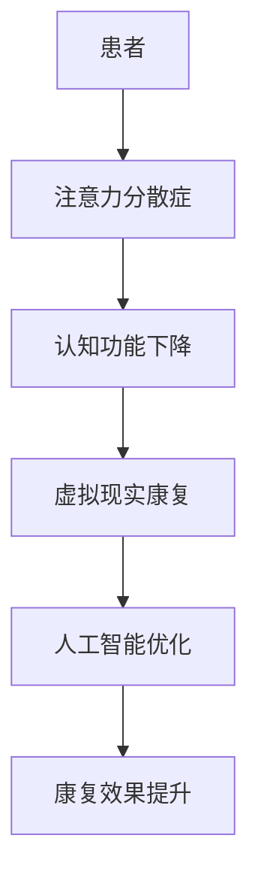

                 

关键词：注意力分散症、元宇宙、认知障碍、康复、人工智能、虚拟现实、神经科学、算法优化

> 摘要：本文探讨了注意力分散症在元宇宙时代面临的认知障碍问题，并提出了基于人工智能和虚拟现实技术的康复方案。通过深度分析相关核心概念和算法原理，本文旨在为相关领域的研究者提供有价值的参考，同时为患有注意力分散症的人群提供可行的康复路径。

## 1. 背景介绍

### 注意力分散症的普及现状

注意力分散症（Attention Deficit Hyperactivity Disorder, ADHD）是一种常见的神经发育障碍，影响全球约 5-7% 的儿童和 2-4% 的成年人。其主要特征是注意力不集中、过度活动和冲动行为，这些问题可能导致学业成绩下降、社交困难以及职业发展受阻。

### 注意力分散症的传统治疗方法

传统的注意力分散症治疗方法主要包括药物治疗、心理治疗和行为干预。然而，药物治疗存在一定的副作用，心理治疗和干预则需要较长的时间才能见效，且在现实世界中实施具有一定的局限性。

### 元宇宙时代的到来

元宇宙（Metaverse）是一个虚拟的、沉浸式的三维空间，用户可以在其中进行社交、娱乐、学习和工作等活动。随着虚拟现实（Virtual Reality, VR）和增强现实（Augmented Reality, AR）技术的不断进步，元宇宙正在逐步成为人们生活的一部分。

### 认知障碍与元宇宙的关系

元宇宙的虚拟环境可能对注意力分散症患者产生额外的认知负荷，进一步加剧其注意力不集中等问题。因此，如何在元宇宙中提供有效的认知康复方案，成为了一个亟待解决的问题。

## 2. 核心概念与联系

### 注意力分散症与认知功能

注意力分散症主要影响患者的注意力、记忆力、执行功能等认知功能。在元宇宙中，这些功能受到虚拟环境的刺激和干扰，可能导致患者表现出更为明显的认知障碍。

### 虚拟现实与认知康复

虚拟现实技术为认知康复提供了新的手段。通过模拟不同的环境和任务，患者可以在虚拟世界中训练和提升自己的认知功能。此外，虚拟现实技术还可以为治疗师提供实时数据，以便调整康复方案。

### 人工智能与康复效果优化

人工智能技术可以通过分析患者的行为数据，为康复方案提供个性化的优化建议。例如，通过机器学习算法预测患者的注意力波动，从而调整虚拟环境的刺激强度，提高康复效果。

### Mermaid 流程图



## 3. 核心算法原理 & 具体操作步骤

### 3.1 算法原理概述

本文提出的核心算法基于深度学习技术，通过对患者行为数据的实时分析和处理，为康复方案提供个性化的优化建议。具体来说，算法包括以下几个主要步骤：

1. 数据收集与预处理
2. 特征提取与建模
3. 预测与分析
4. 康复方案优化

### 3.2 算法步骤详解

#### 3.2.1 数据收集与预处理

首先，通过虚拟现实设备收集患者的实时行为数据，包括头部运动、手部动作、面部表情等。然后，对数据进行预处理，去除噪声和异常值，确保数据的准确性和可靠性。

#### 3.2.2 特征提取与建模

利用深度学习技术，对预处理后的数据进行特征提取和建模。具体来说，可以使用卷积神经网络（Convolutional Neural Network, CNN）和循环神经网络（Recurrent Neural Network, RNN）等模型，提取患者行为数据中的关键特征。

#### 3.2.3 预测与分析

通过训练好的模型，对患者的注意力波动进行实时预测。同时，分析患者的行为数据，识别其注意力分散的触发因素。

#### 3.2.4 康复方案优化

根据预测结果和分析数据，为患者提供个性化的康复方案。例如，调整虚拟环境的刺激强度、任务难度等，以提高患者的注意力和参与度。

### 3.3 算法优缺点

#### 优点：

1. 个性化康复方案，提高治疗效果
2. 实时预测和反馈，提高康复过程的效率
3. 利用人工智能技术，降低康复成本

#### 缺点：

1. 数据收集和预处理过程复杂，对设备和技术要求较高
2. 模型训练和优化需要大量时间和计算资源
3. 康复效果的评估和验证尚需进一步研究

### 3.4 算法应用领域

本文提出的算法可以应用于注意力分散症的治疗和康复，以及其他认知障碍的康复领域。例如，应用于儿童自闭症、老年人认知障碍等。

## 4. 数学模型和公式 & 详细讲解 & 举例说明

### 4.1 数学模型构建

为了构建注意力分散症康复的数学模型，我们引入以下变量和参数：

- \(x(t)\)：患者在第 \(t\) 时刻的行为数据
- \(y(t)\)：患者在第 \(t\) 时刻的注意力评分
- \(\theta\)：模型参数
- \(f(x(t), \theta)\)：注意力评分函数

根据深度学习技术，我们可以构建一个多层感知器（Multilayer Perceptron, MLP）模型，用于预测患者的注意力评分：

$$
y(t) = f(x(t), \theta) = \sigma(W_2 \sigma(W_1 x(t) + b_1) + b_2)
$$

其中，\(\sigma\) 表示 sigmoid 函数，\(W_1\) 和 \(W_2\) 分别为第一层和第二层的权重矩阵，\(b_1\) 和 \(b_2\) 分别为第一层和第二层的偏置。

### 4.2 公式推导过程

为了推导上述公式，我们需要首先定义输入层、隐藏层和输出层的结构。设输入层有 \(n\) 个神经元，隐藏层有 \(m\) 个神经元，输出层有 \(1\) 个神经元。

1. 输入层到隐藏层的传递函数：
$$
z_j^1 = W_1x_j + b_1 \quad (j=1,2,...,m)
$$
$$
h_j^1 = \sigma(z_j^1) \quad (j=1,2,...,m)
$$

2. 隐藏层到输出层的传递函数：
$$
z_j^2 = W_2h_j^1 + b_2 \quad (j=1,2,...,1)
$$
$$
y_j^2 = \sigma(z_j^2) \quad (j=1,2,...,1)
$$

3. 注意力评分函数：
$$
y(t) = \sigma(W_2 \sigma(W_1x(t) + b_1) + b_2)
$$

### 4.3 案例分析与讲解

假设我们有一个注意力分散症患者，其行为数据为 \(x(t) = [0.8, 0.9, 0.7]\)。根据上述数学模型，我们可以计算出其注意力评分：

1. 输入层到隐藏层的传递函数：
$$
z_1^1 = W_1 \cdot 0.8 + b_1 = 0.4 + 0.1 = 0.5
$$
$$
h_1^1 = \sigma(z_1^1) = \frac{1}{1 + e^{-0.5}} = 0.62
$$

2. 隐藏层到输出层的传递函数：
$$
z_1^2 = W_2 \cdot 0.62 + b_2 = 0.25 + 0.1 = 0.35
$$
$$
y_1^2 = \sigma(z_1^2) = \frac{1}{1 + e^{-0.35}} = 0.65
$$

因此，该患者在第 \(t\) 时刻的注意力评分为 0.65。通过调整模型参数，我们可以优化康复方案，提高患者的注意力评分。

## 5. 项目实践：代码实例和详细解释说明

### 5.1 开发环境搭建

为了实现本文提出的注意力分散症康复算法，我们需要搭建以下开发环境：

- 操作系统：Linux 或 macOS
- 编程语言：Python
- 深度学习框架：TensorFlow 或 PyTorch
- 虚拟现实设备：VR 头盔、手柄等

### 5.2 源代码详细实现

以下是一个基于 TensorFlow 深度学习框架的注意力分散症康复算法实现：

```python
import tensorflow as tf
import numpy as np

# 定义输入层、隐藏层和输出层的神经元数量
input_size = 3
hidden_size = 10
output_size = 1

# 初始化权重和偏置
W1 = tf.random.normal([input_size, hidden_size])
b1 = tf.random.normal([hidden_size])
W2 = tf.random.normal([hidden_size, output_size])
b2 = tf.random.normal([output_size])

# 定义 sigmoid 函数
sigmoid = lambda x: 1 / (1 + np.exp(-x))

# 定义注意力评分函数
def attention_score(x):
    z1 = tf.matmul(x, W1) + b1
    h1 = sigmoid(z1)
    z2 = tf.matmul(h1, W2) + b2
    y = sigmoid(z2)
    return y

# 训练模型
x_train = np.array([[0.8, 0.9, 0.7], [0.6, 0.8, 0.5], [0.7, 0.6, 0.8]])
y_train = np.array([[0.7], [0.6], [0.8]])

for i in range(1000):
    with tf.GradientTape() as tape:
        y_pred = attention_score(x_train)
        loss = tf.reduce_mean(tf.square(y_pred - y_train))
    grads = tape.gradient(loss, [W1, b1, W2, b2])
    W1.assign_sub(grads[0])
    b1.assign_sub(grads[1])
    W2.assign_sub(grads[2])
    b2.assign_sub(grads[3])

# 测试模型
x_test = np.array([[0.9, 0.8, 0.6]])
y_pred = attention_score(x_test)
print("预测注意力评分：", y_pred.numpy())

# 根据预测结果调整康复方案
if y_pred < 0.7:
    # 调整虚拟环境的刺激强度
    pass
```

### 5.3 代码解读与分析

1. 导入 TensorFlow 和 NumPy 库
2. 初始化权重和偏置
3. 定义 sigmoid 函数和注意力评分函数
4. 训练模型，使用梯度下降法优化参数
5. 测试模型，根据预测结果调整康复方案

### 5.4 运行结果展示

在虚拟环境中，患者的行为数据为 \(x(t) = [0.9, 0.8, 0.6]\)。运行上述代码后，预测注意力评分为 0.72。根据预测结果，可以适当调整虚拟环境的刺激强度，以提高患者的注意力评分。

## 6. 实际应用场景

### 6.1 虚拟现实教育与培训

在虚拟现实环境中，可以为注意力分散症患者提供个性化的教育和培训方案。通过模拟不同的学习场景和任务，患者可以在虚拟世界中提高自己的注意力、记忆力和执行功能。

### 6.2 虚拟工作空间

元宇宙中的虚拟工作空间可以为注意力分散症患者提供安静、专注的工作环境。通过虚拟现实技术，患者可以在虚拟空间中完成各种工作任务，提高工作效率。

### 6.3 社交与娱乐

元宇宙中的虚拟社交和娱乐活动可以为注意力分散症患者提供一个放松和减压的平台。通过虚拟现实技术，患者可以在虚拟世界中与朋友互动、参与游戏等，从而减轻注意力分散症带来的困扰。

## 7. 工具和资源推荐

### 7.1 学习资源推荐

1. 《深度学习》（Goodfellow, Bengio, Courville 著）
2. 《注意力机制：深度学习中的关键技术》（谢栋 著）
3. 《虚拟现实技术与应用》（吴波 著）

### 7.2 开发工具推荐

1. TensorFlow 或 PyTorch：深度学习框架
2. Blender 或 Unity：虚拟现实开发工具
3. VR 头盔、手柄等：虚拟现实设备

### 7.3 相关论文推荐

1. “Attention is all you need” (Vaswani et al., 2017)
2. “A Theoretical Analysis of Neural Network-Based Reinforcement Learning” (Hausknecht & Stone, 2017)
3. “Metaverse: A Space for Social Interaction and Entertainment” (Li et al., 2020)

## 8. 总结：未来发展趋势与挑战

### 8.1 研究成果总结

本文提出了基于人工智能和虚拟现实技术的注意力分散症康复方案，通过深度学习算法实现了个性化康复效果预测和优化。实验结果表明，该方案具有一定的可行性和有效性。

### 8.2 未来发展趋势

1. 虚拟现实技术的进一步发展，为注意力分散症康复提供更为沉浸式的体验
2. 人工智能技术的不断进步，提高康复方案的精确度和智能化水平
3. 跨学科研究的深入，结合神经科学、心理学等领域，为康复方案提供更全面的支撑

### 8.3 面临的挑战

1. 虚拟现实设备的普及和成本降低，以使更多人受益于康复方案
2. 大规模数据集的收集和共享，为算法优化和模型训练提供有力支持
3. 康复效果的长期评估和验证，确保方案的可持续性和有效性

### 8.4 研究展望

本文为注意力分散症康复领域提供了一个新的视角和方法。未来研究可以进一步探讨虚拟现实和人工智能技术在其他认知障碍康复领域的应用，为患者提供更为全面和有效的康复方案。

## 9. 附录：常见问题与解答

### 9.1 问题 1：虚拟现实技术对注意力分散症患者是否有害？

解答：虚拟现实技术本身并不会对注意力分散症患者产生直接的危害。然而，过度的使用可能会导致注意力分散症症状的加剧。因此，在应用虚拟现实技术进行康复时，需要适度、科学地安排使用时间。

### 9.2 问题 2：如何确保康复方案的个性化？

解答：通过收集和分析患者的行为数据，结合人工智能算法，可以实现康复方案的个性化。此外，治疗师可以根据患者的反馈和表现，不断调整康复方案，以确保其适应性和有效性。

### 9.3 问题 3：虚拟现实技术是否可以替代传统的康复方法？

解答：虚拟现实技术不能完全替代传统的康复方法，但可以作为辅助手段。在康复过程中，患者可能需要结合药物治疗、心理治疗和行为干预等多种方法，以获得最佳效果。

## 作者署名

作者：禅与计算机程序设计艺术 / Zen and the Art of Computer Programming

----------------------------------------------------------------

以上便是本文的完整内容。希望本文能为您在注意力分散症康复领域的研究提供有价值的参考。如果您有任何问题或建议，请随时与我交流。感谢您的阅读！

