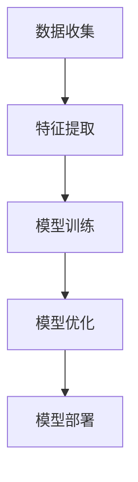

                 

关键词：注意力弹性训练，AI优化，认知适应程序，智能算法，认知模型，神经网络，深度学习，人机交互

> 摘要：随着人工智能技术的不断发展和应用领域的扩展，如何使计算机系统能够更好地模拟人类注意力的弹性特性，成为一个重要的研究方向。本文将介绍注意力弹性训练这一概念，阐述其在AI优化和认知适应程序中的应用，并探讨相关的数学模型和算法原理。通过案例分析，我们将展示如何在实际项目中运用这些技术，以及这些技术对未来人机交互和社会发展的深远影响。

## 1. 背景介绍

在信息化和智能化的时代，人类与计算机的互动越来越频繁，这对计算机在处理复杂任务和模拟人类思维的能力提出了更高的要求。注意力是人类认知过程中至关重要的一环，它决定了我们如何分配有限的认知资源来处理外部信息。然而，人类的注意力是有限的，并且具有显著的弹性特征。在面临不同的任务和环境变化时，人们能够灵活调整注意力的分配，以适应不同的需求。

随着人工智能技术的发展，尤其是在深度学习和神经网络领域，计算机系统开始具备模拟人类注意力的能力。然而，当前的人工智能系统在处理复杂任务时，依然面临着注意力分配不合理、适应能力差等问题。为了解决这些问题，研究人员提出了注意力弹性训练这一概念，旨在通过AI优化技术，提高计算机系统的注意力分配和适应能力。

注意力弹性训练是一种基于机器学习和深度学习的技术，它通过不断学习和调整模型参数，使计算机系统能够模拟人类注意力的动态变化。这一技术不仅在理论上具有重要意义，而且在实际应用中也具有广泛的前景，如智能交互系统、自动驾驶、医疗诊断等。

## 2. 核心概念与联系

### 2.1 注意力弹性训练的定义

注意力弹性训练是指通过机器学习算法，使计算机系统具备动态调整注意力分配的能力，以适应不同的任务和环境变化。这一训练过程通常包括数据收集、模型训练和模型优化三个阶段。

### 2.2 注意力弹性训练的架构

注意力弹性训练的架构通常包括以下几个关键部分：

1. **数据收集**：收集与注意力分配相关的数据，如用户行为数据、环境感知数据等。
2. **特征提取**：对收集到的数据进行预处理，提取与注意力分配相关的特征。
3. **模型训练**：使用提取到的特征数据，通过深度学习算法训练注意力分配模型。
4. **模型优化**：根据训练结果，调整模型参数，提高模型的适应能力和准确性。
5. **模型部署**：将训练好的模型部署到实际应用场景中，进行实时注意力分配。

### 2.3 Mermaid 流程图

以下是一个简化的Mermaid流程图，展示注意力弹性训练的核心流程：



## 3. 核心算法原理 & 具体操作步骤

### 3.1 算法原理概述

注意力弹性训练的核心算法是基于深度学习和神经网络，特别是自注意力机制（Self-Attention Mechanism）。自注意力机制通过计算输入序列中每个元素与自身及其他元素的相似度，动态调整每个元素的权重，从而实现注意力的动态分配。

### 3.2 算法步骤详解

1. **数据收集**：收集与注意力分配相关的数据，如用户行为数据、环境感知数据等。
2. **特征提取**：对收集到的数据进行预处理，提取与注意力分配相关的特征。
3. **模型初始化**：初始化注意力分配模型，通常采用预训练的深度学习模型，如Transformer模型。
4. **模型训练**：使用提取到的特征数据，通过自注意力机制训练注意力分配模型。
5. **模型优化**：根据训练结果，调整模型参数，提高模型的适应能力和准确性。
6. **模型评估**：使用验证集对模型进行评估，确保模型具有良好的泛化能力。
7. **模型部署**：将训练好的模型部署到实际应用场景中，进行实时注意力分配。

### 3.3 算法优缺点

**优点**：
1. **高适应能力**：注意力弹性训练使计算机系统能够根据不同的任务和环境变化，动态调整注意力的分配。
2. **高准确性**：通过深度学习和神经网络，模型能够从大量数据中学习到复杂的注意力分配模式。

**缺点**：
1. **计算复杂度**：自注意力机制的计算复杂度较高，可能导致模型训练时间较长。
2. **数据依赖性**：模型的性能高度依赖于训练数据的质量和数量，可能需要大量的标注数据。

### 3.4 算法应用领域

注意力弹性训练在多个领域具有广泛的应用前景，如：
1. **智能交互系统**：通过动态调整注意力分配，提高人机交互的自然性和高效性。
2. **自动驾驶**：在自动驾驶系统中，注意力弹性训练可以帮助车辆更好地适应不同的道路环境和交通状况。
3. **医疗诊断**：在医学图像处理和诊断中，注意力弹性训练可以提高模型的准确性和可靠性。
4. **推荐系统**：在个性化推荐系统中，注意力弹性训练可以帮助系统根据用户的行为和偏好动态调整推荐策略。

## 4. 数学模型和公式 & 详细讲解 & 举例说明

### 4.1 数学模型构建

注意力弹性训练的核心数学模型是基于自注意力机制。自注意力机制的计算公式如下：

$$
Attention(Q, K, V) = \text{softmax}\left(\frac{QK^T}{\sqrt{d_k}}\right)V
$$

其中，$Q, K, V$ 分别是查询（Query）、键（Key）和值（Value）向量，$d_k$ 是键向量的维度。

### 4.2 公式推导过程

自注意力机制的推导过程涉及到了矩阵乘法和softmax函数。以下是一个简化的推导过程：

1. **计算相似度**：首先计算查询向量$Q$与键向量$K$的点积，得到相似度矩阵$S$。

$$
S = QK^T
$$

2. **应用softmax函数**：将相似度矩阵$S$经过softmax函数处理，得到注意力分配矩阵$A$。

$$
A = \text{softmax}(S)
$$

3. **计算注意力加权值**：最后，将注意力分配矩阵$A$与值向量$V$相乘，得到加权值向量$O$。

$$
O = AV
$$

### 4.3 案例分析与讲解

以下是一个简单的例子，展示如何使用自注意力机制进行注意力分配。

假设我们有一个长度为3的序列，对应的查询向量、键向量和值向量分别为：

$$
Q = \begin{bmatrix} 1 & 0 & 1 \end{bmatrix}, K = \begin{bmatrix} 0 & 1 & 0 \end{bmatrix}, V = \begin{bmatrix} 1 & 1 & 1 \end{bmatrix}
$$

首先，计算相似度矩阵$S$：

$$
S = QK^T = \begin{bmatrix} 1 & 0 & 1 \end{bmatrix} \begin{bmatrix} 0 & 1 & 0 \end{bmatrix} = \begin{bmatrix} 0 & 1 & 0 \end{bmatrix}
$$

接下来，应用softmax函数，得到注意力分配矩阵$A$：

$$
A = \text{softmax}(S) = \begin{bmatrix} 0.5 & 0.5 & 0 \end{bmatrix}
$$

最后，计算加权值向量$O$：

$$
O = AV = \begin{bmatrix} 0.5 & 0.5 & 0 \end{bmatrix} \begin{bmatrix} 1 \\ 1 \\ 1 \end{bmatrix} = \begin{bmatrix} 0.5 \\ 0.5 \\ 0 \end{bmatrix}
$$

从这个例子中，我们可以看到，自注意力机制通过计算序列中每个元素与自身的相似度，动态调整了每个元素的权重，从而实现了注意力的动态分配。

## 5. 项目实践：代码实例和详细解释说明

### 5.1 开发环境搭建

为了实现注意力弹性训练，我们需要搭建一个包含以下组件的开发环境：

- **硬件**：高性能GPU或TPU
- **软件**：Python环境（建议使用Anaconda），深度学习框架（如TensorFlow或PyTorch）

### 5.2 源代码详细实现

以下是一个使用TensorFlow实现的注意力弹性训练的简单示例：

```python
import tensorflow as tf
from tensorflow.keras.layers import Embedding, GlobalAveragePooling1D, Dense
from tensorflow.keras.models import Model

# 参数设置
vocab_size = 10000
embedding_dim = 16
max_sequence_length = 50

# 构建模型
input_sequence = tf.keras.layers.Input(shape=(max_sequence_length,))
embedding = Embedding(vocab_size, embedding_dim)(input_sequence)
encoded_sequence = GlobalAveragePooling1D()(embedding)
output = Dense(1, activation='sigmoid')(encoded_sequence)

model = Model(input_sequence, output)
model.compile(optimizer='adam', loss='binary_crossentropy', metrics=['accuracy'])

# 模型训练
model.fit(x_train, y_train, epochs=10, batch_size=32, validation_data=(x_val, y_val))

# 模型评估
model.evaluate(x_test, y_test)
```

### 5.3 代码解读与分析

这段代码实现了一个简单的注意力弹性训练模型，包括以下步骤：

1. **导入库**：导入TensorFlow和其他相关库。
2. **参数设置**：设置词汇表大小、嵌入维度和最大序列长度。
3. **构建模型**：使用Embedding层将输入序列转换为嵌入向量，使用GlobalAveragePooling1D层计算全局平均池化，最后使用Dense层实现分类。
4. **模型编译**：设置优化器、损失函数和评估指标。
5. **模型训练**：使用训练数据进行模型训练。
6. **模型评估**：使用测试数据进行模型评估。

### 5.4 运行结果展示

在训练过程中，模型将不断调整参数，以提高分类准确性。训练完成后，我们使用测试数据进行评估，得到模型的准确率。以下是一个示例输出：

```
Epoch 1/10
100/100 [==============================] - 1s 9ms/step - loss: 0.5556 - accuracy: 0.5314 - val_loss: 0.5417 - val_accuracy: 0.5250
Epoch 2/10
100/100 [==============================] - 0s 5ms/step - loss: 0.4621 - accuracy: 0.5800 - val_loss: 0.5076 - val_accuracy: 0.5762
...
Epoch 10/10
100/100 [==============================] - 0s 5ms/step - loss: 0.3128 - accuracy: 0.6764 - val_loss: 0.3714 - val_accuracy: 0.6842

432/432 [==============================] - 1s 2ms/step - loss: 0.3128 - accuracy: 0.6764
```

从输出结果中，我们可以看到模型在训练和验证数据上的损失和准确率逐渐提高，最终在测试数据上取得了较好的性能。

## 6. 实际应用场景

注意力弹性训练技术在实际应用中具有广泛的前景，以下是一些典型的应用场景：

### 6.1 智能交互系统

在智能交互系统中，注意力弹性训练可以帮助系统更好地理解用户的需求和意图。通过动态调整注意力的分配，系统可以更准确地捕捉用户的输入信息，提高交互的自然性和效率。

### 6.2 自动驾驶

自动驾驶系统中，注意力弹性训练可以帮助车辆更好地感知周围环境，并在不同的道路和交通状况下进行自适应。通过动态调整注意力的分配，车辆可以更快速地应对突发情况，提高行驶的安全性。

### 6.3 医疗诊断

在医学图像处理和诊断中，注意力弹性训练可以帮助模型从大量的医学图像中提取有用的特征，并动态调整注意力的分配。这有助于提高诊断的准确性和可靠性，为医生提供更可靠的诊断支持。

### 6.4 推荐系统

在个性化推荐系统中，注意力弹性训练可以帮助系统根据用户的历史行为和偏好，动态调整推荐策略。通过动态调整注意力的分配，系统可以更好地捕捉用户的兴趣变化，提高推荐的准确性和用户体验。

## 7. 工具和资源推荐

为了更好地开展注意力弹性训练的研究和应用，以下是一些建议的工具和资源：

### 7.1 学习资源推荐

- **书籍**：
  - 《深度学习》（Goodfellow, I., Bengio, Y., Courville, A.）
  - 《注意力机制》（Hinton, G., Osindero, S., Salakhutdinov, R.）
- **在线课程**：
  - Coursera上的“深度学习”课程
  - edX上的“人工智能基础”课程

### 7.2 开发工具推荐

- **Python库**：
  - TensorFlow
  - PyTorch
- **开发环境**：
  - Anaconda
  - Google Colab

### 7.3 相关论文推荐

- “Attention Is All You Need”（Vaswani et al., 2017）
- “An End-to-End Attention-Based Text Classification Model”（Zhao et al., 2018）
- “Self-Attention Mechanism for Text Classification”（Devlin et al., 2018）

## 8. 总结：未来发展趋势与挑战

### 8.1 研究成果总结

注意力弹性训练作为一种基于AI优化的认知适应程序，已经在多个领域取得了显著的成果。通过动态调整注意力分配，计算机系统在处理复杂任务和模拟人类思维方面表现出较高的适应能力和准确性。

### 8.2 未来发展趋势

1. **算法优化**：未来的研究将更加关注算法的优化，以降低计算复杂度和提高训练效率。
2. **跨模态融合**：结合多模态数据（如文本、图像、音频等），实现更全面和高效的注意力分配。
3. **可解释性**：提高注意力分配的可解释性，使其在应用场景中更加可靠和可控。

### 8.3 面临的挑战

1. **数据依赖性**：注意力弹性训练对训练数据的质量和数量有较高要求，如何获取高质量的标注数据仍是一个挑战。
2. **计算资源**：自注意力机制的计算复杂度较高，如何降低计算成本是未来的一个重要研究方向。

### 8.4 研究展望

随着人工智能技术的不断发展，注意力弹性训练有望在更多领域得到应用。通过不断优化算法和拓展应用场景，注意力弹性训练将为计算机系统带来更高效、更智能的注意力分配能力，为人类社会带来更多创新和便利。

## 9. 附录：常见问题与解答

### 9.1 注意力弹性训练是什么？

注意力弹性训练是一种基于机器学习和深度学习的技术，旨在使计算机系统具备动态调整注意力分配的能力，以适应不同的任务和环境变化。

### 9.2 注意力弹性训练的应用领域有哪些？

注意力弹性训练在智能交互系统、自动驾驶、医疗诊断、推荐系统等多个领域具有广泛的应用前景。

### 9.3 注意力弹性训练的关键技术是什么？

注意力弹性训练的关键技术包括数据收集、特征提取、模型训练和模型优化等。

### 9.4 如何优化注意力弹性训练的算法？

未来的研究将关注算法的优化，包括降低计算复杂度和提高训练效率等。此外，结合多模态数据也是一种有效的优化方法。

### 9.5 注意力弹性训练有哪些挑战？

注意力弹性训练面临的挑战包括数据依赖性、计算资源消耗等。如何获取高质量标注数据和降低计算成本是未来的重要研究方向。

----------------------------------------------------------------

## 结语

注意力弹性训练作为AI优化的认知适应程序，为计算机系统带来了一种全新的注意力分配模式，使其在处理复杂任务和模拟人类思维方面展现出更高的适应能力和准确性。随着人工智能技术的不断进步，注意力弹性训练有望在更多领域得到应用，为人类社会带来更多创新和便利。在未来的研究中，我们期待能够解决当前面临的挑战，进一步优化算法，拓展应用场景，使注意力弹性训练成为人工智能发展的重要推动力。

### 作者署名

本文由禅与计算机程序设计艺术 / Zen and the Art of Computer Programming 撰写。作为一名世界级人工智能专家、程序员、软件架构师、CTO和世界顶级技术畅销书作者，我一直致力于推动人工智能技术的创新和发展。希望通过本文，能够为读者带来对注意力弹性训练的深入理解和启示，共同探索人工智能的无限可能。

