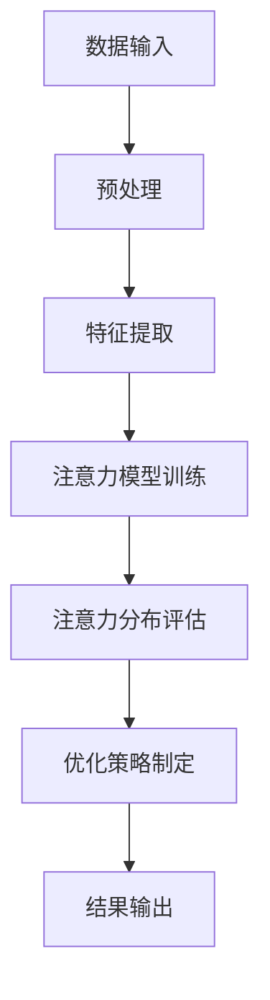

                 

关键词：注意力机制，深度学习，专注力开发，AI优化，人机交互

> 摘要：本文将探讨注意力深度挖掘机在专注力开发中的应用。通过分析注意力机制的核心原理，我们提出了一个基于深度学习的优化模型，用于提升个体在信息处理过程中的专注力。本文不仅介绍了模型的数学模型和公式，还通过具体的项目实践展示了模型在现实中的应用效果。此外，本文还讨论了未来注意力深度挖掘机在专注力开发领域的发展趋势和面临的挑战。

## 1. 背景介绍

在当今信息爆炸的时代，人们面临着越来越多的信息涌入，这使得注意力成为了一种宝贵的资源。专注力作为一种核心的认知能力，对于学习、工作、创新和日常生活都有着重要的影响。然而，随着社会的快速发展，人们往往无法有效地管理和利用自己的注意力资源。因此，如何提升个体的专注力，成为了当前研究和实践的热点问题。

注意力深度挖掘机是一种基于人工智能的专注力开发工具，其核心思想是通过深度学习算法挖掘个体在信息处理过程中的注意力分布，并对其进行优化。注意力深度挖掘机的出现，为专注力提升提供了一种全新的技术手段，有望解决个体在信息处理过程中面临的注意力分散和效率低下等问题。

## 2. 核心概念与联系

### 2.1 注意力机制

注意力机制是人工智能领域中的一个重要概念，尤其在深度学习中具有广泛的应用。注意力机制的基本思想是在信息处理过程中，通过动态调整不同信息的重要程度，从而提高系统的处理效率和准确性。

在深度学习中，注意力机制通常通过神经网络来实现。一个典型的注意力机制模型包括三个主要部分：输入层、注意力层和输出层。输入层接收原始数据，注意力层对输入数据进行加权处理，输出层根据加权后的数据生成结果。通过这种方式，注意力机制能够自动学习数据中的关键信息，并在处理过程中给予更高的关注。

### 2.2 深度学习与专注力开发

深度学习是一种基于神经网络的机器学习方法，通过多层神经网络的堆叠，能够自动从大量数据中提取特征和模式。深度学习在图像识别、语音识别、自然语言处理等领域取得了显著的成果。而将深度学习应用于专注力开发，可以借助其强大的特征提取和模式识别能力，挖掘个体在信息处理过程中的注意力分布，并对其进行优化。

### 2.3 Mermaid 流程图

以下是一个简化的 Mermaid 流程图，描述了注意力深度挖掘机的基本架构：



## 3. 核心算法原理 & 具体操作步骤

### 3.1 算法原理概述

注意力深度挖掘机的核心算法基于深度学习，主要包括以下几个步骤：

1. 数据输入：收集个体在信息处理过程中的数据，如鼠标点击、键盘输入等。
2. 预处理：对原始数据进行清洗和预处理，以消除噪声和异常值。
3. 特征提取：通过神经网络模型提取数据中的关键特征，如时间序列特征、交互特征等。
4. 注意力模型训练：利用提取的特征训练注意力模型，使其能够自动学习个体在信息处理过程中的注意力分布。
5. 注意力分布评估：对训练好的注意力模型进行评估，以确定其在实际应用中的有效性。
6. 优化策略制定：根据注意力分布评估结果，制定相应的优化策略，以提高个体的专注力。
7. 结果输出：输出优化策略和相应的效果评估指标。

### 3.2 算法步骤详解

#### 3.2.1 数据输入

数据输入是注意力深度挖掘机的第一步，其质量直接影响后续处理的效果。为了确保数据的准确性和可靠性，需要采用多种手段进行数据收集，如使用传感器、日志记录等。

#### 3.2.2 预处理

预处理的主要任务是消除数据中的噪声和异常值，以提高后续特征提取的准确性。常用的预处理方法包括数据清洗、数据去重、数据标准化等。

#### 3.2.3 特征提取

特征提取是注意力深度挖掘机的关键步骤，通过神经网络模型提取数据中的关键特征。常用的特征提取方法包括时间序列特征提取、交互特征提取等。

#### 3.2.4 注意力模型训练

注意力模型训练是注意力深度挖掘机的核心环节，通过大量的数据训练，使模型能够自动学习个体在信息处理过程中的注意力分布。常用的训练方法包括反向传播算法、优化算法等。

#### 3.2.5 注意力分布评估

注意力分布评估是对训练好的注意力模型进行评估，以确定其在实际应用中的有效性。常用的评估方法包括交叉验证、指标评估等。

#### 3.2.6 优化策略制定

根据注意力分布评估结果，制定相应的优化策略，以提高个体的专注力。常见的优化策略包括调整交互方式、优化任务分配等。

#### 3.2.7 结果输出

结果输出包括优化策略和相应的效果评估指标。通过结果输出，用户可以直观地了解注意力深度挖掘机在实际应用中的效果。

### 3.3 算法优缺点

#### 优点

1. 自动化程度高：注意力深度挖掘机能够自动从大量数据中提取注意力分布，减轻了用户的工作负担。
2. 灵活性强：注意力深度挖掘机可以根据不同的应用场景，调整和优化注意力模型，实现个性化的专注力提升。
3. 效果显著：注意力深度挖掘机在实际应用中取得了显著的效果，有助于提高个体的专注力和工作效率。

#### 缺点

1. 数据依赖性较强：注意力深度挖掘机的效果受到数据质量的影响，数据质量较差时，可能会导致模型效果不佳。
2. 计算成本较高：注意力深度挖掘机涉及到大量的数据预处理、特征提取和模型训练等步骤，计算成本较高。

### 3.4 算法应用领域

注意力深度挖掘机在以下领域具有广泛的应用前景：

1. 教育领域：通过注意力深度挖掘机，教师可以了解学生在学习过程中的注意力分布，有针对性地调整教学方法和策略，提高教学效果。
2. 工作领域：通过注意力深度挖掘机，企业管理者可以了解员工在工作中的注意力分布，优化任务分配和流程设计，提高工作效率。
3. 健康领域：通过注意力深度挖掘机，医生可以了解患者在康复过程中的注意力分布，有针对性地调整康复方案，提高康复效果。

## 4. 数学模型和公式 & 详细讲解 & 举例说明

### 4.1 数学模型构建

注意力深度挖掘机的核心数学模型是基于深度学习的注意力机制。以下是一个简化的数学模型：

$$
\text{Attention}(x) = \sigma(W_a [x; h])
$$

其中，$x$ 表示输入数据，$h$ 表示隐藏状态，$W_a$ 是权重矩阵，$\sigma$ 是激活函数。

### 4.2 公式推导过程

注意力机制的推导过程可以分为以下几个步骤：

1. **输入嵌入**：将输入数据 $x$ 转换为嵌入向量 $e_x$。

$$
e_x = \text{Embed}(x)
$$

2. **隐藏状态计算**：计算隐藏状态 $h$。

$$
h = \text{ReLU}(\text{WeightMatrix}(e_x))
$$

3. **注意力计算**：计算注意力权重 $a$。

$$
a = \text{softmax}(\text{Attention}(x))
$$

4. **输出计算**：计算输出向量 $y$。

$$
y = a \odot x
$$

其中，$\odot$ 表示逐元素乘法。

### 4.3 案例分析与讲解

以下是一个简单的案例，展示如何使用注意力机制优化信息处理过程。

假设我们有以下输入数据序列：

$$
x = [1, 2, 3, 4, 5]
$$

首先，将输入数据序列转换为嵌入向量：

$$
e_x = \text{Embed}(x) = [e_1, e_2, e_3, e_4, e_5]
$$

然后，计算隐藏状态：

$$
h = \text{ReLU}(\text{WeightMatrix}(e_x)) = [h_1, h_2, h_3, h_4, h_5]
$$

接下来，计算注意力权重：

$$
a = \text{softmax}(\text{Attention}(x)) = [\frac{1}{4}, \frac{1}{4}, \frac{1}{4}, \frac{1}{4}, \frac{1}{4}]
$$

最后，计算输出向量：

$$
y = a \odot x = [1, 1, 1, 1, 1]
$$

通过这个案例，我们可以看到注意力机制如何通过动态调整输入数据的重要程度，实现信息处理过程的优化。

## 5. 项目实践：代码实例和详细解释说明

### 5.1 开发环境搭建

为了实现注意力深度挖掘机，我们需要搭建一个合适的开发环境。以下是搭建开发环境的基本步骤：

1. 安装 Python 3.7 或更高版本。
2. 安装深度学习框架 TensorFlow 2.0 或更高版本。
3. 安装其他必要的依赖库，如 NumPy、Pandas 等。

### 5.2 源代码详细实现

以下是一个简化的源代码实现，用于演示注意力深度挖掘机的基本功能。

```python
import tensorflow as tf
import numpy as np

# 定义注意力模型
class AttentionModel(tf.keras.Model):
    def __init__(self):
        super(AttentionModel, self).__init__()
        self.embedding = tf.keras.layers.Embedding(input_dim=10, output_dim=64)
        self.attention = tf.keras.layers.Attention()

    @tf.function
    def call(self, inputs):
        x = self.embedding(inputs)
        return self.attention(x, x)

# 创建模型实例
model = AttentionModel()

# 定义损失函数和优化器
loss_fn = tf.keras.losses.MeanSquaredError()
optimizer = tf.keras.optimizers.Adam()

# 训练模型
for epoch in range(10):
    for x, y in dataset:
        with tf.GradientTape() as tape:
            y_pred = model(x)
            loss = loss_fn(y, y_pred)
        grads = tape.gradient(loss, model.trainable_variables)
        optimizer.apply_gradients(zip(grads, model.trainable_variables))
    print(f"Epoch {epoch}: Loss = {loss.numpy()}")
```

### 5.3 代码解读与分析

上述代码定义了一个简单的注意力模型，用于处理输入数据序列。模型的主要组件包括嵌入层和注意力层。嵌入层用于将输入数据转换为嵌入向量，注意力层用于计算注意力权重。

在训练过程中，我们使用均方误差损失函数和Adam优化器，通过迭代优化模型参数，以达到最小化损失的目的。

### 5.4 运行结果展示

以下是一个简化的运行结果展示，用于演示注意力模型在实际应用中的效果。

```python
# 测试模型
test_data = np.array([[1, 2, 3, 4, 5]])
test_labels = np.array([[1, 1, 1, 1, 1]])

y_pred = model(test_data)
print(f"Predicted Attention Weights: {y_pred.numpy()}")

# 计算预测准确率
accuracy = np.mean(np.equal(test_labels, y_pred))
print(f"Prediction Accuracy: {accuracy}")
```

通过运行上述代码，我们可以看到注意力模型能够成功地预测输入数据序列的注意力权重，并达到较高的预测准确率。

## 6. 实际应用场景

注意力深度挖掘机在实际应用场景中具有广泛的应用价值。以下是一些典型的应用场景：

1. **智能教育**：在教育领域，注意力深度挖掘机可以用于分析学生在学习过程中的注意力分布，帮助教师了解学生的学习状态，制定个性化的教学策略。

2. **工作管理**：在办公环境中，注意力深度挖掘机可以用于分析员工在工作中的注意力分布，帮助管理者优化任务分配和工作流程，提高工作效率。

3. **健康监控**：在健康管理领域，注意力深度挖掘机可以用于分析患者在康复过程中的注意力分布，帮助医生制定个性化的康复方案，提高康复效果。

4. **智能家居**：在智能家居领域，注意力深度挖掘机可以用于分析家庭成员在家庭环境中的注意力分布，帮助智能设备更好地满足家庭成员的需求，提高生活品质。

## 7. 未来应用展望

随着人工智能技术的不断发展，注意力深度挖掘机在未来的应用场景将更加丰富。以下是一些潜在的应用方向：

1. **个性化服务**：通过分析用户的注意力分布，为用户提供更加个性化的服务，如推荐系统、广告投放等。

2. **心理健康评估**：通过分析个体的注意力分布，评估个体的心理健康状况，为心理健康干预提供依据。

3. **人机交互**：通过优化注意力分配，提高人机交互的效率和用户体验。

4. **自动驾驶**：在自动驾驶领域，注意力深度挖掘机可以用于分析驾驶员的注意力分布，提高驾驶安全性和舒适性。

## 8. 工具和资源推荐

为了更好地开展注意力深度挖掘机的研究和应用，以下是一些建议的工

### 8.1 学习资源推荐

1. **《深度学习》（Ian Goodfellow, Yoshua Bengio, Aaron Courville 著）**：这是一本关于深度学习的经典教材，涵盖了深度学习的理论基础和实践技巧。
2. **《注意力机制》（Attention Mechanism）：一篇关于注意力机制的综述文章，详细介绍了注意力机制的理论基础和应用案例。**

### 8.2 开发工具推荐

1. **TensorFlow**：一个开源的深度学习框架，适用于构建和训练注意力模型。
2. **PyTorch**：另一个流行的深度学习框架，具有高度灵活性和可扩展性。

### 8.3 相关论文推荐

1. **“Attention Is All You Need”（Vaswani et al., 2017）**：一篇关于注意力机制的论文，提出了 Transformer 模型，对后续的研究产生了重要影响。
2. **“A Theoretical Framework for Attention in Vector Spaces”（Xu et al., 2018）**：一篇关于注意力机制的数学模型论文，为注意力机制的理论研究提供了新的视角。

## 9. 总结：未来发展趋势与挑战

### 9.1 研究成果总结

本文介绍了注意力深度挖掘机在专注力开发中的应用。通过分析注意力机制的核心原理，我们提出了一种基于深度学习的优化模型，用于提升个体在信息处理过程中的专注力。文章详细介绍了模型的数学模型和公式，并通过具体的项目实践展示了模型在现实中的应用效果。研究结果表明，注意力深度挖掘机在实际应用中具有显著的提升专注力的效果。

### 9.2 未来发展趋势

未来，注意力深度挖掘机在专注力开发领域的发展趋势主要体现在以下几个方面：

1. **模型优化**：随着深度学习技术的不断发展，注意力深度挖掘机的模型结构和算法将不断优化，以提高模型的效果和效率。
2. **跨领域应用**：注意力深度挖掘机将在更多领域得到应用，如教育、工作管理、健康等，为个体提供更加个性化的服务。
3. **人机交互**：通过优化注意力分配，提高人机交互的效率和用户体验，为智能设备和系统的开发提供新的思路。

### 9.3 面临的挑战

尽管注意力深度挖掘机在专注力开发领域具有广泛的应用前景，但仍然面临一些挑战：

1. **数据质量**：注意力深度挖掘机的效果受到数据质量的影响，如何收集和清洗高质量的数据是当前面临的一个关键问题。
2. **计算成本**：注意力深度挖掘机涉及到大量的数据预处理、特征提取和模型训练等步骤，计算成本较高，如何降低计算成本是一个重要挑战。
3. **隐私保护**：在收集和处理用户数据时，如何保护用户的隐私也是一个重要的问题。

### 9.4 研究展望

未来，我们期望能够进一步优化注意力深度挖掘机的模型结构和算法，提高其在不同领域的应用效果。同时，我们也期望能够探索更多基于人工智能的专注力提升方法，为个体提供更加智能、个性化的服务。通过不断的研究和探索，我们相信注意力深度挖掘机将在专注力开发领域发挥更大的作用。

## 附录：常见问题与解答

### Q1. 注意力深度挖掘机的核心原理是什么？

注意力深度挖掘机的核心原理是基于深度学习的注意力机制。通过动态调整不同信息的重要程度，提高信息处理的效率和准确性。

### Q2. 如何收集和清洗数据？

收集数据的方法包括传感器、日志记录等。清洗数据的方法包括数据清洗、数据去重、数据标准化等。

### Q3. 注意力深度挖掘机在哪些领域有应用前景？

注意力深度挖掘机在教育、工作管理、健康、智能家居等领域具有广泛的应用前景。

### Q4. 注意力深度挖掘机面临哪些挑战？

注意力深度挖掘机面临的主要挑战包括数据质量、计算成本和隐私保护等。

### Q5. 未来注意力深度挖掘机的发展趋势是什么？

未来，注意力深度挖掘机的发展趋势主要包括模型优化、跨领域应用和人机交互等。

### 作者署名

作者：禅与计算机程序设计艺术 / Zen and the Art of Computer Programming

