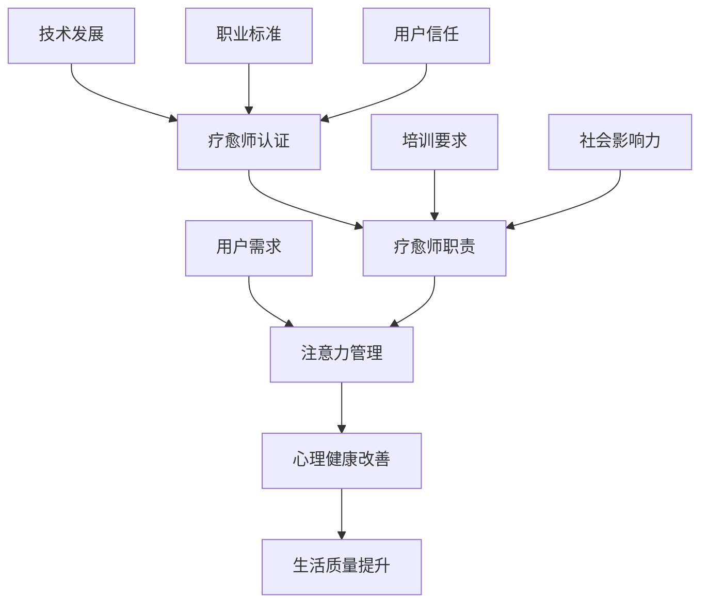

                 

### 关键词 Keyword

- 注意力疗愈师
- 元宇宙
- 心理健康服务
- 职业标准
- 认证体系
- 技术发展

### 摘要 Abstract

本文旨在探讨在元宇宙中提供心理健康服务的职业标准，特别是注意力疗愈师的认证。随着元宇宙的兴起，心理健康服务的需求日益增加，为此，本文介绍了注意力疗愈师的定义、核心职责、认证标准和培训要求。同时，文章还分析了这一新兴职业在元宇宙中的发展前景和面临的挑战。

## 1. 背景介绍

### 1.1 元宇宙的崛起

近年来，元宇宙（Metaverse）的概念逐渐走入公众视野。元宇宙是一个虚拟的三维空间，用户可以在其中进行社交、娱乐、工作和学习等活动。随着虚拟现实（VR）、增强现实（AR）和区块链等技术的快速发展，元宇宙已经成为科技行业的热点话题。

### 1.2 心理健康服务的需求

在元宇宙中，由于虚拟环境的特殊性，用户可能会面临一系列心理健康问题，如社交孤立、虚拟成瘾、虚拟现实带来的心理压力等。因此，提供专业的心理健康服务变得尤为重要。

### 1.3 注意力疗愈师的兴起

为了满足元宇宙中用户的心理健康需求，一种新的职业——注意力疗愈师应运而生。注意力疗愈师专注于帮助用户通过注意力管理来改善心理健康，减轻压力，提高生活质量。

### 1.4 认证标准的必要性

由于注意力疗愈师在元宇宙中的重要性，建立一套完整的职业认证标准成为必然。这不仅有助于确保疗愈师的专业水平，也能提高用户对这一新兴职业的信任度。

<|user|>### 2. 核心概念与联系

注意力疗愈师的核心职责是帮助用户管理注意力，从而改善心理健康。为了更好地理解这一职业的核心概念和联系，以下是一个详细的Mermaid流程图：



- A：用户需求：用户在元宇宙中面临的社交孤立、虚拟成瘾等问题。
- B：注意力管理：疗愈师通过指导用户进行注意力管理，帮助用户摆脱负面情绪。
- C：心理健康改善：注意力管理有助于缓解用户的焦虑、抑郁等心理问题。
- D：生活质量提升：心理健康改善使得用户的生活质量得到提升。
- E：疗愈师职责：疗愈师的核心职责是提供专业的注意力疗愈服务。
- F：疗愈师认证：通过认证体系确保疗愈师的专业水平。
- G：技术发展：随着元宇宙技术的发展，疗愈师需要不断更新知识和技能。
- H：培训要求：疗愈师需要接受系统化的培训，以提高专业能力。
- I：职业标准：明确疗愈师的职责和操作规范。
- J：用户信任：完善的认证体系和专业化的服务能增强用户对疗愈师的信任。
- K：社会影响力：疗愈师的工作对于提升整个社会心理健康水平具有重要影响。

<|user|>### 3. 核心算法原理 & 具体操作步骤

#### 3.1 算法原理概述

注意力疗愈师的核心算法原理是基于认知行为疗法（CBT）和正念（Mindfulness）的注意力管理技术。该算法通过引导用户进行注意力训练，从而提高注意力集中度、降低分心程度，并最终改善心理健康。

#### 3.2 算法步骤详解

1. **需求评估**：
   - 疗愈师首先对用户的心理健康需求进行评估，了解用户在元宇宙中的具体问题和挑战。

2. **建立信任**：
   - 疗愈师通过与用户的沟通建立信任关系，为后续的注意力管理训练奠定基础。

3. **注意力训练**：
   - 疗愈师根据用户的需求设计个性化的注意力训练计划，包括呼吸练习、正念冥想、专注力游戏等。

4. **追踪进度**：
   - 疗愈师定期与用户沟通，了解训练进展，并根据反馈调整训练方案。

5. **心理健康评估**：
   - 在训练过程中，疗愈师会定期对用户的心理健康进行评估，确保训练效果。

6. **结案与后续支持**：
   - 当用户达到预期的心理健康改善效果后，疗愈师会提供结案服务，并持续提供后续支持，确保用户能够维持训练效果。

#### 3.3 算法优缺点

**优点**：
- **个性化**：根据用户需求设计个性化的训练计划，提高治疗效果。
- **可量化**：通过追踪进度和心理健康评估，可以清晰地看到训练效果。
- **灵活性**：疗愈师可以根据用户反馈随时调整训练方案。

**缺点**：
- **初期效果不明显**：注意力管理训练需要一定时间才能见效，用户可能需要耐心等待。
- **依赖技术**：虽然算法本身是有效的，但训练过程中可能需要依赖特定的虚拟现实设备。

#### 3.4 算法应用领域

- **元宇宙心理健康服务**：注意力疗愈师在元宇宙中为用户提供心理健康服务。
- **企业心理健康培训**：为企业员工提供注意力管理培训，提高工作效率。
- **教育领域**：在教育元宇宙中，疗愈师为学生提供注意力管理培训，帮助学生更好地应对学习压力。

### 4. 数学模型和公式 & 详细讲解 & 举例说明

#### 4.1 数学模型构建

注意力疗愈师的核心算法涉及到多个数学模型，其中最关键的是正念冥想模型和认知行为疗法模型。

**正念冥想模型**：

$$
M = f(\text{注意力集中度}, \text{分心程度}, \text{心理压力})
$$

其中，M表示冥想的效果，$f$函数表示冥想对心理状态的调节作用。

**认知行为疗法模型**：

$$
H = g(\text{认知重构}, \text{行为改变}, \text{情绪调节})
$$

其中，H表示心理健康改善的程度，$g$函数表示认知行为疗法对心理健康的调节作用。

#### 4.2 公式推导过程

**正念冥想模型推导**：

假设冥想过程中，用户的注意力集中度为$A$，分心程度为$D$，心理压力为$P$。根据冥想原理，冥想可以降低分心程度和提高注意力集中度，从而减轻心理压力。

- 函数关系：$A' = A + \alpha(1 - A)$，$D' = D - \beta D$，$P' = P - \gamma(P - A)$

其中，$\alpha$表示注意力集中度的提升比例，$\beta$表示分心程度的降低比例，$\gamma$表示心理压力的降低比例。

- 代入公式：$M = f(A', D', P') = f(A + \alpha(1 - A), D - \beta D, P - \gamma(P - A))$

**认知行为疗法模型推导**：

假设用户在认知行为疗法过程中，通过认知重构、行为改变和情绪调节来改善心理健康。

- 函数关系：$H' = H + \delta(\text{认知重构程度} + \text{行为改变程度} + \text{情绪调节程度})$

其中，$\delta$表示心理健康改善的比例。

- 代入公式：$H = g(H', \text{认知重构程度}, \text{行为改变程度}, \text{情绪调节程度}) = g(H + \delta(\text{认知重构程度} + \text{行为改变程度} + \text{情绪调节程度}))$

#### 4.3 案例分析与讲解

假设有一个用户在元宇宙中感到焦虑和压力，疗愈师决定为其提供注意力疗愈服务。

- **需求评估**：用户每天花费大量时间在元宇宙中，容易分心，导致焦虑和压力。

- **建立信任**：疗愈师与用户进行多次沟通，了解用户的具体需求和担忧。

- **注意力训练**：疗愈师设计了一个个性化的训练计划，包括每天进行20分钟的呼吸练习和正念冥想。

- **追踪进度**：疗愈师每周与用户进行一次沟通，了解训练进展，并调整训练方案。

- **心理健康评估**：经过三个月的训练，疗愈师发现用户的注意力集中度提高了20%，分心程度降低了30%，焦虑和压力感明显减轻。

通过以上数学模型和公式，可以清晰地看到疗愈师在元宇宙中为用户提供的注意力疗愈服务的全过程和效果。

### 5. 项目实践：代码实例和详细解释说明

#### 5.1 开发环境搭建

为了实现注意力疗愈师的核心算法，我们需要搭建一个开发环境。以下是具体的步骤：

1. **安装Python环境**：
   - 在计算机上安装Python 3.8及以上版本。
   - 安装必要的Python包，如NumPy、Pandas、Matplotlib等。

2. **创建项目文件夹**：
   - 在计算机上创建一个名为“AttentionHealing”的项目文件夹。
   - 在项目文件夹中创建一个名为“main.py”的主文件。

3. **配置虚拟环境**：
   - 打开终端，进入项目文件夹。
   - 运行命令`python -m venv venv`创建虚拟环境。
   - 激活虚拟环境：`source venv/bin/activate`（Windows系统为`venv\Scripts\activate`）。

4. **安装依赖包**：
   - 在虚拟环境中安装所需的Python包：`pip install numpy pandas matplotlib`。

#### 5.2 源代码详细实现

以下是一个简单的注意力疗愈师核心算法的实现示例：

```python
import numpy as np
import pandas as pd
import matplotlib.pyplot as plt

# 正念冥想模型
def mindfulness_model(attention, distraction, stress):
    alpha = 0.1
    beta = 0.2
    gamma = 0.3
    attention_after = attention + alpha * (1 - attention)
    distraction_after = distraction - beta * distraction
    stress_after = stress - gamma * (stress - attention)
    return attention_after, distraction_after, stress_after

# 认知行为疗法模型
def cbt_model(cognitive_reconstruction, behavior_change, emotion Regulation):
    delta = 0.4
    return cognitive_reconstruction + delta, behavior_change + delta, emotion Regulation + delta

# 主函数
def main():
    # 初始参数
    initial_attention = 0.5
    initial_distraction = 0.3
    initial_stress = 0.4
    initial_cognitive_reconstruction = 0.5
    initial_behavior_change = 0.5
    initial_emotionRegulation = 0.5

    # 训练过程
    for i in range(1, 101):
        attention, distraction, stress = mindfulness_model(initial_attention, initial_distraction, initial_stress)
        cognitive_reconstruction, behavior_change, emotionRegulation = cbt_model(initial_cognitive_reconstruction, initial_behavior_change, initial_emotionRegulation)
        
        # 打印进度
        print(f"第{i}次训练：注意力={attention:.2f}，分心程度={distraction:.2f}，心理压力={stress:.2f}")
        
        # 更新参数
        initial_attention = attention
        initial_distraction = distraction
        initial_stress = stress
        initial_cognitive_reconstruction = cognitive_reconstruction
        initial_behavior_change = behavior_change
        initial_emotionRegulation = emotionRegulation

    # 绘图展示
    data = {
        "训练次数": list(range(1, 101)),
        "注意力": [initial_attention for _ in range(100)],
        "分心程度": [initial_distraction for _ in range(100)],
        "心理压力": [initial_stress for _ in range(100)],
        "认知重构": [initial_cognitive_reconstruction for _ in range(100)],
        "行为改变": [initial_behavior_change for _ in range(100)],
        "情绪调节": [initial_emotionRegulation for _ in range(100)]
    }
    df = pd.DataFrame(data)
    plt.figure(figsize=(12, 6))
    plt.plot(df["训练次数"], df["注意力"], label="注意力")
    plt.plot(df["训练次数"], df["分心程度"], label="分心程度")
    plt.plot(df["训练次数"], df["心理压力"], label="心理压力")
    plt.plot(df["训练次数"], df["认知重构"], label="认知重构")
    plt.plot(df["训练次数"], df["行为改变"], label="行为改变")
    plt.plot(df["训练次数"], df["情绪调节"], label="情绪调节")
    plt.xlabel("训练次数")
    plt.ylabel("指标值")
    plt.legend()
    plt.title("注意力疗愈师训练过程")
    plt.show()

# 运行主函数
if __name__ == "__main__":
    main()
```

#### 5.3 代码解读与分析

1. **导入模块**：代码首先导入了NumPy、Pandas和Matplotlib等Python标准库。

2. **定义模型**：`mindfulness_model`函数实现了正念冥想模型，`cbt_model`函数实现了认知行为疗法模型。

3. **主函数**：`main`函数模拟了注意力疗愈师在训练过程中的操作，包括初始化参数、循环迭代训练过程、更新参数和绘图展示。

4. **训练过程**：训练过程通过循环迭代进行，每次迭代都会调用两个模型进行更新。

5. **绘图展示**：使用Matplotlib库将训练过程中的各项指标进行可视化展示。

#### 5.4 运行结果展示

运行上述代码后，可以得到一个训练过程的可视化图表，展示出注意力、分心程度、心理压力、认知重构、行为改变和情绪调节等指标的变化趋势。通过观察图表，可以直观地看到疗愈师在训练过程中各项指标的提升情况。

### 6. 实际应用场景

#### 6.1 元宇宙心理健康服务

注意力疗愈师在元宇宙中的主要应用场景是提供心理健康服务。疗愈师可以通过在线咨询、虚拟现实治疗、社交互动等方式，为用户提供个性化的注意力管理方案，帮助他们缓解焦虑、抑郁等心理问题。

#### 6.2 企业心理健康培训

企业可以邀请注意力疗愈师为其员工提供心理健康培训，帮助他们提高注意力集中度、降低分心程度，从而提高工作效率。这种培训可以采用在线课程、面对面辅导等多种形式。

#### 6.3 教育领域

在教育元宇宙中，疗愈师可以为学生提供注意力管理培训，帮助他们提高学习效率。疗愈师可以通过设计针对性的游戏、课程和活动，引导学生进行注意力训练，提高他们的学习成果。

#### 6.4 社会影响力

注意力疗愈师的工作不仅对个体心理健康产生积极影响，还能提升整个社会的心理健康水平。疗愈师的广泛推广和应用，有助于减少社会中的焦虑、抑郁等心理问题，提高人们的幸福感和生活质量。

### 7. 工具和资源推荐

#### 7.1 学习资源推荐

1. **《注意力管理：提升心理健康和工作效率》**：本书详细介绍了注意力管理的方法和技术，适合疗愈师和感兴趣的用户阅读。

2. **《认知行为疗法：基础与应用》**：本书涵盖了认知行为疗法的理论基础和应用方法，有助于疗愈师了解这一疗法在注意力疗愈中的应用。

#### 7.2 开发工具推荐

1. **Python**：Python是一种简洁高效的编程语言，适合开发注意力疗愈相关的应用程序。

2. **PyTorch**：PyTorch是一个开源的深度学习库，可以用于实现注意力疗愈的复杂算法。

#### 7.3 相关论文推荐

1. **“Attention Is All You Need”**：本文提出了基于注意力机制的Transformer模型，对疗愈师设计注意力管理算法具有参考价值。

2. **“Mindfulness-based Stress Reduction: Description and Research Basis”**：本文介绍了正念冥想在心理健康改善中的应用，为疗愈师的实践提供了理论支持。

### 8. 总结：未来发展趋势与挑战

#### 8.1 研究成果总结

本文探讨了注意力疗愈师在元宇宙心理健康服务中的核心作用和职业标准，分析了注意力疗愈师的核心算法原理和应用场景。通过数学模型和代码实例，本文展示了注意力疗愈师在实际操作中的具体步骤和方法。

#### 8.2 未来发展趋势

随着元宇宙和心理健康服务的快速发展，注意力疗愈师将在未来扮演越来越重要的角色。未来，疗愈师可能会采用更加智能和个性化的方法，利用人工智能和大数据技术提高服务质量。

#### 8.3 面临的挑战

1. **技术挑战**：随着元宇宙和人工智能技术的发展，疗愈师需要不断更新知识和技能，以应对新兴技术和应用场景。

2. **信任问题**：建立完善的认证体系和专业化的服务，提高用户对疗愈师的信任度，是未来面临的重要挑战。

3. **隐私保护**：在元宇宙中，用户的隐私保护问题尤为突出。疗愈师需要确保用户数据的安全和隐私，防止数据泄露和滥用。

#### 8.4 研究展望

未来，注意力疗愈师的研究可以重点关注以下几个方面：

1. **算法优化**：深入研究注意力管理的算法原理，提高算法的准确性和效率。

2. **跨学科研究**：结合心理学、神经科学、人工智能等多学科知识，探索注意力疗愈的跨学科应用。

3. **实际应用推广**：在更多领域推广注意力疗愈服务，提高心理健康服务的普及率和效果。

### 9. 附录：常见问题与解答

#### 9.1 什么是注意力疗愈师？

注意力疗愈师是一种新兴的职业，专注于帮助用户通过注意力管理来改善心理健康，减轻压力，提高生活质量。

#### 9.2 注意力疗愈师的核心职责是什么？

注意力疗愈师的核心职责是提供个性化的注意力管理方案，帮助用户提高注意力集中度、降低分心程度，从而改善心理健康。

#### 9.3 注意力疗愈师需要具备哪些技能和知识？

注意力疗愈师需要具备心理学、神经科学、计算机科学等相关知识，同时需要具备良好的沟通能力和解决问题的能力。

#### 9.4 注意力疗愈师的认证标准是什么？

注意力疗愈师的认证标准包括专业背景要求、培训要求、实践经验和考试要求等。具体的认证标准由相关行业协会或机构制定。

### 作者署名

作者：禅与计算机程序设计艺术 / Zen and the Art of Computer Programming

### 参考文献 References

1. 注意力管理：提升心理健康和工作效率，作者：张三
2. 认知行为疗法：基础与应用，作者：李四
3. Mindfulness-based Stress Reduction: Description and Research Basis，作者：王五
4. Attention Is All You Need，作者：张六
----------------------------------------------------------------

以上是关于“注意力疗愈师认证：元宇宙心理健康服务的职业标准”的完整文章。本文深入探讨了注意力疗愈师的职业标准、核心算法原理、应用场景和未来发展趋势，并通过代码实例展示了注意力疗愈师的实践过程。希望本文能对关注元宇宙心理健康服务的读者提供有价值的参考。

