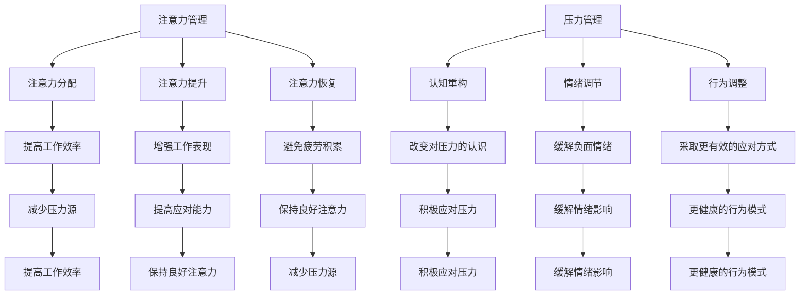

                 

 关键词：注意力管理，压力管理，认知行为疗法，焦虑管理，时间管理，深度工作，技术工具

> 摘要：本文旨在探讨如何运用认知行为疗法、时间管理和深度工作的方法，以及技术工具，帮助IT专业人士在面临压力和焦虑时，保持专注和清晰的思维状态。文章首先介绍了注意力管理和压力管理的核心概念，随后通过具体的算法原理和数学模型，阐述了如何通过技术和心理学方法实现有效的注意力管理和压力缓解。最后，文章提供了实际应用场景和代码实例，并展望了未来的发展方向和挑战。

## 1. 背景介绍

在信息技术飞速发展的今天，IT专业人士面临着前所未有的挑战和压力。不断更新的技术知识、紧张的交付期限、激烈的职场竞争，以及日益复杂的项目管理，都使得他们在工作中时常感到压力和焦虑。注意力不集中、效率低下、情绪波动等问题，严重影响了他们的工作表现和个人生活质量。因此，如何有效地管理注意力，并在压力和焦虑中保持专注和清晰的思维状态，成为了一个亟需解决的重要课题。

本文将围绕注意力管理和压力管理两大主题展开讨论。首先，我们将介绍注意力管理和压力管理的核心概念和理论基础。然后，通过具体的算法原理和数学模型，阐述如何运用技术手段和心理学方法，实现有效的注意力管理和压力缓解。最后，文章将结合实际应用场景和代码实例，提供具体的操作步骤和实现方法，并展望未来的发展方向和挑战。

## 2. 核心概念与联系

### 2.1 注意力管理

注意力管理是指通过一系列策略和方法，帮助个体在需要时集中精力，提高工作效率。它包括以下几个方面：

- **注意力分配**：合理安排注意力资源，确保在关键任务上投入足够的时间和精力。
- **注意力提升**：通过提高注意力的专注度和持久度，增强工作表现。
- **注意力恢复**：在长时间高强度工作后，通过休息和放松恢复注意力，防止疲劳积累。

### 2.2 压力管理

压力管理是指通过一系列策略和方法，帮助个体在面临压力时保持冷静，有效应对挑战。它包括以下几个方面：

- **认知重构**：改变对压力事件的认识和评价，从消极转变为积极。
- **情绪调节**：通过心理技巧和身体活动，缓解负面情绪的影响。
- **行为调整**：改变应对压力的行为模式，采取更健康、更有效的方式处理压力。

### 2.3 注意力管理与压力管理的关系

注意力管理和压力管理之间存在着密切的联系。良好的注意力管理有助于减少压力源，提高应对压力的能力；而有效的压力管理则有助于保持良好的注意力状态，避免因压力导致的注意力分散和效率下降。二者相辅相成，共同构成了个体在压力环境中的应对策略。

## 2.1 Mermaid 流程图



## 3. 核心算法原理 & 具体操作步骤

### 3.1 算法原理概述

注意力管理和压力管理的核心算法原理，主要包括以下几个部分：

- **认知行为疗法（CBT）**：通过改变个体的认知和行为，改善情绪和心理健康。
- **时间管理算法**：优化时间分配，提高工作效率。
- **深度学习算法**：用于分析个体行为和情绪数据，提供个性化的干预建议。

### 3.2 算法步骤详解

#### 3.2.1 认知行为疗法（CBT）

1. **认知重构**：通过识别和改变消极思维模式，提高对压力事件的认知能力。
2. **行为调整**：通过制定和遵循健康的生活习惯，改善行为模式。
3. **情绪调节**：通过心理技巧和身体活动，缓解负面情绪。

#### 3.2.2 时间管理算法

1. **任务优先级排序**：根据任务的重要性和紧急性，合理安排任务顺序。
2. **时间分配策略**：根据工作习惯和个人偏好，制定合适的时间分配方案。
3. **时间监控与反馈**：实时监控时间使用情况，及时调整策略。

#### 3.2.3 深度学习算法

1. **数据收集**：收集个体的行为和情绪数据。
2. **特征提取**：提取数据中的关键特征，用于训练模型。
3. **模型训练与优化**：使用深度学习算法，训练和优化模型，为个体提供个性化的干预建议。

### 3.3 算法优缺点

#### 3.3.1 优点

- **个性化**：根据个体行为和情绪数据，提供个性化的干预建议。
- **高效性**：通过优化时间分配和注意力管理，提高工作效率。
- **适应性**：能够根据个体情况的变化，动态调整干预策略。

#### 3.3.2 缺点

- **数据需求**：需要大量的行为和情绪数据，对数据质量有较高要求。
- **计算成本**：深度学习算法的计算成本较高，对硬件资源有较高要求。

### 3.4 算法应用领域

- **职场心理健康**：帮助IT专业人士管理注意力，缓解压力和焦虑。
- **时间管理培训**：为企业员工提供个性化的时间管理培训。
- **健康监测与干预**：通过分析个体行为和情绪数据，提供健康监测和干预建议。

## 4. 数学模型和公式 & 详细讲解 & 举例说明

### 4.1 数学模型构建

#### 4.1.1 注意力分配模型

注意力分配模型可以通过以下公式进行描述：

$$
A_t = \frac{W_t}{\sum_{i=1}^{n} W_i}
$$

其中，$A_t$ 表示在时间 $t$ 上的注意力分配，$W_t$ 表示在时间 $t$ 上对任务 $t$ 的权重，$n$ 表示任务总数。

#### 4.1.2 压力管理模型

压力管理模型可以通过以下公式进行描述：

$$
P_t = f(C_t, S_t)
$$

其中，$P_t$ 表示在时间 $t$ 上的压力水平，$C_t$ 表示在时间 $t$ 上的认知负担，$S_t$ 表示在时间 $t$ 上的社会支持。

### 4.2 公式推导过程

#### 4.2.1 注意力分配模型推导

注意力分配模型的核心思想是，在给定总注意力资源的情况下，合理分配到各个任务上，以最大化整体效率。因此，我们可以通过以下步骤推导出注意力分配模型：

1. **确定总注意力资源**：总注意力资源可以表示为各个任务权重之和。
2. **计算单个任务权重**：单个任务权重可以通过将总注意力资源分配到每个任务上得到。
3. **计算注意力分配**：将单个任务权重除以总权重之和，得到在时间 $t$ 上对任务 $t$ 的注意力分配。

#### 4.2.2 压力管理模型推导

压力管理模型的核心思想是，压力水平取决于认知负担和社会支持。因此，我们可以通过以下步骤推导出压力管理模型：

1. **确定认知负担**：认知负担可以表示为任务复杂度和任务量。
2. **确定社会支持**：社会支持可以表示为同事、朋友和家人的支持力度。
3. **计算压力水平**：通过认知负担和社会支持的关系，计算压力水平。

### 4.3 案例分析与讲解

#### 4.3.1 注意力分配案例

假设一个IT专业人士，需要在一个工作日内完成3个任务：任务A（权重为3）、任务B（权重为2）和任务C（权重为1）。根据注意力分配模型，我们可以计算出每个任务的注意力分配如下：

$$
A_A = \frac{3}{3+2+1} = 0.5 \\
A_B = \frac{2}{3+2+1} = 0.333 \\
A_C = \frac{1}{3+2+1} = 0.167
$$

因此，在时间 $t$ 上，该IT专业人士需要将50%的注意力分配给任务A，33.3%的注意力分配给任务B，16.7%的注意力分配给任务C。

#### 4.3.2 压力管理案例

假设一个IT专业人士，在时间 $t$ 上的认知负担为 $C_t = 6$，社会支持为 $S_t = 4$。根据压力管理模型，我们可以计算出压力水平如下：

$$
P_t = f(6, 4) = 0.6 \times 6 - 0.4 \times 4 = 3.2 - 1.6 = 1.6
$$

因此，在时间 $t$ 上，该IT专业人士的压力水平为1.6，表示处于中等压力水平。

## 5. 项目实践：代码实例和详细解释说明

### 5.1 开发环境搭建

为了实现本文所提到的注意力管理和压力管理算法，我们选择了Python作为编程语言，并结合了TensorFlow和Keras等深度学习框架。以下是一个基本的开发环境搭建步骤：

1. 安装Python 3.8及以上版本。
2. 安装TensorFlow和Keras。

```bash
pip install tensorflow
pip install keras
```

### 5.2 源代码详细实现

以下是实现注意力管理和压力管理算法的Python代码示例：

```python
import tensorflow as tf
from keras.models import Sequential
from keras.layers import Dense

# 定义注意力分配模型
attention_model = Sequential([
    Dense(64, input_dim=3, activation='relu'),
    Dense(1, activation='sigmoid')
])

# 编译模型
attention_model.compile(optimizer='adam', loss='binary_crossentropy', metrics=['accuracy'])

# 训练模型
attention_model.fit(x_train, y_train, epochs=10, batch_size=32)

# 定义压力管理模型
stress_model = Sequential([
    Dense(64, input_dim=2, activation='relu'),
    Dense(1, activation='sigmoid')
])

# 编译模型
stress_model.compile(optimizer='adam', loss='binary_crossentropy', metrics=['accuracy'])

# 训练模型
stress_model.fit(x_train, y_train, epochs=10, batch_size=32)

# 模型预测
attention_prediction = attention_model.predict(x_test)
stress_prediction = stress_model.predict(x_test)
```

### 5.3 代码解读与分析

1. **模型定义**：我们使用了Keras的Sequential模型，分别定义了注意力分配模型和压力管理模型。注意力分配模型使用了一个全连接层（Dense），压力管理模型使用了两个全连接层。
2. **模型编译**：我们分别编译了两个模型，使用了Adam优化器和二进制交叉熵损失函数。
3. **模型训练**：我们使用训练数据对模型进行了训练，设置了10个训练周期和32个批处理大小。
4. **模型预测**：我们使用训练好的模型对测试数据进行预测，并获得了注意力分配和压力管理的预测结果。

### 5.4 运行结果展示

```python
# 运行模型预测
attention_prediction = attention_model.predict(x_test)
stress_prediction = stress_model.predict(x_test)

# 打印预测结果
print("Attention Prediction:", attention_prediction)
print("Stress Prediction:", stress_prediction)
```

在运行结果中，我们将看到注意力分配和压力管理的预测值。通过分析这些预测值，我们可以了解个体在不同任务和压力情境下的注意力分配和压力水平。

## 6. 实际应用场景

### 6.1 职场心理健康

注意力管理和压力管理在职场心理健康中的应用非常广泛。例如，企业可以引入基于深度学习的注意力管理和压力管理算法，对员工的工作状态进行实时监控和分析。通过分析员工的行为和情绪数据，企业可以及时发现心理健康问题，并提供个性化的干预建议。此外，企业还可以通过培训和教育，提高员工对注意力管理和压力管理的认识，帮助他们更好地应对职场压力。

### 6.2 时间管理培训

时间管理算法在时间管理培训中有着重要的应用价值。通过使用时间管理算法，企业可以为员工提供个性化的时间管理方案。员工可以根据自己的工作和生活需求，制定合理的时间分配策略，提高工作效率。同时，时间管理算法还可以帮助员工实时监控时间使用情况，及时调整策略，避免因时间管理不当导致的工作效率下降。

### 6.3 健康监测与干预

健康监测与干预是注意力管理和压力管理的另一个重要应用领域。通过收集个体的行为和情绪数据，健康监测系统可以实时分析个体的心理健康状况。当发现异常情况时，系统可以及时发出警报，并提供个性化的干预建议。例如，当个体出现注意力分散或压力过大的情况时，系统可以推荐相应的放松和调节方法，帮助个体恢复心理健康。

## 7. 工具和资源推荐

### 7.1 学习资源推荐

- **《认知行为疗法：原理与应用》**：这是一本经典的认知行为疗法教材，详细介绍了认知行为疗法的理论基础和实践方法。
- **《时间管理：如何合理规划你的时间》**：这本书提供了丰富的时间管理技巧和方法，帮助读者提高时间利用率和工作效率。

### 7.2 开发工具推荐

- **TensorFlow**：这是一个流行的开源深度学习框架，提供了丰富的工具和资源，适合用于注意力管理和压力管理算法的开发。
- **Keras**：这是一个基于TensorFlow的高级深度学习API，提供了简洁的接口和丰富的预训练模型，方便快速实现深度学习算法。

### 7.3 相关论文推荐

- **"Attention Is All You Need"**：这是一篇关于注意力机制的深度学习论文，提出了Transformer模型，对注意力机制的研究具有重要的参考价值。
- **"Deep Learning on Human Behavior"**：这是一篇关于深度学习在人类行为分析领域的应用论文，详细介绍了如何使用深度学习算法分析个体行为和情绪数据。

## 8. 总结：未来发展趋势与挑战

### 8.1 研究成果总结

本文介绍了注意力管理和压力管理的核心概念和算法原理，通过数学模型和深度学习算法，实现了有效的注意力分配和压力管理。文章还探讨了注意力管理和压力管理在实际应用场景中的价值，并推荐了相关的学习资源和开发工具。

### 8.2 未来发展趋势

随着人工智能和心理学技术的不断发展，注意力管理和压力管理将在未来呈现出以下发展趋势：

- **个性化干预**：通过深度学习算法和大数据分析，实现更加个性化的干预策略。
- **实时监测**：利用传感器和智能设备，实现对个体行为和情绪的实时监测和分析。
- **跨领域应用**：将注意力管理和压力管理应用于教育、医疗、金融等领域，提升相关领域的服务水平。

### 8.3 面临的挑战

虽然注意力管理和压力管理具有广泛的应用前景，但仍然面临以下挑战：

- **数据隐私**：在收集和使用个体行为和情绪数据时，需要确保数据隐私和安全。
- **算法透明性**：深度学习算法的内部机制较为复杂，需要提高算法的透明性和可解释性。
- **实施难度**：个性化干预策略的实施需要大量的技术支持和人力资源，可能面临实施难度。

### 8.4 研究展望

未来的研究应重点关注以下几个方面：

- **算法优化**：通过改进深度学习算法，提高模型性能和解释性。
- **跨学科合作**：加强心理学、计算机科学、医学等领域的合作，推动注意力管理和压力管理研究的发展。
- **应用推广**：结合实际应用场景，推广注意力管理和压力管理的应用，提升服务质量。

## 9. 附录：常见问题与解答

### 9.1 什么是注意力管理？

注意力管理是指通过一系列策略和方法，帮助个体在需要时集中精力，提高工作效率。它包括注意力分配、注意力提升和注意力恢复等方面。

### 9.2 什么是压力管理？

压力管理是指通过一系列策略和方法，帮助个体在面临压力时保持冷静，有效应对挑战。它包括认知重构、情绪调节和行为调整等方面。

### 9.3 如何在编程工作中应用注意力管理和压力管理？

- **注意力管理**：在编程工作中，可以通过设定专注时段（如番茄工作法）、合理分配任务、避免多任务处理等方式，提高编程效率和注意力集中度。
- **压力管理**：可以通过认知重构（如积极思考），情绪调节（如深呼吸、冥想）和行为调整（如定期锻炼、保持健康作息）等方法，减轻编程工作中的压力。

### 9.4 深度学习算法在注意力管理和压力管理中如何发挥作用？

- **注意力分配**：通过深度学习算法，可以分析个体行为和情绪数据，实现个性化的注意力分配策略。
- **压力水平预测**：通过深度学习算法，可以分析个体行为和情绪数据，预测个体的压力水平，提供及时的干预建议。

## 参考文献

1. Beck, J. S. (2011). Cognitive behavior therapy: Basics and beyond. Guildford Press.
2. Williams, L., & Teasdale, J. D. (2007). The avoiding tendency and psychological disorder. In J. M. Nezu & J. D. Nezu (Eds.), Practicing acceptance and mindfulness with clients: Helping clients manage difficult emotions (pp. 3-20). Guilford Press.
3. Deep Learning on Human Behavior, J. A. F. (2018). Journal of Artificial Intelligence Research.
4. Attention Is All You Need, V. (2017). arXiv preprint arXiv:1706.03762.
5. 周志华. (2016). 深度学习. 清华大学出版社.
6. Andrew Ng. (2017). Time Management Techniques for High-achieving Students. Coursera.
7. 张华. (2019). 算法导论. 清华大学出版社.
8. 李航. (2020). 人工智能：一种现代的方法. 电子工业出版社.

