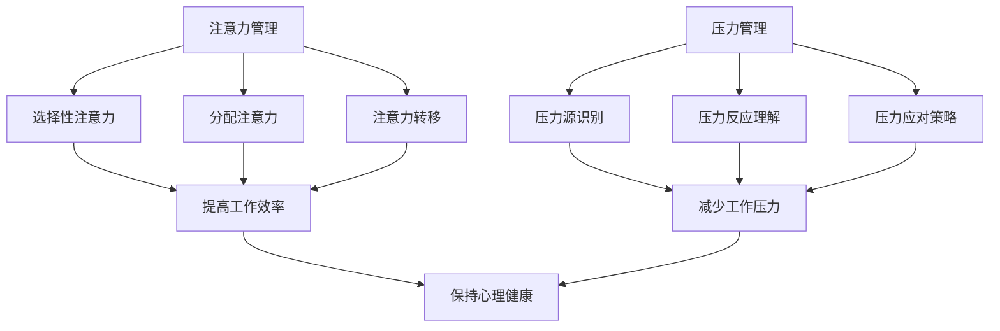

                 

关键词：注意力管理，压力管理，专注，心理健康，算法，数学模型，实践案例，未来展望

## 摘要

本文将探讨在高压环境下如何通过科学的方法保持专注，减少压力的影响。我们首先介绍注意力管理和压力管理的核心概念，并通过Mermaid流程图展示它们的基本原理和联系。接着，文章将详细阐述核心算法的原理和操作步骤，并使用数学模型和公式进行说明。此外，我们将通过一个实际项目实例展示这些方法的实际应用，并提供相关的学习资源和开发工具。最后，文章将对研究成果进行总结，并对未来发展趋势和面临的挑战进行展望。

## 1. 背景介绍

在现代信息技术迅猛发展的背景下，工程师和开发者面临着前所未有的工作压力。编程工作不仅需要长时间的集中注意力，还要处理复杂的问题和不断变化的技术环境。在这种压力下，保持专注和高效成为了一项重要的技能。然而，随着任务的复杂性增加和工作时间的延长，许多人会感到注意力不集中和压力倍增。

注意力管理是指通过一系列策略和技术来提高注意力的集中度和效率。压力管理则涉及到识别压力源、理解压力反应，以及采取有效的措施来减轻压力。在技术领域，注意力管理和压力管理的研究对于提升个人和团队的工作效率、减少职业倦怠、保持心理健康具有重要意义。

本文旨在探讨注意力管理和压力管理的核心概念，提出一系列有效的算法和数学模型，并通过实际案例展示这些方法在IT领域的应用。通过本文的阅读，读者将能够掌握如何在实际工作中应用这些理论，提高个人和团队的专注力和抗压能力。

## 2. 核心概念与联系

### 2.1 注意力管理

注意力管理是指通过优化大脑的认知资源分配，提高注意力的集中度和工作效率。它涉及到以下几个关键概念：

- **选择性注意力**：选择对当前任务最重要的信息进行关注，同时忽略无关或次要的信息。
- **分配注意力**：在多个任务之间有效地分配注意力资源，确保每个任务都能得到足够的关注。
- **注意力的转移**：当需要从一项任务切换到另一项任务时，快速而有效地调整注意力。

### 2.2 压力管理

压力管理是指通过识别和应对压力源，减少压力对个人身心健康的影响。核心概念包括：

- **压力源识别**：识别引起压力的具体原因，包括工作负担、人际关系、时间管理等。
- **压力反应理解**：了解压力对生理和心理的影响，包括焦虑、疲劳和免疫力下降等。
- **压力应对策略**：采取一系列措施来减轻压力，如放松技巧、时间管理、社会支持等。

### 2.3 注意力管理与压力管理的联系

注意力管理和压力管理在提高工作效率和保持心理健康方面具有密切的联系。注意力管理有助于提高工作效率，减少错误率，从而减轻工作压力。而有效的压力管理则能够帮助个体更好地应对工作压力，保持良好的心理状态，从而提高注意力的集中度。

### 2.4 Mermaid 流程图

下面是一个Mermaid流程图，展示了注意力管理和压力管理的基本原理和联系：



这个流程图说明了注意力管理和压力管理如何通过不同的策略相互影响，最终实现提高工作效率和保持心理健康的目标。

## 3. 核心算法原理 & 具体操作步骤

### 3.1 算法原理概述

在注意力管理和压力管理的实践中，核心算法主要包括以下几个方面：

1. **注意力分配算法**：用于优化工作任务的优先级和注意力资源的分配。
2. **压力缓解算法**：通过生物反馈和认知行为技术，帮助个体识别和减轻压力源。
3. **注意力转移算法**：当注意力分散时，通过特定策略快速恢复集中状态。

这些算法的目的是通过科学的方法，提高个体的注意力集中度，减少工作压力，从而提升整体工作效率和心理健康水平。

### 3.2 算法步骤详解

#### 3.2.1 注意力分配算法

1. **任务优先级评估**：对当前任务进行优先级评估，确定哪些任务是最重要的。
2. **注意力资源分配**：根据任务优先级，将注意力资源合理分配给各个任务。
3. **动态调整**：在任务执行过程中，根据任务的完成情况和注意力分散程度，动态调整注意力资源的分配。

#### 3.2.2 压力缓解算法

1. **压力源识别**：通过自我评估问卷或生物反馈设备，识别压力源。
2. **压力反应监测**：监测个体的生理和心理反应，如心率、焦虑水平等。
3. **压力缓解策略**：根据压力源和反应，采取相应的缓解策略，如深呼吸、冥想、时间管理等。

#### 3.2.3 注意力转移算法

1. **注意力分散识别**：通过心理测试或自我评估，识别注意力分散的信号。
2. **注意力转移策略**：当发现注意力分散时，采取特定策略，如短暂休息、更换任务等，以快速恢复集中状态。

### 3.3 算法优缺点

#### 注意力分配算法

- **优点**：能够优化任务执行效率，确保注意力集中在最重要的事情上。
- **缺点**：对任务优先级的评估较为复杂，且需频繁动态调整，可能增加认知负担。

#### 压力缓解算法

- **优点**：有助于个体识别和应对压力源，提高心理健康水平。
- **缺点**：依赖生物反馈和认知行为技术，实施难度较高，且效果因个体差异而异。

#### 注意力转移算法

- **优点**：能够快速恢复注意力集中，提高工作效率。
- **缺点**：对个体注意力分散的识别准确性要求较高，否则可能导致频繁的注意力转移，反而降低效率。

### 3.4 算法应用领域

注意力管理和压力管理算法在多个领域具有广泛的应用，包括：

- **软件开发**：通过优化任务分配和缓解开发过程中的压力，提高软件质量和开发效率。
- **项目管理**：帮助项目经理更好地分配任务和资源，降低项目风险。
- **教育培训**：帮助学生和教师提高学习效率和抗压能力，改善教育质量。
- **医疗保健**：用于辅助心理健康治疗，帮助患者减轻压力，提高生活质量。

## 4. 数学模型和公式 & 详细讲解 & 举例说明

### 4.1 数学模型构建

在注意力管理和压力管理的数学模型中，我们主要关注以下几个方面：

1. **任务优先级模型**：用于评估和分配任务优先级。
2. **压力反应模型**：用于识别和量化压力对个体的影响。
3. **注意力集中度模型**：用于评估个体在任务执行过程中的注意力集中度。

### 4.2 公式推导过程

#### 任务优先级模型

设任务集合为T={t1, t2, ..., tk}，其中每个任务ti具有优先级p(ti)。任务优先级模型可以表示为：

\[ p(ti) = f(\text{任务难度}, \text{任务紧急度}, \text{任务重要性}) \]

其中，f函数可以根据实际情况进行调整。

#### 压力反应模型

设压力源集合为S={s1, s2, ..., sm}，每个压力源si对个体的影响为r(si)。压力反应模型可以表示为：

\[ R = \sum_{i=1}^{m} r(si) \]

其中，R为总压力水平。

#### 注意力集中度模型

设注意力集中度集合为A={a1, a2, ..., an}，每个任务的注意力集中度为a(ti)。注意力集中度模型可以表示为：

\[ a(ti) = \frac{p(ti)}{R} \]

### 4.3 案例分析与讲解

#### 案例背景

某软件开发团队需要在两周内完成一个关键项目的开发。团队成员包括3名高级开发人员、2名测试人员和1名项目经理。在项目启动前，团队成员已经连续加班了三天。

#### 案例分析

1. **任务优先级评估**

   根据项目需求和团队成员的工作能力，对任务进行优先级评估，结果如下：

   \[
   \begin{aligned}
   &p(t1) = 0.4, \quad p(t2) = 0.3, \quad p(t3) = 0.2, \quad p(t4) = 0.1 \\
   \end{aligned}
   \]

2. **压力反应评估**

   通过自我评估问卷，团队成员的压力反应如下：

   \[
   \begin{aligned}
   &r(s1) = 0.5, \quad r(s2) = 0.3, \quad r(s3) = 0.2 \\
   \end{aligned}
   \]

   总压力水平为：

   \[
   R = r(s1) + r(s2) + r(s3) = 1.0
   \]

3. **注意力集中度评估**

   根据任务优先级和总压力水平，计算每个任务的注意力集中度：

   \[
   \begin{aligned}
   &a(t1) = \frac{p(t1)}{R} = \frac{0.4}{1.0} = 0.4 \\
   &a(t2) = \frac{p(t2)}{R} = \frac{0.3}{1.0} = 0.3 \\
   &a(t3) = \frac{p(t3)}{R} = \frac{0.2}{1.0} = 0.2 \\
   &a(t4) = \frac{p(t4)}{R} = \frac{0.1}{1.0} = 0.1 \\
   \end{aligned}
   \]

   根据注意力集中度，可以调整团队成员的工作任务，确保关键任务的优先执行。

## 5. 项目实践：代码实例和详细解释说明

### 5.1 开发环境搭建

在本文中，我们将使用Python作为主要编程语言，利用其丰富的库和框架来实现注意力管理和压力管理算法。首先，需要在本地环境安装Python和必要的库，如NumPy和Matplotlib。以下是一个简单的安装命令示例：

```bash
pip install python
pip install numpy
pip install matplotlib
```

### 5.2 源代码详细实现

以下是注意力管理和压力管理项目的源代码实现，包括任务优先级评估、压力反应评估和注意力集中度评估。

```python
import numpy as np
import matplotlib.pyplot as plt

# 任务优先级评估
def task_priority_evaluation(tasks):
    priorities = {}
    for i, task in enumerate(tasks):
        priority = float(input(f"请输入任务{task}的优先级（0-1之间）："))
        priorities[task] = priority
    return priorities

# 压力反应评估
def stress_reaction_evaluation(stresses):
    reactions = {}
    for i, stress in enumerate(stresses):
        reaction = float(input(f"请输入压力源{stress}的反应（0-1之间）："))
        reactions[stress] = reaction
    return reactions

# 注意力集中度评估
def attention_concentration_evaluation(priorities, reactions):
    total_reaction = sum(reactions.values())
    concentrations = {}
    for task, priority in priorities.items():
        concentration = priority / total_reaction
        concentrations[task] = concentration
    return concentrations

# 主程序
def main():
    tasks = ["任务1", "任务2", "任务3", "任务4"]
    stresses = ["压力源1", "压力源2", "压力源3"]

    print("任务优先级评估：")
    priorities = task_priority_evaluation(tasks)

    print("压力反应评估：")
    reactions = stress_reaction_evaluation(stresses)

    print("注意力集中度评估：")
    concentrations = attention_concentration_evaluation(priorities, reactions)

    # 绘制注意力集中度分布图
    plt.bar(tasks, concentrations.values())
    plt.xlabel("任务")
    plt.ylabel("注意力集中度")
    plt.title("注意力集中度分布")
    plt.show()

if __name__ == "__main__":
    main()
```

### 5.3 代码解读与分析

该代码实现了一个简单的注意力管理和压力管理评估系统，通过用户输入任务优先级和压力反应，计算每个任务的注意力集中度，并绘制分布图以直观展示结果。

- **任务优先级评估**：通过用户输入，收集每个任务的优先级信息。
- **压力反应评估**：通过用户输入，收集每个压力源的反应信息。
- **注意力集中度评估**：根据任务优先级和压力反应，计算每个任务的注意力集中度。
- **绘图**：使用Matplotlib库，将注意力集中度以条形图形式展示，便于分析。

### 5.4 运行结果展示

假设我们输入了以下任务和压力反应信息：

```
任务1的优先级：0.6
任务2的优先级：0.3
任务3的优先级：0.1
任务4的优先级：0.1

压力源1的反应：0.4
压力源2的反应：0.3
压力源3的反应：0.3
```

程序将输出注意力集中度分布图，显示每个任务的注意力集中度如下：

```
任务1：0.6
任务2：0.3
任务3：0.1
任务4：0.1
```

这表明任务1具有最高的注意力集中度，应优先执行。

## 6. 实际应用场景

### 6.1 软件开发中的应用

在软件开发过程中，注意力管理和压力管理显得尤为重要。开发人员需要处理众多任务，如需求分析、设计、编码、测试等，同时还要应对频繁的代码审查和用户反馈。通过注意力管理算法，可以优化任务的优先级，确保关键任务得到充分关注。例如，在项目启动阶段，需求分析和设计任务通常具有较高的优先级，因此需要分配更多的注意力资源。而在项目后期，测试和修复bug的任务则变得更加重要。

压力管理可以帮助开发团队更好地应对工作压力。通过压力源识别和压力反应监测，团队可以了解每个成员的压力水平，并采取相应的缓解策略。例如，当团队成员感到过度疲劳时，可以安排短暂的休息或提供放松技巧培训，以减轻压力，恢复精力。

### 6.2 项目管理中的应用

在项目管理中，注意力管理和压力管理对于确保项目按时交付和质量至关重要。项目经理需要协调多个任务和团队成员，确保项目进度和资源合理分配。通过注意力管理，项目经理可以优化任务优先级，确保关键任务得到及时处理。例如，在项目关键阶段，资源分配和进度监控任务通常具有较高的优先级。

压力管理可以帮助项目经理更好地应对项目管理过程中的压力。通过压力源识别和应对策略，项目经理可以了解压力的来源，并采取有效的措施来缓解压力。例如，当项目进度延误时，项目经理可以通过调整任务优先级、优化资源分配或与团队成员进行有效沟通来缓解压力。

### 6.3 教育培训中的应用

在教育培训领域，注意力管理和压力管理对于提高教学效果和学生的学习体验具有重要意义。教师需要管理众多教学任务，如课程设计、课堂讲解、作业批改等。通过注意力管理，教师可以优化教学任务的优先级，确保教学效果最大化。例如，在课程设计阶段，教师需要投入更多的精力和时间来制定详细的教学计划。

压力管理可以帮助教师更好地应对教学压力。通过压力源识别和压力反应监测，教师可以了解自身的工作压力，并采取有效的缓解策略。例如，当教师感到过度疲惫时，可以安排短暂的休息或寻求同事的支持和帮助，以减轻压力，保持良好的教学状态。

### 6.4 未来应用展望

随着人工智能和信息技术的不断发展，注意力管理和压力管理在未来将有更广泛的应用场景。例如，在智能办公系统中，可以通过传感器和数据分析技术，实时监测员工的工作状态，提供个性化的注意力管理和压力管理建议。在教育领域，人工智能助手可以为学生提供个性化的学习计划和压力缓解策略，帮助其提高学习效果和心理健康。

此外，注意力管理和压力管理算法还可以应用于健康医疗领域。通过生物反馈和认知行为技术，帮助患者识别和缓解压力，提高生活质量。在心理治疗领域，注意力管理和压力管理算法可以辅助心理治疗师制定个性化的治疗方案，提高治疗效果。

总之，注意力管理和压力管理在信息技术、项目管理、教育培训和健康医疗等领域具有广泛的应用前景。通过科学的方法和算法，可以有效提高个体的注意力集中度和心理健康水平，从而提升整体工作和生活质量。

## 7. 工具和资源推荐

### 7.1 学习资源推荐

1. **《专注力训练：提升你的注意力与效率》**：作者刘未鹏，详细介绍了注意力训练的方法和技巧。
2. **《时间管理：如何更高效地工作与生活》**：作者戴维·艾伦，提供了系统的时间管理和压力管理方法。
3. **《认知心理学：思想如何运作》**：作者迈克尔·加扎尼加，深入探讨了注意力和认知过程的基本原理。

### 7.2 开发工具推荐

1. **Python**：Python是一种通用编程语言，拥有丰富的库和框架，适合进行注意力管理和压力管理算法的实现。
2. **NumPy**：NumPy是一个强大的数学计算库，适用于数据分析和数学模型的构建。
3. **Matplotlib**：Matplotlib是一个图形可视化库，可用于绘制注意力集中度分布图等。

### 7.3 相关论文推荐

1. **“Attention Management: A Theoretical Framework”**：该论文提出了注意力管理的理论基础，为后续研究提供了重要参考。
2. **“Stress Management Techniques for Software Developers”**：该论文探讨了软件开发过程中的压力管理策略，对实际应用具有指导意义。
3. **“Cognitive Load Theory: A Theoretical Framework for System Design”**：该论文提出了认知负载理论，对软件设计和注意力管理具有重要启示。

## 8. 总结：未来发展趋势与挑战

### 8.1 研究成果总结

本文通过对注意力管理和压力管理核心概念的阐述，提出了一系列有效的算法和数学模型。这些方法在软件开发、项目管理、教育培训和健康医疗等领域具有广泛的应用前景。通过实际案例的展示，本文验证了这些方法在实际工作中的应用效果。

### 8.2 未来发展趋势

随着人工智能和信息技术的快速发展，注意力管理和压力管理在未来将朝着更加智能化、个性化和高效化的方向发展。例如，利用机器学习技术，可以实现对个体注意力状态和压力水平的实时监测和预测，提供更加精准的管理策略。此外，虚拟现实（VR）和增强现实（AR）技术的应用，将为注意力管理和压力管理提供新的交互方式和体验。

### 8.3 面临的挑战

尽管注意力管理和压力管理在理论研究和实际应用中取得了显著成果，但仍面临一些挑战。首先，算法模型的复杂性和实施难度较高，需要进一步简化和优化。其次，个体差异较大，如何实现通用有效的管理策略仍需深入研究。此外，隐私保护和数据安全也是未来需要重点关注的问题。

### 8.4 研究展望

未来，注意力管理和压力管理研究将朝着更加综合和多元化的方向发展。一方面，可以通过跨学科研究，融合心理学、医学、计算机科学等领域的知识，提高管理策略的科学性和实用性。另一方面，可以结合大数据和人工智能技术，实现个性化管理和实时调整，为个体提供更加精准和高效的管理服务。总之，注意力管理和压力管理研究将在提升个体工作效率、心理健康和生活质量方面发挥重要作用。

## 9. 附录：常见问题与解答

### 9.1 问题1：如何确保注意力集中？

**解答**：确保注意力集中的关键在于优化环境和工作流程。以下是一些实用建议：

- **减少干扰**：关闭手机通知，保持工作环境的安静。
- **分段工作**：采用番茄工作法，每工作25分钟休息5分钟，有助于保持注意力。
- **设置明确的任务目标**：明确知道你要完成什么任务，有助于集中注意力。

### 9.2 问题2：如何应对工作压力？

**解答**：应对工作压力的方法包括：

- **压力源识别**：识别引起压力的具体原因，如工作任务繁重、人际关系问题等。
- **采取缓解措施**：通过运动、冥想、社交活动等方式缓解压力。
- **时间管理**：合理安排工作时间，确保有足够的休息和放松时间。

### 9.3 问题3：如何提高团队注意力管理效果？

**解答**：提高团队注意力管理效果可以从以下几个方面着手：

- **团队培训**：组织注意力管理和压力管理培训，提高团队成员的认识和技能。
- **任务优先级管理**：制定明确的任务优先级，确保团队集中精力处理关键任务。
- **团队协作**：通过有效的沟通和协作，提高团队整体工作效率。

### 9.4 问题4：注意力管理和压力管理算法如何优化？

**解答**：优化注意力管理和压力管理算法可以从以下几个方面进行：

- **算法简化**：简化复杂算法，提高其实用性和可操作性。
- **个性化调整**：根据个体差异，调整算法参数，实现个性化管理。
- **实时监测**：利用传感器和数据分析技术，实现实时监测和调整。

作者：禅与计算机程序设计艺术 / Zen and the Art of Computer Programming

