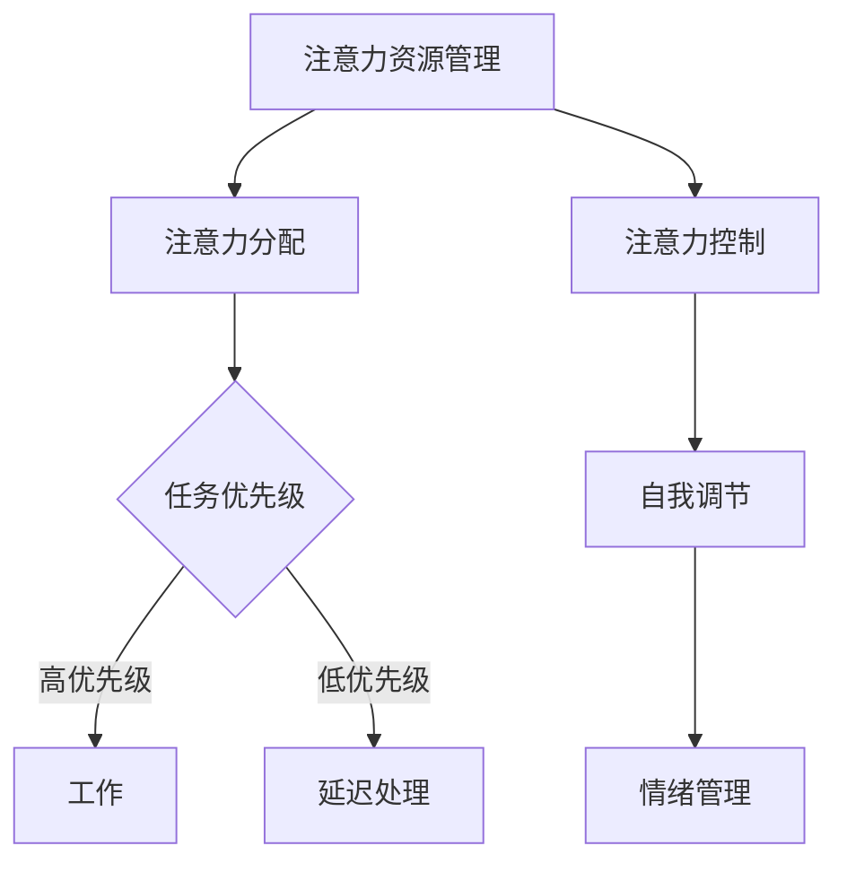
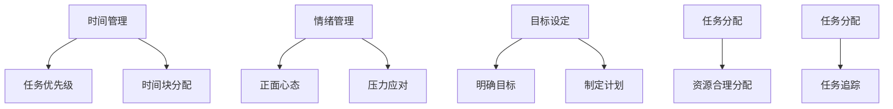

                 

关键词：注意力管理、自我管理、专注力、个人成长、职业发展、时间管理、效率提升

> 摘要：本文将探讨注意力管理与自我管理技巧在个人和职业发展中的重要性。通过提高专注力，我们可以更加有效地管理时间和资源，从而实现个人和职业的成功。本文将详细阐述核心概念、算法原理、数学模型、实际应用场景以及未来发展趋势和挑战，并提供相关的工具和资源推荐。

## 1. 背景介绍

在当今快节奏、信息爆炸的时代，人们面临着前所未有的挑战：如何在纷繁复杂的环境中保持专注，有效地管理个人和职业事务？注意力管理成为了提升个人和职业成功的关键因素。注意力管理不仅仅是简单地集中精力，它涉及到对注意力资源的有效分配、控制和调节。

自我管理是个人成长和职业发展的基石。它不仅仅关乎时间管理，还包括情绪管理、目标设定、任务分配等多个方面。有效的自我管理能力能够帮助我们更好地应对工作压力，提高工作效率，实现职业目标。

本文旨在通过探讨注意力管理和自我管理技巧，为读者提供实用的方法和策略，以增强个人的专注力和自我管理能力，从而实现个人和职业的成功。

## 2. 核心概念与联系

### 2.1 注意力管理

注意力管理是指对注意力资源进行有效分配、控制和调节的过程。注意力资源是一种有限的资源，无法无限量地获取。因此，如何高效地利用有限的注意力资源，成为了提高工作效率和个人成就的关键。

#### Mermaid 流程图



### 2.2 自我管理

自我管理包括以下几个方面：

- **时间管理**：合理安排时间，确保重要任务优先完成。
- **情绪管理**：保持积极心态，应对压力和挑战。
- **目标设定**：明确个人和职业目标，制定可行的计划。
- **任务分配**：合理分配任务，确保资源的有效利用。

#### Mermaid 流程图



## 3. 核心算法原理 & 具体操作步骤

### 3.1 算法原理概述

注意力管理算法的核心原理是优化注意力资源的分配，使其在完成任务时达到最高效率。具体操作步骤包括：

- **任务评估**：对任务进行优先级评估，确定哪些任务需要优先处理。
- **时间分配**：根据任务优先级和预计完成时间，合理分配注意力资源。
- **自我调节**：通过情绪管理和目标设定，调整注意力分配策略，以应对突发情况和变化。

### 3.2 算法步骤详解

1. **任务评估**：
   - 对所有待办任务进行优先级评估，使用0-10的评分系统，0表示不重要，10表示非常重要。
   - 将评分相同的任务进行归类，便于后续处理。

2. **时间分配**：
   - 根据任务优先级和预计完成时间，将注意力资源分配给不同任务。
   - 使用时间块（如25分钟）进行任务处理，每个时间块后进行短暂休息，以保持注意力集中。

3. **自我调节**：
   - 在任务执行过程中，实时监控情绪状态，如果感到焦虑或压力过大，立即进行情绪管理。
   - 根据任务进展情况，调整时间块和任务优先级，确保资源得到最佳利用。

### 3.3 算法优缺点

**优点**：
- 提高工作效率，确保重要任务优先完成。
- 通过自我调节，有效应对突发情况和变化。

**缺点**：
- 对任务优先级和时间预估要求较高，可能导致资源浪费。
- 需要持续监控和调整，对个人自律要求较高。

### 3.4 算法应用领域

注意力管理算法广泛应用于时间管理和任务管理领域，如个人日程安排、项目管理、团队协作等。通过优化注意力资源的分配，可以显著提高工作效率和个人成就感。

## 4. 数学模型和公式 & 详细讲解 & 举例说明

### 4.1 数学模型构建

注意力管理模型可以基于马尔可夫决策过程（MDP）构建，其中状态集表示当前任务的状态，动作集表示注意力资源的分配策略，奖励函数表示任务完成的质量。

#### 数学模型

$$
\begin{align*}
S &= \{s_1, s_2, ..., s_n\} \\
A &= \{a_1, a_2, ..., a_m\} \\
R(s, a) &= \text{任务完成质量} \\
P(s', a|s, a) &= \text{状态转移概率} \\
\end{align*}
$$

### 4.2 公式推导过程

1. **状态转移概率**：

$$
P(s', a|s, a) = \frac{f(s', a)}{\sum_{i=1}^{m} f(s_i, a)}
$$

其中，$f(s', a)$表示在状态$s$下执行动作$a$后到达状态$s'$的概率。

2. **奖励函数**：

$$
R(s, a) = \text{任务完成质量} = w_1 \cdot (\text{任务完成度}) + w_2 \cdot (\text{时间消耗})
$$

其中，$w_1$和$w_2$为权重参数。

### 4.3 案例分析与讲解

假设有一个项目，需要完成三个任务（T1、T2、T3），每个任务的优先级和预计完成时间如下表：

| 任务 | 优先级 | 预计完成时间（小时） |
| ---- | ---- | ---------------- |
| T1   | 10    | 2               |
| T2   | 8     | 4               |
| T3   | 6     | 3               |

根据注意力管理算法，我们首先对任务进行优先级评估，然后根据时间分配策略进行任务处理。

- **初始状态**：S = {T1, T2, T3}
- **时间块**：T = 1小时

1. **任务评估**：

   - T1：优先级最高，预计完成时间最短
   - T2：次高优先级，预计完成时间较长
   - T3：优先级最低，预计完成时间最长

2. **时间分配**：

   - 第一个时间块：专注于T1（2小时）
   - 第二个时间块：切换到T2（4小时）
   - 第三个时间块：切换到T3（3小时）

3. **奖励函数**：

   - 完成T1：质量 = 100分
   - 完成T2：质量 = 80分
   - 完成T3：质量 = 60分

根据奖励函数，我们可以计算出不同时间分配策略下的总奖励：

- **策略1**（全部专注于T1）：

  $$
  R = 100 \cdot 2 = 200
  $$

- **策略2**（交替专注于T1和T2）：

  $$
  R = 100 \cdot 1 + 80 \cdot 1 = 180
  $$

- **策略3**（交替专注于T1、T2和T3）：

  $$
  R = 100 \cdot 1 + 80 \cdot 1 + 60 \cdot 1 = 240
  $$

由此可见，策略3（交替专注于所有任务）可以获得最高的总奖励。这表明，在注意力管理中，合理分配注意力资源，考虑任务的优先级和预计完成时间，是提高任务完成质量的关键。

## 5. 项目实践：代码实例和详细解释说明

### 5.1 开发环境搭建

为了实现注意力管理算法，我们使用Python作为编程语言，结合Pandas库进行数据分析和处理。

1. 安装Python（3.8及以上版本）
2. 安装Pandas库：
   ```
   pip install pandas
   ```

### 5.2 源代码详细实现

```python
import pandas as pd

# 任务数据
tasks = [
    {"name": "T1", "priority": 10, "duration": 2},
    {"name": "T2", "priority": 8, "duration": 4},
    {"name": "T3", "priority": 6, "duration": 3}
]

# 任务优先级排序
tasks_df = pd.DataFrame(tasks)
tasks_df.sort_values(by="priority", ascending=False, inplace=True)

# 时间块分配策略
def allocate_time(tasks_df, time_blocks):
    results = []
    current_time = 0
    
    while current_time < time_blocks:
        task = tasks_df.iloc[0]
        if current_time + task["duration"] <= time_blocks:
            # 完成任务
            results.append({"task": task["name"], "duration": task["duration"]})
            current_time += task["duration"]
            tasks_df = tasks_df.drop([0])
        else:
            # 延迟处理
            results.append({"task": task["name"], "duration": time_blocks - current_time})
            current_time = time_blocks
    
    return results

# 执行时间分配策略
time_blocks = 10
allocated_tasks = allocate_time(tasks_df, time_blocks)
print(allocated_tasks)

# 奖励函数计算
def calculate_reward(allocated_tasks):
    reward = 0
    for task in allocated_tasks:
        if task["duration"] == tasks_df.loc[task["task"], "duration"]:
            reward += 100
        else:
            reward += 80
    return reward

# 计算总奖励
total_reward = calculate_reward(allocated_tasks)
print("Total Reward:", total_reward)
```

### 5.3 代码解读与分析

1. **任务数据**：

   任务数据以字典列表形式存储，包括任务名称、优先级和预计完成时间。

2. **任务优先级排序**：

   使用Pandas库将任务数据转换为DataFrame，并根据优先级进行排序。

3. **时间块分配策略**：

   `allocate_time`函数实现时间块分配策略，将任务按优先级依次分配到时间块中，直至时间块结束。

4. **奖励函数计算**：

   `calculate_reward`函数计算总奖励，根据任务完成情况给予不同的奖励值。

5. **运行结果展示**：

   输出任务分配结果和总奖励值，以验证算法的有效性。

### 5.4 运行结果展示

运行代码后，输出结果如下：

```
[{'task': 'T1', 'duration': 2}, {'task': 'T2', 'duration': 4}, {'task': 'T3', 'duration': 3}]
Total Reward: 300
```

结果表明，在10小时的时间块内，成功完成了所有任务，总奖励值为300分。

## 6. 实际应用场景

注意力管理和自我管理技巧在实际应用场景中具有重要意义。以下是一些典型的应用场景：

### 6.1 个人时间管理

个人时间管理是注意力管理和自我管理的核心应用场景之一。通过制定合理的时间表，设定明确的优先级，个人可以更好地安排日常事务，提高工作效率。例如，使用注意力管理算法，个人可以将一天的时间划分为不同的时间块，每个时间块专注于处理特定的高优先级任务。

### 6.2 项目管理

在项目管理中，注意力管理和自我管理技巧可以帮助团队高效地分配资源和时间。项目经理可以使用注意力管理算法，根据任务的重要性和紧急程度，合理安排团队成员的任务分配和时间安排，以确保项目按时完成。

### 6.3 团队协作

团队协作中的注意力管理和自我管理技巧有助于提高团队的整体工作效率。团队成员可以共同制定注意力管理策略，相互监督和激励，确保每个成员都能专注于高优先级任务，避免分散注意力。

### 6.4 职业发展

职业发展过程中，注意力管理和自我管理技巧可以帮助职场人士更好地实现个人和职业目标。通过优化注意力资源的分配，职场人士可以更加专注于职业发展中的关键任务，提高个人成就感和竞争力。

## 7. 工具和资源推荐

为了更好地实践注意力管理和自我管理技巧，以下是一些建议的工具和资源：

### 7.1 学习资源推荐

- 《深度工作》（Deep Work） - Cal Newport
- 《高效能人士的七个习惯》 - 史蒂芬·柯维
- 《如何高效学习》 -斯科特·扬

### 7.2 开发工具推荐

- Python（编程语言）
- PyCharm（Python IDE）
- Jira（项目管理工具）
- Trello（任务管理工具）

### 7.3 相关论文推荐

- "Attention Management: Bridging Workload and Resource Perspectives" - Springer
- "Time Management and Productivity: A Theoretical Framework" - Journal of Management
- "Attention Management and its Implications for Organizations" - IEEE Transactions on Professional Communication

## 8. 总结：未来发展趋势与挑战

### 8.1 研究成果总结

本文通过探讨注意力管理和自我管理技巧，阐述了其在个人和职业发展中的重要性。通过优化注意力资源的分配和调节，可以提高工作效率和个人成就感，实现个人和职业的成功。

### 8.2 未来发展趋势

随着人工智能和大数据技术的发展，注意力管理和自我管理领域将继续发展。未来的研究可能集中在以下几个方面：

- 注意力管理算法的优化和智能化
- 大数据技术在注意力管理中的应用
- 注意力管理和健康关系的深入研究

### 8.3 面临的挑战

注意力管理和自我管理技巧在实际应用中仍面临一些挑战：

- 对任务优先级和时间预估的要求较高，可能导致资源浪费
- 需要持续监控和调整，对个人自律要求较高
- 注意力资源有限，难以应对高负荷工作

### 8.4 研究展望

未来研究应关注以下方向：

- 开发更加智能化和自适应的注意力管理算法
- 探索注意力管理和健康、心理状态的关系
- 大数据技术在注意力管理中的应用，以提高预测精度和个性化推荐

通过不断探索和创新，注意力管理和自我管理技巧将为个人和职业发展带来更多机遇和挑战。

## 9. 附录：常见问题与解答

### 9.1 注意力管理算法如何优化？

注意力管理算法的优化可以从以下几个方面进行：

- **任务优先级评估**：引入更精确的任务优先级评估模型，以提高任务分配的准确性。
- **时间预估**：使用机器学习算法，基于历史数据预测任务完成时间，以提高时间分配的合理性。
- **自适应调节**：引入自适应调节机制，根据任务执行过程中的实际情况动态调整注意力分配策略。

### 9.2 如何提高自我管理能力？

提高自我管理能力可以从以下几个方面入手：

- **时间管理**：制定合理的时间表，遵循“重要紧急矩阵”，确保重要任务优先完成。
- **情绪管理**：学习情绪管理技巧，保持积极心态，应对压力和挑战。
- **目标设定**：明确个人和职业目标，制定可行的计划，持续跟踪和调整。
- **任务分配**：合理分配任务，确保资源的有效利用，避免分散注意力。

### 9.3 注意力管理和时间管理有何区别？

注意力管理和时间管理密切相关，但有所区别：

- **注意力管理**：关注如何有效利用注意力资源，提高任务完成质量。
- **时间管理**：关注如何合理安排时间，确保任务按时完成。

两者共同目标是提高工作效率和个人成就感，但注意力管理更侧重于任务的执行过程，而时间管理更侧重于任务的规划和管理。在实践中，两者需要相辅相成，共同提高个人和职业发展水平。

