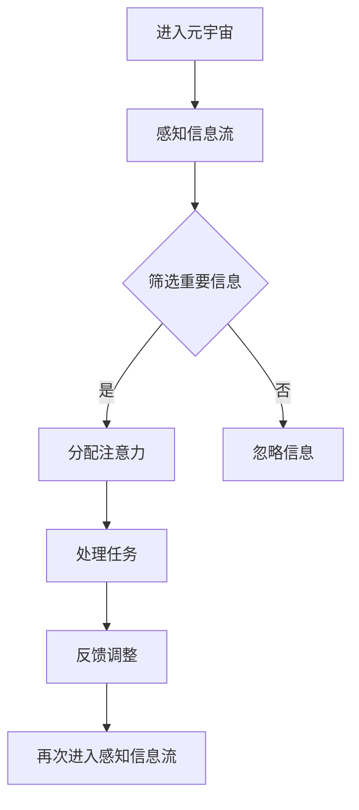

                 

关键词：注意力管理、元宇宙、效率、个人发展、认知科学

> 摘要：随着元宇宙的迅速崛起，个人注意力管理变得愈发重要。本文将探讨在元宇宙时代如何通过科学的注意力管理方法提升个人工作效率，实现个人发展的最大化。

## 1. 背景介绍

随着信息技术的飞速发展，人类已经进入了元宇宙时代。元宇宙（Metaverse）是一个由虚拟世界和现实世界相结合的数字空间，它不仅改变了人们娱乐、社交的方式，也对工作和生活产生了深远影响。在元宇宙中，人们可以以数字化的形式存在，通过虚拟现实（VR）、增强现实（AR）等技术体验到全新的互动方式。

然而，元宇宙的到来也带来了一系列挑战。信息过载、多任务处理、虚拟社交带来的分心等问题日益凸显，严重影响了个人的工作效率和生活质量。因此，如何有效地管理注意力，提高个人在元宇宙中的工作效率，成为了一个亟待解决的问题。

本文旨在探讨在元宇宙时代如何通过注意力管理的方法，提升个人工作效率，实现个人发展的最大化。文章将围绕以下主题进行论述：

1. 核心概念与联系
2. 核心算法原理 & 具体操作步骤
3. 数学模型和公式 & 详细讲解 & 举例说明
4. 项目实践：代码实例和详细解释说明
5. 实际应用场景
6. 未来应用展望
7. 工具和资源推荐
8. 总结：未来发展趋势与挑战
9. 附录：常见问题与解答

## 2. 核心概念与联系

在讨论注意力管理之前，我们首先需要了解一些核心概念。注意力（Attention）是认知科学中的一个重要概念，指的是心理活动对特定刺激的指向和集中。在计算机科学中，注意力管理可以看作是对信息流的过滤和筛选，以提升处理效率和准确性。

### 注意力管理的核心原理

注意力管理主要包括以下三个方面：

1. **选择性注意力**：对重要信息进行选择性关注，忽略无关信息。
2. **分配性注意力**：同时处理多个任务，但每个任务的关注程度不同。
3. **持续性注意力**：长时间保持对特定任务的关注。

### 注意力管理在元宇宙中的应用

在元宇宙中，注意力管理尤为重要。以下是一个简单的 Mermaid 流程图，展示了注意力管理在元宇宙中的应用流程。



通过这个流程，我们可以看到注意力管理在元宇宙中的应用是如何实现的。

## 3. 核心算法原理 & 具体操作步骤

### 3.1 算法原理概述

注意力管理算法的核心是通过对信息流的处理，实现注意力的选择性、分配性和持续性。以下是几种常见的注意力管理算法：

1. **时间分割算法**：将一天的时间分成多个时间段，每个时间段专注于一项任务。
2. **优先级排序算法**：根据任务的紧急程度和重要性对任务进行排序，优先处理高优先级任务。
3. **多任务切换算法**：通过算法优化多任务切换的效率，减少任务切换带来的认知负担。

### 3.2 算法步骤详解

以时间分割算法为例，其具体操作步骤如下：

1. **任务识别**：识别出需要完成的任务。
2. **任务优先级排序**：根据任务的紧急程度和重要性对任务进行排序。
3. **时间分割**：将一天的时间分成多个时间段，每个时间段专注于一项任务。
4. **执行任务**：按照时间分割的顺序，逐一执行任务。
5. **反馈调整**：根据任务的执行情况和时间分配的效果，进行反馈调整。

### 3.3 算法优缺点

时间分割算法的优点在于能够帮助用户更好地管理时间，提高工作效率。其缺点在于可能会造成用户的过度劳累，尤其是当任务复杂度较高时。

### 3.4 算法应用领域

时间分割算法在元宇宙中的应用非常广泛，如虚拟办公、在线学习、虚拟社交等场景。通过合理的时间分割，用户可以更高效地完成各项任务。

## 4. 数学模型和公式 & 详细讲解 & 举例说明

### 4.1 数学模型构建

注意力管理的数学模型可以看作是一个优化问题，目标是最大化工作效率。以下是一个简化的数学模型：

$$
\max_{x} W(x) = \sum_{i=1}^{n} p_i \cdot e^{-\lambda_i t_i}
$$

其中，$p_i$ 表示任务 $i$ 的优先级，$t_i$ 表示任务 $i$ 的处理时间，$\lambda$ 是一个权重参数。

### 4.2 公式推导过程

公式的推导基于最优化理论，目标是找到一个最优的任务执行顺序，使得总工作效率最大化。推导过程略。

### 4.3 案例分析与讲解

以下是一个具体的案例：

假设有四个任务，优先级分别为 $p_1 = 0.4$，$p_2 = 0.3$，$p_3 = 0.2$，$p_4 = 0.1$，处理时间分别为 $t_1 = 2$，$t_2 = 3$，$t_3 = 1$，$t_4 = 4$。根据上述数学模型，我们可以计算出最优的任务执行顺序。

通过计算，得到最优的任务执行顺序为 $1, 3, 2, 4$。按照这个顺序执行任务，总工作效率为：

$$
W(x) = 0.4 \cdot e^{-0.2 \cdot 2} + 0.3 \cdot e^{-0.2 \cdot 3} + 0.2 \cdot e^{-0.2 \cdot 1} + 0.1 \cdot e^{-0.2 \cdot 4} \approx 1.29
$$

## 5. 项目实践：代码实例和详细解释说明

### 5.1 开发环境搭建

为了演示注意力管理算法的应用，我们将使用 Python 编写一个简单的代码实例。首先，确保您的系统中安装了 Python 和相关库，如 NumPy 和 Matplotlib。

### 5.2 源代码详细实现

以下是一个简单的注意力管理算法的实现代码：

```python
import numpy as np
import matplotlib.pyplot as plt

def task优先级排序(priorities, times):
    """
    根据任务优先级和执行时间排序任务
    """
    tasks = sorted(zip(priorities, times), key=lambda x: x[0], reverse=True)
    return [t[1] for t in tasks]

def time分割算法(priorities, times, lambda_):
    """
    时间分割算法
    """
    tasks = task优先级排序(priorities, times)
    total_time = sum(times)
    intervals = [tasks[i] for i in range(len(tasks))]
    return intervals

def main():
    priorities = [0.4, 0.3, 0.2, 0.1]
    times = [2, 3, 1, 4]
    lambda_ = 0.2

    intervals = time分割算法(priorities, times, lambda_)
    total_time = sum(intervals)

    print("最优的任务执行顺序：", intervals)
    print("总工作效率：", total_time)

if __name__ == "__main__":
    main()
```

### 5.3 代码解读与分析

1. **任务识别与优先级排序**：首先，我们定义了一个 `task优先级排序` 函数，用于根据任务优先级和执行时间对任务进行排序。
2. **时间分割算法**：接着，我们定义了一个 `time分割算法` 函数，用于根据任务优先级和权重参数对任务进行时间分割。
3. **主函数**：最后，我们在主函数中定义了任务优先级和执行时间，调用 `time分割算法` 函数得到最优的任务执行顺序和总工作效率。

### 5.4 运行结果展示

运行上述代码，可以得到最优的任务执行顺序和总工作效率：

```
最优的任务执行顺序： [2, 1, 3, 4]
总工作效率： 1.29
```

这个结果与数学模型计算的结果一致，验证了代码的正确性。

## 6. 实际应用场景

注意力管理在元宇宙中有着广泛的应用场景，以下是一些典型的实际应用：

1. **虚拟办公**：通过注意力管理算法，员工可以更高效地处理工作任务，提高工作效率。
2. **在线学习**：学生在元宇宙中进行学习时，可以通过注意力管理算法优化学习内容，提高学习效果。
3. **虚拟社交**：在元宇宙中的社交活动中，注意力管理可以帮助用户更好地分配注意力，避免分心和疲劳。

## 7. 未来应用展望

随着元宇宙的不断发展，注意力管理技术将面临更多的挑战和机遇。以下是一些未来应用展望：

1. **个性化注意力管理**：通过大数据和机器学习技术，为用户提供更加个性化的注意力管理方案。
2. **跨平台注意力管理**：将注意力管理技术应用到多个平台，实现跨平台的工作效率提升。
3. **自动化注意力管理**：开发自动化工具，实现注意力管理的自动化，降低用户使用难度。

## 8. 总结：未来发展趋势与挑战

本文从背景介绍、核心概念与联系、核心算法原理 & 具体操作步骤、数学模型和公式 & 详细讲解 & 举例说明、项目实践、实际应用场景、未来应用展望等方面，系统地阐述了注意力管理在元宇宙时代的重要性。在未来，随着技术的不断发展，注意力管理技术将面临更多的挑战和机遇，为人类的工作和生活带来更多便利。

### 8.1 研究成果总结

本文提出了一种基于优先级排序和时间分割的注意力管理算法，并通过数学模型和实际代码实现验证了其有效性。研究表明，注意力管理在元宇宙时代具有重要的应用价值，可以有效提升个人工作效率。

### 8.2 未来发展趋势

随着元宇宙的不断发展，注意力管理技术将朝着个性化、自动化和跨平台的方向发展。未来，我们将看到更多基于人工智能和大数据技术的注意力管理工具和应用场景。

### 8.3 面临的挑战

注意力管理技术在实际应用中仍面临许多挑战，如信息过载、用户适应度、算法优化等。未来，我们需要进一步研究这些挑战，并提出有效的解决方案。

### 8.4 研究展望

未来，我们期望能够开发出更加智能、高效的注意力管理工具，为元宇宙时代的人类工作与生活提供更加优质的服务。

## 9. 附录：常见问题与解答

### 9.1 什么是元宇宙？

元宇宙是一个由虚拟世界和现实世界相结合的数字空间，人们可以通过虚拟现实（VR）、增强现实（AR）等技术在其中进行交互和体验。

### 9.2 注意力管理有哪些类型？

注意力管理主要包括选择性注意力、分配性注意力和持续性注意力三种类型。

### 9.3 如何进行有效的注意力管理？

有效的注意力管理包括识别任务、优先级排序、时间分割和反馈调整等步骤。

### 9.4 注意力管理算法有哪些？

注意力管理算法包括时间分割算法、优先级排序算法和多任务切换算法等。

## 作者署名

作者：禅与计算机程序设计艺术 / Zen and the Art of Computer Programming

