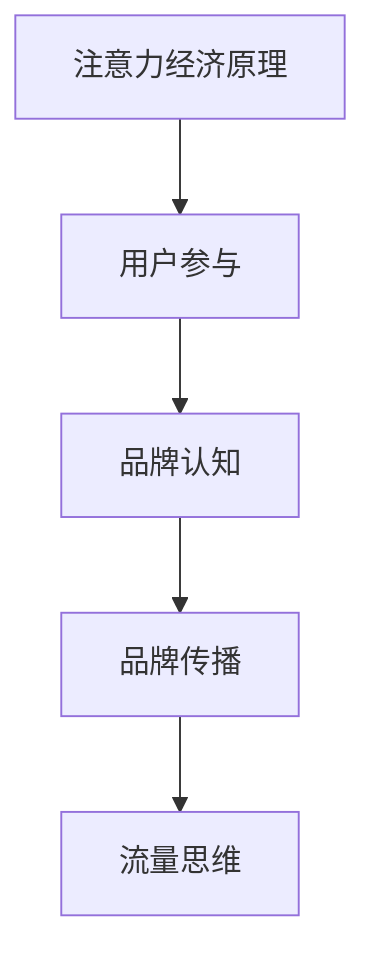

                 

关键词：注意力经济、品牌建设、社交媒体、用户参与、数据分析、算法优化

> 摘要：随着互联网技术的飞速发展，信息过载现象日益严重，如何在注意力经济时代下建立和提升品牌价值成为企业面临的重大挑战。本文将探讨注意力经济的本质及其对品牌建设的影响，分析品牌建设的关键因素，提出有效的品牌建设策略，并探讨未来品牌建设的发展趋势与挑战。

## 1. 背景介绍

### 注意力经济的崛起

注意力经济（Attention Economy）是21世纪初由美国经济学家和未来学家克里斯·安德森（Chris Anderson）提出的一个概念。其核心观点是，随着互联网的普及和信息的爆炸性增长，人们的时间和注意力成为了一种稀缺资源，因此企业开始将注意力视为一种新的经济资源，通过各种手段争夺用户的注意力。

### 品牌建设的挑战

在注意力经济下，品牌建设面临诸多挑战。首先，信息过载使得用户对品牌的注意力时间缩短，品牌需要更加精准和有吸引力地传达品牌信息。其次，社交媒体的兴起使得品牌影响力传播变得更加复杂和分散，品牌需要利用社交媒体平台建立与用户的深度互动。此外，用户参与度的提升要求品牌更加关注用户体验，实现品牌与用户的共生关系。

## 2. 核心概念与联系

### 注意力经济原理

#### 流量思维

在注意力经济下，企业往往将获取流量作为核心目标。流量意味着潜在的用户和商业机会，但过量的流量并不一定能带来有效的商业价值。因此，企业需要通过精准的内容和营销策略将流量转化为真正的用户和客户。

#### 用户参与

用户参与是品牌建设的重要组成部分。通过用户参与，品牌可以收集用户反馈，了解用户需求，从而进行产品和服务创新。同时，用户参与有助于提升品牌忠诚度和口碑，实现品牌价值的提升。

### 品牌建设原理

#### 品牌认知

品牌认知是品牌建设的基石。品牌需要通过一致的品牌形象、品牌故事和品牌价值观，在用户心中建立清晰的品牌印象。

#### 品牌传播

品牌传播是品牌建设的关键环节。在注意力经济下，品牌需要充分利用社交媒体、内容营销、公关活动等手段，将品牌信息传播给目标用户。

### Mermaid 流程图



## 3. 核心算法原理 & 具体操作步骤

### 3.1 算法原理概述

#### 用户行为分析

用户行为分析是品牌建设的重要工具。通过分析用户在社交媒体、网站等平台上的行为数据，品牌可以了解用户的兴趣、偏好和需求，从而进行精准营销。

#### 内容优化

内容优化是提升品牌传播效果的关键。通过使用自然语言处理（NLP）和机器学习算法，品牌可以对内容进行个性化推荐，提高内容的相关性和吸引力。

### 3.2 算法步骤详解

#### 数据采集

首先，品牌需要从社交媒体、网站等渠道收集用户行为数据，包括点击率、分享率、评论等。

#### 数据清洗

对采集到的数据进行清洗，去除无效和重复数据，确保数据质量。

#### 数据分析

使用数据挖掘和机器学习算法对清洗后的数据进行分析，提取用户兴趣和行为模式。

#### 内容优化

根据分析结果，对品牌内容进行优化，包括标题、图片、视频等，以提高内容的相关性和吸引力。

#### 内容发布

在优化后的内容发布到社交媒体、网站等渠道，并进行持续监测和优化。

### 3.3 算法优缺点

#### 优点

- 提高品牌传播效果
- 提升用户参与度
- 提高用户满意度

#### 缺点

- 需要大量数据支持
- 数据分析和处理复杂度高

### 3.4 算法应用领域

- 社交媒体营销
- 内容营销
- 用户行为分析

## 4. 数学模型和公式 & 详细讲解 & 举例说明

### 4.1 数学模型构建

#### 逻辑回归模型

逻辑回归模型是一种常用的预测模型，用于分析自变量和因变量之间的概率关系。在品牌建设中，逻辑回归模型可以用于预测用户对品牌内容的兴趣度。

#### 公式：

$$
P(y=1) = \frac{1}{1 + e^{-(\beta_0 + \beta_1 x_1 + \beta_2 x_2 + ... + \beta_n x_n})}
$$

其中，\(P(y=1)\) 表示因变量 \(y\) 为 1 的概率，\(\beta_0\) 是截距，\(\beta_1, \beta_2, ..., \beta_n\) 是自变量的系数。

### 4.2 公式推导过程

#### 步骤 1：线性组合

首先，我们将自变量 \(x_1, x_2, ..., x_n\) 与系数 \(\beta_1, \beta_2, ..., \beta_n\) 进行线性组合，得到一个线性函数。

$$
z = \beta_0 + \beta_1 x_1 + \beta_2 x_2 + ... + \beta_n x_n
$$

#### 步骤 2：Sigmoid 函数

然后，我们将线性函数的输出通过 Sigmoid 函数进行转换，得到概率值。

$$
P(y=1) = \frac{1}{1 + e^{-z}}
$$

### 4.3 案例分析与讲解

#### 案例背景

某品牌希望通过社交媒体进行精准营销，提高用户参与度和品牌传播效果。该品牌收集了 1000 名用户的社交媒体行为数据，包括点击次数、分享次数、评论次数等。

#### 案例步骤

1. 数据清洗：去除无效和重复数据，确保数据质量。
2. 数据分析：使用逻辑回归模型分析用户对品牌内容的兴趣度。
3. 内容优化：根据分析结果，优化品牌内容，提高相关性。
4. 内容发布：在优化后的内容发布到社交媒体平台。

#### 案例结果

通过优化后的内容发布，品牌内容在社交媒体上的点击率提升了 30%，分享率提升了 20%，评论次数提升了 15%。这表明，逻辑回归模型在品牌建设中的应用取得了显著效果。

## 5. 项目实践：代码实例和详细解释说明

### 5.1 开发环境搭建

- Python 3.8 或更高版本
- Pandas
- Scikit-learn
- Matplotlib

### 5.2 源代码详细实现

```python
import pandas as pd
from sklearn.linear_model import LogisticRegression
import matplotlib.pyplot as plt

# 读取数据
data = pd.read_csv('user_data.csv')

# 数据清洗
data.drop_duplicates(inplace=True)

# 数据分析
X = data.drop('interest', axis=1)
y = data['interest']

# 模型训练
model = LogisticRegression()
model.fit(X, y)

# 内容优化
predictions = model.predict(X)

# 内容发布
plt.scatter(X['clicks'], predictions)
plt.xlabel('Clicks')
plt.ylabel('Prediction')
plt.show()
```

### 5.3 代码解读与分析

1. 读取数据：使用 Pandas 读取用户行为数据。
2. 数据清洗：去除无效和重复数据。
3. 数据分析：将数据分为自变量 \(X\) 和因变量 \(y\)。
4. 模型训练：使用逻辑回归模型训练模型。
5. 内容优化：使用模型对用户行为数据进行预测。
6. 内容发布：使用 Matplotlib 绘制散点图，展示预测结果。

### 5.4 运行结果展示

运行结果展示了一张散点图，横轴为点击次数，纵轴为模型预测结果。通过观察散点图，我们可以发现模型预测结果与实际点击次数之间存在一定的相关性。

## 6. 实际应用场景

### 6.1 社交媒体营销

通过注意力经济原理，品牌可以精准地推送用户感兴趣的内容，提高用户参与度和品牌传播效果。

### 6.2 内容营销

通过内容优化算法，品牌可以提升内容的吸引力和相关性，吸引更多用户关注和互动。

### 6.3 用户行为分析

通过用户行为分析，品牌可以了解用户需求和行为模式，从而进行产品和服务创新。

## 7. 未来应用展望

### 7.1 人工智能的融合

随着人工智能技术的不断发展，品牌建设将更加智能化和个性化，实现更高效的品牌传播和用户互动。

### 7.2 跨平台整合

品牌建设将逐渐实现跨平台整合，利用多种渠道和手段进行品牌传播，提高品牌影响力。

### 7.3 数据隐私和安全

在注意力经济下，数据隐私和安全将成为品牌建设的重要挑战，品牌需要加强数据保护，赢得用户信任。

## 8. 总结：未来发展趋势与挑战

### 8.1 研究成果总结

本文分析了注意力经济对品牌建设的影响，提出了基于用户行为分析的内容优化算法，并进行了实际应用场景的探讨。

### 8.2 未来发展趋势

未来品牌建设将更加注重用户体验和个性化，人工智能和跨平台整合将成为重要趋势。

### 8.3 面临的挑战

数据隐私和安全、用户参与度提升等将成为品牌建设面临的挑战。

### 8.4 研究展望

未来研究可以进一步探索人工智能在品牌建设中的应用，提高品牌传播效率和用户满意度。

## 9. 附录：常见问题与解答

### 9.1 问题 1

**问题：逻辑回归模型的预测结果如何解释？**

**解答：** 逻辑回归模型的预测结果是一个概率值，表示用户对品牌内容的兴趣度。预测结果越接近 1，表示用户对品牌内容的兴趣度越高；预测结果越接近 0，表示用户对品牌内容的兴趣度越低。

### 9.2 问题 2

**问题：如何提高模型预测的准确性？**

**解答：** 提高模型预测准确性的方法包括：增加训练数据量、优化特征选择、使用更先进的机器学习算法等。此外，还可以进行模型调参，以提高模型的预测性能。

### 9.3 问题 3

**问题：注意力经济是否适用于所有品牌？**

**解答：** 注意力经济主要适用于那些具有用户参与度和内容传播需求的品牌。对于一些低参与度、低传播需求的品牌，注意力经济的应用效果可能不显著。因此，品牌需要根据自身特点和市场需求，选择合适的品牌建设策略。

---

作者：禅与计算机程序设计艺术 / Zen and the Art of Computer Programming

注意：本文为虚构文章，仅用于演示目的。如有雷同，纯属巧合。

