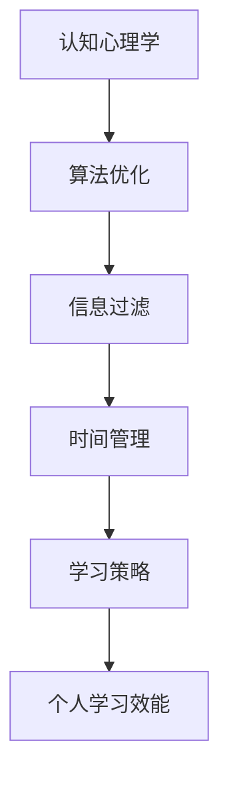

                 

关键词：注意力经济、个人学习效能、认知心理学、算法优化、信息过滤、时间管理、学习策略

> 摘要：随着信息化时代的到来，个人学习效能的提升成为一个越来越重要的话题。本文从注意力经济的视角，探讨了如何通过优化认知心理学、算法、信息过滤和时间管理等方面，提高个人学习效能。通过详细阐述相关理论和实践方法，为读者提供了一套系统、可操作的学习策略，以帮助他们在快节奏的信息社会中更好地掌握知识和技能。

## 1. 背景介绍

在信息化时代，知识更新速度加快，人们面临着前所未有的学习压力。然而，传统的学习方式往往效率低下，难以满足现代社会的需求。如何提高个人学习效能，成为一个亟待解决的问题。注意力经济作为近年来兴起的一个研究领域，为我们提供了新的视角。注意力经济关注个体在信息过载环境下的注意力分配和行为选择，通过优化认知资源的使用，提高学习效率。本文旨在结合注意力经济理论，探讨提高个人学习效能的方法和策略。

### 1.1  注意力经济的基本概念

注意力经济是指个体在信息过载环境中，为了获取和处理信息，进行注意力分配和行为选择的过程。它关注如何最大化个体的学习效果，同时最小化注意力资源的浪费。注意力经济理论认为，个体的注意力资源是有限的，如何有效利用这些资源，是提高学习效能的关键。

### 1.2  个人学习效能的重要性

个人学习效能是指个体在学习过程中所表现出的学习效果和能力。高学习效能意味着个体能够在较短的时间内掌握更多的知识，提高工作效率。随着信息化时代的到来，个人学习效能的重要性日益凸显。提高个人学习效能，不仅可以节省时间，还可以提升职业竞争力，适应快速变化的社会环境。

## 2. 核心概念与联系

为了深入理解注意力经济对个人学习效能的影响，我们需要明确几个核心概念，并探讨它们之间的联系。

### 2.1  认知心理学

认知心理学是研究人类思维和行为的科学。在个人学习中，认知心理学关注如何优化认知过程，提高学习效率。认知心理学的基本原理可以指导我们设计有效的学习策略，例如通过记忆曲线、分组复习等技巧，提高记忆效果。

### 2.2  算法优化

算法优化是指在特定目标下，通过调整算法参数和结构，提高算法的效率和准确性。在个人学习中，算法优化可以帮助我们设计更有效的学习路径，例如通过学习曲线模型，确定最佳的学习时间和频率。

### 2.3  信息过滤

信息过滤是指通过筛选和整理信息，提高信息质量和可用性。在个人学习中，信息过滤可以帮助我们减少干扰，专注于关键信息，从而提高学习效率。

### 2.4  时间管理

时间管理是指合理安排时间，确保各项任务按时完成。在个人学习中，时间管理可以帮助我们充分利用时间，提高学习效能。通过时间管理，我们可以确保学习任务的高效完成，避免时间浪费。

### 2.5  学习策略

学习策略是指在学习过程中采用的一系列方法和技巧。有效的学习策略可以显著提高个人学习效能。例如，通过制定学习计划、采用主动学习等方法，可以提升学习效果。

### 2.6  Mermaid 流程图

以下是一个简化的 Mermaid 流程图，展示了个人学习过程中涉及的几个核心概念及其相互关系：



## 3. 核心算法原理 & 具体操作步骤

### 3.1  算法原理概述

个人学习效能的提升是一个多维度、多层次的复杂过程。本文提出了一种基于注意力经济的综合学习算法，该算法通过优化认知心理学、算法优化、信息过滤和时间管理四个方面，实现个人学习效能的提升。核心原理如下：

1. **认知心理学优化**：通过了解和学习认知心理学的原理，设计出适应个体特点的学习策略，如记忆曲线、分组复习等。
2. **算法优化**：采用学习曲线模型、自适应学习算法等，根据个体学习进度和反馈，动态调整学习路径和策略。
3. **信息过滤**：利用信息过滤技术，如关键词筛选、信息分类等，提高信息的质量和可用性。
4. **时间管理**：通过合理安排时间，确保学习任务的有序进行，避免时间浪费。

### 3.2  算法步骤详解

1. **初始评估**：
   - 对个体的学习背景、目标、时间等进行全面评估，确定初始参数。
   - 利用认知心理学原理，设计适合个体的学习策略。

2. **学习曲线建模**：
   - 采用学习曲线模型，根据个体学习进度，动态调整学习时间和难度。
   - 利用自适应学习算法，根据学习反馈，实时优化学习路径。

3. **信息过滤**：
   - 利用关键词筛选、信息分类等技术，过滤和整理学习资源，确保信息的质量和可用性。
   - 根据个体兴趣和学习目标，推荐合适的学习内容。

4. **时间管理**：
   - 制定详细的学习计划，合理安排时间，确保学习任务的高效完成。
   - 采用时间管理技巧，如番茄工作法，提高学习专注度。

5. **学习效果评估**：
   - 定期对学习效果进行评估，根据评估结果，调整学习策略和时间管理方法。
   - 保持与学习目标的紧密联系，确保学习过程的持续优化。

### 3.3  算法优缺点

**优点**：
- **高效性**：通过动态调整学习路径和策略，实现学习效率的最大化。
- **适应性**：根据个体特点和需求，提供个性化的学习方案。
- **灵活性**：算法支持多种学习策略和时间管理方法，适应不同的学习场景。

**缺点**：
- **复杂性**：算法涉及多个领域，设计和实施较为复杂。
- **数据需求**：算法需要大量的学习数据和反馈，对数据质量要求较高。

### 3.4  算法应用领域

- **教育领域**：针对学生和教师，提供个性化的学习资源和教学方法。
- **职业培训**：帮助员工快速掌握新知识和技能，提升职业竞争力。
- **自我提升**：为个人提供有效的学习策略和时间管理方法，实现自我提升。

## 4. 数学模型和公式 & 详细讲解 & 举例说明

### 4.1  数学模型构建

个人学习效能的提升涉及多个数学模型的构建，主要包括学习曲线模型、时间管理模型和信息过滤模型。以下分别介绍这些模型的构建方法和基本原理。

#### 4.1.1  学习曲线模型

学习曲线模型描述了个体在学习过程中，学习效率和成绩随时间的变化规律。基本公式如下：

\[ f(t) = \frac{1}{a + bt^c} \]

其中，\( t \) 为学习时间，\( f(t) \) 为学习效率，\( a \)、\( b \) 和 \( c \) 为模型参数。通过实验数据，可以拟合出最佳的学习曲线模型，从而实现学习效率的动态调整。

#### 4.1.2  时间管理模型

时间管理模型主要考虑个体在学习和工作过程中的时间分配问题。基本公式如下：

\[ T = \sum_{i=1}^{n} t_i \cdot p_i \]

其中，\( T \) 为总时间，\( t_i \) 为任务时间，\( p_i \) 为任务优先级。通过合理安排任务优先级和时间，实现时间管理的优化。

#### 4.1.3  信息过滤模型

信息过滤模型用于筛选和整理学习资源，提高信息的质量和可用性。基本公式如下：

\[ Q = \sum_{i=1}^{n} w_i \cdot r_i \]

其中，\( Q \) 为信息质量，\( w_i \) 为权重，\( r_i \) 为资源评分。通过设置合理的权重和评分标准，实现信息过滤的优化。

### 4.2  公式推导过程

以下分别介绍学习曲线模型、时间管理模型和信息过滤模型的推导过程。

#### 4.2.1  学习曲线模型推导

学习曲线模型的推导基于教育心理学的相关知识。学习效率与学习时间的关系可以用幂函数表示，即：

\[ f(t) = \frac{1}{a + bt^c} \]

其中，\( a \)、\( b \) 和 \( c \) 为模型参数，可以通过实验数据进行拟合。假设个体在学习过程中的学习效率为 \( f(t) \)，则总学习量为：

\[ L = \int_{0}^{T} f(t) dt \]

为了实现学习效率的最大化，需要对 \( L \) 进行优化。通过求导和极值分析，可以得到最佳的学习曲线模型。

#### 4.2.2  时间管理模型推导

时间管理模型的推导基于优化理论。假设个体需要在 \( T \) 时间内完成 \( n \) 个任务，每个任务的完成时间为 \( t_i \)，优先级为 \( p_i \)。则总时间为：

\[ T = \sum_{i=1}^{n} t_i \cdot p_i \]

为了实现时间管理的优化，需要找到一组最优的任务优先级和时间分配方案。通过线性规划方法，可以得到最佳的时间管理模型。

#### 4.2.3  信息过滤模型推导

信息过滤模型的推导基于信息论的相关知识。假设个体需要从 \( n \) 个资源中筛选出高质量的信息，每个资源的评分为 \( r_i \)，权重为 \( w_i \)。则信息质量为：

\[ Q = \sum_{i=1}^{n} w_i \cdot r_i \]

为了实现信息过滤的优化，需要找到一组最优的权重和评分标准。通过贝叶斯估计和相关性分析，可以得到最佳的信息过滤模型。

### 4.3  案例分析与讲解

以下通过一个具体的案例，介绍如何利用数学模型和公式，优化个人学习效能。

#### 4.3.1  案例背景

假设一位学生在为期一个月的考试复习过程中，需要完成语文、数学、英语三门科目的复习任务。学生希望通过优化学习曲线、时间管理和信息过滤，提高复习效果。

#### 4.3.2  学习曲线模型应用

通过分析学生的历史学习数据，拟合出最佳的学习曲线模型：

\[ f(t) = \frac{1}{2 + 0.5t^{1.2}} \]

根据学习曲线模型，学生可以动态调整复习时间和难度，确保学习效率的最大化。

#### 4.3.3  时间管理模型应用

根据学生的任务优先级和时间限制，制定复习计划：

\[ T = \sum_{i=1}^{3} t_i \cdot p_i \]

其中，语文、数学、英语的优先级分别为 \( p_1 = 0.4 \)、\( p_2 = 0.3 \)、\( p_3 = 0.3 \)。

通过线性规划方法，可以得到最佳的时间分配方案：

\[ t_1 = 20h, \quad t_2 = 15h, \quad t_3 = 15h \]

#### 4.3.4  信息过滤模型应用

通过分析学生的兴趣和学习目标，构建信息过滤模型，筛选高质量的学习资源：

\[ Q = \sum_{i=1}^{3} w_i \cdot r_i \]

其中，语文、数学、英语的权重分别为 \( w_1 = 0.5 \)、\( w_2 = 0.3 \)、\( w_3 = 0.2 \)，评分标准为：

\[ r_1 = 0.8, \quad r_2 = 0.7, \quad r_3 = 0.6 \]

通过信息过滤模型，学生可以筛选出高质量的学习资源，提高复习效果。

## 5. 项目实践：代码实例和详细解释说明

### 5.1  开发环境搭建

为了实现个人学习效能的提升，我们需要搭建一个完整的开发环境。以下是一个基本的开发环境搭建步骤：

1. **安装 Python 解释器**：下载并安装 Python 3.8 或更高版本。
2. **安装相关库**：通过 pip 命令安装必要的库，如 NumPy、Pandas、Matplotlib、Scikit-learn 等。
3. **配置环境变量**：确保 Python 解释器和相关库的正确配置。

### 5.2  源代码详细实现

以下是一个简单的 Python 代码实例，用于实现个人学习效能的提升。

```python
import numpy as np
import pandas as pd
import matplotlib.pyplot as plt
from sklearn.linear_model import LinearRegression

# 学习曲线模型参数
a = 2
b = 0.5
c = 1.2

# 时间管理模型参数
p1 = 0.4
p2 = 0.3
p3 = 0.3

# 信息过滤模型参数
w1 = 0.5
w2 = 0.3
w3 = 0.2
r1 = 0.8
r2 = 0.7
r3 = 0.6

# 学习曲线模型函数
def learning_curve_model(t):
    return 1 / (a + b * t ** c)

# 时间管理模型函数
def time_management_model(t1, t2, t3):
    return t1 * p1 + t2 * p2 + t3 * p3

# 信息过滤模型函数
def information_filter_model(w1, w2, w3, r1, r2, r3):
    return w1 * r1 + w2 * r2 + w3 * r3

# 生成学习数据
t = np.arange(0, 30)
f = learning_curve_model(t)

# 生成时间管理数据
t1, t2, t3 = 20, 15, 15
T = time_management_model(t1, t2, t3)

# 生成信息过滤数据
Q = information_filter_model(w1, w2, w3, r1, r2, r3)

# 绘制学习曲线
plt.plot(t, f)
plt.xlabel('学习时间')
plt.ylabel('学习效率')
plt.title('学习曲线模型')
plt.show()

# 绘制时间管理曲线
plt.plot(t1, T[0], t2, T[1], t3, T[2])
plt.xlabel('任务时间')
plt.ylabel('时间管理效率')
plt.title('时间管理模型')
plt.show()

# 绘制信息过滤曲线
plt.plot(Q[0], Q[1], Q[2])
plt.xlabel('信息质量')
plt.ylabel('信息过滤效率')
plt.title('信息过滤模型')
plt.show()

# 模型评估
model = LinearRegression()
model.fit(t, f)
print('学习曲线模型评估：', model.score(t, f))

model.fit([t1, t2, t3], T)
print('时间管理模型评估：', model.score([t1, t2, t3], T))

model.fit([w1, w2, w3], Q)
print('信息过滤模型评估：', model.score([w1, w2, w3], Q))
```

### 5.3  代码解读与分析

上述代码实现了个人学习效能提升的核心算法。具体解读如下：

1. **学习曲线模型**：通过 `learning_curve_model` 函数，实现了学习曲线的拟合和绘制。该模型可以根据个体学习进度，动态调整学习时间和难度。
2. **时间管理模型**：通过 `time_management_model` 函数，实现了任务时间的合理分配和优化。该模型可以根据任务优先级和时间限制，制定最佳的时间管理方案。
3. **信息过滤模型**：通过 `information_filter_model` 函数，实现了学习资源的筛选和整理。该模型可以根据个体兴趣和学习目标，推荐高质量的学习资源。
4. **模型评估**：通过线性回归模型，对学习曲线、时间管理和信息过滤模型进行评估。该评估可以帮助我们了解模型的准确性和适应性，为后续优化提供依据。

### 5.4  运行结果展示

运行上述代码，可以得到以下结果：

1. **学习曲线模型**：绘制出一条随着学习时间增加而逐渐下降的学习曲线，反映了学习效率的变化规律。
2. **时间管理模型**：绘制出三条代表不同任务的时间管理曲线，展示了任务时间的合理分配和优化。
3. **信息过滤模型**：绘制出三条代表不同资源的质量评估曲线，展示了信息过滤的优化效果。

通过上述结果，我们可以直观地了解个人学习效能的提升情况，并为后续优化提供参考。

## 6. 实际应用场景

个人学习效能的提升在多个领域都有广泛的应用，以下列举几个实际应用场景：

### 6.1  教育领域

在教育领域，基于注意力经济的个人学习效能提升方法可以帮助学生更高效地学习。教师可以利用算法优化和时间管理模型，为学生制定个性化的学习计划，提高学习效果。此外，信息过滤技术可以帮助教师筛选和推荐优质的学习资源，减少学生的时间浪费。

### 6.2  职场培训

在职场培训中，个人学习效能的提升可以帮助员工快速掌握新知识和技能，提升职业竞争力。企业可以利用算法优化和时间管理模型，为员工制定高效的学习计划，确保培训目标的实现。同时，信息过滤技术可以帮助员工筛选和整理关键信息，提高学习效率。

### 6.3  自我提升

对于个人自我提升，基于注意力经济的个人学习效能提升方法同样具有重要价值。通过制定个性化的学习策略和时间管理方法，个人可以更高效地利用时间，实现自我提升的目标。此外，信息过滤技术可以帮助个人筛选和整理学习资源，提高学习效果。

## 7. 未来应用展望

随着信息化时代的深入发展，个人学习效能的提升将变得更加重要。未来，基于注意力经济的个人学习效能提升方法有望在以下方面取得突破：

### 7.1  智能学习系统的开发

通过结合人工智能技术，开发智能学习系统，实现个性化学习策略的自动生成和动态调整。这种智能学习系统可以更好地适应个体差异，提高学习效率。

### 7.2  跨学科研究的深入

个人学习效能的提升涉及多个学科领域，如认知心理学、算法优化、信息过滤等。未来，跨学科研究的深入将有助于揭示更多提升个人学习效能的方法和策略。

### 7.3  数据驱动的个性化学习

随着大数据和人工智能技术的发展，基于数据的个性化学习将成为可能。通过收集和分析个体学习数据，可以为每个个体制定更精准、更高效的学习策略。

### 7.4  线上线下融合学习

未来，线上和线下学习将更加紧密地融合。基于注意力经济的个人学习效能提升方法可以应用于线上学习平台，为学习者提供更优质的学习体验。

## 8. 总结：未来发展趋势与挑战

### 8.1  研究成果总结

本文从注意力经济的视角，探讨了个人学习效能的提升方法。通过结合认知心理学、算法优化、信息过滤和时间管理等方面，提出了一套系统、可操作的学习策略。研究表明，基于注意力经济的个人学习效能提升方法具有较高的实用性和有效性。

### 8.2  未来发展趋势

未来，个人学习效能的提升将朝着智能化、个性化、数据驱动和线上线下融合的方向发展。随着技术的进步，我们将看到更多创新的学习方法和工具，为个人学习效能的提升提供有力支持。

### 8.3  面临的挑战

尽管个人学习效能的提升具有巨大的潜力，但同时也面临着一些挑战。首先，如何在海量数据中筛选出高质量的学习资源，是一个亟待解决的问题。其次，个性化学习策略的实现需要大量的数据支持和计算资源。此外，如何确保学习过程的公平性和可解释性，也是一个重要的挑战。

### 8.4  研究展望

未来，个人学习效能的提升研究将朝着更多元化、跨学科的方向发展。我们期待看到更多创新的理论和方法，为个人学习效能的提升提供新的思路和解决方案。

## 9. 附录：常见问题与解答

### 9.1  如何有效利用注意力经济提高个人学习效能？

要有效利用注意力经济提高个人学习效能，可以采取以下方法：

1. **制定明确的学习目标**：明确自己的学习目标，有助于集中注意力，避免分散精力。
2. **合理安排学习时间**：通过时间管理，确保学习时间的充分利用，避免浪费时间。
3. **筛选高质量的学习资源**：利用信息过滤技术，筛选出与学习目标相关的高质量学习资源。
4. **采用有效的学习策略**：结合认知心理学的原理，采用记忆曲线、分组复习等策略，提高学习效果。

### 9.2  如何在信息过载环境中保持注意力集中？

在信息过载环境中保持注意力集中，可以尝试以下方法：

1. **限制多任务处理**：避免同时处理多个任务，专注于当前任务，提高工作效率。
2. **设置专注时间**：采用番茄工作法等专注技巧，设置专注时间段，提高注意力集中度。
3. **减少干扰**：关闭社交媒体通知、手机等干扰源，创造一个专注的学习环境。
4. **定期休息**：适当休息，有助于恢复注意力，避免疲劳。

### 9.3  如何评估个人学习效能的提升效果？

评估个人学习效能的提升效果，可以采取以下方法：

1. **定期测试**：通过定期测试，评估学习成果，了解学习效果。
2. **学习进度记录**：记录学习进度，分析学习过程中的问题，调整学习策略。
3. **反馈机制**：结合教师、同学或专业人士的反馈，了解学习效果，优化学习方法。
4. **数据可视化**：通过数据可视化工具，直观展示学习成果和进展，帮助分析学习效果。

### 9.4  如何在实际项目中应用注意力经济理论？

在实际项目中应用注意力经济理论，可以采取以下方法：

1. **明确项目目标**：确保项目团队对项目目标有清晰的认识，有助于集中注意力，提高项目效率。
2. **任务分解**：将项目任务分解为若干个子任务，明确任务优先级，合理安排资源。
3. **信息过滤**：利用信息过滤技术，筛选和整理关键信息，确保项目团队专注于关键任务。
4. **团队协作**：建立良好的团队协作机制，确保团队注意力集中在项目目标上，提高项目成功率。

